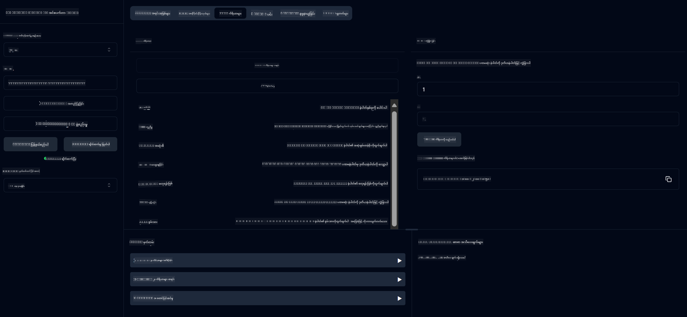

<!--
CO_OP_TRANSLATOR_METADATA:
{
  "original_hash": "13231e9951b68efd9df8c56bd5cdb27e",
  "translation_date": "2025-07-13T22:32:33+00:00",
  "source_file": "03-GettingStarted/samples/java/calculator/README.md",
  "language_code": "my"
}
-->
# Basic Calculator MCP Service

ဤဝန်ဆောင်မှုသည် Model Context Protocol (MCP) ကို အသုံးပြု၍ Spring Boot နှင့် WebFlux သယ်ယူပို့ဆောင်မှုဖြင့် အခြေခံ ကိန်းဂဏန်းတွက်ချက်မှုများကို ပံ့ပိုးပေးသည်။ MCP အကောင်အထည်ဖော်မှုများကို သင်ယူနေသော စတင်သူများအတွက် ရိုးရှင်းသော ဥပမာအဖြစ် ဒီဇိုင်းရေးဆွဲထားသည်။

အသေးစိတ်အချက်အလက်များအတွက် [MCP Server Boot Starter](https://docs.spring.io/spring-ai/reference/api/mcp/mcp-server-boot-starter-docs.html) ကို ကြည့်ရှုနိုင်ပါသည်။

## အနှစ်ချုပ်

ဝန်ဆောင်မှုတွင် ပါဝင်သော အချက်များမှာ -
- SSE (Server-Sent Events) ကို ပံ့ပိုးမှု
- Spring AI ၏ `@Tool` အမှတ်အသားဖြင့် အလိုအလျောက် ကိရိယာမှတ်ပုံတင်ခြင်း
- အခြေခံ ကိန်းဂဏန်းတွက်ချက်မှုများ
  - ပေါင်းခြင်း၊ ဖြုတ်ခြင်း၊ မြှောက်ခြင်း၊ ခွဲခြင်း
  - အဆင့်မြှင့်တွက်ချက်မှုများ (ပါဝါနှင့် စတုရန်းမြစ်)
  - မော်ဒူလပ် (ကျန်) နှင့် အပြည့်အစုံတန်ဖိုး
  - လုပ်ဆောင်ချက်ဖော်ပြချက်များအတွက် အကူအညီလုပ်ဆောင်ချက်

## လက္ခဏာများ

ဤ ကိန်းဂဏန်းတွက်ချက်မှု ဝန်ဆောင်မှုတွင် ပါဝင်သော လုပ်ဆောင်ချက်များမှာ -

1. **အခြေခံ သင်္ချာဆိုင်ရာ လုပ်ဆောင်ချက်များ**:
   - နံပါတ်နှစ်ခု ပေါင်းခြင်း
   - နံပါတ်တစ်ခုကို နံပါတ်တစ်ခုမှ ဖြုတ်ခြင်း
   - နံပါတ်နှစ်ခု မြှောက်ခြင်း
   - နံပါတ်တစ်ခုကို နံပါတ်တစ်ခုဖြင့် ခွဲခြင်း (သုညဖြင့် ခွဲခြင်းစစ်ဆေးမှုပါဝင်သည်)

2. **အဆင့်မြင့် လုပ်ဆောင်ချက်များ**:
   - ပါဝါတွက်ချက်ခြင်း (အခြေခံနံပါတ်ကို အဆင့်မြှောက်ခြင်း)
   - စတုရန်းမြစ်တွက်ချက်ခြင်း (အနုတ်နံပါတ်စစ်ဆေးမှုပါဝင်သည်)
   - မော်ဒူလပ် (ကျန်) တွက်ချက်ခြင်း
   - အပြည့်အစုံတန်ဖိုး တွက်ချက်ခြင်း

3. **အကူအညီ စနစ်**:
   - ရနိုင်သော လုပ်ဆောင်ချက်များအားလုံးကို ရှင်းလင်းပြသသည့် အကူအညီလုပ်ဆောင်ချက် ပါဝင်သည်

## ဝန်ဆောင်မှု အသုံးပြုခြင်း

ဝန်ဆောင်မှုသည် MCP protocol မှတဆင့် အောက်ပါ API အချက်အလက်များကို ဖော်ပြထားသည် -

- `add(a, b)`: နံပါတ်နှစ်ခု ပေါင်းခြင်း
- `subtract(a, b)`: ဒုတိယနံပါတ်ကို ပထမနံပါတ်မှ ဖြုတ်ခြင်း
- `multiply(a, b)`: နံပါတ်နှစ်ခု မြှောက်ခြင်း
- `divide(a, b)`: ပထမနံပါတ်ကို ဒုတိယနံပါတ်ဖြင့် ခွဲခြင်း (သုညစစ်ဆေးမှုပါဝင်သည်)
- `power(base, exponent)`: နံပါတ်၏ ပါဝါတွက်ချက်ခြင်း
- `squareRoot(number)`: စတုရန်းမြစ်တွက်ချက်ခြင်း (အနုတ်နံပါတ်စစ်ဆေးမှုပါဝင်သည်)
- `modulus(a, b)`: ခွဲပြီးကျန်သော တန်ဖိုးတွက်ချက်ခြင်း
- `absolute(number)`: အပြည့်အစုံတန်ဖိုးတွက်ချက်ခြင်း
- `help()`: ရနိုင်သော လုပ်ဆောင်ချက်များအကြောင်း အချက်အလက်ရယူခြင်း

## စမ်းသပ်ဖောက်သည်

`com.microsoft.mcp.sample.client` package တွင် ရိုးရှင်းသော စမ်းသပ်ဖောက်သည် ပါဝင်သည်။ `SampleCalculatorClient` class သည် ကိန်းဂဏန်းတွက်ချက်မှု ဝန်ဆောင်မှု၏ ရနိုင်သော လုပ်ဆောင်ချက်များကို ပြသသည်။

## LangChain4j Client အသုံးပြုခြင်း

ပရောဂျက်တွင် `com.microsoft.mcp.sample.client.LangChain4jClient` တွင် LangChain4j ဥပမာ client ပါဝင်ပြီး ကိန်းဂဏန်းတွက်ချက်မှု ဝန်ဆောင်မှုကို LangChain4j နှင့် GitHub မော်ဒယ်များနှင့် ပေါင်းစပ်အသုံးပြုနည်းကို ပြသသည်။

### မတိုင်မီ လိုအပ်ချက်များ

1. **GitHub Token ပြင်ဆင်ခြင်း**:

   GitHub ၏ AI မော်ဒယ်များ (phi-4 ကဲ့သို့) ကို အသုံးပြုရန် GitHub ကိုယ်ပိုင် access token လိုအပ်သည်။

   a. သင့် GitHub အကောင့် ဆက်တင်များသို့ သွားပါ: https://github.com/settings/tokens

   b. "Generate new token" → "Generate new token (classic)" ကို နှိပ်ပါ

   c. Token အမည်ကို ဖော်ပြပါ

   d. အောက်ပါ scopes များကို ရွေးချယ်ပါ -
      - `repo` (ပုဂ္ဂလိက repository များအပြည့်အဝထိန်းချုပ်ခွင့်)
      - `read:org` (အဖွဲ့အစည်းနှင့် အဖွဲ့ဝင်အချက်အလက်ဖတ်ခွင့်၊ အဖွဲ့အစည်းပရောဂျက်ဖတ်ခွင့်)
      - `gist` (gist ဖန်တီးခွင့်)
      - `user:email` (အသုံးပြုသူ အီးမေးလ်လိပ်စာများ ဖတ်ခွင့် (ဖတ်-only))

   e. "Generate token" ကို နှိပ်ပြီး token ကို ကူးယူပါ

   f. ပတ်ဝန်းကျင် အပြောင်းအလဲအဖြစ် သတ်မှတ်ပါ -

      Windows တွင်:
      ```
      set GITHUB_TOKEN=your-github-token
      ```

      macOS/Linux တွင်:
      ```bash
      export GITHUB_TOKEN=your-github-token
      ```

   g. အမြဲတမ်းသတ်မှတ်ရန် စနစ်ဆက်တင်များမှ ပတ်ဝန်းကျင် အပြောင်းအလဲများထည့်သွင်းပါ

2. LangChain4j GitHub dependency ကို ပရောဂျက်တွင် ထည့်သွင်းပါ (pom.xml တွင် ရှိပြီးဖြစ်သည်) -
   ```xml
   <dependency>
       <groupId>dev.langchain4j</groupId>
       <artifactId>langchain4j-github</artifactId>
       <version>${langchain4j.version}</version>
   </dependency>
   ```

3. ကိန်းဂဏန်းတွက်ချက်မှု server ကို `localhost:8080` တွင် လည်ပတ်နေသည်ကို သေချာစေပါ

### LangChain4j Client ကို လည်ပတ်ခြင်း

ဤဥပမာသည် -
- SSE သယ်ယူပို့ဆောင်မှုဖြင့် ကိန်းဂဏန်း MCP server နှင့် ချိတ်ဆက်ခြင်း
- LangChain4j ကို အသုံးပြု၍ ကိန်းဂဏန်း လုပ်ဆောင်ချက်များကို အသုံးပြုသော chat bot ဖန်တီးခြင်း
- GitHub AI မော်ဒယ်များနှင့် ပေါင်းစပ်ခြင်း (ယခု phi-4 မော်ဒယ် အသုံးပြုနေသည်)

Client သည် အောက်ပါ စမ်းသပ်မေးခွန်းများကို ပို့ပြီး လုပ်ဆောင်ချက်များကို ပြသသည် -
1. နံပါတ်နှစ်ခု ပေါင်းခြင်း
2. နံပါတ်တစ်ခု၏ စတုရန်းမြစ် ရှာဖွေခြင်း
3. ရနိုင်သော ကိန်းဂဏန်း လုပ်ဆောင်ချက်များအကြောင်း အကူအညီ ရယူခြင်း

ဥပမာကို လည်ပတ်ပြီး console output တွင် AI မော်ဒယ်က ကိန်းဂဏန်းကိရိယာများကို မေးခွန်းများအတွက် မည်သို့ အသုံးပြုသည်ကို ကြည့်ရှုနိုင်ပါသည်။

### GitHub Model ဖွဲ့စည်းမှု

LangChain4j client သည် GitHub ၏ phi-4 မော်ဒယ်ကို အောက်ပါ ဆက်တင်များဖြင့် အသုံးပြုရန် ဖွဲ့စည်းထားသည် -

```java
ChatLanguageModel model = GitHubChatModel.builder()
    .apiKey(System.getenv("GITHUB_TOKEN"))
    .timeout(Duration.ofSeconds(60))
    .modelName("phi-4")
    .logRequests(true)
    .logResponses(true)
    .build();
```

အခြား GitHub မော်ဒယ်များကို အသုံးပြုလိုပါက `modelName` parameter ကို အခြားထောက်ခံထားသော မော်ဒယ်အမည် (ဥပမာ - "claude-3-haiku-20240307", "llama-3-70b-8192" စသည်) သို့ ပြောင်းလဲနိုင်သည်။

## မူလပစ္စည်းများ

ပရောဂျက်တွင် လိုအပ်သော အဓိက မူလပစ္စည်းများမှာ -

```xml
<!-- For MCP Server -->
<dependency>
    <groupId>org.springframework.ai</groupId>
    <artifactId>spring-ai-starter-mcp-server-webflux</artifactId>
</dependency>

<!-- For LangChain4j integration -->
<dependency>
    <groupId>dev.langchain4j</groupId>
    <artifactId>langchain4j-mcp</artifactId>
    <version>${langchain4j.version}</version>
</dependency>

<!-- For GitHub models support -->
<dependency>
    <groupId>dev.langchain4j</groupId>
    <artifactId>langchain4j-github</artifactId>
    <version>${langchain4j.version}</version>
</dependency>
```

## ပရောဂျက် တည်ဆောက်ခြင်း

Maven ကို အသုံးပြု၍ ပရောဂျက်ကို တည်ဆောက်ပါ -
```bash
./mvnw clean install -DskipTests
```

## Server လည်ပတ်ခြင်း

### Java အသုံးပြုခြင်း

```bash
java -jar target/calculator-server-0.0.1-SNAPSHOT.jar
```

### MCP Inspector အသုံးပြုခြင်း

MCP Inspector သည် MCP ဝန်ဆောင်မှုများနှင့် အပြန်အလှန် ဆက်သွယ်ရန် အထောက်အကူပြု ကိရိယာဖြစ်သည်။ ဤ ကိန်းဂဏန်းဝန်ဆောင်မှုနှင့် အသုံးပြုရန် -

1. **MCP Inspector ကို တပ်ဆင်ပြီး လည်ပတ်ပါ** (terminal အသစ်တွင်) -
   ```bash
   npx @modelcontextprotocol/inspector
   ```

2. **web UI ကို ဝင်ရောက်ရန်** app မှ ပြသသော URL ကို နှိပ်ပါ (ပုံမှန်အားဖြင့် http://localhost:6274)

3. **ချိတ်ဆက်မှုကို ဖွဲ့စည်းပါ** -
   - သယ်ယူပို့ဆောင်မှု အမျိုးအစားကို "SSE" သတ်မှတ်ပါ
   - သင့် server ၏ SSE endpoint URL ကို `http://localhost:8080/sse` အဖြစ် သတ်မှတ်ပါ
   - "Connect" ကို နှိပ်ပါ

4. **ကိရိယာများကို အသုံးပြုပါ** -
   - "List Tools" ကို နှိပ်၍ ရနိုင်သော ကိရိယာများကို ကြည့်ရှုပါ
   - ကိရိယာတစ်ခုကို ရွေးပြီး "Run Tool" ကို နှိပ်၍ လုပ်ဆောင်ချက် တစ်ခုကို လုပ်ဆောင်ပါ



### Docker အသုံးပြုခြင်း

ပရောဂျက်တွင် container deployment အတွက် Dockerfile ပါဝင်သည် -

1. **Docker image ကို တည်ဆောက်ပါ** -
   ```bash
   docker build -t calculator-mcp-service .
   ```

2. **Docker container ကို လည်ပတ်ပါ** -
   ```bash
   docker run -p 8080:8080 calculator-mcp-service
   ```

ဤအတိုင်း -
- Maven 3.9.9 နှင့် Eclipse Temurin 24 JDK အသုံးပြု၍ multi-stage Docker image တည်ဆောက်မည်
- အကောင်းဆုံး optimized container image ဖန်တီးမည်
- ဝန်ဆောင်မှုကို port 8080 တွင် ဖော်ပြမည်
- MCP ကိန်းဂဏန်းတွက်ချက်မှု ဝန်ဆောင်မှုကို container အတွင်း စတင်မည်

Container လည်ပတ်နေစဉ် `http://localhost:8080` တွင် ဝန်ဆောင်မှုကို ဝင်ရောက်အသုံးပြုနိုင်ပါသည်။

## ပြဿနာဖြေရှင်းခြင်း

### GitHub Token နှင့် ပတ်သက်သော ပုံမှန်ပြဿနာများ

1. **Token ခွင့်ပြုချက် ပြဿနာများ**: 403 Forbidden အမှားရပါက token ၏ ခွင့်ပြုချက်များကို မတိကျမှုရှိမရှိ စစ်ဆေးပါ။

2. **Token မတွေ့ရှိခြင်း**: "No API key found" အမှားရပါက GITHUB_TOKEN ပတ်ဝန်းကျင် အပြောင်းအလဲမှန်ကန်စွာ သတ်မှတ်ထားမှုရှိမရှိ စစ်ဆေးပါ။

3. **Rate Limiting**: GitHub API တွင် rate limit ရှိသည်။ 429 status code error ရပါက မိနစ်အနည်းငယ် စောင့်ပြီး ထပ်မံကြိုးစားပါ။

4. **Token သက်တမ်းကုန်ဆုံးခြင်း**: GitHub token များ သက်တမ်းကုန်နိုင်သည်။ အချိန်ကြာပြီးနောက် authentication error ရပါက token အသစ် ဖန်တီးပြီး ပတ်ဝန်းကျင် အပြောင်းအလဲကို ပြင်ဆင်ပါ။

ထပ်မံအကူအညီလိုပါက [LangChain4j documentation](https://github.com/langchain4j/langchain4j) သို့မဟုတ် [GitHub API documentation](https://docs.github.com/en/rest) ကို ကြည့်ရှုနိုင်ပါသည်။

**အကြောင်းကြားချက်**  
ဤစာတမ်းကို AI ဘာသာပြန်ဝန်ဆောင်မှု [Co-op Translator](https://github.com/Azure/co-op-translator) ဖြင့် ဘာသာပြန်ထားပါသည်။ ကျွန်ုပ်တို့သည် တိကျမှန်ကန်မှုအတွက် ကြိုးစားသော်လည်း အလိုအလျောက် ဘာသာပြန်ခြင်းတွင် အမှားများ သို့မဟုတ် မှားယွင်းချက်များ ပါဝင်နိုင်ကြောင်း သတိပြုပါရန် မေတ္တာရပ်ခံအပ်ပါသည်။ မူရင်းစာတမ်းကို မိမိဘာသာစကားဖြင့်သာ တရားဝင်အချက်အလက်အဖြစ် ယူဆသင့်ပါသည်။ အရေးကြီးသော အချက်အလက်များအတွက် လူ့ပညာရှင်များ၏ ပရော်ဖက်ရှင်နယ် ဘာသာပြန်ခြင်းကို အကြံပြုပါသည်။ ဤဘာသာပြန်ချက်ကို အသုံးပြုရာမှ ဖြစ်ပေါ်လာနိုင်သည့် နားလည်မှုမှားယွင်းမှုများအတွက် ကျွန်ုပ်တို့သည် တာဝန်မခံပါ။