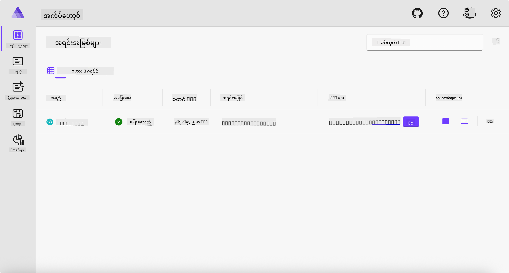
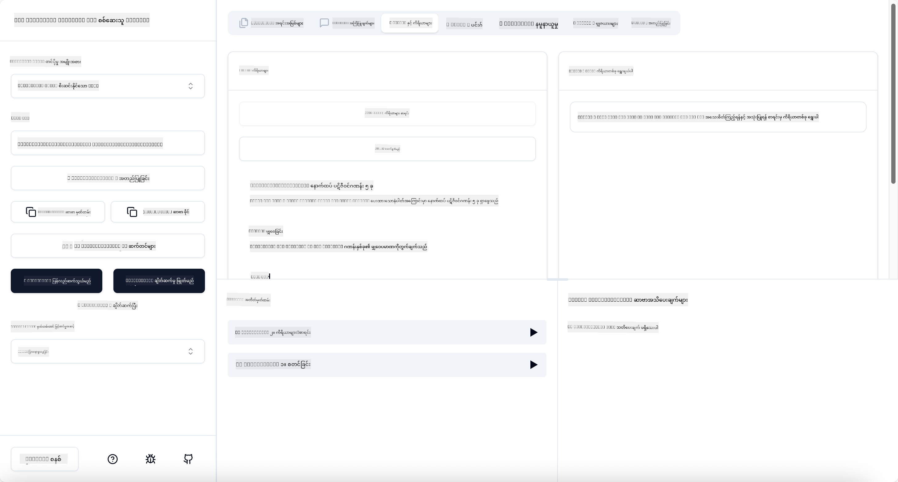

<!--
CO_OP_TRANSLATOR_METADATA:
{
  "original_hash": "0bc7bd48f55f1565f1d95ccb2c16f728",
  "translation_date": "2025-07-13T23:10:37+00:00",
  "source_file": "04-PracticalImplementation/samples/csharp/README.md",
  "language_code": "my"
}
-->
# နမူနာ

ယခင်ဥပမာမှာ `stdio` အမျိုးအစားဖြင့် ဒေသတွင်း .NET ပရောဂျက်ကို ဘယ်လိုအသုံးပြုရမယ်၊ ကွန်တိန်နာထဲမှာ ဒေသတွင်းဆာဗာကို ဘယ်လိုပြေးရမယ်ဆိုတာ ပြထားပါတယ်။ အခြေအနေအများကြီးမှာ ဒီနည်းလမ်းက အဆင်ပြေပါတယ်။ သို့သော် ဆာဗာကို မိုးကောင်းကင်ပတ်ဝန်းကျင်လို အဝေးမှ ပြေးနေစေချင်တာလည်း အသုံးဝင်နိုင်ပါတယ်။ ဒီမှာ `http` အမျိုးအစားကို အသုံးပြုပါတယ်။

`04-PracticalImplementation` ဖိုလ်ဒါထဲရှိ ဖြေရှင်းချက်ကို ကြည့်ရင် ယခင်နမူနာထက် ပိုရှုပ်ထွေးသလို မြင်နိုင်ပါတယ်။ ဒါပေမယ့် အမှန်မှာတော့ မဟုတ်ပါဘူး။ `src/Calculator` ပရောဂျက်ကို နီးကပ်စွာ ကြည့်မယ်ဆိုရင် ယခင်နမူနာနဲ့ အများအားဖြင့် တူညီတဲ့ ကုဒ်တွေ ဖြစ်ကြောင်း တွေ့ရပါမယ်။ ကွာခြားချက်တစ်ခုကတော့ HTTP တောင်းဆိုမှုတွေကို ကိုင်တွယ်ဖို့ `ModelContextProtocol.AspNetCore` ဆိုတဲ့ အခြားစာကြည့်တိုက်ကို အသုံးပြုထားတာပါ။ နောက်တစ်ခုက `IsPrime` မက်သဒ်ကို ပုဂ္ဂိုလ်ရေး (private) ပြောင်းထားတာဖြစ်ပြီး၊ သင့်ကုဒ်ထဲမှာ ပုဂ္ဂိုလ်ရေး မက်သဒ်တွေ ရှိနိုင်ကြောင်း ပြသဖို့ပါ။ အခြားကုဒ်တွေက ယခင်နမူနာနဲ့ တူညီပါတယ်။

အခြားပရောဂျက်တွေက [.NET Aspire](https://learn.microsoft.com/dotnet/aspire/get-started/aspire-overview) မှာ ရှိပါတယ်။ ဖြေရှင်းချက်ထဲမှာ .NET Aspire ပါဝင်ခြင်းက ဖွံ့ဖြိုးသူအတွေ့အကြုံကို တိုးတက်စေပြီး ဖွံ့ဖြိုးခြင်းနဲ့ စမ်းသပ်ခြင်းအတွက် အထောက်အကူဖြစ်စေပါတယ်။ ဆာဗာကို ပြေးရန် မလိုအပ်ပေမယ့် ဖြေရှင်းချက်ထဲမှာ ထည့်သွင်းထားခြင်းက ကောင်းမွန်တဲ့ လေ့လာမှုတစ်ခုပါ။

## ဒေသတွင်း ဆာဗာကို စတင်ပြေးရန်

1. VS Code (C# DevKit extension ပါရှိပြီး) မှ `04-PracticalImplementation/samples/csharp` ဖိုလ်ဒါကို သွားပါ။
1. ဆာဗာကို စတင်ဖို့ အောက်ပါ command ကို အကောင်အထည်ဖော်ပါ။

   ```bash
    dotnet watch run --project ./src/AppHost
   ```

1. ဝက်ဘ်ဘရောက်ဇာက .NET Aspire dashboard ကို ဖွင့်တဲ့အခါ `http` URL ကို မှတ်ထားပါ။ ပုံမှန်အားဖြင့် `http://localhost:5058/` လိုမျိုး ဖြစ်ပါလိမ့်မယ်။

   

## MCP Inspector ဖြင့် Streamable HTTP စမ်းသပ်ခြင်း

Node.js 22.7.5 နှင့် အထက်ရှိပါက MCP Inspector ကို အသုံးပြုပြီး ဆာဗာကို စမ်းသပ်နိုင်ပါတယ်။

ဆာဗာကို စတင်ပြီး terminal မှာ အောက်ပါ command ကို ပြေးပါ။

```bash
npx @modelcontextprotocol/inspector http://localhost:5058
```



- Transport အမျိုးအစားအဖြစ် `Streamable HTTP` ကို ရွေးပါ။
- Url ကွက်မှာ ယခင်မှတ်ထားသော ဆာဗာ URL ကို ထည့်ပြီး `/mcp` ကို ပေါင်းထည့်ပါ။ `http` (https မဟုတ်) ဖြစ်ရမည်။ ဥပမာ `http://localhost:5058/mcp`။
- Connect ခလုတ်ကို နှိပ်ပါ။

Inspector ရဲ့ အားသာချက်က ဖြစ်ပျက်နေတဲ့ အရာတွေကို ကြည့်ရှုနိုင်စေခြင်း ဖြစ်ပါတယ်။

- ရနိုင်တဲ့ tools တွေကို စာရင်းပြုလုပ်ကြည့်ပါ။
- အချို့ကို စမ်းသပ်ကြည့်ပါ၊ ယခင်ကဲ့သို့ အလုပ်လုပ်ပါလိမ့်မယ်။

## VS Code မှာ GitHub Copilot Chat ဖြင့် MCP Server စမ်းသပ်ခြင်း

Streamable HTTP transport ကို GitHub Copilot Chat နဲ့ အသုံးပြုရန် ယခင်ဖန်တီးထားသော `calc-mcp` ဆာဗာ၏ configuration ကို အောက်ပါအတိုင်း ပြောင်းပါ။

```jsonc
// .vscode/mcp.json
{
  "servers": {
    "calc-mcp": {
      "type": "http",
      "url": "http://localhost:5058/mcp"
    }
  }
}
```

စမ်းသပ်ကြည့်ပါ။

- "3 prime numbers after 6780" လို့ မေးပါ။ Copilot က `NextFivePrimeNumbers` tools အသစ်ကို အသုံးပြုပြီး ပထမဆုံး 3 prime နံပါတ်ကိုသာ ပြန်ပေးပါလိမ့်မယ်။
- "7 prime numbers after 111" လို့ မေးပြီး ဘာဖြစ်မလဲ ကြည့်ပါ။
- "John has 24 lollies and wants to distribute them all to his 3 kids. How many lollies does each kid have?" လို့ မေးပြီး ဘာဖြစ်မလဲ ကြည့်ပါ။

## ဆာဗာကို Azure သို့ တင်သွင်းခြင်း

ပိုမိုများပြားသော လူများ အသုံးပြုနိုင်ရန် ဆာဗာကို Azure သို့ တင်သွင်းကြမယ်။

Terminal မှာ `04-PracticalImplementation/samples/csharp` ဖိုလ်ဒါသို့ သွားပြီး အောက်ပါ command ကို ပြေးပါ။

```bash
azd up
```

တင်သွင်းမှုပြီးဆုံးသည့်အခါ အောက်ပါစာသားကဲ့သို့ မက်ဆေ့ခ်ျကို တွေ့ရပါမယ်။


URL ကို ယူပြီး MCP Inspector နဲ့ GitHub Copilot Chat မှာ အသုံးပြုပါ။

```jsonc
// .vscode/mcp.json
{
  "servers": {
    "calc-mcp": {
      "type": "http",
      "url": "https://calc-mcp.gentleriver-3977fbcf.australiaeast.azurecontainerapps.io/mcp"
    }
  }
}
```

## နောက်တစ်ဆင့်မှာ?

ကျွန်တော်တို့က မတူညီတဲ့ transport အမျိုးအစားတွေနဲ့ စမ်းသပ်ကိရိယာတွေကို စမ်းသပ်ကြည့်ပြီး MCP ဆာဗာကို Azure သို့ တင်သွင်းခဲ့ပါတယ်။ ဒါပေမယ့် ဆာဗာက ပုဂ္ဂိုလ်ရေး အရင်းအမြစ်တွေကို ဝင်ရောက်ဖို့ လိုအပ်ရင် ဘာဖြစ်မလဲ? ဥပမာ၊ ဒေတာဘေ့စ် သို့မဟုတ် ပုဂ္ဂိုလ်ရေး API တစ်ခုလို။ နောက်ပိုင်းအခန်းမှာ ဆာဗာရဲ့ လုံခြုံရေးကို ဘယ်လိုတိုးတက်အောင်လုပ်မလဲ ဆိုတာကို ကြည့်ပါမယ်။

**အကြောင်းကြားချက်**  
ဤစာတမ်းကို AI ဘာသာပြန်ဝန်ဆောင်မှု [Co-op Translator](https://github.com/Azure/co-op-translator) ဖြင့် ဘာသာပြန်ထားပါသည်။ ကျွန်ုပ်တို့သည် တိကျမှန်ကန်မှုအတွက် ကြိုးစားသော်လည်း အလိုအလျောက် ဘာသာပြန်ခြင်းတွင် အမှားများ သို့မဟုတ် မှားယွင်းချက်များ ပါဝင်နိုင်ကြောင်း သတိပြုပါရန် မေတ္တာရပ်ခံအပ်ပါသည်။ မူရင်းစာတမ်းကို မူလဘာသာဖြင့်သာ တရားဝင်အရင်းအမြစ်အဖြစ် ယူဆသင့်ပါသည်။ အရေးကြီးသော အချက်အလက်များအတွက် လူ့ဘာသာပြန်ပညာရှင်မှ ဘာသာပြန်ခြင်းကို အကြံပြုပါသည်။ ဤဘာသာပြန်ချက်ကို အသုံးပြုရာမှ ဖြစ်ပေါ်လာနိုင်သည့် နားလည်မှုမှားယွင်းမှုများအတွက် ကျွန်ုပ်တို့သည် တာဝန်မယူပါ။