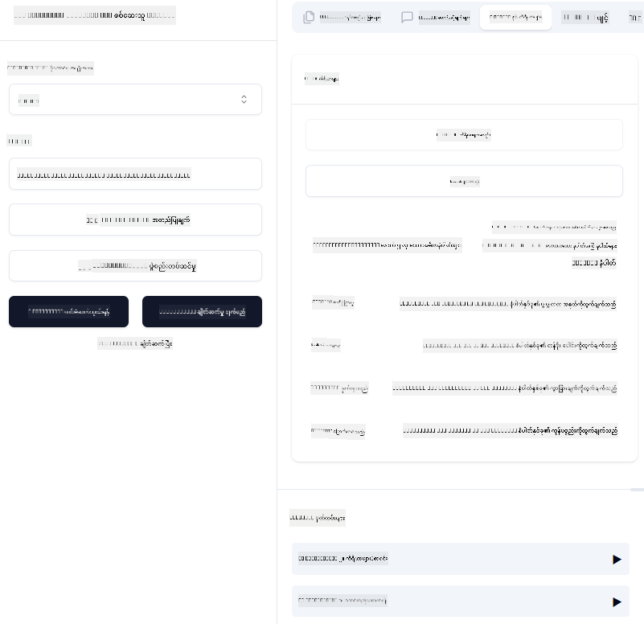

<!--
CO_OP_TRANSLATOR_METADATA:
{
  "original_hash": "5020a3e1a1c7f30c00f9e37f1fa208e3",
  "translation_date": "2025-06-17T17:06:02+00:00",
  "source_file": "04-PracticalImplementation/samples/csharp/README.md",
  "language_code": "my"
}
-->
# Sample

ယခင်ဥပမာမှာ `sdio` အမျိုးအစားဖြင့် ဒေသတွင်း .NET ပရောဂျက်ကို အသုံးပြုပုံနဲ့ ကွန်တိန်နာထဲမှာ ဆာဗာကို ဒေသတွင်းမှာ ပြေးဆွဲနည်းကို ပြထားပါတယ်။ ဒီနည်းဟာ အခြေအနေအများကြီးမှာ ကောင်းမွန်တဲ့ဖြေရှင်းချက်တစ်ခုဖြစ်ပါတယ်။ သို့သော် ဆာဗာကို မိုးကောင်းကင်ပတ်ဝန်းကျင်လို ဝေးလံတဲ့နေရာမှာ ပြေးဆွဲနိုင်တာကလည်း အသုံးဝင်နိုင်ပါတယ်။ ဒီမှာ `http` အမျိုးအစားက အရေးပါတဲ့အခန်းကဏ္ဍကို ထမ်းဆောင်ပါတယ်။

`04-PracticalImplementation` ဖိုလ်ဒါထဲက ဖြေရှင်းချက်ကို ကြည့်မယ်ဆိုရင် ယခင်နမူနာထက် ပိုရှုပ်ထွေးသလို ခံစားရနိုင်ပါတယ်။ ဒါပေမယ့် အမှန်မှာတော့ မဟုတ်ပါဘူး။ `src/mcpserver/mcpserver.csproj` ပရောဂျက်ကို နီးကပ်စွာကြည့်မယ်ဆိုရင် ယခင်နမူနာနဲ့ အများအားဖြင့် တူညီတဲ့ ကုဒ်တွေ ဖြစ်ကြောင်း တွေ့ရပါမယ်။ ကွာခြားချက်တစ်ခုကတော့ HTTP တောင်းဆိုမှုတွေကို ကိုင်တွယ်ဖို့အတွက် သုံးတဲ့ စာကြည့်တိုက်ကို `ModelContextProtocol.AspNetCore` အသုံးပြုတာနဲ့ `IsPrime` မက်သဒ်ကို ကိုယ်ပိုင်(private) မက်သဒ်အဖြစ် ပြောင်းလဲထားတာပဲ ဖြစ်ပါတယ်။ ဒါဟာ ကိုယ်ပိုင်မက်သဒ်တွေကို ကိုယ့်ကုဒ်ထဲမှာ သုံးနိုင်တယ်ဆိုတာ ပြသဖို့ပါ။ ကျန်တဲ့ကုဒ်တွေကတော့ ယခင်နမူနာနဲ့ တူညီပါတယ်။

အခြားပရောဂျက်တွေကတော့ [.NET Aspire](https://learn.microsoft.com/dotnet/aspire/get-started/aspire-overview) မှာ ရှိပါတယ်။ .NET Aspire ကို ဖြေရှင်းချက်ထဲ ထည့်သွင်းခြင်းက ဒီဇိုင်နာတွေနဲ့ စမ်းသပ်သူတွေအတွက် အတွေ့အကြုံကောင်းမွန်စေပြီး စောင့်ကြည့်နိုင်မှုကိုလည်း ကူညီပေးပါတယ်။ ဆာဗာကို ပြေးဆွဲဖို့ မလိုအပ်ပေမယ့် ဖြေရှင်းချက်ထဲ ထည့်ထားတာကောင်းမွန်တဲ့ လေ့လာမှုတစ်ခုဖြစ်ပါတယ်။

## ဆာဗာကို ဒေသတွင်းမှာ စတင်ပြေးဆွဲခြင်း

1. VS Code (C# DevKit extension ပါသော) မှာ `04-PracticalImplementation\samples\csharp\src\Calculator-chap4.sln` ဖြေရှင်းချက်ကို ဖွင့်ပါ။
2. ဆာဗာကို စတင်ဖို့ `F5` ကိုနှိပ်ပါ။ ဒါဆိုရင် .NET Aspire dashboard ပါတဲ့ ဝက်ဘ်ဘရောက်ဇာကို ဖွင့်ပေးပါလိမ့်မယ်။

သို့မဟုတ်

1. တာမင်နယ်မှ `04-PracticalImplementation\samples\csharp\src` ဖိုလ်ဒါသို့ သွားပါ။
2. ဆာဗာကို စတင်ဖို့ အောက်ပါ command ကို အကောင်အထည်ဖော်ပါ။
   ```bash
    dotnet run --project .\AppHost
   ```

3. Dashboard မှာ `http` URL ကို မှတ်သားပါ။ `http://localhost:5058/`.

## Test `SSE` လိုမျိုး ModelContext Protocol Inspector နဲ့ တွဲဖက်အသုံးပြုနိုင်ပါတယ်။

Node.js 22.7.5 နှင့် အထက်ရှိသူများအတွက် ModelContext Protocol Inspector ကို အသုံးပြုပြီး ဆာဗာကို စမ်းသပ်နိုင်ပါတယ်။

ဆာဗာကို စတင်ပြီး တာမင်နယ်မှာ အောက်ပါ command ကို လည်ပတ်ပါ။

```bash
npx @modelcontextprotocol/inspector@latest
```



- `SSE` as the Transport type. SSE stand for Server-Sent Events. 
- In the Url field, enter the URL of the server noted earlier,and append `/sse` ကို ရွေးချယ်ပါ။ ဒါဟာ `http` ဖြစ်ရမည် (မဟုတ်ရင် `https`) something like `http://localhost:5058/sse`.
- select the Connect button.

A nice thing about the Inspector is that it provide a nice visibility on what is happening.

- Try listing the availables tools
- Try some of them, it should works just like before.


## Test `SSE` with Github Copilot Chat in VS Code

To use the `SSE` transport with Github Copilot Chat, change the configuration of the `mcp-calc` ဆာဗာကို အရင်တုန်းက ဖန်တီးထားသလို ပြသပါမယ်။

```json
"mcp-calc": {
    "type": "sse",
    "url": "http://localhost:5058/sse"
}
```

စမ်းသပ်မှုတွေ လုပ်ပါ။
- 6780 ထက်နောက်က ပထမဆုံး 3 ခုသော ပရိုင်းမြောက်ဂဏန်းတွေကို မေးမြန်းပါ။ Copilot က `NextFivePrimeNumbers` ကိရိယာအသစ်ကို သုံးပြီး ပထမဆုံး 3 ခုသော ပရိုင်းမြောက်ဂဏန်းကိုသာ ပြန်ပေးပါလိမ့်မယ်။
- 111 ထက်နောက်က ပထမဆုံး 7 ခုသော ပရိုင်းမြောက်ဂဏန်းကို မေးမြန်းပြီး ဘာဖြစ်မလဲ ကြည့်ပါ။

# ဆာဗာကို Azure သို့ တင်သွင်းခြင်း

ဆာဗာကို Azure သို့ တင်သွင်းလိုက်ပါမယ်၊ ဒါကြောင့် လူပိုများစွာ အသုံးပြုနိုင်ပါလိမ့်မယ်။

တာမင်နယ်မှ `04-PracticalImplementation\samples\csharp\src` ဖိုလ်ဒါသို့ သွားပြီး အောက်ပါ command ကို လည်ပတ်ပါ။

```bash
azd init
```

ဒီနည်းလမ်းက Azure အရင်းအမြစ်များ၏ ဖွဲ့စည်းတည်ဆောက်မှုကို ဒေသတွင်း ဖိုင်အနေနဲ့ သိမ်းဆည်းပေးမှာဖြစ်ပြီး Infrastructure as code (IaC) ကိုလည်း ဖန်တီးပေးပါလိမ့်မယ်။

ထို့နောက် ဆာဗာကို Azure သို့ တင်သွင်းရန် အောက်ပါ command ကို လည်ပတ်ပါ။

```bash
azd up
```

တင်သွင်းမှု ပြီးဆုံးသွားချိန်မှာ အောက်ပါလို သတိပေးစာသားကို မြင်ရပါမယ်။


Aspire dashboard သို့ သွားပြီး MCP Inspector နဲ့ Github Copilot Chat မှာ အသုံးပြုရန် `HTTP` URL ကို မှတ်သားပါ။

## နောက်တစ်ဆင့်မှာ?

မတူညီတဲ့ သယ်ယူပို့ဆောင်မှုအမျိုးအစားတွေနဲ့ စမ်းသပ်ကိရိယာတွေကို စမ်းသပ်ပြီး MCP ဆာဗာကို Azure သို့ တင်သွင်းခဲ့ပါတယ်။ ဒါပေမယ့် ဆာဗာကို ကိုယ်ပိုင် အရင်းအမြစ်တွေ (ဥပမာ - ဒေတာဘေ့စ် သို့မဟုတ် ကိုယ်ပိုင် API) မှ အသုံးပြုဖို့ လိုအပ်ရင် ဘာဖြစ်မလဲ? နောက်ပိုင်းအခန်းမှာ ဆာဗာရဲ့ လုံခြုံရေးကို ဘယ်လိုတိုးတက်အောင်လုပ်မလဲဆိုတာ ကြည့်ရှုပါမယ်။

**အကြောင်းကြားချက်**  
ဤစာတမ်းကို AI ဘာသာပြန်ဝန်ဆောင်မှု [Co-op Translator](https://github.com/Azure/co-op-translator) အသုံးပြု၍ ဘာသာပြန်ထားပါသည်။ တိကျမှန်ကန်မှုအတွက် ကြိုးစားခဲ့သော်လည်း၊ စက်မှုဘာသာပြန်မှုများတွင် အမှားများ သို့မဟုတ် မှားယွင်းမှုများ ပါဝင်နိုင်ကြောင်း ကျေးဇူးပြု၍ သတိပြုပါ။ မူရင်းစာတမ်းကို မိခင်ဘာသာဖြင့်သာ အတည်ပြုရမည့် အရင်းအမြစ်အဖြစ် သတ်မှတ်သင့်ပါသည်။ အရေးကြီးသည့် သတင်းအချက်အလက်များအတွက် ကျွမ်းကျင်သော လူ့ဘာသာပြန်ကို အသုံးပြုရန် အကြံပြုပါသည်။ ဤဘာသာပြန်ချက်အသုံးပြုမှုကြောင့် ဖြစ်ပေါ်နိုင်သည့် နားလည်မှားယွင်းမှုများအတွက် ကျွန်ုပ်တို့သည် တာဝန်မရှိပါ။