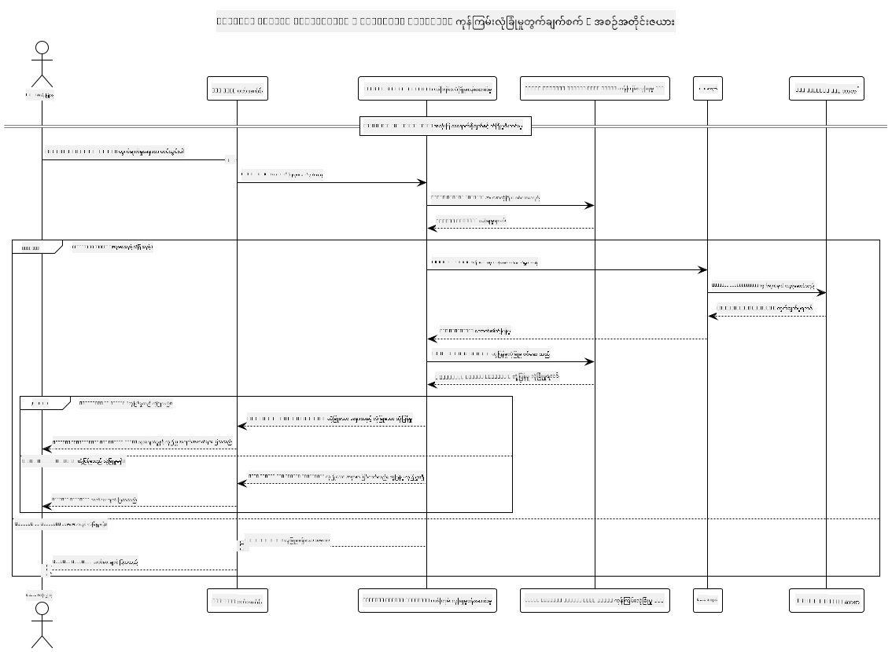

<!--
CO_OP_TRANSLATOR_METADATA:
{
  "original_hash": "e5ea5e7582f70008ea9bec3b3820f20a",
  "translation_date": "2025-07-13T23:21:10+00:00",
  "source_file": "04-PracticalImplementation/samples/java/containerapp/README.md",
  "language_code": "my"
}
-->
## စနစ်ဖွဲ့စည်းပုံ

ဒီပရောဂျက်မှာ Model Context Protocol (MCP) ကို အသုံးပြုပြီး အသုံးပြုသူရဲ့ prompt ကို calculator service ဆီ ပို့မယ့်အရင်မှာ content safety စစ်ဆေးမှုလုပ်တဲ့ web application ကို ပြသထားပါတယ်။



### လုပ်ဆောင်ပုံ

1. **အသုံးပြုသူထည့်သွင်းမှု**: အသုံးပြုသူက web interface မှာ တွက်ချက်ဖို့ prompt ထည့်သွင်းတယ်
2. **Content Safety စစ်ဆေးခြင်း (Input)**: Azure Content Safety API နဲ့ prompt ကို စစ်ဆေးတယ်
3. **လုံခြုံမှုဆုံးဖြတ်ချက် (Input)**:
   - အကြောင်းအရာလုံခြုံရင် (severity < 2 ဖြစ်ရမယ် အမျိုးအစားအားလုံးမှာ) calculator ဆီသို့ ဆက်လက်သွားတယ်
   - အကြောင်းအရာမှာ အန္တရာယ်ရှိနိုင်တယ်ဆို flagged ဖြစ်ရင် လုပ်ငန်းစဉ်ရပ်ပြီး သတိပေးချက် ပြန်ပေးတယ်
4. **Calculator ပေါင်းစည်းခြင်း**: လုံခြုံတဲ့အကြောင်းအရာကို LangChain4j က MCP calculator server နဲ့ ဆက်သွယ်ပြီး ဆက်လက်လုပ်ဆောင်တယ်
5. **Content Safety စစ်ဆေးခြင်း (Output)**: bot ရဲ့ တုံ့ပြန်ချက်ကို Azure Content Safety API နဲ့ စစ်ဆေးတယ်
6. **လုံခြုံမှုဆုံးဖြတ်ချက် (Output)**:
   - bot ရဲ့ တုံ့ပြန်ချက် လုံခြုံရင် အသုံးပြုသူကို ပြသတယ်
   - bot ရဲ့ တုံ့ပြန်ချက် အန္တရာယ်ရှိနိုင်တယ်ဆို flagged ဖြစ်ရင် သတိပေးချက်နဲ့ အစားထိုးပြသတယ်
7. **တုံ့ပြန်ချက်**: ရလဒ်တွေ (လုံခြုံရင်) ကို အသုံးပြုသူဆီ ပြသပြီး နှစ်ဖက်လုံးရဲ့ လုံခြုံမှုစစ်ဆေးမှုများကိုပါ ပြသပေးတယ်

## Model Context Protocol (MCP) ကို Calculator Services နဲ့ အသုံးပြုခြင်း

ဒီပရောဂျက်က LangChain4j မှာ Model Context Protocol (MCP) ကို အသုံးပြုပြီး calculator MCP services ကို ခေါ်ယူနည်းကို ပြသထားပါတယ်။ implementation မှာ localhost:8080 ပေါ်မှာ ပြေးနေတဲ့ local MCP server ကို အသုံးပြုပြီး calculator လုပ်ဆောင်ချက်တွေ ပေးပါတယ်။

### Azure Content Safety Service ကို ပြင်ဆင်ခြင်း

content safety features ကို အသုံးပြုမယ့်အခါမှာ Azure Content Safety service resource တစ်ခု ဖန်တီးထားဖို့ လိုအပ်ပါတယ်။

1. [Azure Portal](https://portal.azure.com) မှာ လော့ဂ်အင် ဝင်ပါ
2. "Create a resource" ကို နှိပ်ပြီး "Content Safety" ကို ရှာပါ
3. "Content Safety" ကို ရွေးပြီး "Create" ကို နှိပ်ပါ
4. သင့် resource အတွက် ထူးခြားတဲ့ နာမည်တစ်ခု ထည့်ပါ
5. သင့် subscription နဲ့ resource group ကို ရွေးပါ (သို့မဟုတ် အသစ်ဖန်တီးပါ)
6. ပံ့ပိုးထားတဲ့ ဒေသတစ်ခုကို ရွေးပါ ([Region availability](https://azure.microsoft.com/en-us/global-infrastructure/services/?products=cognitive-services) ကို ကြည့်ပါ)
7. သင့်လိုအပ်ချက်နှင့် ကိုက်ညီတဲ့ စျေးနှုန်းအဆင့်ကို ရွေးပါ
8. "Create" ကို နှိပ်ပြီး resource ကို တည်ဆောက်ပါ
9. တည်ဆောက်ပြီးသွားရင် "Go to resource" ကို နှိပ်ပါ
10. ဘယ်ဘက် panel မှာ "Resource Management" အောက်က "Keys and Endpoint" ကို ရွေးပါ
11. key တစ်ခုနဲ့ endpoint URL ကို ကူးယူပြီး နောက်တစ်ဆင့်မှာ အသုံးပြုပါ

### ပတ်ဝန်းကျင်အပြောင်းအလဲများကို ပြင်ဆင်ခြင်း

GitHub models အတွက် authentication အတွက် `GITHUB_TOKEN` environment variable ကို သတ်မှတ်ပါ။
```sh
export GITHUB_TOKEN=<your_github_token>
```

content safety features အတွက်တော့:
```sh
export CONTENT_SAFETY_ENDPOINT=<your_content_safety_endpoint>
export CONTENT_SAFETY_KEY=<your_content_safety_key>
```

ဒီ environment variables တွေကို application က Azure Content Safety service နဲ့ authentication ပြုလုပ်ဖို့ အသုံးပြုပါတယ်။ မသတ်မှတ်ထားရင်တော့ demonstration အတွက် placeholder တန်ဖိုးတွေကို အသုံးပြုမယ်၊ ဒါပေမယ့် content safety features မမှန်ကန်စွာ လုပ်ဆောင်နိုင်ပါဘူး။

### Calculator MCP Server ကို စတင်ခြင်း

client ကို run မလုပ်ခင် localhost:8080 ပေါ်မှာ SSE mode ဖြင့် calculator MCP server ကို စတင်ဖွင့်ထားဖို့ လိုအပ်ပါတယ်။

## ပရောဂျက်ဖော်ပြချက်

ဒီပရောဂျက်က Model Context Protocol (MCP) ကို LangChain4j နဲ့ ပေါင်းစည်းပြီး calculator services ကို ခေါ်ယူနည်းကို ပြသထားပါတယ်။ အဓိက feature တွေမှာ -

- MCP ကို အသုံးပြုပြီး basic math operations တွေအတွက် calculator service နဲ့ ချိတ်ဆက်ခြင်း
- အသုံးပြုသူ prompt နဲ့ bot တုံ့ပြန်ချက် နှစ်ဖက်လုံးမှာ content safety စစ်ဆေးမှု နှစ်ထပ်လုပ်ခြင်း
- LangChain4j မှ GitHub ရဲ့ gpt-4.1-nano model နဲ့ ပေါင်းစည်းခြင်း
- MCP သယ်ယူပို့ဆောင်မှုအတွက် Server-Sent Events (SSE) ကို အသုံးပြုခြင်း

## Content Safety ပေါင်းစည်းမှု

ဒီပရောဂျက်မှာ အသုံးပြုသူ input နဲ့ စနစ်တုံ့ပြန်ချက်တွေမှာ အန္တရာယ်ရှိနိုင်တဲ့ အကြောင်းအရာတွေ မပါရှိစေရန် content safety features တွေကို ပြည့်စုံစွာ ထည့်သွင်းထားပါတယ်။

1. **Input စစ်ဆေးခြင်း**: အသုံးပြုသူ prompt အားလုံးကို မတရားစကား၊ အကြမ်းဖက်မှု၊ ကိုယ်ပျက်ဆီးမှု၊ လိင်ဆက်ဆံမှု အကြောင်းအရာ စသည့် အန္တရာယ်ရှိနိုင်တဲ့ အမျိုးအစားများအတွက် စစ်ဆေးပြီးမှ ဆက်လက်လုပ်ဆောင်သည်။

2. **Output စစ်ဆေးခြင်း**: မဖြတ်တောက်ထားသော မော်ဒယ်များကို အသုံးပြုနေစဉ်မှာပါ generated တုံ့ပြန်ချက်အားလုံးကို content safety စစ်စနစ်ဖြင့် စစ်ဆေးပြီး အသုံးပြုသူထံ ပြသသည်။

ဒီနှစ်ထပ်စစ်ဆေးမှုနည်းလမ်းက အသုံးပြုသူ input အန္တရာယ်များနဲ့ AI မော်ဒယ်ထုတ်လုပ်တဲ့ output အန္တရာယ်များကို ကာကွယ်ပေးပြီး စနစ်ကို လုံခြုံစေပါတယ်။

## Web Client

ဒီ application မှာ အသုံးပြုသူ Friendly ဖြစ်တဲ့ web interface ပါဝင်ပြီး Content Safety Calculator စနစ်နဲ့ အလွယ်တကူ ဆက်သွယ်နိုင်ပါတယ်။

### Web Interface အင်္ဂါရပ်များ

- တွက်ချက်ဖို့ prompt ထည့်သွင်းနိုင်တဲ့ ရိုးရှင်းပြီး နားလည်ရလွယ်ကူတဲ့ ဖောင်
- Input နဲ့ output နှစ်ဖက်လုံးမှာ content safety စစ်ဆေးမှု နှစ်ထပ်လုပ်ခြင်း
- prompt နဲ့ တုံ့ပြန်ချက် လုံခြုံမှုအခြေအနေကို အချိန်နဲ့တပြေးညီ ပြသခြင်း
- လွယ်ကူစွာ နားလည်နိုင်ဖို့ အရောင်ဖြင့် လုံခြုံမှု အချက်ပြများ
- မတူညီတဲ့ စက်ပစ္စည်းများမှာလည်း အဆင်ပြေတဲ့ သန့်ရှင်းပြီး တုံ့ပြန်မှုကောင်းတဲ့ ဒီဇိုင်း
- အသုံးပြုသူများအတွက် ဥပမာ လုံခြုံတဲ့ prompt များ

### Web Client ကို အသုံးပြုခြင်း

1. application ကို စတင်ပါ။
   ```sh
   mvn spring-boot:run
   ```

2. browser ကို ဖွင့်ပြီး `http://localhost:8087` သို့ သွားပါ

3. ပေးထားတဲ့ စာသားဧရိယာမှာ တွက်ချက်ဖို့ prompt ထည့်ပါ (ဥပမာ - "Calculate the sum of 24.5 and 17.3")

4. "Submit" ကို နှိပ်ပြီး သင့်တောင်းဆိုမှုကို လုပ်ဆောင်ပါ

5. ရလဒ်တွေကို ကြည့်ရှုပါ၊ အဲဒီမှာ ပါဝင်မှာက -
   - သင့် prompt ရဲ့ content safety စစ်ဆေးမှု
   - prompt လုံခြုံရင် တွက်ချက်ပြီးရလဒ်
   - bot တုံ့ပြန်ချက်ရဲ့ content safety စစ်ဆေးမှု
   - input သို့ output တစ်ခုခု flagged ဖြစ်ရင် သတိပေးချက်များ

web client က content safety စစ်ဆေးမှု နှစ်ခုလုံးကို အလိုအလျောက် ကိုင်တွယ်ပေးပြီး သုံးစွဲသူတွေ အဘယ်မော်ဒယ်ကိုမဆို အသုံးပြုနေစဉ် လုံခြုံမှုရှိစေရန် သေချာစေပါတယ်။

**အကြောင်းကြားချက်**  
ဤစာတမ်းကို AI ဘာသာပြန်ဝန်ဆောင်မှု [Co-op Translator](https://github.com/Azure/co-op-translator) ဖြင့် ဘာသာပြန်ထားပါသည်။ ကျွန်ုပ်တို့သည် တိကျမှန်ကန်မှုအတွက် ကြိုးစားသော်လည်း၊ အလိုအလျောက် ဘာသာပြန်ခြင်းတွင် အမှားများ သို့မဟုတ် မှားယွင်းမှုများ ပါဝင်နိုင်ကြောင်း သတိပြုပါရန် မေတ္တာရပ်ခံအပ်ပါသည်။ မူရင်းစာတမ်းကို မူလဘာသာဖြင့်သာ တရားဝင်အချက်အလက်အဖြစ် ယူဆသင့်ပါသည်။ အရေးကြီးသော အချက်အလက်များအတွက် လူ့ဘာသာပြန်ပညာရှင်မှ ဘာသာပြန်ခြင်းကို အကြံပြုပါသည်။ ဤဘာသာပြန်ချက်ကို အသုံးပြုရာမှ ဖြစ်ပေါ်လာနိုင်သည့် နားလည်မှုမှားယွင်းမှုများအတွက် ကျွန်ုပ်တို့ တာဝန်မယူပါ။