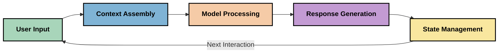
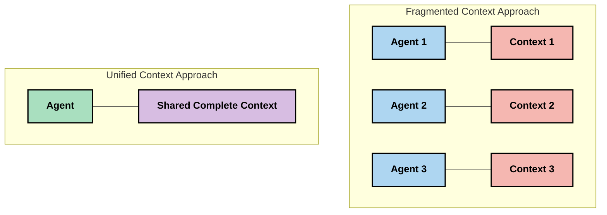
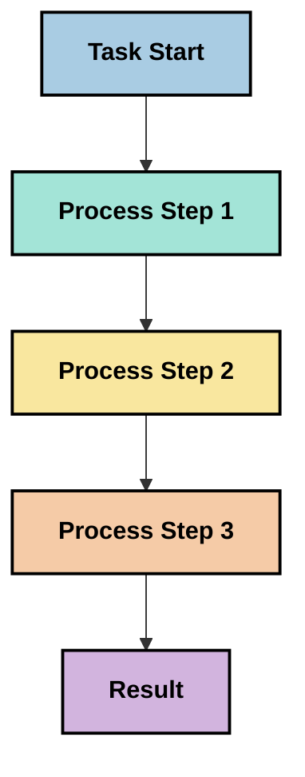
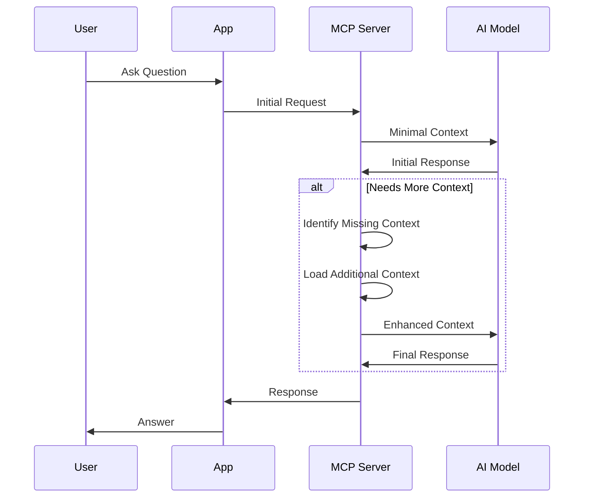
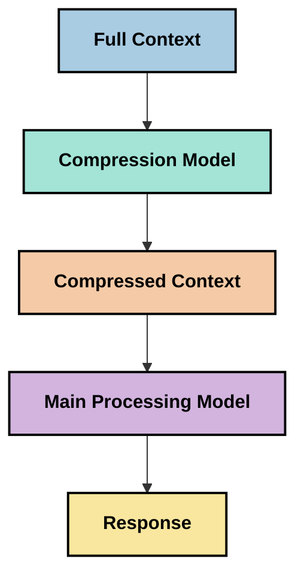

<!--
CO_OP_TRANSLATOR_METADATA:
{
  "original_hash": "fd169ca3071b81b5ee282e194bc823df",
  "translation_date": "2025-09-15T21:20:12+00:00",
  "source_file": "05-AdvancedTopics/mcp-contextengineering/README.md",
  "language_code": "my"
}
-->
# Context Engineering: MCP စနစ်တွင် ပေါ်ထွက်လာသော အယူအဆ

## အကျဉ်းချုပ်

Context engineering သည် AI နယ်ပယ်တွင် ပေါ်ထွက်လာသော အယူအဆတစ်ခုဖြစ်ပြီး၊ client များနှင့် AI ဝန်ဆောင်မှုများအကြား အပြန်အလှန်ဆက်သွယ်မှုများတွင် သတင်းအချက်အလက်များကို ဘယ်လိုဖွဲ့စည်း၊ ပေးပို့၊ ထိန်းသိမ်းရမည်ကို လေ့လာခြင်းဖြစ်သည်။ Model Context Protocol (MCP) စနစ်သည် တိုးတက်လာသည့်အခါ၊ context ကို ထိရောက်စွာ စီမံခန့်ခွဲနည်းကို နားလည်ခြင်းသည် အရေးကြီးလာသည်။ ဒီ module မှာ context engineering အယူအဆကို မိတ်ဆက်ပြီး MCP တွင် အသုံးချနိုင်မှုများကို လေ့လာပါမည်။

## သင်ယူရမည့် ရည်မှန်းချက်များ

ဒီ module ကို ပြီးဆုံးသည့်အခါ၊ သင်သည် အောက်ပါအရာများကို နားလည်နိုင်ပါမည်-

- Context engineering အယူအဆနှင့် MCP တွင် ပါဝင်နိုင်မှုကို နားလည်ခြင်း
- MCP protocol design က ဖြေရှင်းသည့် context management အခက်အခဲများကို ဖော်ထုတ်ခြင်း
- Model performance ကို context handling ကောင်းမွန်မှုဖြင့် တိုးတက်စေရန် နည်းလမ်းများကို လေ့လာခြင်း
- Context ထိရောက်မှုကို တိုင်းတာခြင်းနှင့် အကဲဖြတ်ခြင်းနည်းလမ်းများကို စဉ်းစားခြင်း
- MCP framework ကို အသုံးပြု၍ AI အတွေ့အကြုံများကို တိုးတက်စေရန် အယူအဆများကို လက်တွေ့ကျကျ အသုံးချခြင်း

## Context Engineering ကို မိတ်ဆက်ခြင်း

Context engineering သည် အသုံးပြုသူများ၊ application များနှင့် AI model များအကြား သတင်းအချက်အလက်များကို ရည်ရွယ်ချက်ရှိရှိ ဖွဲ့စည်းခြင်းနှင့် စီမံခန့်ခွဲခြင်းကို အခြေခံထားသော ပေါ်ထွက်လာသော အယူအဆတစ်ခုဖြစ်သည်။ Prompt engineering ကဲ့သို့သော နယ်ပယ်များနှင့် မတူကွဲပြားပြီး၊ context engineering သည် AI model များကို သင့်တော်သော အချက်အလက်များကို သင့်တော်သောအချိန်တွင် ပေးပို့ရန် အခက်အခဲများကို ဖြေရှင်းနေသော လက်တွေ့ကျကျ လုပ်ဆောင်နေသူများက ဖော်ဆောင်နေသော နယ်ပယ်တစ်ခုဖြစ်သည်။

Large language models (LLMs) တိုးတက်လာသည့်အခါ၊ context ၏ အရေးပါမှုသည် ပိုမိုရှင်းလင်းလာသည်။ ကျွန်ုပ်တို့ပေးသော context ၏ အရည်အသွေး၊ သက်ဆိုင်မှုနှင့် ဖွဲ့စည်းပုံသည် model output များကို တိုက်ရိုက်သက်ရောက်စေသည်။ Context engineering သည် ဒီဆက်နွယ်မှုကို လေ့လာပြီး context management ထိရောက်မှုအတွက် မူဘောင်များ ဖွံ့ဖြိုးစေရန် ရှာဖွေသည်။

> "၂၀၂၅ ခုနှစ်တွင် model များသည် အလွန်ထက်မြက်လာသည်။ သို့သော် အတော်ဆုံးသော လူတစ်ဦးတောင် သူ့အလုပ်ကို ထိရောက်စွာ လုပ်ဆောင်နိုင်ရန် သူ့ကို မေးမြန်းထားသော အကြောင်းအရာ၏ context မရှိမဖြစ်လိုအပ်သည်... 'Context engineering' သည် prompt engineering ၏ နောက်တစ်ဆင့်ဖြစ်သည်။ ဒါဟာ dynamic system တစ်ခုတွင် အလိုအလျောက်လုပ်ဆောင်ခြင်းအကြောင်းဖြစ်သည်။" — Walden Yan, Cognition AI

Context engineering သည် အောက်ပါအရာများကို ပါဝင်နိုင်သည်-

1. **Context Selection**: တစ်ခုခုလုပ်ဆောင်ရန် သက်ဆိုင်သော အချက်အလက်များကို ရွေးချယ်ခြင်း
2. **Context Structuring**: Model နားလည်မှုကို အများဆုံးတိုးတက်စေရန် အချက်အလက်များကို ဖွဲ့စည်းခြင်း
3. **Context Delivery**: အချက်အလက်များကို model များထံ ပေးပို့ပုံနှင့် အချိန်ကို အကောင်းဆုံးဖြစ်စေရန် အဆင်ပြေစေရန်
4. **Context Maintenance**: Context ၏ အခြေအနေနှင့် တိုးတက်မှုကို အချိန်အလိုက် စီမံခြင်း
5. **Context Evaluation**: Context ၏ ထိရောက်မှုကို တိုင်းတာပြီး တိုးတက်စေရန်

ဒီအချက်များသည် MCP ecosystem အတွက် အထူးသက်ဆိုင်ပြီး၊ LLM များထံ context ကို ပေးပို့ရန် standardized နည်းလမ်းတစ်ခုကို ပံ့ပိုးပေးသည်။

## Context Journey ၏ ရှုထောင့်

Context engineering ကို MCP စနစ်တစ်ခုအတွင်း သတင်းအချက်အလက်များ သွားလာပုံကို ရှုမြင်ခြင်းဖြင့် သတ်မှတ်နိုင်သည်-



### Context Journey ၏ အဓိကအဆင့်များ:

1. **User Input**: အသုံးပြုသူထံမှ ရရှိသော အချက်အလက်များ (စာသား၊ ပုံများ၊ စာရွက်များ)
2. **Context Assembly**: User input ကို စနစ် context၊ စကားဝိုင်းမှတ်တမ်းနှင့် အခြား retrieved information များနှင့် ပေါင်းစည်းခြင်း
3. **Model Processing**: AI model သည် assembled context ကို လုပ်ဆောင်ခြင်း
4. **Response Generation**: Model သည် ပေးထားသော context အပေါ် အခြေခံပြီး output များကို ထုတ်လုပ်ခြင်း
5. **State Management**: စနစ်သည် interaction အပေါ် အခြေခံပြီး internal state ကို update လုပ်ခြင်း

ဒီရှုထောင့်သည် AI စနစ်များတွင် context ၏ dynamic nature ကို ဖော်ပြပြီး၊ အဆင့်တစ်ခုစီတွင် သတင်းအချက်အလက်များကို အကောင်းဆုံး စီမံရန် ဘယ်လိုလုပ်ဆောင်ရမည်ကို မေးခွန်းထုတ်ပေးသည်။

## Context Engineering ၏ ပေါ်ထွက်လာသော မူဘောင်များ

Context engineering နယ်ပယ်သည် ဖွံ့ဖြိုးလာသည့်အခါ၊ လက်တွေ့ကျကျ လုပ်ဆောင်သူများထံမှ ပေါ်ထွက်လာသော မူဘောင်များသည် MCP implementation ရွေးချယ်မှုများကို သက်ရောက်စေနိုင်သည်-

### Principle 1: Context ကို အပြည့်အစုံမျှဝေပါ

Context ကို စနစ်၏ component အားလုံးအကြား အပြည့်အစုံမျှဝေသင့်ပြီး၊ agent များ သို့မဟုတ် process များအကြား အပိုင်းပိုင်းဖြစ်နေသင့်မဟုတ်ပါ။ Context ကို ဖြန့်ဖြူးထားသောအခါ၊ စနစ်၏ တစ်စိတ်တစ်ပိုင်းတွင် ဆောင်ရွက်သော ဆုံးဖြတ်ချက်များသည် အခြားနေရာတွင် ဆောင်ရွက်သော ဆုံးဖြတ်ချက်များနှင့် ဆန့်ကျင်မှုရှိနိုင်သည်။



MCP application များတွင်၊ context ကို pipeline တစ်ခုလုံးအတွင်း seamless ဖြစ်စေရန် design လုပ်ရန် အကြံပေးသည်။

### Principle 2: လုပ်ဆောင်မှုများသည် အဓိက ဆုံးဖြတ်ချက်များကို ပါဝင်သည်

Model တစ်ခု၏ လုပ်ဆောင်မှုတစ်ခုစီသည် context ကို ဘယ်လိုအဓိပ္ပာယ်ဖွင့်ဆိုရမည်ကို ဆုံးဖြတ်သော အဓိက ဆုံးဖြတ်ချက်များကို ပါဝင်သည်။ Component များစွာသည် အခြား context များအပေါ် လုပ်ဆောင်မှုများပြုလုပ်သောအခါ၊ ဒီအဓိက ဆုံးဖြတ်ချက်များသည် ဆန့်ကျင်မှုရှိနိုင်ပြီး၊ မတူညီသော ရလဒ်များကို ဖြစ်ပေါ်စေသည်။

ဒီ principle သည် MCP application များအတွက် အရေးကြီးသော သက်ရောက်မှုများရှိသည်-
- အလွန်ရှုပ်ထွေးသော task များကို parallel execution ဖြင့် context ကို ဖြိုခွဲခြင်းမဟုတ်ဘဲ linear processing ကို သာမန်အားဖြင့် သုံးပါ
- ဆုံးဖြတ်ချက်အချက်အလက်များကို context အပြည့်အစုံရရှိစေရန် သေချာပါစေ
- နောက်ဆင့်များသည် အစောပိုင်း ဆုံးဖြတ်ချက်များ၏ context အပြည့်အစုံကို မြင်နိုင်စေရန် စနစ်ကို design လုပ်ပါ

### Principle 3: Context Depth ကို Window Limitations နှင့် ချိန်ညှိပါ

စကားဝိုင်းများနှင့် လုပ်ဆောင်မှုများသည် ရှည်လျားလာသည့်အခါ၊ context window များသည် အလွန်အမင်း ပြည့်နှက်သွားသည်။ Effective context engineering သည် comprehensive context နှင့် technical limitations အကြား tension ကို စီမံရန် နည်းလမ်းများကို ရှာဖွေသည်။

လေ့လာနေသော နည်းလမ်းများမှာ-
- Token usage ကို လျှော့ချပြီး အရေးကြီးသော အချက်အလက်များကို ထိန်းသိမ်းထားသော context compression
- လက်ရှိလိုအပ်ချက်များနှင့် သက်ဆိုင်သော context ကို တိုးတက်စွာ load လုပ်ခြင်း
- အဓိကဆုံးဖြတ်ချက်များနှင့် အချက်အလက်များကို ထိန်းသိမ်းထားသော အရင်ဆုံး interaction များ၏ summarization

## Context Challenges နှင့် MCP Protocol Design

Model Context Protocol (MCP) သည် context management ၏ အထူးအခက်အခဲများကို သိရှိထားပြီး၊ MCP protocol design ၏ အရေးကြီးသော အချက်များကို ရှင်းလင်းစေသည်-

### Challenge 1: Context Window Limitations
AI model များသည် fixed context window size များရှိပြီး၊ တစ်ခါတစ်လေ process လုပ်နိုင်သော အချက်အလက်များကို ကန့်သတ်ထားသည်။

**MCP Design Response:** 
- Protocol သည် structured, resource-based context ကို ထောက်ပံ့ပြီး၊ အလွန်ထိရောက်စွာ reference လုပ်နိုင်သည်
- Resource များကို pagination ဖြင့် တစ်စိတ်တစ်ပိုင်း load လုပ်နိုင်သည်

### Challenge 2: Relevance Determination
Context အတွင်း ထည့်သွင်းရန် အရေးကြီးသော အချက်အလက်များကို သတ်မှတ်ခြင်းသည် ခက်ခဲသည်။

**MCP Design Response:**
- Flexible tooling သည် dynamic retrieval ကို လိုအပ်ချက်အပေါ် အခြေခံပြီး လုပ်ဆောင်နိုင်သည်
- Structured prompts သည် consistent context organization ကို ပံ့ပိုးပေးသည်

### Challenge 3: Context Persistence
Interaction များအကြား state ကို စနစ်တကျ ထိန်းသိမ်းရန် အထူးဂရုစိုက်ရသည်။

**MCP Design Response:**
- Standardized session management
- Context evolution အတွက် interaction pattern များကို ရှင်းလင်းစွာ သတ်မှတ်ထားသည်

### Challenge 4: Multi-Modal Context
အချက်အလက်အမျိုးအစားများ (စာသား၊ ပုံများ၊ structured data) သည် handling များကွဲပြားသည်။

**MCP Design Response:**
- Protocol design သည် အမျိုးမျိုးသော content type များကို accommodate လုပ်နိုင်သည်
- Multi-modal information ကို standardized representation ဖြင့် ပံ့ပိုးပေးသည်

### Challenge 5: Security and Privacy
Context တွင် sensitive information များပါဝင်နိုင်ပြီး၊ အထူးဂရုစိုက်ရန် လိုအပ်သည်။

**MCP Design Response:**
- Client နှင့် server တစ်ခုချင်းစီ၏ တာဝန်များကို ရှင်းလင်းစွာ သတ်မှတ်ထားသည်
- Data exposure ကို လျှော့ချရန် local processing options များကို ထောက်ပံ့သည်

ဒီအခက်အခဲများကို MCP ဖြေရှင်းပုံကို နားလည်ခြင်းသည်၊ context engineering နည်းလမ်းများကို ပိုမိုရှင်းလင်းစေသည်။

## Context Engineering ၏ ပေါ်ထွက်လာသော နည်းလမ်းများ

Context engineering နယ်ပယ်သည် ဖွံ့ဖြိုးလာသည့်အခါ၊ အလားအလာရှိသော နည်းလမ်းများစွာ ပေါ်ထွက်လာသည်။ ဒီနည်းလမ်းများသည် လက်ရှိတွင် စဉ်းစားနေသော အကြံဉာဏ်များဖြစ်ပြီး၊ MCP implementation များနှင့်အတူ အတွေ့အကြုံများတိုးလာသည့်အခါ၊ ပိုမိုတိကျသော နည်းလမ်းများဖြစ်လာနိုင်သည်။

### 1. Single-Threaded Linear Processing

Context ကို ဖြိုခွဲထားသော multi-agent architecture များနှင့် မတူကွဲပြားပြီး၊ single-threaded linear processing သည် ပိုမိုတိကျသော ရလဒ်များကို ထုတ်လုပ်နိုင်သည်။ 



ဒီနည်းလမ်းသည် parallel processing ထက် အများဆုံး coherence ရလဒ်များကို ထုတ်လုပ်နိုင်သည်။

### 2. Context Chunking နှင့် Prioritization

Context အကြီးအကျယ်ကို အပိုင်းပိုင်း ခွဲခြင်းနှင့် အရေးကြီးဆုံး အပိုင်းများကို ရွေးချယ်ခြင်း။

```python
# Conceptual Example: Context Chunking and Prioritization
def process_with_chunked_context(documents, query):
    # 1. Break documents into smaller chunks
    chunks = chunk_documents(documents)
    
    # 2. Calculate relevance scores for each chunk
    scored_chunks = [(chunk, calculate_relevance(chunk, query)) for chunk in chunks]
    
    # 3. Sort chunks by relevance score
    sorted_chunks = sorted(scored_chunks, key=lambda x: x[1], reverse=True)
    
    # 4. Use the most relevant chunks as context
    context = create_context_from_chunks([chunk for chunk, score in sorted_chunks[:5]])
    
    # 5. Process with the prioritized context
    return generate_response(context, query)
```

Context chunking သည် context window limitation များအတွင်း အကျိုးရှိစွာ အသုံးချနိုင်သည်။

### 3. Progressive Context Loading

လိုအပ်သည့်အခါ context ကို တိုးတက်စွာ load လုပ်ခြင်း။



ဒီနည်းလမ်းသည် token usage ကို လျှော့ချပြီး၊ ရိုးရှင်းသော query များအတွက် ထိရောက်မှုရှိစေသည်။

### 4. Context Compression နှင့် Summarization

Context size ကို လျှော့ချပြီး အရေးကြီးသော အချက်အလက်များကို ထိန်းသိမ်းထားခြင်း။



Context compression သည် conversation history များကို ထိရောက်စွာ စီမံနိုင်စေသည်။

## Exploratory Context Engineering Considerations

Context engineering ကို MCP implementation များတွင် လေ့လာသုံးသပ်သည့်အခါ၊ အောက်ပါအချက်များကို စဉ်းစားသင့်သည်-

### Context Goals ကို စဉ်းစားပါ

Complex context management solution များကို အသုံးမပြုမီ၊ ရည်မှန်းချက်များကို ရှင်းလင်းစွာ သတ်မှတ်ပါ-

- Model အောင်မြင်ရန် အဓိကလိုအပ်သော အချက်အလက်များက ဘာလဲ?
- အရေးကြီးသော အချက်အလက်များနှင့် အထောက်အကူဖြစ်သော အချက်အလက်များကို ဘယ်လိုခွဲခြားမလဲ?
- Performance constraints (latency, token limits, costs) များက ဘာလဲ?

### Layered Context Approaches ကို စမ်းသပ်ပါ

Context ကို conceptual layers အဖြစ် စီမံခြင်းသည် အကျိုးရှိစေသည်-

- **Core Layer**: Model အမြဲလိုအပ်သော အရေးကြီးသော အချက်အလက်များ
- **Situational Layer**: လက်ရှိ interaction အတွက် သက်ဆိုင် context
- **Supporting Layer**: အထောက်အကူဖြစ်နိုင်သော အချက်အလက်များ
- **Fallback Layer**: လိုအပ်သောအခါမှသာ access လုပ်သော အချက်အလက်များ

### Retrieval Strategies ကို စမ်းသပ်ပါ

Context ၏ ထိရောက်မှုသည် အချက်အလက် retrieval ပုံစံအပေါ် မူတည်သည်-

- Semantic search နှင့် embeddings ကို သက်ဆိုင်သော အချက်အလက်များ ရှာဖွေရန်
- Keyword-based search ကို အတိအကျသော အချက်အလက်များ ရှာဖွေရန်
- Hybrid approaches ကို အသုံးပြုခြင်း
- Metadata filtering ကို category, date, source အပေါ် အခြေခံပြီး scope ကို ကျဉ်းစေခြင်း

### Context Coherence ကို စမ်းသပ်ပါ

Context ၏ ဖွဲ့စည်းပုံနှင့် စီးဆင်းမှုသည် model comprehension ကို သက်ရောက်စေသည်-

- သက်ဆိုင်သော အချက်အလက်များကို အုပ်စုဖွဲ့ခြင်း
- Formatting နှင့် organization ကို တိကျစွာ အသုံးပြုခြင်း
- Logic သို့မဟုတ် chronological ordering ကို ထိန်းသိမ်းခြင်း
- ဆန့်ကျင်သော အချက်အလက်များကို ရှောင်ရှားခြင်း

### Multi-Agent Architectures ၏ Tradeoffs ကို စဉ်းစားပါ

Multi-agent architectures သည် popular ဖြစ်သော်လည်း၊ context management အတွက် အခက်အခဲများရှိသည်-

- Context fragmentation သည် agent များအကြား မတူညီသော ဆုံးဖြတ်ချက်များကို ဖြစ်စေသည်
- Parallel processing သည် conflict များကို ဖြစ်စေနိုင်သည်
- Agent များအကြား communication overhead သည် performance ကို လျှော့ချနိုင်သည်
- Coherence ကို ထိန်းသိမ်းရန် complex state management လိုအပ်
- [Model Context Protocol Website](https://modelcontextprotocol.io/)
- [Model Context Protocol Specification](https://github.com/modelcontextprotocol/modelcontextprotocol)
- [MCP Documentation](https://modelcontextprotocol.io/docs)
- [MCP C# SDK](https://github.com/modelcontextprotocol/csharp-sdk)
- [MCP Python SDK](https://github.com/modelcontextprotocol/python-sdk)
- [MCP TypeScript SDK](https://github.com/modelcontextprotocol/typescript-sdk)
- [MCP Inspector](https://github.com/modelcontextprotocol/inspector) - MCP server များအတွက် အမြင်အာရုံ စမ်းသပ်ရေး tool

### Context Engineering ဆောင်းပါးများ
- [Don't Build Multi-Agents: Principles of Context Engineering](https://cognition.ai/blog/dont-build-multi-agents) - Walden Yan ရဲ့ context engineering အခြေခံအယူအဆများ
- [A Practical Guide to Building Agents](https://cdn.openai.com/business-guides-and-resources/a-practical-guide-to-building-agents.pdf) - Agent design ကို ထိရောက်စွာ ဖန်တီးရန် OpenAI ရဲ့ လမ်းညွှန်
- [Building Effective Agents](https://www.anthropic.com/engineering/building-effective-agents) - Agent ဖွံ့ဖြိုးတိုးတက်ရေးအတွက် Anthropic ရဲ့ လမ်းလျှောက်မှု

### သက်ဆိုင်သော သုတေသနများ
- [Dynamic Retrieval Augmentation for Large Language Models](https://arxiv.org/abs/2310.01487) - Dynamic retrieval နည်းလမ်းများအပေါ် သုတေသန
- [Lost in the Middle: How Language Models Use Long Contexts](https://arxiv.org/abs/2307.03172) - Long context များကို language models ဘယ်လို အသုံးပြုသလဲဆိုတာအပေါ် အရေးပါသော သုတေသန
- [Hierarchical Text-Conditioned Image Generation with CLIP Latents](https://arxiv.org/abs/2204.06125) - DALL-E 2 ရဲ့ context structuring အပေါ် အမြင်များပါဝင်သော စာတမ်း
- [Exploring the Role of Context in Large Language Model Architectures](https://aclanthology.org/2023.findings-emnlp.124/) - Context ကို handling လုပ်ပုံအပေါ် နောက်ဆုံးပေါ် သုတေသန
- [Multi-Agent Collaboration: A Survey](https://arxiv.org/abs/2304.03442) - Multi-agent systems နှင့် အခက်အခဲများအပေါ် သုတေသန

### ထပ်ဆောင်း အရင်းအမြစ်များ
- [Context Window Optimization Techniques](https://learn.microsoft.com/en-us/azure/ai-services/openai/concepts/context-window)
- [Advanced RAG Techniques](https://www.microsoft.com/en-us/research/blog/retrieval-augmented-generation-rag-and-frontier-models/)
- [Semantic Kernel Documentation](https://github.com/microsoft/semantic-kernel)
- [AI Toolkit for Context Management](https://github.com/microsoft/aitoolkit)

## အခုနောက်မှာ ဘာလုပ်မလဲ

- [5.15 MCP Custom Transport](../mcp-transport/README.md)

---

**အကြောင်းကြားချက်**:  
ဤစာရွက်စာတမ်းကို AI ဘာသာပြန်ဝန်ဆောင်မှု [Co-op Translator](https://github.com/Azure/co-op-translator) ကို အသုံးပြု၍ ဘာသာပြန်ထားပါသည်။ ကျွန်ုပ်တို့သည် တိကျမှုအတွက် ကြိုးစားနေသော်လည်း၊ အလိုအလျောက် ဘာသာပြန်မှုများတွင် အမှားများ သို့မဟုတ် မတိကျမှုများ ပါဝင်နိုင်သည်ကို သတိပြုပါ။ မူရင်းစာရွက်စာတမ်းကို ၎င်း၏ မူလဘာသာစကားဖြင့် အာဏာတရားရှိသော အရင်းအမြစ်အဖြစ် သတ်မှတ်သင့်ပါသည်။ အရေးကြီးသော အချက်အလက်များအတွက် လူ့ဘာသာပြန်ပညာရှင်များမှ ပရော်ဖက်ရှင်နယ် ဘာသာပြန်မှုကို အကြံပြုပါသည်။ ဤဘာသာပြန်မှုကို အသုံးပြုခြင်းမှ ဖြစ်ပေါ်လာသော အလွဲအလွတ်များ သို့မဟုတ် အနားလွဲမှုများအတွက် ကျွန်ုပ်တို့သည် တာဝန်မယူပါ။