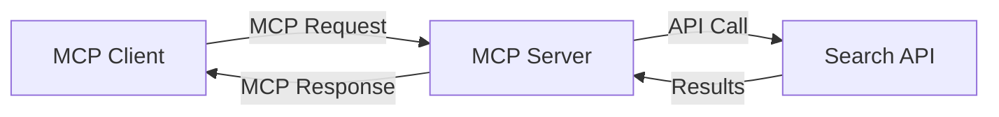
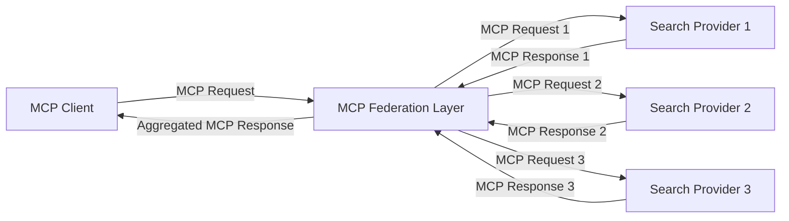
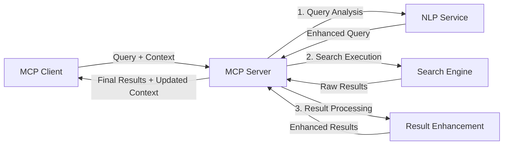

<!--
CO_OP_TRANSLATOR_METADATA:
{
  "original_hash": "333a03e51f90bdf3e6f1ba1694c73f36",
  "translation_date": "2025-07-17T12:42:20+00:00",
  "source_file": "05-AdvancedTopics/mcp-realtimesearch/README.md",
  "language_code": "my"
}
-->
## ကုဒ်နမူနာများ အကြောင်း သတိပေးချက်

> **အရေးကြီး သတိပေးချက်**: အောက်ပါကုဒ်နမူနာများသည် Model Context Protocol (MCP) ကို ဝက်ဘ်ရှာဖွေရေးလုပ်ဆောင်ချက်နှင့် ပေါင်းစပ်အသုံးပြုမှုကို ပြသထားသည်။ ၎င်းတို့သည် တရားဝင် MCP SDK များ၏ ပုံစံနှင့် ဖွဲ့စည်းမှုများကို လိုက်နာထားသော်လည်း သင်ကြားရေးအတွက် ရိုးရှင်းစေဖို့ ပြင်ဆင်ထားပါသည်။
> 
> ဤနမူနာများတွင် ပါဝင်သောအချက်များမှာ -
> 
> 1. **Python အကောင်အထည်ဖော်မှု**: FastMCP ဆာဗာတစ်ခုဖြစ်ပြီး ဝက်ဘ်ရှာဖွေရေးကိရိယာတစ်ခုကို ပံ့ပိုးပေးကာ ပြင်ပရှာဖွေရေး API နှင့် ချိတ်ဆက်ထားသည်။ ဤနမူနာသည် အသက်တာစီမံခန့်ခွဲမှု၊ context ကို ကိုင်တွယ်မှုနှင့် ကိရိယာအကောင်အထည်ဖော်မှုတို့ကို [တရားဝင် MCP Python SDK](https://github.com/modelcontextprotocol/python-sdk) ၏ ပုံစံအတိုင်း ပြသထားသည်။ ဆာဗာသည် Streamable HTTP သယ်ယူပို့ဆောင်မှုကို အသုံးပြုထားပြီး ယခင် SSE သယ်ယူပို့ဆောင်မှုထက် ပိုမိုသင့်တော်သော ထုတ်လုပ်မှုအသုံးပြုမှုများအတွက် အကြံပြုထားသည်။
> 
> 2. **JavaScript အကောင်အထည်ဖော်မှု**: FastMCP ပုံစံကို အသုံးပြုသည့် TypeScript/JavaScript အကောင်အထည်ဖော်မှုဖြစ်ပြီး [တရားဝင် MCP TypeScript SDK](https://github.com/modelcontextprotocol/typescript-sdk) မှ ရရှိသည်။ ၎င်းသည် ကိရိယာသတ်မှတ်ချက်များနှင့် client ချိတ်ဆက်မှုများကို မှန်ကန်စွာ ဖန်တီးထားပြီး အစည်းအဝေးစီမံခန့်ခွဲမှုနှင့် context ထိန်းသိမ်းမှုအတွက် နောက်ဆုံးအကြံပြုထားသော ပုံစံများကို လိုက်နာထားသည်။
> 
> ဤနမူနာများသည် ထုတ်လုပ်မှုအသုံးပြုမှုအတွက် အပို error handling, authentication နှင့် API ပေါင်းစည်းမှုကုဒ်များ လိုအပ်မည်ဖြစ်သည်။ ပြသထားသော search API endpoints (`https://api.search-service.example/search`) များမှာ နမူနာအဖြစ်သာဖြစ်ပြီး အမှန်တကယ် အသုံးပြုမည့် search service endpoints များဖြင့် အစားထိုးရန် လိုအပ်ပါသည်။
> 
> အပြည့်အစုံ အကောင်အထည်ဖော်မှုအသေးစိတ်နှင့် နောက်ဆုံးပေါ်နည်းလမ်းများအတွက် [တရားဝင် MCP specification](https://spec.modelcontextprotocol.io/) နှင့် SDK စာတမ်းများကို ရှာဖွေကြည့်ပါ။

## အဓိက အယူအဆများ

### Model Context Protocol (MCP) ဖွဲ့စည်းပုံ

အခြေခံအားဖြင့် Model Context Protocol သည် AI မော်ဒယ်များ၊ အက်ပလီကေးရှင်းများနှင့် ဝန်ဆောင်မှုများအကြား context ကို လွယ်ကူစွာ လဲလှယ်နိုင်ရန် စံပြနည်းလမ်းတစ်ခုဖြစ်သည်။ အချိန်နှင့်တပြေးညီ ဝက်ဘ်ရှာဖွေရေးတွင် MCP သည် ဆက်စပ်မှုရှိပြီး မျိုးစုံသော ရှာဖွေရေး အတွေ့အကြုံများ ဖန်တီးရန် အရေးကြီးသည်။ အဓိက အစိတ်အပိုင်းများမှာ -

1. **Client-Server ဖွဲ့စည်းပုံ**: MCP သည် ရှာဖွေရေး client များ (တောင်းဆိုသူများ) နှင့် ရှာဖွေရေး server များ (ပံ့ပိုးသူများ) အကြား သေချာခွဲခြားထားပြီး တပ်ဆင်မှု မော်ဒယ်များကို လွယ်ကူစွာ ချိန်ညှိနိုင်စေသည်။

2. **JSON-RPC ဆက်သွယ်မှု**: protocol သည် JSON-RPC ကို အသုံးပြု၍ စာတိုက်ပို့ဆက်သွယ်မှုများ ပြုလုပ်ပြီး ဝက်ဘ်နည်းပညာများနှင့် ကိုက်ညီပြီး မတူညီသော ပလက်ဖောင်းများတွင် လွယ်ကူစွာ အကောင်အထည်ဖော်နိုင်သည်။

3. **Context စီမံခန့်ခွဲမှု**: MCP သည် မျိုးစုံသော အပြန်အလှန်ဆက်ဆံမှုများအတွင်း context ကို ထိန်းသိမ်း၊ အပ်ဒိတ်လုပ်ခြင်းနှင့် အသုံးချခြင်းအတွက် ဖွဲ့စည်းထားသော နည်းလမ်းများကို သတ်မှတ်ထားသည်။

4. **ကိရိယာ သတ်မှတ်ချက်များ**: ရှာဖွေရေး စွမ်းဆောင်ရည်များကို စံပြကိရိယာများအဖြစ် ဖော်ပြထားပြီး parameter များနှင့် ပြန်လည်ထုတ်ပေးမှုများကို သေချာသတ်မှတ်ထားသည်။

5. **စီးဆင်းမှု ထောက်ပံ့မှု**: protocol သည် ရလဒ်များကို စီးဆင်းစေခြင်းကို ထောက်ပံ့ပြီး အချိန်နှင့်တပြေးညီ ရလဒ်များ ရရှိနိုင်စေရန် အရေးကြီးသည်။

### ဝက်ဘ်ရှာဖွေရေး ပေါင်းစည်းမှု ပုံစံများ

MCP ကို ဝက်ဘ်ရှာဖွေရေးနှင့် ပေါင်းစည်းရာတွင် အောက်ပါ ပုံစံများ တွေ့ရှိရသည် -

#### 1. တိုက်ရိုက် ရှာဖွေရေး ပံ့ပိုးသူ ပေါင်းစည်းမှု

ဤပုံစံတွင် MCP ဆာဗာသည် MCP တောင်းဆိုမှုများကို API အထူးသီးသန့် ခေါ်ဆိုမှုများသို့ ပြောင်းလဲပြီး ရလဒ်များကို MCP ဖြင့် ပြန်လည်ပေးပို့သည်။

#### 2. Context ထိန်းသိမ်းထားသော ဖက်ဒရေးတက် ရှာဖွေရေး

ဤပုံစံတွင် MCP ကိုက်ညီသော ရှာဖွေရေး ပံ့ပိုးသူများစွာတွင် ရှာဖွေရေး တောင်းဆိုမှုများကို ဖြန့်ဝေပြီး မတူညီသော အကြောင်းအရာများ သို့မဟုတ် ရှာဖွေရေး စွမ်းဆောင်ရည်များအတွက် အထူးပြုထားနိုင်ပြီး context တစ်ခုတည်းကို ထိန်းသိမ်းထားသည်။

#### 3. Context တိုးမြှင့်ထားသော ရှာဖွေရေး လုပ်ငန်းစဉ်

ဤပုံစံတွင် ရှာဖွေရေး လုပ်ငန်းစဉ်ကို အဆင့်အတန်းများစွာ ခွဲခြားပြီး context ကို အဆင့်တိုင်းတွင် တိုးမြှင့်ကာ ပိုမိုသင့်တော်သော ရလဒ်များ ရရှိစေသည်။

### ရှာဖွေရေး Context အစိတ်အပိုင်းများ

MCP အခြေပြု ဝက်ဘ်ရှာဖွေရေးတွင် context တွင် အများအားဖြင့် ပါဝင်သောအရာများမှာ -

- **တောင်းဆိုမှုမှတ်တမ်း**: အစည်းအဝေးအတွင်း ယခင် ရှာဖွေရေး တောင်းဆိုမှုများ
- **အသုံးပြုသူ စိတ်ကြိုက်များ**: ဘာသာစကား၊ ဒေသ၊ safe search ဆက်တင်များ
- **အပြန်အလှန် သမိုင်း**: ဘယ်ရလဒ်ကို နှိပ်ကြည့်ခဲ့သည်၊ ရလဒ်ပေါ်တွင် ကြာချိန်
- **ရှာဖွေရေး ပါရာမီတာများ**: စစ်ထုတ်မှုများ၊ စီစဉ်မှု အစရှိသည်
- **ဘာသာရပ်ဆိုင်ရာ အသိပညာ**: ရှာဖွေရေးနှင့် သက်ဆိုင်သော အကြောင်းအရာများ
- **အချိန်ဆိုင်ရာ Context**: အချိန်အခြေပြု သက်ဆိုင်မှုများ
- **အရင်းအမြစ် စိတ်ကြိုက်များ**: ယုံကြည်စိတ်ချရသော သို့မဟုတ် စိတ်ကြိုက် အချက်အလက် အရင်းအမြစ်များ

## အသုံးပြုမှုများနှင့် လျှောက်လွှာများ

### သုတေသနနှင့် အချက်အလက် စုဆောင်းခြင်း

MCP သည် သုတေသန လုပ်ငန်းစဉ်များကို အောက်ပါအတိုင်း တိုးတက်စေသည် -

- သုတေသန context ကို အစည်းအဝေးများအတွင်း ထိန်းသိမ်းခြင်း
- ပိုမိုတိုးတက်ပြီး context ကို သက်ဆိုင်စေသော တောင်းဆိုမှုများ ဖန်တီးခြင်း
- မျိုးစုံ အရင်းအမြစ် ရှာဖွေရေး ဖက်ဒရေးရှင်းကို ထောက်ပံ့ခြင်း
- ရလဒ်များမှ အသိပညာ ထုတ်ယူခြင်းကို အထောက်အကူပြုခြင်း

### အချိန်နှင့်တပြေးညီ သတင်းနှင့် လမ်းကြောင်း စောင့်ကြည့်ခြင်း

MCP အားဖြင့် ထောက်ပံ့သော ရှာဖွေရေးသည် သတင်းစောင့်ကြည့်မှုအတွက် အောက်ပါ အားသာချက်များ ရရှိစေသည် -

- ပိုမိုနီးကပ်သော အချိန်နှင့်တပြေးညီ သတင်းပေါ်ပေါက်မှု ရှာဖွေတွေ့ရှိခြင်း
- သက်ဆိုင်သော အချက်အလက်များကို context အရ စစ်ထုတ်ခြင်း
- မျိုးစုံ အရင်းအမြစ်များမှ ခေါင်းစဉ်နှင့် အဖွဲ့အစည်းများကို လိုက်လံခြင်း
- အသုံးပြုသူ context အပေါ် အခြေခံ၍ ကိုယ်ပိုင် သတင်းအသိပေးချက်များ ပေးခြင်း

### AI ဖြင့် တိုးတက်လာသော ဘရောက်ဇာနှင့် သုတေသန

MCP သည် AI ဖြင့် တိုးတက်လာသော ဘရောက်ဇာအသုံးပြုမှုအတွက် အောက်ပါ အခွင့်အလမ်းများ ဖန်တီးပေးသည် -

- လက်ရှိ ဘရောက်ဇာ လှုပ်ရှားမှုအပေါ် အခြေခံ၍ context အရ ရှာဖွေရေး အကြံပြုချက်များ
- ဝက်ဘ်ရှာဖွေရေးနှင့် LLM အားဖြင့် အကူအညီပေးသူများ ပေါင်းစည်းမှု အဆင်ပြေစေခြင်း
- context ထိန်းသိမ်းထားသော မျိုးစုံ ရှာဖွေရေး ပြန်လည်တိုးတက်မှု
- အချက်အလက် စစ်ဆေးခြင်းနှင့် အချက်အလက် အတည်ပြုခြင်း တိုးတက်စေခြင်း

## အနာဂတ် လမ်းကြောင်းများနှင့် တီထွင်ဆန်းသစ်မှုများ

### MCP ၏ ဝက်ဘ်ရှာဖွေရေးတွင် တိုးတက်မှု

အနာဂတ်တွင် MCP သည် အောက်ပါအချက်များကို ဖြေရှင်းရန် တိုးတက်လာမည်ဟု မျှော်လင့်ရသည် -

- **မျိုးစုံပုံစံ ရှာဖွေရေး**: စာသား၊ ပုံ၊ အသံနှင့် ဗီဒီယို ရှာဖွေရေးများကို context ထိန်းသိမ်းကာ ပေါင်းစည်းခြင်း
- **စင်တာမရှိသော ရှာဖွေရေး**: ဖြန့်ဝေထားသော နှင့် ဖက်ဒရေးရှင်း ရှာဖွေရေး စနစ်များကို ထောက်ပံ့ခြင်း
- **ရှာဖွေရေးကိုယ်ရေးအချက်အလက်ကာကွယ်မှု**: အကြောင်းအရာသိရှိပြီး ကိုယ်ရေးအချက်အလက်ကာကွယ်ထားသော ရှာဖွေရေးနည်းလမ်းများ  
- **မေးခွန်းနားလည်မှု**: သဘာဝဘာသာစကား ရှာဖွေရေးမေးခွန်းများ၏ အနက်အဓိပ္ပာယ်နက်ရှိုင်းစွာ ခွဲခြမ်းစိတ်ဖြာခြင်း  

### နည်းပညာတိုးတက်မှုများဖြစ်နိုင်ခြေ

MCP ရှာဖွေရေး၏ အနာဂတ်ကို ပုံသွင်းပေးမည့် နည်းပညာအသစ်များ -

1. **နယူးရယ်ရှာဖွေရေးဖွဲ့စည်းမှုများ**: MCP အတွက် အထူးပြုထားသော embedding အခြေပြု ရှာဖွေရေးစနစ်များ  
2. **ပုဂ္ဂိုလ်ရေးရှာဖွေရေးအကြောင်းအရာ**: အသုံးပြုသူတစ်ဦးချင်းစီ၏ ရှာဖွေရေးပုံစံများကို အချိန်အတော်ကြာ လေ့လာသိရှိခြင်း  
3. **အသိပညာဇယားပေါင်းစည်းမှု**: အထူးကဏ္ဍအသိပညာဇယားများဖြင့် အကြောင်းအရာအခြေပြု ရှာဖွေရေးတိုးတက်စေခြင်း  
4. **မော်ဒယ်အမျိုးမျိုးအကြောင်းအရာဆက်သွယ်မှု**: မတူညီသော ရှာဖွေရေးပုံစံများအကြား အကြောင်းအရာကို ဆက်လက်ထိန်းသိမ်းခြင်း  

## လက်တွေ့လေ့ကျင့်ခန်းများ

### လေ့ကျင့်ခန်း ၁: အခြေခံ MCP ရှာဖွေရေး လမ်းကြောင်း တည်ဆောက်ခြင်း

ဤလေ့ကျင့်ခန်းတွင် သင်သည် -  
- အခြေခံ MCP ရှာဖွေရေးပတ်ဝန်းကျင် တပ်ဆင်နည်း  
- ဝက်ဘ်ရှာဖွေရေးအတွက် အကြောင်းအရာကိုင်တွယ်သူများ အကောင်အထည်ဖော်နည်း  
- ရှာဖွေရေးအကြိမ်ရေများအတွင်း အကြောင်းအရာထိန်းသိမ်းမှု စမ်းသပ်အတည်ပြုနည်းများကို သင်ယူမည်  

### လေ့ကျင့်ခန်း ၂: MCP ရှာဖွေရေးဖြင့် သုတေသနအကူအညီပေးသူ တည်ဆောက်ခြင်း

အပြည့်အစုံသော အက်ပလီကေးရှင်းတစ်ခု ဖန်တီးပါ -  
- သဘာဝဘာသာစကား သုတေသနမေးခွန်းများကို လုပ်ဆောင်နိုင်ခြင်း  
- အကြောင်းအရာသိရှိပြီး ဝက်ဘ်ရှာဖွေရေး ပြုလုပ်နိုင်ခြင်း  
- အရင်းအမြစ်များစွာမှ သတင်းအချက်အလက်များကို ပေါင်းစပ်တင်ပြနိုင်ခြင်း  
- စနစ်တကျ စုစည်းထားသော သုတေသနရလဒ်များကို ဖော်ပြနိုင်ခြင်း  

### လေ့ကျင့်ခန်း ၃: MCP ဖြင့် မျိုးစုံရင်းမြစ် ရှာဖွေရေး ပေါင်းစည်းမှု အကောင်အထည်ဖော်ခြင်း

တိုးတက်သော လေ့ကျင့်ခန်း -  
- မျိုးစုံ ရှာဖွေရေးအင်ဂျင်များသို့ အကြောင်းအရာသိရှိပြီး မေးခွန်းများ ပို့ဆောင်ခြင်း  
- ရလဒ်များ အဆင့်သတ်မှတ်ခြင်းနှင့် စုစည်းခြင်း  
- ရှာဖွေရေးရလဒ်များ၏ အကြောင်းအရာအရ ထပ်တူမှု ဖယ်ရှားခြင်း  
- ရင်းမြစ်အလိုက် metadata ကို ကိုင်တွယ်ခြင်း  

## အပိုဆောင်း အရင်းအမြစ်များ

- [Model Context Protocol Specification](https://spec.modelcontextprotocol.io/) - MCP ၏ တရားဝင် ဖော်ပြချက်နှင့် အသေးစိတ် ပရိုတိုကော စာတမ်း  
- [Model Context Protocol Documentation](https://modelcontextprotocol.io/) - အသေးစိတ် သင်ခန်းစာများနှင့် အကောင်အထည်ဖော်လမ်းညွှန်များ  
- [MCP Python SDK](https://github.com/modelcontextprotocol/python-sdk) - MCP ပရိုတိုကော၏ တရားဝင် Python အကောင်အထည်  
- [MCP TypeScript SDK](https://github.com/modelcontextprotocol/typescript-sdk) - MCP ပရိုတိုကော၏ တရားဝင် TypeScript အကောင်အထည်  
- [MCP Reference Servers](https://github.com/modelcontextprotocol/servers) - MCP ဆာဗာများ၏ ကိုးကားအကောင်အထည်များ  
- [Bing Web Search API Documentation](https://learn.microsoft.com/en-us/bing/search-apis/bing-web-search/overview) - Microsoft ၏ ဝက်ဘ်ရှာဖွေရေး API  
- [Google Custom Search JSON API](https://developers.google.com/custom-search/v1/overview) - Google ၏ စိတ်ကြိုက် ရှာဖွေရေးအင်ဂျင်  
- [SerpAPI Documentation](https://serpapi.com/search-api) - ရှာဖွေရေးရလဒ် စာမျက်နှာ API  
- [Meilisearch Documentation](https://www.meilisearch.com/docs) - အခမဲ့ ရှာဖွေရေးအင်ဂျင်  
- [Elasticsearch Documentation](https://www.elastic.co/guide/index.html) - ဖြန့်ဝေထားသော ရှာဖွေရေးနှင့် သုံးသပ်မှုအင်ဂျင်  
- [LangChain Documentation](https://python.langchain.com/docs/get_started/introduction) - LLM များဖြင့် အက်ပလီကေးရှင်းများ တည်ဆောက်ခြင်း  

## သင်ယူရရှိမည့် အကျိုးအမြတ်များ

ဤမော်ဂျူးကို ပြီးမြောက်စွာ လေ့လာပြီးနောက် သင်သည် -

- အချိန်နှင့်တပြေးညီ ဝက်ဘ်ရှာဖွေရေး၏ အခြေခံအယူအဆများနှင့် စိန်ခေါ်မှုများကို နားလည်နိုင်မည်  
- Model Context Protocol (MCP) သည် အချိန်နှင့်တပြေးညီ ဝက်ဘ်ရှာဖွေရေးစွမ်းဆောင်ရည်များကို မည်သို့တိုးတက်စေသည်ကို ရှင်းပြနိုင်မည်  
- လူကြိုက်များသော ဖရိမ်ဝတ်များနှင့် API များကို အသုံးပြု၍ MCP အခြေပြု ရှာဖွေရေးဖြေရှင်းချက်များကို အကောင်အထည်ဖော်နိုင်မည်  
- MCP ဖြင့် တိုးတက်မြင့်မားသော စွမ်းဆောင်ရည်ရှိသော ရှာဖွေရေးဖွဲ့စည်းမှုများကို ဒီဇိုင်းဆွဲ၍ တပ်ဆင်နိုင်မည်  
- MCP အယူအဆများကို စာလုံးအဓိပ္ပာယ်ရှာဖွေရေး၊ သုတေသနအကူအညီပေးခြင်းနှင့် AI ဖြင့် တိုးတက်စေသော ဘရောက်ဇာ အသုံးပြုမှုများအပါအဝင် အမျိုးမျိုးသော အသုံးပြုမှုများတွင် လျှောက်ထားနိုင်မည်  
- MCP အခြေပြု ရှာဖွေရေးနည်းပညာများ၏ နောက်လာမည့် လမ်းကြောင်းများနှင့် နည်းပညာတိုးတက်မှုများကို သုံးသပ်နိုင်မည်  

### ယုံကြည်မှုနှင့် လုံခြုံရေးဆိုင်ရာ စဉ်းစားချက်များ

MCP အခြေပြု ဝက်ဘ်ရှာဖွေရေး ဖြေရှင်းချက်များကို အကောင်အထည်ဖော်ရာတွင် MCP ဖော်ပြချက်မှ အရေးကြီးသော 원칙များကို မှတ်သားပါ -

1. **အသုံးပြုသူ သဘောတူညီမှုနှင့် ထိန်းချုပ်မှု**: အသုံးပြုသူများသည် ဒေတာဝင်ရောက်မှုနှင့် လုပ်ဆောင်ချက်များအားလုံးကို ထောက်ခံသဘောတူရမည်ဖြစ်ပြီး နားလည်ထားရမည်။ အထူးသဖြင့် ဝက်ဘ်ရှာဖွေရေးတွင် ပြင်ပဒေတာရင်းမြစ်များကို ဝင်ရောက်နိုင်သော အကောင်အထည်ဖော်မှုများအတွက် အရေးကြီးသည်။  

2. **ဒေတာကိုယ်ရေးအချက်အလက်ကာကွယ်မှု**: ရှာဖွေရေးမေးခွန်းများနှင့် ရလဒ်များတွင် အထူးသဖြင့် အချက်အလက်ထိခိုက်နိုင်သော အချက်အလက်များပါဝင်နိုင်သောကြောင့် သင့်တော်သော ကိုင်တွယ်မှုများ ပြုလုပ်ရမည်။ အသုံးပြုသူဒေတာကို ကာကွယ်ရန် သင့်တော်သော ဝင်ရောက်ခွင့် ထိန်းချုပ်မှုများ ထည့်သွင်းဆောင်ရွက်ပါ။  

3. **ကိရိယာလုံခြုံမှု**: ရှာဖွေရေးကိရိယာများသည် မည်သည့်အချိန်မဆို arbitrary code အကောင်အထည်ဖော်မှုမှ ဖြစ်ပေါ်နိုင်သော လုံခြုံရေးအန္တရာယ်များကို ကိုယ်စားပြုသည်။ ထိုကိရိယာများ၏ လုပ်ဆောင်ချက်ဖော်ပြချက်များကို ယုံကြည်စိတ်ချရမှုမရှိသော အချက်အလက်အဖြစ် သတ်မှတ်ရမည်၊ ယုံကြည်စိတ်ချရသော ဆာဗာမှသာ ရရှိထားပါကသာ ယုံကြည်နိုင်သည်။  

4. **ရှင်းလင်းသော စာတမ်းများ**: MCP အကောင်အထည်ဖော်မှု၏ စွမ်းဆောင်ရည်များ၊ ကန့်သတ်ချက်များနှင့် လုံခြုံရေးဆိုင်ရာ စဉ်းစားချက်များကို MCP ဖော်ပြချက်မှ လမ်းညွှန်ချက်များအတိုင်း ရှင်းလင်းစွာ ဖော်ပြထားရမည်။  

5. **ခိုင်မာသော သဘောတူညီမှု လုပ်ငန်းစဉ်များ**: ကိရိယာတစ်ခုချင်းစီ၏ လုပ်ဆောင်ချက်ကို အသုံးပြုခွင့်မပြုမီ ရှင်းလင်းစွာ ရှင်းပြသည့် သဘောတူညီမှုနှင့် ခွင့်ပြုမှု လုပ်ငန်းစဉ်များကို တည်ဆောက်ပါ၊ အထူးသဖြင့် ပြင်ပ ဝက်ဘ်ရင်းမြစ်များနှင့် ဆက်သွယ်သော ကိရိယာများအတွက် ဖြစ်သည်။  

MCP လုံခြုံရေးနှင့် ယုံကြည်မှုဆိုင်ရာ အသေးစိတ်အချက်အလက်များအတွက် [တရားဝင်စာတမ်း](https://modelcontextprotocol.io/specification/2025-03-26#security-and-trust-%26-safety) ကို ကြည့်ရှုပါ။  

## နောက်တစ်ဆင့်

- [5.12 Entra ID Authentication for Model Context Protocol Servers](../mcp-security-entra/README.md)

**အကြောင်းကြားချက်**  
ဤစာတမ်းကို AI ဘာသာပြန်ဝန်ဆောင်မှု [Co-op Translator](https://github.com/Azure/co-op-translator) ဖြင့် ဘာသာပြန်ထားပါသည်။ ကျွန်ုပ်တို့သည် တိကျမှန်ကန်မှုအတွက် ကြိုးစားသော်လည်း၊ အလိုအလျောက် ဘာသာပြန်ခြင်းများတွင် အမှားများ သို့မဟုတ် မှားယွင်းချက်များ ပါဝင်နိုင်ကြောင်း သတိပြုပါရန် မေတ္တာရပ်ခံအပ်ပါသည်။ မူရင်းစာတမ်းကို မူလဘာသာဖြင့်သာ အတည်ပြုရမည့် အရင်းအမြစ်အဖြစ် သတ်မှတ်သင့်ပါသည်။ အရေးကြီးသော အချက်အလက်များအတွက် လူ့ဘာသာပြန်ပညာရှင်မှ ဘာသာပြန်ခြင်းကို အကြံပြုပါသည်။ ဤဘာသာပြန်ချက်ကို အသုံးပြုရာမှ ဖြစ်ပေါ်လာနိုင်သည့် နားလည်မှုမှားယွင်းမှုများအတွက် ကျွန်ုပ်တို့ တာဝန်မယူပါ။