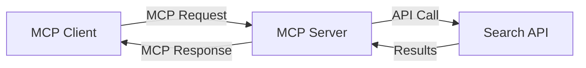
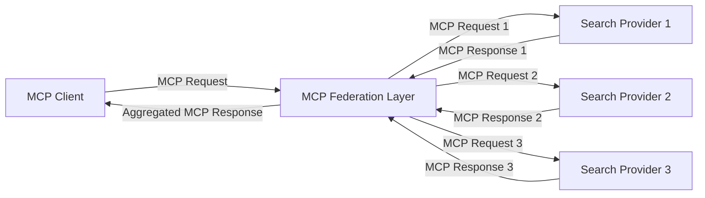
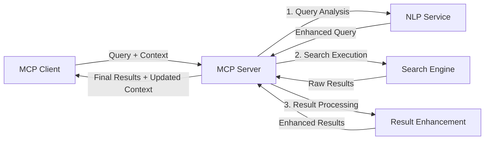

<!--
CO_OP_TRANSLATOR_METADATA:
{
  "original_hash": "16bef2c93c6a86d4ca6a8ce9e120e384",
  "translation_date": "2025-06-17T16:54:44+00:00",
  "source_file": "05-AdvancedTopics/mcp-realtimesearch/README.md",
  "language_code": "my"
}
-->
## ကုဒ် ဥပမာများ အကြောင်း သတိပေးချက်

> **အရေးကြီး သတိပေးချက်**: အောက်ပါကုဒ် ဥပမာများသည် Model Context Protocol (MCP) ကို ဝဘ်ရှာဖွေရေး လုပ်ဆောင်ချက်နှင့် ပေါင်းစပ်အသုံးပြုမှုကို ပြသထားသည်။ ၎င်းတို့သည် တရားဝင် MCP SDK များ၏ ပုံစံနှင့် ဖွဲ့စည်းမှုများကို လိုက်နာထားသော်လည်း ပညာသင်ကြားမှုအတွက် ရိုးရှင်းစွာ ပြုလုပ်ထားပါသည်။
> 
> ဤဥပမာများတွင် ပါဝင်သောအချက်များမှာ –
> 
> 1. **Python လုပ်ဆောင်ချက်**: FastMCP server ကို အသုံးပြု၍ ဝဘ်ရှာဖွေရေး ကိရိယာတစ်ခုကို ဖန်တီးပြီး ပြင်ပရှာဖွေရေး API နှင့် ချိတ်ဆက်ထားသည်။ ဤဥပမာတွင် အသက်တာစီမံခန့်ခွဲမှု၊ context ကိုင်တွယ်မှုနှင့် ကိရိယာအကောင်အထည်ဖော်မှုကို [တရားဝင် MCP Python SDK](https://github.com/modelcontextprotocol/python-sdk) ၏ ပုံစံအတိုင်း ပြသထားသည်။ server သည် Streamable HTTP သယ်ယူပို့ဆောင်မှုကို အသုံးပြုထားပြီး ယင်းသည် အထူးသဖြင့် စွမ်းဆောင်ရည်မြင့် စနစ်များတွင် SSE သယ်ယူပို့ဆောင်မှုကို အစားထိုးထားသည်။
> 
> 2. **JavaScript လုပ်ဆောင်ချက်**: TypeScript/JavaScript ဖြင့် FastMCP ပုံစံကို အသုံးပြုပြီး [တရားဝင် MCP TypeScript SDK](https://github.com/modelcontextprotocol/typescript-sdk) မှ တဆင့် ရှာဖွေရေး server တစ်ခုကို ဖန်တီးထားပြီး ကိရိယာသတ်မှတ်ချက်များနှင့် client ချိတ်ဆက်မှုများကို မှန်ကန်စွာ ပြုလုပ်ထားသည်။ session စီမံခန့်ခွဲမှုနှင့် context ထိန်းသိမ်းမှုအတွက် လက်ရှိ အကြံပြုထားသည့် ပုံစံများကို လိုက်နာထားသည်။
> 
> ဤဥပမာများသည် ထုတ်လုပ်ရေးအသုံးပြုမှုအတွက် အမှားကာကွယ်မှု၊ အတည်ပြုမှုနှင့် API ပေါင်းစပ်မှု ကုဒ်များကို ထပ်မံ ထည့်သွင်းရန် လိုအပ်ပါသည်။ ပြသထားသည့် ရှာဖွေရေး API လိပ်စာများ (`https://api.search-service.example/search`) သည် နမူနာဖြစ်ပြီး သက်ဆိုင်ရာ ရှာဖွေရေး ဝန်ဆောင်မှုလိပ်စာများဖြင့် အစားထိုးရန် လိုအပ်ပါသည်။
> 
> အသေးစိတ် အကောင်အထည်ဖော်မှု နည်းလမ်းများနှင့် နောက်ဆုံးပေါ် နည်းပညာများအတွက် [တရားဝင် MCP သတ်မှတ်ချက်](https://spec.modelcontextprotocol.io/) နှင့် SDK စာတမ်းများကို ရည်ညွှန်းပါ။

## အဓိက အယူအဆများ

### Model Context Protocol (MCP) Framework

အခြေခံအားဖြင့် Model Context Protocol သည် AI မော်ဒယ်များ၊ အက်ပလီကေးရှင်းများနှင့် ဝန်ဆောင်မှုများအကြား context အချက်အလက်များကို စံနှုန်းတကျ လဲလှယ်နိုင်စေရန် ဖွဲ့စည်းထားသည်။ အချိန်နှင့်တပြေးညီ ဝဘ်ရှာဖွေရေးတွင် ၎င်းသည် စနစ်တကျ၊ မျိုးစုံ လှုပ်ရှားမှုများနှင့် တစ်ဆက်တည်း ရှာဖွေရေး အတွေ့အကြုံများ ဖန်တီးရန် မရှိမဖြစ် လိုအပ်သည်။ အဓိက အစိတ်အပိုင်းများမှာ –

1. **Client-Server ဖွဲ့စည်းမှု**: MCP သည် ရှာဖွေရေး client များ (တောင်းဆိုသူများ) နှင့် ရှာဖွေရေး server များ (ပေးသူများ) ကို သေချာခွဲခြားထားပြီး ပိုမိုလွယ်ကူသော တပ်ဆင်မှု မော်ဒယ်များ ဖန်တီးနိုင်စေသည်။

2. **JSON-RPC ဆက်သွယ်မှု**: protocol သည် JSON-RPC ကို အသုံးပြု၍ သတင်းစကားများ လဲလှယ်ခြင်းဖြင့် ဝဘ်နည်းပညာများနှင့် ကိုက်ညီပြီး ပလက်ဖောင်း မျိုးစုံတွင် လွယ်ကူစွာ အကောင်အထည်ဖော်နိုင်သည်။

3. **Context စီမံခန့်ခွဲမှု**: MCP သည် ရှာဖွေရေး context ကို မျိုးစုံ လှုပ်ရှားမှုများအတွင်း ထိန်းသိမ်း၊ ပြုပြင်နှင့် အသုံးချနိုင်ရန် ဖွဲ့စည်းထားသည်။

4. **ကိရိယာသတ်မှတ်ချက်များ**: ရှာဖွေရေး စွမ်းဆောင်ရည်များကို parameter များနှင့် ပြန်လည်ပေးပို့မှုတန်ဖိုးများဖြင့် စံနှုန်းတကျ ကိရိယာများအဖြစ် ဖော်ပြထားသည်။

5. **စီးဆင်းမှု ထောက်ပံ့မှု**: protocol သည် ရလဒ်များကို စီးဆင်းသွားအောင် ထောက်ပံ့နိုင်ပြီး အချိန်နှင့်တပြေးညီ ရလဒ်များ ရရှိနိုင်စေရန် လိုအပ်သည်။

### ဝဘ်ရှာဖွေရေး ပေါင်းစပ်မှု ပုံစံများ

MCP ကို ဝဘ်ရှာဖွေရေးနှင့် ပေါင်းစပ်သုံးစွဲသောအခါ အောက်ပါ ပုံစံများ တွေ့ရှိရသည် –

#### 1. တိုက်ရိုက် ရှာဖွေရေး ပေးသူ ပေါင်းစပ်မှု

ဤပုံစံတွင် MCP server သည် တိုက်ရိုက် ရှာဖွေရေး API များနှင့် ချိတ်ဆက်ပြီး MCP တောင်းဆိုမှုများကို API အလိုက် ခေါ်ယူသည့် ဖော်ပြချက်များသို့ ပြောင်းလဲပေးကာ ရလဒ်များကို MCP ပြန်လည်ဖြေကြားမှုအဖြစ် ဖော်ပြသည်။

#### 2. Context ထိန်းသိမ်းထားသည့် ပေါင်းစပ် ရှာဖွေရေး

ဤပုံစံတွင် ရှာဖွေရေး တောင်းဆိုမှုများကို MCP ကိုက်ညီသော ရှာဖွေရေး ပေးသူ များစွာထံ ဖြန့်ဝေပြီး မတူညီသော အကြောင်းအရာ သို့မဟုတ် ရှာဖွေရေး စွမ်းဆောင်ရည်များအပေါ် အထူးပြုနိုင်သည့် ပေးသူများပါဝင်သည်။ တစ်ပြိုင်နက်တည်း context ကို ထိန်းသိမ်းထားသည်။

#### 3. Context အား တိုးမြှင့်ထားသည့် ရှာဖွေရေး လုပ်ငန်းစဉ်

ဤပုံစံတွင် ရှာဖွေရေး လုပ်ငန်းစဉ်ကို အဆင့်အတန်း များစွာခွဲခြားထားပြီး context ကို အဆင့်တိုင်းတွင် တိုးမြှင့်ခြင်းဖြင့် ရလဒ်များကို တိုးတက်စေသည်။

### ရှာဖွေရေး Context အစိတ်အပိုင်းများ

MCP အခြေပြု ဝဘ်ရှာဖွေရေးတွင် context တွင် အများအားဖြင့် ပါဝင်သောအချက်များမှာ –

- **တောင်းဆိုမှု မှတ်တမ်း**: အစဉ်လိုက် ရှာဖွေရေး တောင်းဆိုမှုများ
- **အသုံးပြုသူ ကြိုက်နှစ်သက်ချက်များ**: ဘာသာစကား၊ ဒေသ၊ ဘေးကင်းလုံခြုံမှု စနစ်များ
- **အပြန်အလှန် လှုပ်ရှားမှု မှတ်တမ်း**: မည်သည့် ရလဒ်များကို နှိပ်ကြည့်ခဲ့သည်၊ ရလဒ်ပေါ်တွင် ကုန်ကြေး သုံးစွဲချိန်
- **ရှာဖွေရေး ပါရာမီတာများ**: စစ်ထုတ်မှုများ၊ အစီအစဉ်များနှင့် အခြား ရှာဖွေရေး ပြုပြင်မှုများ
- **ဘာသာရပ်ဆိုင်ရာ သိပ္ပံအချက်အလက်များ**: ရှာဖွေရေးနှင့် သက်ဆိုင်သော အကြောင်းအရာများ
- **အချိန်ဆိုင်ရာ Context**: အချိန်အခြေပြု သက်ဆိုင်မှုများ
- **အရင်းအမြစ် ကြိုက်နှစ်သက်ချက်များ**: ယုံကြည်စိတ်ချရသော သို့မဟုတ် ကြိုက်နှစ်သက်သော အချက်အလက် များ

## အသုံးပြုမှုများနှင့် လျှောက်လွှာများ

### သုတေသနနှင့် သတင်းအချက်အလက် စုဆောင်းခြင်း

MCP သည် သုတေသန လုပ်ငန်းစဉ်များကို အောက်ပါအတိုင်း တိုးတက်စေသည် –

- သုတေသန context ကို ရှာဖွေရေး အစည်းအဝေးများအတွင်း ထိန်းသိမ်းခြင်း
- ပိုမိုရှုပ်ထွေးပြီး context ကို အသုံးပြုသော တောင်းဆိုမှုများ ဖန်တီးနိုင်ခြင်း
- မျိုးစုံ အရင်းအမြစ်များမှ ရှာဖွေရေး ပေါင်းစပ်မှု ထောက်ပံ့ခြင်း
- ရလဒ်များမှ သိပ္ပံအချက်အလက် ထုတ်ယူခြင်း အထောက်အကူဖြစ်စေခြင်း

### အချိန်နှင့်တပြေးညီ သတင်းနှင့် ထိပ်တန်း အခြေအနေများ စောင့်ကြည့်ခြင်း

MCP အားဖြင့် ထောက်ပံ့ထားသည့် ရှာဖွေရေးသည် သတင်းစောင့်ကြည့်မှုတွင် အောက်ပါ အားသာချက်များ ရရှိစေသည် –

- ဖြစ်ပေါ်လာသည့် သတင်းများကို နီးစပ်စွာ အချိန်နှင့်တပြေးညီ ရှာဖွေတွေ့ရှိနိုင်ခြင်း
- သက်ဆိုင်ရာ သတင်းအချက်အလက်များကို context အရ စစ်ထုတ်ခြင်း
- အကြောင်းအရာနှင့် အဖွဲ့အစည်းများကို မျိုးစုံ အရင်းအမြစ်များတွင် ချိန်ညှိစောင့်ကြည့်ခြင်း
- အသုံးပြုသူ context အပေါ် အခြေခံ၍ ကိုယ်ပိုင် သတင်း အချက်ပေးချက်များ ပေးခြင်း

### AI ဖြင့် တိုးမြှင့်ထားသော ကြည့်ရှုခြင်းနှင့် သုတေသန

MCP သည် AI ဖြင့် တိုးမြှင့်ထားသော ကြည့်ရှုခြင်းအတွက် အောက်ပါ အခွင့်အလမ်းများ ဖန်တီးပေးသည် –

- လက်ရှိ browser လှုပ်ရှားမှုအပေါ် အခြေခံ၍ context များပါဝင်သည့် ရှာဖွေရေး အကြံပြုချက်များ
- ဝဘ်ရှာဖွေရေးနှင့် LLM ဖြင့် အားဖြည့်ထားသော အကူအညီများ ပေါင်းစပ်ခြင်း
- context ထိန်းသိမ်းထားသည့် မျိုးစုံ လှုပ်ရှားမှုများဖြင့် ရှာဖွေရေး တိုးတက်မှု
- အချက်အလက် စစ်ဆေးခြင်းနှင့် အတည်ပြုခြင်းများ တိုးတက်စေခြင်း

## အနာဂတ် လမ်းစဉ်များနှင့် နည်းပညာ တိုးတက်မှုများ

### ဝဘ်ရှာဖွေရေးတွင် MCP ၏ တိုးတက်မှုများ

အနာဂတ်တွင် MCP သည် အောက်ပါ အချက်များကို ဖြေရှင်းရန် ရည်ရွယ်ထားသည် –

- **မျိုးစုံမီဒီယာ ရှာဖွေရေး**: စာသား၊ ပုံ၊ အသံနှင့် ဗီဒီယို ရှာဖွေရေးများကို context ထိန်းသိမ်းထား၍ ပေါင်းစပ်ခြင်း
- **ဝေစုဖက် ရှာဖွေရေး**: ဖြန့်ဝေထားသော ရှာဖွေရေး စနစ်များနှင့် ပေါင်းစပ်မှု
- **ရှာဖွေရေး ကိုယ်ရေးအချက်အလက် လုံခြုံရေး**: context ကို အသိအမှတ်မပြုဘဲ လုံခြုံစေသော ရှာဖွေရေးနည်းလမ်းများ
- **တောင်းဆိုမှု နားလည်မှု**: သဘာဝဘာသာ ရှာဖွေရေး တောင်းဆိုမှုများကို နက်ရှိုင်းစွာ သဘောတရား ဖြင့် ခွဲခြမ်းစိတ်ဖြာခြင်း

### နည်းပညာ တိုးတက်မှုများ

MCP ရှာဖွေရေး၏ အနာဂတ်ကို ပုံသေနိုင်မည့် နည်းပညာအသစ်များမှာ –

1. **နယူးရယ် ရှာဖွေရေး ဖွဲ့စည်းမှုများ**: MCP အတွက် အထူးပြု၍ စနစ်တကျ ဖွဲ့စည်းထားသည့် embedding အခြေပြု ရှာဖွေရေး စနစ်များ
2. **ကိုယ်ပိုင် အသုံးပြုသူ ရှာဖွေရေး Context**: အသုံးပြုသူတစ်ဦးချင်းစီ၏ ရှာဖွေရေး စနစ်များကို အချိန်အတော်ကြာ လေ့လာသိရှိခြင်း
3. **အသိပညာ ဇယား ပေါင်းစပ်မှု**: ဘာသာရပ်အလိုက် အသိပညာ ဇယားများဖြင့် context တိုးမြှင့်ခြင်း
4. **မျိုးစုံ မီဒီယာ Context ထိန်းသိမ်းမှု**: မတူညီသော ရှာဖွေရေး မီဒီယာများအကြား context ထိန်းသိမ်းခြင်း

## လက်တွေ့ လေ့ကျင့်ခန်းများ

### လေ့ကျင့်ခန်း ၁: အခြေခံ MCP ရှာဖွေရေး လမ်းကြောင်း တည်ဆောက်ခြင်း

ဤလေ့ကျင့်ခန်းတွင် သင်သည် –
- အခြေခံ MCP ရှာဖွေရေး ပတ်ဝန်းကျင် တပ်ဆင်နည်း
- ဝဘ်ရှာဖွေရေးအတွက် context ကိုင်တွယ်မှု လုပ်ဆောင်နည်းများ
- ရှာဖွေရေး လှုပ်ရှားမှုများအတွင်း context ထိန်းသိမ်းမှု စစ်ဆေးခြင်း

### လေ့ကျင့်ခန်း ၂: MCP ရှာဖွေရေးဖြင့် သုတေသန အကူအညီရေးဆွဲခြင်း

လုံးဝအသုံးပြုနိုင်သော အက်ပလီကေးရှင်းတစ်ခု ဖန်တီးပါ၊ ၎င်းတွင် –
- သဘာဝဘာသာ သုတေသန မေးခွန်းများ ကို ကိုင်တွယ်ခြင်း
- context ကို ထိန်းသိမ်းသည့် ဝဘ်ရှာဖွေရေး လုပ်ဆောင်ခြင်း
- မျိုးစုံအရင်းအမြစ်မှ အချက်အလက်များ စုဆောင်းခြင်း
- စုစည်းထားသော သုတေသန ရလဒ်များကို တင်ပြခြင်း

### လေ့ကျင့်ခန်း ၃: MCP ဖြင့် မျိုးစုံ အရင်းအမြစ် ရှာဖွေရေး ပေါင်းစပ်ခြင်း အကောင်အထည်ဖော်ခြင်း

အဆင့်မြင့် လေ့ကျင့်ခန်း၊ အောက်ပါ အချက်များ ပါဝင်သည် –
- မျိုးစုံ ရှာဖွေရေး အင်ဂျင်များသို့ context-aware query ပို့ခြင်း
- ရလဒ် အဆင့်သတ်မှတ်ခြင်းနှင့် ပေါင်းစပ်ခြင်း
- ရလဒ်များအတွင်း context အခြေခံ duplicate ဖယ်ရှားခြင်း
- အရင်းအမြစ် အထူး metadata ကို ကိုင်တွယ်ခြင်း

## အပိုဆောင်း အရင်းအမြစ်များ

- [Model Context Protocol Specification](https://spec.modelcontextprotocol.io/) - တရားဝင် MCP သတ်မှတ်ချက်နှင့် protocol အသေးစိတ် စာတမ်းများ
- [Model Context Protocol Documentation](https://modelcontextprotocol.io/) - အသေးစိတ် သင်ခန်းစာများနှင့် အကောင်အထည်ဖော်နည်းလမ်းညွှန်များ
- [MCP Python SDK](https://github.com/modelcontextprotocol/python-sdk) - MCP protocol ၏ တရားဝင် Python အကောင်အထည်ဖော်မှု
- [MCP TypeScript SDK](https://github.com/modelcontextprotocol/typescript-sdk) - MCP protocol ၏ တရားဝင် TypeScript အကောင်အထည်ဖော်မှု
- [MCP Reference Servers](https://github.com/modelcontextprotocol/servers) - MCP server မ

**အကြောင်းကြားချက်**  
ဤစာတမ်းကို AI ဘာသာပြန်ဝန်ဆောင်မှု [Co-op Translator](https://github.com/Azure/co-op-translator) ဖြင့် ဘာသာပြန်ထားပါသည်။ ကျွန်ုပ်တို့သည် တိကျမှုအတွက် ကြိုးပမ်းပေမယ့်၊ အလိုအလျောက်ဘာသာပြန်ခြင်းအတွက် အမှားများ သို့မဟုတ် မှားယွင်းချက်များ ပါဝင်နိုင်ကြောင်း သတိပြုပါရန် လိုအပ်ပါသည်။ မူရင်းစာတမ်းကို မူလဘာသာဖြင့်သာ အတည်ပြုရမည့် အရင်းအမြစ်အဖြစ် သတ်မှတ်သင့်ပါသည်။ အရေးကြီးသော သတင်းအချက်အလက်များအတွက် လူကြီးမင်းသည် ပညာရှင်လူသား ဘာသာပြန်သူမှ ဘာသာပြန်ခြင်းကို ဦးစားပေးအသုံးပြုရန် အကြံပြုပါသည်။ ဤဘာသာပြန်ချက်ကို အသုံးပြုရာမှ ဖြစ်ပေါ်လာသော နားလည်မှုမှားယွင်းခြင်းများအတွက် ကျွန်ုပ်တို့မှာ တာဝန်မရှိပါ။