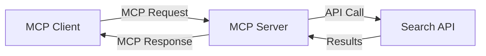
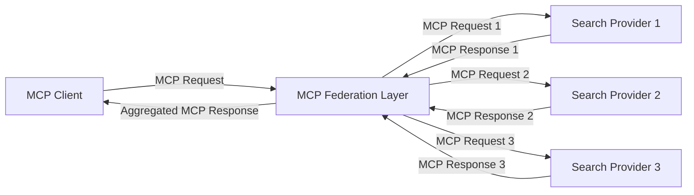
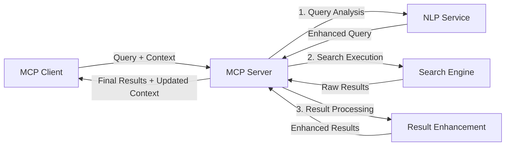

<!--
CO_OP_TRANSLATOR_METADATA:
{
  "original_hash": "eb12652eb7bd17f2193b835a344425c6",
  "translation_date": "2025-06-26T14:28:28+00:00",
  "source_file": "05-AdvancedTopics/mcp-realtimesearch/README.md",
  "language_code": "my"
}
-->
## ကုဒ်နမူနာများ အကြောင်း သတိပေးချက်

> **အရေးကြီးသော မှတ်ချက်**: အောက်ပါကုဒ်နမူနာများသည် Model Context Protocol (MCP) ကို ဝဘ်ရှာဖွေရေး လုပ်ဆောင်ချက်နှင့် ပေါင်းစပ်ပြသထားခြင်းဖြစ်သည်။ ၎င်းတို့သည် MCP SDK မူရင်းပုံစံနှင့် ဖွဲ့စည်းမှုများကိုလိုက်နာထားသော်လည်း သင်ကြားရေးအတွက် ရိုးရှင်းအောင် ပြုလုပ်ထားပါသည်။
> 
> ဤနမူနာများတွင် ဖော်ပြထားသောအချက်များမှာ –
> 
> 1. **Python အကောင်အထည်ဖော်မှု**: FastMCP ဆာဗာတစ်ခုဖြင့် ဝဘ်ရှာဖွေရေးကိရိယာကို ပံ့ပိုးကာ ပြင်ပရှာဖွေရေး API နှင့် ချိတ်ဆက်ထားသည်။ ဤနမူနာတွင် အသက်တာစီမံခန့်ခွဲမှု၊ ပတ်ဝန်းကျင် ကိုင်တွယ်မှုနှင့် ကိရိယာအကောင်အထည်ဖော်မှုတို့ကို [MCP Python SDK](https://github.com/modelcontextprotocol/python-sdk) ရဲ့ ပုံစံအတိုင်း ပြသထားသည်။ ဆာဗာတွင် Streamable HTTP ပို့ဆောင်မှုကို အသုံးပြုထားပြီး၊ ဤနည်းစနစ်သည် ယခင် SSE ပို့ဆောင်မှုထက် ပိုမိုထိရောက်သဖြင့် ထုတ်လုပ်မှုအတွက် အသုံးပြုသည်။
> 
> 2. **JavaScript အကောင်အထည်ဖော်မှု**: FastMCP ပုံစံကို အသုံးပြု၍ TypeScript/JavaScript ဖြင့် ရေးသားထားသော ဆာဗာဖြစ်ပြီး [MCP TypeScript SDK](https://github.com/modelcontextprotocol/typescript-sdk) မှ တိုက်ရိုက် လမ်းညွှန်ချက်များနှင့် လိုက်နာမှုများကို သုံးပြီး ကိရိယာသတ်မှတ်ချက်များနှင့် ဖောက်သည်ချိတ်ဆက်မှုများပါဝင်သည်။ ၎င်းသည် အစီအစဉ်စီမံခန့်ခွဲမှုနှင့် ပတ်ဝန်းကျင်ထိန်းသိမ်းမှုအတွက် အကြံပြုထားသည့် နောက်ဆုံးပေါ် ပုံစံများကို လိုက်နာသည်။
> 
> ဤနမူနာများသည် ထုတ်လုပ်မှုတွင် အပို Error Handling၊ အတည်ပြုမှုနှင့် API ပေါင်းစည်းမှုများ လိုအပ်မည်ဖြစ်ပြီး၊ ဖော်ပြထားသည့် search API endpoints (`https://api.search-service.example/search`) များမှာ နမူနာ URL များဖြစ်ပြီး သင့်ရဲ့ ရှာဖွေရေးဝန်ဆောင်မှု URL များဖြင့် အစားထိုးရန် လိုအပ်ပါသည်။
> 
> စုံလင်သော အကောင်အထည်ဖော်မှု အသေးစိတ်များနှင့် နောက်ဆုံးပေါ်နည်းလမ်းများအတွက် [MCP မူဝါဒ](https://spec.modelcontextprotocol.io/) နှင့် SDK စာရွက်စာတမ်းများကို ကြည့်ရှုပါ။

## အဓိက အယူအဆများ

### Model Context Protocol (MCP) ဖွဲ့စည်းပုံ

အခြေခံအားဖြင့် Model Context Protocol သည် AI မော်ဒယ်များ၊ အက်ပလီကေးရှင်းများနှင့် ဝန်ဆောင်မှုများအကြား ပတ်ဝန်းကျင် (context) ကို စံသတ်မှတ်ထားသော နည်းလမ်းဖြင့် လဲလှယ်ရန် အဓိကဖြစ်သည်။ အချိန်နှင့်တပြေးညီ ဝဘ်ရှာဖွေရေးတွင် MCP သည် ပိုမိုညီညွတ်ပြီး မျိုးစုံ အဆင့်ဆင့် ရှာဖွေရေး အတွေ့အကြုံများ ဖန်တီးရန် မရှိမဖြစ်လိုအပ်သော ဖွဲ့စည်းပုံဖြစ်သည်။ အဓိက ပါဝင်ပစ္စည်းများမှာ -

1. **ဖောက်သည်-ဆာဗာ ဖွဲ့စည်းပုံ**: MCP သည် ရှာဖွေရေးဖောက်သည်များ (တောင်းဆိုသူ) နှင့် ရှာဖွေရေးဆာဗာများ (ပံ့ပိုးသူ) အကြား သီးခြားမှုကို သတ်မှတ်ပေးကာ ချိတ်ဆက်မှု မော်ဒယ်များ အလွယ်တကူ ပြုလုပ်နိုင်စေသည်။

2. **JSON-RPC ဆက်သွယ်မှု**: စာတိုက်ဆက်သွယ်ရာတွင် JSON-RPC ကို အသုံးပြု၍ ဝဘ်နည်းပညာများနှင့် ကိုက်ညီပြီး မတူညီသော ပလက်ဖောင်းများတွင်လည်း အကောင်အထည်ဖော်ရန် လွယ်ကူသည်။

3. **ပတ်ဝန်းကျင် စီမံခန့်ခွဲမှု**: MCP သည် ရှာဖွေရေး ပတ်ဝန်းကျင်ကို မျိုးစုံ ဆက်သွယ်မှုများအတွင်း ထိန်းသိမ်း၊ ပြုပြင်၊ အသုံးချ နည်းလမ်းများကို သတ်မှတ်ထားသည်။

4. **ကိရိယာ သတ်မှတ်ချက်များ**: ရှာဖွေရေး လုပ်ဆောင်ချက်များကို စံသတ်မှတ်ထားသော ကိရိယာများအဖြစ် ဖော်ပြပြီး parameter များနှင့် ပြန်လည်ထုတ်ပေးမှုများ သတ်မှတ်ထားသည်။

5. **စီးဆင်းမှု ထောက်ပံ့မှု**: ရလဒ်များကို အဆင့်ဆင့် စီးဆင်းပေးနိုင်မှုကို ထောက်ပံ့ကာ အချိန်နှင့်တပြေးညီ ရလဒ်ရရှိရေးအတွက် အရေးကြီးသည်။

### ဝဘ်ရှာဖွေရေး ပေါင်းစပ်မှု ပုံစံများ

MCP နှင့် ဝဘ်ရှာဖွေရေး ပေါင်းစပ်သောအခါ တွေ့ရသော ပုံစံများမှာ -

#### 1. တိုက်ရိုက် ရှာဖွေရေး ပံ့ပိုးသူ ပေါင်းစပ်မှု

ဤပုံစံတွင် MCP ဆာဗာသည် ရှာဖွေရေး API တစ်ခု သို့မဟုတ် အများကြီးနှင့် တိုက်ရိုက် ဆက်သွယ်ကာ MCP တောင်းဆိုမှုများကို API အတွက် သီးခြားခေါ်ယူမှုများအဖြစ် ပြောင်းလဲပေးပြီး ရလဒ်များကို MCP အဖြစ် ဖော်ပြသည်။

#### 2. ပတ်ဝန်းကျင် ထိန်းသိမ်းထားသော ဖက်ဒရိတ် ရှာဖွေရေး

ဤပုံစံသည် MCP ကိုက်ညီသော ရှာဖွေရေး ပံ့ပိုးသူ အများအပြားသို့ ရှာဖွေရေး တောင်းဆိုမှုများကို ဖြန့်ဝေသုံးစွဲကာ အမျိုးမျိုးသော အကြောင်းအရာများ သို့မဟုတ် ရှာဖွေရေး လုပ်ဆောင်ချက်များအတွက် အထူးပြုထားသည့် ဝန်ဆောင်မှုများမှ ရလဒ်များကို ပေါင်းစပ်ထားသည်။ ပတ်ဝန်းကျင်ကို တစ်ခုတည်း သိုလှောင်ထားသည်။

#### 3. ပတ်ဝန်းကျင် မြှင့်တင်ထားသော ရှာဖွေရေး စက်ချင်း

ဤပုံစံတွင် ရှာဖွေရေးလုပ်ငန်းစဉ်ကို အဆင့်ဆင့် ခွဲခြားထားပြီး အဆင့်တိုင်းတွင် ပတ်ဝန်းကျင်ကို မြှင့်တင်ကာ ပိုမိုသင့်တော်သည့် ရလဒ်များ ရရှိစေရန် ပြုလုပ်သည်။

### ရှာဖွေရေး ပတ်ဝန်းကျင် ပါဝင်ပစ္စည်းများ

MCP အခြေပြု ဝဘ်ရှာဖွေရေးတွင် ပတ်ဝန်းကျင်သည် အောက်ပါအရာများပါဝင်လေ့ရှိသည်-

- **တောင်းဆိုမှုမှတ်တမ်း**: အစဉ်လိုက် ရှာဖွေရေး တောင်းဆိုမှုများ
- **အသုံးပြုသူ စိတ်ကြိုက်ချက်များ**: ဘာသာစကား၊ ဒေသ၊ လုံခြုံမှု စသည်
- **အပြန်အလှန် သမိုင်း**: ရလဒ်များကို နှိပ်ကြည့်ခြင်း၊ အချိန်ကုန်ကျမှု စသည်
- **ရှာဖွေရေး အချက်အလက်များ**: စစ်ထုတ်မှုများ၊ အစဉ်အလာ စီစဉ်မှုများ
- **ဘာသာရပ် အသိပညာ**: ရှာဖွေရေးနှင့် သက်ဆိုင်သော အကြောင်းအရာ
- **အချိန်ဆိုင်ရာ ပတ်ဝန်းကျင်**: အချိန်ပေါ်မူတည်သော သက်ဆိုင်မှုများ
- **အရင်းအမြစ် စိတ်ကြိုက်ချက်များ**: ယုံကြည်စိတ်ချရသော သတင်းအရင်းအမြစ်များ

## အသုံးချမှုများနှင့် လုပ်ငန်းများ

### သုတေသနနှင့် သတင်းအချက်အလက် စုဆောင်းခြင်း

MCP သည် သုတေသနလုပ်ငန်းစဉ်များကို အောက်ပါအတိုင်း မြှင့်တင်ပေးသည်-

- သုတေသန ပတ်ဝန်းကျင်ကို ရှာဖွေရေး အစဉ်အလာအတွင်း ထိန်းသိမ်းခြင်း
- ပိုမိုတိုးတက်ပြီး ပတ်ဝန်းကျင်ကို သဘောပေါက်သော တောင်းဆိုမှုများ ပြုလုပ်နိုင်ခြင်း
- မျိုးစုံ ရှာဖွေရေး ပံ့ပိုးမှုများ ပေါင်းစပ်အသုံးပြုနိုင်ခြင်း
- ရလဒ်များမှ အသိပညာ ထုတ်ယူခြင်းကို အထောက်အကူပြုခြင်း

### အချိန်နှင့်တပြေးညီ သတင်းနှင့် ထိပ်တန်း ထိန်းသိမ်းမှု

MCP အားဖြင့် သတင်းစောင့်ကြည့်မှုတွင် ရရှိနိုင်သည့် အားသာချက်များမှာ-

- ထွက်ပေါ်လာသော သတင်းများကို နီးကပ်အချိန်တွင် ရှာဖွေတွေ့ရှိနိုင်ခြင်း
- သက်ဆိုင်ရာ သတင်းအချက်အလက်ကို ပတ်ဝန်းကျင်အရ စစ်ထုတ်မှု
- မျိုးစုံ အရင်းအမြစ်များမှ ခေါင်းစဉ်နှင့် အဖွဲ့အစည်းများကို စောင့်ကြည့်ခြင်း
- အသုံးပြုသူ ပတ်ဝန်းကျင်အပေါ် မူတည်၍ ကိုယ်ပိုင် သတင်းအချက်အလက် အချက်ပေးချက်များ

### AI ဖြင့် တိုးမြှင့်ထားသော ကြည့်ရှုခြင်းနှင့် သုတေသန

MCP သည် AI ဖြင့် တိုးမြှင့်ထားသော ကြည့်ရှုမှုများအတွက် အောက်ပါအခွင့်အလမ်းများ ဖန်တီးပေးသည်-

- လက်ရှိ ဘရောက်ဇာ လှုပ်ရှားမှုအပေါ် မူတည်၍ ပတ်ဝန်းကျင်အရ ရှာဖွေရေး အကြံပြုချက်များ ပေးခြင်း
- ဝဘ်ရှာဖွေရေးကို LLM ဖြင့် အားဖြည့်ထားသော အကူအညီပေးသူများနှင့် ဆက်သွယ် ပေါင်းစပ်ခြင်း
- ပတ်ဝန်းကျင် ထိန်းသိမ်းထားသည့် မျိုးစုံ ဆက်သွယ်မှုဖြင့် ရှာဖွေရေး တိုးတက်မှု
- သတင်းအချက်အလက် စစ်ဆေးခြင်းနှင့် အတည်ပြုခြင်းကို တိုးမြှင့်ပေးခြင်း

## အနာဂတ် ဦးတည်ချက်များနှင့် နည်းပညာ တိုးတက်မှုများ

### MCP ၏ ဝဘ်ရှာဖွေရေး အတွင်း တိုးတက်မှု

အနာဂတ်တွင် MCP သည် အောက်ပါအချက်များကို ဖြေရှင်းရန် တိုးတက်လာမည်ဟု မျှော်လင့်ထားသည်-

- **မျိုးစုံမီဒီယာ ရှာဖွေရေး**: စာသား၊ ပုံ၊ အသံနှင့် ဗီဒီယို ရှာဖွေရေးများကို ပတ်ဝန်းကျင် ထိန်းသိမ်းထားပြီး ပေါင်းစပ်ခြင်း
- **ဖက်ဒရိတ် ရှာဖွေရေး**: ဖြန့်ဖြူးထားသော နှင့် ပေါင်းစပ် ရှာဖွေရေး စနစ်များကို ပံ့ပိုးခြင်း
- **ရှာဖွေရေး ကိုယ်ပိုင်သတင်းအချက်အလက် လုံခြုံမှု**: ပတ်ဝန်းကျင်ကို အသိအမှတ်ပြုထားသည့် လုံခြုံရေးနည်းလမ်းများ
- **တောင်းဆိုမှု နားလည်မှု**: သဘာဝဘာသာစကား ရှာဖွေရေး တောင်းဆိုမှုများကို အနက်အဓိပ္ပါယ်ဖြင့် ခွဲခြမ်းစိတ်ဖြာခြင်း

### နည်းပညာ တိုးတက်မှုများ

MCP ရှာဖွေရေး၏ အနာဂတ်ကို ဖွဲ့စည်းမည့် နည်းပညာများမှာ -

1. **နယူးရယ် ရှာဖွေရေး ဖွဲ့စည်းပုံများ**: MCP အတွက် အထူးပြုထားသော အမြင်အာရုံ အခြေခံ ရှာဖွေရေး စနစ်များ
2. **ကိုယ်ပိုင် ရှာဖွေရေး ပတ်ဝန်းကျင်**: အသုံးပြုသူ တစ်ဦးချင်းစီ၏ ရှာဖွေရေး အလေ့အထများကို သင်ယူခြင်း
3. **အသိပညာ ဂရပ် ပေါင်းစပ်မှု**: ဘာသာရပ်အလိုက် အသိပညာ ဂရပ်များဖြင့် ပတ်ဝန်းကျင် တိုးမြှင့်ခြင်း
4. **မျိုးစုံမီဒီယာ ပတ်ဝန်းကျင်**: မတူညီသော ရှာဖွေရေး မီဒီယာများအတွင်း ပတ်ဝန်းကျင် ထိန်းသိမ်းခြင်း

## လက်တွေ့ လေ့ကျင့်ခန်းများ

### လေ့ကျင့်ခန်း ၁: အခြေခံ MCP ရှာဖွေရေး လမ်းကြောင်း တည်ဆောက်ခြင်း

ဤလေ့ကျင့်ခန်းတွင် သင်သိရှိမည့်အချက်များမှာ -
- အခြေခံ MCP ရှာဖွေရေး ပတ်ဝန်းကျင် ဖန်တီးခြင်း
- ဝဘ်ရှာဖွေရေးအတွက် ပတ်ဝန်းကျင် ကိုင်တွယ်သူများ အကောင်အထည်ဖော်ခြင်း
- ရှာဖွေရေး အဆင့်ဆင့်တွင် ပတ်ဝန်းကျင် ထိန်းသိမ်းမှု စစ်ဆေး သတ်မှတ်ခြင်း

### လေ့ကျင့်ခန်း ၂: MCP ရှာဖွေရေးဖြင့် သုတေသန အကူအညီပေးသူ တည်ဆောက်ခြင်း

ပြည့်စုံသော အက်ပလီကေးရှင်းတစ်ခု ဖန်တီးပါ-
- သဘာဝဘာသာ သုတေသန မေးခွန်းများ ကို ပြုလုပ်ခြင်း
- ပတ်ဝန်းကျင်ကို ထိန်းသိမ်းထားသော ဝဘ်ရှာဖွေရေး လုပ်ငန်းစဉ်
- မျိုးစုံ အရင်းအမြစ်မှ သတင်းအချက်အလက် စုဆောင်းခြင်း
- စုစည်းတင်ပြထားသော သုတေသန ရလဒ်များ ပေးပို့ခြင်း

### လေ့ကျင့်ခန်း ၃: MCP ဖြင့် မျိုးစုံ ရှာဖွေရေး ဖက်ဒရိတ် တည်ဆောက်ခြင်း

တိုးတက်သော လေ့ကျင့်ခန်း-
- မျိုးစုံ ရှာဖွေရေး စက်များသို့ ပတ်ဝန်းကျင်ကို အသိအမှတ်ပြု၍ တောင်းဆိုမှု ပို့ခြင်း
- ရလဒ် အဆင့်သတ်မှတ်ခြင်းနှင့် ပေါင်းစပ်ခြင်း
- ရှာဖွေရေး ရလဒ်များ၏ ပတ်ဝန်းကျင် အတူတူ ထပ်မံခြင်း ဖယ်ရှားခြင်း
- အရင်းအမြစ်အလိုက် အချက်အလက်များ ကိုင်တွယ်ခြင်း

## အပိုဆောင်း အရင်းအမြစ်များ

- [Model Context Protocol Specification](https://spec.modelcontextprotocol.io/) - MCP ၏ တရားဝင် စံသတ်မှတ်ချက်နှင့် အသေးစိတ် မူဝါဒစာရွက်များ
- [Model Context Protocol Documentation](https://modelcontextprotocol.io/) - အသေးစိတ် သင်ခန်းစာများနှင့် အကောင်အထည်ဖော် လမ်းညွှန်များ
- [MCP Python SDK](https://github.com/modelcontextprotocol/python-sdk) - MCP ၏ တရားဝင် Python အကောင်အထည်ဖော်မှု
- [MCP TypeScript SDK

**အကြောင်းကြားချက်**  
ဤစာတမ်းကို AI ဘာသာပြန်စနစ်ဖြစ်သော [Co-op Translator](https://github.com/Azure/co-op-translator) ကို အသုံးပြု၍ ဘာသာပြန်ထားပါသည်။ တိကျမှုအတွက် ကြိုးစားအားထုတ်ထားသော်လည်း အလိုအလျောက်ဘာသာပြန်ခြင်းတွင် အမှားများ သို့မဟုတ် မှားယွင်းမှုများ ပါဝင်နိုင်ကြောင်း သတိပြုပါရန် လိုအပ်ပါသည်။ မူရင်းစာတမ်းကို မူလဘာသာဖြင့်သာ အတည်ပြုရမည့် အချက်အလက်အရင်းအမြစ်အဖြစ် သတ်မှတ်စဉ်းစားရမည်ဖြစ်သည်။ အရေးကြီးသော အချက်အလက်များအတွက် လူ့ဘာသာပြန်ပညာရှင်မှ ပြုလုပ်သည့် ဘာသာပြန်ခြင်းကို အကြံပြုပါသည်။ ဤဘာသာပြန်ချက်ကို အသုံးပြုမှုကြောင့် ဖြစ်ပေါ်လာနိုင်သည့် နားလည်မှားယွင်းမှုများ သို့မဟုတ် မှားဖတ်မှုများအတွက် ကျွန်ုပ်တို့ တာဝန်မယူပါ။