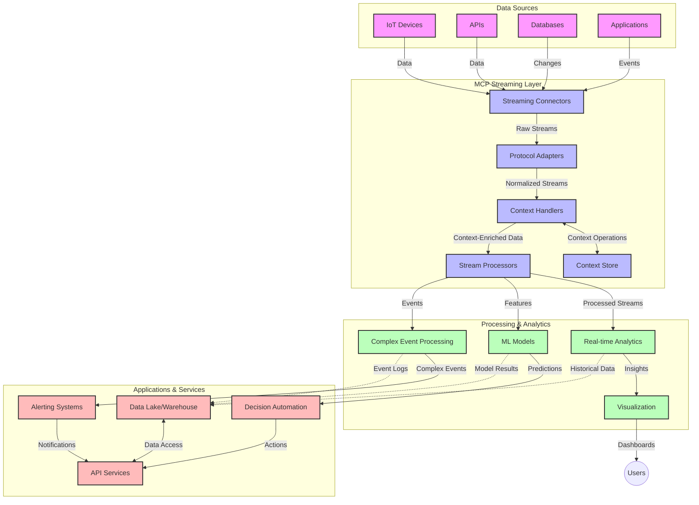

<!--
CO_OP_TRANSLATOR_METADATA:
{
  "original_hash": "195f7287638b77a549acadd96c8f981c",
  "translation_date": "2025-07-14T01:55:30+00:00",
  "source_file": "05-AdvancedTopics/mcp-realtimestreaming/README.md",
  "language_code": "my"
}
-->
# Model Context Protocol အတွက် အချိန်နှင့်တပြေးညီ ဒေတာစီးဆင်းမှု

## အနှစ်ချုပ်

ယနေ့ခေတ် ဒေတာအခြေပြု ကမ္ဘာကြီးတွင် အချိန်နှင့်တပြေးညီ ဒေတာစီးဆင်းမှုသည် အရေးကြီးဖြစ်လာပြီး၊ စီးပွားရေးလုပ်ငန်းများနှင့် အက်ပလီကေးရှင်းများသည် အချက်အလက်များကို ချက်ချင်းရရှိရန် လိုအပ်နေသည်။ Model Context Protocol (MCP) သည် အချိန်နှင့်တပြေးညီ စီးဆင်းမှုလုပ်ငန်းစဉ်များကို တိုးတက်ကောင်းမွန်စေပြီး၊ ဒေတာကို ထိရောက်စွာ ဆောင်ရွက်နိုင်စေခြင်း၊ အကြောင်းအရာဆိုင်ရာ တိကျမှုကို ထိန်းသိမ်းပေးခြင်းနှင့် စနစ်၏ စွမ်းဆောင်ရည်ကို မြှင့်တင်ပေးခြင်းတို့တွင် အရေးပါသော တိုးတက်မှုတစ်ခု ဖြစ်သည်။

ဤမော်ဂျူးတွင် MCP သည် AI မော်ဒယ်များ၊ စီးဆင်းမှု ပလက်ဖောင်းများနှင့် အက်ပလီကေးရှင်းများအကြား အကြောင်းအရာ စီမံခန့်ခွဲမှုကို စံပြအတိုင်း လုပ်ဆောင်ပေးခြင်းဖြင့် အချိန်နှင့်တပြေးညီ ဒေတာစီးဆင်းမှုကို မည်သို့ ပြောင်းလဲပေးသည်ကို ရှင်းလင်းဖော်ပြထားသည်။

## အချိန်နှင့်တပြေးညီ ဒေတာစီးဆင်းမှု အကြောင်း

အချိန်နှင့်တပြေးညီ ဒေတာစီးဆင်းမှုသည် ဒေတာကို ဆက်တိုက် ထုတ်ပေးခြင်း၊ ဆက်တိုက် လုပ်ဆောင်ခြင်းနှင့် ချက်ချင်း သုံးသပ်ခြင်းတို့ကို ခွင့်ပြုသော နည်းပညာတစ်ခုဖြစ်ပြီး၊ စနစ်များသည် အသစ်ထွက်ရှိလာသော အချက်အလက်များကို ချက်ချင်း တုံ့ပြန်နိုင်စေရန် ဖြစ်သည်။ ရိုးရာအတိုင်း အုပ်စုလိုက် လုပ်ဆောင်သည့် batch processing နှင့် မတူဘဲ၊ streaming သည် လှုပ်ရှားနေသော ဒေတာကို ဆက်တိုက် လုပ်ဆောင်ပေးပြီး နည်းနည်းနောက်ကျမှုဖြင့် အချက်အလက်များနှင့် လုပ်ဆောင်ချက်များကို ပေးပို့သည်။

### အချိန်နှင့်တပြေးညီ ဒေတာစီးဆင်းမှု၏ အဓိကအယူအဆများ

- **ဆက်တိုက် ဒေတာစီးဆင်းမှု**: ဒေတာသည် အဖြစ်အပျက်များ သို့မဟုတ် မှတ်တမ်းများ အဖြစ် ဆက်တိုက် မပြတ် စီးဆင်းနေသည်။
- **နည်းနည်းနောက်ကျမှုဖြင့် လုပ်ဆောင်ခြင်း**: ဒေတာထွက်ရှိမှုနှင့် လုပ်ဆောင်မှုအကြား အချိန်ကို အနည်းဆုံးထားရန် စနစ်များကို ဒီဇိုင်းဆွဲထားသည်။
- **တိုးချဲ့နိုင်မှု**: စီးဆင်းမှု ဖွဲ့စည်းမှုများသည် ဒေတာအရေအတွက်နှင့် အရှိန်အဟုန် မတူညီမှုကို ကိုင်တွယ်နိုင်ရမည်။
- **အမှားခံနိုင်မှု**: ဒေတာစီးဆင်းမှု မပြတ်တောက်ရန် အမှားများကို ခံနိုင်ရည်ရှိရမည်။
- **အခြေအနေထိန်းသိမ်းမှု**: အဖြစ်အပျက်များအတွင်း အကြောင်းအရာကို ထိန်းသိမ်းထားခြင်းသည် အဓိပ္ပါယ်ရှိသော သုံးသပ်မှုအတွက် အရေးကြီးသည်။

### Model Context Protocol နှင့် အချိန်နှင့်တပြေးညီ စီးဆင်းမှု

Model Context Protocol (MCP) သည် အချိန်နှင့်တပြေးညီ စီးဆင်းမှု ပတ်ဝန်းကျင်များတွင် အရေးကြီးသော စိန်ခေါ်မှုများကို ဖြေရှင်းပေးသည်-

1. **အကြောင်းအရာ ဆက်လက်မှု**: MCP သည် ဖြန့်ဝေထားသော စီးဆင်းမှု အစိတ်အပိုင်းများအတွင်း အကြောင်းအရာကို မည်သို့ ထိန်းသိမ်းရမည်ကို စံပြထားပြီး၊ AI မော်ဒယ်များနှင့် လုပ်ဆောင်မှု နုတ်များသည် သက်ဆိုင်ရာ အတိတ်နှင့် ပတ်ဝန်းကျင်ဆိုင်ရာ အကြောင်းအရာများကို ရရှိနိုင်စေသည်။

2. **ထိရောက်သော အခြေအနေ စီမံခန့်ခွဲမှု**: MCP သည် အကြောင်းအရာ ပို့ဆောင်မှုအတွက် ဖွဲ့စည်းထားသော မက်ခရနစ်များကို ပေးပြီး၊ စီးဆင်းမှု လမ်းကြောင်းများတွင် အခြေအနေ စီမံခန့်ခွဲမှု၏ အလေးချိန်ကို လျော့ချပေးသည်။

3. **အပြန်အလှန် လုပ်ဆောင်နိုင်မှု**: MCP သည် မတူညီသော စီးဆင်းမှု နည်းပညာများနှင့် AI မော်ဒယ်များအကြား အကြောင်းအရာ မျှဝေမှုအတွက် ပုံမှန်ဘာသာစကားတစ်ခု ဖန်တီးပေးကာ ပိုမိုလွယ်ကူပြီး တိုးချဲ့နိုင်သော ဖွဲ့စည်းမှုများကို ခွင့်ပြုသည်။

4. **စီးဆင်းမှုအတွက် အကြောင်းအရာ အထူးပြုခြင်း**: MCP ကို အကောင်အထည်ဖော်ရာတွင် အချိန်နှင့်တပြေးညီ ဆုံးဖြတ်ချက်များအတွက် အရေးကြီးဆုံး အကြောင်းအရာ အစိတ်အပိုင်းများကို ဦးစားပေးနိုင်ပြီး၊ စွမ်းဆောင်ရည်နှင့် တိကျမှုကို တိုးတက်စေသည်။

5. **သင့်လျော်စွာ လုပ်ဆောင်မှု**: MCP မှတဆင့် အကြောင်းအရာ စီမံခန့်ခွဲမှုကို မှန်ကန်စွာ ပြုလုပ်ခြင်းဖြင့်၊ စီးဆင်းမှု စနစ်များသည် ဒေတာအခြေအနေများနှင့် ပုံစံများ ပြောင်းလဲမှုအပေါ် အလိုအလျောက် လုပ်ဆောင်မှုကို ချိန်ညှိနိုင်သည်။

IoT စင်ဆာကွန်ယက်များမှ စ၍ ဘဏ္ဍာရေး ကုန်သွယ်မှု ပလက်ဖောင်းများအထိ၊ MCP နှင့် စီးဆင်းမှု နည်းပညာများ ပေါင်းစပ်ခြင်းဖြင့် ပိုမိုတိုးတက်သော၊ အကြောင်းအရာကို သိရှိနားလည်သော လုပ်ဆောင်မှုများကို အချိန်နှင့်တပြေးညီ ပြုလုပ်နိုင်သည်။

## သင်ယူရမည့် ရည်မှန်းချက်များ

ဤသင်ခန်းစာအပြီးတွင် သင်သည် -

- အချိန်နှင့်တပြေးညီ ဒေတာစီးဆင်းမှု၏ အခြေခံအယူအဆများနှင့် စိန်ခေါ်မှုများကို နားလည်နိုင်မည်
- Model Context Protocol (MCP) သည် အချိန်နှင့်တပြေးညီ ဒေတာစီးဆင်းမှုကို မည်သို့ တိုးတက်ကောင်းမွန်စေသည်ကို ရှင်းပြနိုင်မည်
- Kafka နှင့် Pulsar ကဲ့သို့ လူကြိုက်များသော ဖရိမ်ဝတ်များကို အသုံးပြု၍ MCP အခြေခံ စီးဆင်းမှု ဖြေရှင်းချက်များကို အကောင်အထည်ဖော်နိုင်မည်
- MCP ဖြင့် အမှားခံနိုင်သော၊ မြင့်မားသော စွမ်းဆောင်ရည်ရှိသော စီးဆင်းမှု ဖွဲ့စည်းမှုများကို ဒီဇိုင်းဆွဲ၍ တပ်ဆင်နိုင်မည်
- MCP အယူအဆများကို IoT၊ ဘဏ္ဍာရေး ကုန်သွယ်မှုနှင့် AI အခြေပြု သုံးသပ်ချက်များတွင် အသုံးချနိုင်မည်
- MCP အခြေပြု စီးဆင်းမှု နည်းပညာများ၏ နောက်လာမည့် လမ်းကြောင်းများနှင့် တီထွင်ဆန်းသစ်မှုများကို သုံးသပ်နိုင်မည်

### အဓိပ္ပါယ်နှင့် အရေးပါမှု

အချိန်နှင့်တပြေးညီ ဒေတာစီးဆင်းမှုသည် နည်းနည်းနောက်ကျမှုဖြင့် ဒေတာကို ဆက်တိုက် ထုတ်ပေးခြင်း၊ လုပ်ဆောင်ခြင်းနှင့် ပေးပို့ခြင်းတို့ဖြစ်သည်။ batch processing ကဲ့သို့ ဒေတာကို အုပ်စုလိုက် စုဆောင်းပြီး လုပ်ဆောင်ခြင်းမဟုတ်ဘဲ၊ streaming သည် ဒေတာရောက်ရှိသည့်အတိုင်း တိုးတက်စွာ လုပ်ဆောင်ပေးကာ ချက်ချင်း သုံးသပ်ချက်များနှင့် လုပ်ဆောင်ချက်များကို ချက်ချင်း ပေးနိုင်သည်။

အချိန်နှင့်တပြေးညီ ဒေတာစီးဆင်းမှု၏ အဓိက လက္ခဏာများမှာ -

- **နည်းနည်းနောက်ကျမှု**: ဒေတာကို မီလီစက္ကန့်မှ စက္ကန့်အတွင်း လုပ်ဆောင်ခြင်းနှင့် သုံးသပ်ခြင်း
- **ဆက်တိုက်စီးဆင်းမှု**: မတားမနား ဒေတာစီးဆင်းမှု များ
- **ချက်ချင်း လုပ်ဆောင်မှု**: ဒေတာရောက်ရှိသည့်အတိုင်း သုံးသပ်ခြင်း
- **အဖြစ်အပျက် အခြေပြု ဖွဲ့စည်းမှု**: ဖြစ်ပွားသည့် အဖြစ်အပျက်များအပေါ် တုံ့ပြန်ခြင်း

### ရိုးရာ ဒေတာစီးဆင်းမှု၏ စိန်ခေါ်မှုများ

ရိုးရာ ဒေတာစီးဆင်းမှု နည်းလမ်းများတွင် အောက်ပါ ကန့်သတ်ချက်များ ရှိသည်-

1. **အကြောင်းအရာ ပျောက်ဆုံးခြင်း**: ဖြန့်ဝေထားသော စနစ်များအတွင်း အကြောင်းအရာ ထိန်းသိမ်းရန် အခက်အခဲ
2. **တိုးချဲ့နိုင်မှု ပြဿနာများ**: အမြင့်မားသော ဒေတာအရေအတွက်နှင့် အရှိန်အဟုန်ကို ကိုင်တွယ်ရာတွင် စိန်ခေါ်မှုများ
3. **ပေါင်းစည်းမှု ရှုပ်ထွေးမှု**: မတူညီသော စနစ်များအကြား အပြန်အလှန် လုပ်ဆောင်နိုင်မှု ပြဿနာများ
4. **နောက်ကျမှု စီမံခန့်ခွဲမှု**: ထွက်ရှိမှုနှင့် လုပ်ဆောင်ချိန်ကို ညှိနှိုင်းရခြင်း
5. **ဒေတာ တိကျမှု**: စီးဆင်းမှုတစ်လျှောက် ဒေတာမှန်ကန်မှုနှင့် ပြည့်စုံမှုကို သေချာစေရန်

## Model Context Protocol (MCP) ကို နားလည်ခြင်း

### MCP ဆိုတာဘာလဲ?

Model Context Protocol (MCP) သည် AI မော်ဒယ်များနှင့် အက်ပလီကေးရှင်းများအကြား ထိရောက်စွာ ဆက်သွယ်ဆောင်ရွက်နိုင်ရန် စံပြ ဆက်သွယ်ရေး ပရိုတိုကောလ်တစ်ခုဖြစ်သည်။ အချိန်နှင့်တပြေးညီ ဒေတာစီးဆင်းမှုအတွက် MCP သည် -

- ဒေတာ လမ်းကြောင်းတစ်လျှောက် အကြောင်းအရာကို ထိန်းသိမ်းခြင်း
- ဒေတာလဲလှယ်မှု ပုံစံများကို စံပြထားခြင်း
- ကြီးမားသော ဒေတာများ ပို့ဆောင်မှုကို တိုးတက်ကောင်းမွန်စေရန်
- မော်ဒယ်မှ မော်ဒယ်သို့၊ မော်ဒယ်မှ အက်ပလီကေးရှင်းသို့ ဆက်သွယ်မှု တိုးတက်စေရန်

အတွက် ဖွဲ့စည်းထားသည်။

### အဓိက အစိတ်အပိုင်းများနှင့် ဖွဲ့စည်းပုံ

အချိန်နှင့်တပြေးညီ စီးဆင်းမှုအတွက် MCP ဖွဲ့စည်းပုံတွင် အဓိက အစိတ်အပိုင်းများမှာ -

1. **Context Handlers**: စီးဆင်းမှု လမ်းကြောင်းတစ်လျှောက် အကြောင်းအရာကို စီမံထိန်းသိမ်းခြင်း
2. **Stream Processors**: အကြောင်းအရာ သိရှိပြီး ဒေတာစီးဆင်းမှုများကို လုပ်ဆောင်ခြင်း
3. **Protocol Adapters**: မတူညီသော စီးဆင်းမှု ပရိုတိုကောလ်များအကြား အကြောင်းအရာ ထိန်းသိမ်းပြီး ပြောင်းလဲပေးခြင်း
4. **Context Store**: အကြောင်းအရာကို ထိရောက်စွာ သိမ်းဆည်းပြီး ပြန်လည် ရယူခြင်း
5. **Streaming Connectors**: Kafka, Pulsar, Kinesis စသည့် စီးဆင်းမှု ပလက်ဖောင်းများနှင့် ချိတ်ဆက်ခြင်း

### MCP သည် အချိန်နှင့်တပြေးညီ ဒေတာကို မည်သို့ တိုးတက်ကောင်းမွန်စေသနည်း

MCP သည် ရိုးရာ စီးဆင်းမှု စိန်ခေါ်မှုများကို အောက်ပါအတိုင်း ဖြေရှင်းပေးသည်-

- **အကြောင်းအရာ တိကျမှု**: ဒေတာအချက်အလက်များအကြား ဆက်စပ်မှုကို လမ်းကြောင်းတစ်လျှောက် ထိန်းသိမ်းခြင်း
- **ပို့ဆောင်မှု တိုးတက်မှု**: အကြောင်းအရာ စီမံခန့်ခွဲမှုဖြင့် ဒေတာလဲလှယ်မှုတွင် ထပ်တလဲလဲမှု လျော့နည်းစေခြင်း
- **စံပြ အင်တာဖေ့စ်များ**: စီးဆင်းမှု အစိတ်အပိုင်းများအတွက် တူညီသော API များ ပေးခြင်း
- **နောက်ကျမှု လျော့နည်းစေခြင်း**: ထိရောက်သော အကြောင်းအရာ စီမံခန့်ခွဲမှုဖြင့် လုပ်ဆောင်မှု အလေးချိန် လျော့နည်းစေခြင်း
- **တိုးချဲ့နိုင်မှု မြှင့်တင်ခြင်း**: အကြောင်းအရာ ထိန်းသိမ်းမှုကို ထိန်းသိမ်းထားပြီး အလျားလိုက် တိုးချဲ့နိုင်မှုကို ထောက်ပံ့ခြင်း

## ပေါင်းစည်းခြင်းနှင့် အကောင်အထည်ဖော်ခြင်း

အချိန်နှင့်တပြေးညီ ဒေတာစီးဆင်းမှု စနစ်များသည် စွမ်းဆောင်ရည်နှင့် အကြောင်းအရာ တိကျမှုကို ထိန်းသိမ်းရန် အဆောက်အအုံ ဒီဇိုင်းနှင့် အကောင်အထည်ဖော်မှုကို ဂရုစိုက်ရမည်။ Model Context Protocol သည် AI မော်ဒယ်များနှင့် စီးဆင်းမှု နည်းပညာများ ပေါင်းစည်းရာတွင် စံပြနည်းလမ်းတစ်ခုဖြစ်ပြီး၊ ပိုမိုတိုးတက်သော၊ အကြောင်းအရာ သိရှိနားလည်သော လုပ်ဆောင်မှု လမ်းကြောင်းများ ဖန်တီးနိုင်စေသည်။

### MCP ပေါင်းစည်းမှု အကြောင်းအရာ

အချိန်နှင့်တပြေးညီ စီးဆင်းမှု ပတ်ဝန်းကျင်များတွင် MCP ကို အကောင်အထည်ဖော်ရာတွင် အောက်ပါအချက်များကို စဉ်းစားရမည်-

1. **အကြောင်းအရာ စီးဆင်းမှု စာရင်းသွင်းခြင်းနှင့် ပို့ဆောင်မှု**: MCP သည် စီးဆင်းမှု ဒေတာပက်ကက်များအတွင်း အကြောင်းအရာကို ထိရောက်စွာ ကုဒ်ပြုလုပ်ပေးကာ အရေးကြီးသော အကြောင်းအရာများကို လမ်းကြောင်းတစ်လျှောက် လိုက်ပါပေးသည်။ ၎င်းတွင် စီးဆင်းမှု ပို့ဆောင်မှုအတွက် အထူးပြု စာရင်းသွင်းပုံစံများ ပါဝင်သည်။

2. **အခြေအနေထိန်းသိမ်းသော စီးဆင်းမှု လုပ်ဆောင်မှု**: MCP သည် လုပ်ဆောင်မှု နုတ်များအကြား အကြောင်းအရာ ကို တူညီစွာ ကိုင်တွယ်ထားနိုင်ရန် အခြေအနေထိန်းသိမ်းမှုကို ပိုမိုတိုးတက်စေသည်။ ၎င်းသည် ဖြန့်ဝေထားသော စီးဆင်းမှု ဖွဲ့စည်းမှုများတွင် အထူးအသုံးဝင်သည်။

3. **ဖြစ်ရပ်အချိန် နှင့် လုပ်ဆောင်ချိန် ခွဲခြားမှု**: MCP ကို အကောင်အထည်ဖော်ရာတွင် ဖြစ်ရပ်များ ဖြစ်ပွားချိန်နှင့် လုပ်ဆောင်ချိန်ကို ခွဲခြားနိုင်ရန် စိန်ခေါ်မှုကို ဖြေရှင်းရမည်။ ပရိုတိုကောလ်သည် ဖြစ်ရ

**အကြောင်းကြားချက်**  
ဤစာတမ်းကို AI ဘာသာပြန်ဝန်ဆောင်မှု [Co-op Translator](https://github.com/Azure/co-op-translator) ဖြင့် ဘာသာပြန်ထားပါသည်။ ကျွန်ုပ်တို့သည် တိကျမှန်ကန်မှုအတွက် ကြိုးစားသော်လည်း အလိုအလျောက် ဘာသာပြန်ခြင်းတွင် အမှားများ သို့မဟုတ် မှားယွင်းချက်များ ပါဝင်နိုင်ကြောင်း သတိပြုပါရန် မေတ္တာရပ်ခံအပ်ပါသည်။ မူရင်းစာတမ်းကို မိမိဘာသာစကားဖြင့်သာ တရားဝင်အချက်အလက်အဖြစ် ယူဆသင့်ပါသည်။ အရေးကြီးသော အချက်အလက်များအတွက် လူ့ပညာရှင်များ၏ ပရော်ဖက်ရှင်နယ် ဘာသာပြန်ခြင်းကို အကြံပြုပါသည်။ ဤဘာသာပြန်ချက်ကို အသုံးပြုရာမှ ဖြစ်ပေါ်လာနိုင်သည့် နားလည်မှုမှားယွင်းမှုများအတွက် ကျွန်ုပ်တို့သည် တာဝန်မခံပါ။