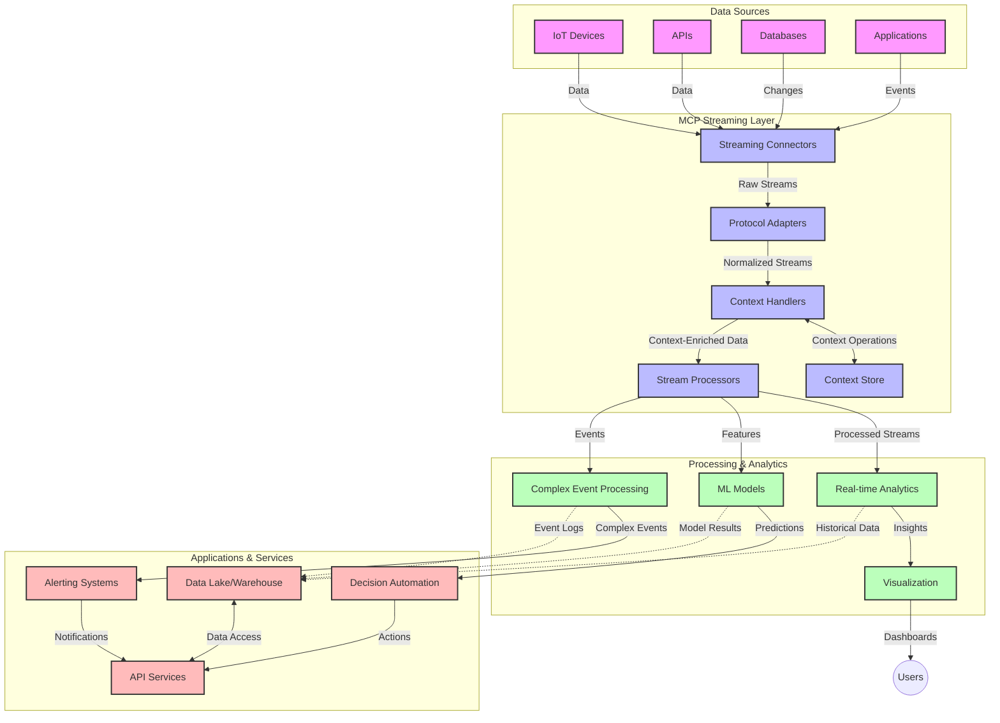

<!--
CO_OP_TRANSLATOR_METADATA:
{
  "original_hash": "195f7287638b77a549acadd96c8f981c",
  "translation_date": "2025-06-17T16:57:24+00:00",
  "source_file": "05-AdvancedTopics/mcp-realtimestreaming/README.md",
  "language_code": "my"
}
-->
# Model Context Protocol အတွက် အချိန်နှင့်တပြေးညီ ဒေတာစီးဆင်းမှု

## အနှစ်ချုပ်

ယနေ့ခေတ် ဒေတာအခြေပြု ကမ္ဘာကြီးတွင် အချိန်နှင့်တပြေးညီ ဒေတာစီးဆင်းမှုသည် လိုအပ်不可欠ဖြစ်လာပြီး၊ စီးပွားရေးလုပ်ငန်းများနှင့် အက်ပ်လီကေးရှင်းများသည် ချက်ချင်းဆုံးဖြတ်ချက်များ ချမှတ်နိုင်ရန် အချက်အလက်များကို တိုက်ရိုက်ရယူရန် လိုအပ်ပါသည်။ Model Context Protocol (MCP) သည် အချိန်နှင့်တပြေးညီ ဒေတာစီးဆင်းမှု လုပ်ငန်းစဉ်များကို ထိရောက်စွာတိုးတက်စေရန်၊ ဒေတာကို အကောင်းဆုံး ခွဲခြမ်းစိတ်ဖြာနိုင်ရေး၊ စနစ်၏ ပတ်ဝန်းကျင်ဆိုင်ရာ အချက်အလက်များ ထိန်းသိမ်းထားနိုင်ရေးနှင့် စနစ်၏ စွမ်းဆောင်ရည် မြှင့်တင်နိုင်ရေးတို့တွင် တိုးတက်မှု အရေးကြီးစွာ ဖြစ်စေသည်။

ဤမော်ဂျူးလ်တွင် MCP သည် AI မော်ဒယ်များ၊ စီးဆင်းမှု ပလက်ဖောင်းများနှင့် အက်ပ်လီကေးရှင်းများအကြား ပတ်ဝန်းကျင်ကို စံပြစနစ်ဖြင့် စီမံခန့်ခွဲပေးခြင်းအားဖြင့် အချိန်နှင့်တပြေးညီ ဒေတာစီးဆင်းမှုကို ဘယ်လိုပြောင်းလဲတိုးတက်စေသည်ကို ရှင်းလင်းဖော်ပြပါမည်။

## အချိန်နှင့်တပြေးညီ ဒေတာစီးဆင်းမှု အကြောင်းအရာ

အချိန်နှင့်တပြေးညီ ဒေတာစီးဆင်းမှု ဆိုသည်မှာ ဒေတာများကို ထုတ်လုပ်လိုက်သည့်အချိန်မှ စပြီး ဆက်တိုက်ပြုလုပ်ခြင်း၊ ခွဲခြမ်းစိတ်ဖြာခြင်းနှင့် သုံးသပ်ခြင်းတို့ကို ချက်ချင်းပြုလုပ်နိုင်စေရန် နည်းပညာဆိုင်ရာ စနစ်တစ်ခုဖြစ်သည်။ ရိုးရာ အစုလိုက်အပြုံလိုက် လုပ်ငန်းစဉ်များကဲ့သို့ ဒေတာများကို တည်ငြိမ်သော ဒေတာစုစည်းများအဖြစ် ဆောင်ရွက်ခြင်းမဟုတ်ဘဲ၊ စီးဆင်းနေသော ဒေတာများကို တိုက်ရိုက် ခွဲခြမ်းစစ်ဆေးခြင်းဖြင့် အနည်းဆုံး နောက်ကျမှုဖြင့် အချက်အလက်များနှင့် လုပ်ဆောင်ချက်များ ရရှိစေသည်။

### အချိန်နှင့်တပြေးညီ ဒေတာစီးဆင်းမှု၏ အဓိကအယူအဆများ

- **ဆက်တိုက် ဒေတာစီးဆင်းမှု**: ဒေတာများကို မပြတ်မပျက် ဖြစ်နေသော အဖြစ်အပျက်များ သို့မဟုတ် မှတ်တမ်းများအဖြစ် ဆက်တိုက်ခွဲခြမ်းစိတ်ဖြာသည်။
- **နောက်ကျမှုနည်းသော ခွဲခြမ်းမှု**: ဒေတာထုတ်လုပ်မှုနှင့် ခွဲခြမ်းမှုအကြား အချိန်ကို အနည်းဆုံးထားရန် စနစ်များကို ဖန်တီးထားသည်။
- **တိုးချဲ့နိုင်မှု**: ဒေတာအရေအတွက်နှင့် အရှိန်အဟုန် မတူညီမှုကို ကိုင်တွယ်နိုင်ရန် စီးဆင်းမှု အဆောက်အအုံများသည် တိုးချဲ့နိုင်ရမည်။
- **အမှားခံနိုင်မှု**: ဒေတာစီးဆင်းမှု မတားဆီးပဲ ဆက်လက်ဆောင်ရွက်နိုင်ရန် အမှားများကိုခံနိုင်ရည်ရှိရမည်။
- **အခြေအနေ ထိန်းသိမ်းမှု**: အဖြစ်အပျက်များအကြား ပတ်ဝန်းကျင်ဆိုင်ရာ အချက်အလက်များ ထိန်းသိမ်းထားခြင်းသည် အရေးကြီးသည်။

### Model Context Protocol နှင့် အချိန်နှင့်တပြေးညီ စီးဆင်းမှု

Model Context Protocol (MCP) သည် အချိန်နှင့်တပြေးညီ စီးဆင်းမှု ပတ်ဝန်းကျင်များတွင် ကြုံတွေ့ရသော အရေးကြီးသော စိန်ခေါ်မှုများကို ဖြေရှင်းပေးသည်။

1. **ပတ်ဝန်းကျင် ဆက်လက်ထိန်းသိမ်းမှု**: MCP သည် ဖက်စပ်ထားသော စီးဆင်းမှု အစိတ်အပိုင်းများအကြား ပတ်ဝန်းကျင်ကို စံပြစနစ်ဖြင့် ထိန်းသိမ်းပေးကာ AI မော်ဒယ်များနှင့် ခွဲခြမ်းစစ်ဆေးမှု အစိတ်အပိုင်းများသည် သက်ဆိုင်ရာ သမိုင်းအချက်အလက်နှင့် ပတ်ဝန်းကျင်ဆိုင်ရာ အချက်အလက်များကို ရရှိနိုင်စေသည်။

2. **ထိရောက်သော အခြေအနေ စီမံခန့်ခွဲမှု**: MCP သည် ပတ်ဝန်းကျင် ပို့ဆောင်မှုအတွက် ဖွဲ့စည်းထားသော မက်ကန်နစ်များဖြင့် စီးဆင်းမှု လမ်းကြောင်းများတွင် အခြေအနေ စီမံခန့်ခွဲမှု၏ အလေးအနက်ကို လျော့နည်းစေသည်။

3. **အပြန်အလှန်သုံးနိုင်မှု**: MCP သည် မတူကွဲပြားသော စီးဆင်းမှုနည်းပညာများနှင့် AI မော်ဒယ်များအကြား ပတ်ဝန်းကျင် မျှဝေရေးအတွက် ပေါင်းစည်းနိုင်သော ဘာသာစကား တစ်ခု ဖန်တီးပေးကာ ပိုမိုတိုးတက်သော စနစ်များ ဖန်တီးနိုင်စေသည်။

4. **စီးဆင်းမှုအတွက် အဆင်ပြေသော ပတ်ဝန်းကျင်**: MCP ကို အသုံးပြု၍ အချိန်နှင့်တပြေးညီ ဆုံးဖြတ်ချက်များအတွက် အရေးကြီးဆုံး ပတ်ဝန်းကျင် အချက်များကို ဦးစားပေး ဆောင်ရွက်နိုင်ပြီး စွမ်းဆောင်ရည်နှင့် တိကျမှု နှစ်မျိုးလုံးအတွက် အထူးပြုနိုင်သည်။

5. **အခြေအနေ ပြောင်းလဲမှုအလိုက် ချိန်ညှိမှု**: MCP မှတဆင့် ပတ်ဝန်းကျင် စီမံခန့်ခွဲမှုများ ပြုလုပ်ခြင်းဖြင့် စီးဆင်းမှုစနစ်များသည် ဒေတာတွင် ဖြစ်ပေါ်နေသော အခြေအနေများနှင့် နမူနာများအရ လိုက်လျောညီထွေ ချိန်ညှိနိုင်သည်။

IoT စင်ဆာကွန်ယက်များမှ စ၍ ဘဏ္ဍာရေး ကုန်သွယ်မှု ပလက်ဖောင်းများအထိ၊ MCP နှင့် စီးဆင်းမှုနည်းပညာများ ပေါင်းစပ်အသုံးပြုခြင်းသည် ပိုမိုမေတ္တာရပ်ခံနိုင်သော၊ ပတ်ဝန်းကျင်ကို သိရှိနားလည်ပြီး အချိန်နှင့်တပြေးညီ အခြေအနေရှုပ်ထွေးသော ပြောင်းလဲမှုများကို သင့်တော်စွာ တုံ့ပြန်နိုင်သော ခွဲခြမ်းစစ်ဆေးမှုများ ဖန်တီးပေးသည်။

## သင်ယူရမည့် ရည်မှန်းချက်များ

ဤသင်ခန်းစာအဆုံးသတ်သည်အထိ၊ သင်သည် -

- အချိန်နှင့်တပြေးညီ ဒေတာစီးဆင်းမှု၏ အခြေခံသဘောတရားများနှင့် စိန်ခေါ်မှုများကို နားလည်နိုင်မည်
- Model Context Protocol (MCP) သည် အချိန်နှင့်တပြေးညီ ဒေတာစီးဆင်းမှုကို ဘယ်လိုတိုးတက်စေသည်ကို ရှင်းပြနိုင်မည်
- Kafka နှင့် Pulsar ကဲ့သို့ လူကြိုက်များသော ဖရိမ်ဝတ်များကို အသုံးပြု၍ MCP အခြေပြု စီးဆင်းမှု ဖြေရှင်းချက်များကို တည်ဆောက်နိုင်မည်
- MCP ဖြင့် အမှားခံနိုင်ပြီး၊ မြင့်မားသော စွမ်းဆောင်ရည်ရှိသော စီးဆင်းမှု အဆောက်အအုံများကို ဒီဇိုင်းဆွဲ ထားရှိနိုင်မည်
- MCP သဘောတရားများကို IoT၊ ဘဏ္ဍာရေး ကုန်သွယ်မှုနှင့် AI အခြေပြု ခွဲခြမ်းစစ်ဆေးမှု အတွက် လျှောက်ထားနိုင်မည်
- MCP အခြေပြု စီးဆင်းမှုနည်းပညာများ၏ နောက်ဆုံးရ တိုးတက်မှုများနှင့် အနာဂတ် ဖန်တီးမှုများကို သုံးသပ်နိုင်မည်

### အဓိပ္ပါယ်နှင့် အရေးပါမှု

အချိန်နှင့်တပြေးညီ ဒေတာစီးဆင်းမှုသည် ဒေတာများကို ဆက်တိုက်ထုတ်လုပ်၊ ခွဲခြမ်းစစ်ဆေးပြီး နောက်ကျမှုနည်းစွာ ဖြန့်ဝေသည့် နည်းပညာဖြစ်သည်။ အစုလိုက်အပြုံလိုက် လုပ်ငန်းစဉ်များတွင် ဒေတာများကို စုဆောင်းပြီး ဆောင်ရွက်သည့် အစား၊ စီးဆင်းလာသော ဒေတာများကို တစိတ်တပိုင်းဖြင့် ခွဲခြမ်းစစ်ဆေးခြင်းဖြင့် ချက်ချင်း အမြင်များနှင့် လုပ်ဆောင်ချက်များ ရရှိစေသည်။

အချိန်နှင့်တပြေးညီ ဒေတာစီးဆင်းမှု၏ အဓိက လက္ခဏာများမှာ -

- **နောက်ကျမှုနည်းခြင်း**: ဒေတာကို မီလီစက္ကန့်မှ စက္ကန့်အတွင်း အချိန်နည်းနည်းဖြင့် ခွဲခြမ်းစစ်ဆေးခြင်း
- **ဆက်တိုက်စီးဆင်းမှု**: မတားဆီးပဲ တစ်နေရာကနေ တစ်နေရာသို့ ဆက်လက်လှိုင်းစီးနေသော ဒေတာများ
- **ချက်ချင်းခွဲခြမ်းစစ်ဆေးမှု**: ဒေတာရောက်လာသည်နှင့်တပြေးညီ ခွဲခြမ်းစစ်ဆေးခြင်း
- **ဖြစ်ရပ်အခြေပြု အဆောက်အအုံ**: ဖြစ်ရပ်များ ဖြစ်ပေါ်သည်နှင့်တပြေးညီ တုံ့ပြန်ခြင်း

### ရိုးရာ ဒေတာစီးဆင်းမှုတွင် ကြုံတွေ့ရသော စိန်ခေါ်မှုများ

ရိုးရာ ဒေတာစီးဆင်းမှုနည်းလမ်းများတွင် အောက်ပါကဲ့သို့ အခက်အခဲများရှိသည် -

1. **ပတ်ဝန်းကျင် ပျောက်ဆုံးမှု**: ဖက်စပ်ထားသော စနစ်များအကြား ပတ်ဝန်းကျင် ထိန်းသိမ်းရန် အခက်အခဲ
2. **တိုးချဲ့နိုင်မှု ပြဿနာများ**: ဒေတာအရေအတွက်များနှင့် အရှိန်အဟုန်မြင့်မားမှုများကို ကိုင်တွယ်ရာတွင် အခက်အခဲ
3. **ပေါင်းစည်းမှု ရှုပ်ထွေးမှု**: မတူညီသော စနစ်များအကြား အပြန်အလှန်သုံးနိုင်မှု ပြဿနာများ
4. **နောက်ကျမှု စီမံခန့်ခွဲမှု**: ထုတ်လုပ်မှုနှုန်းနှင့် ခွဲခြမ်းမှု အချိန်ကို ညီမျှစေရန် ကြိုးပမ်းမှု
5. **ဒေတာတိကျမှု**: စီးဆင်းမှုတစ်လျှောက် ဒေတာတိကျမှုနှင့် ပြည့်စုံမှုကို သေချာစေရန်

## Model Context Protocol (MCP) ကို နားလည်ခြင်း

### MCP ဆိုတာဘာလဲ?

Model Context Protocol (MCP) သည် AI မော်ဒယ်များနှင့် အက်ပ်လီကေးရှင်းများအကြား ထိရောက်စွာ ဆက်သွယ်ဆောင်ရွက်နိုင်ရန် စံပြဆက်သွယ်ရေး ပရိုတိုကောလ်တစ်ခုဖြစ်သည်။ အချိန်နှင့်တပြေးညီ ဒေတာစီးဆင်းမှုတွင် MCP သည် -

- ဒေတာလမ်းကြောင်းတစ်လျှောက် ပတ်ဝန်းကျင်ကို ထိန်းသိမ်းခြင်း
- ဒေတာလဲလှယ်မှု ပုံစံများကို စံပြစနစ်ဖြင့် ဖော်ပြခြင်း
- ကြီးမားသော ဒေတာစုစည်းမှု ပို့ဆောင်မှုကို အကောင်းဆုံး ပြုလုပ်ခြင်း
- မော်ဒယ်မှ မော်ဒယ်သို့၊ မော်ဒယ်မှ အက်ပ်လီကေးရှင်းသို့ ဆက်သွယ်မှုကို တိုးတက်စေခြင်း

### အဓိက အစိတ်အပိုင်းများနှင့် စက်ဆောက်ပုံ

အချိန်နှင့်တပြေးညီ စီးဆင်းမှုအတွက် MCP စက်ဆောက်ပုံတွင် အဓိက အစိတ်အပိုင်းများမှာ -

1. **Context Handlers**: စီးဆင်းမှု လမ်းကြောင်းတစ်လျှောက် ပတ်ဝန်းကျင်ဆိုင်ရာ အချက်အလက်များကို စီမံထိန်းသိမ်းခြင်း
2. **Stream Processors**: ပတ်ဝန်းကျင်ကို သိရှိပြီး ခွဲခြမ်းစစ်ဆေးမှု ပြုလုပ်ခြင်း
3. **Protocol Adapters**: မတူညီသော စီးဆင်းမှု ပရိုတိုကောလ်များကို ပတ်ဝန်းကျင် ထိန်းသိမ်းကာ ပြောင်းလဲပေးခြင်း
4. **Context Store**: ပတ်ဝန်းကျင်ဆိုင်ရာ အချက်အလက်များကို ထိရောက်စွာ သိမ်းဆည်း ရယူခြင်း
5. **Streaming Connectors**: Kafka, Pulsar, Kinesis စသည်တို့ကဲ့သို့ စီးဆင်းမှု ပလက်ဖောင်းများနှင့် ချိတ်ဆက်ပေးခြင်း

### MCP သည် အချိန်နှင့်တပြေးညီ ဒေတာ ကိုင်တွယ်မှုကို ဘယ်လိုတိုးတက်စေသနည်း

MCP သည် ရိုးရာ စီးဆင်းမှု စိန်ခေါ်မှုများကို အောက်ပါအတိုင်း ဖြေရှင်းပေးသည် -

- **ပတ်ဝန်းကျင် တိကျမှု**: ဒေတာ အချက်အလက်များအကြား ဆက်စပ်မှုကို လမ်းကြောင်းတစ်လျှောက် ထိန်းသိမ်းခြင်း
- **အကောင်းဆုံး ပို့ဆောင်မှု**: ပတ်ဝန်းကျင် စီမံခန့်ခွဲမှုဖြင့် ဒေတာလဲလှယ်မှုတွင် မလိုအပ်သော ထပ်တိုးမှုများ လျော့နည်းစေခြင်း
- **စံပြ အင်တာဖေ့စ်များ**: စီးဆင်းမှု အစိတ်အပိုင်းများအတွက် တိကျတည်ငြိမ်သော API များ ပေးခြင်း
- **နောက်ကျမှု လျော့နည်းစေခြင်း**: ပတ်ဝန်းကျင် ထိန်းသိမ်းမှုကို ထိရောက်စွာ ဆောင်ရွက်ခြင်းဖြင့် ခွဲခြမ်းမှု လုပ်ငန်းစဉ်အလေးအနက် လျော့နည်းစေခြင်း
- **တိုးချဲ့နိုင်မှု မြှင့်တင်ခြင်း**: ပတ်ဝန်းကျင်ကို ထိန်းသိမ်းထားပြီး အလျားလိုက် တိုးချဲ့နိုင်မှုကို ပံ့ပိုးပေးခြင်း

## ပေါင်းစည်းခြင်းနှင့် အကောင်အထည်ဖော်ခြင်း

အချိန်နှင့်တပြေးညီ ဒေတာစီးဆင်းမှု စနစ်များသည် စွမ်းဆောင်ရည်နှင့် ပတ်ဝန်းကျင် တိကျမှုတို့ကို ထိန်းသိမ်းထားနိုင်ရန် စက်ဆောက်ပုံကို သေချာစွာ ဒီဇိုင်းဆွဲပြီး အကောင်အထည်ဖော်ရမည်။ Model Context Protocol သည် AI မော်ဒယ်များနှင့် စီးဆင်းမှုနည်းပညာများကို ပေါင်းစည်းရန် စံပြနည်းလမ်းတစ်ခုဖြစ်ကာ ပိုမိုတိုးတက်သော၊ ပတ်ဝန်းကျင်ကို သိရှိနားလည်ပြီး ခွဲခြမ်းစစ်ဆေးမှု လမ်းကြောင်းများ ဖန်တီးပေးသည်။

### MCP ပေါင်းစည်းမှု အနှစ်ချုပ်

MCP ကို အချိန်နှင့်တပြေးညီ စီးဆင်းမှု ပတ်ဝန်းကျင်တွင် ထည့်သွင်းအသုံးပြုရာတွင် အောက်ပါအချက်များကို စဉ်းစားရမည် -

1. **ပတ်ဝန်းကျင် စီးဆင်းမှု သတ်မှတ်ခြင်းနှင့် ပို့ဆောင်မှု**: MCP သည် စီးဆင်းမှု ဒေတာ ပက်ကတ်များတွင် ပတ်ဝန်းကျင်ဆိုင်ရာ အချက်အလက်များကို ထိရောက်စွာ ကုဒ်ပြုလုပ်ပေးပြီး အချက်အလက်များကို လမ်းကြောင်းတစ်လျှောက် လိုအပ်သော ပတ်ဝန်းကျင်

**အတည်မပြုချက်**  
ဤစာရွက်စာတမ်းကို AI ဘာသာပြန်ဝန်ဆောင်မှု [Co-op Translator](https://github.com/Azure/co-op-translator) ဖြင့် ဘာသာပြန်ထားပါသည်။ ကျွန်ုပ်တို့သည် တိကျမှုအတွက် ကြိုးပမ်းနေသော်လည်း၊ စက်မှုအလိုအလျောက် ဘာသာပြန်ခြင်းတွင် အမှားများ သို့မဟုတ် တိကျမှုမရှိမှုများ ဖြစ်ပေါ်နိုင်ကြောင်း သတိပြုပါရန် အသိပေးလိုပါသည်။ မူရင်းစာရွက်စာတမ်းကို မူလဘာသာဖြင့်သာ အာဏာပိုင်ရင်းမြစ်အဖြစ် ယူဆသင့်ပါသည်။ အရေးကြီးသောအချက်အလက်များအတွက် လူ့ဘာသာပြန်ပညာရှင်မှ ဘာသာပြန်ခြင်းကို အကြံပြုပါသည်။ ဤဘာသာပြန်ချက်အသုံးပြုမှုကြောင့် ဖြစ်ပေါ်သည့် အမှားနားလည်မှုများ သို့မဟုတ် မမှန်ကန်မှုများအတွက် ကျွန်ုပ်တို့သည် တာဝန်မယူပါ။