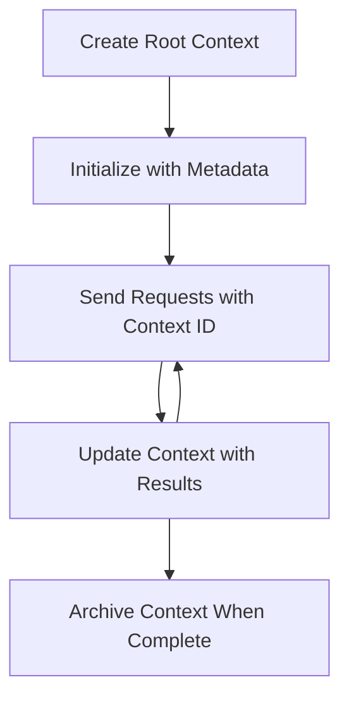

<!--
CO_OP_TRANSLATOR_METADATA:
{
  "original_hash": "ebdb86db46113f1cbd59ce4c74caaa79",
  "translation_date": "2025-07-17T12:37:52+00:00",
  "source_file": "05-AdvancedTopics/mcp-root-contexts/README.md",
  "language_code": "my"
}
-->
# MCP Root Contexts

Root contexts သည် Model Context Protocol တွင် အခြေခံအယူအဆတစ်ခုဖြစ်ပြီး၊ စကားပြောသမိုင်းနှင့် မတူညီသော တောင်းဆိုမှုများနှင့် အစည်းအဝေးများအတွင်း မျှဝေထားသော အခြေအနေများကို အမြဲတမ်း ထိန်းသိမ်းပေးနိုင်သော အလွှာတစ်ခုဖြစ်သည်။

## နိဒါန်း

ဒီသင်ခန်းစာတွင် MCP တွင် root contexts များကို ဘယ်လိုဖန်တီး၊ စီမံခန့်ခွဲ၊ အသုံးပြုရမည်ကို လေ့လာသွားမည်ဖြစ်သည်။

## သင်ယူရမည့် ရည်မှန်းချက်များ

ဒီသင်ခန်းစာအဆုံးသတ်ချိန်တွင် သင်သည် -

- root contexts ၏ ရည်ရွယ်ချက်နှင့် ဖွဲ့စည်းပုံကို နားလည်နိုင်မည်
- MCP client libraries ကို အသုံးပြု၍ root contexts များကို ဖန်တီး၊ စီမံခန့်ခွဲနိုင်မည်
- .NET, Java, JavaScript, နှင့် Python အပလီကေးရှင်းများတွင် root contexts များကို အကောင်အထည်ဖော်နိုင်မည်
- multi-turn စကားပြောများနှင့် အခြေအနေ စီမံခန့်ခွဲမှုအတွက် root contexts များကို အသုံးပြုနိုင်မည်
- root context စီမံခန့်ခွဲမှုအတွက် အကောင်းဆုံး လေ့လာမှုများကို အကောင်အထည်ဖော်နိုင်မည်

## Root Contexts ကို နားလည်ခြင်း

Root contexts များသည် ဆက်စပ်နေသော အပြန်အလှန်ဆက်သွယ်မှုများအတွက် သမိုင်းနှင့် အခြေအနေများကို သိမ်းဆည်းထားသော ကွန်တိန်နာများအဖြစ် လုပ်ဆောင်သည်။ ၎င်းတို့သည် -

- **စကားပြော ဆက်လက်မှု**: စကားပြောများကို တိကျစွာ ဆက်လက်ထိန်းသိမ်းပေးခြင်း
- **မှတ်ဉာဏ် စီမံခန့်ခွဲမှု**: အပြန်အလှန်ဆက်သွယ်မှုများအတွင်း သတင်းအချက်အလက်များ သိမ်းဆည်း၊ ပြန်လည်ရယူခြင်း
- **အခြေအနေ စီမံခန့်ခွဲမှု**: ရှုပ်ထွေးသော လုပ်ငန်းစဉ်များတွင် တိုးတက်မှုကို လိုက်လံခြင်း
- **အခြေအနေ မျှဝေမှု**: မတူညီသော client များအနေဖြင့် တူညီသော စကားပြောအခြေအနေကို ဝင်ရောက်အသုံးပြုနိုင်ခြင်း

MCP တွင် root contexts များတွင် အဓိက အချက်များမှာ -

- တစ်ခုချင်းစီတွင် ထူးခြားသော အမှတ်အသားရှိသည်။
- စကားပြောသမိုင်း၊ အသုံးပြုသူနှစ်သက်ချက်များနှင့် အခြား metadata များ ပါဝင်နိုင်သည်။
- လိုအပ်သလို ဖန်တီး၊ ဝင်ရောက်ကြည့်ရှု၊ သိုလှောင်ထားနိုင်သည်။
- အသေးစိတ် ဝင်ရောက်ခွင့်ထိန်းချုပ်မှုနှင့် ခွင့်ပြုချက်များကို ထောက်ပံ့ပေးသည်။

## Root Context အသက်တာကာလ



## Root Contexts နှင့် အလုပ်လုပ်ခြင်း

Root contexts များကို ဘယ်လို ဖန်တီး၊ စီမံခန့်ခွဲရမည်ကို ဥပမာတစ်ခုဖြင့် ဖော်ပြထားသည်။

### C# အကောင်အထည်ဖော်ခြင်း

```csharp
// .NET Example: Root Context Management
using Microsoft.Mcp.Client;
using System;
using System.Threading.Tasks;
using System.Collections.Generic;

public class RootContextExample
{
    private readonly IMcpClient _client;
    private readonly IRootContextManager _contextManager;
    
    public RootContextExample(IMcpClient client, IRootContextManager contextManager)
    {
        _client = client;
        _contextManager = contextManager;
    }
    
    public async Task DemonstrateRootContextAsync()
    {
        // 1. Create a new root context
        var contextResult = await _contextManager.CreateRootContextAsync(new RootContextCreateOptions
        {
            Name = "Customer Support Session",
            Metadata = new Dictionary<string, string>
            {
                ["CustomerName"] = "Acme Corporation",
                ["PriorityLevel"] = "High",
                ["Domain"] = "Cloud Services"
            }
        });
        
        string contextId = contextResult.ContextId;
        Console.WriteLine($"Created root context with ID: {contextId}");
        
        // 2. First interaction using the context
        var response1 = await _client.SendPromptAsync(
            "I'm having issues scaling my web service deployment in the cloud.", 
            new SendPromptOptions { RootContextId = contextId }
        );
        
        Console.WriteLine($"First response: {response1.GeneratedText}");
        
        // Second interaction - the model will have access to the previous conversation
        var response2 = await _client.SendPromptAsync(
            "Yes, we're using containerized deployments with Kubernetes.", 
            new SendPromptOptions { RootContextId = contextId }
        );
        
        Console.WriteLine($"Second response: {response2.GeneratedText}");
        
        // 3. Add metadata to the context based on conversation
        await _contextManager.UpdateContextMetadataAsync(contextId, new Dictionary<string, string>
        {
            ["TechnicalEnvironment"] = "Kubernetes",
            ["IssueType"] = "Scaling"
        });
        
        // 4. Get context information
        var contextInfo = await _contextManager.GetRootContextInfoAsync(contextId);
        
        Console.WriteLine("Context Information:");
        Console.WriteLine($"- Name: {contextInfo.Name}");
        Console.WriteLine($"- Created: {contextInfo.CreatedAt}");
        Console.WriteLine($"- Messages: {contextInfo.MessageCount}");
        
        // 5. When the conversation is complete, archive the context
        await _contextManager.ArchiveRootContextAsync(contextId);
        Console.WriteLine($"Archived context {contextId}");
    }
}
```

အထက်ပါ ကုဒ်တွင် -

1. ဖောက်သည်ပံ့ပိုးမှု အစည်းအဝေးအတွက် root context တစ်ခု ဖန်တီးထားသည်။
2. ထို context အတွင်း မက်ဆေ့ခ်ျများစွာ ပို့ပြီး မော်ဒယ်အား အခြေအနေ ထိန်းသိမ်းခွင့် ပေးထားသည်။
3. စကားပြောအခြေအနေအပေါ် မူတည်၍ သက်ဆိုင်ရာ metadata ဖြင့် context ကို အပ်ဒိတ်လုပ်ထားသည်။
4. စကားပြောသမိုင်းကို နားလည်ရန် context အချက်အလက်များကို ရယူထားသည်။
5. စကားပြောပြီးဆုံးသည့်အခါ context ကို သိုလှောင်ထားသည်။

## ဥပမာ - ဘဏ္ဍာရေးခွဲခြမ်းစိတ်ဖြာမှုအတွက် Root Context အကောင်အထည်ဖော်ခြင်း

ဒီဥပမာတွင် ဘဏ္ဍာရေးခွဲခြမ်းစိတ်ဖြာမှု အစည်းအဝေးအတွက် root context တစ်ခု ဖန်တီးပြီး မတူညီသော အပြန်အလှန်ဆက်သွယ်မှုများအတွင်း အခြေအနေ ထိန်းသိမ်းနည်းကို ပြသထားသည်။

### Java အကောင်အထည်ဖော်ခြင်း

```java
// Java Example: Root Context Implementation
package com.example.mcp.contexts;

import com.mcp.client.McpClient;
import com.mcp.client.ContextManager;
import com.mcp.models.RootContext;
import com.mcp.models.McpResponse;

import java.util.HashMap;
import java.util.Map;
import java.util.UUID;

public class RootContextsDemo {
    private final McpClient client;
    private final ContextManager contextManager;
    
    public RootContextsDemo(String serverUrl) {
        this.client = new McpClient.Builder()
            .setServerUrl(serverUrl)
            .build();
            
        this.contextManager = new ContextManager(client);
    }
    
    public void demonstrateRootContext() throws Exception {
        // Create context metadata
        Map<String, String> metadata = new HashMap<>();
        metadata.put("projectName", "Financial Analysis");
        metadata.put("userRole", "Financial Analyst");
        metadata.put("dataSource", "Q1 2025 Financial Reports");
        
        // 1. Create a new root context
        RootContext context = contextManager.createRootContext("Financial Analysis Session", metadata);
        String contextId = context.getId();
        
        System.out.println("Created context: " + contextId);
        
        // 2. First interaction
        McpResponse response1 = client.sendPrompt(
            "Analyze the trends in Q1 financial data for our technology division",
            contextId
        );
        
        System.out.println("First response: " + response1.getGeneratedText());
        
        // 3. Update context with important information gained from response
        contextManager.addContextMetadata(contextId, 
            Map.of("identifiedTrend", "Increasing cloud infrastructure costs"));
        
        // Second interaction - using the same context
        McpResponse response2 = client.sendPrompt(
            "What's driving the increase in cloud infrastructure costs?",
            contextId
        );
        
        System.out.println("Second response: " + response2.getGeneratedText());
        
        // 4. Generate a summary of the analysis session
        McpResponse summaryResponse = client.sendPrompt(
            "Summarize our analysis of the technology division financials in 3-5 key points",
            contextId
        );
        
        // Store the summary in context metadata
        contextManager.addContextMetadata(contextId, 
            Map.of("analysisSummary", summaryResponse.getGeneratedText()));
            
        // Get updated context information
        RootContext updatedContext = contextManager.getRootContext(contextId);
        
        System.out.println("Context Information:");
        System.out.println("- Created: " + updatedContext.getCreatedAt());
        System.out.println("- Last Updated: " + updatedContext.getLastUpdatedAt());
        System.out.println("- Analysis Summary: " + 
            updatedContext.getMetadata().get("analysisSummary"));
            
        // 5. Archive context when done
        contextManager.archiveContext(contextId);
        System.out.println("Context archived");
    }
}
```

အထက်ပါ ကုဒ်တွင် -

1. ဘဏ္ဍာရေးခွဲခြမ်းစိတ်ဖြာမှု အစည်းအဝေးအတွက် root context တစ်ခု ဖန်တီးထားသည်။
2. ထို context အတွင်း မက်ဆေ့ခ်ျများစွာ ပို့ပြီး မော်ဒယ်အား အခြေအနေ ထိန်းသိမ်းခွင့် ပေးထားသည်။
3. စကားပြောအခြေအနေအပေါ် မူတည်၍ သက်ဆိုင်ရာ metadata ဖြင့် context ကို အပ်ဒိတ်လုပ်ထားသည်။
4. ခွဲခြမ်းစိတ်ဖြာမှုအစည်းအဝေး၏ အကျဉ်းချုပ်ကို ဖန်တီးပြီး context metadata တွင် သိမ်းဆည်းထားသည်။
5. စကားပြောပြီးဆုံးသည့်အခါ context ကို သိုလှောင်ထားသည်။

## ဥပမာ - Root Context စီမံခန့်ခွဲမှု

Root contexts များကို ထိရောက်စွာ စီမံခန့်ခွဲခြင်းသည် စကားပြောသမိုင်းနှင့် အခြေအနေ ထိန်းသိမ်းမှုအတွက် အရေးကြီးသည်။ အောက်တွင် root context စီမံခန့်ခွဲမှုကို အကောင်အထည်ဖော်နည်း ဥပမာတစ်ခု ဖော်ပြထားသည်။

### JavaScript အကောင်အထည်ဖော်ခြင်း

```javascript
// JavaScript Example: Managing MCP Root Contexts
const { McpClient, RootContextManager } = require('@mcp/client');

class ContextSession {
  constructor(serverUrl, apiKey = null) {
    // Initialize the MCP client
    this.client = new McpClient({
      serverUrl,
      apiKey
    });
    
    // Initialize context manager
    this.contextManager = new RootContextManager(this.client);
  }
  
  /**
   * Create a new conversation context
   * @param {string} sessionName - Name of the conversation session
   * @param {Object} metadata - Additional metadata for the context
   * @returns {Promise<string>} - Context ID
   */
  async createConversationContext(sessionName, metadata = {}) {
    try {
      const contextResult = await this.contextManager.createRootContext({
        name: sessionName,
        metadata: {
          ...metadata,
          createdAt: new Date().toISOString(),
          status: 'active'
        }
      });
      
      console.log(`Created root context '${sessionName}' with ID: ${contextResult.id}`);
      return contextResult.id;
    } catch (error) {
      console.error('Error creating root context:', error);
      throw error;
    }
  }
  
  /**
   * Send a message in an existing context
   * @param {string} contextId - The root context ID
   * @param {string} message - The user's message
   * @param {Object} options - Additional options
   * @returns {Promise<Object>} - Response data
   */
  async sendMessage(contextId, message, options = {}) {
    try {
      // Send the message using the specified context
      const response = await this.client.sendPrompt(message, {
        rootContextId: contextId,
        temperature: options.temperature || 0.7,
        allowedTools: options.allowedTools || []
      });
      
      // Optionally store important insights from the conversation
      if (options.storeInsights) {
        await this.storeConversationInsights(contextId, message, response.generatedText);
      }
      
      return {
        message: response.generatedText,
        toolCalls: response.toolCalls || [],
        contextId
      };
    } catch (error) {
      console.error(`Error sending message in context ${contextId}:`, error);
      throw error;
    }
  }
  
  /**
   * Store important insights from a conversation
   * @param {string} contextId - The root context ID
   * @param {string} userMessage - User's message
   * @param {string} aiResponse - AI's response
   */
  async storeConversationInsights(contextId, userMessage, aiResponse) {
    try {
      // Extract potential insights (in a real app, this would be more sophisticated)
      const combinedText = userMessage + "\n" + aiResponse;
      
      // Simple heuristic to identify potential insights
      const insightWords = ["important", "key point", "remember", "significant", "crucial"];
      
      const potentialInsights = combinedText
        .split(".")
        .filter(sentence => 
          insightWords.some(word => sentence.toLowerCase().includes(word))
        )
        .map(sentence => sentence.trim())
        .filter(sentence => sentence.length > 10);
      
      // Store insights in context metadata
      if (potentialInsights.length > 0) {
        const insights = {};
        potentialInsights.forEach((insight, index) => {
          insights[`insight_${Date.now()}_${index}`] = insight;
        });
        
        await this.contextManager.updateContextMetadata(contextId, insights);
        console.log(`Stored ${potentialInsights.length} insights in context ${contextId}`);
      }
    } catch (error) {
      console.warn('Error storing conversation insights:', error);
      // Non-critical error, so just log warning
    }
  }
  
  /**
   * Get summary information about a context
   * @param {string} contextId - The root context ID
   * @returns {Promise<Object>} - Context information
   */
  async getContextInfo(contextId) {
    try {
      const contextInfo = await this.contextManager.getContextInfo(contextId);
      
      return {
        id: contextInfo.id,
        name: contextInfo.name,
        created: new Date(contextInfo.createdAt).toLocaleString(),
        lastUpdated: new Date(contextInfo.lastUpdatedAt).toLocaleString(),
        messageCount: contextInfo.messageCount,
        metadata: contextInfo.metadata,
        status: contextInfo.status
      };
    } catch (error) {
      console.error(`Error getting context info for ${contextId}:`, error);
      throw error;
    }
  }
  
  /**
   * Generate a summary of the conversation in a context
   * @param {string} contextId - The root context ID
   * @returns {Promise<string>} - Generated summary
   */
  async generateContextSummary(contextId) {
    try {
      // Ask the model to generate a summary of the conversation so far
      const response = await this.client.sendPrompt(
        "Please summarize our conversation so far in 3-4 sentences, highlighting the main points discussed.",
        { rootContextId: contextId, temperature: 0.3 }
      );
      
      // Store the summary in context metadata
      await this.contextManager.updateContextMetadata(contextId, {
        conversationSummary: response.generatedText,
        summarizedAt: new Date().toISOString()
      });
      
      return response.generatedText;
    } catch (error) {
      console.error(`Error generating context summary for ${contextId}:`, error);
      throw error;
    }
  }
  
  /**
   * Archive a context when it's no longer needed
   * @param {string} contextId - The root context ID
   * @returns {Promise<Object>} - Result of the archive operation
   */
  async archiveContext(contextId) {
    try {
      // Generate a final summary before archiving
      const summary = await this.generateContextSummary(contextId);
      
      // Archive the context
      await this.contextManager.archiveContext(contextId);
      
      return {
        status: "archived",
        contextId,
        summary
      };
    } catch (error) {
      console.error(`Error archiving context ${contextId}:`, error);
      throw error;
    }
  }
}

// Example usage
async function demonstrateContextSession() {
  const session = new ContextSession('https://mcp-server-example.com');
  
  try {
    // 1. Create a new context for a product support conversation
    const contextId = await session.createConversationContext(
      'Product Support - Database Performance',
      {
        customer: 'Globex Corporation',
        product: 'Enterprise Database',
        severity: 'Medium',
        supportAgent: 'AI Assistant'
      }
    );
    
    // 2. First message in the conversation
    const response1 = await session.sendMessage(
      contextId,
      "I'm experiencing slow query performance on our database cluster after the latest update.",
      { storeInsights: true }
    );
    console.log('Response 1:', response1.message);
    
    // Follow-up message in the same context
    const response2 = await session.sendMessage(
      contextId,
      "Yes, we've already checked the indexes and they seem to be properly configured.",
      { storeInsights: true }
    );
    console.log('Response 2:', response2.message);
    
    // 3. Get information about the context
    const contextInfo = await session.getContextInfo(contextId);
    console.log('Context Information:', contextInfo);
    
    // 4. Generate and display conversation summary
    const summary = await session.generateContextSummary(contextId);
    console.log('Conversation Summary:', summary);
    
    // 5. Archive the context when done
    const archiveResult = await session.archiveContext(contextId);
    console.log('Archive Result:', archiveResult);
    
    // 6. Handle any errors gracefully
  } catch (error) {
    console.error('Error in context session demonstration:', error);
  }
}

demonstrateContextSession();
```

အထက်ပါ ကုဒ်တွင် -

1. `createConversationContext` function ဖြင့် database performance ပြဿနာများနှင့် ပတ်သက်သော ထုတ်ကုန်ပံ့ပိုးမှု စကားပြောအတွက် root context တစ်ခု ဖန်တီးထားသည်။
2. `sendMessage` function ဖြင့် ထို context အတွင်း မက်ဆေ့ခ်ျများစွာ ပို့ပြီး မော်ဒယ်အား အခြေအနေ ထိန်းသိမ်းခွင့် ပေးထားသည်။ ပို့သော မက်ဆေ့ခ်ျများမှာ query performance နှေးကွေးမှုနှင့် index configuration အကြောင်းဖြစ်သည်။
3. စကားပြောအခြေအနေအပေါ် မူတည်၍ သက်ဆိုင်ရာ metadata ဖြင့် context ကို အပ်ဒိတ်လုပ်ထားသည်။
4. `generateContextSummary` function ဖြင့် စကားပြောအကျဉ်းချုပ် ဖန်တီးပြီး context metadata တွင် သိမ်းဆည်းထားသည်။
5. စကားပြောပြီးဆုံးသည့်အခါ `archiveContext` function ဖြင့် context ကို သိုလှောင်ထားသည်။
6. အမှားများကို သေချာစွာ ကိုင်တွယ်ကာ တည်ငြိမ်မှုကို သေချာစေသည်။

## Multi-Turn အကူအညီအတွက် Root Context

ဒီဥပမာတွင် multi-turn အကူအညီအစည်းအဝေးအတွက် root context တစ်ခု ဖန်တီးပြီး မတူညီသော အပြန်အလှန်ဆက်သွယ်မှုများအတွင်း အခြေအနေ ထိန်းသိမ်းနည်းကို ပြသထားသည်။

### Python အကောင်အထည်ဖော်ခြင်း

```python
# Python Example: Root Context for Multi-Turn Assistance
import asyncio
from datetime import datetime
from mcp_client import McpClient, RootContextManager

class AssistantSession:
    def __init__(self, server_url, api_key=None):
        self.client = McpClient(server_url=server_url, api_key=api_key)
        self.context_manager = RootContextManager(self.client)
    
    async def create_session(self, name, user_info=None):
        """Create a new root context for an assistant session"""
        metadata = {
            "session_type": "assistant",
            "created_at": datetime.now().isoformat(),
        }
        
        # Add user information if provided
        if user_info:
            metadata.update({f"user_{k}": v for k, v in user_info.items()})
            
        # Create the root context
        context = await self.context_manager.create_root_context(name, metadata)
        return context.id
    
    async def send_message(self, context_id, message, tools=None):
        """Send a message within a root context"""
        # Create options with context ID
        options = {
            "root_context_id": context_id
        }
        
        # Add tools if specified
        if tools:
            options["allowed_tools"] = tools
        
        # Send the prompt within the context
        response = await self.client.send_prompt(message, options)
        
        # Update context metadata with conversation progress
        await self.context_manager.update_context_metadata(
            context_id,
            {
                f"message_{datetime.now().timestamp()}": message[:50] + "...",
                "last_interaction": datetime.now().isoformat()
            }
        )
        
        return response
    
    async def get_conversation_history(self, context_id):
        """Retrieve conversation history from a context"""
        context_info = await self.context_manager.get_context_info(context_id)
        messages = await self.client.get_context_messages(context_id)
        
        return {
            "context_info": context_info,
            "messages": messages
        }
    
    async def end_session(self, context_id):
        """End an assistant session by archiving the context"""
        # Generate a summary prompt first
        summary_response = await self.client.send_prompt(
            "Please summarize our conversation and any key points or decisions made.",
            {"root_context_id": context_id}
        )
        
        # Store summary in metadata
        await self.context_manager.update_context_metadata(
            context_id,
            {
                "summary": summary_response.generated_text,
                "ended_at": datetime.now().isoformat(),
                "status": "completed"
            }
        )
        
        # Archive the context
        await self.context_manager.archive_context(context_id)
        
        return {
            "status": "completed",
            "summary": summary_response.generated_text
        }

# Example usage
async def demo_assistant_session():
    assistant = AssistantSession("https://mcp-server-example.com")
    
    # 1. Create session
    context_id = await assistant.create_session(
        "Technical Support Session",
        {"name": "Alex", "technical_level": "advanced", "product": "Cloud Services"}
    )
    print(f"Created session with context ID: {context_id}")
    
    # 2. First interaction
    response1 = await assistant.send_message(
        context_id, 
        "I'm having trouble with the auto-scaling feature in your cloud platform.",
        ["documentation_search", "diagnostic_tool"]
    )
    print(f"Response 1: {response1.generated_text}")
    
    # Second interaction in the same context
    response2 = await assistant.send_message(
        context_id,
        "Yes, I've already checked the configuration settings you mentioned, but it's still not working."
    )
    print(f"Response 2: {response2.generated_text}")
    
    # 3. Get history
    history = await assistant.get_conversation_history(context_id)
    print(f"Session has {len(history['messages'])} messages")
    
    # 4. End session
    end_result = await assistant.end_session(context_id)
    print(f"Session ended with summary: {end_result['summary']}")

if __name__ == "__main__":
    asyncio.run(demo_assistant_session())
```

အထက်ပါ ကုဒ်တွင် -

1. `create_session` function ဖြင့် နည်းပညာပံ့ပိုးမှု အစည်းအဝေးအတွက် root context တစ်ခု ဖန်တီးထားသည်။ context တွင် အသုံးပြုသူ၏ နာမည်နှင့် နည်းပညာအဆင့် အချက်အလက်များ ပါဝင်သည်။
2. `send_message` function ဖြင့် ထို context အတွင်း မက်ဆေ့ခ်ျများစွာ ပို့ပြီး မော်ဒယ်အား အခြေအနေ ထိန်းသိမ်းခွင့် ပေးထားသည်။ ပို့သော မက်ဆေ့ခ်ျများမှာ auto-scaling feature ပြဿနာများအကြောင်းဖြစ်သည်။
3. `get_conversation_history` function ဖြင့် စကားပြောသမိုင်းကို ရယူထားသည်၊ ၎င်းသည် context အချက်အလက်နှင့် မက်ဆေ့ခ်ျများကို ပေးသည်။
4. `end_session` function ဖြင့် context ကို သိုလှောင်ပြီး စကားပြောအကျဉ်းချုပ် ဖန်တီးကာ အစည်းအဝေးကို အဆုံးသတ်ထားသည်။

## Root Context အကောင်းဆုံး လေ့လာမှုများ

Root contexts များကို ထိရောက်စွာ စီမံခန့်ခွဲရန် အကောင်းဆုံး လေ့လာမှုများမှာ -

- **အာရုံစိုက်ထားသော Context များ ဖန်တီးပါ**: စကားပြောရည်ရွယ်ချက် သို့မဟုတ် နယ်ပယ်အလိုက် သီးခြား root contexts များ ဖန်တီး၍ ရှင်းလင်းမှုကို ထိန်းသိမ်းပါ။
- **သက်တမ်းကုန်ဆုံးမှု မူဝါဒများ သတ်မှတ်ပါ**: သိုလှောင်မှုကို စီမံရန်နှင့် ဒေတာသိမ်းဆည်းမှု မူဝါဒများနှင့် ကိုက်ညီရန် အဟောင်း context များကို သိုလှောင်ခြင်း သို့မဟုတ် ဖျက်ပစ်ခြင်း မူဝါဒများ ထည့်သွင်းပါ။
- **သက်ဆိုင်ရာ Metadata များ သိမ်းဆည်းပါ**: စကားပြောအကြောင်းအရာအရေးကြီးသော သတင်းအချက်အလက်များကို context metadata တွင် သိမ်းဆည်းပါ။
- **Context ID များကို တစ်ပြိုင်နက်တည်း အသုံးပြုပါ**: context တစ်ခု ဖန်တီးပြီးနောက်၊ ဆက်စပ်သော တောင်းဆိုမှုများအားလုံးတွင် ၎င်း၏ ID ကို တစ်ပြိုင်နက်တည်း အသုံးပြု၍ ဆက်လက်မှုကို ထိန်းသိမ်းပါ။
- **အကျဉ်းချုပ်များ ဖန်တီးပါ**: context အရွယ်အစား ကြီးလာသောအခါ အရေးကြီးသော သတင်းအချက်အလက်များကို ဖမ်းယူရန် အကျဉ်းချုပ်များ ဖန်တီးရန် စဉ်းစားပါ။
- **ဝင်ရောက်ခွင့် ထိန်းချုပ်မှုကို အကောင်အထည်ဖော်ပါ**: များစွာသော အသုံးပြုသူစနစ်များအတွက် စကားပြော context များ၏ ကိုယ်ရေးကိုယ်တာနှင့် လုံခြုံမှုကို သေချာစေရန် သင့်တော်သော ဝင်ရောက်ခွင့် ထိန်းချုပ်မှုများကို အကောင်အထည်ဖော်ပါ။
- **Context ကန့်သတ်ချက်များကို ကိုင်တွယ်ပါ**: context အရွယ်အစား ကန့်သတ်ချက်များကို သိရှိထားပြီး အလွန်ရှည်လျားသော စကားပြောများကို ကိုင်တွယ်ရန် မဟာဗျူဟာများ ထည့်သွင်းပါ။
- **ပြီးဆုံးသည့်အခါ သိုလှောင်ပါ**: စကားပြောများပြီးဆုံးသည့်အခါ context များကို သိုလှောင်၍ အရင်းအမြစ်များ လွတ်လပ်စေပြီး စကားပြောသမိုင်းကို ထိန်းသိမ်းပါ။

## နောက်တစ်ဆင့်

- [5.5 Routing](../mcp-routing/README.md)

**အကြောင်းကြားချက်**  
ဤစာတမ်းကို AI ဘာသာပြန်ဝန်ဆောင်မှု [Co-op Translator](https://github.com/Azure/co-op-translator) ဖြင့် ဘာသာပြန်ထားပါသည်။ ကျွန်ုပ်တို့သည် တိကျမှန်ကန်မှုအတွက် ကြိုးစားသော်လည်း အလိုအလျောက် ဘာသာပြန်မှုများတွင် အမှားများ သို့မဟုတ် မှားယွင်းချက်များ ပါဝင်နိုင်ကြောင်း သတိပြုပါရန် မေတ္တာရပ်ခံအပ်ပါသည်။ မူရင်းစာတမ်းကို မိမိဘာသာစကားဖြင့်သာ တရားဝင်အရင်းအမြစ်အဖြစ် ယူဆသင့်ပါသည်။ အရေးကြီးသော အချက်အလက်များအတွက် လူ့ဘာသာပြန်ပညာရှင်မှ ဘာသာပြန်ခြင်းကို အကြံပြုပါသည်။ ဤဘာသာပြန်မှုကို အသုံးပြုရာမှ ဖြစ်ပေါ်လာနိုင်သည့် နားလည်မှုမှားယွင်းမှုများအတွက် ကျွန်ုပ်တို့သည် တာဝန်မယူပါ။