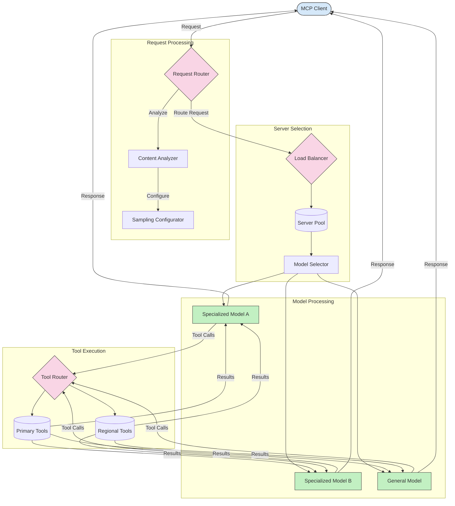

<!--
CO_OP_TRANSLATOR_METADATA:
{
  "original_hash": "2f1b473818b5a6cc9a9bbf777fffa6d4",
  "translation_date": "2025-07-14T21:51:56+00:00",
  "source_file": "05-AdvancedTopics/mcp-routing/README.md",
  "language_code": "my"
}
-->
## MCP တွင် Sampling နှင့် Routing အဆောက်အအုံ

Sampling သည် Model Context Protocol (MCP) ၏ အရေးကြီးသော အစိတ်အပိုင်းဖြစ်ပြီး၊ ထိရောက်စွာ တောင်းဆိုမှုများကို ဆောင်ရွက်ရန်နှင့် routing ပြုလုပ်ရန် အသုံးပြုသည်။ ၎င်းသည် လာရောက်သော တောင်းဆိုမှုများကို အကြောင်းအရာအမျိုးအစား၊ အသုံးပြုသူအခြေအနေ၊ စနစ်ပေါ်လွှမ်းမှု စသည့် အချက်အလက်များအပေါ် မူတည်၍ အကောင်းဆုံး မော်ဒယ် သို့မဟုတ် ဝန်ဆောင်မှုကို သတ်မှတ်ရန် စိစစ်ခြင်းကို ပါဝင်သည်။

Sampling နှင့် routing ကို ပေါင်းစပ်၍ အရင်းအမြစ် အသုံးပြုမှုကို ထိရောက်စွာ စီမံခန့်ခွဲနိုင်ပြီး၊ ဝန်ဆောင်မှုများ အမြဲရရှိနိုင်မှုကို သေချာစေသော ခိုင်မာသော အဆောက်အအုံတစ်ခု ဖန်တီးနိုင်သည်။ Sampling လုပ်ငန်းစဉ်သည် တောင်းဆိုမှုများကို အမျိုးအစားခွဲခြားရာတွင် အသုံးပြုနိုင်ပြီး၊ routing သည် ၎င်းတို့ကို သင့်တော်သော မော်ဒယ်များ သို့မဟုတ် ဝန်ဆောင်မှုများသို့ ဦးတည်ပေးသည်။

အောက်ပါ ပုံက MCP ၏ စုံလင်သော အဆောက်အအုံတွင် sampling နှင့် routing များ ဘယ်လို ပူးပေါင်းလုပ်ဆောင်ကြောင်း ဖော်ပြထားသည်-

## နောက်တစ်ဆင့်

- [5.6 Sampling](../mcp-sampling/README.md)

**အကြောင်းကြားချက်**  
ဤစာတမ်းကို AI ဘာသာပြန်ဝန်ဆောင်မှု [Co-op Translator](https://github.com/Azure/co-op-translator) ဖြင့် ဘာသာပြန်ထားပါသည်။ ကျွန်ုပ်တို့သည် တိကျမှန်ကန်မှုအတွက် ကြိုးစားသော်လည်း အလိုအလျောက် ဘာသာပြန်ခြင်းတွင် အမှားများ သို့မဟုတ် မှားယွင်းချက်များ ပါဝင်နိုင်ကြောင်း သတိပြုပါရန် မေတ္တာရပ်ခံအပ်ပါသည်။ မူရင်းစာတမ်းကို မိမိဘာသာစကားဖြင့်သာ တရားဝင်အချက်အလက်အဖြစ် ယူဆသင့်ပါသည်။ အရေးကြီးသော အချက်အလက်များအတွက် လူ့ဘာသာပြန်ပညာရှင်မှ ဘာသာပြန်ခြင်းကို အကြံပြုပါသည်။ ဤဘာသာပြန်ချက်ကို အသုံးပြုရာမှ ဖြစ်ပေါ်လာနိုင်သည့် နားလည်မှုမှားယွင်းမှုများအတွက် ကျွန်ုပ်တို့သည် တာဝန်မယူပါ။