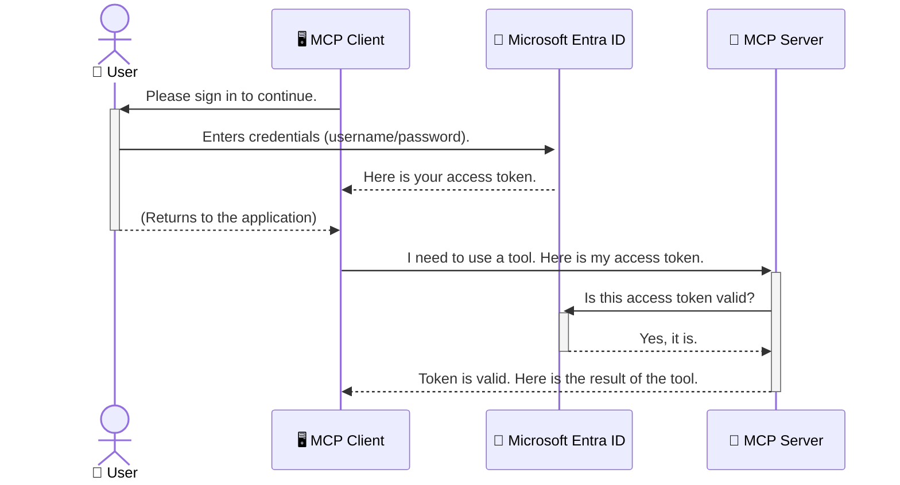

<!--
CO_OP_TRANSLATOR_METADATA:
{
  "original_hash": "9abe1d303ab126f9a8b87f03cebe5213",
  "translation_date": "2025-06-26T15:03:10+00:00",
  "source_file": "05-AdvancedTopics/mcp-security-entra/README.md",
  "language_code": "my"
}
-->
# AI Workflow များကို လုံခြုံစေရန်: Model Context Protocol Servers များအတွက် Entra ID Authentication

## နိဒါန်း  
သင့် Model Context Protocol (MCP) server ကို လုံခြုံစေခြင်းမှာ မိမိအိမ်၏ အရှေ့တံခါးကို သော့ချထားသည့်အတိုင်း အရေးကြီးပါသည်။ MCP server ကို ဖွင့်ထားခြင်းသည် မသင့်တော်သော အသုံးပြုသူများမှ သင့်ကိရိယာများနှင့် ဒေတာများကို မသိမသာ ဝင်ရောက်နိုင်ခြင်းဖြစ်ပြီး လုံခြုံရေး ချိုးဖောက်မှုများ ဖြစ်ပေါ်စေနိုင်သည်။ Microsoft Entra ID သည် မည်သူများသာ MCP server နှင့် ဆက်သွယ်နိုင်မည်ကို သေချာစေရန်၊ cloud အခြေပြု identity နှင့် access management ဖြေရှင်းချက်အား ပေးဆောင်သည်။ ဤအပိုင်းတွင် Entra ID authentication ကို အသုံးပြု၍ သင့် AI workflows များကို မည်သို့ ကာကွယ်ရမည်ကို သင်လေ့လာမည်ဖြစ်သည်။

## သင်ယူရမည့် ရည်မှန်းချက်များ  
ဤအပိုင်းကို ပြီးမြောက်ချိန်တွင် သင်သည် -

- MCP servers များကို လုံခြုံစေရန် အရေးပါမှုကို နားလည်နိုင်မည်။
- Microsoft Entra ID နှင့် OAuth 2.0 authentication အခြေခံအချက်များကို ရှင်းပြနိုင်မည်။
- public client နှင့် confidential client များ၏ ကွာခြားချက်ကို ခွဲခြားသိရှိနိုင်မည်။
- local (public client) နှင့် remote (confidential client) MCP server အခြေအနေများတွင် Entra ID authentication ကို အကောင်အထည်ဖော်နိုင်မည်။
- AI workflows ဖန်တီးရာတွင် လုံခြုံရေးအကောင်းဆုံးအတတ်ပညာများကို အသုံးပြုနိုင်မည်။

# AI Workflow များကို လုံခြုံစေရန်: Model Context Protocol Servers များအတွက် Entra ID Authentication

မိမိအိမ်၏ အရှေ့တံခါးကို မသော့ချထားသလို MCP server ကိုလည်း မည်သူမဆို ဝင်ရောက်နိုင်အောင် ဖွင့်ထားသင့်မည် မဟုတ်ပါ။ သင့် AI workflows များကို လုံခြုံစေရန်သည် ခိုင်မာပြီး ယုံကြည်စိတ်ချရသော၊ လုံခြုံသော application များ ဖန်တီးရာတွင် အလွန် အရေးကြီးပါသည်။ ဤအခန်းတွင် Microsoft Entra ID ကို အသုံးပြု၍ MCP servers များကို မည်သို့ လုံခြုံစေမည်ကို မိတ်ဆက်ပေးမည်ဖြစ်ပြီး၊ သက်ဆိုင်ရာ အသုံးပြုသူများနှင့် application များသာ သင့်ကိရိယာများနှင့် ဒေတာများနှင့် ဆက်သွယ်နိုင်ကြောင်း သေချာစေရန် နည်းလမ်းများကို လေ့လာနိုင်ပါသည်။

## MCP Servers များအတွက် လုံခြုံရေး အရေးကြီးမှု

သင့် MCP server တွင် အီးမေးလ်ပို့ခြင်း သို့မဟုတ် ဖောက်သည်ဒေတာဘေ့စ်ကို ဝင်ရောက်စစ်ဆေးနိုင်သော ကိရိယာတစ်ခု ရှိကြောင်း စဉ်းစားကြည့်ပါ။ လုံခြုံမှုမရှိသော server ဆိုသည်မှာ မည်သူမဆို ထိုကိရိယာကို အသုံးပြုနိုင်ပြီး ဒေတာမမှန်ကန်စွာ ဝင်ရောက်ခြင်း၊ စပမ်ပို့ခြင်း သို့မဟုတ် မကောင်းသော လုပ်ရပ်များ ဖြစ်ပေါ်စေနိုင်ပါသည်။

Authentication ကို ထည့်သွင်းအသုံးပြုခြင်းဖြင့် သင့် server သို့ လာရောက်သော တောင်းဆိုမှုတိုင်းကို စစ်ဆေးပြီး အသုံးပြုသူ သို့မဟုတ် application ၏ ကိုယ်စားလှယ်ကို အတည်ပြုနိုင်သည်။ ၎င်းသည် သင့် AI workflows များကို လုံခြုံစေရန် အရေးကြီးဆုံး အဆင့်ဖြစ်သည်။

## Microsoft Entra ID နဲ့ နိဒါန်း

**Microsoft Entra ID** သည် cloud အခြေပြု identity နှင့် access management ဝန်ဆောင်မှုတစ်ခုဖြစ်သည်။ ၎င်းကို သင့် application များအတွက် အပြည်ပြည်ဆိုင်ရာ လုံခြုံရေးအရာရှိတစ်ဦးလို ထင်မြင်နိုင်သည်။ အသုံးပြုသူများ၏ ကိုယ်ပိုင်အချက်အလက်များကို အတည်ပြုခြင်း (authentication) နှင့် ၎င်းတို့အား မည်သည့်အရာများကို ခွင့်ပြုမည်ကို ဆုံးဖြတ်ခြင်း (authorization) ကို စီမံခန့်ခွဲပေးသည်။

Entra ID ကို အသုံးပြုခြင်းဖြင့် -

- အသုံးပြုသူများအတွက် လုံခြုံစိတ်ချရသော အကောင့်ဝင်ခြင်းကို ဖွင့်လှစ်နိုင်သည်။
- API များနှင့် ဝန်ဆောင်မှုများကို ကာကွယ်နိုင်သည်။
- Access မူဝါဒများကို ဗဟိုစီမံခန့်ခွဲမှုမှ စီမံနိုင်သည်။

MCP servers များအတွက် Entra ID သည် သင့် server ၏ လုပ်ဆောင်နိုင်မှုများကို မည်သူအသုံးပြုနိုင်မည်ကို စီမံခန့်ခွဲရန် ခိုင်မာပြီး ယုံကြည်စိတ်ချရသော ဖြေရှင်းချက်တစ်ခုဖြစ်သည်။

---

## Entra ID Authentication ဘယ်လို လည်ပတ်သလဲ

Entra ID သည် **OAuth 2.0** ကဲ့သို့သော ဖွင့်လှစ်ထားသော စံသတ်မှတ်ချက်များကို အသုံးပြုကာ authentication ကို စီမံခန့်ခွဲသည်။ အသေးစိတ်များမှာ စိပ်စိပ်လွယ်လွယ် မဟုတ်သော်လည်း အဓိက အကြောင်းအရာကို နမူနာတစ်ခုဖြင့် ရှင်းပြနိုင်သည်။

### OAuth 2.0 ကို ရိုးရှင်းစွာ နားလည်ခြင်း: Valet Key နမူနာ

OAuth 2.0 ကို မိမိကားအတွက် valet ဝန်ဆောင်မှုတစ်ခုလို ထင်မြင်ပါ။ စားသောက်ဆိုင်သို့ ရောက်ရှိသည့်အခါ မိမိ master key ကို valet ကို မပေးပါ။ အစား **valet key** ကိုပေးပြီး ၎င်းသည် ကားကို စတင်မောင်းနှင်ခြင်းနှင့် တံခါးများကို သော့ချနိုင်သည်၊ သို့သော် ကား၏ ထုပ်ပိုးခုံသို့မဟုတ် glove compartment ကို မဖွင့်နိုင်ပါ။

ဤနမူနာတွင် -

- **သင်** သည် **အသုံးပြုသူ(User)** ဖြစ်သည်။
- **သင့်ကား** သည် **MCP Server** ဖြစ်ပြီး တန်ဖိုးရှိသော ကိရိယာများနှင့် ဒေတာများပါဝင်သည်။
- **Valet** သည် **Microsoft Entra ID** ဖြစ်သည်။
- **Parking Attendant** သည် **MCP Client** (server ကို ဝင်ရောက်ကြိုးစားသော application) ဖြစ်သည်။
- **Valet Key** သည် **Access Token** ဖြစ်သည်။

Access token သည် MCP client သို့ သင့်လက်မှတ်ဖြင့် Entra ID မှ ရရှိသော လုံခြုံသော စာသား စီးရီးဖြစ်သည်။ client သည် တောင်းဆိုမှုတိုင်းတွင် token ကို MCP server ဆီ တင်ပြသည်။ server သည် token ကို စစ်ဆေးကာ တောင်းဆိုမှုတရားဝင်ကြောင်းနှင့် client သည် လိုအပ်သော ခွင့်ပြုချက်များ ရှိကြောင်း သေချာစေသည်။ ၎င်းသည် သင့်စကားဝှက်ကဲ့သို့သော ကိုယ်ပိုင်အချက်အလက်များကို မကြားနာဘဲ လုပ်ဆောင်နိုင်သည်။

### Authentication လည်ပတ်မှု စနစ်

လုပ်ငန်းစဉ်ကို အောက်ပါအတိုင်း လုပ်ဆောင်သည် -



### Microsoft Authentication Library (MSAL) ကို မိတ်ဆက်ခြင်း

ကုဒ်ကို စတင်မဖတ်ရှုမီ၊ ဥပမာများတွင် တွေ့ရမည့် အရေးကြီးသော library တစ်ခုဖြစ်သည့် **Microsoft Authentication Library (MSAL)** ကို မိတ်ဆက်ပေးလိုသည်။

MSAL သည် Microsoft မှ ဖန်တီးထားသော library တစ်ခုဖြစ်ပြီး developer များအတွက် authentication ကို လွယ်ကူစွာ စီမံခန့်ခွဲနိုင်ရန် အထောက်အကူပြုသည်။ သင့်အနေဖြင့် လုံခြုံရေး token များကို စီမံခြင်း၊ အကောင့်ဝင်ခြင်းများကို စီမံခန့်ခွဲခြင်း၊ session များကို ပြန်လည်အသစ်လုပ်ခြင်းတို့ကို ကိုယ်တိုင် ရေးရန် မလိုတော့ပဲ MSAL သည် ၎င်းတို့ကို ပြုလုပ်ပေးသည်။

MSAL ကို အသုံးပြုသင့်သည့် အကြောင်းရင်းများမှာ -

- **လုံခြုံမှုရှိသည်** - စက်မှုလုပ်ငန်းစံနှုန်းများနှင့် လုံခြုံရေးအကောင်းဆုံးလုပ်ထုံးလုပ်နည်းများကို အသုံးပြုထားသည်၊ သင့်ကုဒ်တွင် ချို့ယွင်းချက်များ ဖြစ်ပေါ်နိုင်မှုကို လျော့နည်းစေသည်။
- **ဖွံ့ဖြိုးရေး လွယ်ကူစေသည်** - OAuth 2.0 နှင့် OpenID Connect စံသတ်မှတ်ချက်များ၏ ရှုပ်ထွေးမှုများကို ဖုံးကွယ်ပေးကာ သင့် application တွင် authentication ကို လွယ်ကူစွာ ထည့်သွင်းနိုင်သည်။
- **တိုးတက်ပြောင်းလဲမှုများကို ထိန်းသိမ်းပေးသည်** - Microsoft မှ လုံခြုံရေး အန္တရာယ်အသစ်များနှင့် ပလက်ဖောင်းပြောင်းလဲမှုများကို တက်ကြွစွာ ပြုပြင်ထိန်းသိမ်းသည်။

MSAL သည် .NET, JavaScript/TypeScript, Python, Java, Go နှင့် iOS, Android ကဲ့သို့သော မိုဘိုင်း ပလက်ဖောင်းများအပါအဝင် ဘာသာစကားများနှင့် application framework များစွာကို ပံ့ပိုးသည်။ သင်၏ နည်းပညာ stack အားလုံးတွင် တစ်ခုတည်းသော authentication ပုံစံကို အသုံးပြုနိုင်ပါသည်။

MSAL အကြောင်း ပိုမိုသိရှိလိုပါက တရားဝင် [MSAL overview documentation](https://learn.microsoft.com/entra/identity-platform/msal-overview) ကို ကြည့်ရှုနိုင်ပါသည်။

---

## Entra ID ဖြင့် MCP Server ကို လုံခြုံစေရန် လမ်းညွှန်ချက်

ယခု `stdio`) using Entra ID. This example uses a **public client**, which is suitable for applications running on a user's machine, like a desktop app or a local development server.

### Scenario 1: Securing a Local MCP Server (with a Public Client)

In this scenario, we'll look at an MCP server that runs locally, communicates over `stdio`, and uses Entra ID to authenticate the user before allowing access to its tools. The server will have a single tool that fetches the user's profile information from the Microsoft Graph API.

#### 1. Setting Up the Application in Entra ID

Before writing any code, you need to register your application in Microsoft Entra ID. This tells Entra ID about your application and grants it permission to use the authentication service.

1. Navigate to the **[Microsoft Entra portal](https://entra.microsoft.com/)**.
2. Go to **App registrations** and click **New registration**.
3. Give your application a name (e.g., "My Local MCP Server").
4. For **Supported account types**, select **Accounts in this organizational directory only**.
5. You can leave the **Redirect URI** blank for this example.
6. Click **Register**.

Once registered, take note of the **Application (client) ID** and **Directory (tenant) ID**. You'll need these in your code.

#### 2. The Code: A Breakdown

Let's look at the key parts of the code that handle authentication. The full code for this example is available in the [Entra ID - Local - WAM](https://github.com/Azure-Samples/mcp-auth-servers/tree/main/src/entra-id-local-wam) folder of the [mcp-auth-servers GitHub repository](https://github.com/Azure-Samples/mcp-auth-servers).

**`AuthenticationService.cs`**

This class is responsible for handling the interaction with Entra ID.

- **`CreateAsync`**: This method initializes the `PublicClientApplication` from the MSAL (Microsoft Authentication Library). It's configured with your application's `clientId` and `tenantId`.
- **`WithBroker`**: This enables the use of a broker (like the Windows Web Account Manager), which provides a more secure and seamless single sign-on experience.
- **`AcquireTokenAsync` ကို အသုံးပြု၍ local MCP server တစ်ခုကို မည်သို့ လုံခြုံစေရမည်ကို လေ့လာကြမည်။ ၎င်းသည် အဓိက နည်းလမ်းဖြစ်ပြီး အသုံးပြုသူတွင် session တရားဝင်ရှိပါက silent token ရယူရန် ကြိုးစားသည်။ silent token မရနိုင်ပါက အသုံးပြုသူအား အပြန်အလှန် အကောင့်ဝင်ရန် တောင်းဆိုပါမည်။

```csharp
// Simplified for clarity
public static async Task<AuthenticationService> CreateAsync(ILogger<AuthenticationService> logger)
{
    var msalClient = PublicClientApplicationBuilder
        .Create(_clientId) // Your Application (client) ID
        .WithAuthority(AadAuthorityAudience.AzureAdMyOrg)
        .WithTenantId(_tenantId) // Your Directory (tenant) ID
        .WithBroker(new BrokerOptions(BrokerOptions.OperatingSystems.Windows))
        .Build();

    // ... cache registration ...

    return new AuthenticationService(logger, msalClient);
}

public async Task<string> AcquireTokenAsync()
{
    try
    {
        // Try silent authentication first
        var accounts = await _msalClient.GetAccountsAsync();
        var account = accounts.FirstOrDefault();

        AuthenticationResult? result = null;

        if (account != null)
        {
            result = await _msalClient.AcquireTokenSilent(_scopes, account).ExecuteAsync();
        }
        else
        {
            // If no account, or silent fails, go interactive
            result = await _msalClient.AcquireTokenInteractive(_scopes).ExecuteAsync();
        }

        return result.AccessToken;
    }
    catch (Exception ex)
    {
        _logger.LogError(ex, "An error occurred while acquiring the token.");
        throw; // Optionally rethrow the exception for higher-level handling
    }
}
```

**`Program.cs`**

This is where the MCP server is set up and the authentication service is integrated.

- **`AddSingleton<AuthenticationService>`**: This registers the `AuthenticationService` with the dependency injection container, so it can be used by other parts of the application (like our tool).
- **`GetUserDetailsFromGraph` tool**: This tool requires an instance of `AuthenticationService`. Before it does anything, it calls `authService.AcquireTokenAsync()` ကို အသုံးပြုကာ တရားဝင် access token ရယူသည်။ authentication အောင်မြင်ပါက Microsoft Graph API ကို ခေါ်၍ အသုံးပြုသူ၏ အသေးစိတ်အချက်အလက်များကို ရယူသည်။**

```csharp
// Simplified for clarity
[McpServerTool(Name = "GetUserDetailsFromGraph")]
public static async Task<string> GetUserDetailsFromGraph(
    AuthenticationService authService)
{
    try
    {
        // This will trigger the authentication flow
        var accessToken = await authService.AcquireTokenAsync();

        // Use the token to create a GraphServiceClient
        var graphClient = new GraphServiceClient(
            new BaseBearerTokenAuthenticationProvider(new TokenProvider(authService)));

        var user = await graphClient.Me.GetAsync();

        return System.Text.Json.JsonSerializer.Serialize(user);
    }
    catch (Exception ex)
    {
        return $"Error: {ex.Message}";
    }
}
```

#### ၃။ အားလုံး ပေါင်းစပ်၍ မည်သို့ လည်ပတ်သနည်း

1. MCP client သည် `GetUserDetailsFromGraph` tool, the tool first calls `AcquireTokenAsync`.
2. `AcquireTokenAsync` triggers the MSAL library to check for a valid token.
3. If no token is found, MSAL, through the broker, will prompt the user to sign in with their Entra ID account.
4. Once the user signs in, Entra ID issues an access token.
5. The tool receives the token and uses it to make a secure call to the Microsoft Graph API.
6. The user's details are returned to the MCP client.

This process ensures that only authenticated users can use the tool, effectively securing your local MCP server.

### Scenario 2: Securing a Remote MCP Server (with a Confidential Client)

When your MCP server is running on a remote machine (like a cloud server) and communicates over a protocol like HTTP Streaming, the security requirements are different. In this case, you should use a **confidential client** and the **Authorization Code Flow**. This is a more secure method because the application's secrets are never exposed to the browser.

This example uses a TypeScript-based MCP server that uses Express.js to handle HTTP requests.

#### 1. Setting Up the Application in Entra ID

The setup in Entra ID is similar to the public client, but with one key difference: you need to create a **client secret**.

1. Navigate to the **[Microsoft Entra portal](https://entra.microsoft.com/)**.
2. In your app registration, go to the **Certificates & secrets** tab.
3. Click **New client secret**, give it a description, and click **Add**.
4. **Important:** Copy the secret value immediately. You will not be able to see it again.
5. You also need to configure a **Redirect URI**. Go to the **Authentication** tab, click **Add a platform**, select **Web**, and enter the redirect URI for your application (e.g., `http://localhost:3001/auth/callback`).

> **⚠️ Important Security Note:** For production applications, Microsoft strongly recommends using **secretless authentication** methods such as **Managed Identity** or **Workload Identity Federation** instead of client secrets. Client secrets pose security risks as they can be exposed or compromised. Managed identities provide a more secure approach by eliminating the need to store credentials in your code or configuration.
>
> For more information about managed identities and how to implement them, see the [Managed identities for Azure resources overview](https://learn.microsoft.com/entra/identity/managed-identities-azure-resources/overview).

#### 2. The Code: A Breakdown

This example uses a session-based approach. When the user authenticates, the server stores the access token and refresh token in a session and gives the user a session token. This session token is then used for subsequent requests. The full code for this example is available in the [Entra ID - Confidential client](https://github.com/Azure-Samples/mcp-auth-servers/tree/main/src/entra-id-cca-session) folder of the [mcp-auth-servers GitHub repository](https://github.com/Azure-Samples/mcp-auth-servers).

**`Server.ts`**

This file sets up the Express server and the MCP transport layer.

- **`requireBearerAuth`**: This is middleware that protects the `/sse` and `/message` endpoints. It checks for a valid bearer token in the `Authorization` header of the request.
- **`EntraIdServerAuthProvider`**: This is a custom class that implements the `McpServerAuthorizationProvider` interface. It's responsible for handling the OAuth 2.0 flow.
- **`/auth/callback` ကို အသုံးပြု၍ Entra ID မှ authentication ပြီးနောက် redirect ကို ကိုင်တွယ်သည်။ authorization code ကို access token နှင့် refresh token သို့ ပြောင်းလဲသည်။

```typescript
// Simplified for clarity
const app = express();
const { server } = createServer();
const provider = new EntraIdServerAuthProvider();

// Protect the SSE endpoint
app.get("/sse", requireBearerAuth({
  provider,
  requiredScopes: ["User.Read"]
}), async (req, res) => {
  // ... connect to the transport ...
});

// Protect the message endpoint
app.post("/message", requireBearerAuth({
  provider,
  requiredScopes: ["User.Read"]
}), async (req, res) => {
  // ... handle the message ...
});

// Handle the OAuth 2.0 callback
app.get("/auth/callback", (req, res) => {
  provider.handleCallback(req.query.code, req.query.state)
    .then(result => {
      // ... handle success or failure ...
    });
});
```

**`Tools.ts`**

This file defines the tools that the MCP server provides. The `getUserDetails` ကိရိယာသည် ယခင် ဥပမာကဲ့သို့ပင်ဖြစ်သော်လည်း session မှ access token ကို ရယူသည်။**

```typescript
// Simplified for clarity
server.setRequestHandler(CallToolRequestSchema, async (request) => {
  const { name } = request.params;
  const context = request.params?.context as { token?: string } | undefined;
  const sessionToken = context?.token;

  if (name === ToolName.GET_USER_DETAILS) {
    if (!sessionToken) {
      throw new AuthenticationError("Authentication token is missing or invalid. Ensure the token is provided in the request context.");
    }

    // Get the Entra ID token from the session store
    const tokenData = tokenStore.getToken(sessionToken);
    const entraIdToken = tokenData.accessToken;

    const graphClient = Client.init({
      authProvider: (done) => {
        done(null, entraIdToken);
      }
    });

    const user = await graphClient.api('/me').get();

    // ... return user details ...
  }
});
```

**`auth/EntraIdServerAuthProvider.ts`**

This class handles the logic for:

- Redirecting the user to the Entra ID sign-in page.
- Exchanging the authorization code for an access token.
- Storing the tokens in the `tokenStore`.
- Refreshing the access token when it expires.

#### 3. How It All Works Together

1. When a user first tries to connect to the MCP server, the `requireBearerAuth` middleware will see that they don't have a valid session and will redirect them to the Entra ID sign-in page.
2. The user signs in with their Entra ID account.
3. Entra ID redirects the user back to the `/auth/callback` endpoint with an authorization code.
4. The server exchanges the code for an access token and a refresh token, stores them, and creates a session token which is sent to the client.
5. The client can now use this session token in the `Authorization` header for all future requests to the MCP server.
6. When the `getUserDetails` ကိရိယာကို ခေါ်သည့်အခါ session token ကို အသုံးပြုကာ Entra ID access token ကို ရှာဖွေပြီး Microsoft Graph API ကို ခေါ်သည်။**

ဤလုပ်ငန်းစဉ်သည် public client flow ထက် ပိုရှုပ်ထွေးသော်လည်း အင်တာနက်မှ ဝင်ရောက်နိုင်သော remote MCP servers များအတွက် လုံခြုံရေး အားကောင်းစေရန် လိုအပ်သည်။

## လုံခြုံရေး အကောင်းဆုံး လုပ်ထုံးလုပ်နည်းများ

- **အမြဲ HTTPS ကို အသုံးပြုပါ**: client နှင့် server ကြား ဆက်သွယ်မှုကို စနစ်တကျ စစ်ဆေးကာ token များကို ဖမ်းယူခံရမှုမှ ကာကွယ်ပါ။
- **Role-Based Access Control (RBAC) ကို အသုံးပြုပါ**: အသုံးပြုသူတစ်ဦးသည် authentication ပြုလုပ်ထားခြင်းသာမက မည်သည့် အခန်းကဏ္ဍများတွင် ခွင့်ပြုထားသည်ကို စစ်ဆေးပါ။ Entra ID တွင် role များကို သတ်မှတ်ပြီး MCP server တွင် ထို role များကို စစ်ဆေးနိုင်သည်။
- **စောင့်ကြည့်ခြင်းနှင့် စစ်ဆေးခြင်း**: authentication ဖြစ်ရပ်များအားလုံးကို မှတ်တမ်းတင်ထားကာ သံသယဖြစ်စေသော လှုပ်ရှားမှုများကို ရှာဖွေကြည့်ရှုနိုင်ရန်။
- **အမြန်နှုန်းကန့်သတ်ခြင်းနှင့် ပိတ်ဆို့မှုကို ကိုင်တွယ်ပါ**: Microsoft Graph နှင့် အခြား API များသည် rate limiting ကို အသုံးပြုကာ မတရားအသုံးပြုမှုများကို ကာကွယ်သည်။ MCP server တွင် exponential backoff နှင့် retry logic ကို ထည့်သွင်းကာ HTTP 429 (Too Many Requests) တုံ့ပြန်မှုများကို စနစ်တကျ ကိုင်တွယ်ပါ။ API ခေါ်ဆိုမှုများ လျော့နည်းစေရန် မကြာခဏ အသုံးပြုသော ဒေတာများကို cache ထားပါ။
- **Token များကို လုံခြုံစွာ သိမ်းဆည်းပါ**: access token နှင့် refresh token များကို လုံခြုံစွာ သိမ်းဆည်းပါ။ local application များအတွက် စနစ်၏ လုံခြုံသော သိမ်းဆည်းမှုနည်းလမ်းများကို အသုံးပြုပါ။ server application များအတွက် encrypted storage သို့မဟုတ် Azure Key Vault ကဲ့သို့သော လုံခြုံသော key management ဝန်ဆောင်မှုများကို စဉ်းစားပါ။
- **Token သက်တမ်းကုန်ဆုံးမှု ကို ကိုင်တွယ်ပါ**: access token များသည် သက်တမ်းကန့်သတ်ထားသည်။ refresh token များကို အသုံးပြုကာ token များကို အလိုအလျောက် ပြန်လည်အသစ်လုပ်၍ အသုံးပြုသူများအတွက် အကောင့်ဝင်ခြင်းကို ဆက်လက်လွယ်ကူစေရန်။
- **Azure API Management ကို စဉ်းစားပါ**: MCP server တွင် လုံခြုံရေးကို တိုက်ရိုက် ထည့်သွင်းခြင်းသည် ပိုမိုအသေးစိတ် ထိန်းချုပ်မှု ပေးသော်လည်း Azure API Management ကဲ့သို့သော API Gateway များသည် authentication, authorization, rate limiting နှင့် စောင့်ကြည့်မှုများကို အလိုအလျောက် ကိုင်တွယ်ပေးနိုင်သည်။ ၎င်းတို့သည် client များနှင့် MCP servers များအကြား ဗဟိုပြု လုံခြုံရေးအလွှာ တစ်ခုအဖြစ် တည်ရှိသည်။ MCP နှင့် API Gateway များကို ပိုမိုသိရှိလိုပါက [Azure API Management Your Auth Gateway For MCP Servers](https://techcommunity.microsoft.com/blog/integrationsonazureblog/azure-api

**အကြောင်းကြားချက်**  
ဤစာတမ်းကို AI ဘာသာပြန်ဝန်ဆောင်မှု [Co-op Translator](https://github.com/Azure/co-op-translator) ကို အသုံးပြု၍ ဘာသာပြန်ထားပါသည်။ ကျွန်ုပ်တို့သည် တိကျမှန်ကန်မှုအတွက် ကြိုးစားပေမယ့်၊ အလိုအလျောက် ဘာသာပြန်မှုများတွင် အမှားများ သို့မဟုတ် မှန်ကန်မှုနည်းပါးမှုများ ရှိနိုင်ကြောင်း သတိပြုပါရန် မေတ္တာရပ်ခံအပ်ပါသည်။ မူရင်းစာတမ်းကို မူရင်းဘာသာဖြင့်သာ အတည်ပြုရမည့် အရင်းအမြစ်အဖြစ် သတ်မှတ်သင့်ပါသည်။ အရေးကြီးသော အချက်အလက်များအတွက် ပရော်ဖက်ရှင်နယ် လူ့ဘာသာပြန်ကို အသုံးပြုရန် အကြံပြုပါသည်။ ဤဘာသာပြန်မှုကို အသုံးပြုမှုကြောင့် ဖြစ်ပေါ်လာသော မလွတ်မြောက်မှုများ သို့မဟုတ် မှားယွင်းချက်များအတွက် ကျွန်ုပ်တို့သည် တာဝန်မယူပါ။