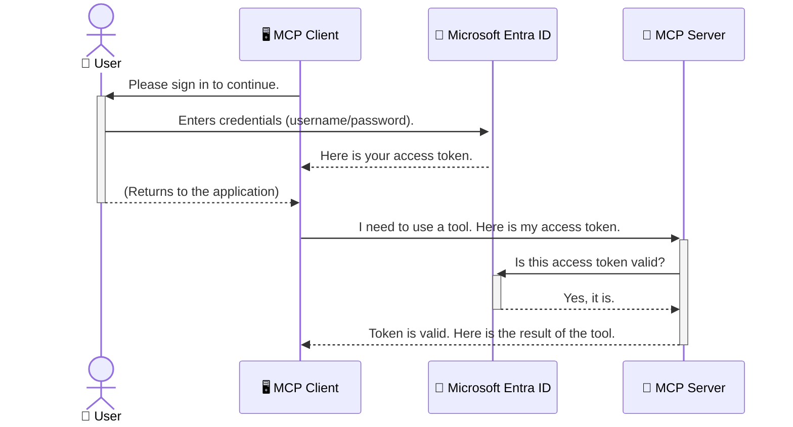

<!--
CO_OP_TRANSLATOR_METADATA:
{
  "original_hash": "0abf26a6c4dbe905d5d49ccdc0ccfe92",
  "translation_date": "2025-06-26T16:43:55+00:00",
  "source_file": "05-AdvancedTopics/mcp-security-entra/README.md",
  "language_code": "my"
}
-->
# AI လုပ်ငန်းစဉ်များကို လုံခြုံစေခြင်း: Model Context Protocol ဆာဗာများအတွက် Entra ID အတည်ပြုခြင်း

## နိဒါန်း  
Model Context Protocol (MCP) ဆာဗာကို လုံခြုံစေရန် သင်၏အိမ်တံခါးကို ပိတ်ထားသလို အရေးကြီးသည်။ MCP ဆာဗာကို ဖွင့်ထားခြင်းသည် မသင့်လျော်သော အသုံးပြုခွင့်များဖြင့် သင်၏ကိရိယာများနှင့် ဒေတာများအား ဝင်ရောက်နိုင်ခြင်းဖြစ်ပြီး လုံခြုံရေး ချိုးဖောက်မှုများ ဖြစ်ပေါ်နိုင်သည်။ Microsoft Entra ID သည် မိမိ MCP ဆာဗာနှင့်သာ အတည်ပြုထားသော အသုံးပြုသူများနှင့် အပလီကေးရှင်းများသာ ဆက်သွယ်နိုင်စေရန် ကောင်းမွန်ပြီး တည်ငြိမ်သော cloud-based အိုင်ဒင်တီတီနှင့် ဝင်ရောက်ခွင့် စီမံခန့်ခွဲမှု ဖြေရှင်းချက်ဖြစ်သည်။ ဤအပိုင်းတွင် သင်သည် Entra ID အတည်ပြုခြင်းဖြင့် သင့် AI လုပ်ငန်းစဉ်များကို မည်သို့ကာကွယ်ရမည်ကို လေ့လာမည်ဖြစ်သည်။

## သင်ယူရမည့် ရည်မှန်းချက်များ  
ဤအပိုင်းပြီးဆုံးသည့်အခါ သင်သည် -

- MCP ဆာဗာများကို လုံခြုံစေရန် အရေးပါမှုကို နားလည်နိုင်မည်။
- Microsoft Entra ID နှင့် OAuth 2.0 အတည်ပြုခြင်း၏ အခြေခံကို ရှင်းပြနိုင်မည်။
- Public client နှင့် confidential client များ၏ ကွာခြားချက်ကို သိရှိနိုင်မည်။
- Entra ID အတည်ပြုခြင်းကို ဒေသတွင်း (public client) နှင့် ဝေးလံသော (confidential client) MCP ဆာဗာ စနစ်များတွင် အကောင်အထည်ဖော်နိုင်မည်။
- AI လုပ်ငန်းစဉ်များ ဖန်တီးရာတွင် လုံခြုံရေး အကောင်းဆုံး လုပ်ထုံးလုပ်နည်းများကို အသုံးချနိုင်မည်။

## လုံခြုံရေးနှင့် MCP  
သင်၏အိမ်တံခါးကို မပိတ်ထားသည့်အတိုင်း MCP ဆာဗာကိုလည်း မည်သူမဆို ဝင်ရောက်နိုင်ရန် ဖွင့်ထားသင့်မည်မဟုတ်ပါ။ သင့် AI လုပ်ငန်းစဉ်များကို လုံခြုံစေခြင်းသည် အားမာန်ရှိပြီး ယုံကြည်စိတ်ချရသော၊ လုံခြုံသော အပလီကေးရှင်းများ ဖန်တီးရန် မရှိမဖြစ်လိုအပ်သည်။ ဤအခန်းတွင် Microsoft Entra ID ကို အသုံးပြု၍ MCP ဆာဗာများကို လုံခြုံစေခြင်းအကြောင်း မိတ်ဆက်ပေးမည်ဖြစ်ပြီး၊ အတည်ပြုထားသော အသုံးပြုသူများနှင့် အပလီကေးရှင်းများသာ သင့်ကိရိယာများနှင့် ဒေတာများနှင့် ဆက်သွယ်နိုင်စေရန် သေချာစေမည်ဖြစ်သည်။

## MCP ဆာဗာများအတွက် လုံခြုံရေးအရေးကြီးသောအကြောင်းရင်း  
သင်၏ MCP ဆာဗာတွင် အီးမေးလ်ပို့ခြင်း သို့မဟုတ် ဖောက်သည် ဒေတာဘေ့စ်ကို ဝင်ရောက်ကြည့်ရှုနိုင်သော ကိရိယာတစ်ခု ရှိသည်ဟု စဉ်းစားပါ။ လုံခြုံမှုမရှိသော ဆာဗာဆိုသည်မှာ မည်သူမဆို အဆိုပါကိရိယာကို အသုံးပြုနိုင်ခြင်း ဖြစ်ပြီး ဒေတာ မသင့်လျော်သော ဝင်ရောက်မှု၊ စပမ်ပို့ခြင်း သို့မဟုတ် မကောင်းမွန်သော လှုပ်ရှားမှုများ ဖြစ်ပေါ်နိုင်သည်။

အတည်ပြုခြင်းကို အကောင်အထည်ဖော်ခြင်းဖြင့် သင့်ဆာဗာသို့ လာရောက်သော တောင်းဆိုမှုတိုင်းကို စစ်ဆေးနိုင်ပြီး တောင်းဆိုသူ၏ အိုင်ဒင်တီတီကို အတည်ပြုနိုင်မည်ဖြစ်သည်။ ၎င်းသည် သင့် AI လုပ်ငန်းစဉ်များကို လုံခြုံစေရန် အရေးကြီးဆုံး အဆင့်ဖြစ်သည်။

## Microsoft Entra ID အကြောင်း အကျဉ်းချုပ်  
[**Microsoft Entra ID**](https://adoption.microsoft.com/microsoft-security/entra/) သည် cloud-based အိုင်ဒင်တီတီနှင့် ဝင်ရောက်ခွင့် စီမံခန့်ခွဲမှု ဝန်ဆောင်မှုဖြစ်သည်။ သင့်အပလီကေးရှင်းများအတွက် ယေဘုယျ လုံခြုံရေး အရာရှိတစ်ဦးလို ဖြစ်သည်။ အသုံးပြုသူ အိုင်ဒင်တီတီများကို အတည်ပြုခြင်း (authentication) နှင့် သူတို့အား ဘာလုပ်ခွင့်ရှိမည်ကို သတ်မှတ်ခြင်း (authorization) အစီအစဉ်ရှုပ်ထွေးမှုများကို စီမံပေးသည်။

Entra ID ကို အသုံးပြုခြင်းဖြင့် -

- အသုံးပြုသူများအတွက် လုံခြုံစိတ်ချရသော လက်မှတ်ထိုးဝင်ရောက်မှုကို ခွင့်ပြုနိုင်သည်။
- API များနှင့် ဝန်ဆောင်မှုများကို ကာကွယ်နိုင်သည်။
- ဝင်ရောက်ခွင့် မူဝါဒများကို ဗဟိုမှ စီမံနိုင်သည်။

MCP ဆာဗာများအတွက် Entra ID သည် ဆာဗာ၏ လုပ်ဆောင်ချက်များကို မည်သူဝင်ရောက်နိုင်မည်ကို စီမံခန့်ခွဲရန် တည်ငြိမ်ပြီး ယုံကြည်စိတ်ချရသော ဖြေရှင်းချက်တစ်ခု ဖြစ်သည်။

---

## Entra ID အတည်ပြုခြင်း အလုပ်လုပ်ပုံ နားလည်ခြင်း  
Entra ID သည် **OAuth 2.0** ကဲ့သို့သော open standard များကို အသုံးပြု၍ အတည်ပြုခြင်းကို စီမံသည်။ အသေးစိတ်များမှာ ရှုပ်ထွေးနိုင်သော်လည်း အဓိကအကြောင်းအရာကို ရိုးရှင်းပြီး သဘောတူနိုင်သော ဥပမာတစ်ခုဖြင့် နားလည်နိုင်သည်။

### OAuth 2.0 ကို ရိုးရှင်းစွာ နားလည်ခြင်း: Valet Key ဥပမာ  
OAuth 2.0 ကို သင့်ကားအတွက် valet ဝန်ဆောင်မှုတစ်ခုလို ထင်မြင်ပါ။ မိမိစားသောက်ဆိုင်သို့ ရောက်ရှိသောအခါ master key ကို valet ထံ မပေးပစ်ပါ။ အစား **valet key** တစ်ခုကိုပေးပြီး ၎င်းသည် ကားစတင်ခြင်းနှင့် တံခါးပိတ်ခြင်းကိုသာ ခွင့်ပြုသည်။ ကား၏ အထဲပိုင်းသို့ ဝင်ရောက်ခြင်း (ထူးခြားသည့် အပိုင်းများ) မပြုနိုင်ပါ။

ဤဥပမာတွင် -

- **သင်သည်** **အသုံးပြုသူ** ဖြစ်သည်။
- **သင့်ကားသည်** သင့် **MCP ဆာဗာ** ဖြစ်ပြီး အဖိုးတန် ကိရိယာများနှင့် ဒေတာများပါရှိသည်။
- **Valet သည်** **Microsoft Entra ID** ဖြစ်သည်။
- **ကားရပ်နားသူ** သည် **MCP Client** (ဆာဗာသို့ ဝင်ရောက်ရန် ကြိုးစားသော အပလီကေးရှင်း) ဖြစ်သည်။
- **Valet Key သည်** **Access Token** ဖြစ်သည်။

Access token သည် MCP client သည် သင် ဝင်ရောက်လက်မှတ်ထိုးပြီးနောက် Entra ID မှ လက်ခံရရှိသော လုံခြုံသော စာသားတစ်ကြောင်းဖြစ်သည်။ client သည် တောင်းဆိုမှုတိုင်းတွင် ဤ token ကို MCP ဆာဗာထံ ပေးပို့သည်။ ဆာဗာသည် token ကို စစ်ဆေးပြီး တောင်းဆိုမှုသည် တရားဝင်ဖြစ်ကြောင်းနှင့် client သည် လိုအပ်သော ခွင့်ပြုချက်များ ရှိကြောင်း အတည်ပြုနိုင်သည်။ ၎င်းသည် သင့် စကားဝှက်ကဲ့သို့သော အချက်အလက်များကို မင်္ဂလာပြုရန် မလိုအပ်ပဲ ဖြစ်သည်။

### အတည်ပြုခြင်း လည်ပတ်ပုံ  
လုပ်ဆောင်မှုများမှာ -



### Microsoft Authentication Library (MSAL) ကို မိတ်ဆက်ခြင်း  
ကုဒ်ကို စတင်မဖတ်ရှုမီ သင်တွေ့မည့် အရေးကြီးသော အစိတ်အပိုင်းတစ်ခုမှာ **Microsoft Authentication Library (MSAL)** ဖြစ်သည်။

MSAL သည် Microsoft က ဖန်တီးထားသော စာကြည့်တိုက်ဖြစ်ပြီး အတည်ပြုခြင်းကို လွယ်ကူစွာ ကိုင်တွယ်နိုင်စေသည်။ သင်သည် လုံခြုံရေး token များကို ကိုင်တွယ်ရန်၊ လက်မှတ်ထိုးမှုများကို စီမံရန်၊ အချိန်ကာလများကို ပြန်လည်ပြောင်းလဲရန် ရေးသားရမည့် ရှုပ်ထွေးသော ကုဒ်များကို MSAL သည် ကိုင်တွယ်ပေးသည်။

MSAL ကို အသုံးပြုရန် အကြံပြုသည့် အကြောင်းရင်းများမှာ -

- **လုံခြုံမှုရှိသည်** - စက်မှုလုပ်ငန်းစံနှုန်းများနှင့် လုံခြုံရေးအကောင်းဆုံး လုပ်ထုံးလုပ်နည်းများကို အကောင်အထည်ဖော်ပြီး သင့်ကုဒ်တွင် အန္တရာယ်များ လျော့နည်းစေသည်။
- **ဖန်တီးမှု လွယ်ကူစေသည်** - OAuth 2.0 နှင့် OpenID Connect ပရိုတိုကောများ၏ ရှုပ်ထွေးမှုများကို ဖယ်ရှားပေးကာ သင့်အပလီကေးရှင်းတွင် လုံခြုံမှု ပြည့်စုံသော အတည်ပြုခြင်းကို နည်းနည်းသောကုဒ်ဖြင့် ထည့်သွင်းနိုင်စေသည်။
- **ထိန်းသိမ်းထုတ်လုပ်မှုရှိသည်** - Microsoft မှ လုံခြုံရေး အန္တရာယ်အသစ်များနှင့် ပလက်ဖောင်းပြောင်းလဲမှုများကို ဖြေရှင်းရန် MSAL ကို အဆက်မပြတ် ထိန်းသိမ်းနေသည်။

MSAL သည် .NET, JavaScript/TypeScript, Python, Java, Go နှင့် iOS၊ Android ကဲ့သို့သော မိုဘိုင်းပလက်ဖောင်းများအပါအဝင် ဘာသာစကားများနှင့် အပလီကေးရှင်းဖွံ့ဖြိုးရေး ပလက်ဖောင်းများစွာကို ထောက်ပံ့သည်။ ထို့ကြောင့် သင့်နည်းပညာ စနစ်တစ်ခုလုံးတွင် တူညီသော အတည်ပြုခြင်း ပုံစံများကို အသုံးပြုနိုင်သည်။

MSAL အကြောင်း ပိုမိုသိရှိလိုပါက [MSAL အနှစ်ချုပ်စာရွက်စာတမ်း](https://learn.microsoft.com/entra/identity-platform/msal-overview) ကို ကြည့်ရှုနိုင်ပါသည်။

---

## Entra ID ဖြင့် သင့် MCP ဆာဗာကို လုံခြုံစေခြင်း: လုပ်ဆောင်ရန် အဆင့်ဆင့်လမ်းညွှန်  
ယခုတွင် ဒေသတွင်း MCP ဆာဗာတစ်ခုကို (stdio`) using Entra ID. This example uses a **public client**, which is suitable for applications running on a user's machine, like a desktop app or a local development server.

### Scenario 1: Securing a Local MCP Server (with a Public Client)

In this scenario, we'll look at an MCP server that runs locally, communicates over `stdio`, and uses Entra ID to authenticate the user before allowing access to its tools. The server will have a single tool that fetches the user's profile information from the Microsoft Graph API.

#### 1. Setting Up the Application in Entra ID

Before writing any code, you need to register your application in Microsoft Entra ID. This tells Entra ID about your application and grants it permission to use the authentication service.

1. Navigate to the **[Microsoft Entra portal](https://entra.microsoft.com/)**.
2. Go to **App registrations** and click **New registration**.
3. Give your application a name (e.g., "My Local MCP Server").
4. For **Supported account types**, select **Accounts in this organizational directory only**.
5. You can leave the **Redirect URI** blank for this example.
6. Click **Register**.

Once registered, take note of the **Application (client) ID** and **Directory (tenant) ID**. You'll need these in your code.

#### 2. The Code: A Breakdown

Let's look at the key parts of the code that handle authentication. The full code for this example is available in the [Entra ID - Local - WAM](https://github.com/Azure-Samples/mcp-auth-servers/tree/main/src/entra-id-local-wam) folder of the [mcp-auth-servers GitHub repository](https://github.com/Azure-Samples/mcp-auth-servers).

**`AuthenticationService.cs`**

This class is responsible for handling the interaction with Entra ID.

- **`CreateAsync`**: This method initializes the `PublicClientApplication` from the MSAL (Microsoft Authentication Library). It's configured with your application's `clientId` and `tenantId`.
- **`WithBroker`**: This enables the use of a broker (like the Windows Web Account Manager), which provides a more secure and seamless single sign-on experience.
- **`AcquireTokenAsync) ဖြင့် ဆက်သွယ်သည့် နည်းလမ်းဖြင့် လုံခြုံစေရန် လမ်းညွှန်ချက်ကို လိုက်လံကြည့်ရှုပါ။ ၎င်းသည် အဓိကနည်းလမ်းဖြစ်ပြီး ပထမဦးဆုံး token ကို အတိတ်ကာလတစ်ခုအတွင်း မလိုအပ်ပါက အသုံးပြုသူကို လက်မှတ်ထိုးရန် မေးမြန်းသည်။

```csharp
// Simplified for clarity
public static async Task<AuthenticationService> CreateAsync(ILogger<AuthenticationService> logger)
{
    var msalClient = PublicClientApplicationBuilder
        .Create(_clientId) // Your Application (client) ID
        .WithAuthority(AadAuthorityAudience.AzureAdMyOrg)
        .WithTenantId(_tenantId) // Your Directory (tenant) ID
        .WithBroker(new BrokerOptions(BrokerOptions.OperatingSystems.Windows))
        .Build();

    // ... cache registration ...

    return new AuthenticationService(logger, msalClient);
}

public async Task<string> AcquireTokenAsync()
{
    try
    {
        // Try silent authentication first
        var accounts = await _msalClient.GetAccountsAsync();
        var account = accounts.FirstOrDefault();

        AuthenticationResult? result = null;

        if (account != null)
        {
            result = await _msalClient.AcquireTokenSilent(_scopes, account).ExecuteAsync();
        }
        else
        {
            // If no account, or silent fails, go interactive
            result = await _msalClient.AcquireTokenInteractive(_scopes).ExecuteAsync();
        }

        return result.AccessToken;
    }
    catch (Exception ex)
    {
        _logger.LogError(ex, "An error occurred while acquiring the token.");
        throw; // Optionally rethrow the exception for higher-level handling
    }
}
```

**`Program.cs`**

This is where the MCP server is set up and the authentication service is integrated.

- **`AddSingleton<AuthenticationService>`**: This registers the `AuthenticationService` with the dependency injection container, so it can be used by other parts of the application (like our tool).
- **`GetUserDetailsFromGraph` tool**: This tool requires an instance of `AuthenticationService`. Before it does anything, it calls `authService.AcquireTokenAsync()` ကို အသုံးပြု၍ မှန်ကန်သော access token ရယူသည်။ အတည်ပြုခြင်း အောင်မြင်ပါက token ဖြင့် Microsoft Graph API ကို ခေါ်ယူကာ အသုံးပြုသူ အသေးစိတ်ကို ရယူသည်။**

```csharp
// Simplified for clarity
[McpServerTool(Name = "GetUserDetailsFromGraph")]
public static async Task<string> GetUserDetailsFromGraph(
    AuthenticationService authService)
{
    try
    {
        // This will trigger the authentication flow
        var accessToken = await authService.AcquireTokenAsync();

        // Use the token to create a GraphServiceClient
        var graphClient = new GraphServiceClient(
            new BaseBearerTokenAuthenticationProvider(new TokenProvider(authService)));

        var user = await graphClient.Me.GetAsync();

        return System.Text.Json.JsonSerializer.Serialize(user);
    }
    catch (Exception ex)
    {
        return $"Error: {ex.Message}";
    }
}
```

#### ၃။ အားလုံး ဘယ်လိုပေါင်းစည်း လုပ်ဆောင်သလဲ  

၁။ MCP client သည် `GetUserDetailsFromGraph` tool, the tool first calls `AcquireTokenAsync`.
2. `AcquireTokenAsync` triggers the MSAL library to check for a valid token.
3. If no token is found, MSAL, through the broker, will prompt the user to sign in with their Entra ID account.
4. Once the user signs in, Entra ID issues an access token.
5. The tool receives the token and uses it to make a secure call to the Microsoft Graph API.
6. The user's details are returned to the MCP client.

This process ensures that only authenticated users can use the tool, effectively securing your local MCP server.

### Scenario 2: Securing a Remote MCP Server (with a Confidential Client)

When your MCP server is running on a remote machine (like a cloud server) and communicates over a protocol like HTTP Streaming, the security requirements are different. In this case, you should use a **confidential client** and the **Authorization Code Flow**. This is a more secure method because the application's secrets are never exposed to the browser.

This example uses a TypeScript-based MCP server that uses Express.js to handle HTTP requests.

#### 1. Setting Up the Application in Entra ID

The setup in Entra ID is similar to the public client, but with one key difference: you need to create a **client secret**.

1. Navigate to the **[Microsoft Entra portal](https://entra.microsoft.com/)**.
2. In your app registration, go to the **Certificates & secrets** tab.
3. Click **New client secret**, give it a description, and click **Add**.
4. **Important:** Copy the secret value immediately. You will not be able to see it again.
5. You also need to configure a **Redirect URI**. Go to the **Authentication** tab, click **Add a platform**, select **Web**, and enter the redirect URI for your application (e.g., `http://localhost:3001/auth/callback`).

> **⚠️ Important Security Note:** For production applications, Microsoft strongly recommends using **secretless authentication** methods such as **Managed Identity** or **Workload Identity Federation** instead of client secrets. Client secrets pose security risks as they can be exposed or compromised. Managed identities provide a more secure approach by eliminating the need to store credentials in your code or configuration.
>
> For more information about managed identities and how to implement them, see the [Managed identities for Azure resources overview](https://learn.microsoft.com/entra/identity/managed-identities-azure-resources/overview).

#### 2. The Code: A Breakdown

This example uses a session-based approach. When the user authenticates, the server stores the access token and refresh token in a session and gives the user a session token. This session token is then used for subsequent requests. The full code for this example is available in the [Entra ID - Confidential client](https://github.com/Azure-Samples/mcp-auth-servers/tree/main/src/entra-id-cca-session) folder of the [mcp-auth-servers GitHub repository](https://github.com/Azure-Samples/mcp-auth-servers).

**`Server.ts`**

This file sets up the Express server and the MCP transport layer.

- **`requireBearerAuth`**: This is middleware that protects the `/sse` and `/message` endpoints. It checks for a valid bearer token in the `Authorization` header of the request.
- **`EntraIdServerAuthProvider`**: This is a custom class that implements the `McpServerAuthorizationProvider` interface. It's responsible for handling the OAuth 2.0 flow.
- **`/auth/callback` ကို အသုံးပြုရန် ကြိုးစားသည်။ ဤ endpoint သည် အသုံးပြုသူ အတည်ပြုပြီးနောက် Entra ID မှ redirect ပြန်လာသော အချက်အလက်ကို ကိုင်တွယ်သည်။ authorization code ကို access token နှင့် refresh token သို့ ပြောင်းလဲပေးသည်။

```typescript
// Simplified for clarity
const app = express();
const { server } = createServer();
const provider = new EntraIdServerAuthProvider();

// Protect the SSE endpoint
app.get("/sse", requireBearerAuth({
  provider,
  requiredScopes: ["User.Read"]
}), async (req, res) => {
  // ... connect to the transport ...
});

// Protect the message endpoint
app.post("/message", requireBearerAuth({
  provider,
  requiredScopes: ["User.Read"]
}), async (req, res) => {
  // ... handle the message ...
});

// Handle the OAuth 2.0 callback
app.get("/auth/callback", (req, res) => {
  provider.handleCallback(req.query.code, req.query.state)
    .then(result => {
      // ... handle success or failure ...
    });
});
```

**`Tools.ts`**

This file defines the tools that the MCP server provides. The `getUserDetails` ကိရိယာသည် ယခင်ဥပမာကဲ့သို့ပင်ဖြစ်သော်လည်း session မှ access token ကို ရယူသည်။**

```typescript
// Simplified for clarity
server.setRequestHandler(CallToolRequestSchema, async (request) => {
  const { name } = request.params;
  const context = request.params?.context as { token?: string } | undefined;
  const sessionToken = context?.token;

  if (name === ToolName.GET_USER_DETAILS) {
    if (!sessionToken) {
      throw new AuthenticationError("Authentication token is missing or invalid. Ensure the token is provided in the request context.");
    }

    // Get the Entra ID token from the session store
    const tokenData = tokenStore.getToken(sessionToken);
    const entraIdToken = tokenData.accessToken;

    const graphClient = Client.init({
      authProvider: (done) => {
        done(null, entraIdToken);
      }
    });

    const user = await graphClient.api('/me').get();

    // ... return user details ...
  }
});
```

**`auth/EntraIdServerAuthProvider.ts`**

This class handles the logic for:

- Redirecting the user to the Entra ID sign-in page.
- Exchanging the authorization code for an access token.
- Storing the tokens in the `tokenStore`.
- Refreshing the access token when it expires.

#### 3. How It All Works Together

1. When a user first tries to connect to the MCP server, the `requireBearerAuth` middleware will see that they don't have a valid session and will redirect them to the Entra ID sign-in page.
2. The user signs in with their Entra ID account.
3. Entra ID redirects the user back to the `/auth/callback` endpoint with an authorization code.
4. The server exchanges the code for an access token and a refresh token, stores them, and creates a session token which is sent to the client.
5. The client can now use this session token in the `Authorization` header for all future requests to the MCP server.
6. When the `getUserDetails` ကိရိယာကို ခေါ်သည့်အခါ session token ကို အသုံးပြုပြီး Entra ID access token ကို ရှာဖွေကာ Microsoft Graph API ကို ခေါ်သုံးသည်။**

ဤစနစ်သည် public client flow ထက် ရှုပ်ထွေးသော်လည်း အင်တာနက်မှ ဝင်ရောက်နိုင်သော endpoint များအတွက် လုံခြုံရေးကာကွယ်မှုအားကောင်းရန် လိုအပ်သည်။ ဝေးလံသော MCP ဆာဗာများသည် အများပြည်သူ အင်တာနက်မှ ဝင်ရောက်နိုင်သောကြောင့် မသင့်လျော်သော ဝင်ရောက်မှုများနှင့် တိုက်ခိုက်မှုများမှ ကာကွယ်ရန် လုံခြုံရေး အားကောင်းသော နည်းလမ်းများ လိုအပ်သည်။

## လုံခြုံရေး အကောင်းဆုံး လုပ်ထုံးလုပ်နည်းများ  

- **HTTPS ကို အမြဲအသုံးပြုပါ**: Client နှင့် ဆာဗာအကြား ဆက်သွယ်မှုကို စာရင်းလုံခြုံစေပြီး token များ ခိုးယူခံရခြင်းမှ ကာကွယ်သည်။
- **Role-Based Access Control (RBAC) ကို အကောင်အထည်ဖော်ပါ**: အသုံးပြုသူသည် အတည်ပြုထားခြင်းသာ မဟုတ်ဘဲ ဘာလုပ်ခွင့်ရှိသည်ကိုလည်း စစ်ဆေးပါ။ Entra ID တွင် role များ သတ်မှတ်၍ MCP ဆာဗာတွင် စစ်ဆေးနိုင်သည်။
- **စောင့်ကြည့်မှုနှင့် စစ်ဆေးမှုများ**: အတည်ပြုမှုဖြစ်ရပ်များအားလုံးကို မှတ်တမ်းတင်ထား၍ မမှန်ကန်သည့် လှုပ်ရှားမှုများကို ရှာဖွေတုံ့ပြန်နိုင်စေပါ။
- **နှုန်းနှင့် အတားအဆီး စီမံခန့်ခွဲမှု**: Microsoft Graph နှင့် အခြား API များတွင် နှုန်းကန့်သတ်မှုများရှိသည်။ MCP ဆာဗာတွင် exponential backoff နှင့် retry logic ကို ထည့်သွင်းကာ HTTP 429 (Too Many Requests) တုံ့ပြန်မှုများကို သက်သာစွာ ကိုင်တွယ်ပါ။ API ခေါ်ဆိုမှုများကို လျော့ချပေးရန် မကြာခဏ အသုံးပြုသော ဒေတာများကို cache ပြုလုပ်ရန် စဉ်းစားပါ။
- **Token များကို လုံခြုံစွာ သိမ်းဆည်းပါ**: Access token နှင့် refresh token များကို လုံခြုံစွာ သိမ်းဆည်းပါ။ ဒေသတွင်း အပလီကေးရှင်းများအတွက် စနစ်၏ လုံခြုံသော သိမ်းဆည်းမှု နည်းလမ်းများကို အသုံးပြုပါ။ ဆာဗာအပလီကေးရှင်းများအတွက် encrypted storage သို့မဟုတ် Azure Key Vault ကဲ့သို့သော လုံခြုံသော key management ဝန်ဆောင်

**သတိပေးချက်**  
ဤစာတမ်းကို AI ဘာသာပြန်ဆာဗစ်ဖြစ်သော [Co-op Translator](https://github.com/Azure/co-op-translator) ဖြင့် ဘာသာပြန်ထားပါသည်။ ကျွန်ုပ်တို့သည် တိကျမှုအတွက် ကြိုးစားပေမယ့် အလိုအလျောက်ဘာသာပြန်မှုများတွင် အမှားများ သို့မဟုတ် မမှန်ကန်မှုများ ပါဝင်နိုင်ကြောင်း သတိပြုပါရန်။ မူရင်းစာတမ်းကို မူလဘာသာဖြင့်သာ တရားဝင်အချက်အလက်အရင်းအမြစ်အဖြစ် ယူဆသင့်ပါသည်။ အရေးကြီးသောအချက်အလက်များအတွက် လူ့ဘာသာပြန်ပညာရှင်မှ ဘာသာပြန်ခြင်းကို အကြံပြုပါသည်။ ဤဘာသာပြန်မှုအသုံးပြုမှုကြောင့် ဖြစ်ပေါ်နိုင်သည့် နားလည်မှုမှားယွင်းမှုများ သို့မဟုတ် အဓိပ္ပာယ်လွဲမှားမှုများအတွက် ကျွန်ုပ်တို့သည် တာဝန်မယူပါ။