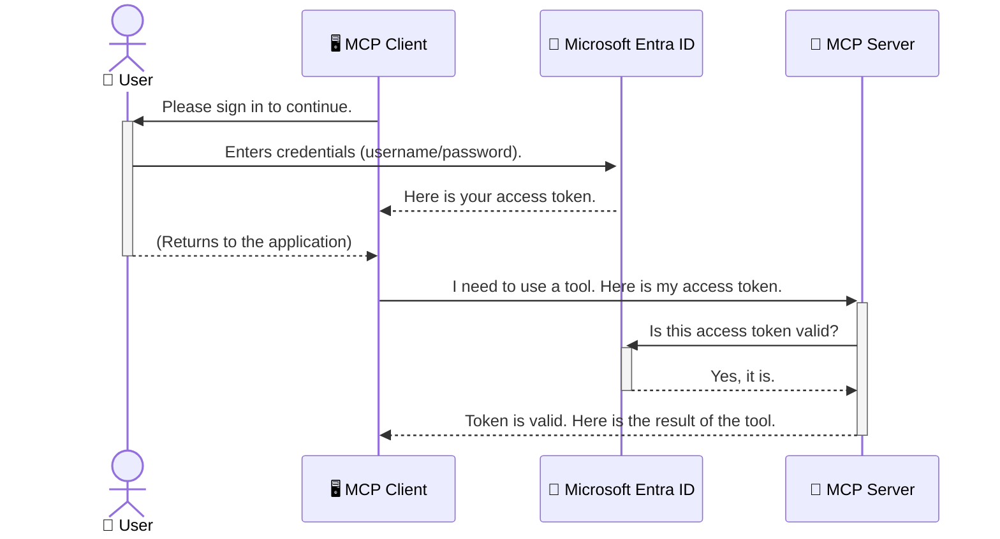

<!--
CO_OP_TRANSLATOR_METADATA:
{
  "original_hash": "6e562d7e5a77c8982da4aa8f762ad1d8",
  "translation_date": "2025-07-02T10:05:14+00:00",
  "source_file": "05-AdvancedTopics/mcp-security-entra/README.md",
  "language_code": "my"
}
-->
# AI လုပ်ငန်းစဉ်များကို လုံခြုံစေခြင်း: Model Context Protocol ဆာဗာများအတွက် Entra ID အတည်ပြုမှု

## နိဒါန်း  
Model Context Protocol (MCP) ဆာဗာကို လုံခြုံစွာ ထိန်းသိမ်းခြင်းသည် သင့်အိမ်၏ ရှေ့တံခါးကို လုံခြုံစွာ ချုပ်ဆွဲထားသည့်အတိုင်း အရေးကြီးပါသည်။ MCP ဆာဗာကို ဖွင့်ထားခြင်းသည် သင့်ကိရိယာများနှင့် ဒေတာများကို ခွင့်မပြုထားသောသူများ၏ ဝင်ရောက်မှုအတွက် ဖွင့်လှစ်ထားသည့်အခြေအနေဖြစ်ပြီး လုံခြုံရေးပြဿနာများ ဖြစ်ပေါ်စေနိုင်ပါသည်။ Microsoft Entra ID သည် မိုဃ်းတိမ်အခြေပြု အထောက်အထားနှင့် ဝင်ရောက်ခွင့် စီမံခန့်ခွဲမှု ဖြေရှင်းချက်အား ပံ့ပိုးပေးကာ ခွင့်ပြုထားသော အသုံးပြုသူများနှင့် အပလီကေးရှင်းများသာ MCP ဆာဗာနှင့် ဆက်သွယ်နိုင်စေရန် ကူညီပေးပါသည်။ ဤအပိုင်းတွင် Entra ID အတည်ပြုမှုကို အသုံးပြုပြီး သင့် AI လုပ်ငန်းစဉ်များကို ဘယ်လို ကာကွယ်ရမည်ကို သင်ယူသွားမည် ဖြစ်သည်။

## သင်ယူရမည့် ရည်မှန်းချက်များ  
ဤအပိုင်းကို အဆုံးသတ်သောအခါတွင် သင်သည် -

- MCP ဆာဗာများကို လုံခြုံစေရန် အရေးကြီးမှုကို နားလည်နိုင်မည်။
- Microsoft Entra ID နှင့် OAuth 2.0 အတည်ပြုမှု အခြေခံများကို ရှင်းပြနိုင်မည်။
- ပြည်သူ့ client နှင့် လျှို့ဝှက် client တို့၏ ကွာခြားချက်ကို သိရှိနိုင်မည်။
- နေရာတွင် (public client) နှင့် ဝေးလံရာတွင် (confidential client) MCP ဆာဗာအခြေအနေများတွင် Entra ID အတည်ပြုမှုကို အကောင်အထည်ဖော်နိုင်မည်။
- AI လုပ်ငန်းစဉ်များ ဖန်တီးရာတွင် လုံခြုံရေး အကောင်းဆုံး လုပ်ထုံးလုပ်နည်းများကို အသုံးပြုနိုင်မည်။

## လုံခြုံရေးနှင့် MCP

သင့်အိမ်၏ ရှေ့တံခါးကို မဖွင့်ထားသလို MCP ဆာဗာကိုလည်း မည်သူမဆို ဝင်ရောက်နိုင်အောင် မဖွင့်ထားသင့်ပါ။ AI လုပ်ငန်းစဉ်များကို လုံခြုံစေခြင်းသည် ခိုင်မာ၊ ယုံကြည်စိတ်ချရပြီး ဘေးကင်းလုံခြုံသော အပလီကေးရှင်းများ ဖန်တီးရာတွင် အရေးကြီးပါသည်။ ဤအခန်းတွင် Microsoft Entra ID ကို အသုံးပြုပြီး MCP ဆာဗာများကို လုံခြုံစေမည့် နည်းလမ်းများကို မိတ်ဆက်ပေးသွားမည်ဖြစ်ပြီး ခွင့်ပြုထားသော အသုံးပြုသူများနှင့် အပလီကေးရှင်းများသာ သင့်ကိရိယာများနှင့် ဒေတာများနှင့် ဆက်သွယ်နိုင်စေရန် သေချာစေပါမည်။

## MCP ဆာဗာများအတွက် လုံခြုံရေး အရေးကြီးခြင်း

သင့် MCP ဆာဗာတွင် အီးမေးလ်ပို့ခြင်း သို့မဟုတ် ဖောက်သည် ဒေတာဘေ့စ်ကို ဝင်ရောက်ကြည့်ရှုနိုင်သည့် ကိရိယာတစ်ခုရှိကြောင်း စဉ်းစားပါ။ လုံခြုံမှုမရှိသော ဆာဗာမှာ မည်သူမဆို ထိုကိရိယာကို အသုံးပြုနိုင်ပြီး ခွင့်မပြုထားသော ဒေတာ ဝင်ရောက်မှု၊ စပမ်ပို့ခြင်း သို့မဟုတ် အန္တရာယ်ရှိသော လှုပ်ရှားမှုများ ဖြစ်ပေါ်စေနိုင်ပါသည်။

အတည်ပြုမှုကို အကောင်အထည်ဖော်ခြင်းအားဖြင့် သင့်ဆာဗာသို့ လာသော တောင်းဆိုမှုတိုင်းကို စစ်ဆေးပြီး တောင်းဆိုသူ၏ ကိုယ်ပိုင်အချက်အလက်ကို အတည်ပြုနိုင်သည်။ ၎င်းသည် AI လုပ်ငန်းစဉ်များကို လုံခြုံစေရာတွင် အရေးကြီးဆုံး ပထမဆုံးခြေလှမ်း ဖြစ်သည်။

## Microsoft Entra ID နဲ့ နိဒါန်း

[**Microsoft Entra ID**](https://adoption.microsoft.com/microsoft-security/entra/) သည် မိုဃ်းတိမ်အခြေပြု အသုံးပြုသူ အတည်ပြုခြင်းနှင့် ဝင်ရောက်ခွင့် စီမံခန့်ခွဲမှု ဝန်ဆောင်မှုတစ်ခု ဖြစ်သည်။ ၎င်းကို သင့်အပလီကေးရှင်းများအတွက် စံပြ လုံခြုံရေးမောင့်တစ်ယောက်ဟု တွေးနိုင်ပါသည်။ အသုံးပြုသူများ၏ ကိုယ်ပိုင်အချက်အလက်များကို စစ်ဆေးခြင်း (authentication) နှင့် ၎င်းတို့အလုပ်လုပ်ခွင့်ရှိမှု (authorization) ကို စီမံခန့်ခွဲပေးသည်။

Entra ID ကို အသုံးပြုခြင်းဖြင့် -

- အသုံးပြုသူများအတွက် လုံခြုံစိတ်ချရသော လက်မှတ်ထိုးဝင်ရောက်မှုများ ဖွင့်နိုင်သည်။
- API များနှင့် ဝန်ဆောင်မှုများကို ကာကွယ်နိုင်သည်။
- ဝင်ရောက်ခွင့်မူဝါဒများကို ဗဟိုစီမံခန့်ခွဲမှုမှ စီမံနိုင်သည်။

MCP ဆာဗာများအတွက် Entra ID သည် သင့်ဆာဗာ၏ လုပ်ဆောင်ချက်များကို မည်သူဝင်ရောက်နိုင်မည်ကို စီမံခန့်ခွဲရန် ခိုင်မာပြီး ယုံကြည်စိတ်ချရသော ဖြေရှင်းချက်တစ်ခု ဖြစ်သည်။

---

## အံ့မခန်းနားလည်မှု: Entra ID အတည်ပြုမှု ဘယ်လို အလုပ်လုပ်သလဲ

Entra ID သည် **OAuth 2.0** ကဲ့သို့သော ဖွင့်လှစ်စံချိန်များကို အသုံးပြုပြီး အတည်ပြုမှုကို စီမံသည်။ အသေးစိတ်များမှာ ရှုပ်ထွေးနိုင်သော်လည်း အဓိကအယူအဆကို နားလည်ရန် အလွယ်ကူသည်။

### OAuth 2.0 ကို နူးညံ့စွာ နားလည်ခြင်း: Valet Key အနေနဲ့

OAuth 2.0 ကို သင့်ကားအတွက် valet ဝန်ဆောင်မှုတစ်ခုအဖြစ် စဉ်းစားပါ။ သင့်ဟိုတယ်သို့ ရောက်ရှိသောအခါ master key ကို valet ထံ မပေးပါဘူး။ အစားအစားမှာ ကားကို စတင်ရပ်နားခြင်းနှင့် တံခါးများကို ပိတ်ခြင်းသာ ခွင့်ပြုထားသော **valet key** ကိုပေးပါသည်။ ဒါပေမယ့် ကား၏ ထုပ်ပိုးဆောင်ခန်း သို့မဟုတ် glove compartment ကို ဖွင့်ခွင့် မရှိပါ။

ဤသင်္ကေတအရ -

- **သင်သည်** သည် **အသုံးပြုသူ** ဖြစ်သည်။
- **သင့်ကားသည်** သည် **MCP ဆာဗာ** ဖြစ်ပြီး အရေးကြီး ကိရိယာများနှင့် ဒေတာများပါရှိသည်။
- **Valet** သည် **Microsoft Entra ID** ဖြစ်သည်။
- **ကားရပ်ရာ ဝန်ထမ်း** သည် **MCP Client** (ဆာဗာကို ဝင်ရောက်ကြည့်ရှုသော အပလီကေးရှင်း) ဖြစ်သည်။
- **Valet Key** သည် **Access Token** ဖြစ်သည်။

Access token သည် MCP client သည် သင့်အနေဖြင့် Entra ID မှ လက်မှတ်ထိုးဝင်ပြီးနောက် ရရှိသော လုံခြုံသော စာသားကြိုးတစ်ခုဖြစ်သည်။ Client သည် ၎င်း token ကို MCP ဆာဗာထံ တောင်းဆိုမှုတိုင်းတွင် တင်ပြသည်။ ဆာဗာသည် token ကို စစ်ဆေးကာ တောင်းဆိုမှုသည် တရားဝင်ဖြစ်ကြောင်းနှင့် client သည် လိုအပ်သော ခွင့်ပြုချက်များရှိကြောင်း သေချာစေသည်။ ထိုအခါ သင့်စကားဝှက်ကဲ့သို့သော ကိုယ်ပိုင်အချက်အလက်များကို မလိုအပ်ဘဲ လုပ်ဆောင်နိုင်သည်။

### အတည်ပြုမှု လည်ပတ်မှု စနစ်

လုပ်ငန်းစဉ်ကို လက်တွေ့အတိုင်း -



### Microsoft Authentication Library (MSAL) ကို မိတ်ဆက်ခြင်း

ကုဒ်ကို လေ့လာမတိုင်မီ အရေးကြီးသော အစိတ်အပိုင်းတစ်ခုမှာ **Microsoft Authentication Library (MSAL)** ဖြစ်သည်။

MSAL သည် Microsoft က ဖန်တီးထားသော စာကြည့်တိုက်ဖြစ်ပြီး အသုံးပြုသူ အတည်ပြုမှုကို လွယ်ကူစွာ ကိုင်တွယ်နိုင်ရန် ကူညီပေးသည်။ သင့်အနေနှင့် လုံခြုံရေး token များကို ကိုင်တွယ်ခြင်း၊ လက်မှတ်ထိုးဝင်ခြင်းများကို စီမံခြင်း၊ အစည်းအဝေးများကို ပြန်လည်အသစ်လုပ်ခြင်းတို့ကို စာကြည့်တိုက်က တာဝန်ယူပေးသည်။

MSAL ကို အသုံးပြုရန် အကြံပြုချက်များမှာ -

- **လုံခြုံမှုရှိသည်**: စက်မှုလုပ်ငန်းစံချိန်များနှင့် လုံခြုံရေး အကောင်းဆုံး လုပ်ထုံးလုပ်နည်းများကို အကောင်အထည်ဖော်ထားပြီး သင့်ကုဒ်အတွက် ချို့ယွင်းမှုများ လျော့နည်းစေသည်။
- **ဖွံ့ဖြိုးတိုးတက်မှု လွယ်ကူစေသည်**: OAuth 2.0 နှင့် OpenID Connect စံချိန်များ၏ ရှုပ်ထွေးမှုများကို ဖုံးကွယ်ပေးကာ အတည်ပြုမှုများကို အတော်လေး လွယ်ကူစွာ ထည့်သွင်းနိုင်စေသည်။
- **စောင့်ရှောက်မှု ရှိသည်**: Microsoft က MSAL ကို ဆက်လက်ပြုပြင်ထိန်းသိမ်းကာ လုံခြုံရေး အန္တရာယ်အသစ်များနှင့် ပလက်ဖောင်းပြောင်းလဲမှုများကို ဖြေရှင်းပေးသည်။

MSAL သည် .NET, JavaScript/TypeScript, Python, Java, Go နှင့် iOS၊ Android ကဲ့သို့သော မိုဘိုင်း ပလက်ဖောင်းများအပါအဝင် ဘာသာစကားနှင့် အပလီကေးရှင်း ဖရိမ်ဝတ်များစွာကို ထောက်ပံ့သည်။ သင်၏ နည်းပညာ စနစ်တစ်ခုလုံးတွင် တူညီသော အတည်ပြုမှု ပုံစံများကို အသုံးပြုနိုင်သည်။

MSAL အကြောင်း ပိုမိုသိရှိလိုပါက အတည်ပြုချက် စာတမ်းများကို ကြည့်ရှုနိုင်ပါသည် - [MSAL overview documentation](https://learn.microsoft.com/entra/identity-platform/msal-overview)။

---

## Entra ID ဖြင့် သင့် MCP ဆာဗာကို လုံခြုံစေခြင်း: အဆင့်ဆင့် လမ်းညွှန်

ယခု သင့်အား `stdio`) using Entra ID. This example uses a **public client**, which is suitable for applications running on a user's machine, like a desktop app or a local development server.

### Scenario 1: Securing a Local MCP Server (with a Public Client)

In this scenario, we'll look at an MCP server that runs locally, communicates over `stdio`, and uses Entra ID to authenticate the user before allowing access to its tools. The server will have a single tool that fetches the user's profile information from the Microsoft Graph API.

#### 1. Setting Up the Application in Entra ID

Before writing any code, you need to register your application in Microsoft Entra ID. This tells Entra ID about your application and grants it permission to use the authentication service.

1. Navigate to the **[Microsoft Entra portal](https://entra.microsoft.com/)**.
2. Go to **App registrations** and click **New registration**.
3. Give your application a name (e.g., "My Local MCP Server").
4. For **Supported account types**, select **Accounts in this organizational directory only**.
5. You can leave the **Redirect URI** blank for this example.
6. Click **Register**.

Once registered, take note of the **Application (client) ID** and **Directory (tenant) ID**. You'll need these in your code.

#### 2. The Code: A Breakdown

Let's look at the key parts of the code that handle authentication. The full code for this example is available in the [Entra ID - Local - WAM](https://github.com/Azure-Samples/mcp-auth-servers/tree/main/src/entra-id-local-wam) folder of the [mcp-auth-servers GitHub repository](https://github.com/Azure-Samples/mcp-auth-servers).

**`AuthenticationService.cs`**

This class is responsible for handling the interaction with Entra ID.

- **`CreateAsync`**: This method initializes the `PublicClientApplication` from the MSAL (Microsoft Authentication Library). It's configured with your application's `clientId` and `tenantId`.
- **`WithBroker`**: This enables the use of a broker (like the Windows Web Account Manager), which provides a more secure and seamless single sign-on experience.
- **`AcquireTokenAsync` ကို အသုံးပြုကာ ဒေသခံ MCP ဆာဗာကို လုံခြုံစေရန် လမ်းညွှန်ပေးမည်ဖြစ်သည်။ ၎င်းမှာ အဓိကနည်းလမ်းဖြစ်ပြီး အသုံးပြုသူသည် လက်ရှိ အစည်းအဝေးတစ်ခုရှိပါက အသုံးပြုသူကို ထပ်မံ လက်မှတ်ထိုးရန် မလိုအပ်ဘဲ စကားဝှက်မရှိဘဲ token ကို တိုက်ရိုက်ရယူရန် ကြိုးစားသည်။ silent token ရရှိနိုင်မဟုတ်ပါက အသုံးပြုသူကို လက်မှတ်ထိုးရန် ဖိတ်ခေါ်သည်။

```csharp
// Simplified for clarity
public static async Task<AuthenticationService> CreateAsync(ILogger<AuthenticationService> logger)
{
    var msalClient = PublicClientApplicationBuilder
        .Create(_clientId) // Your Application (client) ID
        .WithAuthority(AadAuthorityAudience.AzureAdMyOrg)
        .WithTenantId(_tenantId) // Your Directory (tenant) ID
        .WithBroker(new BrokerOptions(BrokerOptions.OperatingSystems.Windows))
        .Build();

    // ... cache registration ...

    return new AuthenticationService(logger, msalClient);
}

public async Task<string> AcquireTokenAsync()
{
    try
    {
        // Try silent authentication first
        var accounts = await _msalClient.GetAccountsAsync();
        var account = accounts.FirstOrDefault();

        AuthenticationResult? result = null;

        if (account != null)
        {
            result = await _msalClient.AcquireTokenSilent(_scopes, account).ExecuteAsync();
        }
        else
        {
            // If no account, or silent fails, go interactive
            result = await _msalClient.AcquireTokenInteractive(_scopes).ExecuteAsync();
        }

        return result.AccessToken;
    }
    catch (Exception ex)
    {
        _logger.LogError(ex, "An error occurred while acquiring the token.");
        throw; // Optionally rethrow the exception for higher-level handling
    }
}
```

**`Program.cs`**

This is where the MCP server is set up and the authentication service is integrated.

- **`AddSingleton<AuthenticationService>`**: This registers the `AuthenticationService` with the dependency injection container, so it can be used by other parts of the application (like our tool).
- **`GetUserDetailsFromGraph` tool**: This tool requires an instance of `AuthenticationService`. Before it does anything, it calls `authService.AcquireTokenAsync()` ကို အသုံးပြုပြီး လက်မှတ်ထိုးပြီးသော access token ကို ရယူသည်။ အတည်ပြုမှုအောင်မြင်ပါက Microsoft Graph API ကို ခေါ်ပြီး အသုံးပြုသူ၏ အသေးစိတ်အချက်အလက်များကို ရယူသည်။**

```csharp
// Simplified for clarity
[McpServerTool(Name = "GetUserDetailsFromGraph")]
public static async Task<string> GetUserDetailsFromGraph(
    AuthenticationService authService)
{
    try
    {
        // This will trigger the authentication flow
        var accessToken = await authService.AcquireTokenAsync();

        // Use the token to create a GraphServiceClient
        var graphClient = new GraphServiceClient(
            new BaseBearerTokenAuthenticationProvider(new TokenProvider(authService)));

        var user = await graphClient.Me.GetAsync();

        return System.Text.Json.JsonSerializer.Serialize(user);
    }
    catch (Exception ex)
    {
        return $"Error: {ex.Message}";
    }
}
```

#### ၃။ လုံးဝ လုပ်ဆောင်ပုံ

1. MCP client သည် `GetUserDetailsFromGraph` tool, the tool first calls `AcquireTokenAsync`.
2. `AcquireTokenAsync` triggers the MSAL library to check for a valid token.
3. If no token is found, MSAL, through the broker, will prompt the user to sign in with their Entra ID account.
4. Once the user signs in, Entra ID issues an access token.
5. The tool receives the token and uses it to make a secure call to the Microsoft Graph API.
6. The user's details are returned to the MCP client.

This process ensures that only authenticated users can use the tool, effectively securing your local MCP server.

### Scenario 2: Securing a Remote MCP Server (with a Confidential Client)

When your MCP server is running on a remote machine (like a cloud server) and communicates over a protocol like HTTP Streaming, the security requirements are different. In this case, you should use a **confidential client** and the **Authorization Code Flow**. This is a more secure method because the application's secrets are never exposed to the browser.

This example uses a TypeScript-based MCP server that uses Express.js to handle HTTP requests.

#### 1. Setting Up the Application in Entra ID

The setup in Entra ID is similar to the public client, but with one key difference: you need to create a **client secret**.

1. Navigate to the **[Microsoft Entra portal](https://entra.microsoft.com/)**.
2. In your app registration, go to the **Certificates & secrets** tab.
3. Click **New client secret**, give it a description, and click **Add**.
4. **Important:** Copy the secret value immediately. You will not be able to see it again.
5. You also need to configure a **Redirect URI**. Go to the **Authentication** tab, click **Add a platform**, select **Web**, and enter the redirect URI for your application (e.g., `http://localhost:3001/auth/callback`).

> **⚠️ Important Security Note:** For production applications, Microsoft strongly recommends using **secretless authentication** methods such as **Managed Identity** or **Workload Identity Federation** instead of client secrets. Client secrets pose security risks as they can be exposed or compromised. Managed identities provide a more secure approach by eliminating the need to store credentials in your code or configuration.
>
> For more information about managed identities and how to implement them, see the [Managed identities for Azure resources overview](https://learn.microsoft.com/entra/identity/managed-identities-azure-resources/overview).

#### 2. The Code: A Breakdown

This example uses a session-based approach. When the user authenticates, the server stores the access token and refresh token in a session and gives the user a session token. This session token is then used for subsequent requests. The full code for this example is available in the [Entra ID - Confidential client](https://github.com/Azure-Samples/mcp-auth-servers/tree/main/src/entra-id-cca-session) folder of the [mcp-auth-servers GitHub repository](https://github.com/Azure-Samples/mcp-auth-servers).

**`Server.ts`**

This file sets up the Express server and the MCP transport layer.

- **`requireBearerAuth`**: This is middleware that protects the `/sse` and `/message` endpoints. It checks for a valid bearer token in the `Authorization` header of the request.
- **`EntraIdServerAuthProvider`**: This is a custom class that implements the `McpServerAuthorizationProvider` interface. It's responsible for handling the OAuth 2.0 flow.
- **`/auth/callback` ကို အသုံးပြုရန် ကြိုးစားသည်။ ဤ endpoint သည် အသုံးပြုသူ အတည်ပြုမှု ပြီးနောက် Entra ID မှ redirect လုပ်ပေးသည့် authorization code ကို access token နှင့် refresh token သို့ ပြောင်းလဲပေးသည်။

```typescript
// Simplified for clarity
const app = express();
const { server } = createServer();
const provider = new EntraIdServerAuthProvider();

// Protect the SSE endpoint
app.get("/sse", requireBearerAuth({
  provider,
  requiredScopes: ["User.Read"]
}), async (req, res) => {
  // ... connect to the transport ...
});

// Protect the message endpoint
app.post("/message", requireBearerAuth({
  provider,
  requiredScopes: ["User.Read"]
}), async (req, res) => {
  // ... handle the message ...
});

// Handle the OAuth 2.0 callback
app.get("/auth/callback", (req, res) => {
  provider.handleCallback(req.query.code, req.query.state)
    .then(result => {
      // ... handle success or failure ...
    });
});
```

**`Tools.ts`**

This file defines the tools that the MCP server provides. The `getUserDetails` ကိရိယာသည် ယခင် ဥပမာတွင်ရှိသည့်ကိရိယာနှင့် ဆင်တူသည်၊ သို့သော် session မှ access token ကို ရယူသည်။**

```typescript
// Simplified for clarity
server.setRequestHandler(CallToolRequestSchema, async (request) => {
  const { name } = request.params;
  const context = request.params?.context as { token?: string } | undefined;
  const sessionToken = context?.token;

  if (name === ToolName.GET_USER_DETAILS) {
    if (!sessionToken) {
      throw new AuthenticationError("Authentication token is missing or invalid. Ensure the token is provided in the request context.");
    }

    // Get the Entra ID token from the session store
    const tokenData = tokenStore.getToken(sessionToken);
    const entraIdToken = tokenData.accessToken;

    const graphClient = Client.init({
      authProvider: (done) => {
        done(null, entraIdToken);
      }
    });

    const user = await graphClient.api('/me').get();

    // ... return user details ...
  }
});
```

**`auth/EntraIdServerAuthProvider.ts`**

This class handles the logic for:

- Redirecting the user to the Entra ID sign-in page.
- Exchanging the authorization code for an access token.
- Storing the tokens in the `tokenStore`.
- Refreshing the access token when it expires.

#### 3. How It All Works Together

1. When a user first tries to connect to the MCP server, the `requireBearerAuth` middleware will see that they don't have a valid session and will redirect them to the Entra ID sign-in page.
2. The user signs in with their Entra ID account.
3. Entra ID redirects the user back to the `/auth/callback` endpoint with an authorization code.
4. The server exchanges the code for an access token and a refresh token, stores them, and creates a session token which is sent to the client.
5. The client can now use this session token in the `Authorization` header for all future requests to the MCP server.
6. When the `getUserDetails` ကိရိယာကို ခေါ်သောအခါ၊ session token ဖြင့် Entra ID access token ကို ရှာဖွေပြီး Microsoft Graph API ကို ခေါ်သုံးသည်။**

ဤလည်ပတ်မှုသည် public client flow ထက် ရှုပ်ထွေးသော်လည်း အင်တာနက်မှ ဝင်ရောက်နိုင်သော remote MCP ဆာဗာများအတွက် လုံခြုံရေး ပြဿနာများကို ကာကွယ်ရန် အရေးကြီးပါသည်။

## လုံခြုံရေး အကောင်းဆုံး လုပ်ထုံးလုပ်နည်းများ

- **HTTPS ကို အမြဲအသုံးပြုပါ**: Client နှင့် ဆာဗာကြား ဆက်သွယ်မှုကို 암호화ကာ token များ ဖမ်းယူခံရမှုမှ ကာကွယ်ပါ။
- **Role-Based Access Control (RBAC) ကို အသုံးပြုပါ**: အသုံးပြုသူ authenticated ဖြစ်မဖြစ်သာ စစ်ဆေးခြင်းမဟုတ်ပဲ၊ ၎င်းတို့ ဘာလုပ်ခွင့်ရှိကြောင်းကိုလည်း စစ်ဆေးပါ။ Entra ID တွင် role များ သတ်မှတ်ပြီး MCP ဆာဗာတွင် စစ်ဆေးနိုင်သည်။
- **စောင့်ကြည့်မှုနှင့် စစ်ဆေးမှုများ ပြုလုပ်ပါ**: အတည်ပြုမှု ဖြစ်ရပ်များအားလုံးကို မှတ်တမ်းတင်ကာ မတရား လှုပ်ရှားမှုများကို ရှာဖွေတုံ့ပြန်နိုင်စေရန်။
- **Rate limiting နှင့် throttling ကို ကိုင်တွယ်ပါ**: Microsoft Graph နှင့် အခြား API များသည် rate limiting ကို အကောင်အထည်ဖော်သည်။ MCP ဆာဗာတွင် exponential backoff နှင့် retry logic ကို ထည့်သွင်းကာ HTTP 429 (Too Many Requests) ပြန်လည်ဖြေကြားမှုများကို သေချာစွာ ကိုင်တွယ်ပါ။ အမြဲအသုံးပြုသော ဒေတာများကို cache ထားခြင်းဖြင့် API ခေါ်ဆိုမှုများ လျော့နည်းစေနိုင်သည်။
- **Token များကို လုံခြုံစွာ သိမ်းဆည်းပါ**: Access token နှင့် refresh token များကို လုံခြုံစိတ်ချရသော နည်းလမ်းဖြင့် သိမ်းဆည်းပါ။ ဒေသခံ အပလီကေးရှင်းများအတွက် စနစ်၏ လုံခြုံသော သိမ်းဆည်းမှု စနစ်များကို အသုံးပြုပါ။ ဆာဗာ အပလီကေးရှင်းများအတွက် Azure Key Vault ကဲ့သို့သော စာရင်းစစ်ထားသော သိမ်းဆည်းမှု သို့မဟ

**အကြောင်းကြားချက်**  
ဤစာတမ်းကို AI ဘာသာပြန်ခြင်းဝန်ဆောင်မှုဖြစ်သည့် [Co-op Translator](https://github.com/Azure/co-op-translator) ကို အသုံးပြု၍ ဘာသာပြန်ထားပါသည်။ ကျွန်ုပ်တို့သည် မှန်ကန်မှုအတွက် ကြိုးစားနေသော်လည်း၊ အလိုအလျောက် ဘာသာပြန်ချက်များတွင် အမှားများ သို့မဟုတ် မှားယွင်းချက်များ ပါဝင်နိုင်ကြောင်း သတိပြုပါရန် မေတ္တာရပ်ခံအပ်ပါသည်။ မူရင်းစာတမ်းကို မိမိဘာသာစကားဖြင့်သာ တရားဝင်အချက်အလက်အဖြစ် ယူဆသင့်ပါသည်။ အရေးကြီးသော သတင်းအချက်အလက်များအတွက် လူမှုအရည်အချင်းပြည့်ဝသော ဘာသာပြန်သူများ၏ ဘာသာပြန်ချက်ကို အသုံးပြုရန် အကြံပြုပါသည်။ ဤဘာသာပြန်ချက်ကို အသုံးပြုမှုကြောင့် ဖြစ်ပေါ်လာနိုင်သည့် နားလည်မှုမှားယွင်းခြင်းများအတွက် ကျွန်ုပ်တို့သည် တာဝန်မယူပါ။