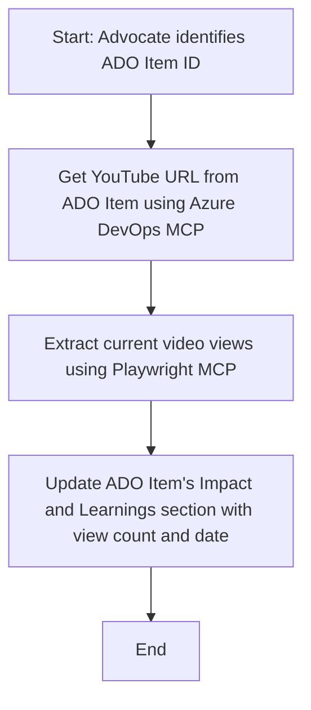

<!--
CO_OP_TRANSLATOR_METADATA:
{
  "original_hash": "14a2dfbea55ef735660a06bd6bdfe5f3",
  "translation_date": "2025-06-17T16:22:51+00:00",
  "source_file": "09-CaseStudy/UpdateADOItemsFromYT.md",
  "language_code": "my"
}
-->
# အမှုလေ့လာမှု - MCP ဖြင့် YouTube ဒေတာမှ Azure DevOps အချက်အလက်များကို အပ်ဒိတ်လုပ်ခြင်း

> **သတိပေးချက်:** YouTube ကဲ့သို့သော ပလက်ဖောင်းများမှ ဒေတာများဖြင့် Azure DevOps အချက်အလက်များကို အလိုအလျောက် အပ်ဒိတ်လုပ်နိုင်သော အွန်လိုင်းကိရိယာများနှင့် အစီရင်ခံစာများ ရှိပြီးဖြစ်သည်။ အောက်ပါအခြေအနေသည် MCP ကိရိယာများကို အလိုအလျောက်လုပ်ငန်းစဉ်များနှင့် ပေါင်းစပ်အသုံးပြုနိုင်မှုကို ဥပမာအနေဖြင့် ပြသရန်သာ ဖြစ်သည်။

## အနှစ်ချုပ်

ဤအမှုလေ့လာမှုတွင် Model Context Protocol (MCP) နှင့် ၎င်း၏ကိရိယာများကို အသုံးပြု၍ YouTube ကဲ့သို့သော အွန်လိုင်းပလက်ဖောင်းများမှ ရရှိသော အချက်အလက်များဖြင့် Azure DevOps (ADO) အလုပ်အချက်အလက်များကို အလိုအလျောက် အပ်ဒိတ်လုပ်နိုင်မှုကို တစ်ခုတည်းသော ဥပမာအနေဖြင့် ဖော်ပြထားသည်။ ဖော်ပြထားသည့်အခြေအနေသည် MCP ကိရိယာများ၏ ကျယ်ပြန့်သော စွမ်းဆောင်ရည်များထဲမှ တစ်ခုသာဖြစ်ပြီး၊ ဆင်တူသော အလိုအလျောက်လုပ်ငန်းလိုအပ်ချက်များအတွက် ပြင်ဆင်အသုံးပြုနိုင်သည်။

ဤဥပမာတွင် Advocate တစ်ဦးသည် ADO အချက်အလက်များဖြင့် အွန်လိုင်းဆွေးနွေးပွဲများကို စောင့်ကြည့်ထားပြီး၊ အဆိုပါ အချက်အလက်တိုင်းတွင် YouTube ဗီဒီယို URL ပါဝင်သည်။ MCP ကိရိယာများကို အသုံးပြုခြင်းအားဖြင့် Advocate သည် ADO အချက်အလက်များကို ဗီဒီယိုကြည့်ရှုမှုအရေအတွက်ကဲ့သို့သော နောက်ဆုံးပေါ် မီထရစ်များဖြင့် ထပ်မံ အပ်ဒိတ်လုပ်နိုင်ပြီး၊ ထိုလုပ်ငန်းစဉ်ကို ထပ်ခါထပ်ခါ ပြုလုပ်နိုင်သော အလိုအလျောက်လုပ်ငန်းစဉ်အဖြစ် ဖန်တီးနိုင်သည်။ ဤနည်းလမ်းသည် အွန်လိုင်းမှရရှိသော အချက်အလက်များကို ADO သို့မဟုတ် အခြားစနစ်များတွင် ပေါင်းစပ်သွင်းယူရန်လိုအပ်သော အခြားအမှုများတွင်လည်း အသုံးပြုနိုင်သည်။

## အခြေအနေ

Advocate တစ်ဦးသည် အွန်လိုင်းဆွေးနွေးပွဲများနှင့် လူမှုအသိုင်းအဝိုင်း ပေါင်းသင်းဆက်ဆံမှုများ၏ သက်ရောက်မှုကို စောင့်ကြည့်ရန် တာဝန်ရှိသည်။ ဆွေးနွေးပွဲတိုင်းကို 'DevRel' ပရောဂျက်အတွင်း ADO အလုပ်အချက်အလက်အဖြစ် မှတ်တမ်းတင်ပြီး၊ အဆိုပါ အချက်အလက်တွင် YouTube ဗီဒီယို URL အတွက် အကွက်တစ်ခု ပါဝင်သည်။ ဆွေးနွေးပွဲ၏ ရောက်ရှိမှုကို တိကျစွာအစီရင်ခံရန် Advocate သည် ဗီဒီယိုကြည့်ရှုမှု အရေအတွက်နဲ့ ထိုအချက်အလက်ရယူသည့် ရက်စွဲတို့ဖြင့် ADO အချက်အလက်ကို အပ်ဒိတ်လုပ်ရန် လိုအပ်သည်။

## အသုံးပြုသောကိရိယာများ

- [Azure DevOps MCP](https://github.com/microsoft/azure-devops-mcp): MCP ဖြင့် ADO အလုပ်အချက်အလက်များကို ပရိုဂရမ်မှတဆင့် ဝင်ရောက်ပြီး အပ်ဒိတ်လုပ်နိုင်စေသည်။
- [Playwright MCP](https://github.com/microsoft/playwright-mcp): ဘရောက်ဇာကို အလိုအလျောက် လည်ပတ်စေပြီး YouTube ဗီဒီယို စာရင်းအချက်အလက်များကဲ့သို့သော တိုက်ရိုက် ဒေတာများကို ထုတ်ယူနိုင်သည်။

## အဆင့်ဆင့် လုပ်ငန်းစဉ်

1. **ADO အချက်အလက်ကို ရှာဖွေခြင်း** - 'DevRel' ပရောဂျက်အတွင်းရှိ ADO အလုပ်အချက်အလက် ID (ဥပမာ 1234) ဖြင့် စတင်သည်။
2. **YouTube URL ကို ရယူခြင်း** - Azure DevOps MCP ကိရိယာကို အသုံးပြု၍ အဆိုပါ အလုပ်အချက်အလက်မှ YouTube URL ကို ရယူသည်။
3. **ဗီဒီယိုကြည့်ရှုမှု အရေအတွက် ထုတ်ယူခြင်း** - Playwright MCP ကိရိယာဖြင့် YouTube URL သို့ သွားရောက်ပြီး လက်ရှိ ကြည့်ရှုမှု အရေအတွက်ကို ထုတ်ယူသည်။
4. **ADO အချက်အလက်ကို အပ်ဒိတ်လုပ်ခြင်း** - Azure DevOps MCP ကိရိယာကို အသုံးပြု၍ 'Impact and Learnings' အပိုင်းတွင် နောက်ဆုံးရကြည့်ရှုမှု အရေအတွက်နှင့် ရယူသည့် ရက်စွဲကို ရေးထည့်သည်။

## ဥပမာ Prompt

```bash
- Work with the ADO Item ID: 1234
- The project is '2025-Awesome'
- Get the YouTube URL for the ADO item
- Use Playwright to get the current views from the YouTube video
- Update the ADO item with the current video views and the updated date of the information
```

## Mermaid စီမံကိန်း ဖလိုချတ်



## နည်းပညာဆိုင်ရာ အကောင်အထည်ဖော်ခြင်း

- **MCP စီမံခန့်ခွဲမှု** - Azure DevOps MCP နှင့် Playwright MCP ကိရိယာများကို အသုံးပြုရန် MCP ဆာဗာမှ လုပ်ငန်းစဉ်ကို စီမံခန့်ခွဲသည်။
- **အလိုအလျောက်လုပ်ငန်းစဉ်** - လက်တွေ့ဖြင့် လှုပ်ရှားစေသော်လည်း သတ်မှတ်ထားသော အချိန်အတွင်း အလိုအလျောက် လည်ပတ်စေခြင်းကိုလည်း ပြုလုပ်နိုင်သည်။
- **ချဲ့ထွင်နိုင်မှု** - ဤနည်းလမ်းကို အခြားအွန်လိုင်း မီထရစ်များ (ဥပမာ လိုက်များ၊ မှတ်ချက်များ) သို့မဟုတ် အခြားပလက်ဖောင်းများမှ ဒေတာများဖြင့် ADO အချက်အလက်များကို အပ်ဒိတ်လုပ်ရာတွင်လည်း အသုံးပြုနိုင်သည်။

## ရလဒ်များနှင့် သက်ရောက်မှု

- **ထိရောက်မှု** - Advocate များအတွက် ဗီဒီယိုမီထရစ်များကို ရယူပြီး အပ်ဒိတ်လုပ်ခြင်းအတွက် လက်မှတ်အလုပ်အား လျော့ချပေးသည်။
- **တိကျမှု** - ADO အချက်အလက်များတွင် အွန်လိုင်းမှ ရရှိနိုင်သည့် နောက်ဆုံးပေါ် ဒေတာများကို မှန်ကန်စွာ ဖော်ပြပေးသည်။
- **ထပ်ခါထပ်ခါ အသုံးပြုနိုင်မှု** - အခြားဒေတာရင်းမြစ်များ သို့မဟုတ် မီထရစ်များနှင့် ဆင်တူသော အခြေအနေများအတွက် ထပ်မံ အသုံးပြုနိုင်သော လုပ်ငန်းစဉ်ကို ပံ့ပိုးပေးသည်။

## ကိုးကားချက်များ

- [Azure DevOps MCP](https://github.com/microsoft/azure-devops-mcp)
- [Playwright MCP](https://github.com/microsoft/playwright-mcp)
- [Model Context Protocol (MCP)](https://modelcontextprotocol.io/)

**အဆိုပြုချက်**:  
ဤစာရွက်စာတမ်းကို AI ဘာသာပြန်ဝန်ဆောင်မှုဖြစ်သော [Co-op Translator](https://github.com/Azure/co-op-translator) ဖြင့် ဘာသာပြန်ထားပါသည်။ ကျွန်ုပ်တို့သည် တိကျမှုအတွက် ကြိုးစားသော်လည်း အလိုအလျောက် ဘာသာပြန်ချက်များတွင် အမှားများ သို့မဟုတ် မှားယွင်းချက်များ ဖြစ်ပေါ်နိုင်ကြောင်း သတိပြုပါရန် အကြောင်းကြားအပ်ပါသည်။ မူလစာရွက်စာတမ်းကို မူရင်းဘာသာဖြင့်သာ တရားဝင်အချက်အလက်အရင်းအမြစ်အဖြစ်ယူဆသင့်ပါသည်။ အရေးကြီးသောအချက်အလက်များအတွက် လူ့ပညာရှင်များ၏ ပရော်ဖက်ရှင်နယ် ဘာသာပြန်ချက်ကို အကြံပြုပါသည်။ ဤဘာသာပြန်ချက် အသုံးပြုမှုကြောင့် ဖြစ်ပေါ်လာသော နားလည်မှုမှားယွင်းမှုများ သို့မဟုတ် မှားထင်မှားယွင်းမှုများအတွက် ကျွန်ုပ်တို့သည် တာဝန်မခံပါ။