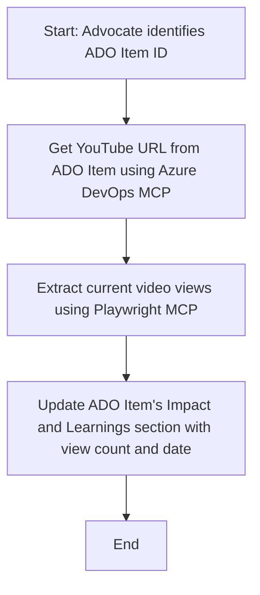

<!--
CO_OP_TRANSLATOR_METADATA:
{
  "original_hash": "14a2dfbea55ef735660a06bd6bdfe5f3",
  "translation_date": "2025-07-14T06:16:25+00:00",
  "source_file": "09-CaseStudy/UpdateADOItemsFromYT.md",
  "language_code": "my"
}
-->
# ကိစ္စလေ့လာမှု - YouTube ဒေတာမှ MCP ဖြင့် Azure DevOps အချက်အလက်များကို အပ်ဒိတ်လုပ်ခြင်း

> **သတိပေးချက်:** YouTube ကဲ့သို့သော ပလက်ဖောင်းများမှ ဒေတာများဖြင့် Azure DevOps အချက်အလက်များကို အလိုအလျောက် အပ်ဒိတ်လုပ်နိုင်သော အွန်လိုင်းကိရိယာများနှင့် အစီရင်ခံစာများ ရှိပြီးသားဖြစ်သည်။ အောက်ပါအခြေအနေကို MCP ကိရိယာများကို အလိုအလျောက်လုပ်ငန်းများနှင့် ပေါင်းစပ်အသုံးပြုနိုင်မှုကို ဥပမာအဖြစ်သာ ဖော်ပြထားခြင်းဖြစ်သည်။

## အနှစ်ချုပ်

ဤကိစ္စလေ့လာမှုတွင် Model Context Protocol (MCP) နှင့် ၎င်း၏ကိရိယာများကို အသုံးပြု၍ YouTube ကဲ့သို့သော အွန်လိုင်းပလက်ဖောင်းများမှ ရရှိသော သတင်းအချက်အလက်များဖြင့် Azure DevOps (ADO) အလုပ်အချက်အလက်များကို အလိုအလျောက် အပ်ဒိတ်လုပ်နိုင်မှုကို တစ်ဦးဥပမာအနေဖြင့် ပြသထားသည်။ ဖော်ပြထားသည့် အခြေအနေသည် MCP ကိရိယာများ၏ ကျယ်ပြန့်သော စွမ်းဆောင်ရည်များထဲမှ တစ်ခုသာဖြစ်ပြီး၊ အခြားဆင်တူသော အလိုအလျောက်လုပ်ငန်းလိုအပ်ချက်များအတွက်လည်း ကိုက်ညီစွာ ပြင်ဆင်အသုံးပြုနိုင်သည်။

ဤဥပမာတွင် Advocate တစ်ဦးသည် ADO အချက်အလက်များကို အသုံးပြု၍ အွန်လိုင်းအစည်းအဝေးများကို စောင့်ကြည့်သည်။ အဆိုပါ အချက်အလက်တစ်ခုချင်းစီတွင် YouTube ဗီဒီယို URL ပါဝင်သည်။ MCP ကိရိယာများကို အသုံးပြုခြင်းဖြင့် Advocate သည် ဗီဒီယိုကြည့်ရှုမှု အရေအတွက်ကဲ့သို့သော နောက်ဆုံးရ ဗီဒီယိုအချက်အလက်များဖြင့် ADO အချက်အလက်များကို အလိုအလျောက် နောက်ဆုံးအခြေအနေသို့ ပြောင်းလဲထားနိုင်သည်။ ဤနည်းလမ်းကို အွန်လိုင်းအရင်းအမြစ်များမှ သတင်းအချက်အလက်များကို ADO သို့မဟုတ် အခြားစနစ်များသို့ ပေါင်းစပ်ရန် လိုအပ်သော အခြားအခြေအနေများတွင်လည်း အသုံးပြုနိုင်သည်။

## အခြေအနေ

Advocate တစ်ဦးသည် အွန်လိုင်းအစည်းအဝေးများနှင့် လူမှုအသိုင်းအဝိုင်းဆက်ဆံရေးများ၏ သက်ရောက်မှုကို စောင့်ကြည့်ရန် တာဝန်ရှိသည်။ အစည်းအဝေးတစ်ခုချင်းစီကို 'DevRel' ပရောဂျက်အတွင်း ADO အလုပ်အချက်အလက်အဖြစ် မှတ်တမ်းတင်ပြီး၊ အလုပ်အချက်အလက်တွင် YouTube ဗီဒီယို URL အတွက် ကွက်လပ်တစ်ခု ပါဝင်သည်။ အစည်းအဝေး၏ ထိရောက်မှုကို မှန်ကန်စွာ အစီရင်ခံရန် Advocate သည် ဗီဒီယိုကြည့်ရှုမှု အရေအတွက်နဲ့ ထိုသတင်းအချက်အလက်ရယူသည့် ရက်စွဲကို ADO အချက်အလက်တွင် အပ်ဒိတ်လုပ်ရန် လိုအပ်သည်။

## အသုံးပြုသော ကိရိယာများ

- [Azure DevOps MCP](https://github.com/microsoft/azure-devops-mcp): MCP ဖြင့် ADO အလုပ်အချက်အလက်များကို ပရိုဂရမ်မှတဆင့် ဝင်ရောက်ပြင်ဆင်နိုင်စေသည်။
- [Playwright MCP](https://github.com/microsoft/playwright-mcp): YouTube ဗီဒီယို စာရင်းအချက်အလက်များကဲ့သို့သော လက်ရှိဒေတာများကို ဝဘ်စာမျက်နှာများမှ ထုတ်ယူရန် ဘရောက်ဇာ လုပ်ဆောင်ချက်များကို အလိုအလျောက်လုပ်ဆောင်ပေးသည်။

## အဆင့်လိုက် လုပ်ငန်းစဉ်

1. **ADO အချက်အလက်ကို ရှာဖွေခြင်း** - 'DevRel' ပရောဂျက်အတွင်းရှိ ADO အလုပ်အချက်အလက် ID (ဥပမာ 1234) ဖြင့် စတင်သည်။
2. **YouTube URL ကို ရယူခြင်း** - Azure DevOps MCP ကိရိယာကို အသုံးပြု၍ အလုပ်အချက်အလက်မှ YouTube URL ကို ရယူသည်။
3. **ဗီဒီယိုကြည့်ရှုမှု အရေအတွက် ထုတ်ယူခြင်း** - Playwright MCP ကိရိယာကို အသုံးပြု၍ YouTube URL သို့ သွားရောက်ပြီး လက်ရှိ ကြည့်ရှုမှု အရေအတွက်ကို ထုတ်ယူသည်။
4. **ADO အချက်အလက်ကို အပ်ဒိတ်လုပ်ခြင်း** - Azure DevOps MCP ကိရိယာဖြင့် 'Impact and Learnings' အပိုင်းတွင် နောက်ဆုံးရ ကြည့်ရှုမှု အရေအတွက်နှင့် ဒေတာရယူသည့် ရက်စွဲကို ရေးထည့်သည်။

## ဥပမာ Prompt

```bash
- Work with the ADO Item ID: 1234
- The project is '2025-Awesome'
- Get the YouTube URL for the ADO item
- Use Playwright to get the current views from the YouTube video
- Update the ADO item with the current video views and the updated date of the information
```

## Mermaid စီးဆင်းမှုဇယား



## နည်းပညာဆိုင်ရာ အကောင်အထည်ဖော်ခြင်း

- **MCP စီမံခန့်ခွဲမှု** - Azure DevOps MCP နှင့် Playwright MCP ကိရိယာများကို အသုံးပြုမှုကို MCP ဆာဗာတစ်ခုက စီမံခန့်ခွဲသည်။
- **အလိုအလျောက်လုပ်ငန်း** - လက်ဖြင့် စတင်နိုင်သလို သတ်မှတ်ထားသော အချိန်အတွင်း အလိုအလျောက် လည်ပတ်စေ၍ ADO အချက်အလက်များကို နောက်ဆုံးအခြေအနေသို့ ထိန်းသိမ်းထားနိုင်သည်။
- **တိုးချဲ့နိုင်မှု** - အခြားအွန်လိုင်း စာရင်းအချက်အလက်များ (ဥပမာ - like များ၊ မှတ်ချက်များ) သို့မဟုတ် အခြားပလက်ဖောင်းများမှ ADO အချက်အလက်များကို အပ်ဒိတ်လုပ်ရန် ဒီပုံစံကို တိုးချဲ့အသုံးပြုနိုင်သည်။

## ရလဒ်များနှင့် သက်ရောက်မှု

- **ထိရောက်မှု** - Advocate များ၏ လက်ဖြင့်လုပ်ဆောင်ရသော အလုပ်များကို လျော့နည်းစေပြီး ဗီဒီယိုစာရင်းအချက်အလက်များကို အလိုအလျောက် ရယူနှင့် အပ်ဒိတ်လုပ်ပေးသည်။
- **မှန်ကန်မှု** - ADO အချက်အလက်များတွင် အွန်လိုင်းမှ ရရှိနိုင်သည့် နောက်ဆုံးရ ဒေတာများသာ ပါဝင်စေရန် သေချာစေသည်။
- **ပြန်လည်အသုံးပြုနိုင်မှု** - အခြားဒေတာအရင်းအမြစ်များ သို့မဟုတ် စာရင်းအချက်အလက်များနှင့် ပတ်သက်သော ဆင်တူအခြေအနေများအတွက် ထပ်မံအသုံးပြုနိုင်သော လုပ်ငန်းစဉ်တစ်ခု ဖြစ်စေသည်။

## ကိုးကားချက်များ

- [Azure DevOps MCP](https://github.com/microsoft/azure-devops-mcp)
- [Playwright MCP](https://github.com/microsoft/playwright-mcp)
- [Model Context Protocol (MCP)](https://modelcontextprotocol.io/)

**အကြောင်းကြားချက်**  
ဤစာတမ်းကို AI ဘာသာပြန်ဝန်ဆောင်မှု [Co-op Translator](https://github.com/Azure/co-op-translator) ဖြင့် ဘာသာပြန်ထားပါသည်။ ကျွန်ုပ်တို့သည် တိကျမှန်ကန်မှုအတွက် ကြိုးစားသော်လည်း အလိုအလျောက် ဘာသာပြန်ခြင်းတွင် အမှားများ သို့မဟုတ် မှားယွင်းချက်များ ပါဝင်နိုင်ကြောင်း သတိပြုပါရန် မေတ္တာရပ်ခံအပ်ပါသည်။ မူရင်းစာတမ်းကို မိမိဘာသာစကားဖြင့်သာ တရားဝင်အချက်အလက်အဖြစ် ယူဆသင့်ပါသည်။ အရေးကြီးသော အချက်အလက်များအတွက် လူ့ဘာသာပြန်ပညာရှင်မှ ဘာသာပြန်ခြင်းကို အကြံပြုပါသည်။ ဤဘာသာပြန်ချက်ကို အသုံးပြုရာမှ ဖြစ်ပေါ်လာနိုင်သည့် နားလည်မှုမှားယွင်းမှုများအတွက် ကျွန်ုပ်တို့သည် တာဝန်မယူပါ။