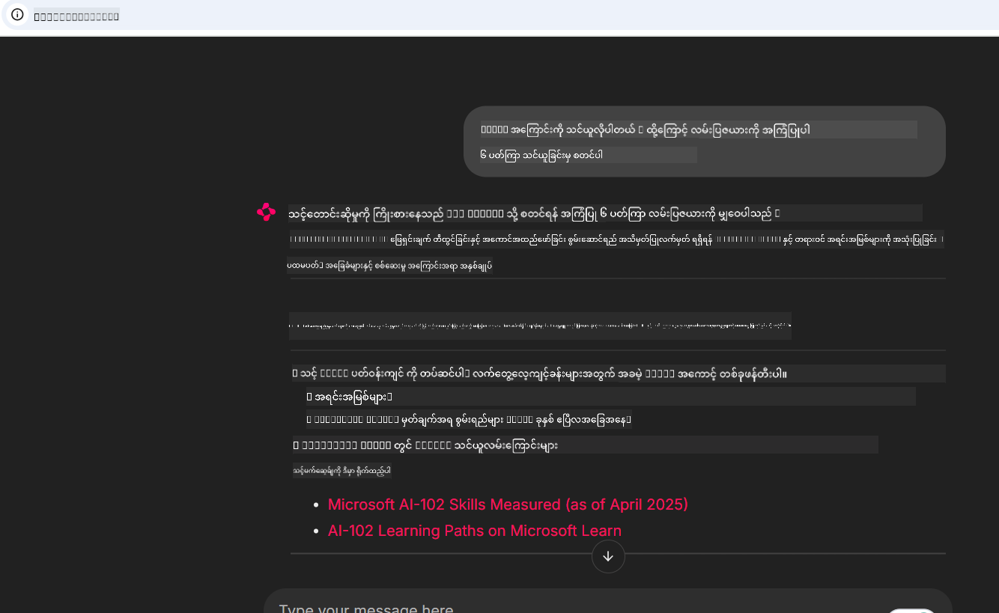

<!--
CO_OP_TRANSLATOR_METADATA:
{
  "original_hash": "4319d291c9d124ecafea52b3d04bfa0e",
  "translation_date": "2025-07-14T06:30:56+00:00",
  "source_file": "09-CaseStudy/docs-mcp/README.md",
  "language_code": "my"
}
-->
# Case Study: Microsoft Learn Docs MCP Server ကို Client မှတဆင့် ချိတ်ဆက်ခြင်း

သင်က ကိုဒ်ပြဿနာကို ဖြေရှင်းဖို့ ကြိုးစားနေစဉ် Documentation ဆိုက်တွေ၊ Stack Overflow နဲ့ ရှာဖွေမှုအင်ဂျင် တက်ဘ်တွေကြားမှာ အချိန်ကုန်ကျနေဖူးပါသလား? ဒေါက်မြင့်တစ်ခုကို Documentation အတွက် သီးသန့်ထားတတ်ပါသလား၊ ဒါမှမဟုတ် IDE နဲ့ Browser ကြားကို အမြဲ Alt-tab လုပ်နေတတ်ပါသလား။ Documentation ကို သင့် workflow ထဲမှာ တိုက်ရိုက် ထည့်သွင်းနိုင်ရင် ပိုကောင်းမယ်ထင်ပါသလား—သင့် app တွေ၊ IDE သို့မဟုတ် ကိုယ်ပိုင် custom tools တွေထဲမှာပဲ ပေါင်းစပ်ထားနိုင်ရင်? ဒီ case study မှာတော့ Microsoft Learn Docs MCP server ကို ကိုယ်ပိုင် client application မှတဆင့် တိုက်ရိုက် ချိတ်ဆက်နည်းကို လေ့လာကြမယ်။

## အနှစ်ချုပ်

ခေတ်မီ software ဖန်တီးခြင်းဆိုတာ ကုဒ်ရေးခြင်းထက်ပိုပြီး အချိန်မှန်မှာ သင့်တော်တဲ့ အချက်အလက်ကို ရှာဖွေခြင်းပါ။ Documentation တွေက အားလုံးနေရာမှာ ရှိပေမယ့် အများဆုံးလိုအပ်ရာမှာ မရှိကြပါဘူး။ သင့် tools နဲ့ workflows ထဲမှာပဲ ရှိဖို့လိုပါတယ်။ Documentation retrieval ကို သင့် applications ထဲမှာ တိုက်ရိုက် ပေါင်းစပ်ခြင်းဖြင့် အချိန်ကုန်သက်သာစေပြီး context switching လျော့နည်းစေပြီး ထုတ်လုပ်မှုမြှင့်တင်နိုင်ပါတယ်။ ဒီအပိုင်းမှာတော့ Microsoft Learn Docs MCP server ကို client တစ်ခုနဲ့ ချိတ်ဆက်ပြီး real-time, context-aware documentation ကို သင့် app ထဲကနေ တဆင့်ရယူနည်းကို ပြသပါမယ်။

ချိတ်ဆက်ခြင်းလုပ်ငန်းစဉ်၊ request ပို့ခြင်းနဲ့ streaming response ကို ထိရောက်စွာ ကိုင်တွယ်ခြင်းတို့ကို လမ်းညွှန်ပြပါမယ်။ ဒီနည်းလမ်းက workflow ကို ပိုမိုလွယ်ကူစေပြီး developer tools တွေကို ပိုမိုတိုးတက်စေမှာ ဖြစ်ပါတယ်။

## သင်ယူရမည့် ရည်မှန်းချက်များ

ဘာကြောင့် ဒီနည်းလမ်းကို လုပ်တာလဲ? အကောင်းဆုံး developer experience တွေက အတားအဆီးတွေကို ဖယ်ရှားပေးနိုင်တဲ့ အတွေ့အကြုံတွေ ဖြစ်ကြတာပါ။ သင့် code editor, chatbot, သို့မဟုတ် web app က Microsoft Learn မှ နောက်ဆုံးထွက် content တွေကို အသုံးပြုပြီး Documentation မေးခွန်းတွေကို ချက်ချင်း ဖြေဆိုပေးနိုင်တဲ့ ကမ္ဘာကို စဉ်းစားကြည့်ပါ။ ဒီအခန်းအဆုံးမှာ သင်မှာ:

- Documentation အတွက် MCP server-client ဆက်သွယ်မှု အခြေခံကို နားလည်နိုင်မယ်
- Microsoft Learn Docs MCP server ကို ချိတ်ဆက်ဖို့ console သို့မဟုတ် web application တစ်ခု ဖန်တီးနိုင်မယ်
- Streaming HTTP client တွေကို အသုံးပြုပြီး real-time documentation ရယူနိုင်မယ်
- သင့် application မှာ documentation response တွေကို မှတ်တမ်းတင်ပြီး အဓိပ္ပာယ်ဖတ်ရှုနိုင်မယ်

ဒီကျွမ်းကျင်မှုတွေက သင့်ကို reactive မဟုတ်ပဲ interactive နဲ့ context-aware ဖြစ်တဲ့ tools တွေ ဖန်တီးနိုင်ဖို့ ကူညီပါလိမ့်မယ်။

## Scenario 1 - MCP ဖြင့် Real-Time Documentation ရယူခြင်း

ဒီ scenario မှာတော့ Microsoft Learn Docs MCP server ကို client တစ်ခုနဲ့ ချိတ်ဆက်ပြီး real-time, context-aware documentation ကို သင့် app ထဲကနေ တဆင့်ရယူနည်းကို ပြသပါမယ်။

လုပ်ဆောင်ရမယ့် အလုပ်ကတော့ Microsoft Learn Docs MCP server ကို ချိတ်ဆက်ပြီး `microsoft_docs_search` tool ကို ခေါ်ယူကာ streaming response ကို console မှာ မှတ်တမ်းတင်ဖို့ app တစ်ခုရေးသားခြင်း ဖြစ်ပါတယ်။

### ဒီနည်းလမ်းကို ရွေးချယ်ရတဲ့ အကြောင်းရင်း
ဒါက ပိုမိုတိုးတက်တဲ့ ပေါင်းစပ်မှုတွေ ဖန်တီးဖို့ အခြေခံဖြစ်ပါတယ်—chatbot, IDE extension, သို့မဟုတ် web dashboard တို့ကို ဖန်တီးချင်ရင် အထောက်အကူဖြစ်ပါလိမ့်မယ်။

ဒီ scenario အတွက် code နဲ့ လမ်းညွှန်ချက်တွေကို ဒီ case study ရဲ့ [`solution`](./solution/README.md) ဖိုလ်ဒါထဲမှာ တွေ့နိုင်ပါတယ်။ လုပ်ဆောင်ရမယ့် အဆင့်တွေကတော့:
- ချိတ်ဆက်ဖို့ official MCP SDK နဲ့ streamable HTTP client ကို အသုံးပြုပါ
- Documentation ရယူဖို့ `microsoft_docs_search` tool ကို query parameter နဲ့ ခေါ်ပါ
- မှတ်တမ်းတင်ခြင်းနဲ့ error ကိုင်တွယ်ခြင်းကို မှန်ကန်စွာ လုပ်ဆောင်ပါ
- အသုံးပြုသူတွေကို search query များစွာ ထည့်နိုင်တဲ့ interactive console interface တစ်ခု ဖန်တီးပါ

ဒီ scenario က ပြသတာတွေက:
- Docs MCP server ကို ချိတ်ဆက်ခြင်း
- Query တစ်ခု ပို့ခြင်း
- ရလဒ်တွေကို ဖတ်ရှုကာ ပုံနှိပ်ခြင်း

ဒီလိုဖြစ်နိုင်ပါတယ်:

```
Prompt> What is Azure Key Vault?
Answer> Azure Key Vault is a cloud service for securely storing and accessing secrets. ...
```

အောက်မှာ နမူနာ code အနည်းငယ်ကို ပြထားပါတယ်။ အပြည့်အစုံနဲ့ အသေးစိတ်ကို solution ဖိုလ်ဒါထဲမှာ ရှာဖွေနိုင်ပါတယ်။

<details>
<summary>Python</summary>

```python
import asyncio
from mcp.client.streamable_http import streamablehttp_client
from mcp import ClientSession

async def main():
    async with streamablehttp_client("https://learn.microsoft.com/api/mcp") as (read_stream, write_stream, _):
        async with ClientSession(read_stream, write_stream) as session:
            await session.initialize()
            result = await session.call_tool("microsoft_docs_search", {"query": "Azure Functions best practices"})
            print(result.content)

if __name__ == "__main__":
    asyncio.run(main())
```

- အပြည့်အစုံ implementation နဲ့ logging အတွက် [`scenario1.py`](../../../../09-CaseStudy/docs-mcp/solution/python/scenario1.py) ကို ကြည့်ပါ။
- installation နဲ့ အသုံးပြုနည်းအတွက် [`README.md`](./solution/python/README.md) ဖိုင်ကို ကြည့်ပါ။
</details>

## Scenario 2 - MCP ဖြင့် Interactive Study Plan Generator Web App

ဒီ scenario မှာတော့ Docs MCP ကို web development project တစ်ခုထဲ ပေါင်းစပ်နည်းကို သင်ယူပါမယ်။ ရည်ရွယ်ချက်ကတော့ အသုံးပြုသူတွေကို Microsoft Learn documentation ကို web interface မှတဆင့် တိုက်ရိုက် ရှာဖွေနိုင်စေခြင်းဖြစ်ပြီး သင့် app သို့မဟုတ် site ထဲမှာ Documentation ကို ချက်ချင်း အသုံးပြုနိုင်စေမှာ ဖြစ်ပါတယ်။

သင်တွေ့မြင်မယ့်အရာတွေက:
- Web app တစ်ခု စတင်တည်ဆောက်ခြင်း
- Docs MCP server ကို ချိတ်ဆက်ခြင်း
- အသုံးပြုသူ input ကို ကိုင်တွယ်ပြီး ရလဒ်တွေ ပြသခြင်း

ဒီလိုဖြစ်နိုင်ပါတယ်:

```
User> I want to learn about AI102 - so suggest the roadmap to get it started from learn for 6 weeks

Assistant> Here’s a detailed 6-week roadmap to start your preparation for the AI-102: Designing and Implementing a Microsoft Azure AI Solution certification, using official Microsoft resources and focusing on exam skills areas:

---
## Week 1: Introduction & Fundamentals
- **Understand the Exam**: Review the [AI-102 exam skills outline](https://learn.microsoft.com/en-us/credentials/certifications/exams/ai-102/).
- **Set up Azure**: Sign up for a free Azure account if you don't have one.
- **Learning Path**: [Introduction to Azure AI services](https://learn.microsoft.com/en-us/training/modules/intro-to-azure-ai/)
- **Focus**: Get familiar with Azure portal, AI capabilities, and necessary tools.

....more weeks of the roadmap...

Let me know if you want module-specific recommendations or need more customized weekly tasks!
```

အောက်မှာ နမူနာ code အနည်းငယ်ကို ပြထားပါတယ်။ အပြည့်အစုံနဲ့ အသေးစိတ်ကို solution ဖိုလ်ဒါထဲမှာ ရှာဖွေနိုင်ပါတယ်။



<details>
<summary>Python (Chainlit)</summary>

Chainlit က conversational AI web app တွေ ဖန်တီးဖို့ framework တစ်ခုဖြစ်ပြီး MCP tools တွေကို ခေါ်ယူကာ ရလဒ်တွေကို real-time ပြသနိုင်တဲ့ interactive chatbot နဲ့ assistant တွေ ဖန်တီးဖို့ အဆင်ပြေပါတယ်။ Rapid prototyping နဲ့ အသုံးပြုသူအဆင်ပြေမှုအတွက် အထူးသင့်တော်ပါတယ်။

```python
import chainlit as cl
import requests

MCP_URL = "https://learn.microsoft.com/api/mcp"

@cl.on_message
def handle_message(message):
    query = {"question": message}
    response = requests.post(MCP_URL, json=query)
    if response.ok:
        result = response.json()
        cl.Message(content=result.get("answer", "No answer found.")).send()
    else:
        cl.Message(content="Error: " + response.text).send()
```

- အပြည့်အစုံ implementation အတွက် [`scenario2.py`](../../../../09-CaseStudy/docs-mcp/solution/python/scenario2.py) ကို ကြည့်ပါ။
- စတင်အသုံးပြုနည်းနဲ့ လည်ပတ်နည်းအတွက် [`README.md`](./solution/python/README.md) ကို ကြည့်ပါ။
</details>

## Scenario 3: VS Code မှာ MCP Server ဖြင့် In-Editor Docs

Microsoft Learn Docs ကို browser tab ပြောင်းစရာမလိုပဲ VS Code ထဲမှာ တိုက်ရိုက် ရယူချင်ရင် MCP server ကို သင့် editor ထဲမှာ အသုံးပြုနိုင်ပါတယ်။ ဒီနည်းလမ်းက:

- VS Code မှာ coding လုပ်နေစဉ် docs ရှာဖွေနိုင်ခြင်း
- README သို့မဟုတ် course ဖိုင်တွေထဲမှာ documentation link တွေ ထည့်သွင်းနိုင်ခြင်း
- GitHub Copilot နဲ့ MCP ကို ပေါင်းစပ်အသုံးပြုပြီး AI အားဖြင့် documentation workflow ကို ပိုမိုလွယ်ကူစေခြင်း

**သင်တွေ့မြင်မယ့်အရာတွေက:**
- workspace root မှာ တရားဝင် `.vscode/mcp.json` ဖိုင်တစ်ခု ထည့်သွင်းခြင်း (အောက်မှာ ဥပမာပါ)
- VS Code မှာ MCP panel ကို ဖွင့်ခြင်း သို့မဟုတ် command palette ကို အသုံးပြုပြီး docs ရှာဖွေခြင်းနဲ့ ထည့်သွင်းခြင်း
- markdown ဖိုင်တွေထဲမှာ တိုက်ရိုက် documentation ကို ကိုးကားခြင်း
- GitHub Copilot နဲ့ ပေါင်းစပ်ပြီး ထုတ်လုပ်မှု မြှင့်တင်ခြင်း

VS Code မှာ MCP server ကို စတင်တပ်ဆင်နည်း ဥပမာ:

```json
{
  "servers": {
    "LearnDocsMCP": {
      "url": "https://learn.microsoft.com/api/mcp"
    }
  }
}
```

</details>

> ပုံနှိပ်ချက်တွေနဲ့ အဆင့်ဆင့် လမ်းညွှန်ချက်အပြည့်အစုံအတွက် [`README.md`](./solution/scenario3/README.md) ကို ကြည့်ပါ။


ဒီနည်းလမ်းက နည်းပညာသင်တန်းတွေ ဖန်တီးသူ၊ documentation ရေးသူ၊ အကြိမ်ကြိမ် ကိုးကားမှုလိုအပ်သူတွေအတွက် အထူးသင့်တော်ပါတယ်။

## အဓိက သင်ခန်းစာများ

Documentation ကို သင့် tools ထဲမှာ တိုက်ရိုက် ပေါင်းစပ်ခြင်းက သာမန် အဆင်ပြေမှုတစ်ခုသာမက ထုတ်လုပ်မှုအတွက် ပြောင်းလဲမှုကြီးတစ်ခုပါ။ Microsoft Learn Docs MCP server ကို client မှတဆင့် ချိတ်ဆက်ခြင်းဖြင့်:

- ကိုဒ်နဲ့ documentation ကြား context switching ကို ဖယ်ရှားနိုင်မယ်
- အချိန်နှင့်တပြေးညီ၊ context-aware docs ကို ရယူနိုင်မယ်
- ပိုမိုတိုးတက်ပြီး interactive ဖြစ်တဲ့ developer tools တွေ ဖန်တီးနိုင်မယ်

ဒီကျွမ်းကျင်မှုတွေက သင့်ကို ထိရောက်ပြီး အသုံးပြုရလွယ်ကူတဲ့ ဖြေရှင်းချက်တွေ ဖန်တီးဖို့ ကူညီပါလိမ့်မယ်။

## အပိုဆောင်း အရင်းအမြစ်များ

နားလည်မှု ပိုမိုနက်ရှိုင်းစေရန် အောက်ပါ တရားဝင် အရင်းအမြစ်များကို လေ့လာကြည့်ပါ။

- [Microsoft Learn Docs MCP Server (GitHub)](https://github.com/MicrosoftDocs/mcp)
- [Get started with Azure MCP Server (mcp-python)](https://learn.microsoft.com/en-us/azure/developer/azure-mcp-server/get-started#create-the-python-app)
- [What is the Azure MCP Server?](https://learn.microsoft.com/en-us/azure/developer/azure-mcp-server/)
- [Model Context Protocol (MCP) Introduction](https://modelcontextprotocol.io/introduction)
- [Add plugins from a MCP Server (Python)](https://learn.microsoft.com/en-us/semantic-kernel/concepts/plugins/adding-mcp-plugins)

**အကြောင်းကြားချက်**  
ဤစာတမ်းကို AI ဘာသာပြန်ဝန်ဆောင်မှု [Co-op Translator](https://github.com/Azure/co-op-translator) ဖြင့် ဘာသာပြန်ထားပါသည်။ ကျွန်ုပ်တို့သည် တိကျမှန်ကန်မှုအတွက် ကြိုးစားသော်လည်း အလိုအလျောက် ဘာသာပြန်ခြင်းတွင် အမှားများ သို့မဟုတ် မှားယွင်းချက်များ ပါဝင်နိုင်ကြောင်း သတိပြုပါရန် မေတ္တာရပ်ခံအပ်ပါသည်။ မူရင်းစာတမ်းကို မိမိဘာသာစကားဖြင့်သာ တရားဝင်အချက်အလက်အဖြစ် ယူဆသင့်ပါသည်။ အရေးကြီးသော အချက်အလက်များအတွက် လူ့ပညာရှင်များ၏ ပရော်ဖက်ရှင်နယ် ဘာသာပြန်ခြင်းကို အကြံပြုပါသည်။ ဤဘာသာပြန်ချက်ကို အသုံးပြုရာမှ ဖြစ်ပေါ်လာနိုင်သည့် နားလည်မှုမှားယွင်းမှုများအတွက် ကျွန်ုပ်တို့သည် တာဝန်မခံပါ။