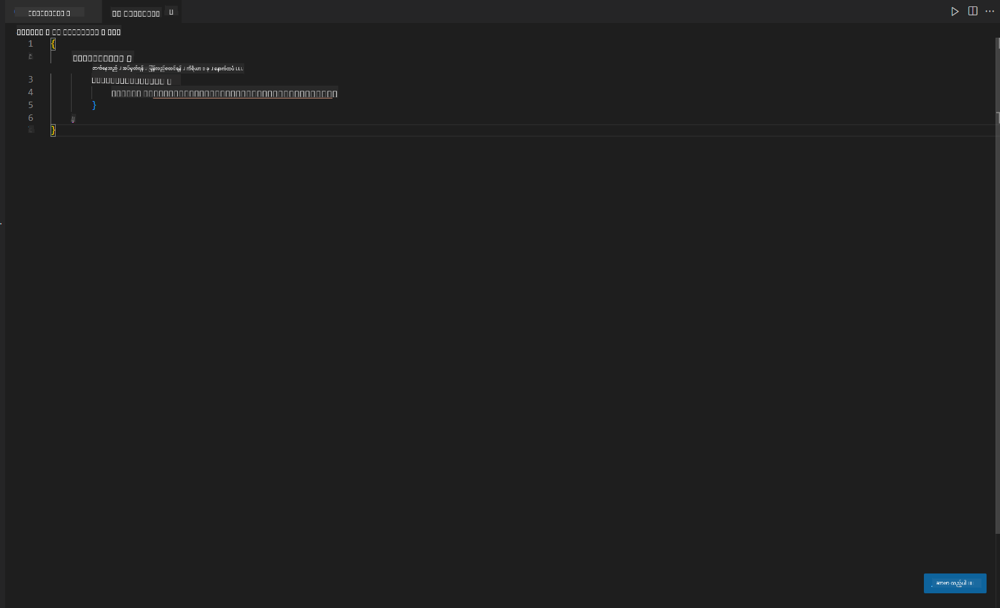
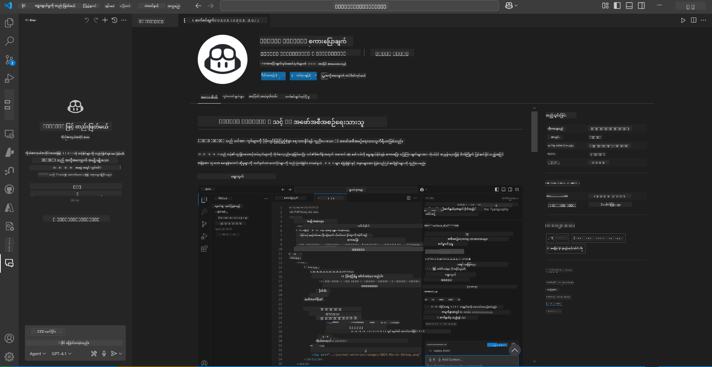
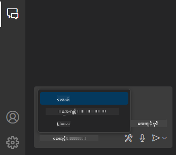
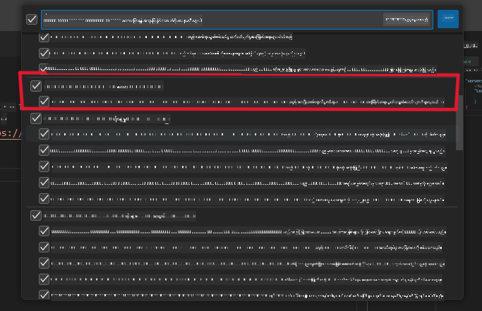
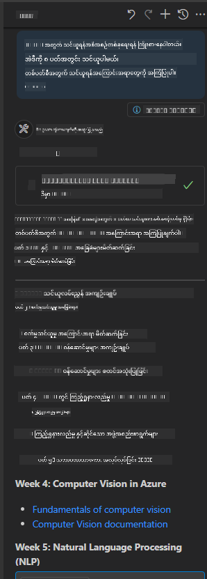
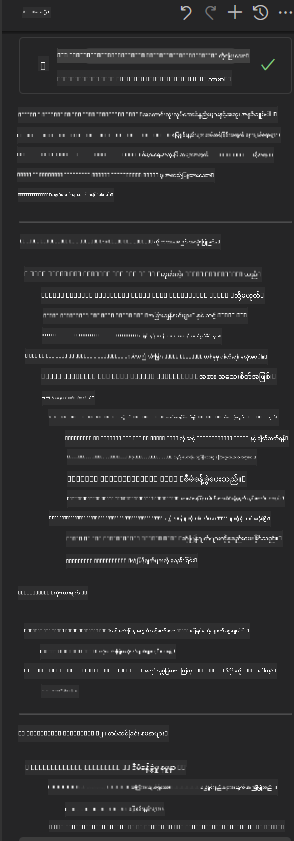

<!--
CO_OP_TRANSLATOR_METADATA:
{
  "original_hash": "db532b1ec386c9ce38c791653dc3c881",
  "translation_date": "2025-07-14T06:57:14+00:00",
  "source_file": "09-CaseStudy/docs-mcp/solution/scenario3/README.md",
  "language_code": "my"
}
-->
# Scenario 3: In-Editor Docs with MCP Server in VS Code

## အနှစ်ချုပ်

ဒီအခြေအနေမှာတော့ MCP server ကို အသုံးပြုပြီး Microsoft Learn Docs ကို Visual Studio Code အတွင်းမှာ တိုက်ရိုက်ယူပြီး အသုံးပြုနည်းကို သင်ယူမှာဖြစ်ပါတယ်။ ဘရောက်ဇာတွင် tab မပြောင်းဘဲ တိုက်ရိုက် editor အတွင်းမှ စာတမ်းများကို ရှာဖွေ၊ ဖတ်ရှု၊ ကိုးကားနိုင်ပါတယ်။ ဒီနည်းလမ်းက သင့်လုပ်ငန်းစဉ်ကို ပိုမိုလွယ်ကူစေပြီး အာရုံစူးစိုက်မှုကို ထိန်းသိမ်းပေးပြီး GitHub Copilot ကဲ့သို့သော ကိရိယာများနှင့် ပေါင်းစပ်အသုံးပြုနိုင်စေပါတယ်။

- VS Code အတွင်းမှာ coding လုပ်နေစဉ် စာတမ်းများကို ရှာဖွေဖတ်ရှုနိုင်သည်။
- README သို့မဟုတ် သင်တန်းဖိုင်များထဲသို့ တိုက်ရိုက် documentation link များ ထည့်သွင်းနိုင်သည်။
- GitHub Copilot နှင့် MCP ကို ပေါင်းစပ်အသုံးပြု၍ AI အားဖြင့် စာတမ်းလုပ်ငန်းစဉ်ကို ပိုမိုထိရောက်စေသည်။

## သင်ယူရမည့် ရည်မှန်းချက်များ

ဒီအခန်းအဆုံးတွင် MCP server ကို VS Code အတွင်းမှာ စတင်တပ်ဆင်အသုံးပြုနည်းကို နားလည်ပြီး သင့် documentation နှင့် ဖွံ့ဖြိုးတိုးတက်မှုလုပ်ငန်းစဉ်ကို တိုးတက်စေမှာဖြစ်ပါတယ်။ သင်မှာနိုင်မှာတွေကတော့ -

- MCP server ကို အသုံးပြုရန် workspace ကို ပြင်ဆင်တပ်ဆင်နိုင်ခြင်း။
- VS Code အတွင်းမှ တိုက်ရိုက် စာတမ်းများကို ရှာဖွေထည့်သွင်းနိုင်ခြင်း။
- GitHub Copilot နှင့် MCP ကို ပေါင်းစပ်အသုံးပြု၍ AI အားဖြင့် ထိရောက်မှုမြင့်မားသော workflow တစ်ခု ဖန်တီးနိုင်ခြင်း။

ဒီကျွမ်းကျင်မှုတွေက သင့်အာရုံစူးစိုက်မှုကို ထိန်းသိမ်းပေးပြီး စာတမ်းအရည်အသွေးကို မြှင့်တင်ကာ developer သို့မဟုတ် နည်းပညာရေးသားသူအဖြစ် ထုတ်လုပ်မှုမြင့်မားစေမှာ ဖြစ်ပါတယ်။

## ဖြေရှင်းနည်း

Editor အတွင်းမှ စာတမ်းများကို ရယူနိုင်ရန် MCP server ကို VS Code နှင့် GitHub Copilot နှစ်ခုလုံးနှင့် ပေါင်းစပ်အသုံးပြုမည့် အဆင့်ဆင့် လုပ်ဆောင်ရမည့် နည်းလမ်းဖြစ်ပါတယ်။ ဒီနည်းလမ်းက သင်တန်းရေးသားသူများ၊ စာတမ်းရေးသူများနှင့် developer များအတွက် အထူးသင့်တော်ပြီး editor အတွင်းမှာ အာရုံစူးစိုက်မှုရှိစေပြီး docs နှင့် Copilot နှစ်ခုလုံးကို အဆင်ပြေစွာ အသုံးပြုနိုင်စေပါသည်။

- သင်တန်း သို့မဟုတ် project documentation ရေးစဉ် README ထဲသို့ အမြန် reference link များ ထည့်သွင်းနိုင်သည်။
- Copilot ကို ကုဒ်ရေးရန် အသုံးပြုကာ MCP ကို အသုံးပြုပြီး သက်ဆိုင်ရာ စာတမ်းများကို ချက်ချင်း ရှာဖွေနိုင်သည်။
- Editor အတွင်းမှာ အာရုံစူးစိုက်မှုရှိစေပြီး ထုတ်လုပ်မှုမြှင့်တင်နိုင်သည်။

### အဆင့်ဆင့် လမ်းညွှန်

စတင်ရန် အောက်ပါအဆင့်များကို လိုက်နာပါ။ အဆင့်တိုင်းအတွက် assets ဖိုလ်ဒါမှ screenshot များ ထည့်သွင်း၍ လုပ်ငန်းစဉ်ကို မြင်သာအောင် ပြသနိုင်ပါသည်။

1. **MCP configuration ထည့်သွင်းခြင်း:**
   သင့် project root တွင် `.vscode/mcp.json` ဖိုင်ကို ဖန်တီးပြီး အောက်ပါ configuration ကို ထည့်သွင်းပါ။
   ```json
   {
     "servers": {
       "LearnDocsMCP": {
         "url": "https://learn.microsoft.com/api/mcp"
       }
     }
   }
   ```
   ဒီ configuration က VS Code ကို [`Microsoft Learn Docs MCP server`](https://github.com/MicrosoftDocs/mcp) နှင့် ချိတ်ဆက်ပုံကို ပြောပြပေးသည်။
   
   
    
2. **GitHub Copilot Chat panel ကို ဖွင့်ပါ:**
   GitHub Copilot extension မရှိသေးပါက VS Code ၏ Extensions view မှာ သွားပြီး တပ်ဆင်ပါ။ [Visual Studio Code Marketplace](https://marketplace.visualstudio.com/items?itemName=GitHub.copilot-chat) မှ တိုက်ရိုက်ဒေါင်းလုပ်လုပ်နိုင်သည်။ ထို့နောက် sidebar မှ Copilot Chat panel ကို ဖွင့်ပါ။

   

3. **Agent mode ကို ဖွင့်ပြီး ကိရိယာများကို စစ်ဆေးပါ:**
   Copilot Chat panel တွင် agent mode ကို ဖွင့်ပါ။

   

   Agent mode ဖွင့်ပြီးနောက် MCP server သည် အသုံးပြုနိုင်သော ကိရိယာများအနက် တစ်ခုအဖြစ် ပါဝင်နေကြောင်း စစ်ဆေးပါ။ ဒါက Copilot agent သည် သက်ဆိုင်ရာ စာတမ်း server ကို ချိတ်ဆက်နိုင်ရန် အာမခံပေးသည်။
   
   
4. **Chat အသစ် စတင်ပြီး agent ကို မေးမြန်းပါ:**
   Copilot Chat panel တွင် chat အသစ် ဖွင့်ပါ။ သင့်စာတမ်းမေးခွန်းများကို agent ထံ မေးမြန်းနိုင်ပြီဖြစ်သည်။ Agent သည် MCP server ကို အသုံးပြုပြီး သက်ဆိုင်ရာ Microsoft Learn စာတမ်းများကို တိုက်ရိုက် editor အတွင်း ပြသပေးပါလိမ့်မည်။

   - *"I'm trying to write a study plan for topic X. I'm going to study it for 8 weeks, for each week, suggest content I should take."*

   

5. **တိုက်ရိုက် မေးခွန်းမေးခြင်း (Live Query):**

   > Azure AI Foundry Discord ၏ [#get-help](https://discord.gg/D6cRhjHWSC) အပိုင်းမှ တိုက်ရိုက်မေးခွန်းတစ်ခုကို ယူကြည့်ပါ ([မူရင်းစာသားကြည့်ရန်](https://discord.com/channels/1113626258182504448/1385498306720829572)):
   
   *"I am seeking answers on how to deploy a multi-agent solution with AI agents developed on the Azure AI Foundry. I see that there is no direct deployment method, such as Copilot Studio channels. So, what are the different ways to do this deployment for enterprise users to interact and get the job done?
There are numerous articles/blogs available who says we can use Azure Bot service to do this job which can act as a bridge between MS teams and Azure AI Foundry Agents, well is this going to work if I setup an Azure bot which connects to the Orchestrator Agent on Azure AI foundry via Azure function to perform the orchestration or I need to create Azure function for each of the AI agents part of multi agent solution to do the orchestration at the Bot framework? Any other suggestions are most welcome.
"*

   

   Agent သည် သက်ဆိုင်ရာ စာတမ်း link များနှင့် အကျဉ်းချုပ်များဖြင့် တုံ့ပြန်ပေးပြီး သင်သည် markdown ဖိုင်များထဲသို့ တိုက်ရိုက် ထည့်သွင်းနိုင်သည် သို့မဟုတ် ကိုးကားချက်အဖြစ် အသုံးပြုနိုင်ပါသည်။
   
### နမူနာ မေးခွန်းများ

အောက်ပါ မေးခွန်းများကို စမ်းသပ်ကြည့်နိုင်ပါသည်။ ဒီမေးခွန်းများက MCP server နှင့် Copilot တို့ ပေါင်းစပ်၍ VS Code ထဲမှ ထွက်မနေဘဲ ချက်ချင်း၊ အကြောင်းအရာနားလည်မှုရှိသော စာတမ်းများနှင့် ကိုးကားချက်များ ပေးနိုင်ကြောင်း ပြသပါလိမ့်မည်။

- "Show me how to use Azure Functions triggers."
- "Insert a link to the official documentation for Azure Key Vault."
- "What are the best practices for securing Azure resources?"
- "Find a quickstart for Azure AI services."

ဒီမေးခွန်းများက MCP server နှင့် Copilot တို့ ပေါင်းစပ်၍ VS Code ထဲမှ ထွက်မနေဘဲ ချက်ချင်း၊ အကြောင်းအရာနားလည်မှုရှိသော စာတမ်းများနှင့် ကိုးကားချက်များ ပေးနိုင်ကြောင်း ပြသပါလိမ့်မည်။

---

**အကြောင်းကြားချက်**  
ဤစာတမ်းကို AI ဘာသာပြန်ဝန်ဆောင်မှု [Co-op Translator](https://github.com/Azure/co-op-translator) ဖြင့် ဘာသာပြန်ထားပါသည်။ ကျွန်ုပ်တို့သည် တိကျမှန်ကန်မှုအတွက် ကြိုးစားသော်လည်း၊ အလိုအလျောက် ဘာသာပြန်ခြင်းများတွင် အမှားများ သို့မဟုတ် မှားယွင်းချက်များ ပါဝင်နိုင်ကြောင်း သတိပြုပါရန် မေတ္တာရပ်ခံအပ်ပါသည်။ မူရင်းစာတမ်းကို မိမိဘာသာစကားဖြင့်သာ တရားဝင်အရင်းအမြစ်အဖြစ် သတ်မှတ်သင့်ပါသည်။ အရေးကြီးသော အချက်အလက်များအတွက် လူ့ဘာသာပြန်ပညာရှင်မှ ဘာသာပြန်ခြင်းကို အကြံပြုပါသည်။ ဤဘာသာပြန်ချက်ကို အသုံးပြုရာမှ ဖြစ်ပေါ်လာနိုင်သည့် နားလည်မှုမှားယွင်းမှုများအတွက် ကျွန်ုပ်တို့ တာဝန်မယူပါ။