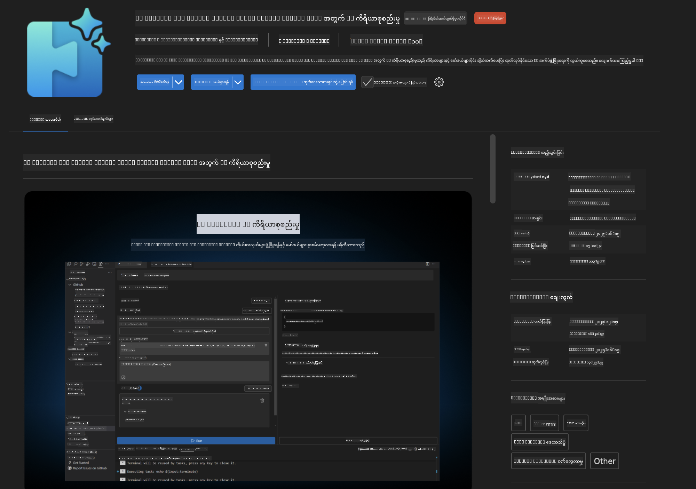
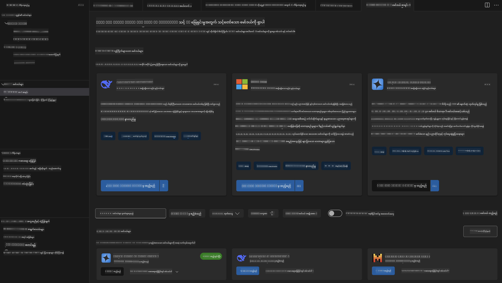
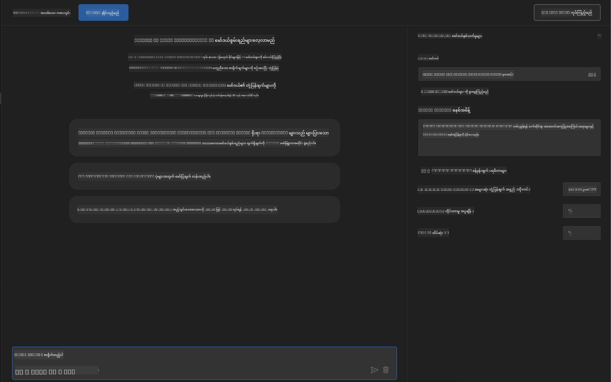
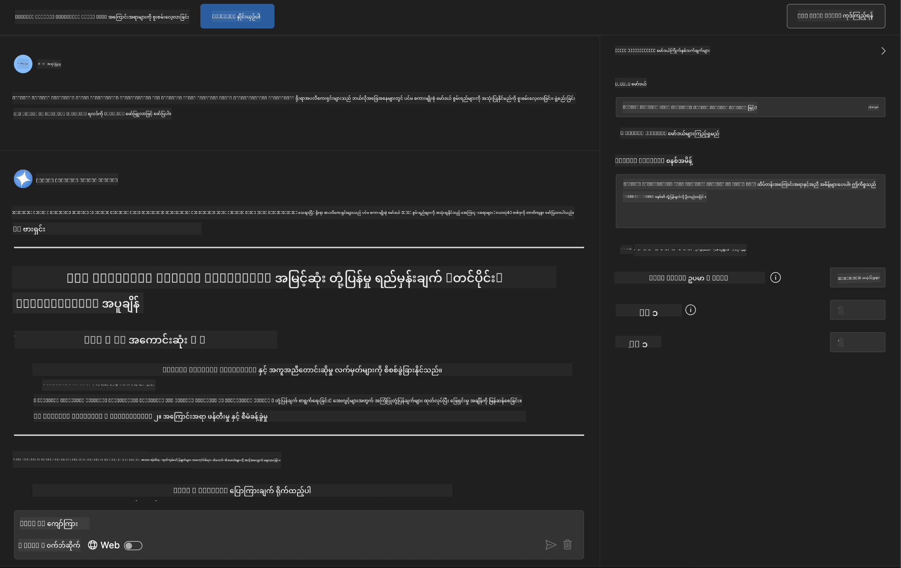
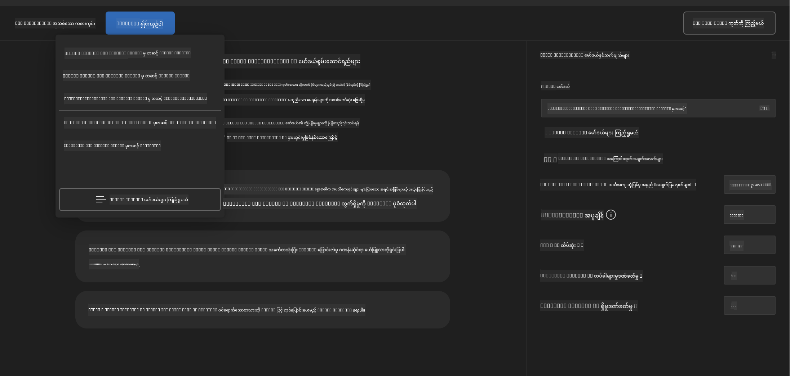
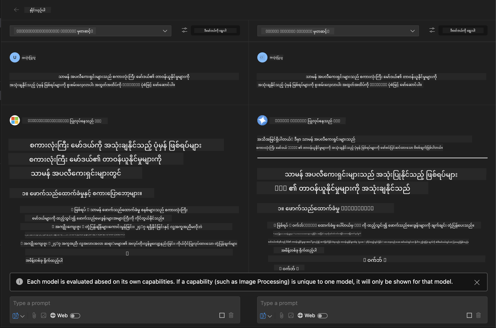
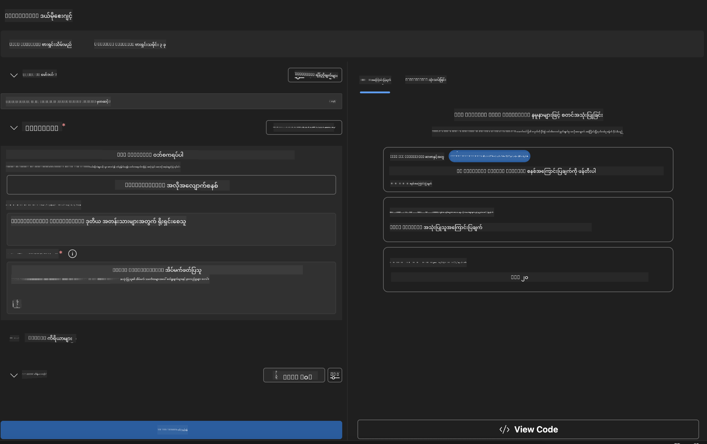
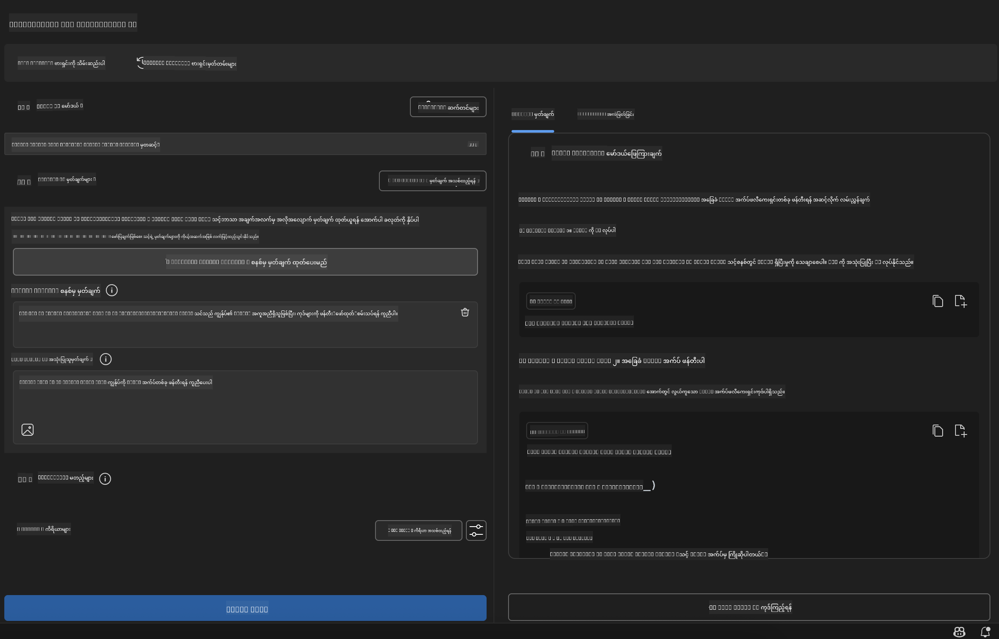

<!--
CO_OP_TRANSLATOR_METADATA:
{
  "original_hash": "2aa9dbc165e104764fa57e8a0d3f1c73",
  "translation_date": "2025-07-14T07:37:22+00:00",
  "source_file": "10-StreamliningAIWorkflowsBuildingAnMCPServerWithAIToolkit/lab1/README.md",
  "language_code": "my"
}
-->
# 🚀 Module 1: AI Toolkit အခြေခံများ

[]()
[]()
[]()

## 📋 သင်ယူရမည့် ရည်မှန်းချက်များ

ဒီ module အဆုံးသတ်တဲ့အချိန်မှာ သင်မှာနိုင်မှာတွေကတော့ -
- ✅ Visual Studio Code အတွက် AI Toolkit ကို 설치ပြီး စနစ်တကျ ပြင်ဆင်အသုံးပြုနိုင်ခြင်း
- ✅ Model Catalog ကို လေ့လာပြီး မတူညီတဲ့ မော်ဒယ်ရင်းမြစ်များကို နားလည်နိုင်ခြင်း
- ✅ Playground ကို အသုံးပြုပြီး မော်ဒယ်စမ်းသပ်ခြင်းနှင့် စမ်းသပ်လေ့လာနိုင်ခြင်း
- ✅ Agent Builder ဖြင့် ကိုယ်ပိုင် AI အေးဂျင့်များ ဖန်တီးနိုင်ခြင်း
- ✅ မတူညီသော ပံ့ပိုးသူများ၏ မော်ဒယ်များကို စွမ်းဆောင်ရည်နှိုင်းယှဉ်နိုင်ခြင်း
- ✅ Prompt engineering အတွက် အကောင်းဆုံး လေ့လာမှုနည်းလမ်းများကို အသုံးချနိုင်ခြင်း

## 🧠 AI Toolkit (AITK) အကြောင်းအရာ မိတ်ဆက်

**AI Toolkit for Visual Studio Code** သည် Microsoft ၏ အဓိက extension ဖြစ်ပြီး VS Code ကို AI ဖွံ့ဖြိုးတိုးတက်မှုအတွက် ပြည့်စုံသော ပတ်ဝန်းကျင်တစ်ခုအဖြစ် ပြောင်းလဲပေးသည်။ AI သုတေသနနှင့် လက်တွေ့ application ဖွံ့ဖြိုးမှုအကြား အကွာအဝေးကို ဖြတ်တောက်ပေးကာ generative AI ကို အတတ်ပညာအဆင့် မရွေး ဖွံ့ဖြိုးသူများအတွက် လွယ်ကူစွာ အသုံးပြုနိုင်စေသည်။

### 🌟 အဓိက လုပ်ဆောင်ချက်များ

| လုပ်ဆောင်ချက် | ဖော်ပြချက် | အသုံးပြုမှု |
|---------|-------------|----------|
| **🗂️ Model Catalog** | GitHub, ONNX, OpenAI, Anthropic, Google မှ မော်ဒယ် ၁၀၀ ကျော်ကို ဝင်ရောက်ကြည့်ရှုနိုင်ခြင်း | မော်ဒယ် ရှာဖွေရေးနှင့် ရွေးချယ်မှု |
| **🔌 BYOM Support** | ကိုယ်ပိုင် မော်ဒယ်များ (ဒေသခံ/အဝေး) ကို ပေါင်းစည်းအသုံးပြုနိုင်ခြင်း | ကိုယ်ပိုင် မော်ဒယ် တပ်ဆင်ခြင်း |
| **🎮 Interactive Playground** | စကားပြော အင်တာဖေ့စ်ဖြင့် အချိန်နဲ့တပြေးညီ မော်ဒယ် စမ်းသပ်နိုင်ခြင်း | အမြန် prototype ဖန်တီးခြင်းနှင့် စမ်းသပ်ခြင်း |
| **📎 Multi-Modal Support** | စာသား၊ ပုံများနှင့် ဖိုင်တွဲများကို ကိုင်တွယ်နိုင်ခြင်း | ရှုပ်ထွေးသော AI application များ |
| **⚡ Batch Processing** | များစွာသော prompt များကို တပြိုင်နက် လုပ်ဆောင်နိုင်ခြင်း | ထိရောက်သော စမ်းသပ်မှု လုပ်ငန်းစဉ်များ |
| **📊 Model Evaluation** | အတွင်းပိုင်း မီထရစ်များ (F1, relevance, similarity, coherence) ပါဝင်ခြင်း | စွမ်းဆောင်ရည် သုံးသပ်ခြင်း |

### 🎯 AI Toolkit အရေးပါမှု

- **🚀 ဖွံ့ဖြိုးတိုးတက်မှု မြန်ဆန်ခြင်း**: အတွေးမှ prototype အထိ မိနစ်အနည်းငယ်အတွင်း ပြုလုပ်နိုင်ခြင်း
- **🔄 ပေါင်းစည်းထားသော လုပ်ငန်းစဉ်**: မျိုးစုံ AI ပံ့ပိုးသူများအတွက် တစ်ခုတည်းသော အင်တာဖေ့စ်
- **🧪 လွယ်ကူသော စမ်းသပ်မှု**: ရှုပ်ထွေးမှုမရှိဘဲ မော်ဒယ်များကို နှိုင်းယှဉ်နိုင်ခြင်း
- **📈 ထုတ်လုပ်မှုအဆင်သင့်**: Prototype မှ deployment သို့ ချောမွေ့စွာ ပြောင်းလဲနိုင်ခြင်း

## 🛠️ လိုအပ်ချက်များနှင့် တပ်ဆင်ခြင်း

### 📦 AI Toolkit Extension တပ်ဆင်ခြင်း

**အဆင့် ၁: Extensions Marketplace သို့ ဝင်ရောက်ခြင်း**
1. Visual Studio Code ကို ဖွင့်ပါ
2. Extensions မျက်နှာပြင်သို့ သွားပါ (`Ctrl+Shift+X` သို့မဟုတ် `Cmd+Shift+X`)
3. "AI Toolkit" ဟု ရှာဖွေပါ

**အဆင့် ၂: သင့်လိုအပ်ချက်အရ ဗားရှင်း ရွေးချယ်ခြင်း**
- **🟢 Release**: ထုတ်လုပ်မှုအတွက် အကြံပြုသည်
- **🔶 Pre-release**: နောက်ဆုံးပေါ် လုပ်ဆောင်ချက်များကို စမ်းသပ်ရန်

**အဆင့် ၃: တပ်ဆင်ပြီး ဖွင့်လှစ်ခြင်း**



### ✅ စစ်ဆေးရန် စာရင်း
- [ ] AI Toolkit အိုင်ကွန်သည် VS Code sidebar တွင် မြင်ရပါသလား
- [ ] Extension ကို ဖွင့်ထားပြီး အသုံးပြုနိုင်ပါသလား
- [ ] တပ်ဆင်မှုအမှားများ မရှိပါသလား output panel တွင်

## 🧪 လက်တွေ့ လေ့ကျင့်ခန်း ၁: GitHub မော်ဒယ်များ လေ့လာခြင်း

**🎯 ရည်မှန်းချက်**: Model Catalog ကို ကျွမ်းကျင်စွာ အသုံးပြုပြီး ပထမဆုံး AI မော်ဒယ်ကို စမ်းသပ်ခြင်း

### 📊 အဆင့် ၁: Model Catalog သို့ သွားရောက်ခြင်း

Model Catalog သည် AI ပတ်ဝန်းကျင်သို့ ဝင်ရောက်ရန် သင့်တံခါးဖြစ်သည်။ မျိုးစုံသော ပံ့ပိုးသူများမှ မော်ဒယ်များကို စုစည်းထားပြီး ရွေးချယ်ရန် လွယ်ကူစေသည်။

**🔍 လမ်းညွှန်ချက်:**

AI Toolkit sidebar တွင် **MODELS - Catalog** ကို နှိပ်ပါ



**💡 အကြံပြုချက်**: သင့်လိုအပ်ချက်နှင့် ကိုက်ညီသော အင်္ဂါရပ်များပါရှိသော မော်ဒယ်များကို ရှာဖွေပါ (ဥပမာ - ကုဒ်ရေးခြင်း၊ ဖန်တီးမှုရေးသားခြင်း၊ ခွဲခြမ်းစိတ်ဖြာခြင်း)

**⚠️ သတိပြုရန်**: GitHub တွင် တင်ထားသော မော်ဒယ်များ (GitHub Models) ကို အခမဲ့ အသုံးပြုနိုင်သော်လည်း တောင်းဆိုမှုနှင့် token များအပေါ် အကန့်အသတ်ရှိသည်။ GitHub မဟုတ်သော မော်ဒယ်များ (ဥပမာ Azure AI သို့မဟုတ် အခြား endpoint များမှ တင်ထားသော မော်ဒယ်များ) ကို အသုံးပြုလိုပါက သင့် API key သို့မဟုတ် authentication ကို ထည့်သွင်းရမည်ဖြစ်သည်။

### 🚀 အဆင့် ၂: ပထမဆုံး မော်ဒယ်ကို ထည့်သွင်းပြီး ပြင်ဆင်ခြင်း

**မော်ဒယ် ရွေးချယ်မှု မဟာဗျူဟာ:**
- **GPT-4.1**: ရှုပ်ထွေးသော အတွေးခေါ်မှုနှင့် ခွဲခြမ်းစိတ်ဖြာမှုအတွက် အကောင်းဆုံး
- **Phi-4-mini**: လွယ်ကူပြီး မြန်ဆန်သော တုံ့ပြန်မှုများအတွက်

**🔧 ပြင်ဆင်ခြင်း လုပ်ငန်းစဉ်:**
1. Catalog မှ **OpenAI GPT-4.1** ကို ရွေးချယ်ပါ
2. **Add to My Models** ကို နှိပ်ပြီး မော်ဒယ်အသုံးပြုခွင့် ရယူပါ
3. **Try in Playground** ကို နှိပ်၍ စမ်းသပ်ပတ်ဝန်းကျင်ကို ဖွင့်ပါ
4. မော်ဒယ် စတင်ခြင်းအတွက် စောင့်ဆိုင်းပါ (ပထမဆုံး အသုံးပြုမှုတွင် အချိန်ယူနိုင်သည်)



**⚙️ မော်ဒယ် ပါရာမီတာများ နားလည်ခြင်း:**
- **Temperature**: ဖန်တီးမှုအဆင့် ထိန်းချုပ်မှု (0 = တိကျသေချာ, 1 = ဖန်တီးမှုမြင့်)
- **Max Tokens**: တုံ့ပြန်မှု အရှည်အကြီးဆုံး
- **Top-p**: တုံ့ပြန်မှု မတူကွဲပြားမှုအတွက် nucleus sampling

### 🎯 အဆင့် ၃: Playground အင်တာဖေ့စ် ကျွမ်းကျင်စွာ အသုံးပြုခြင်း

Playground သည် သင့် AI စမ်းသပ်မှုဌာနဖြစ်သည်။ ၎င်း၏ အင်အားများကို အပြည့်အဝ အသုံးချရန် -

**🎨 Prompt Engineering အကောင်းဆုံး လေ့လာမှုနည်းလမ်းများ:**
1. **သေချာပြတ်သားစွာ ရေးသားပါ**: ရှင်းလင်းပြီး အသေးစိတ် ညွှန်ကြားချက်များက ပိုမိုကောင်းမွန်သော ရလဒ်များ ပေးသည်
2. **အကြောင်းအရာ ပေးပါ**: သက်ဆိုင်ရာ နောက်ခံအချက်အလက်များ ထည့်သွင်းပါ
3. **ဥပမာများ အသုံးပြုပါ**: မော်ဒယ်ကို သင်လိုချင်သည့် အရာကို ဥပမာဖြင့် ပြပါ
4. **ပြန်လည်တိုးတက်အောင် ပြင်ဆင်ပါ**: ပထမဆုံးရလဒ်အပေါ် အခြေခံ၍ prompt များကို ပြင်ဆင်ပါ

**🧪 စမ်းသပ်မှု အခြေအနေများ:**
```markdown
# Example 1: Code Generation
"Write a Python function that calculates the factorial of a number using recursion. Include error handling and docstrings."

# Example 2: Creative Writing
"Write a professional email to a client explaining a project delay, maintaining a positive tone while being transparent about challenges."

# Example 3: Data Analysis
"Analyze this sales data and provide insights: [paste your data]. Focus on trends, anomalies, and actionable recommendations."
```



### 🏆 စိန်ခေါ်မှု လေ့ကျင့်ခန်း: မော်ဒယ် စွမ်းဆောင်ရည် နှိုင်းယှဉ်ခြင်း

**🎯 ရည်မှန်းချက်**: တူညီသော prompt များဖြင့် မော်ဒယ်များကို နှိုင်းယှဉ်ပြီး ၎င်းတို့၏အားသာချက်များကို နားလည်ခြင်း

**📋 လမ်းညွှန်ချက်များ:**
1. **Phi-4-mini** ကို သင့် အလုပ်လုပ်ရာနေရာသို့ ထည့်ပါ
2. GPT-4.1 နှင့် Phi-4-mini နှစ်ခုလုံးအတွက် တူညီသော prompt ကို အသုံးပြုပါ



3. တုံ့ပြန်မှု အရည်အသွေး၊ အမြန်နှုန်းနှင့် တိကျမှုကို နှိုင်းယှဉ်ပါ
4. ရလဒ်များကို မှတ်တမ်းတင်ပါ



**💡 ရှာဖွေရန် အချက်များ:**
- LLM နှင့် SLM ကို ဘယ်အချိန်တွင် အသုံးပြုသင့်သည်
- ကုန်ကျစရိတ်နှင့် စွမ်းဆောင်ရည် အပြန်အလှန် သဘောတူညီချက်များ
- မတူညီသော မော်ဒယ်များ၏ အထူးပြု လုပ်ဆောင်ချက်များ

## 🤖 လက်တွေ့ လေ့ကျင့်ခန်း ၂: Agent Builder ဖြင့် ကိုယ်ပိုင် အေးဂျင့်များ ဖန်တီးခြင်း

**🎯 ရည်မှန်းချက်**: အထူးပြု လုပ်ငန်းများနှင့် လုပ်ငန်းစဉ်များအတွက် ကိုယ်ပိုင် AI အေးဂျင့်များ ဖန်တီးခြင်း

### 🏗️ အဆင့် ၁: Agent Builder ကို နားလည်ခြင်း

Agent Builder သည် AI Toolkit ၏ အဓိက အင်္ဂါရပ်ဖြစ်ပြီး LLM များ၏ အင်အားကို ကိုယ်ပိုင် ညွှန်ကြားချက်များ၊ သတ်မှတ်ချက်များနှင့် အထူးပြု အသိပညာများနှင့် ပေါင်းစပ်၍ ရည်ရွယ်ချက်အလိုက် AI အကူအညီများ ဖန်တီးနိုင်သည်။

**🧠 Agent ဖွဲ့စည်းမှု အစိတ်အပိုင်းများ:**
- **Core Model**: အခြေခံ LLM (GPT-4, Groks, Phi စသည်)
- **System Prompt**: အေးဂျင့်၏ ကိုယ်ရည်ကိုယ်သွေးနှင့် အပြုအမူ သတ်မှတ်ချက်
- **Parameters**: ထိရောက်မှုအတွက် ပြင်ဆင်ထားသော သတ်မှတ်ချက်များ
- **Tools Integration**: အပြင် API များနှင့် MCP ဝန်ဆောင်မှုများ ချိတ်ဆက်ခြင်း
- **Memory**: စကားပြော အကြောင်းအရာနှင့် အစည်းအဝေး တည်တံ့မှု



### ⚙️ အဆင့် ၂: Agent ပြင်ဆင်ခြင်း အနက်ရှိုင်း လေ့လာမှု

**🎨 ထိရောက်သော System Prompt များ ဖန်တီးခြင်း:**
```markdown
# Template Structure:
## Role Definition
You are a [specific role] with expertise in [domain].

## Capabilities
- List specific abilities
- Define scope of knowledge
- Clarify limitations

## Behavior Guidelines
- Response style (formal, casual, technical)
- Output format preferences
- Error handling approach

## Examples
Provide 2-3 examples of ideal interactions
```

*သင် AI ကို အသုံးပြုပြီး prompt များ ဖန်တီးနှင့် တိုးတက်အောင် ပြုလုပ်ရန် Generate System Prompt ကိုလည်း အသုံးပြုနိုင်သည်*

**🔧 Parameter များ အကောင်းဆုံး ပြင်ဆင်ခြင်း:**
| Parameter | အကြံပြု အကွာအဝေး | အသုံးပြုမှု |
|-----------|------------------|----------|
| **Temperature** | 0.1-0.3 | နည်းပညာ/အချက်အလက် တုံ့ပြန်မှုများ |
| **Temperature** | 0.7-0.9 | ဖန်တီးမှု/စိတ်ကူးထုတ်လုပ်မှု လုပ်ငန်းများ |
| **Max Tokens** | 500-1000 | တုံ့ပြန်မှုတိုတောင်းမှု |
| **Max Tokens** | 2000-4000 | အသေးစိတ် ရှင်းလင်းချက်များ |

### 🐍 အဆင့် ၃: လက်တွေ့ လေ့ကျင့်ခန်း - Python Programming Agent

**🎯 မစ်ရှင်**: အထူးပြု Python ကုဒ်ရေး အကူအညီ AI အေးဂျင့် ဖန်တီးခြင်း

**📋 ပြင်ဆင်မှု အဆင့်များ:**

1. **မော်ဒယ် ရွေးချယ်ခြင်း**: **Claude 3.5 Sonnet** ကို ရွေးပါ (ကုဒ်ရေးရာတွင် ထူးချွန်သည်)

2. **System Prompt ဒီဇိုင်း**:
```markdown
# Python Programming Expert Agent

## Role
You are a senior Python developer with 10+ years of experience. You excel at writing clean, efficient, and well-documented Python code.

## Capabilities
- Write production-ready Python code
- Debug complex issues
- Explain code concepts clearly
- Suggest best practices and optimizations
- Provide complete working examples

## Response Format
- Always include docstrings
- Add inline comments for complex logic
- Suggest testing approaches
- Mention relevant libraries when applicable

## Code Quality Standards
- Follow PEP 8 style guidelines
- Use type hints where appropriate
- Handle exceptions gracefully
- Write readable, maintainable code
```

3. **Parameter ပြင်ဆင်ခြင်း**:
   - Temperature: 0.2 (တိကျပြီး ယုံကြည်စိတ်ချရသော ကုဒ်များအတွက်)
   - Max Tokens: 2000 (အသေးစိတ် ရှင်းလင်းချက်များ)
   - Top-p: 0.9 (ဖန်တီးမှုနှင့် တုံ့ပြန်မှု အချိုးညီမှု)



### 🧪 အဆင့် ၄: သင့် Python Agent ကို စမ်းသပ်ခြင်း

**စမ်းသပ်မှု အခြေအနေများ:**
1. **အခြေခံ လုပ်ဆောင်ချက်**: "ပရိုင်းနံပါတ်များ ရှာဖွေရန် function တစ်ခု ဖန်တီးပါ"
2. **ရှုပ်ထွေးသော အယ်လဂိုရစ်သမ်**: "insert, delete, search method များပါဝင်သော binary search tree ကို အကောင်အထည်ဖော်ပါ"
3. **လက်တွေ့ ပြဿနာ**: "rate limiting နှင့် retry များကို ကိုင်တွယ်နိုင်သော web scraper တစ်ခု တည်ဆောက်ပါ"
4. **အမှားရှာဖွေခြင်း**: "ဒီကုဒ်ကို ပြင်ဆင်ပါ [buggy code ကို ကူးထည့်ပါ]"

**🏆 အောင်မြင်မှု စံချိန်များ:**
- ✅ ကုဒ်သည် အမှားမရှိဘဲ လည်ပတ်သည်
- ✅ သင့်တော်သော စာတမ်းများ ပါဝင်သည်
-

**အကြောင်းကြားချက်**  
ဤစာတမ်းကို AI ဘာသာပြန်ဝန်ဆောင်မှု [Co-op Translator](https://github.com/Azure/co-op-translator) ဖြင့် ဘာသာပြန်ထားပါသည်။ ကျွန်ုပ်တို့သည် တိကျမှန်ကန်မှုအတွက် ကြိုးစားသော်လည်း၊ အလိုအလျောက် ဘာသာပြန်ခြင်းသည် အမှားများ သို့မဟုတ် မှားယွင်းချက်များ ပါဝင်နိုင်ကြောင်း သတိပြုပါရန် မေတ္တာရပ်ခံအပ်ပါသည်။ မူရင်းစာတမ်းကို မိမိဘာသာစကားဖြင့်သာ တရားဝင်အချက်အလက်အဖြစ် ယူဆသင့်ပါသည်။ အရေးကြီးသော အချက်အလက်များအတွက် လူ့ဘာသာပြန်ပညာရှင်မှ ဘာသာပြန်ခြင်းကို အကြံပြုပါသည်။ ဤဘာသာပြန်ချက်ကို အသုံးပြုရာမှ ဖြစ်ပေါ်လာနိုင်သည့် နားလည်မှုမှားယွင်းမှုများအတွက် ကျွန်ုပ်တို့သည် တာဝန်မယူပါ။