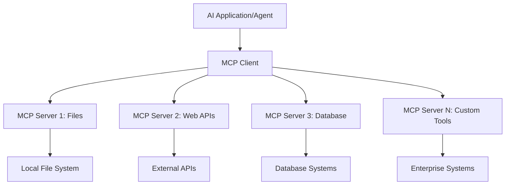
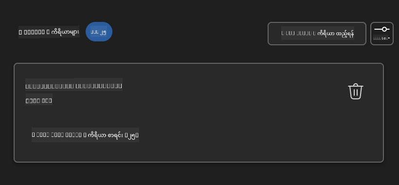
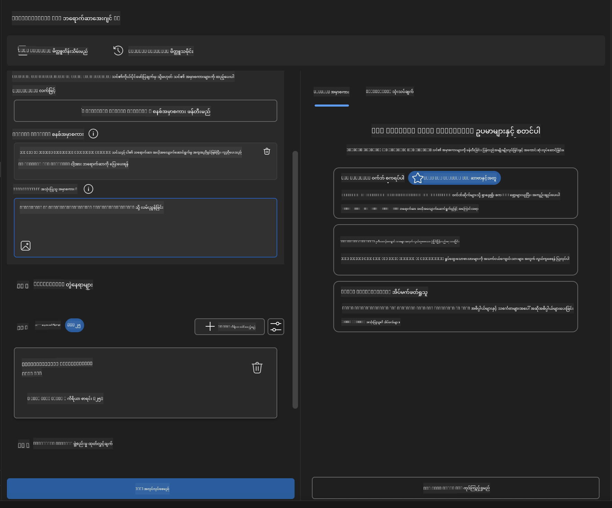

<!--
CO_OP_TRANSLATOR_METADATA:
{
  "original_hash": "a22b7dd11cd7690f99f9195877cafdc3",
  "translation_date": "2025-06-17T16:33:27+00:00",
  "source_file": "10-StreamliningAIWorkflowsBuildingAnMCPServerWithAIToolkit/lab2/README.md",
  "language_code": "my"
}
-->
# 🌐 Module 2: MCP နှင့် AI Toolkit အခြေခံများ

[]()
[]()
[]()

## 📋 သင်ယူရမည့် ရည်မှန်းချက်များ

ဒီ module အဆုံးသတ်ချိန်မှာ သင်သည်
- ✅ Model Context Protocol (MCP) ၏ ဖွဲ့စည်းပုံနှင့် အကျိုးကျေးဇူးများကို နားလည်နိုင်မည်
- ✅ Microsoft ၏ MCP server ecosystem ကို ရှာဖွေ လေ့လာနိုင်မည်
- ✅ MCP servers များကို AI Toolkit Agent Builder နှင့် ပေါင်းစည်းနိုင်မည်
- ✅ Playwright MCP ကို အသုံးပြုပြီး လုပ်ဆောင်နိုင်သော browser automation agent တစ်ခု တည်ဆောက်နိုင်မည်
- ✅ MCP tools များကို သင့် agent များထဲတွင် ပြင်ဆင် စမ်းသပ်နိုင်မည်
- ✅ MCP ပါဝင်သော agent များကို ထုတ်ပေးပြီး ထုတ်လုပ်မှုအတွက် တပ်ဆင်နိုင်မည်

## 🎯 Module 1 အပေါ် အခြေခံ၍ ဆက်လက်တည်ဆောက်ခြင်း

Module 1 တွင် AI Toolkit အခြေခံများကို ကျွမ်းကျင်ပြီး ပထမဆုံး Python Agent ကို ဖန်တီးခဲ့ပါပြီ။ ယခုမှာတော့ သင့် agent များကို ပြောင်းလဲစွမ်းဆောင်နိုင်စေရန် နောက်ထပ် အင်အားမြှင့်ရန် Model Context Protocol (MCP) အား အသုံးပြု၍ ပြင်ပကိရိယာများနှင့် ဝန်ဆောင်မှုများနှင့် ချိတ်ဆက်ပေးမှာ ဖြစ်ပါတယ်။

ဒါကို အခြေခံ calculator ကနေ တစ်လုံးလုံး ကွန်ပျူတာသို့ တိုးတက်အောင်မြင်ခြင်းလို ထင်မြင်နိုင်ပါသည်။ သင့် AI agent များသည် အောက်ပါအရာများကို လုပ်ဆောင်နိုင်ပါမည်။
- 🌐 ဝက်ဘ်ဆိုက်များကို ကြည့်ရှု ဆက်သွယ်နိုင်ခြင်း
- 📁 ဖိုင်များကို ဝင်ရောက် စီမံခန့်ခွဲနိုင်ခြင်း
- 🔧 စီးပွားရေးစနစ်များနှင့် ပေါင်းစည်းနိုင်ခြင်း
- 📊 API များမှ အချိန်နှင့်တပြေးညီ ဒေတာများကို ပြန်လည်လုပ်ဆောင်နိုင်ခြင်း

## 🧠 Model Context Protocol (MCP) ကို နားလည်ခြင်း

### 🔍 MCP ဆိုတာ ဘာလဲ?

Model Context Protocol (MCP) သည် **"AI application များအတွက် USB-C"** ဟု ခေါ်ဆိုနိုင်သော ပြောင်းလဲတီထွင်မှုတစ်ခုဖြစ်ပြီး၊ Large Language Models (LLMs) များကို ပြင်ပကိရိယာများ၊ ဒေတာရင်းမြစ်များနှင့် ဝန်ဆောင်မှုများနှင့် ချိတ်ဆက်ပေးသော ဖွဲ့စည်းပုံတစ်ခုဖြစ်သည်။ USB-C က ဘေးကင်းလုံခြုံပြီး တစ်မျိုးတည်းသော ချိတ်ဆက်စနစ်ဖြင့် ချိတ်ဆက်မှုများကို လွယ်ကူစေသလို MCP သည် AI ပေါင်းစည်းမှု အခက်အခဲများကို တစ်မျိုးတည်းသော စံပြ စံနမူနာဖြင့် ဖြေရှင်းပေးသည်။

### 🎯 MCP ဖြေရှင်းပေးသော ပြဿနာများ

**MCP မရှိခင်:**
- 🔧 ကိရိယာတစ်ခုစီအတွက် စိတ်တိုင်းကျ ပေါင်းစည်းမှုများ
- 🔄 ပိုင်ဆိုင်သူအပေါ် မူတည်သော vendor lock-in
- 🔒 အဆင်မပြေသော ချိတ်ဆက်မှုများကြောင့် လုံခြုံရေး ပြဿနာများ
- ⏱️ အခြေခံ ပေါင်းစည်းမှုများအတွက် လစဉ် ကြာမြင့်သော ဖွံ့ဖြိုးမှု

**MCP ဖြင့်:**
- ⚡ အလွယ်တကူ ချိတ်ဆက်အသုံးပြုနိုင်သော tool များ
- 🔄 Vendor မပေါ်မူတည်သော ဖွဲ့စည်းပုံ
- 🛡️ အတွင်းစိတ် လုံခြုံရေး စံပြများပါရှိခြင်း
- 🚀 အသစ်သော လုပ်ဆောင်ချက်များကို မိနစ်ပိုင်းအတွင်း ထည့်သွင်းနိုင်ခြင်း

### 🏗️ MCP Architecture အကြောင်း အနက်ရှိုင်းစွာ

MCP သည် **client-server architecture** ကို အသုံးပြုပြီး လုံခြုံ၍ တိုးချဲ့နိုင်သော ecosystem တစ်ခု ဖန်တီးပေးသည်။



**🔧 အဓိက အစိတ်အပိုင်းများ**

| အစိတ်အပိုင်း | အခန်းကဏ္ဍ | ဥပမာများ |
|-----------|------|----------|
| **MCP Hosts** | MCP ဝန်ဆောင်မှုများကို အသုံးပြုသော အပလီကေးရှင်းများ | Claude Desktop, VS Code, AI Toolkit |
| **MCP Clients** | Protocol ကို ကိုင်တွယ်သူများ (server နှင့် ၁:၁ ဆက်သွယ်မှု) | Host applications များထဲတွင် ပါရှိသည် |
| **MCP Servers** | စံပြ protocol ဖြင့် လုပ်ဆောင်ချက်များ ဖော်ပြသူ | Playwright, Files, Azure, GitHub |
| **Transport Layer** | ဆက်သွယ်ရေး နည်းလမ်းများ | stdio, HTTP, WebSockets |

## 🏢 Microsoft ၏ MCP Server Ecosystem

Microsoft သည် စီးပွားရေးအဆင့်မြင့် server များစွာဖြင့် MCP ecosystem ကို ဦးဆောင်ကာ လုပ်ငန်းလိုအပ်ချက်များကို ဖြည့်ဆည်းပေးနေပါသည်။

### 🌟 Microsoft MCP Servers ထူးခြားသော အစိတ်အပိုင်းများ

#### 1. ☁️ Azure MCP Server  
**🔗 Repository**: [azure/azure-mcp](https://github.com/azure/azure-mcp)  
**🎯 ရည်ရွယ်ချက်**: AI ပေါင်းစည်းမှုဖြင့် Azure အရင်းအမြစ်များ စီမံခန့်ခွဲမှု လုပ်ဆောင်ခြင်း  

**✨ အဓိက လုပ်ဆောင်ချက်များ**  
- Infrastructure ကို ကြေညာချက်အတိုင်း ဖန်တီးခြင်း  
- အချိန်နှင့်တပြေးညီ အရင်းအမြစ် စောင့်ကြည့်မှု  
- ကုန်ကျစရိတ် လျှော့ချမှု အကြံပြုချက်များ  
- လုံခြုံရေး စံနှုန်းများ စစ်ဆေးခြင်း  

**🚀 အသုံးပြုမှုများ**  
- AI ကူညီမှုဖြင့် Infrastructure-as-Code  
- အလိုအလျောက် အရင်းအမြစ် တိုးချဲ့ခြင်း  
- Cloud ကုန်ကျစရိတ် ထိန်းသိမ်းခြင်း  
- DevOps လုပ်ငန်းစဉ်များ အလိုအလျောက် ဆောင်ရွက်ခြင်း  

#### 2. 📊 Microsoft Dataverse MCP  
**📚 စာတမ်းများ**: [Microsoft Dataverse Integration](https://go.microsoft.com/fwlink/?linkid=2320176)  
**🎯 ရည်ရွယ်ချက်**: စီးပွားရေးဒေတာများအတွက် သဘာဝဘာသာစကား အင်တာဖေ့စ်  

**✨ အဓိက လုပ်ဆောင်ချက်များ**  
- သဘာဝဘာသာစကားဖြင့် ဒေတာရှာဖွေခြင်း  
- စီးပွားရေးအကြောင်းအရာ နားလည်ခြင်း  
- စိတ်ကြိုက် prompt စံနမူနာများ  
- စီးပွားရေးဒေတာ အုပ်ချုပ်မှု  

**🚀 အသုံးပြုမှုများ**  
- စီးပွားရေးသတင်းအချက်အလက် အစီရင်ခံစာ  
- ဖောက်သည် ဒေတာ ခွဲခြမ်းစိတ်ဖြာခြင်း  
- အရောင်း လမ်းကြောင်း သုံးသပ်ချက်  
- လိုက်နာမှု ဒေတာ ရှာဖွေမှု  

#### 3. 🌐 Playwright MCP Server  
**🔗 Repository**: [microsoft/playwright-mcp](https://github.com/microsoft/playwright-mcp)  
**🎯 ရည်ရွယ်ချက်**: Browser automation နှင့် ဝက်ဘ်ဆက်သွယ်မှု လုပ်ဆောင်ချက်များ  

**✨ အဓိက လုပ်ဆောင်ချက်များ**  
- မျိုးစုံ browser များအတွက် automation (Chrome, Firefox, Safari)  
- ထူးခြားသော အစိတ်အပိုင်းများ ရှာဖွေခြင်း  
- Screenshot နှင့် PDF ဖန်တီးခြင်း  
- ကွန်ယက် traffic စောင့်ကြည့်ခြင်း  

**🚀 အသုံးပြုမှုများ**  
- အလိုအလျောက် စမ်းသပ်မှု လုပ်ငန်းစဉ်များ  
- ဝက်ဘ် scraping နှင့် ဒေတာ ရယူခြင်း  
- UI/UX စောင့်ကြည့်မှု  
- ပြိုင်ဘက် သုံးသပ်မှု အလိုအလျောက် ဆောင်ရွက်ခြင်း  

#### 4. 📁 Files MCP Server  
**🔗 Repository**: [microsoft/files-mcp-server](https://github.com/microsoft/files-mcp-server)  
**🎯 ရည်ရွယ်ချက်**: ဉာဏ်ရည်ရှိသော ဖိုင်စနစ် လုပ်ဆောင်ချက်များ  

**✨ အဓိက လုပ်ဆောင်ချက်များ**  
- ကြေညာချက်အတိုင်း ဖိုင် စီမံခန့်ခွဲမှု  
- အကြောင်းအရာ ကိုက်ညီမှု  
- ဗားရှင်း ထိန်းချုပ်မှု ပေါင်းစည်းမှု  
- မီတာဒေတာ ရယူခြင်း  

**🚀 အသုံးပြုမှုများ**  
- စာတမ်း စီမံခန့်ခွဲမှု  
- ကုဒ် ရှာဖွေမှု စနစ်  
- အကြောင်းအရာ ထုတ်ဝေမှု လုပ်ငန်းစဉ်များ  
- ဒေတာ လမ်းကြောင်း ဖိုင် ကိုင်တွယ်မှု  

#### 5. 📝 MarkItDown MCP Server  
**🔗 Repository**: [microsoft/markitdown](https://github.com/microsoft/markitdown)  
**🎯 ရည်ရွယ်ချက်**: Markdown ကို အဆင့်မြှင့် လုပ်ဆောင်ခြင်းနှင့် ပြင်ဆင်ခြင်း  

**✨ အဓိက လုပ်ဆောင်ချက်များ**  
- ကြွယ်ဝသော Markdown ဖော်ပြချက်  
- ဖော်မတ် ပြောင်းလဲခြင်း (MD ↔ HTML ↔ PDF)  
- အကြောင်းအရာ ဖွဲ့စည်းမှု ခွဲခြမ်းစိတ်ဖြာခြင်း  
- စံနမူနာ တင်ပြမှု  

**🚀 အသုံးပြုမှုများ**  
- နည်းပညာစာတမ်း လုပ်ငန်းစဉ်များ  
- အကြောင်းအရာ စီမံခန့်ခွဲမှု စနစ်များ  
- အစီရင်ခံစာ ထုတ်လုပ်ခြင်း  
- ဗဟုသုတ အခြေခံ စနစ် အလိုအလျောက်လုပ်ဆောင်ခြင်း  

#### 6. 📈 Clarity MCP Server  
**📦 Package**: [@microsoft/clarity-mcp-server](https://www.npmjs.com/package/@microsoft/clarity-mcp-server)  
**🎯 ရည်ရွယ်ချက်**: ဝက်ဘ်ဆိုက် သုံးစွဲသူ လှုပ်ရှားမှုများနှင့် အသုံးပြုသူ အပြုအမူ သိရှိမှု  

**✨ အဓိက လုပ်ဆောင်ချက်များ**  
- အပူမြေပုံ ဒေတာ ခွဲခြမ်းစိတ်ဖြာခြင်း  
- အသုံးပြုသူ စက်ရှင် မှတ်တမ်းတင်ခြင်း  
- စွမ်းဆောင်ရည် တိုင်းတာချက်များ  
- ပြောင်းလဲမှု လမ်းကြောင်း သုံးသပ်ခြင်း  

**🚀 အသုံးပြုမှုများ**  
- ဝက်ဘ်ဆိုက် အကောင်းမြှင့်တင်ခြင်း  
- အသုံးပြုသူ အတွေ့အကြုံ သုတေသန  
- A/B စမ်းသပ်မှု သုံးသပ်ချက်  
- စီးပွားရေး သတင်းအချက်အလက် ဒိုင်ယာဂရမ်များ  

### 🌍 အသိုင်းအဝိုင်း Ecosystem

Microsoft ၏ server များအပြင် MCP ecosystem တွင် ပါဝင်သည့် အခြားအရာများမှာ
- **🐙 GitHub MCP**: Repository စီမံခန့်ခွဲမှုနှင့် ကုဒ် ခွဲခြမ်းစိတ်ဖြာမှု
- **🗄️ Database MCPs**: PostgreSQL, MySQL, MongoDB ပေါင်းစည်းမှုများ
- **☁️ Cloud Provider MCPs**: AWS, GCP, Digital Ocean ကိရိယာများ
- **📧 ဆက်သွယ်ရေး MCPs**: Slack, Teams, Email ပေါင်းစည်းမှုများ

## 🛠️ လက်တွေ့ လေ့ကျင့်ခန်း: Browser Automation Agent တည်ဆောက်ခြင်း

**🎯 စီမံကိန်း ရည်မှန်းချက်**: Playwright MCP server ကို အသုံးပြုပြီး ဝက်ဘ်ဆိုက်များကို လည်ပတ်၍ သတင်းအချက်အလက် ရယူပြီး ဝက်ဘ်ဆက်သွယ်မှုများကို စွမ်းဆောင်နိုင်သော ဉာဏ်ရည်ရှိ browser automation agent တစ်ခု ဖန်တီးခြင်း။

### 🚀 အဆင့် ၁: Agent အခြေခံ ပြင်ဆင်ခြင်း

#### အဆင့် ၁: သင့် Agent ကို စတင်ဖန်တီးပါ  
1. **AI Toolkit Agent Builder ကို ဖွင့်ပါ**  
2. **Agent အသစ် ဖန်တီးပါ** အောက်ပါ ပြင်ဆင်မှုများဖြင့်  
   - **Name**: `BrowserAgent`
   - **Model**: Choose GPT-4o 


### 🔧 Phase 2: MCP Integration Workflow

#### Step 3: Add MCP Server Integration
1. **Navigate to Tools Section** in Agent Builder
2. **Click "Add Tool"** to open the integration menu
3. **Select "MCP Server"** from available options


**🔍 Understanding Tool Types:**
- **Built-in Tools**: Pre-configured AI Toolkit functions
- **MCP Servers**: External service integrations
- **Custom APIs**: Your own service endpoints
- **Function Calling**: Direct model function access

#### Step 4: MCP Server Selection
1. **Choose "MCP Server"** option to proceed


2. **Browse MCP Catalog** to explore available integrations


### 🎮 Phase 3: Playwright MCP Configuration

#### Step 5: Select and Configure Playwright
1. **Click "Use Featured MCP Servers"** to access Microsoft's verified servers
2. **Select "Playwright"** from the featured list
3. **Accept Default MCP ID** or customize for your environment


#### Step 6: Enable Playwright Capabilities
**🔑 Critical Step**: Select **ALL** available Playwright methods for maximum functionality


**🛠️ Essential Playwright Tools:**
- **Navigation**: `goto`, `goBack`, `goForward`, `reload`
- **Interaction**: `click`, `fill`, `press`, `hover`, `drag`
- **Extraction**: `textContent`, `innerHTML`, `getAttribute`
- **Validation**: `isVisible`, `isEnabled`, `waitForSelector`
- **Capture**: `screenshot`, `pdf`, `video`
- **Network**: `setExtraHTTPHeaders`, `route`, `waitForResponse`

#### အဆင့် ၇: ပေါင်းစည်းမှု အောင်မြင်မှုကို စစ်ဆေးပါ  
**✅ အောင်မြင်မှု အညွှန်းများ**  
- Agent Builder အင်တာဖေ့စ်တွင် ကိရိယာများအားလုံး မြင်သာခြင်း  
- ပေါင်းစည်းမှု ပန်းနားတွင် အမှားမရှိခြင်း  
- Playwright server အခြေအနေ "Connected" ဟု ပြသခြင်း  



**🔧 အကြံပြုချက်များ - ပြဿနာဖြေရှင်းခြင်း**  
- **ဆက်သွယ်မှု မအောင်မြင်ပါ**: အင်တာနက် ချိတ်ဆက်မှုနှင့် firewall ပြဿနာများ စစ်ဆေးပါ  
- **ကိရိယာ မပါဝင်ပါ**: ပြင်ဆင်ချိန်တွင် လိုအပ်သော လုပ်ဆောင်ချက်များ ရွေးချယ်ထားသည်ကို သေချာစစ်ဆေးပါ  
- **ခွင့်ပြုချက် အမှားများ**: VS Code တွင် လိုအပ်သော စနစ်ခွင့်ပြုချက်များ ရှိသည်ကို စစ်ဆေးပါ  

### 🎯 အဆင့် ၄: အဆင့်မြင့် Prompt Engineering

#### အဆင့် ၈: ဉာဏ်ရည်ရှိသော System Prompt များ ဒီဇိုင်းဆွဲပါ  
Playwright ၏ လုပ်ဆောင်ချက်များ အပြည့်အစုံကို အသုံးချနိုင်သော prompt များ ဖန်တီးပါ။

```markdown
# Web Automation Expert System Prompt

## Core Identity
You are an advanced web automation specialist with deep expertise in browser automation, web scraping, and user experience analysis. You have access to Playwright tools for comprehensive browser control.

## Capabilities & Approach
### Navigation Strategy
- Always start with screenshots to understand page layout
- Use semantic selectors (text content, labels) when possible
- Implement wait strategies for dynamic content
- Handle single-page applications (SPAs) effectively

### Error Handling
- Retry failed operations with exponential backoff
- Provide clear error descriptions and solutions
- Suggest alternative approaches when primary methods fail
- Always capture diagnostic screenshots on errors

### Data Extraction
- Extract structured data in JSON format when possible
- Provide confidence scores for extracted information
- Validate data completeness and accuracy
- Handle pagination and infinite scroll scenarios

### Reporting
- Include step-by-step execution logs
- Provide before/after screenshots for verification
- Suggest optimizations and alternative approaches
- Document any limitations or edge cases encountered

## Ethical Guidelines
- Respect robots.txt and rate limiting
- Avoid overloading target servers
- Only extract publicly available information
- Follow website terms of service
```

#### အဆင့် ၉: လှုပ်ရှားမှု ပြသသော User Prompt များ ဖန်တီးပါ  
အမျိုးမျိုးသော လုပ်ဆောင်ချက်များကို ပြသနိုင်သော prompt များ ဒီဇိုင်းဆွဲပါ။

**🌐 ဝက်ဘ် အချက်အလက် ခွဲခြမ်းစိတ်ဖြာမှု ဥပမာ**  
```markdown
Navigate to github.com/kinfey and provide a comprehensive analysis including:
1. Repository structure and organization
2. Recent activity and contribution patterns  
3. Documentation quality assessment
4. Technology stack identification
5. Community engagement metrics
6. Notable projects and their purposes

Include screenshots at key steps and provide actionable insights.
```



### 🚀 အဆင့် ၅: အကောင်အထည်ဖော်ခြင်းနှင့် စမ်းသပ်ခြင်း

#### အဆင့် ၁၀: ပထမဆုံး အလိုအလျောက် လုပ်ဆောင်မှုကို စတင်ပါ  
1. **"Run" ကို နှိပ်ပြီး automation စတင်ပါ**  
2. **အချိန်နှင့်တပြေးညီ လုပ်ဆောင်မှုကို ကြည့်ရှုပါ**  
   - Chrome browser ကို အလိုအလျောက် ဖွင့်ပါမည်  
   - Agent သည် ရည်မှန်းထားသော ဝက်ဘ်ဆိုက်သို့ သွားရောက်ပါ

**အတည်မပြုချက်**  
ဤစာတမ်းကို AI ဘာသာပြန်ဝန်ဆောင်မှုဖြစ်သော [Co-op Translator](https://github.com/Azure/co-op-translator) ကို အသုံးပြု၍ ဘာသာပြန်ထားပါသည်။ ကျွန်ုပ်တို့သည် တိကျမှန်ကန်မှုအတွက် ကြိုးစားသော်လည်း အလိုအလျောက်ဘာသာပြန်မှုများတွင် အမှားများ သို့မဟုတ် မှန်ကန်မှုမရှိမှုများ ဖြစ်ပေါ်နိုင်ကြောင်း သတိပြုပါရန် လိုအပ်ပါသည်။ မူရင်းစာတမ်းကို မူလဘာသာဖြင့်သာ အတည်ပြုရမည့် အရင်းအမြစ်အဖြစ်ယူဆသင့်ပါသည်။ အရေးကြီးသော အချက်အလက်များအတွက် မျက်နှာသာလူသား ဘာသာပြန်ခြင်းကို အကြံပြုပါသည်။ ဤဘာသာပြန်ချက်ကို အသုံးပြုမှုကြောင့် ဖြစ်ပေါ်နိုင်သည့် နားလည်မှုမှားခြင်း သို့မဟုတ် အဓိပ္ပာယ်မှားခြင်းများအတွက် ကျွန်ုပ်တို့သည် တာဝန်မယူပါ။