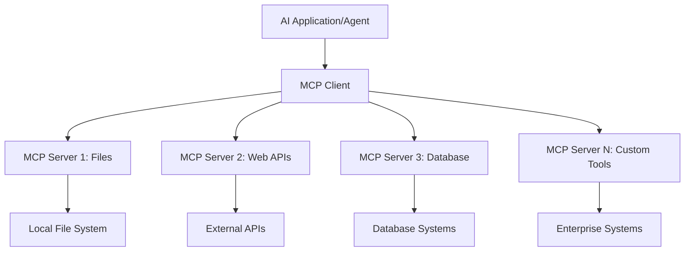
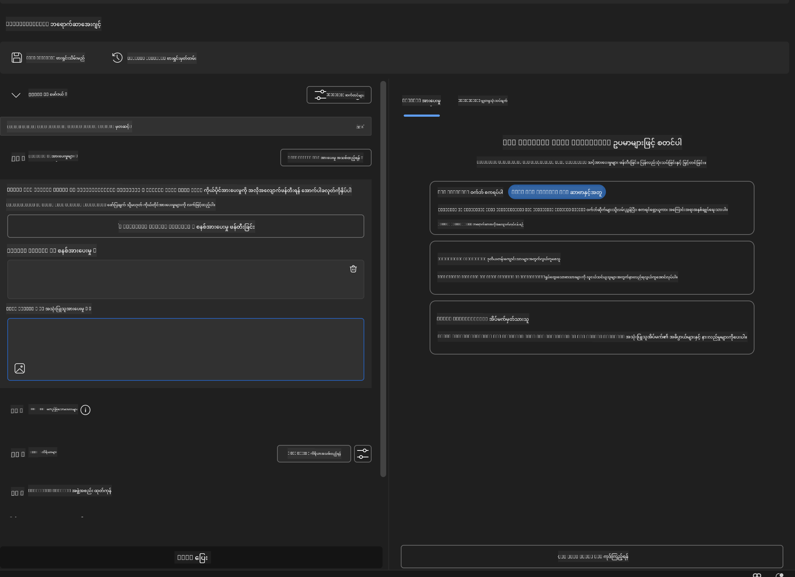
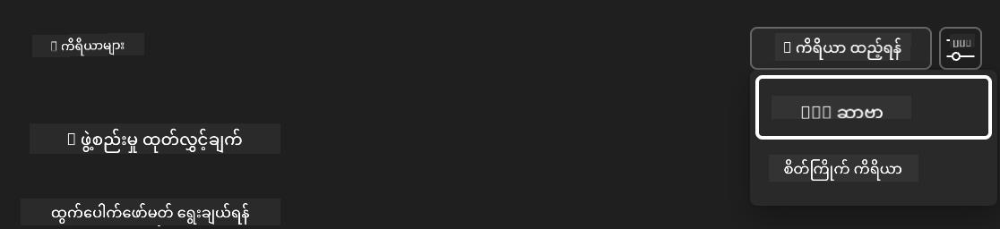
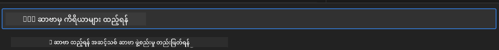
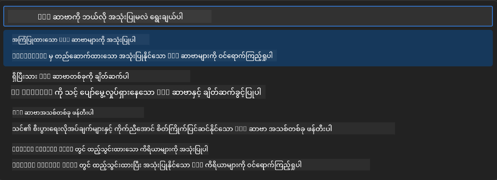
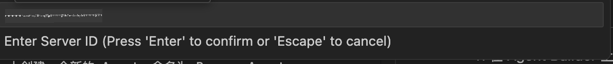
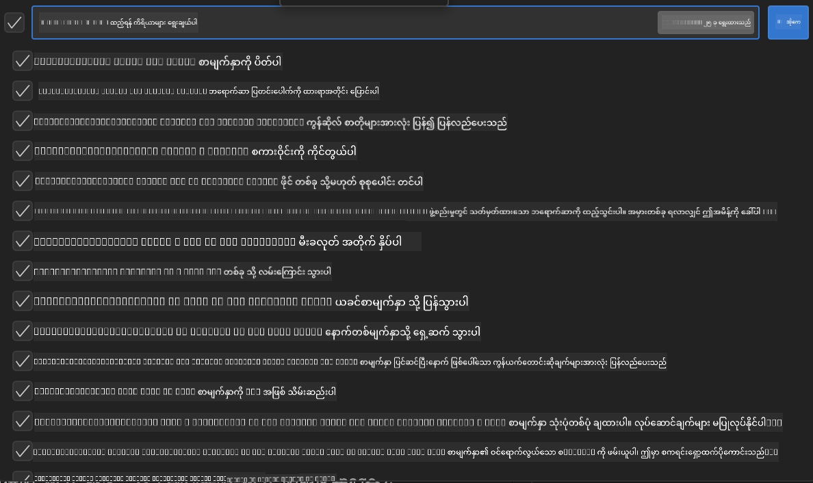

<!--
CO_OP_TRANSLATOR_METADATA:
{
  "original_hash": "a22b7dd11cd7690f99f9195877cafdc3",
  "translation_date": "2025-07-14T08:04:48+00:00",
  "source_file": "10-StreamliningAIWorkflowsBuildingAnMCPServerWithAIToolkit/lab2/README.md",
  "language_code": "my"
}
-->
# 🌐 Module 2: MCP နှင့် AI Toolkit အခြေခံများ

## 📋 သင်ယူရမည့် ရည်မှန်းချက်များ

ဒီ module အဆုံးသတ်တဲ့အချိန်မှာ သင်မှာ အောက်ပါအရာတွေကို လုပ်နိုင်ပါလိမ့်မယ်။
- ✅ Model Context Protocol (MCP) ၏ ဖွဲ့စည်းပုံနှင့် အကျိုးကျေးဇူးများကို နားလည်ခြင်း
- ✅ Microsoft ၏ MCP server ပတ်ဝန်းကျင်ကို ရှာဖွေခြင်း
- ✅ MCP servers များကို AI Toolkit Agent Builder နှင့် ပေါင်းစပ်ခြင်း
- ✅ Playwright MCP ကို အသုံးပြု၍ လုပ်ဆောင်နိုင်သော browser automation agent တစ်ခု တည်ဆောက်ခြင်း
- ✅ သင့် agent များအတွင်း MCP tools များကို ပြင်ဆင်စမ်းသပ်ခြင်း
- ✅ MCP အားဖြင့် အားဖြည့်ထားသော agent များကို ထုတ်ပေးပြီး ထုတ်လုပ်မှုအတွက် deploy လုပ်ခြင်း

## 🎯 Module 1 မှ ဆက်လက်တည်ဆောက်ခြင်း

Module 1 မှာ AI Toolkit အခြေခံများကို ကျွမ်းကျင်ပြီး ပထမဆုံး Python Agent ကို ဖန်တီးခဲ့ပါတယ်။ ယခုမှာတော့ သင့် agent များကို ပြောင်းလဲတိုးတက်စေဖို့အတွက် ပြင်ပ tools နှင့် ဝန်ဆောင်မှုများနှင့် ချိတ်ဆက်ပေးမယ့် အလွန်ထူးခြားတဲ့ **Model Context Protocol (MCP)** ကို အသုံးပြုပါမယ်။

ဒါကို မူလက ရိုးရိုး calculator ကနေ ပြည့်စုံတဲ့ ကွန်ပျူတာတစ်လုံးသို့ အဆင့်မြှင့်တင်လိုက်တာလို ထင်ပါ။ သင့် AI agent များမှာ အောက်ပါစွမ်းရည်တွေ ရရှိပါလိမ့်မယ်။
- 🌐 ဝဘ်ဆိုက်များကို ကြည့်ရှုနှင့် အပြန်အလှန် ဆက်သွယ်နိုင်ခြင်း
- 📁 ဖိုင်များကို ဝင်ရောက်ကြည့်ရှုနှင့် ပြင်ဆင်နိုင်ခြင်း
- 🔧 စီးပွားရေးစနစ်များနှင့် ပေါင်းစပ်နိုင်ခြင်း
- 📊 API များမှ အချိန်နှင့်တပြေးညီ ဒေတာများကို လုပ်ဆောင်နိုင်ခြင်း

## 🧠 Model Context Protocol (MCP) ကို နားလည်ခြင်း

### 🔍 MCP ဆိုတာ ဘာလဲ?

Model Context Protocol (MCP) သည် **"AI application များအတွက် USB-C"** လို့ ခေါ်နိုင်တဲ့ ပြောင်းလဲမှုကြီးတဲ့ open standard တစ်ခုဖြစ်ပြီး Large Language Models (LLMs) ကို ပြင်ပ tools, ဒေတာရင်းမြစ်များနှင့် ဝန်ဆောင်မှုများနှင့် ချိတ်ဆက်ပေးပါတယ်။ USB-C က ကေဘယ်များစွာကို တစ်ခုတည်းသော universal connector နဲ့ ဖြေရှင်းပေးသလို MCP က AI ပေါင်းစပ်မှု ရှုပ်ထွေးမှုကို တစ်ခုတည်းသော standard protocol နဲ့ ဖြေရှင်းပေးပါတယ်။

### 🎯 MCP ဖြေရှင်းပေးတဲ့ ပြဿနာ

**MCP မရှိခင်:**
- 🔧 တစ်ခုချင်းစီအတွက် စိတ်ကြိုက် ပေါင်းစပ်မှုများ
- 🔄 Vendor lock-in ဖြစ်စေသော ပိုင်ဆိုင်မှုဖြေရှင်းချက်များ
- 🔒 မစနစ်တကျ ချိတ်ဆက်မှုကြောင့် လုံခြုံရေး အားနည်းချက်များ
- ⏱️ အခြေခံ ပေါင်းစပ်မှုများအတွက် လစဉ်များကြာသော ဖွံ့ဖြိုးတိုးတက်မှု

**MCP ရှိပြီးနောက်:**
- ⚡ Plug-and-play ပေါင်းစပ်မှု
- 🔄 Vendor မရွေးသော ဖွဲ့စည်းပုံ
- 🛡️ လုံခြုံရေး အကောင်းဆုံး လုပ်ထုံးလုပ်နည်းများ ပါဝင်ခြင်း
- 🚀 အသစ်သော စွမ်းရည်များကို မိနစ်ပိုင်းအတွင်း ထည့်သွင်းနိုင်ခြင်း

### 🏗️ MCP ဖွဲ့စည်းပုံ အနက်ရှိုင်းစွာ

MCP သည် **client-server architecture** ကို လိုက်နာပြီး လုံခြုံပြီး တိုးချဲ့နိုင်သော ပတ်ဝန်းကျင်တစ်ခု ဖန်တီးပေးပါတယ်။

**🔧 အဓိက အစိတ်အပိုင်းများ:**

| အစိတ်အပိုင်း | အခန်းကဏ္ဍ | ဥပမာများ |
|-----------|------|----------|
| **MCP Hosts** | MCP ဝန်ဆောင်မှုများကို အသုံးပြုသော အပလီကေးရှင်းများ | Claude Desktop, VS Code, AI Toolkit |
| **MCP Clients** | Protocol ကို ကိုင်တွယ်သူများ (server တစ်ခုနှင့် ၁:၁ ဆက်သွယ်မှု) | Host applications တွင် ထည့်သွင်းထားသည် |
| **MCP Servers** | စံသတ်မှတ် protocol ဖြင့် စွမ်းဆောင်ရည်များ ဖော်ပြသူ | Playwright, Files, Azure, GitHub |
| **Transport Layer** | ဆက်သွယ်မှု နည်းလမ်းများ | stdio, HTTP, WebSockets |

## 🏢 Microsoft ၏ MCP Server ပတ်ဝန်းကျင်

Microsoft သည် စီးပွားရေးလိုအပ်ချက်များကို ဖြည့်ဆည်းပေးနိုင်သော အဆင့်မြင့် server များစွာဖြင့် MCP ပတ်ဝန်းကျင်ကို ဦးဆောင်ထားသည်။

### 🌟 Microsoft MCP Server များ အထူးပြု

#### 1. ☁️ Azure MCP Server
**🔗 Repository**: [azure/azure-mcp](https://github.com/azure/azure-mcp)  
**🎯 ရည်ရွယ်ချက်**: AI ပေါင်းစပ်ထားသော Azure အရင်းအမြစ် စီမံခန့်ခွဲမှု စုံလင်စွာ

**✨ အဓိက လက္ခဏာများ:**
- ကြေညာချက်အရ အခြေခံအဆောက်အအုံ တည်ဆောက်ခြင်း
- အချိန်နှင့်တပြေးညီ အရင်းအမြစ် စောင့်ကြည့်ခြင်း
- ကုန်ကျစရိတ် ထိရောက်စွာ စီမံခန့်ခွဲရန် အကြံပြုချက်များ
- လုံခြုံရေးလိုက်နာမှု စစ်ဆေးခြင်း

**🚀 အသုံးပြုမှုများ:**
- AI အကူအညီဖြင့် Infrastructure-as-Code
- အလိုအလျောက် အရင်းအမြစ် တိုးချဲ့ခြင်း
- Cloud ကုန်ကျစရိတ် ထိန်းချုပ်ခြင်း
- DevOps workflow အလိုအလျောက်လုပ်ဆောင်ခြင်း

#### 2. 📊 Microsoft Dataverse MCP
**📚 စာတမ်းများ**: [Microsoft Dataverse Integration](https://go.microsoft.com/fwlink/?linkid=2320176)  
**🎯 ရည်ရွယ်ချက်**: စီးပွားရေးဒေတာအတွက် သဘာဝဘာသာစကား အင်တာဖေ့စ်

**✨ အဓိက လက္ခဏာများ:**
- သဘာဝဘာသာစကားဖြင့် ဒေတာဘေ့စ် မေးခွန်းများ
- စီးပွားရေးအခြေအနေ နားလည်မှု
- စိတ်ကြိုက် prompt templates များ
- စီးပွားရေး ဒေတာ အုပ်ချုပ်မှု

**🚀 အသုံးပြုမှုများ:**
- စီးပွားရေးသတင်းအချက်အလက် အစီရင်ခံစာများ
- ဖောက်သည်ဒေတာ ခွဲခြမ်းစိတ်ဖြာခြင်း
- အရောင်း လမ်းကြောင်း အမြင်များ
- လိုက်နာမှု ဒေတာ မေးခွန်းများ

#### 3. 🌐 Playwright MCP Server
**🔗 Repository**: [microsoft/playwright-mcp](https://github.com/microsoft/playwright-mcp)  
**🎯 ရည်ရွယ်ချက်**: Browser automation နှင့် ဝဘ်ဆက်သွယ်မှု စွမ်းရည်များ

**✨ အဓိက လက္ခဏာများ:**
- ဘရောက်ဇာ မျိုးစုံအလိုအလျောက်လုပ်ဆောင်မှု (Chrome, Firefox, Safari)
- အချက်အလက် အလိုအလျောက် ရှာဖွေခြင်း
- Screenshot နှင့် PDF ဖန်တီးခြင်း
- ကွန်ယက် traffic စောင့်ကြည့်ခြင်း

**🚀 အသုံးပြုမှုများ:**
- အလိုအလျောက် စမ်းသပ်မှု workflow များ
- ဝဘ် scraping နှင့် ဒေတာ ထုတ်ယူခြင်း
- UI/UX စောင့်ကြည့်ခြင်း
- ယှဉ်ပြိုင်မှု ခွဲခြမ်းစိတ်ဖြာမှု အလိုအလျောက်လုပ်ဆောင်ခြင်း

#### 4. 📁 Files MCP Server
**🔗 Repository**: [microsoft/files-mcp-server](https://github.com/microsoft/files-mcp-server)  
**🎯 ရည်ရွယ်ချက်**: အချက်အလက် ဖိုင်စနစ် စွမ်းရည်မြှင့်တင်ခြင်း

**✨ အဓိက လက္ခဏာများ:**
- ကြေညာချက်အရ ဖိုင်စီမံခန့်ခွဲမှု
- အကြောင်းအရာ ကိုက်ညီမှု
- ဗားရှင်းထိန်းချုပ်မှု ပေါင်းစပ်မှု
- မီတာဒေတာ ထုတ်ယူခြင်း

**🚀 အသုံးပြုမှုများ:**
- စာရွက်စာတမ်း စီမံခန့်ခွဲမှု
- ကုဒ် repository စနစ်တကျ စီမံခြင်း
- အကြောင်းအရာ ထုတ်ဝေမှု workflow များ
- ဒေတာ လမ်းကြောင်း ဖိုင် ကိုင်တွယ်မှု

#### 5. 📝 MarkItDown MCP Server
**🔗 Repository**: [microsoft/markitdown](https://github.com/microsoft/markitdown)  
**🎯 ရည်ရွယ်ချက်**: Markdown ကို အဆင့်မြှင့် ပြင်ဆင်ခြင်းနှင့် စီမံခန့်ခွဲခြင်း

**✨ အဓိက လက္ခဏာများ:**
- စွမ်းဆောင်ရည်ပြည့်ဝသော Markdown parsing
- ဖော်မတ် ပြောင်းလဲခြင်း (MD ↔ HTML ↔ PDF)
- အကြောင်းအရာ ဖွဲ့စည်းပုံ ခွဲခြမ်းစိတ်ဖြာခြင်း
- Template လုပ်ငန်းစဉ်များ

**🚀 အသုံးပြုမှုများ:**
- နည်းပညာ စာရွက်စာတမ်း workflow များ
- အကြောင်းအရာ စီမံခန့်ခွဲမှု စနစ်များ
- အစီရင်ခံစာ ဖန်တီးခြင်း
- သိပ္ပံအခြေခံ အချက်အလက် စနစ်များ

#### 6. 📈 Clarity MCP Server
**📦 Package**: [@microsoft/clarity-mcp-server](https://www.npmjs.com/package/@microsoft/clarity-mcp-server)  
**🎯 ရည်ရွယ်ချက်**: ဝဘ်ဆိုက် သုံးစွဲသူ အပြုအမူ နှင့် ဝဘ်ဆိုင်ရာ သုံးသပ်ချက်များ

**✨ အဓိက လက္ခဏာများ:**
- Heatmap ဒေတာ ခွဲခြမ်းစိတ်ဖြာခြင်း
- သုံးစွဲသူ session မှတ်တမ်းများ
- စွမ်းဆောင်ရည် အချက်အလက်များ
- Conversion funnel ခွဲခြမ်းစိတ်ဖြာခြင်း

**🚀 အသုံးပြုမှုများ:**
- ဝဘ်ဆိုက် တိုးတက်မှု
- သုံးစွဲသူ အတွေ့အကြုံ သုတေသန
- A/B စမ်းသပ်မှု ခွဲခြမ်းစိတ်ဖြာခြင်း
- စီးပွားရေး သတင်းအချက်အလက် ဒိုင်ယာဂရမ်များ

### 🌍 အသိုင်းအဝိုင်း ပတ်ဝန်းကျင်

Microsoft ၏ server များအပြင် MCP ပတ်ဝန်းကျင်တွင် ပါဝင်သော အခြား server များမှာ -
- **🐙 GitHub MCP**: Repository စီမံခန့်ခွဲမှုနှင့် ကုဒ် ခွဲခြမ်းစိတ်ဖြာမှု
- **🗄️ Database MCPs**: PostgreSQL, MySQL, MongoDB ပေါင်းစပ်မှုများ
- **☁️ Cloud Provider MCPs**: AWS, GCP, Digital Ocean tools များ
- **📧 Communication MCPs**: Slack, Teams, Email ပေါင်းစပ်မှုများ

## 🛠️ လက်တွေ့ လေ့ကျင့်ခန်း: Browser Automation Agent တည်ဆောက်ခြင်း

**🎯 ပရောဂျက် ရည်မှန်းချက်**: Playwright MCP server ကို အသုံးပြု၍ ဝဘ်ဆိုက်များကို လမ်းညွှန်နိုင်ပြီး အချက်အလက် ထုတ်ယူနိုင်ပြီး ဝဘ်ဆက်သွယ်မှုများ ပြုလုပ်နိုင်သော အလိုအလျောက် browser agent တစ်ခု ဖန်တီးခြင်း။

### 🚀 အဆင့် ၁: Agent အခြေခံ ပြင်ဆင်ခြင်း

#### အဆင့် ၁: သင့် Agent ကို စတင်ဖန်တီးပါ
1. **AI Toolkit Agent Builder ကို ဖွင့်ပါ**
2. **New Agent တစ်ခု ဖန်တီးပါ** အောက်ပါ ပြင်ဆင်မှုများဖြင့် -
   - **Name**: `BrowserAgent`
   - **Model**: GPT-4o ကို ရွေးချယ်ပါ

### 🔧 အဆင့် ၂: MCP ပေါင်းစပ်မှု လုပ်ငန်းစဉ်

#### အဆင့် ၃: MCP Server ပေါင်းစပ်မှု ထည့်သွင်းပါ
1. **Agent Builder ၏ Tools အပိုင်းသို့ သွားပါ**
2. **"Add Tool" ကို နှိပ်ပြီး ပေါင်းစပ်မှု မီနူးကို ဖွင့်ပါ**
3. **"MCP Server" ကို ရွေးချယ်ပါ**

**🔍 Tool အမျိုးအစားများ နားလည်ခြင်း:**
- **Built-in Tools**: AI Toolkit ၏ ကြိုတင်ပြင်ဆင်ထားသော function များ
- **MCP Servers**: ပြင်ပ ဝန်ဆောင်မှု ပေါင်းစပ်မှုများ
- **Custom APIs**: သင့်ကိုယ်ပိုင် ဝန်ဆောင်မှု endpoints များ
- **Function Calling**: မော်ဒယ် function များကို တိုက်ရိုက် ခေါ်ယူခြင်း

#### အဆင့် ၄: MCP Server ရွေးချယ်ခြင်း
1. **"MCP Server" ကို ရွေးချယ်ပြီး ဆက်လက်လုပ်ဆောင်ပါ**

2. **MCP Catalog ကို ကြည့်ရှု၍ ရနိုင်သော ပေါင်းစပ်မှုများကို ရှာဖွေပါ**

### 🎮 အဆင့် ၃: Playwright MCP ပြင်ဆင်ခြင်း

#### အဆင့် ၅: Playwright ကို ရွေးချယ်ပြီး ပြင်ဆင်ပါ
1. **"Use Featured MCP Servers" ကို နှိပ်ပြီး Microsoft ၏ အတည်ပြုထားသော server များသို့ ဝင်ရောက်ပါ**
2. **Featured စာရင်းမှ "Playwright" ကို ရွေးချယ်ပါ**
3. **Default MCP ID ကို လက်ခံပါ သို့မဟုတ် သင့်ပတ်ဝန်းကျင်အတွက် စိတ်ကြိုက် ပြင်ဆင်ပါ**

#### အဆင့် ၆: Playwright ၏ စွမ်းရည်များ ဖွင့်ပါ
**🔑 အရေးကြီး အဆင့်**: Playwright ၏ ရနိုင်သမျှ method များအားလုံးကို ရွေးချယ်ပါ

**🛠️ အရေးကြီး Playwright Tools များ:**
- **Navigation**: `goto`, `goBack`, `goForward`, `reload`
- **Interaction**: `click`, `fill`, `press`, `hover`, `drag`
- **Extraction**: `textContent`, `innerHTML`, `getAttribute`
- **Validation**: `isVisible`, `isEnabled`, `waitForSelector`
- **Capture**: `screenshot`, `pdf`, `video`
- **Network**: `setExtraHTTPHeaders`, `route`, `waitForResponse`

#### အဆင့် ၇: ပေါင်းစပ်မှု အောင်မြင်မှု စစ်ဆေးပါ
**✅ အောင်
- စတင်တည်ဆောက်ခြင်းဖြင့် Weather MCP Server တစ်ခု ဖန်တီးပါ။

**အကြောင်းကြားချက်**  
ဤစာတမ်းကို AI ဘာသာပြန်ဝန်ဆောင်မှု [Co-op Translator](https://github.com/Azure/co-op-translator) ဖြင့် ဘာသာပြန်ထားပါသည်။ ကျွန်ုပ်တို့သည် တိကျမှန်ကန်မှုအတွက် ကြိုးစားသော်လည်း အလိုအလျောက် ဘာသာပြန်ခြင်းတွင် အမှားများ သို့မဟုတ် မှားယွင်းချက်များ ပါဝင်နိုင်ကြောင်း သတိပြုပါရန် မေတ္တာရပ်ခံအပ်ပါသည်။ မူရင်းစာတမ်းကို မိမိဘာသာစကားဖြင့်သာ တရားဝင်အရင်းအမြစ်အဖြစ် ယူဆသင့်ပါသည်။ အရေးကြီးသော အချက်အလက်များအတွက် လူ့ဘာသာပြန်ပညာရှင်မှ ဘာသာပြန်ခြင်းကို အကြံပြုပါသည်။ ဤဘာသာပြန်ချက်ကို အသုံးပြုရာမှ ဖြစ်ပေါ်လာနိုင်သည့် နားလည်မှုမှားယွင်းမှုများအတွက် ကျွန်ုပ်တို့သည် တာဝန်မခံပါ။