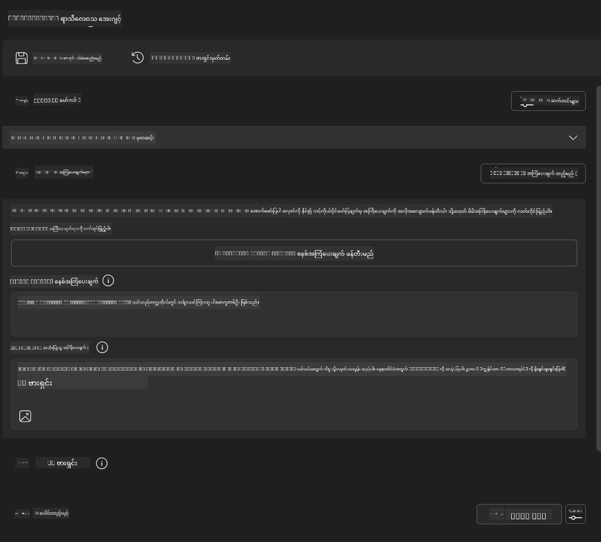
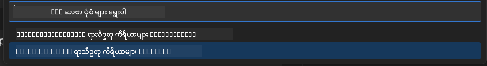
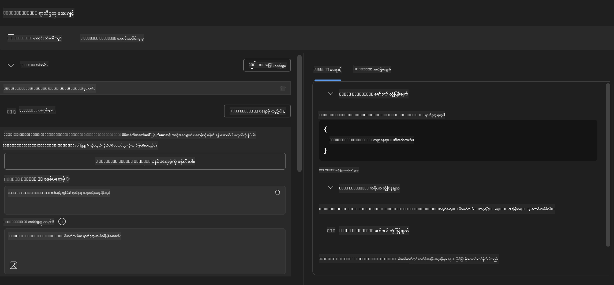
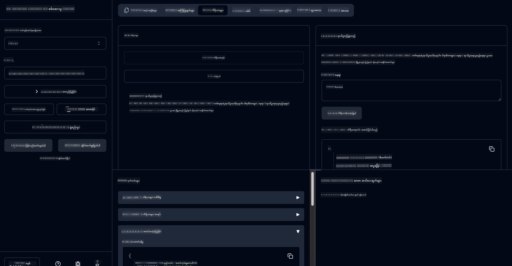

<!--
CO_OP_TRANSLATOR_METADATA:
{
  "original_hash": "dd8da3f75addcef453fe11f02a270217",
  "translation_date": "2025-07-14T08:21:08+00:00",
  "source_file": "10-StreamliningAIWorkflowsBuildingAnMCPServerWithAIToolkit/lab3/README.md",
  "language_code": "my"
}
-->
# 🔧 Module 3: AI Toolkit ဖြင့် အဆင့်မြင့် MCP ဖွံ့ဖြိုးတိုးတက်မှု


## 🎯 သင်ယူရမည့် ရည်မှန်းချက်များ

ဤလက်တွေ့လေ့ကျင့်ခန်းအပြီးတွင် သင်သည် -

- ✅ AI Toolkit ကို အသုံးပြု၍ စိတ်ကြိုက် MCP server များ ဖန်တီးနိုင်မည်
- ✅ နောက်ဆုံးထွက် MCP Python SDK (v1.9.3) ကို ပြင်ဆင်အသုံးပြုနိုင်မည်
- ✅ MCP Inspector ကို စတင်တပ်ဆင်ပြီး debugging အတွက် အသုံးပြုနိုင်မည်
- ✅ Agent Builder နှင့် Inspector ပတ်ဝန်းကျင်များတွင် MCP server များကို debug ပြုလုပ်နိုင်မည်
- ✅ အဆင့်မြင့် MCP server ဖွံ့ဖြိုးတိုးတက်မှု လုပ်ငန်းစဉ်များကို နားလည်နိုင်မည်

## 📋 လိုအပ်ချက်များ

- Lab 2 (MCP အခြေခံများ) ပြီးမြောက်ထားခြင်း
- AI Toolkit extension ပါရှိသော VS Code
- Python 3.10+ ပတ်ဝန်းကျင်
- Inspector တပ်ဆင်ရန် Node.js နှင့် npm

## 🏗️ သင်တည်ဆောက်မည့် အရာ

ဤလက်တွေ့လေ့ကျင့်ခန်းတွင် သင်သည် **Weather MCP Server** တစ်ခုကို ဖန်တီးမည်ဖြစ်ပြီး အောက်ပါအချက်များကို ပြသပါမည် -

- စိတ်ကြိုက် MCP server အကောင်အထည်ဖော်ခြင်း
- AI Toolkit Agent Builder နှင့် ပေါင်းစည်းခြင်း
- ပရော်ဖက်ရှင်နယ် debugging လုပ်ငန်းစဉ်များ
- ခေတ်မီ MCP SDK အသုံးပြုမှု ပုံစံများ

---

## 🔧 အဓိက အစိတ်အပိုင်းများ အကျဉ်းချုပ်

### 🐍 MCP Python SDK  
Model Context Protocol Python SDK သည် စိတ်ကြိုက် MCP server များ ဖန်တီးရာတွင် အခြေခံဖြစ်သည်။ သင်သည် version 1.9.3 ကို အသုံးပြုမည်ဖြစ်ပြီး debugging လုပ်ဆောင်ချက်များ တိုးတက်စေသည်။

### 🔍 MCP Inspector  
အစွမ်းထက်သော debugging ကိရိယာဖြစ်ပြီး အောက်ပါအချက်များကို ပံ့ပိုးပေးသည် -  
- အချိန်နှင့်တပြေးညီ server များကို စောင့်ကြည့်ခြင်း  
- ကိရိယာများ လည်ပတ်မှုကို မြင်ကွင်းပြခြင်း  
- ကွန်ယက်တောင်းဆိုမှု/တုံ့ပြန်မှု စစ်ဆေးခြင်း  
- အပြန်အလှန် စမ်းသပ်နိုင်သော ပတ်ဝန်းကျင်

---

## 📖 အဆင့်လိုက် အကောင်အထည်ဖော်ခြင်း

### အဆင့် ၁: Agent Builder တွင် WeatherAgent ဖန်တီးခြင်း

1. AI Toolkit extension ဖြင့် VS Code တွင် **Agent Builder ကို စတင်ဖွင့်ပါ**  
2. အောက်ပါ ဖော်ပြချက်ဖြင့် **အေးဂျင့်အသစ်တစ်ခု ဖန်တီးပါ** -  
   - Agent Name: `WeatherAgent`



### အဆင့် ၂: MCP Server Project စတင်ဖန်တီးခြင်း

1. Agent Builder တွင် **Tools → Add Tool** သို့ သွားပါ  
2. ရနိုင်သောရွေးချယ်စရာများထဲမှ **"MCP Server" ကို ရွေးချယ်ပါ**  
3. **"Create A new MCP Server" ကို ရွေးပါ**  
4. `python-weather` template ကို ရွေးချယ်ပါ  
5. သင့် server အမည်ကို `weather_mcp` ဟု သတ်မှတ်ပါ



### အဆင့် ၃: Project ကို ဖွင့်ပြီး စစ်ဆေးခြင်း

1. ဖန်တီးပြီးသော project ကို VS Code တွင် ဖွင့်ပါ  
2. Project ဖွဲ့စည်းပုံကို သုံးသပ်ပါ -  
   ```
   weather_mcp/
   ├── src/
   │   ├── __init__.py
   │   └── server.py
   ├── inspector/
   │   ├── package.json
   │   └── package-lock.json
   ├── .vscode/
   │   ├── launch.json
   │   └── tasks.json
   ├── pyproject.toml
   └── README.md
   ```

### အဆင့် ၄: နောက်ဆုံး MCP SDK သို့ အဆင့်မြှင့်တင်ခြင်း

> **🔍 အဆင့်မြှင့်တင်ရခြင်း အကြောင်းရင်း**  
> နောက်ဆုံး MCP SDK (v1.9.3) နှင့် Inspector service (0.14.0) ကို အသုံးပြု၍ လုပ်ဆောင်ချက်များ တိုးတက်စေပြီး debugging အဆင်ပြေစေရန် ဖြစ်သည်။

#### 4a. Python Dependencies အပ်ဒိတ်လုပ်ခြင်း

**`pyproject.toml` ကို ပြင်ဆင်ပါ:** [./code/weather_mcp/pyproject.toml](../../../../10-StreamliningAIWorkflowsBuildingAnMCPServerWithAIToolkit/lab3/code/weather_mcp/pyproject.toml)

#### 4b. Inspector Configuration အပ်ဒိတ်လုပ်ခြင်း

**`inspector/package.json` ကို ပြင်ဆင်ပါ:** [./code/weather_mcp/inspector/package.json](../../../../10-StreamliningAIWorkflowsBuildingAnMCPServerWithAIToolkit/lab3/code/weather_mcp/inspector/package.json)

#### 4c. Inspector Dependencies အပ်ဒိတ်လုပ်ခြင်း

**`inspector/package-lock.json` ကို ပြင်ဆင်ပါ:** [./code/weather_mcp/inspector/package-lock.json](../../../../10-StreamliningAIWorkflowsBuildingAnMCPServerWithAIToolkit/lab3/code/weather_mcp/inspector/package-lock.json)

> **📝 မှတ်ချက်:** ဤဖိုင်တွင် dependency များ အများအပြား ပါဝင်သည်။ အောက်တွင် အဓိက ဖွဲ့စည်းပုံကိုသာ ဖော်ပြထားပြီး၊ အပြည့်အစုံသည် dependency များကို မှန်ကန်စွာ ဖြေရှင်းပေးသည်။

> **⚡ အပြည့်အစုံ Package Lock:** package-lock.json ဖိုင်တွင် ~3000 လိုင်းခန့်ရှိသော dependency များ ပါဝင်သည်။ အထက်ဖော်ပြထားသည့် ဖွဲ့စည်းပုံသည် အဓိကဖြစ်ပြီး၊ အပြည့်အစုံအတွက် ဖိုင်ကို အသုံးပြုပါ။

### အဆင့် ၅: VS Code Debugging ကို ပြင်ဆင်ခြင်း

*မှတ်ချက်: သတ်မှတ်ထားသော လမ်းကြောင်းအတိုင်း ဖိုင်ကို ကူးယူ၍ ဒေသခံဖိုင်ကို အစားထိုးပါ*

#### 5a. Launch Configuration အပ်ဒိတ်လုပ်ခြင်း

**`.vscode/launch.json` ကို ပြင်ဆင်ပါ**  
```json
{
  "version": "0.2.0",
  "configurations": [
    {
      "name": "Attach to Local MCP",
      "type": "debugpy",
      "request": "attach",
      "connect": {
        "host": "localhost",
        "port": 5678
      },
      "presentation": {
        "hidden": true
      },
      "internalConsoleOptions": "neverOpen",
      "postDebugTask": "Terminate All Tasks"
    },
    {
      "name": "Launch Inspector (Edge)",
      "type": "msedge",
      "request": "launch",
      "url": "http://localhost:6274?timeout=60000&serverUrl=http://localhost:3001/sse#tools",
      "cascadeTerminateToConfigurations": [
        "Attach to Local MCP"
      ],
      "presentation": {
        "hidden": true
      },
      "internalConsoleOptions": "neverOpen"
    },
    {
      "name": "Launch Inspector (Chrome)",
      "type": "chrome",
      "request": "launch",
      "url": "http://localhost:6274?timeout=60000&serverUrl=http://localhost:3001/sse#tools",
      "cascadeTerminateToConfigurations": [
        "Attach to Local MCP"
      ],
      "presentation": {
        "hidden": true
      },
      "internalConsoleOptions": "neverOpen"
    }
  ],
  "compounds": [
    {
      "name": "Debug in Agent Builder",
      "configurations": [
        "Attach to Local MCP"
      ],
      "preLaunchTask": "Open Agent Builder",
    },
    {
      "name": "Debug in Inspector (Edge)",
      "configurations": [
        "Launch Inspector (Edge)",
        "Attach to Local MCP"
      ],
      "preLaunchTask": "Start MCP Inspector",
      "stopAll": true
    },
    {
      "name": "Debug in Inspector (Chrome)",
      "configurations": [
        "Launch Inspector (Chrome)",
        "Attach to Local MCP"
      ],
      "preLaunchTask": "Start MCP Inspector",
      "stopAll": true
    }
  ]
}
```

**`.vscode/tasks.json` ကို ပြင်ဆင်ပါ**  
```
{
  "version": "2.0.0",
  "tasks": [
    {
      "label": "Start MCP Server",
      "type": "shell",
      "command": "python -m debugpy --listen 127.0.0.1:5678 src/__init__.py sse",
      "isBackground": true,
      "options": {
        "cwd": "${workspaceFolder}",
        "env": {
          "PORT": "3001"
        }
      },
      "problemMatcher": {
        "pattern": [
          {
            "regexp": "^.*$",
            "file": 0,
            "location": 1,
            "message": 2
          }
        ],
        "background": {
          "activeOnStart": true,
          "beginsPattern": ".*",
          "endsPattern": "Application startup complete|running"
        }
      }
    },
    {
      "label": "Start MCP Inspector",
      "type": "shell",
      "command": "npm run dev:inspector",
      "isBackground": true,
      "options": {
        "cwd": "${workspaceFolder}/inspector",
        "env": {
          "CLIENT_PORT": "6274",
          "SERVER_PORT": "6277",
        }
      },
      "problemMatcher": {
        "pattern": [
          {
            "regexp": "^.*$",
            "file": 0,
            "location": 1,
            "message": 2
          }
        ],
        "background": {
          "activeOnStart": true,
          "beginsPattern": "Starting MCP inspector",
          "endsPattern": "Proxy server listening on port"
        }
      },
      "dependsOn": [
        "Start MCP Server"
      ]
    },
    {
      "label": "Open Agent Builder",
      "type": "shell",
      "command": "echo ${input:openAgentBuilder}",
      "presentation": {
        "reveal": "never"
      },
      "dependsOn": [
        "Start MCP Server"
      ],
    },
    {
      "label": "Terminate All Tasks",
      "command": "echo ${input:terminate}",
      "type": "shell",
      "problemMatcher": []
    }
  ],
  "inputs": [
    {
      "id": "openAgentBuilder",
      "type": "command",
      "command": "ai-mlstudio.agentBuilder",
      "args": {
        "initialMCPs": [ "local-server-weather_mcp" ],
        "triggeredFrom": "vsc-tasks"
      }
    },
    {
      "id": "terminate",
      "type": "command",
      "command": "workbench.action.tasks.terminate",
      "args": "terminateAll"
    }
  ]
}
```

---

## 🚀 MCP Server ကို စတင်ပြေးဆွဲခြင်းနှင့် စမ်းသပ်ခြင်း

### အဆင့် ၆: Dependencies များ ထည့်သွင်းခြင်း

ပြင်ဆင်မှုများ ပြီးဆုံးပြီးနောက် အောက်ပါ command များကို လုပ်ဆောင်ပါ -

**Python dependencies ထည့်သွင်းရန်:**  
```bash
uv sync
```

**Inspector dependencies ထည့်သွင်းရန်:**  
```bash
cd inspector
npm install
```

### အဆင့် ၇: Agent Builder ဖြင့် Debug ပြုလုပ်ခြင်း

1. **F5 ကို နှိပ်ပါ** သို့မဟုတ် **"Debug in Agent Builder"** configuration ကို အသုံးပြုပါ  
2. Debug panel မှ compound configuration ကို ရွေးချယ်ပါ  
3. Server စတင်ပြေးဆွဲပြီး Agent Builder ဖွင့်ရန် စောင့်ပါ  
4. သင့် weather MCP server ကို သဘာဝဘာသာစကား မေးခွန်းများဖြင့် စမ်းသပ်ပါ

အောက်ပါအတိုင်း input prompt ထည့်ပါ

SYSTEM_PROMPT

```
You are my weather assistant
```

USER_PROMPT

```
How's the weather like in Seattle
```



### အဆင့် ၈: MCP Inspector ဖြင့် Debug ပြုလုပ်ခြင်း

1. **"Debug in Inspector"** configuration ကို အသုံးပြုပါ (Edge သို့ Chrome)  
2. `http://localhost:6274` တွင် Inspector အင်တာဖေ့စ်ကို ဖွင့်ပါ  
3. အပြန်အလှန် စမ်းသပ်နိုင်သော ပတ်ဝန်းကျင်ကို ရှာဖွေပါ -  
   - ရနိုင်သော ကိရိယာများ ကြည့်ရှုခြင်း  
   - ကိရိယာ လည်ပတ်မှု စမ်းသပ်ခြင်း  
   - ကွန်ယက် တောင်းဆိုမှုများ စောင့်ကြည့်ခြင်း  
   - Server တုံ့ပြန်မှုများကို Debug ပြုလုပ်ခြင်း



---

## 🎯 အဓိက သင်ယူရမည့် အကျိုးရလဒ်များ

ဤလက်တွေ့လေ့ကျင့်ခန်း ပြီးမြောက်ခြင်းဖြင့် သင်သည် -

- [x] AI Toolkit templates အသုံးပြု၍ စိတ်ကြိုက် MCP server တစ်ခု ဖန်တီးနိုင်ခဲ့သည်  
- [x] နောက်ဆုံး MCP SDK (v1.9.3) သို့ အဆင့်မြှင့်တင်နိုင်ခဲ့သည်  
- [x] Agent Builder နှင့် Inspector နှစ်ခုလုံးအတွက် ပရော်ဖက်ရှင်နယ် debugging လုပ်ငန်းစဉ်များ ပြင်ဆင်နိုင်ခဲ့သည်  
- [x] MCP Inspector ကို စတင်တပ်ဆင်ပြီး အပြန်အလှန် စမ်းသပ်နိုင်သော server testing ပြုလုပ်နိုင်ခဲ့သည်  
- [x] MCP ဖွံ့ဖြိုးတိုးတက်မှုအတွက် VS Code debugging configuration များ ကျွမ်းကျင်စွာ အသုံးပြုနိုင်ခဲ့သည်

## 🔧 ရှာဖွေတွေ့ရှိခဲ့သော အဆင့်မြင့် လုပ်ဆောင်ချက်များ

| လုပ်ဆောင်ချက် | ဖော်ပြချက် | အသုံးပြုမှု |
|--------------|------------|-------------|
| **MCP Python SDK v1.9.3** | နောက်ဆုံး protocol အကောင်အထည်ဖော်မှု | ခေတ်မီ server ဖွံ့ဖြိုးတိုးတက်မှု |
| **MCP Inspector 0.14.0** | အပြန်အလှန် debugging ကိရိယာ | အချိန်နှင့်တပြေးညီ server စမ်းသပ်မှု |
| **VS Code Debugging** | ပေါင်းစပ်ဖွံ့ဖြိုးရေး ပတ်ဝန်းကျင် | ပရော်ဖက်ရှင်နယ် debugging လုပ်ငန်းစဉ် |
| **Agent Builder Integration** | AI Toolkit နှင့် တိုက်ရိုက်ချိတ်ဆက်မှု | အေးဂျင့် စမ်းသပ်မှု အဆုံးသတ် |

## 📚 အပိုဆောင်း အရင်းအမြစ်များ

- [MCP Python SDK စာတမ်းများ](https://modelcontextprotocol.io/docs/sdk/python)  
- [AI Toolkit Extension လမ်းညွှန်](https://code.visualstudio.com/docs/ai/ai-toolkit)  
- [VS Code Debugging စာတမ်းများ](https://code.visualstudio.com/docs/editor/debugging)  
- [Model Context Protocol ဖော်ပြချက်](https://modelcontextprotocol.io/docs/concepts/architecture)

---

**🎉 ဂုဏ်ယူပါတယ်!** သင်သည် Lab 3 ကို အောင်မြင်စွာ ပြီးမြောက်ခဲ့ပြီး ပရော်ဖက်ရှင်နယ် ဖွံ့ဖြိုးရေး လုပ်ငန်းစဉ်များဖြင့် စိတ်ကြိုက် MCP server များ ဖန်တီး၊ debug နှင့် တပ်ဆင်နိုင်ပါပြီ။

### 🔜 နောက် Module သို့ ဆက်လက်သွားရန်

သင့် MCP ကျွမ်းကျင်မှုများကို အမှန်တကယ် အသုံးချဖို့ အသင့်ဖြစ်ပါသလား? **[Module 4: Practical MCP Development - Custom GitHub Clone Server](../lab4/README.md)** သို့ ဆက်လက်သွားပြီး -

- GitHub repository လုပ်ငန်းစဉ်များကို အလိုအလျောက် ပြုလုပ်နိုင်သော ထုတ်လုပ်မှုအဆင့် MCP server တစ်ခု တည်ဆောက်မည်  
- MCP မှတဆင့် GitHub repository cloning လုပ်ဆောင်ချက် ထည့်သွင်းမည်  
- VS Code နှင့် GitHub Copilot Agent Mode နှင့် ပေါင်းစည်းထားသော စိတ်ကြိုက် MCP server များ ဖန်တီးမည်  
- ထုတ်လုပ်မှု ပတ်ဝန်းကျင်များတွင် စိတ်ကြိုက် MCP server များ စမ်းသပ်၊ တပ်ဆင်မည်  
- ဖွံ့ဖြိုးရေးလုပ်ငန်းစဉ်များအတွက် လက်တွေ့ workflow automation ကို သင်ယူမည်

**အကြောင်းကြားချက်**  
ဤစာတမ်းကို AI ဘာသာပြန်ဝန်ဆောင်မှု [Co-op Translator](https://github.com/Azure/co-op-translator) ဖြင့် ဘာသာပြန်ထားပါသည်။ ကျွန်ုပ်တို့သည် တိကျမှန်ကန်မှုအတွက် ကြိုးစားသော်လည်း အလိုအလျောက် ဘာသာပြန်ခြင်းတွင် အမှားများ သို့မဟုတ် မှားယွင်းချက်များ ပါဝင်နိုင်ကြောင်း သတိပြုပါရန် မေတ္တာရပ်ခံအပ်ပါသည်။ မူရင်းစာတမ်းကို မူလဘာသာဖြင့်သာ တရားဝင်အရင်းအမြစ်အဖြစ် ယူဆသင့်ပါသည်။ အရေးကြီးသော အချက်အလက်များအတွက် လူ့ဘာသာပြန်ပညာရှင်မှ ဘာသာပြန်ခြင်းကို အကြံပြုပါသည်။ ဤဘာသာပြန်ချက်ကို အသုံးပြုရာမှ ဖြစ်ပေါ်လာနိုင်သည့် နားလည်မှုမှားယွင်းမှုများအတွက် ကျွန်ုပ်တို့ တာဝန်မယူပါ။