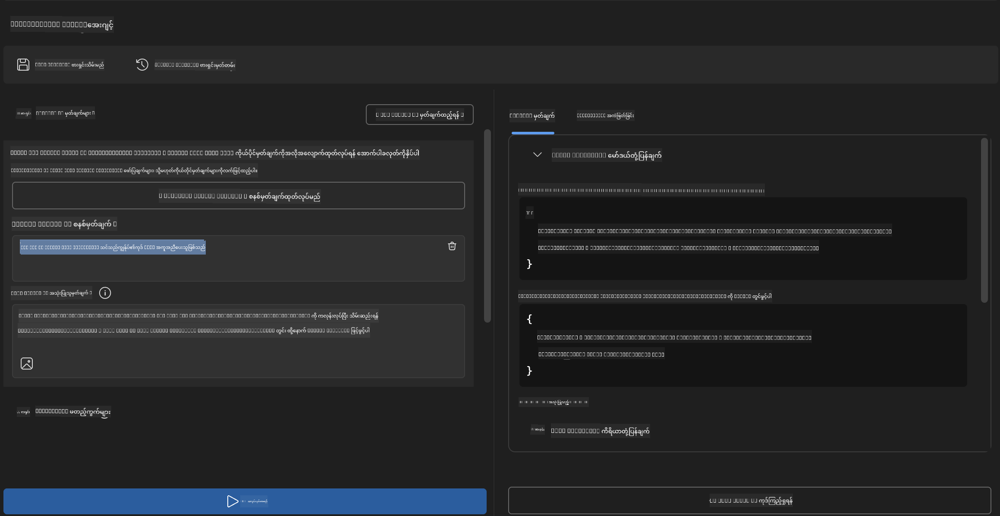
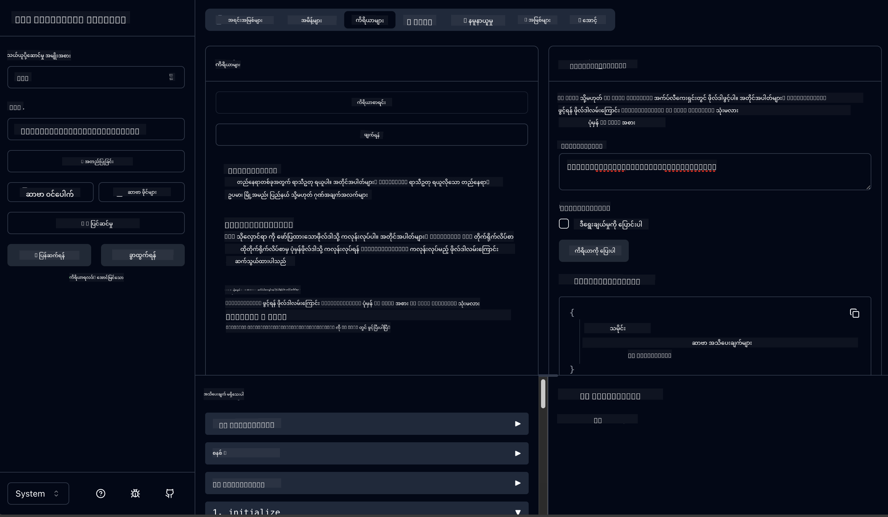

<!--
CO_OP_TRANSLATOR_METADATA:
{
  "original_hash": "f83bc722dc758efffd68667d6a1db470",
  "translation_date": "2025-07-14T08:49:06+00:00",
  "source_file": "10-StreamliningAIWorkflowsBuildingAnMCPServerWithAIToolkit/lab4/README.md",
  "language_code": "my"
}
-->
# 🐙 Module 4: Practical MCP Development - Custom GitHub Clone Server


> **⚡ အမြန်စတင်ခြင်း:** GitHub repository ကို clone လုပ်ခြင်းနဲ့ VS Code ပေါ်မှာ အလိုအလျောက်ပေါင်းစည်းပေးတဲ့ production-ready MCP server ကို ၃၀ မိနစ်အတွင်း တည်ဆောက်လိုက်ပါ!

## 🎯 သင်ယူရမည့် ရည်မှန်းချက်များ

ဒီ lab အဆုံးသတ်တဲ့အချိန်မှာ သင်မှာ အောက်ပါအရာတွေကို လုပ်နိုင်ပါလိမ့်မယ်-

- ✅ အမှန်တကယ် အသုံးပြုနိုင်တဲ့ custom MCP server တစ်ခု ဖန်တီးနိုင်ခြင်း
- ✅ MCP မှတဆင့် GitHub repository cloning လုပ်ဆောင်ချက် ထည့်သွင်းနိုင်ခြင်း
- ✅ custom MCP server တွေကို VS Code နဲ့ Agent Builder နဲ့ ပေါင်းစည်းအသုံးပြုနိုင်ခြင်း
- ✅ GitHub Copilot Agent Mode ကို custom MCP tools တွေနဲ့ အသုံးပြုနိုင်ခြင်း
- ✅ custom MCP server တွေကို production ပတ်ဝန်းကျင်မှာ စမ်းသပ်ပြီး deploy လုပ်နိုင်ခြင်း

## 📋 လိုအပ်ချက်များ

- Labs 1-3 (MCP အခြေခံနဲ့ အဆင့်မြင့် ဖွံ့ဖြိုးမှု) ပြီးမြောက်ထားခြင်း
- GitHub Copilot subscription ([အခမဲ့ စာရင်းသွင်းနိုင်သည်](https://github.com/github-copilot/signup))
- VS Code မှာ AI Toolkit နဲ့ GitHub Copilot extension များ ထည့်သွင်းထားခြင်း
- Git CLI ကို install လုပ်ပြီး configure ပြီးခြင်း

## 🏗️ ပရောဂျက်အကျဉ်း

### **အမှန်တကယ် အသုံးပြုနိုင်တဲ့ ဖွံ့ဖြိုးမှု စိန်ခေါ်မှု**
Developer တွေအနေနဲ့ GitHub မှ repository တွေကို clone လုပ်ပြီး VS Code သို့မဟုတ် VS Code Insiders မှာ ဖွင့်ကြပါတယ်။ ဒီလုပ်ငန်းစဉ်ကို manual နည်းဖြင့် လုပ်ရတာမှာ-

1. Terminal/command prompt ကိုဖွင့်ခြင်း
2. လိုချင်တဲ့ directory ကိုသွားခြင်း
3. `git clone` command ကို run ချခြင်း
4. Clone လုပ်ထားတဲ့ directory မှာ VS Code ဖွင့်ခြင်း

**ကျွန်တော်တို့ရဲ့ MCP ဖြေရှင်းချက်က ဒီလုပ်ငန်းစဉ်ကို တစ်ချက်တည်း အတိအကျ command တစ်ခုနဲ့ ပြီးစီးစေပါတယ်!**

### **သင်တည်ဆောက်မယ့်အရာ**
**GitHub Clone MCP Server** (`git_mcp_server`) တစ်ခုဖြစ်ပြီး အောက်ပါအရာတွေ ပါဝင်ပါတယ်-

| လုပ်ဆောင်ချက် | ဖော်ပြချက် | အကျိုးကျေးဇူး |
|---------|-------------|---------|
| 🔄 **အတိအကျ Repository Cloning** | GitHub repos ကို စစ်ဆေးပြီး clone လုပ်ခြင်း | အမှားစစ်ဆေးမှု အလိုအလျောက်လုပ်ဆောင်ခြင်း |
| 📁 **အတိအကျ Directory စီမံခန့်ခွဲမှု** | Directory များကို စစ်ဆေးပြီး လုံခြုံစွာ ဖန်တီးခြင်း | ဖိုင်များ overwrite မဖြစ်စေရန် ကာကွယ်ခြင်း |
| 🚀 **Cross-Platform VS Code ပေါင်းစည်းမှု** | VS Code/Insiders မှာ project တွေ ဖွင့်ခြင်း | လုပ်ငန်းစဉ်များကို အဆင်ပြေစေခြင်း |
| 🛡️ **ခိုင်မာသော အမှားကိုင်တွယ်မှု** | Network, permission, path ပြဿနာများကို ကိုင်တွယ်ခြင်း | Production အသုံးပြုနိုင်စွမ်းရှိခြင်း |

---

## 📖 အဆင့်လိုက် အကောင်အထည်ဖော်ခြင်း

### အဆင့် ၁: Agent Builder မှ GitHub Agent ဖန်တီးခြင်း

1. AI Toolkit extension မှတဆင့် **Agent Builder ကို ဖွင့်ပါ**
2. အောက်ပါ configuration နဲ့ **Agent အသစ်တစ်ခု ဖန်တီးပါ**
   ```
   Agent Name: GitHubAgent
   ```

3. **custom MCP server ကို စတင်ဖန်တီးခြင်း:**
   - **Tools** → **Add Tool** → **MCP Server** ကို သွားပါ
   - **"Create A new MCP Server"** ကို ရွေးပါ
   - အများဆုံး လွယ်ကူမှုအတွက် **Python template** ကို ရွေးပါ
   - **Server Name:** `git_mcp_server`

### အဆင့် ၂: GitHub Copilot Agent Mode ကို ပြင်ဆင်ခြင်း

1. VS Code မှာ **GitHub Copilot ကို ဖွင့်ပါ** (Ctrl/Cmd + Shift + P → "GitHub Copilot: Open")
2. Copilot interface မှာ **Agent Model ကို ရွေးပါ**
3. **Claude 3.7 model** ကို ရွေးပြီး reasoning စွမ်းရည် မြင့်မားစေပါ
4. Tool အသုံးပြုခွင့်အတွက် **MCP integration ကို ဖွင့်ပါ**

> **💡 အကြံပြုချက်:** Claude 3.7 က ဖွံ့ဖြိုးမှုလုပ်ငန်းစဉ်နဲ့ အမှားကိုင်တွယ်မှု pattern တွေကို ပိုမိုနားလည်စေပါတယ်။

### အဆင့် ၃: MCP Server အဓိက လုပ်ဆောင်ချက်များ အကောင်အထည်ဖော်ခြင်း

**GitHub Copilot Agent Mode နဲ့ အောက်ပါ prompt ကို အသုံးပြုပါ:**

```
Create two MCP tools with the following comprehensive requirements:

🔧 TOOL A: clone_repository
Requirements:
- Clone any GitHub repository to a specified local folder
- Return the absolute path of the successfully cloned project
- Implement comprehensive validation:
  ✓ Check if target directory already exists (return error if exists)
  ✓ Validate GitHub URL format (https://github.com/user/repo)
  ✓ Verify git command availability (prompt installation if missing)
  ✓ Handle network connectivity issues
  ✓ Provide clear error messages for all failure scenarios

🚀 TOOL B: open_in_vscode
Requirements:
- Open specified folder in VS Code or VS Code Insiders
- Cross-platform compatibility (Windows/Linux/macOS)
- Use direct application launch (not terminal commands)
- Auto-detect available VS Code installations
- Handle cases where VS Code is not installed
- Provide user-friendly error messages

Additional Requirements:
- Follow MCP 1.9.3 best practices
- Include proper type hints and documentation
- Implement logging for debugging purposes
- Add input validation for all parameters
- Include comprehensive error handling
```

### အဆင့် ၄: MCP Server ကို စမ်းသပ်ခြင်း

#### 4a. Agent Builder မှာ စမ်းသပ်ခြင်း

1. Agent Builder အတွက် debug configuration ကို စတင်ပါ
2. အောက်ပါ system prompt နဲ့ agent ကို ပြင်ဆင်ပါ-

```
SYSTEM_PROMPT:
You are my intelligent coding repository assistant. You help developers efficiently clone GitHub repositories and set up their development environment. Always provide clear feedback about operations and handle errors gracefully.
```

3. အသုံးပြုသူ အခြေအနေများနဲ့ စမ်းသပ်ပါ-

```
USER_PROMPT EXAMPLES:

Scenario : Basic Clone and Open
"Clone {Your GitHub Repo link such as https://github.com/kinfey/GHCAgentWorkshop
 } and save to {The global path you specify}, then open it with VS Code Insiders"
```



**မျှော်မှန်းရလဒ်များ:**
- ✅ Path အတည်ပြုချက်နဲ့ အောင်မြင်စွာ cloning လုပ်နိုင်ခြင်း
- ✅ VS Code ကို အလိုအလျောက် ဖွင့်ပေးခြင်း
- ✅ မမှန်ကန်တဲ့ အခြေအနေများအတွက် error message များ ပြသခြင်း
- ✅ အထူးအခြေအနေများကို မှန်ကန်စွာ ကိုင်တွယ်ခြင်း

#### 4b. MCP Inspector မှာ စမ်းသပ်ခြင်း



---

**🎉 ဂုဏ်ပြုပါတယ်!** သင်သည် အမှန်တကယ် အသုံးဝင်ပြီး production-ready MCP server တစ်ခုကို ဖန်တီးနိုင်ပြီး ဖွံ့ဖြိုးမှုလုပ်ငန်းစဉ်များကို ဖြေရှင်းနိုင်ပါပြီ။ သင်၏ custom GitHub clone server သည် MCP ၏ အင်အားကို အသုံးပြု၍ developer productivity ကို အလိုအလျောက်မြှင့်တင်ပေးနိုင်သည်ကို ပြသပါသည်။

### 🏆 ရရှိထားသော အောင်မြင်မှုများ:
- ✅ **MCP Developer** - custom MCP server တည်ဆောက်နိုင်ခြင်း
- ✅ **Workflow Automator** - ဖွံ့ဖြိုးမှုလုပ်ငန်းစဉ်များကို လွယ်ကူစွာ ပြုလုပ်နိုင်ခြင်း  
- ✅ **Integration Expert** - ဖွံ့ဖြိုးမှုကိရိယာများစွာကို ပေါင်းစည်းနိုင်ခြင်း
- ✅ **Production Ready** - deploy လုပ်နိုင်သော ဖြေရှင်းချက်များ တည်ဆောက်နိုင်ခြင်း

---

## 🎓 Workshop ပြီးမြောက်ခြင်း: Model Context Protocol နဲ့ သင်၏ ခရီး

**Workshop ပါဝင်သူ ခင်ဗျား၊**

Model Context Protocol workshop ၏ module ၄ ခုလုံးကို ပြီးမြောက်ခဲ့တဲ့အတွက် ဂုဏ်ယူပါတယ်! AI Toolkit အခြေခံများကို နားလည်ခြင်းမှ စ၍ အမှန်တကယ် အသုံးပြုနိုင်တဲ့ production-ready MCP server များ ဖန်တီးနိုင်အောင် လေ့လာခဲ့ပါပြီ။

### 🚀 သင်ယူခဲ့သော လမ်းကြောင်း အကျဉ်းချုပ်

**[Module 1](../lab1/README.md)**: AI Toolkit အခြေခံများ၊ model စမ်းသပ်ခြင်းနဲ့ ပထမဆုံး AI agent ဖန်တီးခြင်းကို စတင်လေ့လာခဲ့သည်။

**[Module 2](../lab2/README.md)**: MCP architecture ကို နားလည်ပြီး Playwright MCP ကို ပေါင်းစည်းကာ ပထမဆုံး browser automation agent တည်ဆောက်ခဲ့သည်။

**[Module 3](../lab3/README.md)**: Weather MCP server နဲ့ custom MCP server ဖန်တီးခြင်း၊ debugging ကိရိယာများကို ကျွမ်းကျင်စွာ အသုံးပြုခဲ့သည်။

**[Module 4](../lab4/README.md)**: GitHub repository workflow automation tool တစ်ခုကို လက်တွေ့အသုံးချနိုင်အောင် ဖန်တီးခဲ့သည်။

### 🌟 သင်ကျွမ်းကျင်ခဲ့သော အရာများ

- ✅ **AI Toolkit Ecosystem**: Models, agents, integration နည်းပညာများ
- ✅ **MCP Architecture**: Client-server ဒီဇိုင်း၊ transport protocol များ၊ security
- ✅ **Developer Tools**: Playground, Inspector, production deployment
- ✅ **Custom Development**: MCP server များ တည်ဆောက်၊ စမ်းသပ်၊ deploy လုပ်ခြင်း
- ✅ **လက်တွေ့ အသုံးချမှုများ**: AI နည်းပညာဖြင့် workflow စိန်ခေါ်မှုများ ဖြေရှင်းခြင်း

### 🔮 နောက်တစ်ဆင့် လုပ်ဆောင်ရန်

1. **သင်၏ MCP Server ကို တည်ဆောက်ပါ**: သင့် workflow များကို အလိုအလျောက်လုပ်ဆောင်ရန် ဒီကျွမ်းကျင်မှုများကို အသုံးချပါ
2. **MCP Community တွင် ပါဝင်ပါ**: သင်၏ ဖန်တီးမှုများကို မျှဝေပြီး အခြားသူများထံမှ သင်ယူပါ
3. **အဆင့်မြင့် ပေါင်းစည်းမှုများကို ရှာဖွေပါ**: MCP server များကို စီးပွားရေးစနစ်များနှင့် ချိတ်ဆက်ပါ
4. **Open Source တွင် ပါဝင်ပါ**: MCP ကိရိယာများနဲ့ စာတမ်းများ တိုးတက်အောင် ကူညီပါ

ဒီ workshop က သင်၏ စတင်ခြင်းသာဖြစ်ပါသည်။ Model Context Protocol ecosystem က အလျင်အမြန် တိုးတက်နေပြီး သင်သည် AI အခြေပြု ဖွံ့ဖြိုးမှုကိရိယာများ၏ ရှေ့ဆောင်ဖြစ်လာနိုင်ပါပြီ။

**သင်၏ ပါဝင်မှုနဲ့ သင်ယူမှုအတွက် ကျေးဇူးတင်ပါတယ်!**

ဒီ workshop က သင်၏ ဖန်တီးမှုနဲ့ AI ကိရိယာများကို အသုံးပြုရာမှာ အတွေးအခေါ်အသစ်တွေ ဖန်တီးပေးနိုင်ခဲ့လိမ့်မယ်လို့ မျှော်လင့်ပါတယ်။

**ကောင်းသော coding ခရီးစဉ်ဖြစ်ပါစေ!**

---

**အကြောင်းကြားချက်**  
ဤစာတမ်းကို AI ဘာသာပြန်ဝန်ဆောင်မှု [Co-op Translator](https://github.com/Azure/co-op-translator) ဖြင့် ဘာသာပြန်ထားပါသည်။ ကျွန်ုပ်တို့သည် တိကျမှန်ကန်မှုအတွက် ကြိုးစားသော်လည်း အလိုအလျောက် ဘာသာပြန်ခြင်းတွင် အမှားများ သို့မဟုတ် မှားယွင်းချက်များ ပါဝင်နိုင်ကြောင်း သတိပြုပါရန် မေတ္တာရပ်ခံအပ်ပါသည်။ မူရင်းစာတမ်းကို မိမိဘာသာစကားဖြင့်သာ တရားဝင်အချက်အလက်အဖြစ် ယူဆသင့်ပါသည်။ အရေးကြီးသော အချက်အလက်များအတွက် လူ့ပညာရှင်များ၏ ပရော်ဖက်ရှင်နယ် ဘာသာပြန်ခြင်းကို အကြံပြုပါသည်။ ဤဘာသာပြန်ချက်ကို အသုံးပြုရာမှ ဖြစ်ပေါ်လာနိုင်သည့် နားလည်မှုမှားယွင်းမှုများအတွက် ကျွန်ုပ်တို့သည် တာဝန်မခံပါ။