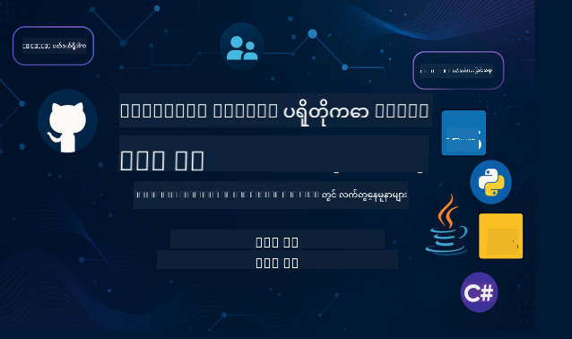

<!--
CO_OP_TRANSLATOR_METADATA:
{
  "original_hash": "866c8877136cb03e1efb9ad633a2f0a6",
  "translation_date": "2025-08-26T18:26:18+00:00",
  "source_file": "README.md",
  "language_code": "my"
}
-->
 

ဤအရင်းအမြစ်များကို အသုံးပြုရန်အဆင့်များကို လိုက်နာပါ:
1. **Repository ကို Fork လုပ်ပါ**:  ကိုနှိပ်ပါ
2. **Repository ကို Clone လုပ်ပါ**:   `git clone https://github.com/microsoft/mcp-for-beginners.git`
3. [**Azure AI Foundry Discord ကို Join လုပ်ပြီး ကျွမ်းကျင်သူများနှင့် Developer မိတ်ဆွေများနှင့် တွေ့ဆုံပါ**](https://discord.com/invite/ByRwuEEgH4)

### 🌐 ဘာသာစကားများ အထောက်အပံ့

#### GitHub Action မှတဆင့် အလိုအလျောက် (အမြဲ Update ဖြစ်နေသော)

 [Arabic](../ar/README.md) | [Bengali](../bn/README.md) | [Bulgarian](../bg/README.md) | [Burmese (Myanmar)](./README.md) | [Chinese (Simplified)](../zh/README.md) | [Chinese (Traditional, Hong Kong)](../hk/README.md) | [Chinese (Traditional, Macau)](../mo/README.md) | [Chinese (Traditional, Taiwan)](../tw/README.md) | [Croatian](../hr/README.md) | [Czech](../cs/README.md) | [Danish](../da/README.md) | [Dutch](../nl/README.md) | [Finnish](../fi/README.md) | [French](../fr/README.md) | [German](../de/README.md) | [Greek](../el/README.md) | [Hebrew](../he/README.md) | [Hindi](../hi/README.md) | [Hungarian](../hu/README.md) | [Indonesian](../id/README.md) | [Italian](../it/README.md) | [Japanese](../ja/README.md) | [Korean](../ko/README.md) | [Malay](../ms/README.md) | [Marathi](../mr/README.md) | [Nepali](../ne/README.md) | [Norwegian](../no/README.md) | [Persian (Farsi)](../fa/README.md) | [Polish](../pl/README.md) | [Portuguese (Brazil)](../br/README.md) | [Portuguese (Portugal)](../pt/README.md) | [Punjabi (Gurmukhi)](../pa/README.md) | [Romanian](../ro/README.md) | [Russian](../ru/README.md) | [Serbian (Cyrillic)](../sr/README.md) | [Slovak](../sk/README.md) | [Slovenian](../sl/README.md) | [Spanish](../es/README.md) | [Swahili](../sw/README.md) | [Swedish](../sv/README.md) | [Tagalog (Filipino)](../tl/README.md) | [Thai](../th/README.md) | [Turkish](../tr/README.md) | [Ukrainian](../uk/README.md) | [Urdu](../ur/README.md) | [Vietnamese](../vi/README.md)

# 🚀 Model Context Protocol (MCP) သင်ခန်းစာများ အခြေခံသူများအတွက်

## **C#, Java, JavaScript, Rust, Python, နှင့် TypeScript မှာ လက်တွေ့ကိုယ်တိုင် MCP ကို လေ့လာပါ**

## 🧠 Model Context Protocol သင်ခန်းစာများအကြောင်းအရာ

**Model Context Protocol (MCP)** သည် AI မော်ဒယ်များနှင့် client application များအကြား အပြန်အလှန်ဆက်သွယ်မှုများကို စံပြုလုပ်ရန် ရည်ရွယ်ထားသော နောက်ဆုံးပေါ် framework တစ်ခုဖြစ်သည်။ ဤ open-source သင်ခန်းစာများတွင် C#, Java, JavaScript, TypeScript, နှင့် Python အပါအဝင် နာမည်ကြီး programming language များတွင် လက်တွေ့ coding နမူနာများနှင့် အမှန်တကယ်အသုံးချနိုင်သော နည်းလမ်းများပါဝင်သော စနစ်တကျ သင်ကြားမှုလမ်းကြောင်းကို ပေးထားသည်။

သင်သည် AI developer, system architect, သို့မဟုတ် software engineer ဖြစ်ပါက MCP အခြေခံများနှင့် အကောင်အထည်ဖော်နည်းလမ်းများကို ကျွမ်းကျင်ရန် ဤလမ်းညွှန်သည် သင့် comprehensive resource ဖြစ်ပါသည်။

## 🔗 MCP အတည်ပြုအရင်းအမြစ်များ

- 📘 [MCP Documentation](https://modelcontextprotocol.io/) – အသေးစိတ် သင်ခန်းစာများနှင့် အသုံးပြုလမ်းညွှန်များ  
- 📜 [MCP Specification](https://modelcontextprotocol.io/docs/) – Protocol architecture နှင့် နည်းပညာကိုးကားချက်များ  
- 📜 [Original MCP Specification](https://spec.modelcontextprotocol.io/) – Legacy နည်းပညာကိုးကားချက်များ (အပိုအချက်အလက်များပါဝင်နိုင်သည်)  
- 🧑‍💻 [MCP GitHub Repository](https://github.com/modelcontextprotocol) – Open-source SDK များ, tools များ, နှင့် code နမူနာများ
- 🌐 [MCP Community](https://github.com/orgs/modelcontextprotocol/discussions) – ဆွေးနွေးမှုများတွင် ပါဝင်ပြီး community ကို အထောက်အပံ့ပေးပါ

## 🧭 MCP သင်ခန်းစာများ အကြောင်းအရာ

### 📚 သင်ခန်းစာများ၏ အပြည့်အစုံဖွဲ့စည်းမှု

| Module | ခေါင်းစဉ် | ဖော်ပြချက် | Link |
|--------|-------|-------------|------|
| **Module 1-3: အခြေခံများ** | | | |
| 00 | MCP ကိုမိတ်ဆက်ခြင်း | Model Context Protocol နှင့် AI pipeline များအတွက် ၎င်း၏ အရေးပါမှုကို ရှင်းလင်းဖော်ပြခြင်း | [Read more](./00-Introduction/README.md) |
| 01 | အဓိကအကြောင်းအရာများ ရှင်းလင်းခြင်း | MCP ၏ အဓိကအကြောင်းအရာများကို အနက်ရှင်းလင်းဖော်ပြခြင်း | [Read more](./01-CoreConcepts/README.md) |
| 02 | MCP တွင် လုံခြုံရေး | လုံခြုံရေး အန္တရာယ်များနှင့် အကောင်းဆုံး လုပ်ထုံးလုပ်နည်းများ | [Read more](./02-Security/README.md) |
| 03 | MCP ကို စတင်အသုံးပြုခြင်း | ပတ်ဝန်းကျင်ကို စနစ်တကျပြင်ဆင်ခြင်း, အခြေခံ server/client များ, ပေါင်းစည်းခြင်း | [Read more](./03-GettingStarted/README.md) |
| **Module 3: သင့်ပထမဆုံး Server နှင့် Client ကို တည်ဆောက်ခြင်း** | | | |
| 3.1 | ပထမဆုံး Server | သင့်ပထမ MCP server ကို ဖန်တီးပါ | [Guide](./03-GettingStarted/01-first-server/README.md) |
| 3.2 | ပထမ MCP Client | အခြေခံ MCP client တစ်ခုကို ဖန်တီးပါ | [Guide](./03-GettingStarted/02-client/README.md) |
| 3.3 | LLM ပါဝင်သော Client | Large language models ကို ပေါင်းစည်းပါ | [Guide](./03-GettingStarted/03-llm-client/README.md) |
| 3.4 | VS Code Integration | MCP server များကို VS Code တွင် အသုံးပြုပါ | [Guide](./03-GettingStarted/04-vscode/README.md) |
| 3.5 | stdio Server | stdio transport ကို အသုံးပြုသော server များကို ဖန်တီးပါ | [Guide](./03-GettingStarted/05-stdio-server/README.md) |
| 3.6 | HTTP Streaming | MCP တွင် HTTP streaming ကို အကောင်အထည်ဖော်ပါ | [Guide](./03-GettingStarted/06-http-streaming/README.md) |
| 3.7 | AI Toolkit | MCP နှင့် AI Toolkit ကို အသုံးပြုပါ | [Guide](./03-GettingStarted/07-aitk/README.md) |
| 3.8 | စမ်းသပ်ခြင်း | သင့် MCP server အကောင်အထည်ဖော်မှုကို စမ်းသပ်ပါ | [Guide](./03-GettingStarted/08-testing/README.md) |
| 3.9 | Deployment | MCP server များကို production သို့ တင်ပါ | [Guide](./03-GettingStarted/09-deployment/README.md) |
| **Module 4-5: လက်တွေ့နှင့် အဆင့်မြင့်** | | | |
| 04 | လက်တွေ့အကောင်အထည်ဖော်မှု | SDK များ, debugging, စမ်းသပ်ခြင်း, အသုံးပြုနိုင်သော prompt template များ | [Read more](./04-PracticalImplementation/README.md) |
| 05 | MCP တွင် အဆင့်မြင့်အကြောင်းအရာများ | Multi-modal AI, အတိုင်းအတာချဲ့ထွင်ခြင်း, စီးပွားရေးလုပ်ငန်းအသုံးချမှု | [Read more](./05-AdvancedTopics/README.md) |
| 5.1 | Azure Integration | MCP ကို Azure နှင့် ပေါင်းစည်းခြင်း | [Guide](./05-AdvancedTopics/mcp-integration/README.md) |
| 5.2 | Multi-modality | အမျိုးမျိုးသော modality များနှင့် အလုပ်လုပ်ခြင်း | [Guide](./05-AdvancedTopics/mcp-multi-modality/README.md) |
| 5.3 | OAuth2 Demo | OAuth2 authentication ကို အကောင်အထည်ဖော်ပါ | [Guide](./05-AdvancedTopics/mcp-oauth2-demo/README.md) |
| 5.4 | Root Contexts | Root contexts ကို နားလည်ပြီး အကောင်အထည်ဖော်ပါ | [Guide](./05-AdvancedTopics/mcp-root-contexts/README.md) |
| 5.5 | Routing | MCP routing နည်းလမ်းများ | [Guide](./05-AdvancedTopics/mcp-routing/README.md) |
| 5.6 | Sampling | MCP တွင် sampling နည်းလမ်းများ | [Guide](./05-AdvancedTopics/mcp-sampling/README.md) |
| 5.7 | Scaling | MCP အကောင်အထည်ဖော်မှုများကို အတိုင်းအတာချဲ့ထွင်ပါ | [Guide](./05-AdvancedTopics/mcp-scaling/README.md) |
| 5.8 | Security | အဆင့်မြင့် လုံခြုံရေးစဉ်းစားချက်များ | [Guide](./05-AdvancedTopics/mcp-security/README.md) |
| 5.9 | Web Search | Web search စွမ်းဆောင်ရည်များကို အကောင်အထည်ဖော်ပါ | [Guide](./05-AdvancedTopics/web-search-mcp/README.md) |
| 5.10 | Realtime Streaming | အချိန်နှင့်တပြေးညီ streaming စွမ်းဆောင်ရည်ကို တည်ဆောက်ပါ | [Guide](./05-AdvancedTopics/mcp-realtimestreaming/README.md) |
| 5.11 | Realtime Search | အချိန်နှင့်တပြေးညီ search ကို အကောင်အထည်ဖော်ပါ | [Guide](./05-AdvancedTopics/mcp-realtimesearch/README.md) |
| 5.12 | Entra ID Auth | Microsoft Entra ID ဖြင့် authentication | [Guide](./05-AdvancedTopics/mcp-security-entra/README.md) |
| 5.13 | Foundry Integration | Azure AI Foundry နှင့် ပေါင်းစည်းခြင်း | [Guide](./05-AdvancedTopics/mcp-foundry-agent-integration/README.md) |
| 5.14 | Context Engineering | အကျိုးရှိသော context engineering နည်းလမ်းများ | [Guide](./05-AdvancedTopics/mcp-contextengineering/README.md) |
| **Module 6-10: Community နှင့် အကောင်းဆုံးလုပ်ထုံးလုပ်နည်းများ** | | | |
| 06 | Community Contributions | MCP ecosystem သို့ အထောက်အပံ့ပေးရန် နည်းလမ်းများ | [Guide](./06-CommunityContributions/README.md) |
| 07 | Early Adoption မှ Insights | အမှန်တကယ် အကောင်အထည်ဖော်မှုအတွေ့အကြုံများ | [Guide](./07-LessonsFromEarlyAdoption/README.md) |
| 08 | MCP အတွက် အကောင်းဆုံးလုပ်ထုံးလုပ်နည်းများ | စွမ်းဆောင်ရည်, fault-tolerance, resilience | [Guide](./08-BestPractices/README.md) |
| 09 | MCP Case Studies | လက်တွေ့အကောင်အထည်ဖော်မှု နမူနာများ | [Guide](./09-CaseStudy/README.md) |
| 10 | Workshop လက်တွေ့လုပ်ငန်း | AI Toolkit ဖြင့် MCP Server တစ်ခုကို တည်ဆောက်ခြင်း | [Lab](./10-StreamliningAIWorkflowsBuildingAnMCPServerWithAIToolkit/README.md) |

### 💻 နမူနာ Code Project များ

#### အခြေခံ MCP Calculator နမူနာများ

| ဘာသာစကား | ဖော်ပြချက် | Link |
|----------|-------------|------|
| C# | MCP Server နမူနာ | [View Code](./03-GettingStarted/samples/csharp/README.md) |
| Java | MCP Calculator | [View Code](./03-GettingStarted/samples/java/calculator/README.md) |
| JavaScript | MCP Demo | [View Code](./03-GettingStarted/samples/javascript/README.md) |
| Python | MCP Server | [View Code](../../03-GettingStarted/samples/python/mcp_calculator_server.py) |
| TypeScript | MCP နမူနာ | [View Code](./03-GettingStarted/samples/typescript/README.md) |
| Rust | MCP နမူနာ | [View Code](./03-GettingStarted/samples/rust/README.md) |

#### အဆင့်မြင့် MCP အကောင်အထည်ဖော်မှုများ

| ဘာသာစကား | ဖော်ပြချက် | Link |
|----------|-------------|------|
| C# | အဆင့်မြင့် နမူနာ | [View Code](./04-PracticalImplementation/samples/csharp/README.md) |
| Java with Spring | Container App နမူနာ | [View Code](./04-PracticalImplementation/samples/java/containerapp/README.md) |
| JavaScript | အဆင့်မြင့် နမူနာ | [View Code](./04-PracticalImplementation/samples/javascript/README.md) |
| Python | ရှုပ်ထွေးသော အကောင်အထည်ဖော်မှု | [View Code](../../04-PracticalImplementation/samples/python/READMEmd) |
| TypeScript | Container နမူနာ | [View Code](./04-PracticalImplementation/samples/typescript/README.md) |

## 🎯 MCP သင်ယူရန် လိုအပ်ချက်များ

ဒီသင်ရိုးကို အကျိုးရှိစွာ အသုံးချနိုင်ရန်အတွက် သင်မှာ အောက်ပါအရာများကို သိထားဖို့ လိုအပ်ပါတယ် -

- အောက်ပါ programming ဘာသာစကားတစ်ခုခုတွင် အခြေခံအသိရှိခြင်း - C#, Java, JavaScript, Python, သို့မဟုတ် TypeScript
- Client-server မော်ဒယ်နှင့် API များကို နားလည်ခြင်း
- REST နှင့် HTTP အကြောင်းအရာများကို ရင်းနှီးခြင်း
- (ရွေးချယ်နိုင်သည်) AI/ML အကြောင်းအရာများတွင် နောက်ခံရှိခြင်း

- ကျွန်ုပ်တို့၏ community ဆွေးနွေးပွဲများတွင် ပါဝင်ပြီး အထောက်အကူရယူပါ

## 📚 သင်ကြားမှု လမ်းညွှန်နှင့် အရင်းအမြစ်များ

ဒီ repository တွင် သင့်ကို အကျိုးရှိစွာ လေ့လာနိုင်စေရန် အထောက်အကူဖြစ်စေမယ့် အရင်းအမြစ်များစွာ ပါဝင်ပါတယ် -

### သင်ကြားမှု လမ်းညွှန်

ဒီ repository ကို အကျိုးရှိစွာ အသုံးပြုနိုင်စေရန် Comprehensive [Study Guide](./study_guide.md) တစ်ခု ပါဝင်ပါတယ်။ ဒီလမ်းညွှန်မှာ -

- လေ့လာရမယ့် အကြောင်းအရာအားလုံးကို ပြသထားတဲ့ မြင်သာသော သင်ရိုးမြေပုံ
- Repository အပိုင်းအစ တစ်ခုချင်းစီကို အသေးစိတ် ဖော်ပြချက်
- နမူနာပရောဂျက်များကို ဘယ်လို အသုံးပြုရမယ်ဆိုတာအကြံပြုချက်
- အတန်းအစားအလိုက် သင်ယူမှု လမ်းကြောင်းများ
- သင့်ရဲ့ သင်ယူမှု ခရီးစဉ်ကို ဖြည့်စွက်ပေးမယ့် အရင်းအမြစ်များ

### Changelog

ကျွန်ုပ်တို့သည် သင်ရိုးညွှန်းစာအုပ်များတွင် အရေးကြီးသော အပ်ဒိတ်များအားလုံးကို မှတ်တမ်းတင်ထားသော [Changelog](./changelog.md) တစ်ခုကို ထိန်းသိမ်းထားပါတယ် -

- အကြောင်းအရာအသစ်များ ထည့်သွင်းခြင်း
- ဖွဲ့စည်းမှု ပြောင်းလဲမှုများ
- လုပ်ဆောင်ချက် တိုးတက်မှုများ
- Documentation အပ်ဒိတ်များ

## 🛠️ ဒီသင်ရိုးကို အကျိုးရှိစွာ အသုံးပြုနည်း

ဒီလမ်းညွှန်ထဲမှာ ပါဝင်တဲ့ သင်ခန်းစာတစ်ခုချင်းစီမှာ -

1. MCP အကြောင်းအရာများကို ရှင်းလင်းစွာ ရှင်းပြထားခြင်း  
2. ဘာသာစကားအမျိုးမျိုးဖြင့် အသက်ဝင်နေသော ကုဒ်နမူနာများ  
3. MCP အပလီကေးရှင်းများကို တည်ဆောက်ရန် လေ့ကျင့်ခန်းများ  
4. အဆင့်မြင့် သင်ယူသူများအတွက် အရင်းအမြစ်များ  

## Events 

### [MCP Dev Days July 2025](https://developer.microsoft.com/en-us/reactor/series/S-1563/)
#### [➡️Watch on Demand - MCP Dev Days](https://developer.microsoft.com/en-us/reactor/series/S-1563/)
MCP Dev Days သည် AI မော်ဒယ်များနှင့် အထောက်အကူပစ္စည်းများကို ဆက်သွယ်ပေးသော Model Context Protocol (MCP) အတွက် အထူးအာရုံစိုက်ထားသော နည်းပညာဆိုင်ရာ အမြင်အာရုံများ၊ community ဆက်သွယ်မှုများနှင့် လက်တွေ့ လေ့ကျင့်မှုများကို ပေးစွမ်းမည့် နှစ်ရက်တာ အွန်လိုင်းပွဲတစ်ခုဖြစ်ပါတယ်။ MCP Dev Days ကို ကြည့်ရှုရန် ကျွန်ုပ်တို့၏ event စာမျက်နှာတွင် မှတ်ပုံတင်ပါ - https://aka.ms/mcpdevdays။

#### [Day 1: MCP Productivity, DevTools, & Community:](https://developer.microsoft.com/en-us/reactor/series/S-1563/)

MCP ကို developer workflow တွင် အသုံးပြုရန်နှင့် MCP community အားလုံးကို ချီးကျူးရန်အတွက် အဓိကထားသောနေ့ဖြစ်ပါတယ်။ Arcade, Block, Okta, Neon စသည့် community အဖွဲ့ဝင်များနှင့် မိတ်ဖက်များနှင့်အတူ MCP ecosystem ကို Microsoft နှင့်ပူးပေါင်းပြီး ဘယ်လို ဖွံ့ဖြိုးတိုးတက်စေကြောင်းကို တွေ့မြင်ရပါမည်။  
- VS Code, Visual Studio, GitHub Copilot နှင့် လူကြိုက်များသော community tools များအပေါ် အမှန်တကယ် နမူနာများ  
- Practical, context-driven dev workflows  
- Community အစည်းအဝေးများနှင့် အမြင်များ  
MCP ကို စတင်လေ့လာနေသူများဖြစ်စေ၊ MCP ဖြင့် အလုပ်လုပ်နေသူများဖြစ်စေ၊ Day 1 သည် အားရစရာနှင့် လက်တွေ့အသုံးချနိုင်သော အချက်အလက်များကို ပေးစွမ်းပါမည်။

#### [Day 2: Build MCP Servers with Confidence](https://developer.microsoft.com/en-us/reactor/series/S-1563/)

ဒီနေ့မှာ MCP server များကို တည်ဆောက်ခြင်းနှင့် AI workflows တွင် MCP ကို ပေါင်းစပ်အသုံးပြုခြင်းအတွက် အကောင်းဆုံးနည်းလမ်းများကို အနက်ရှိုင်းဆုံး လေ့လာပါမည်။

#### အကြောင်းအရာများမှာ -

- MCP Servers တည်ဆောက်ခြင်းနှင့် agent အတွေ့အကြုံများထဲသို့ ပေါင်းစပ်ခြင်း  
- Prompt-driven development  
- လုံခြုံရေးအကောင်းဆုံးနည်းလမ်းများ  
- Functions, ACA, API Management စသည့် အခြေခံအဆောက်အအုံများကို အသုံးပြုခြင်း  
- Registry alignment နှင့် tooling (1P + 3P)  

သင်သည် developer, tool builder, သို့မဟုတ် AI product strategist ဖြစ်ပါက၊ ဒီနေ့မှာ MCP ဖြင့် အဆင့်မြင့်၊ လုံခြုံပြီး အနာဂတ်အတွက် အသင့်ဖြစ်သော ဖြေရှင်းချက်များကို တည်ဆောက်ရန် လိုအပ်သော အမြင်များကို ရရှိပါမည်။

### MCP Boot Camp August 2025
MCP for Beginners သင်ရိုးအကြောင်းအရာအပေါ် အခြေခံပြီး MCP servers တည်ဆောက်ခြင်း၊ VS Code နှင့် ပေါင်းစပ်ခြင်း၊ Azure ပေါ်တွင် ပရော်ဖက်ရှင်နယ်အဆင့် deploy လုပ်ခြင်းတို့ကို လေ့လာနိုင်မည့် အထူးသင်တန်းဗီဒီယိုအစီအစဉ်များဖြစ်ပါတယ်။ နည်းပညာကြီးများ အသုံးပြုနေသော MCP တွင် လက်တွေ့ကျွမ်းကျင်မှုများ ရရှိပါမည်။

#### [➡️Watch on Demand MCP Bootcamp | English](https://developer.microsoft.com/en-us/reactor/series/s-1568/)
#### [➡️Watch on Demand MCP Bootcamp | Brasil](https://developer.microsoft.com/en-us/reactor/series/S-1566/)
#### [➡️Watch on Demand MCP Bootcamp | Spanish](https://developer.microsoft.com/en-us/reactor/series/S-1567/)

## 🌟 Community Thanks

Microsoft Valued Professional [Shivam Goyal](https://www.linkedin.com/in/shivam2003/) ကို အရေးကြီးသော ကုဒ်နမူနာများ ပံ့ပိုးပေးမှုအတွက် ကျေးဇူးတင်ပါတယ်။

## 📜 လိုင်စင် အချက်အလက်

ဒီအကြောင်းအရာသည် **MIT License** အောက်တွင် လိုင်စင်ရရှိထားပါသည်။ စည်းမျဉ်းများနှင့် အခြေအနေများကို [LICENSE](../../LICENSE) တွင် ကြည့်ရှုပါ။

## 🤝 ပံ့ပိုးမှု လမ်းညွှန်ချက်များ

ဒီပရောဂျက်သည် ပံ့ပိုးမှုများနှင့် အကြံပြုချက်များကို ကြိုဆိုပါသည်။ အများစုသော ပံ့ပိုးမှုများသည် Contributor License Agreement (CLA) ကို သဘောတူရန် လိုအပ်ပါသည်။ ဒီ CLA သည် သင်၏ ပံ့ပိုးမှုကို ကျွန်ုပ်တို့ အသုံးပြုခွင့်ရှိကြောင်း သက်သေပြပါသည်။ အသေးစိတ်အချက်အလက်များအတွက် <https://cla.opensource.microsoft.com> ကို ကြည့်ပါ။

Pull request တင်သည့်အခါ CLA bot သည် သင် CLA တင်ရန် လိုအပ်မလိုအပ်ကို အလိုအလျောက် သတ်မှတ်ပေးပါမည်။ Bot ပေးသော ညွှန်ကြားချက်များကို လိုက်နာပါ။ CLA တစ်ကြိမ်သာ လိုအပ်ပါမည်။

ဒီပရောဂျက်သည် [Microsoft Open Source Code of Conduct](https://opensource.microsoft.com/codeofconduct/) ကို လက်ခံထားပါသည်။  
ပိုမိုသိရှိလိုပါက [Code of Conduct FAQ](https://opensource.microsoft.com/codeofconduct/faq/) သို့မဟုတ် [opencode@microsoft.com](mailto:opencode@microsoft.com) သို့ ဆက်သွယ်ပါ။

## 📂 Repository ဖွဲ့စည်းမှု

ဒီ repository ကို အောက်ပါအတိုင်း ဖွဲ့စည်းထားပါသည် -

- **Core Curriculum (00-10)**: အဓိကအကြောင်းအရာများကို ဆက်တိုက်စီစဉ်ထားသော module ၁၀ ခု
- **images/**: သင်ရိုးတစ်လျှောက်တွင် အသုံးပြုထားသော ပုံများနှင့် အကြမ်းဖျင်းများ
- **translations/**: ဘာသာစကားအမျိုးမျိုးအတွက် အလိုအလျောက် ဘာသာပြန်မှုများ
- **translated_images/**: ပုံများနှင့် အကြမ်းဖျင်းများ၏ ဘာသာပြန်ထားသော ဗားရှင်းများ
- **study_guide.md**: Repository ကို လေ့လာရန် Comprehensive လမ်းညွှန်
- **changelog.md**: သင်ရိုးညွှန်းစာအုပ်များတွင် အရေးကြီးသော ပြောင်းလဲမှုများ၏ မှတ်တမ်း
- **mcp.json**: MCP သတ်မှတ်ချက်အတွက် Configuration ဖိုင်
- **CODE_OF_CONDUCT.md, LICENSE, SECURITY.md, SUPPORT.md**: ပရောဂျက် စီမံခန့်ခွဲမှု စာရွက်စာတမ်းများ

## 🎒 အခြားသင်တန်းများ
ကျွန်ုပ်တို့၏အဖွဲ့သည် အခြားသင်တန်းများကိုလည်း ထုတ်လုပ်ပါသည်! ကြည့်ပါ -

- [AI Agents For Beginners](https://github.com/microsoft/ai-agents-for-beginners?WT.mc_id=academic-105485-koreyst)
- [Generative AI for Beginners using .NET](https://github.com/microsoft/Generative-AI-for-beginners-dotnet?WT.mc_id=academic-105485-koreyst)
- [Generative AI for Beginners using JavaScript](https://github.com/microsoft/generative-ai-with-javascript?WT.mc_id=academic-105485-koreyst)
- [Generative AI for Beginners](https://github.com/microsoft/generative-ai-for-beginners?WT.mc_id=academic-105485-koreyst)
- [Generative AI for Beginners using Java](https://github.com/microsoft/generative-ai-for-beginners-java?WT.mc_id=academic-105485-koreyst)
- [ML for Beginners](https://aka.ms/ml-beginners?WT.mc_id=academic-105485-koreyst)
- [Data Science for Beginners](https://aka.ms/datascience-beginners?WT.mc_id=academic-105485-koreyst)
- [AI for Beginners](https://aka.ms/ai-beginners?WT.mc_id=academic-105485-koreyst)
- [Cybersecurity for Beginners](https://github.com/microsoft/Security-101?WT.mc_id=academic-96948-sayoung)
- [Web Dev for Beginners](https://aka.ms/webdev-beginners?WT.mc_id=academic-105485-koreyst)
- [IoT for Beginners](https://aka.ms/iot-beginners?WT.mc_id=academic-105485-koreyst)
- [XR Development for Beginners](https://github.com/microsoft/xr-development-for-beginners?WT.mc_id=academic-105485-koreyst)
- [Mastering GitHub Copilot for AI Paired Programming](https://aka.ms/GitHubCopilotAI?WT.mc_id=academic-105485-koreyst)
- [Mastering GitHub Copilot for C#/.NET Developers](https://github.com/microsoft/mastering-github-copilot-for-dotnet-csharp-developers?WT.mc_id=academic-105485-koreyst)
- [Choose Your Own Copilot Adventure](https://github.com/microsoft/CopilotAdventures?WT.mc_id=academic-105485-koreyst)

## ™️ အမှတ်တံဆိပ် သတိပေးချက်

ဒီပရောဂျက်တွင် ပရောဂျက်များ၊ ထုတ်ကုန်များ သို့မဟုတ် ဝန်ဆောင်မှုများအတွက် အမှတ်တံဆိပ်များ သို့မဟုတ် လိုဂိုများ ပါဝင်နိုင်ပါသည်။ Microsoft အမှတ်တံဆိပ်များ သို့မဟုတ် လိုဂိုများကို အသုံးပြုရန် ခွင့်ပြုချက်သည် [Microsoft's Trademark & Brand Guidelines](https://www.microsoft.com/legal/intellectualproperty/trademarks/usage/general) ကို လိုက်နာရမည်ဖြစ်သည်။  
Microsoft အမှတ်တံဆိပ်များ သို့မဟုတ် လိုဂိုများကို ပြောင်းလဲထားသော ဗားရှင်းများတွင် အသုံးပြုခြင်းသည် Microsoft ၏ အားပေးမှုကို အဓိပ္ပာယ်ဖွင့်ဆိုမရပါ။  
တတိယအဖွဲ့အစည်း၏ အမှတ်တံဆိပ်များ သို့မဟုတ် လိုဂိုများကို အသုံးပြုခြင်းသည် အဆိုပါ အဖွဲ့အစည်းများ၏ မူဝါဒများကို လိုက်နာရမည်ဖြစ်သည်။

---

**အကြောင်းကြားချက်**:  
ဤစာရွက်စာတမ်းကို AI ဘာသာပြန်ဝန်ဆောင်မှု [Co-op Translator](https://github.com/Azure/co-op-translator) ကို အသုံးပြု၍ ဘာသာပြန်ထားပါသည်။ ကျွန်ုပ်တို့သည် တိကျမှုအတွက် ကြိုးစားနေပါသော်လည်း၊ အလိုအလျောက် ဘာသာပြန်ခြင်းတွင် အမှားများ သို့မဟုတ် မတိကျမှုများ ပါဝင်နိုင်သည်ကို သတိပြုပါ။ မူရင်းဘာသာစကားဖြင့် ရေးသားထားသော စာရွက်စာတမ်းကို အာဏာတရ အရင်းအမြစ်အဖြစ် ရှုလေ့လာသင့်ပါသည်။ အရေးကြီးသော အချက်အလက်များအတွက် လူ့ဘာသာပြန်ပညာရှင်များမှ ပရော်ဖက်ရှင်နယ် ဘာသာပြန်ခြင်းကို အကြံပြုပါသည်။ ဤဘာသာပြန်ကို အသုံးပြုခြင်းမှ ဖြစ်ပေါ်လာသော အလွဲအလွဲအချော်များ သို့မဟုတ် အနားယူမှုမှားများအတွက် ကျွန်ုပ်တို့သည် တာဝန်မယူပါ။