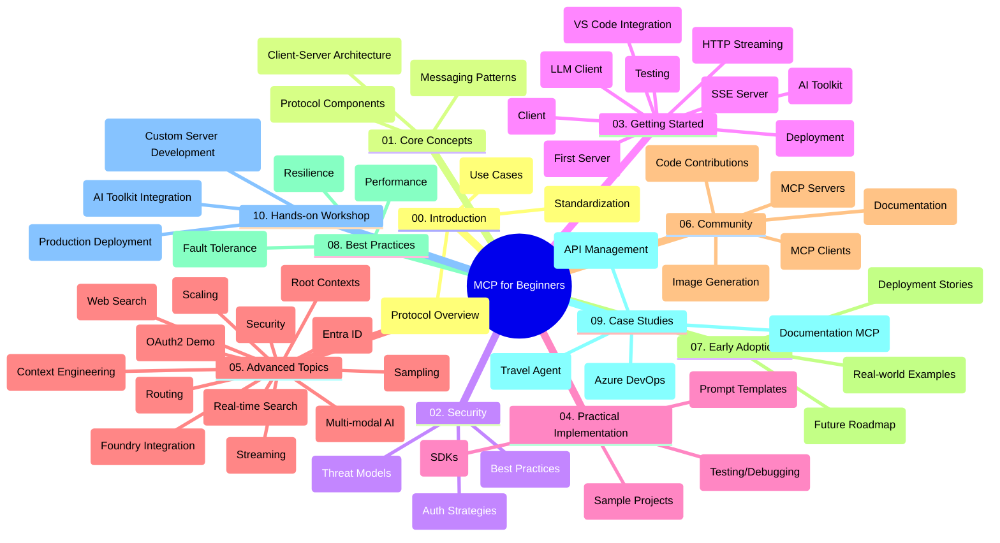

<!--
CO_OP_TRANSLATOR_METADATA:
{
  "original_hash": "5f321ea583cf087a94e47ee74c62b504",
  "translation_date": "2025-07-17T12:29:59+00:00",
  "source_file": "study_guide.md",
  "language_code": "my"
}
-->
# Model Context Protocol (MCP) for Beginners - သင်ကြားမှုလမ်းညွှန်

ဤသင်ကြားမှုလမ်းညွှန်သည် "Model Context Protocol (MCP) for Beginners" သင်ရိုးညွှန်းတမ်းအတွက် repository ဖွဲ့စည်းမှုနှင့် အကြောင်းအရာများကို အနှစ်ချုပ်ပေးထားသည်။ Repository ကို ထိရောက်စွာ လမ်းညွှန်ရန်နှင့် ရရှိနိုင်သော အရင်းအမြစ်များကို အကောင်းဆုံး အသုံးချနိုင်ရန် ဤလမ်းညွှန်ကို အသုံးပြုပါ။

## Repository အနှစ်ချုပ်

Model Context Protocol (MCP) သည် AI မော်ဒယ်များနှင့် client application များအကြား ဆက်သွယ်မှုများအတွက် စံပြဖွဲ့စည်းမှုတစ်ခုဖြစ်သည်။ မူလအားဖြင့် Anthropic မှ ဖန်တီးခဲ့ပြီး ယခုအခါ MCP community အားလုံးမှ GitHub အဖွဲ့အစည်းမှ တာဝန်ယူထိန်းသိမ်းနေသည်။ ဤ repository တွင် C#, Java, JavaScript, Python, နှင့် TypeScript တို့ဖြင့် လက်တွေ့ကုဒ်နမူနာများပါဝင်သည့် သင်ရိုးညွှန်းတမ်းတစ်ခုကို AI developer များ၊ system architect များနှင့် software engineer များအတွက် ဖန်တီးထားသည်။

## မြင်ကွင်းသင်ရိုးမြေပုံ

## Repository ဖွဲ့စည်းမှု

Repository ကို MCP ၏ အမျိုးမျိုးသော အချက်အလက်များအပေါ် အာရုံစိုက်ထားသည့် အဓိကပိုင်း ၁၀ ခုအဖြစ် စီစဉ်ထားသည်-

1. **Introduction (00-Introduction/)**
   - Model Context Protocol အကြောင်းအနှစ်ချုပ်
   - AI pipeline များတွင် စံပြဖွဲ့စည်းမှု၏ အရေးပါမှု
   - လက်တွေ့အသုံးချမှုများနှင့် အကျိုးကျေးဇူးများ

2. **Core Concepts (01-CoreConcepts/)**
   - Client-server ဖွဲ့စည်းမှု
   - အဓိက protocol အစိတ်အပိုင်းများ
   - MCP တွင် အသုံးပြုသော စာတိုက်ပုံစံများ

3. **Security (02-Security/)**
   - MCP အခြေခံ စနစ်များတွင် ဖြစ်ပေါ်နိုင်သော လုံခြုံရေး အန္တရာယ်များ
   - လုံခြုံရေး အကောင်အထည်ဖော်မှုအတွက် အကောင်းဆုံး လုပ်ထုံးလုပ်နည်းများ
   - အတည်ပြုခြင်းနှင့် ခွင့်ပြုခြင်း မဟာဗျူဟာများ

4. **Getting Started (03-GettingStarted/)**
   - ပတ်ဝန်းကျင် ပြင်ဆင်ခြင်းနှင့် ဖွဲ့စည်းခြင်း
   - အခြေခံ MCP server နှင့် client များ ဖန်တီးခြင်း
   - ရှိပြီးသား application များနှင့် ပေါင်းစည်းခြင်း
   - အပိုင်းများတွင် ပါဝင်သည်-
     - ပထမဆုံး server အကောင်အထည်ဖော်ခြင်း
     - Client ဖန်တီးခြင်း
     - LLM client ပေါင်းစည်းခြင်း
     - VS Code ပေါင်းစည်းခြင်း
     - Server-Sent Events (SSE) server
     - HTTP streaming
     - AI Toolkit ပေါင်းစည်းခြင်း
     - စမ်းသပ်မှု မဟာဗျူဟာများ
     - တပ်ဆင်ခြင်း လမ်းညွှန်ချက်များ

5. **Practical Implementation (04-PracticalImplementation/)**
   - အမျိုးမျိုးသော programming language များတွင် SDK များ အသုံးပြုခြင်း
   - Debugging, စမ်းသပ်ခြင်းနှင့် အတည်ပြုခြင်း နည်းလမ်းများ
   - ပြန်လည်အသုံးပြုနိုင်သော prompt template များနှင့် workflow များ ဖန်တီးခြင်း
   - နမူနာပရောဂျက်များနှင့် အကောင်အထည်ဖော်မှု ဥပမာများ

6. **Advanced Topics (05-AdvancedTopics/)**
   - Context engineering နည်းပညာများ
   - Foundry agent ပေါင်းစည်းခြင်း
   - Multi-modal AI workflow များ
   - OAuth2 authentication များ ပြသခြင်း
   - အချိန်နှင့်တပြေးညီ ရှာဖွေရေး စွမ်းဆောင်ရည်များ
   - အချိန်နှင့်တပြေးညီ streaming
   - Root context များ အကောင်အထည်ဖော်ခြင်း
   - Routing မဟာဗျူဟာများ
   - Sampling နည်းလမ်းများ
   - စွမ်းဆောင်ရည် တိုးမြှင့်ခြင်းနည်းလမ်းများ
   - လုံခြုံရေး စဉ်းစားချက်များ
   - Entra ID လုံခြုံရေး ပေါင်းစည်းခြင်း
   - Web search ပေါင်းစည်းခြင်း

7. **Community Contributions (06-CommunityContributions/)**
   - ကုဒ်နှင့် စာတမ်းများ ပံ့ပိုးပေးခြင်းနည်းလမ်းများ
   - GitHub မှတဆင့် ပူးပေါင်းဆောင်ရွက်ခြင်း
   - အသိုင်းအဝိုင်းမှ တိုးတက်မှုများနှင့် တုံ့ပြန်ချက်များ
   - MCP client များ (Claude Desktop, Cline, VSCode) အသုံးပြုခြင်း
   - လူကြိုက်များသော MCP server များနှင့် ပူးပေါင်းဆောင်ရွက်ခြင်း (ပုံရိပ်ဖန်တီးခြင်း အပါအဝင်)

8. **Lessons from Early Adoption (07-LessonsfromEarlyAdoption/)**
   - လက်တွေ့ အကောင်အထည်ဖော်မှုများနှင့် အောင်မြင်မှုဇာတ်လမ်းများ
   - MCP အခြေခံ ဖြေရှင်းချက်များ တည်ဆောက်ခြင်းနှင့် တပ်ဆင်ခြင်း
   - လမ်းကြောင်းနှင့် အနာဂတ် ရှုမြင်ချက်များ

9. **Best Practices (08-BestPractices/)**
   - စွမ်းဆောင်ရည် တိုးတက်အောင် ပြုပြင်ခြင်းနှင့် အကောင်းဆုံး လုပ်ထုံးလုပ်နည်းများ
   - MCP စနစ်များကို အမှားခံနိုင်စွမ်းရှိအောင် ဒီဇိုင်းဆွဲခြင်း
   - စမ်းသပ်ခြင်းနှင့် တည်ငြိမ်မှု မဟာဗျူဟာများ

10. **Case Studies (09-CaseStudy/)**
    - ကိစ္စလေ့လာမှု- Azure API Management ပေါင်းစည်းခြင်း
    - ကိစ္စလေ့လာမှု- ခရီးသွားအေးဂျင့် အကောင်အထည်ဖော်ခြင်း
    - ကိစ္စလေ့လာမှု- Azure DevOps နှင့် YouTube ပေါင်းစည်းခြင်း
    - အသေးစိတ်စာတမ်းများနှင့် အကောင်အထည်ဖော်မှု ဥပမာများ

11. **Hands-on Workshop (10-StreamliningAIWorkflowsBuildingAnMCPServerWithAIToolkit/)**
    - MCP နှင့် AI Toolkit ပေါင်းစပ်ထားသည့် လက်တွေ့ လေ့ကျင့်ခန်း
    - AI မော်ဒယ်များနှင့် လက်တွေ့ကိရိယာများကို ချိတ်ဆက်ထားသည့် အတတ်ပညာမြင့် application များ တည်ဆောက်ခြင်း
    - အခြေခံအချက်များ၊ စိတ်ကြိုက် server ဖန်တီးခြင်းနှင့် ထုတ်လုပ်မှု တပ်ဆင်ခြင်း မော်ဂျူးများ ပါဝင်သည်
    - လမ်းညွှန်ချက်အဆင့်ဆင့်ဖြင့် လေ့လာသင်ယူမှု

## အပိုဆောင်း အရင်းအမြစ်များ

Repository တွင် အောက်ပါ အထောက်အပံ့များ ပါဝင်သည်-

- **Images ဖိုလ်ဒါ**: သင်ရိုးတွင် အသုံးပြုသော ပုံဆွဲများနှင့် ရုပ်ပုံများ
- **ဘာသာပြန်ချက်များ**: စာတမ်းများကို အလိုအလျောက် ဘာသာပြန်ထားခြင်းဖြင့် ဘာသာစကားစုံထောက်ပံ့မှု
- **တရားဝင် MCP အရင်းအမြစ်များ**:
  - [MCP Documentation](https://modelcontextprotocol.io/)
  - [MCP Specification](https://spec.modelcontextprotocol.io/)
  - [MCP GitHub Repository](https://github.com/modelcontextprotocol)

## ဤ Repository ကို မည်သို့ အသုံးပြုမည်နည်း

1. **အဆင့်လိုက် သင်ယူခြင်း**: အခန်းများကို အစဉ်လိုက် (00 မှ 10 အထိ) လေ့လာပါ။
2. **ဘာသာစကားအလိုက် အာရုံစိုက်ခြင်း**: သင်စိတ်ဝင်စားသော programming language အတွက် samples ဖိုလ်ဒါများကို ရှာဖွေပါ။
3. **လက်တွေ့ အကောင်အထည်ဖော်ခြင်း**: ပတ်ဝန်းကျင် ပြင်ဆင်ပြီး ပထမဆုံး MCP server နှင့် client ဖန်တီးခြင်းအတွက် "Getting Started" အပိုင်းကို စတင်ပါ။
4. **အဆင့်မြင့် လေ့လာမှု**: အခြေခံများကို နားလည်ပြီးပါက advanced topics များသို့ ဝင်ရောက်လေ့လာပါ။
5. **အသိုင်းအဝိုင်း ပါဝင်ဆောင်ရွက်ခြင်း**: GitHub ဆွေးနွေးပွဲများနှင့် Discord ချန်နယ်များမှတဆင့် MCP အသိုင်းအဝိုင်းနှင့် ဆက်သွယ်ပါ။

## MCP Client များနှင့် ကိရိယာများ

သင်ရိုးတွင် MCP client များနှင့် ကိရိယာများ အမျိုးမျိုး ပါဝင်သည်-

1. **တရားဝင် Client များ**:
   - Visual Studio Code
   - MCP in Visual Studio Code
   - Claude Desktop
   - Claude in VSCode
   - Claude API

2. **အသိုင်းအဝိုင်း Client များ**:
   - Cline (terminal-based)
   - Cursor (code editor)
   - ChatMCP
   - Windsurf

3. **MCP စီမံခန့်ခွဲမှု ကိရိယာများ**:
   - MCP CLI
   - MCP Manager
   - MCP Linker
   - MCP Router

## လူကြိုက်များသော MCP Server များ

Repository တွင် မတူညီသော MCP server များကို မိတ်ဆက်ထားသည်-

1. **တရားဝင် ကိုးကား Server များ**:
   - Filesystem
   - Fetch
   - Memory
   - Sequential Thinking

2. **ပုံရိပ် ဖန်တီးခြင်း**:
   - Azure OpenAI DALL-E 3
   - Stable Diffusion WebUI
   - Replicate

3. **ဖွံ့ဖြိုးရေး ကိရိယာများ**:
   - Git MCP
   - Terminal Control
   - Code Assistant

4. **အထူးပြု Server များ**:
   - Salesforce
   - Microsoft Teams
   - Jira & Confluence

## ပံ့ပိုးမှု ပေးခြင်း

ဤ repository သည် အသိုင်းအဝိုင်းမှ ပံ့ပိုးမှုများကို ကြိုဆိုပါသည်။ MCP ecosystem တွင် ထိရောက်စွာ ပံ့ပိုးပေးရန် Community Contributions အပိုင်းကို ကြည့်ရှုပါ။

## ပြောင်းလဲမှုမှတ်တမ်း

| ရက်စွဲ | ပြောင်းလဲမှုများ |
|---------|------------------|
| July 16, 2025 | - Repository ဖွဲ့စည်းမှုကို လက်ရှိ အကြောင်းအရာနှင့် ကိုက်ညီအောင် ပြင်ဆင်ထားသည် - MCP Clients နှင့် Tools အပိုင်း ထည့်သွင်းထားသည် - လူကြိုက်များသော MCP Servers အပိုင်း ထည့်သွင်းထားသည် - မြင်ကွင်းသင်ရိုးမြေပုံကို လက်ရှိ အကြောင်းအရာများဖြင့် တိုးမြှင့်ထားသည် - Advanced Topics အပိုင်းကို အထူးပြု နယ်ပယ်များဖြင့် တိုးချဲ့ထားသည် - Case Studies ကို လက်တွေ့ ဥပမာများဖြင့် ပြင်ဆင်ထားသည် - MCP ကို Anthropic မှ ဖန်တီးခဲ့သည်ဟု ရှင်းလင်းပြထားသည် |
| June 11, 2025 | - သင်ကြားမှုလမ်းညွှန်ကို ပထမဆုံး ဖန်တီးခဲ့သည် - မြင်ကွင်းသင်ရိုးမြေပုံ ထည့်သွင်းခဲ့သည် - Repository ဖွဲ့စည်းမှုကို ဖော်ပြခဲ့သည် - နမူနာပရောဂျက်များနှင့် အပိုဆောင်း အရင်းအမြစ်များ ထည့်သွင်းခဲ့သည် |

---

*ဤသင်ကြားမှုလမ်းညွှန်ကို July 16, 2025 တွင် ပြင်ဆင်ပြီး ထိုရက်စွဲအထိ Repository အကြောင်းအရာကို အနှစ်ချုပ်ပေးထားသည်။ ထိုရက်စွဲအပြီးတွင် Repository အကြောင်းအရာများ ပြောင်းလဲမှုများ ဖြစ်ပေါ်နိုင်ပါသည်။*

**အကြောင်းကြားချက်**  
ဤစာတမ်းကို AI ဘာသာပြန်ဝန်ဆောင်မှု [Co-op Translator](https://github.com/Azure/co-op-translator) ဖြင့် ဘာသာပြန်ထားပါသည်။ ကျွန်ုပ်တို့သည် တိကျမှန်ကန်မှုအတွက် ကြိုးစားသော်လည်း၊ အလိုအလျောက် ဘာသာပြန်ခြင်းများတွင် အမှားများ သို့မဟုတ် မှားယွင်းချက်များ ပါဝင်နိုင်ကြောင်း သတိပြုပါရန် မေတ္တာရပ်ခံအပ်ပါသည်။ မူရင်းစာတမ်းကို မူလဘာသာဖြင့်သာ အတည်ပြုရမည့် အရင်းအမြစ်အဖြစ် သတ်မှတ်သင့်ပါသည်။ အရေးကြီးသော အချက်အလက်များအတွက် လူ့ဘာသာပြန်ပညာရှင်မှ ဘာသာပြန်ခြင်းကို အကြံပြုပါသည်။ ဤဘာသာပြန်ချက်ကို အသုံးပြုရာမှ ဖြစ်ပေါ်လာနိုင်သည့် နားလည်မှုမှားယွင်းမှုများအတွက် ကျွန်ုပ်တို့သည် တာဝန်မယူပါ။