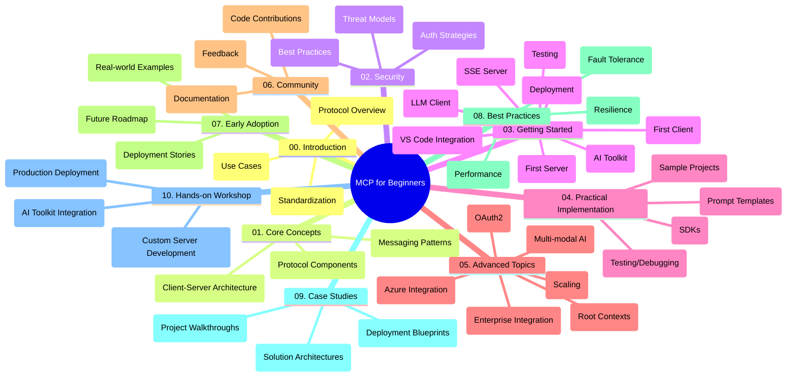

<!--
CO_OP_TRANSLATOR_METADATA:
{
  "original_hash": "a607d4febc94caee9a12b77795f7fc9a",
  "translation_date": "2025-06-17T16:21:41+00:00",
  "source_file": "study_guide.md",
  "language_code": "my"
}
-->
# Model Context Protocol (MCP) for Beginners - သင်ယူလမ်းညွှန်

ဒီသင်ယူလမ်းညွှန်မှာ "Model Context Protocol (MCP) for Beginners" သင်ရိုးညွှန်းတမ်းအတွက် repository ဖွဲ့စည်းပုံနဲ့ အကြောင်းအရာများကို အနှစ်ချုပ်ပေးထားပါတယ်။ ဒီလမ်းညွှန်ကို အသုံးပြုပြီး repository ကို ထိရောက်စွာ ရှာဖွေကြည့်ရှုနိုင်ပြီး ရရှိနိုင်တဲ့ အရင်းအမြစ်များကို အကောင်းဆုံး အသုံးချနိုင်ပါသည်။

## Repository အကြောင်းအရာ

Model Context Protocol (MCP) သည် AI မော်ဒယ်များနှင့် client application များအကြား ဆက်သွယ်မှုအတွက် စံပြ ပုံစံတစ်ခုဖြစ်သည်။ ဒီ repository တွင် AI ဖန်တီးသူများ၊ စနစ်ဒီဇိုင်နာများနှင့် ဆော့ဖ်ဝဲ အင်ဂျင်နီယာများအတွက် C#, Java, JavaScript, Python, TypeScript ဘာသာစကားများဖြင့် လက်တွေ့ ကုဒ်နမူနာများပါဝင်သည့် သင်ရိုးညွှန်းတမ်း တစ်ခုကို လုံးဝ ပြည့်စုံစွာ ပေးထားသည်။

## မြင်ကွင်းဆန်းသစ် သင်ရိုးမြေပုံ

## Repository ဖွဲ့စည်းပုံ

ဒီ repository ကို MCP ၏ အကြောင်းအရာ အမျိုးမျိုးကို အာရုံစိုက်ထားသည့် အဓိက အပိုင်း ၁၀ ခုပြုစုထားသည်-

1. **Introduction (00-Introduction/)**
   - Model Context Protocol ၏ အကျဉ်းချုပ်
   - AI pipeline များတွင် စံပြထားခြင်း၏ အရေးပါမှု
   - လက်တွေ့ အသုံးချမှုများနှင့် အကျိုးကျေးဇူးများ

2. **Core Concepts (01-CoreConcepts/)**
   - Client-server အဆောက်အအုံ
   - အဓိက protocol အစိတ်အပိုင်းများ
   - MCP တွင် သတင်းစကားပုံစံများ

3. **Security (02-Security/)**
   - MCP အခြေခံ စနစ်များတွင် ဖြစ်ပေါ်နိုင်သော လုံခြုံရေး ခြိမ်းခြောက်မှုများ
   - လုံခြုံရေး တည်ဆောက်မှုအတွက် အကောင်းဆုံး လုပ်ထုံးလုပ်နည်းများ
   - အတည်ပြုခြင်းနှင့် ခွင့်ပြုခြင်း မဟာဗျူဟာများ

4. **Getting Started (03-GettingStarted/)**
   - ပတ်ဝန်းကျင် ပြင်ဆင်ခြင်းနှင့် စနစ်ဖွဲ့စည်းခြင်း
   - မူလ MCP server နှင့် client ဖန်တီးခြင်း
   - ရှိပြီးသား application များနှင့် ပေါင်းစည်းခြင်း
   - ပထမဆုံး server, ပထမဆုံး client, LLM client, VS Code ပေါင်းစည်းခြင်း, SSE server, AI Toolkit, စမ်းသပ်ခြင်းနှင့် ထုတ်လုပ်ခြင်း အပိုင်းများ

5. **Practical Implementation (04-PracticalImplementation/)**
   - ဘာသာစကားအမျိုးမျိုးအတွက် SDK အသုံးပြုခြင်း
   - ပြဿနာရှာဖွေရေး၊ စမ်းသပ်ခြင်းနှင့် အတည်ပြုခြင်းနည်းလမ်းများ
   - ပြန်လည်အသုံးပြုနိုင်သော prompt template များနှင့် workflow များ ဖန်တီးခြင်း
   - လက်တွေ့ နမူနာပရောဂျက်များနှင့် အကောင်အထည်ဖော်မှုနမူနာများ

6. **Advanced Topics (05-AdvancedTopics/)**
   - မျိုးစုံ AI workflow များနှင့် ဆက်လက်တိုးချဲ့နိုင်မှု
   - လုံခြုံစိတ်ချရသော စွမ်းဆောင်ရည်တိုးမြှင့်ခြင်း မဟာဗျူဟာများ
   - MCP ကို စီးပွားရေး စနစ်များတွင် အသုံးချခြင်း
   - Azure ပေါင်းစည်းခြင်း, မျိုးစုံမှု, OAuth2, root context များ, routing, sampling, scaling, security, web search ပေါင်းစည်းခြင်းနှင့် streaming အပါအဝင် အထူးအကြောင်းအရာများ

7. **Community Contributions (06-CommunityContributions/)**
   - ကုဒ်နှင့် စာတမ်းများ ပံ့ပိုးထည့်သွင်းနည်း
   - GitHub မှတဆင့် ပူးပေါင်းဆောင်ရွက်ခြင်း
   - အသိုင်းအဝိုင်းမှ တိုးတက်မှုများနှင့် အကြံပြုချက်များ

8. **Lessons from Early Adoption (07-LessonsfromEarlyAdoption/)**
   - လက်တွေ့ အသုံးပြုမှုများနှင့် အောင်မြင်မှုဇာတ်လမ်းများ
   - MCP အခြေခံ ဖြေရှင်းချက်များ တည်ဆောက်ခြင်းနှင့် ထုတ်လုပ်ခြင်း
   - လက်ရှိလမ်းစဉ်များနှင့် အနာဂတ် ရှေ့ပြေး

9. **Best Practices (08-BestPractices/)**
   - စွမ်းဆောင်ရည် မြှင့်တင်ခြင်းနှင့် အကောင်းဆုံး လုပ်ထုံးလုပ်နည်းများ
   - MCP စနစ်များတွင် အမှားခံနိုင်စွမ်း ဖန်တီးခြင်း
   - စမ်းသပ်ခြင်းနှင့် တည်ငြိမ်မှု မဟာဗျူဟာများ

10. **Case Studies (09-CaseStudy/)**
    - MCP ဖြေရှင်းချက် အဆောက်အအုံများ အနက်ရှိုင်းစွာ လေ့လာခြင်း
    - ထုတ်လုပ်မှု နည်းလမ်းများနှင့် ပေါင်းစည်းမှု အကြံပြုချက်များ
    - မှတ်ချက်ဖြင့် ဖော်ပြထားသော ပုံဆွဲများနှင့် ပရောဂျက် လမ်းညွှန်များ

11. **Hands-on Workshop (10-StreamliningAIWorkflowsBuildingAnMCPServerWithAIToolkit/)**
    - Microsoft ၏ AI Toolkit နှင့် MCP ကို ပေါင်းစပ်ထားသည့် လက်တွေ့ အလုပ်ရုံဆွေးနွေးပွဲ
    - AI မော်ဒယ်များနှင့် လက်တွေ့ကိရိယာများကို တိုက်ဆိုင်စေသည့် ပညာရှိ application များ တည်ဆောက်ခြင်း
    - အခြေခံအချက်များ၊ စိတ်ကြိုက် server ဖန်တီးခြင်းနှင့် ထုတ်လုပ်မှု မဟာဗျူဟာများ ပါဝင်သော လေ့ကျင့်မှု များ

## နမူနာပရောဂျက်များ

ဒီ repository တွင် MCP အကောင်အထည်ဖော်မှုကို ဘာသာစကားအမျိုးမျိုးဖြင့် ပြသထားသော နမူနာပရောဂျက်များ ပါဝင်သည်-

### အခြေခံ MCP ကိန်းဂဏန်း နမူနာများ
- C# MCP Server နမူနာ
- Java MCP Calculator
- JavaScript MCP ပြသမှု
- Python MCP Server
- TypeScript MCP နမူနာ

### အဆင့်မြင့် MCP ကိန်းဂဏန်း ပရောဂျက်များ
- အဆင့်မြင့် C# နမူနာ
- Java Container App နမူနာ
- JavaScript အဆင့်မြင့် နမူနာ
- Python ရှုပ်ထွေးသော အကောင်အထည်ဖော်မှု
- TypeScript Container နမူနာ

## အပိုဆောင်း အရင်းအမြစ်များ

ဒီ repository တွင် အောက်ပါ ထောက်ပံ့ပစ္စည်းများ ပါဝင်သည်-

- **Images ဖိုလ်ဒါ**: သင်ရိုးတစ်လျှောက် အသုံးပြုသော ပုံဆွဲများနှင့် ရုပ်ပုံများ
- **ဘာသာပြန်ခြင်းများ**: စာတမ်းများအတွက် မျိုးစုံဘာသာစကား ပံ့ပိုးမှုနှင့် အလိုအလျောက် ဘာသာပြန်မှုများ
- **တရားဝင် MCP အရင်းအမြစ်များ**:
  - [MCP Documentation](https://modelcontextprotocol.io/)
  - [MCP Specification](https://spec.modelcontextprotocol.io/)
  - [MCP GitHub Repository](https://github.com/modelcontextprotocol)

## ဒီ Repository ကို ဘယ်လို အသုံးပြုမလဲ

1. **အဆင့်လိုက် သင်ယူခြင်း**: အပိုင်း (00 မှ 10) အလိုက် အဆင့်လိုက် သင်ယူပါ။
2. **ဘာသာစကားအလိုက် အာရုံစိုက်ခြင်း**: သင်စိတ်ဝင်စားသော programming ဘာသာစကားအတွက် samples ဖိုလ်ဒါများကို ရှာဖွေပါ။
3. **လက်တွေ့ အကောင်အထည်ဖော်ခြင်း**: ပတ်ဝန်းကျင် ပြင်ဆင်ခြင်းနှင့် ပထမဆုံး MCP server နှင့် client ဖန်တီးခြင်းအတွက် "Getting Started" အပိုင်းကို စတင်ပါ။
4. **အဆင့်မြင့် စူးစမ်းခြင်း**: အခြေခံများကို နားလည်ပြီးနောက် အဆင့်မြင့် အကြောင်းအရာများသို့ ဝင်ရောက်လေ့လာပါ။
5. **အသိုင်းအဝိုင်း နှင့် ဆက်သွယ်ခြင်း**: [Azure AI Foundry Discord](https://discord.com/invite/ByRwuEEgH4) တွင် ပါဝင်၍ ကျွမ်းကျင်သူများနှင့် တူညီသူများနှင့် ဆက်သွယ်ပါ။

## ပံ့ပိုးမှု ထည့်သွင်းခြင်း

ဒီ repository သည် အသိုင်းအဝိုင်းမှ ပံ့ပိုးမှုများကို ကြိုဆိုပါသည်။ ပံ့ပိုးမှု ထည့်သွင်းနည်းများအတွက် Community Contributions အပိုင်းကို ကြည့်ရှုပါ။

---

*ဒီသင်ယူလမ်းညွှန်ကို ၂၀၂၅ ခုနှစ် ဇွန်လ ၁၁ ရက်နေ့တွင် ဖန်တီးထားပြီး အဆိုပါနေ့အထိ repository ၏ အနှစ်ချုပ်ကို ပေးထားပါသည်။ ထို့နောက် repository အကြောင်းအရာများ ပြောင်းလဲမှုရှိနိုင်ပါသည်။*

**အချက်ပြချက်**  
ဤစာတမ်းကို AI ဘာသာပြန်ဝန်ဆောင်မှု [Co-op Translator](https://github.com/Azure/co-op-translator) အသုံးပြု၍ ဘာသာပြန်ထားပါသည်။ ကျွန်ုပ်တို့သည် မှန်ကန်မှုအတွက် ကြိုးပမ်းနေသော်လည်း၊ စက်ကိရိယာဖြင့် ဘာသာပြန်မှုများတွင် အမှားများ သို့မဟုတ် မှားယွင်းမှုများ ပါဝင်နိုင်ကြောင်း သတိပြုပါရန် မေတ္တာရပ်ခံအပ်ပါသည်။ မူရင်းစာတမ်းကို မူလဘာသာဖြင့်သာ တရားဝင် အချက်အလက်အရင်းအမြစ်အဖြစ် ယူဆသင့်ပါသည်။ အရေးကြီးသော အချက်အလက်များအတွက် လူ့ဘာသာပြန်သူမှ ဘာသာပြန်ခြင်းကို အကြံပြုပါသည်။ ဤဘာသာပြန်ချက် အသုံးပြုမှုကြောင့် ဖြစ်ပေါ်လာသော နားလည်မှုမှားယွင်းမှုများအတွက် ကျွန်ုပ်တို့သည် တာဝန်မရှိပါ။