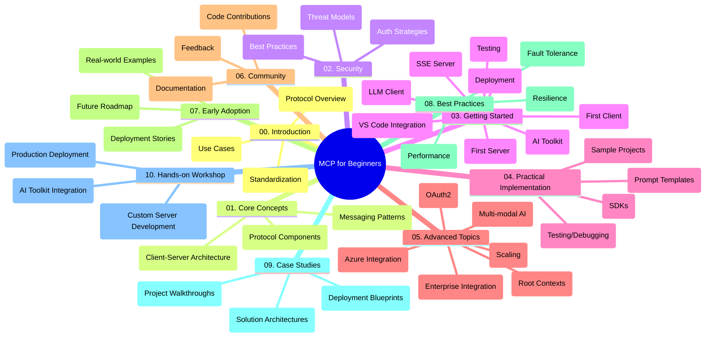

<!--
CO_OP_TRANSLATOR_METADATA:
{
  "original_hash": "a607d4febc94caee9a12b77795f7fc9a",
  "translation_date": "2025-07-13T15:19:35+00:00",
  "source_file": "study_guide.md",
  "language_code": "my"
}
-->
# Model Context Protocol (MCP) for Beginners - သင်ကြားမှုလမ်းညွှန်

ဤသင်ကြားမှုလမ်းညွှန်သည် "Model Context Protocol (MCP) for Beginners" သင်ရိုးညွှန်းတမ်းအတွက် repository ဖွဲ့စည်းမှုနှင့် အကြောင်းအရာများကို အနှစ်ချုပ်ပေးထားသည်။ Repository ကို ထိရောက်စွာ လမ်းညွှန်ရန်နှင့် ရရှိနိုင်သော အရင်းအမြစ်များကို အကောင်းဆုံးအသုံးချရန် ဤလမ်းညွှန်ကို အသုံးပြုပါ။

## Repository အနှစ်ချုပ်

Model Context Protocol (MCP) သည် AI မော်ဒယ်များနှင့် client application များအကြား ဆက်သွယ်မှုများအတွက် စံပြဖွဲ့စည်းမှုတစ်ခုဖြစ်သည်။ ဤ repository တွင် C#, Java, JavaScript, Python, နှင့် TypeScript တို့ဖြင့် လက်တွေ့ကုဒ်နမူနာများပါဝင်သည့် ကျယ်ပြန့်သော သင်ရိုးညွှန်းတမ်းတစ်ခုကို AI ဖန်တီးသူများ၊ စနစ်ဒီဇိုင်နာများနှင့် ဆော့ဖ်ဝဲအင်ဂျင်နီယာများအတွက် ဖန်တီးထားသည်။

## မြင်ကွင်းသင်ရိုးမြေပုံ

## Repository ဖွဲ့စည်းမှု

Repository ကို MCP ၏ အမျိုးမျိုးသော အချက်အလက်များအပေါ် အာရုံစိုက်ထားသည့် အဓိကပိုင်း ၁၀ ခုအဖြစ် စီစဉ်ထားသည်-

1. **နိဒါန်း (00-Introduction/)**
   - Model Context Protocol အကြောင်းအနှစ်ချုပ်
   - AI pipeline များတွင် စံပြဖွဲ့စည်းမှု၏ အရေးပါမှု
   - လက်တွေ့အသုံးချမှုများနှင့် အကျိုးကျေးဇူးများ

2. **အခြေခံအယူအဆများ (01-CoreConcepts/)**
   - Client-server ဖွဲ့စည်းမှု
   - အဓိက protocol အစိတ်အပိုင်းများ
   - MCP တွင် သတင်းပို့ပုံစံများ

3. **လုံခြုံရေး (02-Security/)**
   - MCP အခြေပြု စနစ်များရှိ လုံခြုံရေး အန္တရာယ်များ
   - လုံခြုံရေးအကောင်အထည်ဖော်မှုအတွက် အကောင်းဆုံး လုပ်ထုံးလုပ်နည်းများ
   - အတည်ပြုခြင်းနှင့် ခွင့်ပြုခြင်း မဟာဗျူဟာများ

4. **စတင်အသုံးပြုခြင်း (03-GettingStarted/)**
   - ပတ်ဝန်းကျင် ပြင်ဆင်ခြင်းနှင့် ဖွဲ့စည်းခြင်း
   - အခြေခံ MCP server နှင့် client များ ဖန်တီးခြင်း
   - ရှိပြီးသား application များနှင့် ပေါင်းစပ်ခြင်း
   - ပထမဆုံး server, ပထမဆုံး client, LLM client, VS Code ပေါင်းစပ်ခြင်း, SSE server, AI Toolkit, စမ်းသပ်ခြင်းနှင့် ထုတ်လုပ်ခြင်း အပိုင်းများ

5. **လက်တွေ့အကောင်အထည်ဖော်ခြင်း (04-PracticalImplementation/)**
   - အမျိုးမျိုးသော programming language များတွင် SDK များ အသုံးပြုခြင်း
   - အမှားရှာဖွေခြင်း၊ စမ်းသပ်ခြင်းနှင့် အတည်ပြုခြင်း နည်းလမ်းများ
   - ပြန်လည်အသုံးပြုနိုင်သော prompt template များနှင့် workflow များ ဖန်တီးခြင်း
   - အကောင်အထည်ဖော်မှု နမူနာပရောဂျက်များ

6. **အဆင့်မြင့်အကြောင်းအရာများ (05-AdvancedTopics/)**
   - မျိုးစုံ AI workflow များနှင့် တိုးချဲ့နိုင်မှု
   - လုံခြုံစိတ်ချရသော တိုးချဲ့မှု မဟာဗျူဟာများ
   - စီးပွားရေးလုပ်ငန်း စနစ်များတွင် MCP ၏ အသုံးချမှု
   - Azure ပေါင်းစပ်ခြင်း၊ မျိုးစုံပုံစံ၊ OAuth2, root context များ၊ routing, sampling, scaling, security, web search ပေါင်းစပ်ခြင်းနှင့် streaming အပါအဝင် အထူးပြုအကြောင်းအရာများ

7. **အသိုင်းအဝိုင်း ပံ့ပိုးမှုများ (06-CommunityContributions/)**
   - ကုဒ်နှင့် စာတမ်းများ ပံ့ပိုးပေးနည်း
   - GitHub မှတဆင့် ပူးပေါင်းဆောင်ရွက်ခြင်း
   - အသိုင်းအဝိုင်းမှ တိုးတက်မှုများနှင့် တုံ့ပြန်ချက်များ

8. **အစောပိုင်း လက်ခံအသုံးပြုမှုမှ သင်ခန်းစာများ (07-LessonsfromEarlyAdoption/)**
   - လက်တွေ့အကောင်အထည်ဖော်မှုများနှင့် အောင်မြင်မှုဇာတ်လမ်းများ
   - MCP အခြေပြု ဖြေရှင်းချက်များ တည်ဆောက်ခြင်းနှင့် ထုတ်လုပ်ခြင်း
   - လမ်းကြောင်းနှင့် အနာဂတ် ရှေ့ပြေး

9. **အကောင်းဆုံး လုပ်ထုံးလုပ်နည်းများ (08-BestPractices/)**
   - စွမ်းဆောင်ရည် တိုးတက်မှုနှင့် အကောင်းဆုံး ပြုပြင်ခြင်း
   - MCP စနစ်များ အမှားခံနိုင်ရည်ရှိစေရေး ဒီဇိုင်းရေးဆွဲခြင်း
   - စမ်းသပ်ခြင်းနှင့် တည်ငြိမ်မှု မဟာဗျူဟာများ

10. **အမှုလေ့လာမှုများ (09-CaseStudy/)**
    - MCP ဖြေရှင်းချက် စနစ်ဒီဇိုင်းများ အနက်ရှိုင်းစွာ လေ့လာခြင်း
    - ထုတ်လုပ်မှု အကြံပြုချက်များနှင့် ပေါင်းစပ်နည်းများ
    - မှတ်ချက်ထည့်ထားသော ပုံဆွဲများနှင့် ပရောဂျက် လမ်းညွှန်ချက်များ

11. **လက်တွေ့ အလုပ်ရုံဆွေးနွေးပွဲ (10-StreamliningAIWorkflowsBuildingAnMCPServerWithAIToolkit/)**
    - MCP နှင့် Microsoft ၏ AI Toolkit ကို VS Code တွင် ပေါင်းစပ်ထားသည့် လက်တွေ့ အလုပ်ရုံဆွေးနွေးပွဲ
    - AI မော်ဒယ်များနှင့် လက်တွေ့ကိရိယာများကို ချိတ်ဆက်သည့် အတတ်ပညာဆိုင်ရာ application များ တည်ဆောက်ခြင်း
    - အခြေခံအကြောင်းအရာများ၊ စိတ်ကြိုက် server ဖန်တီးခြင်းနှင့် ထုတ်လုပ်မှု မဟာဗျူဟာများ ပါဝင်သော လက်တွေ့ module များ

## နမူနာပရောဂျက်များ

Repository တွင် MCP အကောင်အထည်ဖော်မှုကို အမျိုးမျိုးသော programming language များဖြင့် ပြသထားသည့် နမူနာပရောဂျက်များ ပါဝင်သည်-

### အခြေခံ MCP ကိန်းဂဏန်း နမူနာများ
- C# MCP Server နမူနာ
- Java MCP Calculator
- JavaScript MCP ပြသမှု
- Python MCP Server
- TypeScript MCP နမူနာ

### အဆင့်မြင့် MCP ကိန်းဂဏန်း ပရောဂျက်များ
- အဆင့်မြင့် C# နမူနာ
- Java Container App နမူနာ
- JavaScript အဆင့်မြင့် နမူနာ
- Python ရှုပ်ထွေးသော အကောင်အထည်ဖော်မှု
- TypeScript Container နမူနာ

## အပိုဆောင်း အရင်းအမြစ်များ

Repository တွင် အောက်ပါ အထောက်အပံ့ အရင်းအမြစ်များ ပါဝင်သည်-

- **Images ဖိုလ်ဒါ**: သင်ရိုးတစ်လျှောက် အသုံးပြုထားသော ပုံဆွဲများနှင့် ရုပ်ပုံများ
- **ဘာသာပြန်ချက်များ**: စာတမ်းများကို အလိုအလျောက် ဘာသာပြန်ထားသော မျိုးစုံဘာသာစကား ပံ့ပိုးမှု
- **တရားဝင် MCP အရင်းအမြစ်များ**:
  - [MCP Documentation](https://modelcontextprotocol.io/)
  - [MCP Specification](https://spec.modelcontextprotocol.io/)
  - [MCP GitHub Repository](https://github.com/modelcontextprotocol)

## ဤ Repository ကို မည်သို့ အသုံးပြုမည်နည်း

1. **အဆင့်လိုက် သင်ယူခြင်း**: အခန်းများကို အစဉ်လိုက် (00 မှ 10 အထိ) လေ့လာပါ။
2. **ဘာသာစကားအလိုက် အာရုံစိုက်ခြင်း**: သင်စိတ်ဝင်စားသော programming language အတွက် နမူနာဖိုင်များကို ရှာဖွေပါ။
3. **လက်တွေ့အကောင်အထည်ဖော်ခြင်း**: ပတ်ဝန်းကျင် ပြင်ဆင်ပြီး ပထမဆုံး MCP server နှင့် client ကို ဖန်တီးရန် "Getting Started" အပိုင်းကို စတင်ပါ။
4. **အဆင့်မြင့် လေ့လာမှု**: အခြေခံများကို နားလည်ပြီးနောက် အဆင့်မြင့်အကြောင်းအရာများသို့ ဝင်ရောက်လေ့လာပါ။
5. **အသိုင်းအဝိုင်း ပါဝင်ဆောင်ရွက်ခြင်း**: ကျွမ်းကျင်သူများနှင့် အတူတကွ ဆွေးနွေးရန် [Azure AI Foundry Discord](https://discord.com/invite/ByRwuEEgH4) တွင် ပါဝင်ဆက်သွယ်ပါ။

## ပံ့ပိုးမှု ပေးခြင်း

ဤ repository သည် အသိုင်းအဝိုင်းမှ ပံ့ပိုးမှုများကို ကြိုဆိုပါသည်။ ပံ့ပိုးပေးနည်းအတွက် Community Contributions အပိုင်းကို ကြည့်ရှုပါ။

---

*ဤသင်ကြားမှုလမ်းညွှန်ကို ၂၀၂၅ ခုနှစ် ဇွန်လ ၁၁ ရက်နေ့တွင် ဖန်တီးထားပြီး ထိုနေ့အထိ repository အကြောင်းအရာများကို အနှစ်ချုပ်ပေးထားသည်။ ထိုနေ့မှစ၍ repository အကြောင်းအရာများ ပြောင်းလဲမှုရှိနိုင်ပါသည်။*

**အကြောင်းကြားချက်**  
ဤစာတမ်းကို AI ဘာသာပြန်ဝန်ဆောင်မှု [Co-op Translator](https://github.com/Azure/co-op-translator) ဖြင့် ဘာသာပြန်ထားပါသည်။ ကျွန်ုပ်တို့သည် တိကျမှန်ကန်မှုအတွက် ကြိုးစားသော်လည်း အလိုအလျောက် ဘာသာပြန်ခြင်းတွင် အမှားများ သို့မဟုတ် မှားယွင်းချက်များ ပါဝင်နိုင်ကြောင်း သတိပြုပါရန် မေတ္တာရပ်ခံအပ်ပါသည်။ မူရင်းစာတမ်းကို မိမိဘာသာစကားဖြင့်သာ တရားဝင်အချက်အလက်အဖြစ် ယူဆသင့်ပါသည်။ အရေးကြီးသော အချက်အလက်များအတွက် လူ့ဘာသာပြန်ပညာရှင်မှ ဘာသာပြန်ခြင်းကို အကြံပြုပါသည်။ ဤဘာသာပြန်ချက်ကို အသုံးပြုရာမှ ဖြစ်ပေါ်လာနိုင်သည့် နားလည်မှုမှားယွင်းမှုများအတွက် ကျွန်ုပ်တို့ တာဝန်မယူပါ။