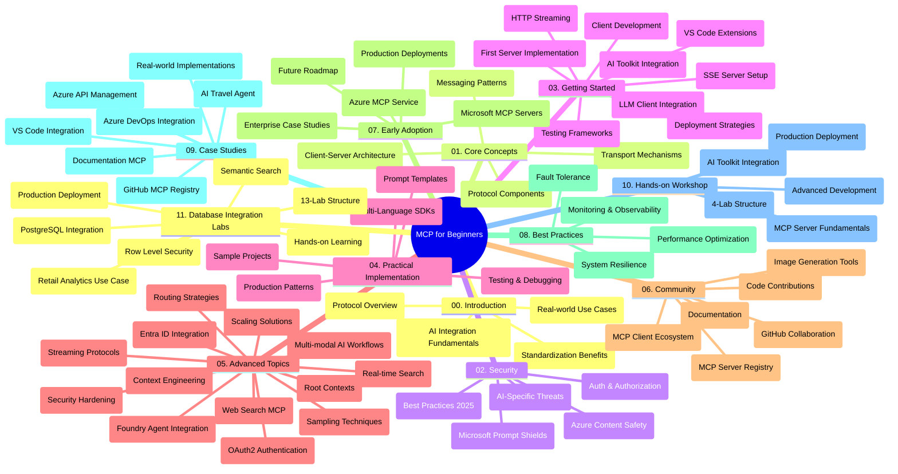

<!--
CO_OP_TRANSLATOR_METADATA:
{
  "original_hash": "aa1ce97bc694b08faf3018bab6d275b9",
  "translation_date": "2025-09-30T22:47:48+00:00",
  "source_file": "study_guide.md",
  "language_code": "my"
}
-->
# မော်ဒယ်အကြောင်းအရာ Protocol (MCP) အတွက် အခြေခံလမ်းညွှန် - သင်ကြားရေးလမ်းညွှန်

ဒီသင်ကြားရေးလမ်းညွှန်မှာ "မော်ဒယ်အကြောင်းအရာ Protocol (MCP) အတွက် အခြေခံ" သင်ခန်းစာအတွက် repository ရဲ့ ဖွဲ့စည်းမှုနဲ့ အကြောင်းအရာကို အကျဉ်းချုပ်ဖော်ပြထားပါတယ်။ Repository ကို ထိရောက်စွာအသုံးပြုနိုင်ဖို့ ဒီလမ်းညွှန်ကို အသုံးပြုပါ။

## Repository အကြောင်းအရာ

မော်ဒယ်အကြောင်းအရာ Protocol (MCP) ဟာ AI မော်ဒယ်တွေနဲ့ client application တွေကြားမှာ အပြန်အလှန်ဆက်သွယ်မှုအတွက် စံပြစနစ် framework တစ်ခုဖြစ်ပါတယ်။ အစပိုင်းမှာ Anthropic က ဖန်တီးခဲ့ပြီး အခုတော့ MCP community က GitHub အဖွဲ့အစည်းမှတဆင့် ထိန်းသိမ်းထားပါတယ်။ ဒီ repository မှာ C#, Java, JavaScript, Python, TypeScript စတဲ့ programming language တွေမှာ လက်တွေ့ code နမူနာတွေနဲ့အတူ AI developer, system architect, software engineer တွေအတွက် comprehensive သင်ခန်းစာတွေပါဝင်ပါတယ်။

## သင်ခန်းစာမြင်ကွင်းပုံစံ

## Repository ဖွဲ့စည်းမှု

Repository ကို MCP ရဲ့ အမျိုးမျိုးသောအပိုင်းဆိုင်ရာကို အဓိကထားပြီး အပိုင်း ၁၁ ခုအဖြစ် ဖွဲ့စည်းထားပါတယ်။

1. **Introduction (00-Introduction/)**
   - မော်ဒယ်အကြောင်းအရာ Protocol ရဲ့ အကျဉ်းချုပ်
   - AI pipeline တွေမှာ စံပြစနစ်ရဲ့ အရေးကြီးမှု
   - လက်တွေ့အသုံးချမှုနဲ့ အကျိုးကျေးဇူးများ

2. **Core Concepts (01-CoreConcepts/)**
   - Client-server architecture
   - Protocol ရဲ့ အဓိကအစိတ်အပိုင်းများ
   - MCP မှာ messaging pattern တွေ

3. **Security (02-Security/)**
   - MCP-based system တွေမှာ ဖြစ်နိုင်တဲ့လုံခြုံရေးအန္တရာယ်များ
   - လုံခြုံရေးအကောင်အထည်ဖော်မှုအတွက် အကောင်းဆုံးနည်းလမ်းများ
   - Authentication နဲ့ authorization ရဲ့ မူဝါဒများ
   - **လုံခြုံရေးအကျဉ်းချုပ်စာရွက်များ**:
     - MCP Security Best Practices 2025
     - Azure Content Safety Implementation Guide
     - MCP Security Controls and Techniques
     - MCP Best Practices Quick Reference
   - **အဓိကလုံခြုံရေးအကြောင်းအရာများ**:
     - Prompt injection နဲ့ tool poisoning အန္တရာယ်များ
     - Session hijacking နဲ့ confused deputy ပြဿနာများ
     - Token passthrough vulnerabilities
     - Excessive permissions နဲ့ access control
     - AI component တွေအတွက် supply chain security
     - Microsoft Prompt Shields integration

4. **Getting Started (03-GettingStarted/)**
   - ပတ်ဝန်းကျင် setup နဲ့ configuration
   - MCP server နဲ့ client အခြေခံဖန်တီးခြင်း
   - ရှိပြီးသား application တွေနဲ့ပေါင်းစည်းခြင်း
   - အပိုင်းများပါဝင်သည်:
     - ပထမဆုံး server implementation
     - Client development
     - LLM client integration
     - VS Code integration
     - Server-Sent Events (SSE) server
     - HTTP streaming
     - AI Toolkit integration
     - Testing strategies
     - Deployment guidelines

5. **Practical Implementation (04-PracticalImplementation/)**
   - အမျိုးမျိုးသော programming language တွေမှာ SDK အသုံးပြုခြင်း
   - Debugging, testing, validation နည်းလမ်းများ
   - Prompt template နဲ့ workflow တွေကို ပြန်အသုံးပြုနိုင်အောင် ဖန်တီးခြင်း
   - Implementation နမူနာများပါဝင်တဲ့ sample project တွေ

6. **Advanced Topics (05-AdvancedTopics/)**
   - Context engineering နည်းလမ်းများ
   - Foundry agent integration
   - Multi-modal AI workflow
   - OAuth2 authentication နမူနာများ
   - Real-time search နည်းလမ်းများ
   - Real-time streaming
   - Root contexts implementation
   - Routing strategies
   - Sampling techniques
   - Scaling approaches
   - Security considerations
   - Entra ID security integration
   - Web search integration

7. **Community Contributions (06-CommunityContributions/)**
   - Code နဲ့ documentation တွေကို ဘယ်လိုပံ့ပိုးမလဲ
   - GitHub မှတဆင့် ပူးပေါင်းဆောင်ရွက်ခြင်း
   - Community-driven အဆင့်မြှင့်တင်မှုနဲ့ အကြံပြုချက်များ
   - MCP client အမျိုးမျိုးအသုံးပြုခြင်း (Claude Desktop, Cline, VSCode)
   - Image generation ပါဝင်တဲ့ MCP server တွေနဲ့အလုပ်လုပ်ခြင်း

8. **Lessons from Early Adoption (07-LessonsfromEarlyAdoption/)**
   - လက်တွေ့အသုံးချမှုနဲ့ အောင်မြင်မှုဇာတ်လမ်းများ
   - MCP-based solution တွေကို တည်ဆောက်ခြင်းနဲ့ deploy လုပ်ခြင်း
   - အနာဂတ်လမ်းကြောင်းနဲ့ trend များ
   - **Microsoft MCP Servers Guide**: Microsoft MCP server ၁၀ ခုအတွက် လမ်းညွှန်စာအုပ်
     - Microsoft Learn Docs MCP Server
     - Azure MCP Server (specialized connectors ၁၅+)
     - GitHub MCP Server
     - Azure DevOps MCP Server
     - MarkItDown MCP Server
     - SQL Server MCP Server
     - Playwright MCP Server
     - Dev Box MCP Server
     - Azure AI Foundry MCP Server
     - Microsoft 365 Agents Toolkit MCP Server

9. **Best Practices (08-BestPractices/)**
   - Performance tuning နဲ့ optimization
   - Fault-tolerant MCP system တွေကို ဒီဇိုင်းဆွဲခြင်း
   - Testing နဲ့ resilience နည်းလမ်းများ

10. **Case Studies (09-CaseStudy/)**
    - **Case study ၇ ခု** MCP ရဲ့ အမျိုးမျိုးသော scenario တွေမှာ အသုံးချနိုင်မှုကို ပြသထားသည်:
    - **Azure AI Travel Agents**: Azure OpenAI နဲ့ AI Search ကို အသုံးပြုတဲ့ multi-agent orchestration
    - **Azure DevOps Integration**: YouTube data update တွေကို workflow process တွေ automate လုပ်ခြင်း
    - **Real-Time Documentation Retrieval**: Python console client နဲ့ streaming HTTP
    - **Interactive Study Plan Generator**: Chainlit web app နဲ့ conversational AI
    - **In-Editor Documentation**: VS Code integration နဲ့ GitHub Copilot workflow
    - **Azure API Management**: Enterprise API integration နဲ့ MCP server ဖန်တီးခြင်း
    - **GitHub MCP Registry**: Ecosystem development နဲ့ agentic integration platform
    - Enterprise integration, developer productivity, ecosystem development အပိုင်းများပါဝင်တဲ့ implementation နမူနာများ

11. **Hands-on Workshop (10-StreamliningAIWorkflowsBuildingAnMCPServerWithAIToolkit/)**
    - MCP ကို AI Toolkit နဲ့ပေါင်းစည်းထားတဲ့ လက်တွေ့ workshop
    - AI model တွေကို လက်တွေ့ tools တွေနဲ့ချိတ်ဆက်ထားတဲ့ intelligent application တွေတည်ဆောက်ခြင်း
    - အခြေခံ, custom server development, production deployment strategy တွေပါဝင်တဲ့ practical module များ
    - **Lab Structure**:
      - Lab 1: MCP Server Fundamentals
      - Lab 2: Advanced MCP Server Development
      - Lab 3: AI Toolkit Integration
      - Lab 4: Production Deployment and Scaling
    - လမ်းညွှန်အဆင့်လိုက်လေ့လာမှုနဲ့ step-by-step လုပ်ဆောင်မှု

12. **MCP Server Database Integration Labs (11-MCPServerHandsOnLabs/)**
    - **Lab ၁၃ ခုပါဝင်တဲ့ လေ့လာမှုလမ်းကြောင်း** PostgreSQL integration နဲ့ production-ready MCP server တည်ဆောက်ခြင်း
    - **Zava Retail use case** ကို အသုံးပြုတဲ့ လက်တွေ့ retail analytics implementation
    - **Enterprise-grade pattern များ**: Row Level Security (RLS), semantic search, multi-tenant data access
    - **Complete Lab Structure**:
      - **Labs 00-03: Foundations** - Introduction, Architecture, Security, Environment Setup
      - **Labs 04-06: Building the MCP Server** - Database Design, MCP Server Implementation, Tool Development
      - **Labs 07-09: Advanced Features** - Semantic Search, Testing & Debugging, VS Code Integration
      - **Labs 10-12: Production & Best Practices** - Deployment, Monitoring, Optimization
    - **Technologies Covered**: FastMCP framework, PostgreSQL, Azure OpenAI, Azure Container Apps, Application Insights
    - **Learning Outcomes**: Production-ready MCP server, database integration pattern, AI-powered analytics, enterprise security

## အပိုဆောင်းအရင်းအမြစ်များ

Repository မှာ အထောက်အကူပြုအရင်းအမြစ်များပါဝင်သည်:

- **Images folder**: သင်ခန်းစာတစ်လျှောက်မှာ အသုံးပြုထားတဲ့ diagram နဲ့ illustration တွေ
- **Translations**: Documentation ရဲ့ multi-language support
- **Official MCP Resources**:
  - [MCP Documentation](https://modelcontextprotocol.io/)
  - [MCP Specification](https://spec.modelcontextprotocol.io/)
  - [MCP GitHub Repository](https://github.com/modelcontextprotocol)

## ဒီ Repository ကို ဘယ်လိုအသုံးပြုမလဲ

1. **Sequential Learning**: အပိုင်း 00 မှ 11 အထိ အစဉ်လိုက်လေ့လာပါ။
2. **Language-Specific Focus**: သင့်အကြိုက် programming language အတွက် sample directory တွေကို ရှာဖွေပါ။
3. **Practical Implementation**: "Getting Started" အပိုင်းကို စတင်ပြီး MCP server နဲ့ client ကို ဖန်တီးပါ။
4. **Advanced Exploration**: အခြေခံကို နားလည်ပြီးရင် advanced topics ကို လေ့လာပါ။
5. **Community Engagement**: GitHub discussion နဲ့ Discord channel တွေမှတဆင့် MCP community နဲ့ ဆက်သွယ်ပါ။

## MCP Clients နဲ့ Tools

Curriculum မှာ MCP client နဲ့ tool အမျိုးမျိုးကို ဖော်ပြထားသည်:

1. **Official Clients**:
   - Visual Studio Code 
   - MCP in Visual Studio Code
   - Claude Desktop
   - Claude in VSCode 
   - Claude API

2. **Community Clients**:
   - Cline (terminal-based)
   - Cursor (code editor)
   - ChatMCP
   - Windsurf

3. **MCP Management Tools**:
   - MCP CLI
   - MCP Manager
   - MCP Linker
   - MCP Router

## လူကြိုက်များတဲ့ MCP Servers

Repository မှာ MCP server အမျိုးမျိုးကို ဖော်ပြထားသည်:

1. **Official Microsoft MCP Servers**:
   - Microsoft Learn Docs MCP Server
   - Azure MCP Server (specialized connectors ၁၅+)
   - GitHub MCP Server
   - Azure DevOps MCP Server
   - MarkItDown MCP Server
   - SQL Server MCP Server
   - Playwright MCP Server
   - Dev Box MCP Server
   - Azure AI Foundry MCP Server
   - Microsoft 365 Agents Toolkit MCP Server

2. **Official Reference Servers**:
   - Filesystem
   - Fetch
   - Memory
   - Sequential Thinking

3. **Image Generation**:
   - Azure OpenAI DALL-E 3
   - Stable Diffusion WebUI
   - Replicate

4. **Development Tools**:
   - Git MCP
   - Terminal Control
   - Code Assistant

5. **Specialized Servers**:
   - Salesforce
   - Microsoft Teams
   - Jira & Confluence

## Contributing

ဒီ repository မှာ community ရဲ့ ပံ့ပိုးမှုကို ကြိုဆိုပါတယ်။ MCP ecosystem ကို ထိရောက်စွာ ပံ့ပိုးဖို့ Community Contributions အပိုင်းကို ကြည့်ပါ။

## Changelog

| Date | Changes |
|------|---------||
| September 29, 2025 | - 11-MCPServerHandsOnLabs အပိုင်းကို ထည့်သွင်းပြီး database integration learning path ၁၃-lab ပါဝင် - Visual Curriculum Map ကို Database Integration Labs ထည့်သွင်း - Repository ဖွဲ့စည်းမှုကို အပိုင်း ၁၁ ခုအဖြစ် ပြင်ဆင် - PostgreSQL integration, retail analytics use case, enterprise pattern တွေကို အသေးစိတ်ဖော်ပြ - Navigation guidance ကို 00-11 အပိုင်းများထည့်သွင်း |
| September 26, 2025 | - GitHub MCP Registry case study ကို 09-CaseStudy အပိုင်းထည့်သွင်း - Case Studies ကို case study ၇ ခုအဖြစ် ပြင်ဆင် - Case study အကြောင်းအရာကို အသေးစိတ်ဖော်ပြ - Visual Curriculum Map ကို GitHub MCP Registry ထည့်သွင်း - Study guide ဖွဲ့စည်းမှုကို ecosystem development အာရုံစိုက်မှုအဖြစ် ပြင်ဆင် |
| July 18, 2025 | - Repository ဖွဲ့စည်းမှုကို Microsoft MCP Servers Guide ထည့်သွင်း - Microsoft MCP server ၁၀ ခုရဲ့ စုံလင်တဲ့စာရင်းကို ထည့်သွင်း - Popular MCP Servers အပိုင်းကို Official Microsoft MCP Servers ထည့်သွင်း - Case Studies အပိုင်းကို file နမူနာများနဲ့ ပြင်ဆင် - Hands-on Workshop အတွက် Lab Structure အသေးစိတ်ထည့်သွင်း |
| July 16, 2025 | - Repository ဖွဲ့စည်းမှုကို လက်ရှိအကြောင်းအရာအတိုင်း ပြင်ဆင် - MCP Clients နဲ့ Tools အပိုင်းကို ထည့်သွင်း - Popular MCP Servers အပိုင်းကို ထည့်သွင်း - Visual Curriculum Map ကို လက်ရှိအကြောင်းအရာအားလုံးနဲ့ ပြင်ဆင် - Advanced Topics အပိုင်းကို အထူးအပိုင်းများအားလုံးနဲ့ ပြင်ဆင် - Case Studies ကို နမူနာများနဲ့ ပြင်ဆင် - MCP ရဲ့ မူလဖန်တီးသူ Anthropic ဖြစ်ကြောင်း ရှင်းလင်း |
| June 11, 2025 | - Study guide ကို စတင်ဖန်တီး - Visual Curriculum Map ကို ထည့်သွင်း - Repository ဖွဲ့စည်းမှုကို အကျဉ်းချုပ် - Sample project နဲ့ အပိုဆောင်းအရင်းအမြစ်များ ထည့်သွင်း |

---

*ဒီသင်ကြားရေးလမ်းညွှန်ကို September 29, 2025 တွင် ပြင်ဆင်ခဲ့ပြီး အဲဒီနေ့အထိ repository ရဲ့ အကျဉ်းချုပ်ကို ဖော်ပြထားသည်။ Repository အကြောင်းအရာကို အဲဒီနေ့နောက်ပိုင်းမှာ ပြင်ဆင်နိုင်ပါသည်။*

---

**အကြောင်းကြားချက်**:  
ဤစာရွက်စာတမ်းကို AI ဘာသာပြန်ဝန်ဆောင်မှု [Co-op Translator](https://github.com/Azure/co-op-translator) ကို အသုံးပြု၍ ဘာသာပြန်ထားပါသည်။ ကျွန်ုပ်တို့သည် တိကျမှုအတွက် ကြိုးစားနေသော်လည်း အလိုအလျောက် ဘာသာပြန်မှုများတွင် အမှားများ သို့မဟုတ် မမှန်ကန်မှုများ ပါဝင်နိုင်သည်ကို သတိပြုပါ။ မူရင်းဘာသာစကားဖြင့် ရေးသားထားသော စာရွက်စာတမ်းကို အာဏာရှိသော ရင်းမြစ်အဖြစ် သတ်မှတ်သင့်ပါသည်။ အရေးကြီးသော အချက်အလက်များအတွက် လူက ဘာသာပြန်မှုကို အသုံးပြုရန် အကြံပြုပါသည်။ ဤဘာသာပြန်မှုကို အသုံးပြုခြင်းမှ ဖြစ်ပေါ်လာသော အလွဲအမှားများ သို့မဟုတ် အနားယူမှုများအတွက် ကျွန်ုပ်တို့သည် တာဝန်မယူပါ။