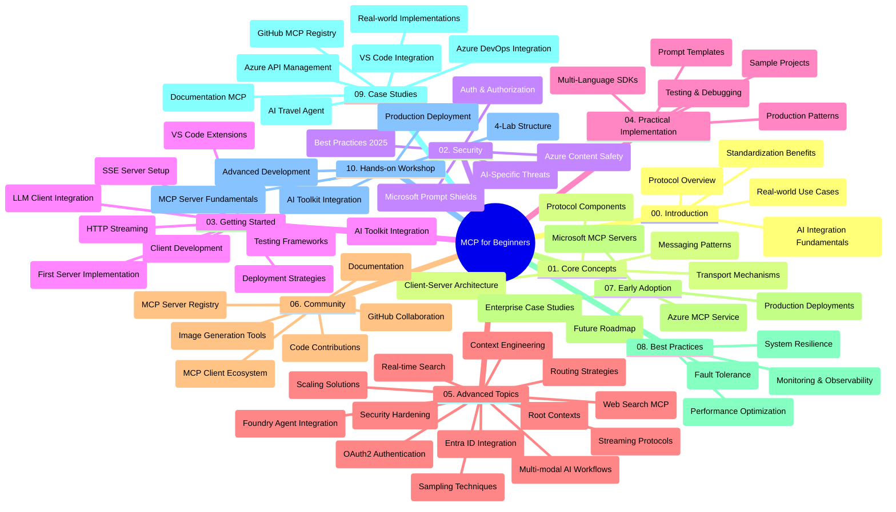

<!--
CO_OP_TRANSLATOR_METADATA:
{
  "original_hash": "719117a0a5f34ade7b5dfb61ee06fb13",
  "translation_date": "2025-09-26T19:18:59+00:00",
  "source_file": "study_guide.md",
  "language_code": "my"
}
-->
# မော်ဒယ်အကြောင်းအရာ ပရိုတိုကော (MCP) အတွက် အခြေခံသင်ခန်းစာ - လေ့လာမှုလမ်းညွှန်

ဒီလမ်းညွှန်စာအုပ်က "မော်ဒယ်အကြောင်းအရာ ပရိုတိုကော (MCP) အတွက် အခြေခံသင်ခန်းစာ" သင်ရိုးညွှန်းတမ်းအတွက် repository ဖွဲ့စည်းမှုနဲ့ အကြောင်းအရာအကျဉ်းကို ပေးထားပါတယ်။ Repository ကို ထိရောက်စွာ အသုံးပြုနိုင်ဖို့ ဒီလမ်းညွှန်ကို အသုံးပြုပါ။

## Repository အကျဉ်းချုပ်

မော်ဒယ်အကြောင်းအရာ ပရိုတိုကော (MCP) က AI မော်ဒယ်နဲ့ client အပလီကေးရှင်းများအကြား အပြန်အလှန်ဆက်သွယ်မှုအတွက် စံသတ်မှတ်ထားတဲ့ framework တစ်ခုဖြစ်ပါတယ်။ အစပိုင်းမှာ Anthropic က ဖန်တီးခဲ့ပြီးနောက်ပိုင်းမှာ MCP အသိုင်းအဝိုင်းက GitHub အဖွဲ့အစည်းမှတဆင့် ထိန်းသိမ်းဆောင်ရွက်နေပါတယ်။ ဒီ repository မှာ C#, Java, JavaScript, Python, TypeScript စတဲ့ programming language များအတွက် လက်တွေ့ကိုင်တွယ်နိုင်တဲ့ code နမူနာများပါဝင်တဲ့ သင်ရိုးညွှန်းတမ်းတစ်ခုကို AI developer, system architect, software engineer များအတွက် ဖန်တီးပေးထားပါတယ်။

## သင်ရိုးညွှန်းတမ်းမြေပုံ

## Repository ဖွဲ့စည်းမှု

ဒီ repository ကို MCP ရဲ့ အမျိုးမျိုးသော အချက်အလက်များကို အဓိကအပိုင်း ၁၀ ခုအဖြစ် ဖွဲ့စည်းထားပါတယ်။

1. **နိဒါန်း (00-Introduction/)**
   - မော်ဒယ်အကြောင်းအရာ ပရိုတိုကော အကြောင်းအရာ
   - AI pipeline များအတွက် စံသတ်မှတ်မှု အရေးကြီးမှု
   - လက်တွေ့အသုံးချမှုနဲ့ အကျိုးကျေးဇူးများ

2. **အဓိကအယူအဆများ (01-CoreConcepts/)**
   - Client-server architecture
   - ပရိုတိုကောရဲ့ အဓိကအစိတ်အပိုင်းများ
   - MCP မှာ messaging pattern များ

3. **လုံခြုံရေး (02-Security/)**
   - MCP-based system များအတွက် လုံခြုံရေး အန္တရာယ်များ
   - လုံခြုံရေးအကောင်အထည်ဖော်မှုအတွက် အကောင်းဆုံးနည်းလမ်းများ
   - Authentication နဲ့ authorization များ
   - **လုံခြုံရေးဆိုင်ရာ စာရွက်စာတမ်းများ**:
     - MCP Security Best Practices 2025
     - Azure Content Safety Implementation Guide
     - MCP Security Controls and Techniques
     - MCP Best Practices Quick Reference
   - **အဓိက လုံခြုံရေးအကြောင်းအရာများ**:
     - Prompt injection နဲ့ tool poisoning အန္တရာယ်များ
     - Session hijacking နဲ့ confused deputy ပြဿနာများ
     - Token passthrough အားနည်းချက်များ
     - Excessive permissions နဲ့ access control
     - AI components အတွက် supply chain security
     - Microsoft Prompt Shields ပေါင်းစပ်မှု

4. **စတင်အသုံးပြုခြင်း (03-GettingStarted/)**
   - ပတ်ဝန်းကျင် setup နဲ့ configuration
   - အခြေခံ MCP server နဲ့ client ဖန်တီးခြင်း
   - ရှိပြီးသား အပလီကေးရှင်းများနဲ့ ပေါင်းစပ်ခြင်း
   - အပိုင်းများပါဝင်သည့်အတိုင်း:
     - ပထမဆုံး server ဖန်တီးခြင်း
     - Client ဖွံ့ဖြိုးတိုးတက်မှု
     - LLM client ပေါင်းစပ်မှု
     - VS Code ပေါင်းစပ်မှု
     - Server-Sent Events (SSE) server
     - HTTP streaming
     - AI Toolkit ပေါင်းစပ်မှု
     - စမ်းသပ်မှုနည်းလမ်းများ
     - Deployment လမ်းညွှန်ချက်များ

5. **လက်တွေ့အကောင်အထည်ဖော်မှု (04-PracticalImplementation/)**
   - အမျိုးမျိုးသော programming language များအတွက် SDK အသုံးပြုခြင်း
   - Debugging, testing, validation နည်းလမ်းများ
   - Reusable prompt template နဲ့ workflow များ ဖန်တီးခြင်း
   - လက်တွေ့နမူနာများပါဝင်သော စမ်းသပ် project များ

6. **အဆင့်မြင့်အကြောင်းအရာများ (05-AdvancedTopics/)**
   - Context engineering နည်းလမ်းများ
   - Foundry agent ပေါင်းစပ်မှု
   - Multi-modal AI workflow များ
   - OAuth2 authentication နမူနာများ
   - အချိန်နှင့်တပြေးညီ search လုပ်ဆောင်မှုများ
   - အချိန်နှင့်တပြေးညီ streaming
   - Root contexts အကောင်အထည်ဖော်မှု
   - Routing နည်းလမ်းများ
   - Sampling နည်းလမ်းများ
   - Scaling နည်းလမ်းများ
   - လုံခြုံရေးအချက်များ
   - Entra ID လုံခြုံရေး ပေါင်းစပ်မှု
   - Web search ပေါင်းစပ်မှု

7. **အသိုင်းအဝိုင်း၏ အထောက်အကူများ (06-CommunityContributions/)**
   - Code နဲ့ documentation တွေကို ဘယ်လိုပေးပို့ရမလဲ
   - GitHub မှတဆင့် ပူးပေါင်းဆောင်ရွက်ခြင်း
   - အသိုင်းအဝိုင်းအခြေပြု တိုးတက်မှုများနဲ့ အကြံပြုချက်များ
   - MCP client များ (Claude Desktop, Cline, VSCode) အသုံးပြုခြင်း
   - ပုံရိပ်ဖန်တီးမှုအတွက် MCP server များနဲ့ အလုပ်လုပ်ခြင်း

8. **အစောပိုင်းအသုံးပြုမှုမှ သင်ခန်းစာများ (07-LessonsfromEarlyAdoption/)**
   - လက်တွေ့အကောင်အထည်ဖော်မှုနဲ့ အောင်မြင်မှုဇာတ်လမ်းများ
   - MCP-based ဖြေရှင်းချက်များ ဖန်တီးခြင်းနဲ့ တင်သွင်းခြင်း
   - လမ်းကြောင်းနဲ့ အနာဂတ်ရဲ့ လမ်းပြမြေပုံ
   - **Microsoft MCP Servers Guide**: Microsoft MCP server ၁၀ ခုအတွက် လမ်းညွှန်ချက်

9. **အကောင်းဆုံးနည်းလမ်းများ (08-BestPractices/)**
   - Performance tuning နဲ့ optimization
   - Fault-tolerant MCP system များ ဒီဇိုင်းဆွဲခြင်း
   - စမ်းသပ်မှုနဲ့ resilience နည်းလမ်းများ

10. **လေ့လာမှုနမူနာများ (09-CaseStudy/)**
    - **နမူနာ ၇ ခု**:
      - Azure AI Travel Agents
      - Azure DevOps Integration
      - Real-Time Documentation Retrieval
      - Interactive Study Plan Generator
      - In-Editor Documentation
      - Azure API Management
      - GitHub MCP Registry

11. **လက်တွေ့အလုပ်ရုံဆွေးနွေးပွဲ (10-StreamliningAIWorkflowsBuildingAnMCPServerWithAIToolkit/)**
    - MCP နဲ့ AI Toolkit ပေါင်းစပ်မှု
    - Intelligent application များ ဖန်တီးခြင်း
    - **Lab ဖွဲ့စည်းမှု**:
      - Lab 1: MCP Server Fundamentals
      - Lab 2: Advanced MCP Server Development
      - Lab 3: AI Toolkit Integration
      - Lab 4: Production Deployment and Scaling

## ထပ်ဆောင်းအရင်းအမြစ်များ

- **Images folder**: သင်ရိုးညွှန်းတမ်းအတွင်းမှာ အသုံးပြုထားတဲ့ ပုံများ
- **Translations**: စာရွက်စာတမ်းများကို အလိုအလျောက် ဘာသာပြန်ပေးမှု
- **MCP အရာများ**:
  - [MCP Documentation](https://modelcontextprotocol.io/)
  - [MCP Specification](https://spec.modelcontextprotocol.io/)
  - [MCP GitHub Repository](https://github.com/modelcontextprotocol)

## ဒီ Repository ကို ဘယ်လိုအသုံးပြုမလဲ

1. **အဆင့်လိုက်လေ့လာမှု**: အခန်း 00 မှ 10 အထိ အစဉ်လိုက် လေ့လာပါ။
2. **Programming Language အထူးပြုမှု**: သင့်အကြိုက် programming language အတွက် နမူနာ directory များကို လေ့လာပါ။
3. **လက်တွေ့အကောင်အထည်ဖော်မှု**: "Getting Started" အပိုင်းကနေ စတင်ပြီး MCP server နဲ့ client ကို ဖန်တီးပါ။
4. **အဆင့်မြင့်အကြောင်းအရာများ**: အခြေခံများနားလည်ပြီးပါက အဆင့်မြင့်အပိုင်းများကို လေ့လာပါ။
5. **အသိုင်းအဝိုင်းပူးပေါင်းမှု**: GitHub discussions နဲ့ Discord channel များမှတဆင့် MCP အသိုင်းအဝိုင်းနဲ့ ဆက်သွယ်ပါ။

## MCP Clients နဲ့ Tools

1. **တရားဝင် Clients**:
   - Visual Studio Code 
   - MCP in Visual Studio Code
   - Claude Desktop
   - Claude in VSCode 
   - Claude API

2. **အသိုင်းအဝိုင်း Clients**:
   - Cline (terminal-based)
   - Cursor (code editor)
   - ChatMCP
   - Windsurf

3. **MCP စီမံခန့်ခွဲမှု Tools**:
   - MCP CLI
   - MCP Manager
   - MCP Linker
   - MCP Router

## လူကြိုက်များသော MCP Servers

1. **Microsoft MCP Servers**:
   - Microsoft Learn Docs MCP Server
   - Azure MCP Server (15+ specialized connectors)
   - GitHub MCP Server
   - Azure DevOps MCP Server
   - MarkItDown MCP Server
   - SQL Server MCP Server
   - Playwright MCP Server
   - Dev Box MCP Server
   - Azure AI Foundry MCP Server
   - Microsoft 365 Agents Toolkit MCP Server

2. **Reference Servers**:
   - Filesystem
   - Fetch
   - Memory
   - Sequential Thinking

3. **ပုံရိပ်ဖန်တီးမှု**:
   - Azure OpenAI DALL-E 3
   - Stable Diffusion WebUI
   - Replicate

4. **ဖွံ့ဖြိုးရေး Tools**:
   - Git MCP
   - Terminal Control
   - Code Assistant

5. **အထူးပြု Servers**:
   - Salesforce
   - Microsoft Teams
   - Jira & Confluence

## ပူးပေါင်းဆောင်ရွက်မှု

ဒီ repository က အသိုင်းအဝိုင်းမှ ပူးပေါင်းမှုများကို ကြိုဆိုပါတယ်။ Community Contributions အပိုင်းကို ကြည့်ပြီး MCP ecosystem အတွက် ထိရောက်စွာ ပူးပေါင်းဆောင်ရွက်နိုင်ပါသည်။

## Changelog

| ရက်စွဲ | ပြောင်းလဲမှုများ |
|------|---------|
| ၂၀၂၅ စက်တင်ဘာ ၂၆ | - GitHub MCP Registry case study ကို 09-CaseStudy အပိုင်းထဲ ထည့်သွင်း - Case Studies ကို comprehensive case studies ၇ ခုအဖြစ် ပြင်ဆင် - နမူနာဖော်ပြချက်များကို အကောင်အထည်ဖော်မှုအသေးစိတ်များဖြင့် တိုးမြှင့် - Visual Curriculum Map ကို GitHub MCP Registry ထည့်သွင်း - Study guide ဖွဲ့စည်းမှုကို ecosystem development အာရုံစိုက်မှုအတိုင်း ပြင်ဆင် |
| ၂၀၂၅ ဇူလိုင် ၁၈ | - Microsoft MCP Servers Guide ကို repository ဖွဲ့စည်းမှုထဲ ထည့်သွင်း - Microsoft MCP server ၁၀ ခုစာရင်းကို ထည့်သွင်း - Popular MCP Servers အပိုင်းကို Microsoft MCP Servers ဖြင့် တိုးမြှင့် - Case Studies အပိုင်းကို နမူနာဖိုင်များဖြင့် ပြင်ဆင် - Hands-on Workshop အတွက် Lab Structure အသေးစိတ် ထည့်သွင်း |
| ၂၀၂၅ ဇူလိုင် ၁၆ | - Repository ဖွဲ့စည်းမှုကို လက်ရှိအကြောင်းအရာအတိုင်း ပြင်ဆင် - MCP Clients နဲ့ Tools အပိုင်း ထည့်သွင်း - Popular MCP Servers အပိုင်း ထည့်သွင်း - Visual Curriculum Map ကို လက်ရှိအကြောင်းအရာများဖြင့် ပြင်ဆင် - Advanced Topics အပိုင်းကို အထူးပြုအကြောင်းအရာများဖြင့် တိုးမြှင့် - Case Studies ကို နမူနာများဖြင့် ပြင်ဆင် - MCP ရဲ့ မူလဖန်တီးသူ Anthropic ဖြစ်ကြောင်း ရှင်းလင်း |
| ၂၀၂၅ ဇွန် ၁၁ | - Study guide ကို စတင်ဖန်တီး - Visual Curriculum Map ထည့်သွင်း - Repository ဖွဲ့စည်းမှုကို အကျဉ်းချုပ် - စမ်းသပ် project များနဲ့ ထပ်ဆောင်းအရင်းအမြစ်များ ထည့်သွင်း |

---

*ဒီလမ်းညွှန်စာအုပ်ကို ၂၀၂၅ စက်တင်ဘာ ၂၆ ရက်နေ့တွင် ပြင်ဆင်ပြီး အဆိုပါရက်စွဲအထိ repository အကြောင်းအရာကို ဖော်ပြထားပါသည်။*

---

