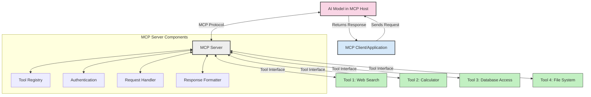
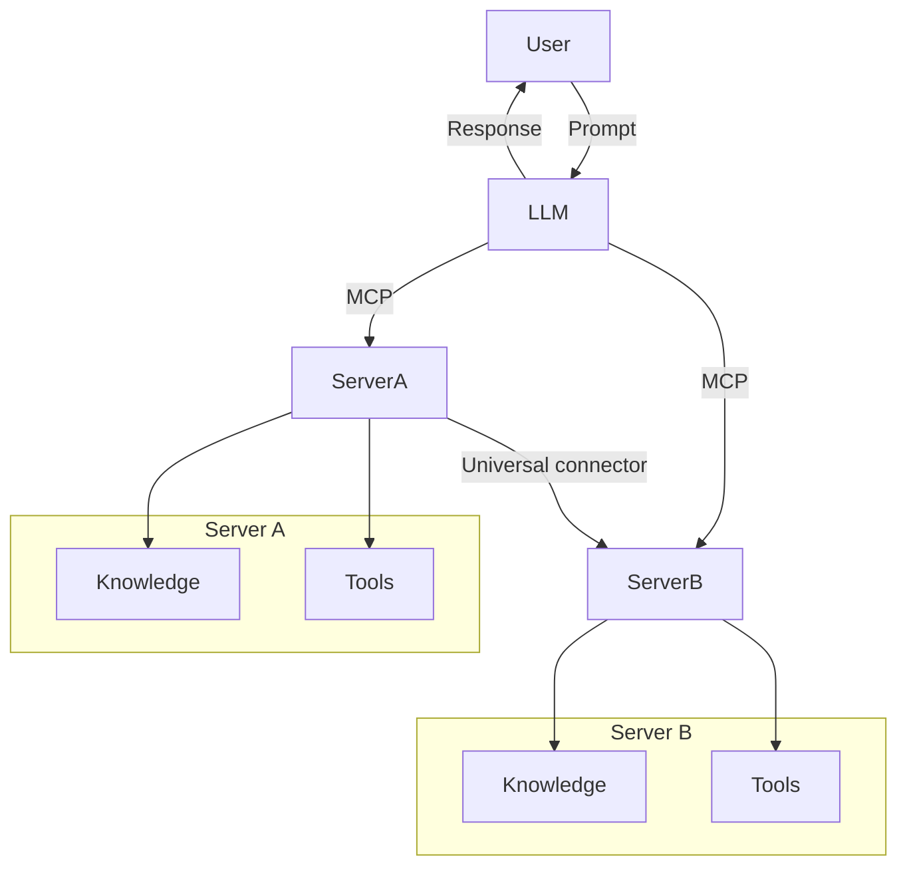

<!--
CO_OP_TRANSLATOR_METADATA:
{
  "original_hash": "02301140adbd807ecf0f17720fa307bc",
  "translation_date": "2025-05-17T05:57:33+00:00",
  "source_file": "00-Introduction/README.md",
  "language_code": "ne"
}
-->
# स्केलेबल एआई अनुप्रयोगहरूको लागि मोडल कन्टेक्स्ट प्रोटोकल (MCP) को परिचय: किन यो महत्त्वपूर्ण छ

जेनेरेटिभ एआई अनुप्रयोगहरू एक ठूलो कदम अगाडि बढेका छन् किनकि तिनीहरूले प्रायः प्रयोगकर्तालाई प्राकृतिक भाषा प्रम्प्टहरू प्रयोग गरेर एपसँग अन्तरक्रिया गर्न अनुमति दिन्छ। तर, जब यस्ता एपहरूमा थप समय र स्रोतहरू लगानी गरिन्छ, तपाईंले सुनिश्चित गर्न चाहनुहुन्छ कि तपाईं सजिलैसँग कार्यक्षमताहरू र स्रोतहरू एकीकृत गर्न सक्नुहुन्छ ताकि विस्तार गर्न सजिलो होस्, तपाईंको एपले एक भन्दा बढी मोडललाई समर्थन गर्न सक्ने होस्, र यसको जटिलताहरूलाई समेट्न सक्ने होस्। संक्षेपमा, जेनेरेटिभ एआई एपहरू बनाउन सुरुमा सजिलो हुन्छ तर जब यो बढ्छ र जटिल बन्छ, तपाईंले वास्तुकला परिभाषित गर्न सुरु गर्न आवश्यक छ र सम्भवतः तपाईंको एपहरू एक सुसंगत तरिकामा निर्माण गरिएका छन् भनेर सुनिश्चित गर्न एक मानकमा निर्भर गर्नु आवश्यक छ। यहीँ MCP कुरा मिलाउन आउँछ, एक मानक प्रदान गर्न।

---

## **🔍 मोडल कन्टेक्स्ट प्रोटोकल (MCP) के हो?**

**मोडल कन्टेक्स्ट प्रोटोकल (MCP)** एक **खुला, मानकीकृत इन्टरफेस** हो जसले ठूलो भाषा मोडलहरू (LLMs) लाई बाह्य उपकरणहरू, APIहरू, र डेटा स्रोतहरूसँग सहज रूपमा अन्तरक्रिया गर्न अनुमति दिन्छ। यसले प्रशिक्षण डेटा भन्दा बाहिर एआई मोडल कार्यक्षमता सुधार गर्न एक सुसंगत वास्तुकला प्रदान गर्दछ, स्मार्ट, स्केलेबल, र थप प्रतिक्रियाशील एआई प्रणालीहरू सक्षम गर्दछ।

---

## **🎯 एआईमा मानकीकरण किन महत्त्वपूर्ण छ**

जेनेरेटिभ एआई अनुप्रयोगहरू जटिल हुँदै जाँदा, स्केलेबिलिटी, विस्तारयोग्यता, र मर्मतयोग्यता सुनिश्चित गर्ने मानकहरू अपनाउनु आवश्यक छ। MCP ले यी आवश्यकताहरूलाई सम्बोधन गर्दछ:

- मोडल-उपकरण एकीकरणलाई एकीकृत गर्दै
- नाजुक, एक-चोटि कस्टम समाधानहरू घटाउँदै
- एक पारिस्थितिकी तन्त्र भित्र बहु मोडलहरू सह-अस्तित्व गर्न अनुमति दिँदै

---

## **📚 सिक्ने उद्देश्यहरू**

यस लेखको अन्त्यमा, तपाईं सक्षम हुनुहुनेछ:

- **मोडल कन्टेक्स्ट प्रोटोकल (MCP)** र यसको प्रयोग केसहरू परिभाषित गर्नुहोस्
- MCP कसरी मोडल-टू-टूल संचारलाई मानकीकृत गर्छ भन्ने बुझ्नुहोस्
- MCP वास्तुकलाका मुख्य घटकहरू पहिचान गर्नुहोस्
- उद्यम र विकास सन्दर्भमा MCP को वास्तविक संसार अनुप्रयोगहरू अन्वेषण गर्नुहोस्

---

## **💡 मोडल कन्टेक्स्ट प्रोटोकल (MCP) किन एक गेम-चेन्जर हो**

### **🔗 MCP ले एआई अन्तरक्रियामा विखण्डन समाधान गर्दछ**

MCP भन्दा पहिले, मोडलहरू उपकरणहरूसँग एकीकृत गर्न आवश्यक थियो:

- प्रत्येक उपकरण-मोडल जोडीका लागि कस्टम कोड
- प्रत्येक विक्रेता लागि गैर-मानक APIहरू
- अपडेटहरूका कारण बारम्बार ब्रेकहरू
- अधिक उपकरणहरूसँग गरीब स्केलेबिलिटी

### **✅ MCP मानकीकरणको लाभहरू**

| **लाभ**                  | **वर्णन**                                                                   |
|--------------------------|----------------------------------------------------------------------------|
| अन्तरसञ्चालन क्षमता      | LLMs विभिन्न विक्रेताहरूका उपकरणहरूसँग सहज रूपमा काम गर्छन्              |
| सुसंगतता                 | प्लेटफर्म र उपकरणहरूमा समान व्यवहार                                        |
| पुन: प्रयोगयोग्यता       | एकपटक निर्माण गरिएका उपकरणहरू परियोजनाहरू र प्रणालीहरूमा प्रयोग गर्न सकिन्छ |
| विकासको तीव्रता          | मानकीकृत, प्लग-एण्ड-प्ले इन्टरफेसहरू प्रयोग गरेर विकास समय घटाउनुहोस्   |

---

## **🧱 उच्च-स्तरीय MCP वास्तुकला अवलोकन**

MCP एक **क्लाइन्ट-सर्भर मोडल** अनुसरण गर्दछ, जहाँ:

- **MCP होस्टहरू** एआई मोडलहरू चलाउँछन्
- **MCP क्लाइन्टहरू** अनुरोधहरू सुरु गर्छन्
- **MCP सर्भरहरू** सन्दर्भ, उपकरणहरू, र क्षमताहरू सेवा गर्छन्

### **मुख्य घटकहरू:**

- **स्रोतहरू** – मोडलहरूको लागि स्थिर वा गतिशील डेटा  
- **प्रम्प्टहरू** – निर्देशित उत्पादनको लागि पूर्वनिर्धारित कार्यप्रवाह  
- **उपकरणहरू** – खोज, गणना जस्ता कार्यहरू  
- **नमूना** – पुनरावर्ती अन्तरक्रियाहरू मार्फत एजेन्टिक व्यवहार

---

## MCP सर्भरहरू कसरी काम गर्छन्

MCP सर्भरहरू निम्न तरिकामा सञ्चालन गर्छन्:

- **अनुरोध प्रवाह**: 
    1. MCP क्लाइन्टले MCP होस्टमा चलिरहेको एआई मोडललाई अनुरोध पठाउँछ।
    2. एआई मोडलले बाह्य उपकरणहरू वा डेटा कहिले आवश्यक छ भनेर पहिचान गर्छ।
    3. मोडलले मानकीकृत प्रोटोकल प्रयोग गरेर MCP सर्भरसँग सञ्चार गर्छ।

- **MCP सर्भर कार्यक्षमता**:
    - उपकरण रजिस्ट्री: उपलब्ध उपकरणहरू र तिनीहरूको क्षमताहरूको सूची राख्छ।
    - प्रमाणीकरण: उपकरण पहुँचको लागि अनुमतिहरू प्रमाणित गर्छ।
    - अनुरोध ह्यान्डलर: मोडलबाट आउने उपकरण अनुरोधहरू प्रक्रिया गर्छ।
    - प्रतिक्रिया स्वरूपकर्ता: मोडलले बुझ्न सक्ने ढाँचामा उपकरण आउटपुट संरचना गर्छ।

- **उपकरण कार्यान्वयन**: 
    - सर्भरले अनुरोधहरू उपयुक्त बाह्य उपकरणहरूसँग रुट गर्छ
    - उपकरणहरूले तिनीहरूको विशेष कार्यहरू (खोज, गणना, डाटाबेस क्वेरीहरू, आदि) कार्यान्वयन गर्छन्
    - परिणामहरू मोडलमा एक सुसंगत ढाँचामा फर्काइन्छ।

- **प्रतिक्रिया पूर्णता**: 
    - एआई मोडलले उपकरण आउटपुटलाई आफ्नो प्रतिक्रियामा समाहित गर्छ।
    - अन्तिम प्रतिक्रिया क्लाइन्ट अनुप्रयोगमा फर्काइन्छ।

## 👨‍💻 कसरी MCP सर्भर निर्माण गर्ने (उदाहरणहरू सहित)

MCP सर्भरहरूले LLM क्षमताहरू विस्तार गर्न डेटा र कार्यक्षमता प्रदान गर्न अनुमति दिन्छ।

तयार हुनुहुन्छ प्रयास गर्न? यहाँ विभिन्न भाषाहरूमा सरल MCP सर्भर निर्माण गर्ने उदाहरणहरू छन्:

- **Python उदाहरण**: https://github.com/modelcontextprotocol/python-sdk

- **TypeScript उदाहरण**: https://github.com/modelcontextprotocol/typescript-sdk

- **Java उदाहरण**: https://github.com/modelcontextprotocol/java-sdk

- **C#/.NET उदाहरण**: https://github.com/modelcontextprotocol/csharp-sdk

## 🌍 MCP का वास्तविक संसार प्रयोग केसहरू

MCP ले एआई क्षमताहरू विस्तार गरेर अनुप्रयोगहरूको व्यापक दायरा सक्षम गर्दछ:

| **अनुप्रयोग**              | **वर्णन**                                                                   |
|------------------------------|----------------------------------------------------------------------------|
| उद्यम डेटा एकीकरण         | LLMs लाई डेटाबेस, CRMs, वा आन्तरिक उपकरणहरूसँग जोड्नुहोस्                 |
| एजेन्टिक एआई प्रणालीहरू    | उपकरण पहुँच र निर्णय-निर्माण कार्यप्रवाहको साथ स्वायत्त एजेन्टहरू सक्षम गर्नुहोस् |
| बहु-मोडल अनुप्रयोगहरू      | एकल एकीकृत एआई एप भित्र पाठ, छवि, र अडियो उपकरणहरू संयोजन गर्नुहोस्     |
| वास्तविक-समय डेटा एकीकरण  | एआई अन्तरक्रियामा लाइभ डेटा ल्याएर थप सटीक, वर्तमान आउटपुट प्रदान गर्नुहोस् |

### 🧠 MCP = एआई अन्तरक्रियाको लागि सार्वभौमिक मानक

मोडल कन्टेक्स्ट प्रोटोकल (MCP) एआई अन्तरक्रियाको लागि सार्वभौमिक मानकको रूपमा कार्य गर्दछ, जस्तै USB-C ले उपकरणहरूको लागि भौतिक जडानलाई मानकीकृत गरेको छ। एआईको संसारमा, MCP ले एक सुसंगत इन्टरफेस प्रदान गर्दछ, मोडलहरू (क्लाइन्टहरू) लाई बाह्य उपकरणहरू र डेटा प्रदायकहरू (सर्भरहरू)सँग सहज रूपमा एकीकृत गर्न अनुमति दिन्छ। यसले प्रत्येक API वा डेटा स्रोतको लागि विविध, कस्टम प्रोटोकलहरूको आवश्यकता हटाउँछ।

MCP अन्तर्गत, एक MCP-संगत उपकरण (MCP सर्भर भनिन्छ) एक एकीकृत मानक अनुसरण गर्छ। यी सर्भरहरूले तिनीहरूले प्रस्ताव गर्ने उपकरणहरू वा कार्यहरू सूचीबद्ध गर्न सक्छन् र एआई एजेन्टले अनुरोध गर्दा ती कार्यहरू कार्यान्वयन गर्न सक्छन्। MCP समर्थन गर्ने एआई एजेन्ट प्लेटफर्महरू सर्भरहरूबाट उपलब्ध उपकरणहरू पत्ता लगाउन र यस मानक प्रोटोकल मार्फत तिनीहरूलाई आह्वान गर्न सक्षम छन्।

### 💡 ज्ञान पहुँचको सुविधा प्रदान गर्छ

उपकरणहरू प्रस्ताव गर्न बाहेक, MCP ले ज्ञान पहुँचको सुविधा पनि प्रदान गर्छ। यसले अनुप्रयोगहरूलाई विभिन्न डेटा स्रोतहरूसँग ठूला भाषा मोडलहरू (LLMs) लाई लिंक गरेर सन्दर्भ प्रदान गर्न सक्षम बनाउँछ। उदाहरणका लागि, एक MCP सर्भरले कम्पनीको दस्तावेज भण्डार प्रतिनिधित्व गर्न सक्छ, एजेन्टहरूलाई आवश्यक जानकारी माग गर्दा प्राप्त गर्न अनुमति दिन्छ। अर्को सर्भरले इमेल पठाउने वा रेकर्डहरू अद्यावधिक गर्ने जस्ता विशिष्ट कार्यहरू सम्हाल्न सक्छ। एजेन्टको दृष्टिकोणबाट, यी केवल उपकरणहरू हुन् जुन यसले प्रयोग गर्न सक्छ—केही उपकरणहरूले डेटा (ज्ञान सन्दर्भ) फर्काउँछन्, जबकि अन्यले कार्यहरू प्रदर्शन गर्छन्। MCP ले दुवैलाई प्रभावकारी रूपमा व्यवस्थापन गर्छ।

एक MCP सर्भरमा जडान गर्ने एजेन्टले स्वचालित रूपमा एक मानक ढाँचाको माध्यमबाट सर्भरको उपलब्ध क्षमताहरू र पहुँचयोग्य डेटा सिक्छ। यस मानकीकरणले गतिशील उपकरण उपलब्धता सक्षम बनाउँछ। उदाहरणका लागि, एजेन्टको प्रणालीमा नयाँ MCP सर्भर थप्दा यसको कार्यहरू तुरुन्तै प्रयोग गर्न योग्य हुन्छन् बिना एजेन्टको निर्देशनको थप अनुकूलनको आवश्यकता।

यो सरल एकीकरणले मेरमेड डायग्राममा चित्रित प्रवाहसँग मेल खान्छ, जहाँ सर्भरहरूले उपकरणहरू र ज्ञान दुवै प्रदान गर्छन्, प्रणालीहरूमा सहज सहयोग सुनिश्चित गर्दै।

### 👉 उदाहरण: स्केलेबल एजेन्ट समाधान

## 🔐 MCP का व्यावहारिक लाभहरू

यहाँ MCP प्रयोग गर्दा केहि व्यावहारिक लाभहरू छन्:

- **ताजगी**: मोडलहरूले तिनीहरूको प्रशिक्षण डेटा भन्दा बाहिरको अप-टु-डेट जानकारी पहुँच गर्न सक्छन्
- **क्षमता विस्तार**: मोडलहरूले तिनीहरूलाई प्रशिक्षित नगरिएका कार्यहरूको लागि विशेष उपकरणहरू प्रयोग गर्न सक्छन्
- **घटाइएको भ्रम**: बाह्य डेटा स्रोतहरूले तथ्यात्मक आधार प्रदान गर्छन्
- **गोपनीयता**: संवेदनशील डेटा प्रम्प्टहरूमा समावेश हुनुको सट्टा सुरक्षित वातावरण भित्र रहन सक्छ

## 📌 मुख्य निष्कर्षहरू

MCP प्रयोग गर्दा निम्न मुख्य निष्कर्षहरू छन्:

- **MCP** ले एआई मोडलहरू कसरी उपकरणहरू र डेटा संग अन्तरक्रिया गर्छन् भन्ने कुरा मानकीकृत गर्छ
- **विस्तारयोग्यता, सुसंगतता, र अन्तरसञ्चालन क्षमता** प्रवर्द्धन गर्छ
- MCP ले **विकास समय घटाउन, विश्वसनीयता सुधार गर्न, र मोडल क्षमताहरू विस्तार गर्न मद्दत गर्छ**
- क्लाइन्ट-सर्भर वास्तुकला **लचिलो, विस्तारयोग्य एआई अनुप्रयोगहरू सक्षम गर्छ**

## 🧠 अभ्यास

तपाईं निर्माण गर्न इच्छुक एआई अनुप्रयोगको बारेमा सोच्नुहोस्।

- कुन **बाह्य उपकरणहरू वा डेटा** यसको क्षमताहरू सुधार गर्न सक्दछन्?
- MCP ले एकीकरणलाई **सरल र थप विश्वसनीय** कसरी बनाउन सक्छ?

## अतिरिक्त स्रोतहरू

- [MCP GitHub Repository](https://github.com/modelcontextprotocol)

## के गर्ने

अर्को: [अध्याय 1: कोर अवधारणाहरू](/01-CoreConcepts/README.md)

**अस्वीकरण**:  
यो दस्तावेज AI अनुवाद सेवा [Co-op Translator](https://github.com/Azure/co-op-translator) प्रयोग गरी अनुवाद गरिएको हो। हामी शुद्धताका लागि प्रयासरत छौं, तर कृपया सचेत रहनुहोस् कि स्वचालित अनुवादमा त्रुटिहरू वा अशुद्धताहरू हुन सक्छन्। यसको मूल भाषामा रहेको मूल दस्तावेजलाई आधिकारिक स्रोत मानिनुपर्छ। महत्त्वपूर्ण जानकारीका लागि, व्यावसायिक मानव अनुवाद सिफारिस गरिन्छ। यस अनुवादको प्रयोगबाट उत्पन्न कुनै पनि गलतफहमी वा गलत व्याख्याका लागि हामी उत्तरदायी हुने छैनौं।