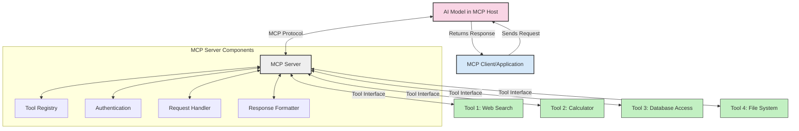
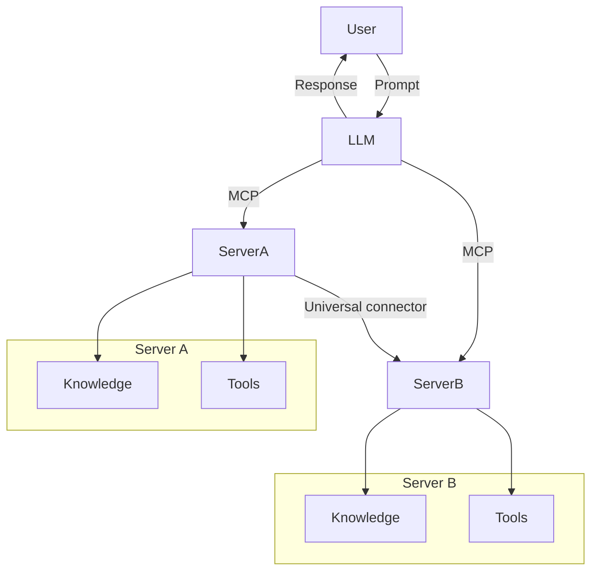

<!--
CO_OP_TRANSLATOR_METADATA:
{
  "original_hash": "1d88dee994dcbb3fa52c271d0c0817b5",
  "translation_date": "2025-05-20T21:04:26+00:00",
  "source_file": "00-Introduction/README.md",
  "language_code": "ne"
}
-->
# Model Context Protocol (MCP) परिचय: स्केलेबल AI अनुप्रयोगहरूका लागि यसको महत्त्व

जनरेटिभ AI अनुप्रयोगहरू ठूलो प्रगति हुन् किनभने यीले प्रायः प्रयोगकर्तालाई प्राकृतिक भाषाका प्रॉम्प्टहरूसँग अन्तरक्रिया गर्न अनुमति दिन्छन्। यद्यपि, जब यस्ता अनुप्रयोगहरूमा बढी समय र स्रोतहरू लगानी गरिन्छ, तपाईंले सजिलैसँग कार्यक्षमताहरू र स्रोतहरू एकीकृत गर्न सक्ने व्यवस्था गर्न चाहनुहुन्छ जसले विस्तार गर्न सजिलो होस्, तपाईंको अनुप्रयोगले एकभन्दा बढी मोडेलहरूलाई सेवा दिन सकोस्, र विभिन्न मोडेल जटिलताहरू सम्हाल्न सकोस्। संक्षेपमा, जनरेटिभ AI अनुप्रयोगहरू सुरुमा सजिलो हुन्छन्, तर जति बढ्छन् र जटिल बन्छन्, त्यति नै तपाईंले वास्तुकला परिभाषित गर्न थाल्नुपर्ने हुन्छ र सम्भवतः एक मानकमा भर पर्नुपर्ने हुन्छ ताकि तपाईंका अनुप्रयोगहरू सुसंगत तरिकाले निर्माण गरियोस्। यही ठाउँमा MCP ले कुरा व्यवस्थित गर्दै मानक प्रदान गर्छ।

---

## **🔍 Model Context Protocol (MCP) के हो?**

**Model Context Protocol (MCP)** एक **खुला, मानकीकृत इन्टरफेस** हो जसले ठूलो भाषा मोडेलहरू (LLMs) लाई बाह्य उपकरणहरू, APIहरू, र डेटा स्रोतहरूसँग सहज रूपमा अन्तरक्रिया गर्न अनुमति दिन्छ। यसले AI मोडेलको कार्यक्षमता प्रशिक्षण डेटाभन्दा पर विस्तार गर्न एक सुसंगत वास्तुकला प्रदान गर्छ, जसले स्मार्ट, स्केलेबल, र थप प्रतिक्रियाशील AI प्रणालीहरू सक्षम पार्छ।

---

## **🎯 AI मा मानकीकरण किन आवश्यक छ**

जसरी जनरेटिभ AI अनुप्रयोगहरू जटिल बन्दैछन्, त्यति नै **स्केलेबिलिटी, विस्तारयोग्यता**, र **रखरखावयोग्यता** सुनिश्चित गर्न मानकहरू अपनाउनु आवश्यक हुन्छ। MCP यी आवश्यकताहरू पूरा गर्छ:

- मोडेल-उपकरण एकीकरणलाई एकीकृत गर्दै
- कमजोर, एक पटकका अनुकूल समाधानहरू कम गर्दै
- एकै इकोसिस्टममा धेरै मोडेलहरूलाई coexist गर्न अनुमति दिँदै

---

## **📚 सिकाइका उद्देश्यहरू**

यस लेखको अन्त्यसम्म, तपाईं सक्षम हुनुहुनेछ:

- **Model Context Protocol (MCP)** के हो र यसको प्रयोग केसहरू परिभाषित गर्न
- MCP ले मोडेल-देखि-उपकरण सञ्चार कसरी मानकीकृत गर्छ बुझ्न
- MCP वास्तुकलाका मुख्य कम्पोनेन्टहरू चिन्हित गर्न
- उद्यम र विकास सन्दर्भमा MCP का वास्तविक प्रयोगहरू अन्वेषण गर्न

---

## **💡 Model Context Protocol (MCP) किन क्रान्तिकारी छ**

### **🔗 MCP ले AI अन्तरक्रियामा टुक्रावारी समाधान गर्छ**

MCP अघि, मोडेल र उपकरणहरू एकीकृत गर्न आवश्यक पर्थ्यो:

- प्रत्येक उपकरण-मोडेल जोडीका लागि अनुकूलित कोड
- प्रत्येक विक्रेता लागि गैर-मानक APIहरू
- अपडेटका कारण बारम्बार टूटफूट
- धेरै उपकरणहरू हुँदा खराब स्केलेबिलिटी

### **✅ MCP मानकीकरणका फाइदाहरू**

| **फाइदा**               | **विवरण**                                                               |
|-------------------------|-------------------------------------------------------------------------|
| अन्तरक्रियाशीलता       | LLM हरू विभिन्न विक्रेता उपकरणहरूसँग सहज काम गर्छन्                    |
| स्थिरता                 | प्लेटफर्म र उपकरणहरूमा एकरूप व्यवहार                                   |
| पुन:प्रयोगयोग्यता       | एक पटक बनाइएका उपकरणहरू परियोजना र प्रणालीहरूमा पुन: प्रयोग गर्न सकिन्छ |
| विकास तीव्रता           | मानकीकृत, प्लग-एण्ड-प्ले इन्टरफेस प्रयोग गरेर विकास समय घटाउँछ         |

---

## **🧱 MCP वास्तुकला उच्च-स्तरीय अवलोकन**

MCP एक **क्लाइन्ट-सर्भर मोडेल** अपनाउँछ, जहाँ:

- **MCP Hosts** AI मोडेलहरू चलाउँछन्
- **MCP Clients** अनुरोध सुरु गर्छन्
- **MCP Servers** सन्दर्भ, उपकरणहरू, र क्षमताहरू प्रदान गर्छन्

### **मुख्य कम्पोनेन्टहरू:**

- **Resources** – मोडेलहरूका लागि स्थिर वा गतिशील डेटा  
- **Prompts** – मार्गदर्शन गरिएको उत्पादनका लागि पूर्वनिर्धारित कार्यप्रवाहहरू  
- **Tools** – खोज, गणना जस्ता कार्यान्वयन योग्य फंक्शनहरू  
- **Sampling** – पुनरावृत्त अन्तरक्रियाबाट एजेन्ट व्यवहार

---

## MCP सर्भरहरू कसरी काम गर्छन्

MCP सर्भरहरूले यसरी काम गर्छन्:

- **अनुरोध प्रवाह**:  
    1. MCP Client ले MCP Host मा चलिरहेको AI मोडेललाई अनुरोध पठाउँछ।  
    2. AI मोडेलले बाह्य उपकरण वा डेटा आवश्यक परेको थाहा पाउँछ।  
    3. मोडेलले मानकीकृत प्रोटोकल प्रयोग गरी MCP Server सँग संवाद गर्छ।  

- **MCP Server कार्यक्षमता**:  
    - उपकरण रजिष्ट्रि: उपलब्ध उपकरणहरू र तिनका क्षमताहरूको सूची राख्छ।  
    - प्रमाणीकरण: उपकरण पहुँचको अनुमति प्रमाणित गर्छ।  
    - अनुरोध ह्यान्डलर: मोडेलबाट आएका उपकरण अनुरोधहरू प्रक्रिया गर्छ।  
    - प्रतिक्रिया फर्म्याटर: उपकरण आउटपुटहरू मोडेलले बुझ्ने ढाँचामा संरचना गर्छ।  

- **उपकरण कार्यान्वयन**:  
    - सर्भरले अनुरोधहरू उपयुक्त बाह्य उपकरणहरूमा रुट गर्छ।  
    - उपकरणहरूले आफ्ना विशेष कार्यहरू (खोज, गणना, डाटाबेस क्वेरीहरू आदि) सञ्चालन गर्छन्।  
    - नतिजाहरू मोडेललाई सुसंगत ढाँचामा फर्काइन्छ।  

- **प्रतिक्रिया समाप्ति**:  
    - AI मोडेलले उपकरण आउटपुटलाई आफ्नो प्रतिक्रियामा समावेश गर्छ।  
    - अन्तिम प्रतिक्रिया क्लाइन्ट अनुप्रयोगलाई पठाइन्छ।  

## 👨‍💻 MCP सर्भर कसरी बनाउने (उदाहरणसहित)

MCP सर्भरहरूले LLM क्षमताहरू विस्तार गर्न डेटा र कार्यक्षमता प्रदान गर्छन्।

परीक्षण गर्न तयार? यहाँ विभिन्न भाषाहरूमा सरल MCP सर्भर बनाउनका उदाहरणहरू छन्:

- **Python Example**: https://github.com/modelcontextprotocol/python-sdk

- **TypeScript Example**: https://github.com/modelcontextprotocol/typescript-sdk

- **Java Example**: https://github.com/modelcontextprotocol/java-sdk

- **C#/.NET Example**: https://github.com/modelcontextprotocol/csharp-sdk

## 🌍 MCP का वास्तविक प्रयोग केसहरू

MCP ले AI क्षमताहरू विस्तार गरेर विभिन्न अनुप्रयोगहरू सक्षम बनाउँछ:

| **अनुप्रयोग**              | **विवरण**                                                             |
|----------------------------|----------------------------------------------------------------------|
| उद्यम डेटा एकीकरण          | LLM हरूलाई डाटाबेस, CRM, वा आन्तरिक उपकरणहरूसँग जडान गर्ने            |
| एजेन्टिक AI प्रणालीहरू     | उपकरण पहुँच र निर्णय प्रक्रियासहित स्वायत्त एजेन्टहरू सक्षम पार्ने     |
| बहु-मोडल अनुप्रयोगहरू      | एउटै एकीकृत AI अनुप्रयोगमा पाठ, छवि, र अडियो उपकरणहरू संयोजन गर्ने |
| वास्तविक-समय डेटा एकीकरण  | AI अन्तरक्रियामा प्रत्यक्ष डेटा ल्याएर बढी सही र वर्तमान नतिजा दिने |

### 🧠 MCP = AI अन्तरक्रियाको सार्वभौमिक मानक

Model Context Protocol (MCP) AI अन्तरक्रियाको लागि USB-C जस्तो सार्वभौमिक मानकको रूपमा कार्य गर्छ। AI को दुनियाँमा, MCP ले एक सुसंगत इन्टरफेस प्रदान गर्छ, जसले मोडेलहरू (क्लाइन्टहरू) लाई बाह्य उपकरण र डेटा प्रदायकहरू (सर्भरहरू) सँग सहज रूपमा एकीकृत हुन अनुमति दिन्छ। यसले प्रत्येक API वा डेटा स्रोतका लागि विभिन्न, अनुकूल प्रोटोकलहरूको आवश्यकता हटाउँछ।

MCP अन्तर्गत, MCP-संगत उपकरण (MCP सर्भर भनिन्छ) एक एकीकृत मानक अनुसरण गर्छ। यी सर्भरहरूले आफूसँग भएका उपकरणहरू वा कार्यहरूको सूची दिन सक्छन् र AI एजेन्टले अनुरोध गर्दा ती कार्यहरू सञ्चालन गर्छन्। MCP समर्थित AI एजेन्ट प्लेटफर्महरूले सर्भरबाट उपलब्ध उपकरणहरू पत्ता लगाउन र यो मानक प्रोटोकलमार्फत तिनीहरूलाई बोलाउन सक्षम हुन्छन्।

### 💡 ज्ञान पहुँच सहज बनाउँछ

उपकरणहरू मात्र होइन, MCP ले ज्ञान पहुँच पनि सहज बनाउँछ। यसले अनुप्रयोगहरूलाई ठूलो भाषा मोडेलहरूलाई (LLMs) विभिन्न डेटा स्रोतहरूसँग जोडेर सन्दर्भ प्रदान गर्न सक्षम बनाउँछ। उदाहरणका लागि, एक MCP सर्भर कम्पनीको कागजात भण्डार प्रतिनिधित्व गर्न सक्छ, जसले एजेन्टहरूलाई आवश्यक जानकारी तत्काल प्राप्त गर्न अनुमति दिन्छ। अर्को सर्भरले इमेल पठाउने वा अभिलेख अपडेट गर्ने जस्ता विशिष्ट कार्यहरू सम्हाल्न सक्छ। एजेन्टको दृष्टिले, यी सबै उपकरणहरू हुन्—केही उपकरणहरूले डेटा (ज्ञान सन्दर्भ) फर्काउँछन् भने केहीले कार्यहरू सञ्चालन गर्छन्। MCP ले दुवैलाई प्रभावकारी रूपमा व्यवस्थापन गर्छ।

एजेन्टले MCP सर्भरसँग जडान गर्दा सर्भरका उपलब्ध क्षमता र पहुँचयोग्य डेटा मानक ढाँचामा स्वचालित रूपमा सिक्छ। यस मानकीकरणले गतिशील उपकरण उपलब्धता सक्षम बनाउँछ। उदाहरणका लागि, एजेन्टको प्रणालीमा नयाँ MCP सर्भर थप्दा त्यसका कार्यहरू तुरुन्त प्रयोग गर्न मिल्छन्, एजेन्टका निर्देशनहरूमा थप अनुकूलन आवश्यक पर्दैन।

यो सहज एकीकरण mermaid डायग्राममा देखाइएको प्रवाहसँग मेल खान्छ, जहाँ सर्भरहरूले उपकरण र ज्ञान दुवै प्रदान गर्छन्, प्रणालीहरूबीच सहज सहकार्य सुनिश्चित गर्दै।

### 👉 उदाहरण: स्केलेबल एजेन्ट समाधान

## 🔐 MCP का व्यावहारिक फाइदाहरू

MCP प्रयोग गर्दा प्राप्त हुने व्यावहारिक फाइदाहरू:

- **ताजगी**: मोडेलहरूले आफ्नो प्रशिक्षण डेटाभन्दा बाहिरको अपडेटेड जानकारी पहुँच गर्न सक्छन्  
- **क्षमता विस्तार**: मोडेलहरूले तिनीहरूका लागि प्रशिक्षण नगरिएका कार्यहरूका लागि विशेष उपकरणहरू प्रयोग गर्न सक्छन्  
- **गलतफहमी घटाउँछ**: बाह्य डेटा स्रोतहरूले तथ्यगत आधार प्रदान गर्छन्  
- **गोपनीयता**: संवेदनशील डेटा सुरक्षित वातावरणमा रहन सक्छ, प्रॉम्प्टमा समावेश नगरिकन  

## 📌 मुख्य बुँदाहरू

MCP प्रयोग गर्दा ध्यान दिनुपर्ने मुख्य बुँदाहरू:

- **MCP** ले AI मोडेल र उपकरण तथा डेटा बीचको अन्तरक्रिया मानकीकृत गर्छ  
- विस्तारयोग्यता, स्थिरता, र अन्तरक्रियाशीलता प्रोत्साहन गर्छ  
- MCP ले विकास समय घटाउने, विश्वसनीयता सुधार गर्ने, र मोडेल क्षमताहरू विस्तार गर्ने मद्दत गर्छ  
- क्लाइन्ट-सर्भर वास्तुकलाले लचिलो, विस्तारयोग्य AI अनुप्रयोगहरू सक्षम पार्छ  

## 🧠 अभ्यास

तपाईंले बनाउन चाहनुभएको AI अनुप्रयोगबारे सोच्नुहोस्।

- कुन **बाह्य उपकरण वा डेटा** ले यसको क्षमता बढाउन सक्छ?  
- MCP ले एकीकरणलाई कसरी **सरल र भरपर्दो** बनाउनेछ?  

## थप स्रोतहरू

- [MCP GitHub Repository](https://github.com/modelcontextprotocol)

## के अगाडि

अर्को: [अध्याय १: मुख्य अवधारणाहरू](/01-CoreConcepts/README.md)

**अस्वीकरण**:  
यो दस्तावेज AI अनुवाद सेवा [Co-op Translator](https://github.com/Azure/co-op-translator) प्रयोग गरी अनुवाद गरिएको हो। हामी शुद्धताको लागि प्रयास गर्छौं, तर कृपया ध्यान दिनुहोस् कि स्वचालित अनुवादमा त्रुटि वा असङ्गतिहरू हुन सक्छन्। मूल दस्तावेज यसको मूल भाषामा नै आधिकारिक स्रोत मानिनुपर्छ। महत्वपूर्ण जानकारीका लागि पेशेवर मानव अनुवाद सिफारिस गरिन्छ। यस अनुवादको प्रयोगबाट उत्पन्न हुने कुनै पनि गलतफहमी वा गलत व्याख्याको लागि हामी जिम्मेवार छैनौं।