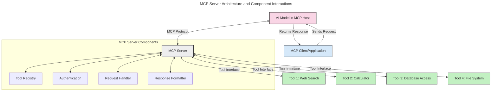
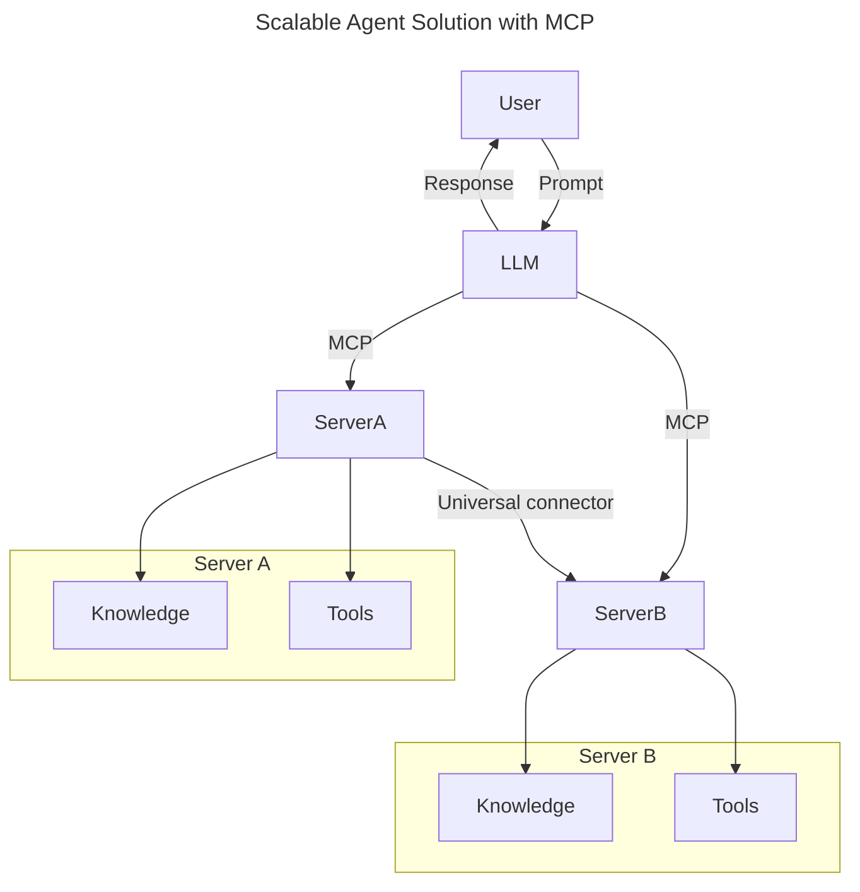
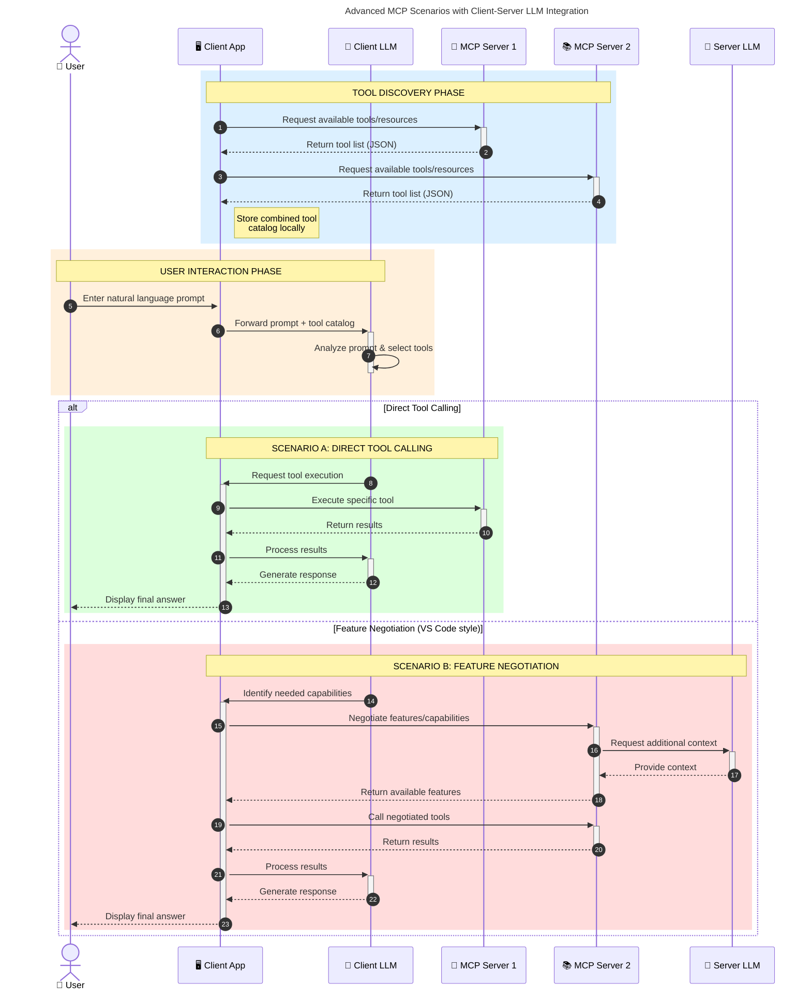

<!--
CO_OP_TRANSLATOR_METADATA:
{
  "original_hash": "1446979020432f512c883848d7eca144",
  "translation_date": "2025-05-29T21:45:34+00:00",
  "source_file": "00-Introduction/README.md",
  "language_code": "ne"
}
-->
# परिचय मोडेल सन्दर्भ प्रोटोकल (MCP): किन यो स्केलेबल AI अनुप्रयोगहरूका लागि महत्वपूर्ण छ

जनरेटिभ AI अनुप्रयोगहरू ठूलो प्रगति हुन् किनकि यीले प्रायः प्रयोगकर्तालाई प्राकृतिक भाषा प्रॉम्प्टहरूको माध्यमबाट एपसँग अन्तरक्रिया गर्न अनुमति दिन्छन्। तर, जब यस्ता एपहरूमा बढी समय र स्रोतहरू लगानी गरिन्छ, तपाईंले सुनिश्चित गर्न चाहनुहुन्छ कि तपाईं सजिलैसँग कार्यक्षमताहरू र स्रोतहरू एकीकृत गर्न सक्नुहुन्छ जसले विस्तार गर्न सजिलो होस्, तपाईंको एपले एकभन्दा बढी मोडेलहरूलाई समर्थन गर्न सकोस्, र विभिन्न मोडेल जटिलताहरूलाई व्यवस्थापन गर्न सकोस्। संक्षेपमा, जनरेटिभ AI एपहरू सुरुमा बनाउन सजिलो हुन्छ, तर जति बढ्छन् र जटिल हुन्छन्, तपाईंले आर्किटेक्चर परिभाषित गर्न थाल्नुपर्छ र सम्भवतः एक मानकमा निर्भर हुनुपर्ने हुन्छ जसले तपाईंका एपहरूलाई सुसंगत तरिकाले निर्माण गर्न सुनिश्चित गर्छ। यहीँ MCP ले कुरा व्यवस्थापन गर्न र मानक प्रदान गर्न मद्दत गर्छ।

---

## **🔍 मोडेल सन्दर्भ प्रोटोकल (MCP) के हो?**

**मोडेल सन्दर्भ प्रोटोकल (MCP)** एक **खुला, मानकीकृत इन्टरफेस** हो जसले ठूलो भाषा मोडेलहरू (LLMs) लाई बाह्य उपकरणहरू, API हरू, र डाटा स्रोतहरूसँग सहजै अन्तरक्रिया गर्न अनुमति दिन्छ। यसले AI मोडेलको कार्यक्षमता प्रशिक्षण डाटाभन्दा बाहिर विस्तार गर्न एक समान आर्किटेक्चर प्रदान गर्दछ, जसले स्मार्ट, स्केलेबल, र बढी प्रतिक्रियाशील AI प्रणालीहरू सक्षम बनाउँछ।

---

## **🎯 AI मा मानकीकरण किन आवश्यक छ**

जब जनरेटिभ AI अनुप्रयोगहरू जटिल बन्दैछन्, तब यस्तो मानक अपनाउनु आवश्यक हुन्छ जसले **स्केलेबिलिटी, विस्तारयोग्यता**, र **रखरखावयोग्यता** सुनिश्चित गर्छ। MCP यी आवश्यकताहरूलाई पूरा गर्छ:

- मोडेल-टुल एकीकरणलाई एकीकृत गर्दै
- कमजोर, एकपटकका अनुकूल समाधानहरू घटाउँदै
- एउटै इकोसिस्टममा धेरै मोडेलहरूलाई सँगै चल्न अनुमति दिँदै

---

## **📚 सिक्ने उद्देश्यहरू**

यस लेखको अन्त्यसम्म, तपाईं सक्षम हुनुहुनेछ:

- **मोडेल सन्दर्भ प्रोटोकल (MCP)** र यसको प्रयोग केसहरू परिभाषित गर्न
- MCP कसरी मोडेल-देखि-टुल सञ्चारलाई मानकीकृत गर्छ बुझ्न
- MCP आर्किटेक्चरका मुख्य कम्पोनेन्टहरू पहिचान गर्न
- उद्यम र विकास सन्दर्भमा MCP को वास्तविक विश्व अनुप्रयोगहरू अन्वेषण गर्न

---

## **💡 मोडेल सन्दर्भ प्रोटोकल (MCP) किन क्रान्तिकारी छ**

### **🔗 MCP ले AI अन्तरक्रियामा टुक्राव टार्छ**

MCP भन्दा पहिले, मोडेलहरूलाई उपकरणहरूसँग एकीकृत गर्न आवश्यक हुन्थ्यो:

- हरेक उपकरण-मोडेल जोडीका लागि कस्टम कोड
- हरेक विक्रेता लागि गैर-मानकीकृत API हरू
- अपडेटका कारण बारम्बार अवरोधहरू
- बढी उपकरणहरू हुँदा कमजोर स्केलेबिलिटी

### **✅ MCP मानकीकरणका फाइदाहरू**

| **फाइदा**               | **विवरण**                                                                    |
|-------------------------|-------------------------------------------------------------------------------|
| अन्तरसञ्चालनीयता       | LLM हरू विभिन्न विक्रेता उपकरणहरूसँग सहजै काम गर्छन्                        |
| स्थिरता                 | प्लेटफर्म र उपकरणहरूमा समान व्यवहार                                         |
| पुन:प्रयोगयोग्यता       | एक पटक बनाइएका उपकरणहरू परियोजनाहरू र प्रणालीहरूमा पुन: प्रयोग गर्न सकिन्छ    |
| विकास गति तीव्रता       | मानकीकृत, प्लग-एण्ड-प्ले इन्टरफेस प्रयोग गरेर विकास समय घटाउँछ             |

---

## **🧱 उच्च-स्तरीय MCP आर्किटेक्चर अवलोकन**

MCP ले **क्लाइंट-सर्भर मोडेल** पछ्याउँछ, जहाँ:

- **MCP Hosts** AI मोडेलहरू चलाउँछन्
- **MCP Clients** अनुरोधहरू सुरु गर्छन्
- **MCP Servers** सन्दर्भ, उपकरणहरू, र क्षमताहरू प्रदान गर्छन्

### **मुख्य कम्पोनेन्टहरू:**

- **Resources** – मोडेलहरूका लागि स्थिर वा गतिशील डाटा  
- **Prompts** – मार्गनिर्देशित जेनेरेशनका लागि पूर्वनिर्धारित कार्यप्रवाहहरू  
- **Tools** – खोज, गणना जस्ता कार्यान्वयनयोग्य कार्यहरू  
- **Sampling** – पुनरावृत्त अन्तरक्रियाबाट एजेन्ट व्यवहार

---

## MCP सर्भरहरू कसरी काम गर्छन्

MCP सर्भरहरूले निम्न तरिकाले काम गर्छन्:

- **अनुरोध प्रवाह**:  
    1. MCP Client ले MCP Host मा चलिरहेको AI मोडेललाई अनुरोध पठाउँछ।  
    2. AI मोडेलले बाह्य उपकरण वा डाटा आवश्यक परेको थाहा पाउँछ।  
    3. मोडेलले मानकीकृत प्रोटोकल प्रयोग गरी MCP सर्भरसँग संवाद गर्छ।  

- **MCP सर्भर कार्यक्षमता**:  
    - उपकरण दर्ता: उपलब्ध उपकरणहरू र तिनीहरूको क्षमताहरूको सूची राख्छ।  
    - प्रमाणीकरण: उपकरण पहुँचका लागि अनुमति जाँच गर्छ।  
    - अनुरोध ह्यान्डलर: मोडेलबाट आउने उपकरण अनुरोधहरू प्रशोधन गर्छ।  
    - प्रतिक्रिया फर्म्याटर: उपकरण आउटपुटलाई मोडेलले बुझ्ने ढाँचामा तयार पार्छ।  

- **उपकरण कार्यान्वयन**:  
    - सर्भरले अनुरोधहरू उपयुक्त बाह्य उपकरणहरूमा मार्गनिर्देशन गर्छ  
    - उपकरणहरूले खोज, गणना, डाटाबेस क्वेरी आदि जस्ता विशेष कार्यहरू गर्छन्  
    - परिणामहरू मोडेललाई सुसंगत ढाँचामा फर्काइन्छ  

- **प्रतिक्रिया पूरा हुनु**:  
    - AI मोडेलले उपकरण आउटपुटलाई आफ्नो प्रतिक्रिया भित्र समावेश गर्छ  
    - अन्तिम प्रतिक्रिया क्लाइंट एप्लिकेशनमा पठाइन्छ  

## 👨‍💻 MCP सर्भर कसरी बनाउने (उदाहरणसहित)

MCP सर्भरहरूले LLM क्षमताहरू विस्तार गर्न डाटा र कार्यक्षमता प्रदान गर्छन्।

तयार हुनुहुन्छ? यहाँ विभिन्न भाषाहरूमा साधारण MCP सर्भर बनाउने उदाहरणहरू छन्:

- **Python Example**: https://github.com/modelcontextprotocol/python-sdk

- **TypeScript Example**: https://github.com/modelcontextprotocol/typescript-sdk

- **Java Example**: https://github.com/modelcontextprotocol/java-sdk

- **C#/.NET Example**: https://github.com/modelcontextprotocol/csharp-sdk

## 🌍 MCP का वास्तविक विश्व प्रयोग केसहरू

MCP ले AI क्षमताहरू विस्तार गरेर विभिन्न अनुप्रयोगहरू सक्षम बनाउँछ:

| **अनुप्रयोग**               | **विवरण**                                                                   |
|-----------------------------|-----------------------------------------------------------------------------|
| उद्यम डाटा एकीकरण           | LLM हरूलाई डेटाबेस, CRM, वा आन्तरिक उपकरणहरूसँग जोड्ने                      |
| एजेन्टिक AI प्रणालीहरू       | उपकरण पहुँच र निर्णय प्रक्रियाका साथ स्वायत्त एजेन्टहरू सक्षम बनाउने       |
| बहु-मोडल अनुप्रयोगहरू       | एकै AI एपमा पाठ, छवि, र अडियो उपकरणहरू संयोजन गर्ने                        |
| वास्तविक-समय डाटा एकीकरण    | AI अन्तरक्रियामा वर्तमान र सटीक आउटपुटका लागि प्रत्यक्ष डाटा ल्याउने          |

### 🧠 MCP = AI अन्तरक्रियाका लागि सार्वभौमिक मानक

मोडेल सन्दर्भ प्रोटोकल (MCP) AI अन्तरक्रियाका लागि एक सार्वभौमिक मानकको रूपमा काम गर्छ, ठीक USB-C ले उपकरणहरूको भौतिक जडानलाई मानकीकृत गरेझैं। AI संसारमा, MCP ले एक समान इन्टरफेस प्रदान गर्छ जसले मोडेलहरू (क्लाइंटहरू) लाई बाह्य उपकरण र डाटा प्रदायकहरू (सर्भरहरू) सँग सहजै एकीकृत हुन अनुमति दिन्छ। यसले प्रत्येक API वा डाटा स्रोतका लागि फरक-फरक, कस्टम प्रोटोकलहरू आवश्यकतालाई समाप्त गर्छ।

MCP अन्तर्गत, MCP-संगत उपकरण (जसलाई MCP सर्भर भनिन्छ) एक एकीकृत मानक अनुसरण गर्छ। यी सर्भरहरूले आफूले प्रदान गर्ने उपकरण वा क्रियाहरूको सूची दिन सक्छन् र AI एजेन्टको अनुरोधमा ती क्रियाहरू कार्यान्वयन गर्छन्। MCP समर्थित AI एजेन्ट प्लेटफर्महरूले सर्भरहरूबाट उपलब्ध उपकरणहरू पत्ता लगाउन र तिनीहरूलाई यो मानक प्रोटोकलमार्फत बोलाउन सक्षम हुन्छन्।

### 💡 ज्ञान पहुँच सजिलो बनाउँछ

उपकरणहरू प्रदान गर्नु बाहेक, MCP ज्ञान पहुँचमा पनि मद्दत गर्छ। यसले अनुप्रयोगहरूलाई ठूलो भाषा मोडेलहरूलाई विभिन्न डाटा स्रोतहरूसँग जोडेर सन्दर्भ प्रदान गर्न सक्षम बनाउँछ। उदाहरणका लागि, एउटा MCP सर्भर कम्पनीको कागजात भण्डार प्रतिनिधित्व गर्न सक्छ, जसले एजेन्टहरूलाई आवश्यक जानकारी मागमा ल्याउन अनुमति दिन्छ। अर्को सर्भरले इमेल पठाउने वा रेकर्ड अपडेट गर्ने जस्ता विशिष्ट कार्यहरू सम्हाल्न सक्छ। एजेन्टको दृष्टिले यी सबै उपकरणहरू मात्र हुन्—केही उपकरणले डाटा (ज्ञान सन्दर्भ) फर्काउँछन् भने केहीले कार्यहरू सम्पन्न गर्छन्। MCP दुवैलाई कुशलतापूर्वक व्यवस्थापन गर्छ।

एजेन्टले MCP सर्भरसँग जडान हुँदा सर्भरका उपलब्ध क्षमताहरू र पहुँचयोग्य डाटाहरू मानक ढाँचामा स्वतः सिक्छ। यो मानकीकरणले उपकरणहरूको गतिशील उपलब्धता सम्भव बनाउँछ। उदाहरणका लागि, एजेन्टको प्रणालीमा नयाँ MCP सर्भर थप्दा, त्यसका कार्यहरू तुरुन्तै प्रयोग गर्न मिल्छन्, एजेन्टका निर्देशनहरूमा थप अनुकूलन आवश्यक नपरी।

यो सहज एकीकरण मर्मेड डायग्राममा देखाइएको प्रवाहसँग मेल खान्छ, जहाँ सर्भरहरूले उपकरण र ज्ञान दुवै प्रदान गर्छन्, प्रणालीहरू बीच निर्बाध सहकार्य सुनिश्चित गर्दै।

### 👉 उदाहरण: स्केलेबल एजेन्ट समाधान

### 🔄 क्लाइंट-साइड LLM एकीकरणसहित उन्नत MCP परिदृश्यहरू

मूल MCP आर्किटेक्चर बाहेक, त्यस्ता उन्नत परिदृश्यहरू पनि छन् जहाँ क्लाइंट र सर्भर दुवैमा LLM हुन्छन्, जसले अझ परिष्कृत अन्तरक्रियाहरू सक्षम बनाउँछ:

## 🔐 MCP का व्यावहारिक फाइदाहरू

MCP प्रयोग गर्दा प्राप्त हुने व्यावहारिक फाइदाहरू:

- **ताजगी**: मोडेलहरूले आफ्नो प्रशिक्षण डाटाभन्दा बाहिरको अद्यावधिक जानकारी पहुँच गर्न सक्छन्  
- **क्षमता विस्तार**: मोडेलहरूले उनीहरूको प्रशिक्षण नभएका कार्यहरूका लागि विशेष उपकरणहरू प्रयोग गर्न सक्छन्  
- **भ्रम कम गर्ने**: बाह्य डाटा स्रोतहरूले तथ्यात्मक आधार प्रदान गर्छन्  
- **गोपनीयता**: संवेदनशील डाटा सुरक्षित वातावरणमै रहन्छ, प्रॉम्प्टमा समावेश नहुन सक्छ

## 📌 मुख्य बुँदाहरू

MCP प्रयोग गर्दा ध्यान दिनुपर्ने मुख्य बुँदाहरू:

- **MCP** ले AI मोडेलहरूलाई उपकरण र डाटासँग अन्तरक्रिया गर्ने तरिका मानकीकृत गर्छ  
- विस्तारयोग्यता, स्थिरता, र अन्तरसञ्चालनीयतालाई प्रवर्द्धन गर्छ  
- MCP ले विकास समय घटाउन, विश्वसनीयता सुधार्न, र मोडेल क्षमताहरू विस्तार गर्न मद्दत गर्छ  
- क्लाइंट-सर्भर आर्किटेक्चरले लचिलो र विस्तारयोग्य AI अनुप्रयोगहरू सक्षम बनाउँछ

## 🧠 अभ्यास

तपाईंले बनाउने इच्छाएको AI अनुप्रयोगबारे सोच्नुहोस्।

- कुन **बाह्य उपकरण वा डाटा** ले यसको क्षमताहरू सुधार्न सक्छ?  
- MCP ले एकीकरणलाई कसरी **सरल र भरपर्दो** बनाउन सक्छ?

## थप स्रोतहरू

- [MCP GitHub Repository](https://github.com/modelcontextprotocol)

## के छ अर्को

अर्को: [Chapter 1: Core Concepts](/01-CoreConcepts/README.md)

**अस्वीकरण**:  
यो दस्तावेज़ AI अनुवाद सेवा [Co-op Translator](https://github.com/Azure/co-op-translator) को प्रयोग गरेर अनुवाद गरिएको हो। हामी शुद्धताको प्रयास गर्छौं, तर कृपया ध्यान दिनुहोस् कि स्वचालित अनुवादमा त्रुटिहरू वा गलतफहमी हुनसक्छ। मूल दस्तावेज़लाई यसको स्वदेशी भाषामा आधिकारिक स्रोतको रूपमा मान्नुपर्छ। महत्वपूर्ण जानकारीको लागि व्यावसायिक मानवीय अनुवाद सिफारिस गरिन्छ। यस अनुवादको प्रयोगबाट उत्पन्न कुनै पनि गलतफहमी वा गलत व्याख्याको लागि हामी जिम्मेवार छैनौं।