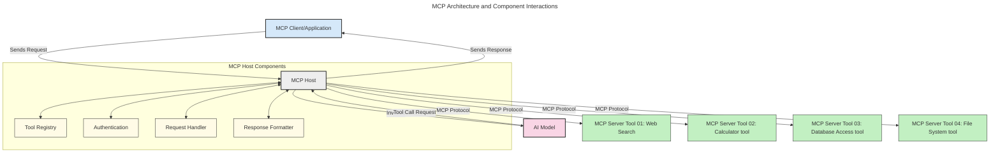

<!--
CO_OP_TRANSLATOR_METADATA:
{
  "original_hash": "0df1ee78a6dd8300f3a040ca5b411c2e",
  "translation_date": "2025-08-18T16:19:49+00:00",
  "source_file": "00-Introduction/README.md",
  "language_code": "ne"
}
-->
# मोडेल कन्टेक्स्ट प्रोटोकल (MCP) को परिचय: स्केलेबल AI एप्लिकेसनहरूको लागि यसको महत्व

_(माथिको तस्बिरमा क्लिक गरेर यस पाठको भिडियो हेर्नुहोस्)_

जेनेरेटिभ AI एप्लिकेसनहरू एक ठूलो प्रगति हो किनभने तिनीहरूले प्रायः प्रयोगकर्तालाई प्राकृतिक भाषा प्रम्प्टहरू प्रयोग गरेर एपसँग अन्तरक्रिया गर्न अनुमति दिन्छ। तर, जब यस्ता एपहरूमा समय र स्रोतहरू थप लगानी गरिन्छ, तपाईंले सुनिश्चित गर्न चाहनुहुन्छ कि तपाईंले कार्यक्षमताहरू र स्रोतहरू सजिलैसँग एकीकृत गर्न सक्नुहुन्छ जसले विस्तार गर्न सजिलो बनाउँछ, तपाईंको एपले एकभन्दा बढी मोडेललाई समर्थन गर्न सक्छ, र विभिन्न मोडेल जटिलताहरूलाई व्यवस्थापन गर्न सक्छ। छोटकरीमा, जेनेरेटिभ AI एप्लिकेसनहरू निर्माण गर्न सुरुमा सजिलो छ, तर जब तिनीहरू बढ्छन् र जटिल बन्छन्, तपाईंले आर्किटेक्चर परिभाषित गर्न सुरु गर्न आवश्यक छ र सम्भवतः एक मानकमा निर्भर गर्न आवश्यक छ ताकि तपाईंको एपहरू एक सुसंगत तरिकामा निर्माण गरिएका छन्। यहीँ MCP आउँछ चीजहरू व्यवस्थित गर्न र एक मानक प्रदान गर्न।

---

## **🔍 मोडेल कन्टेक्स्ट प्रोटोकल (MCP) के हो?**

**मोडेल कन्टेक्स्ट प्रोटोकल (MCP)** एक **खुला, मानकीकृत इन्टरफेस** हो जसले ठूलो भाषा मोडेलहरू (LLMs) लाई बाह्य उपकरणहरू, APIs, र डाटा स्रोतहरूसँग सहज रूपमा अन्तरक्रिया गर्न अनुमति दिन्छ। यसले AI मोडेल कार्यक्षमतालाई तिनीहरूको प्रशिक्षण डाटाभन्दा बाहिर बढाउनको लागि एक सुसंगत आर्किटेक्चर प्रदान गर्दछ, जसले स्मार्ट, स्केलेबल, र थप प्रतिक्रियाशील AI प्रणालीहरू सक्षम बनाउँछ।

---

## **🎯 AI मा मानकीकरण किन महत्त्वपूर्ण छ**

जसरी जेनेरेटिभ AI एप्लिकेसनहरू जटिल बन्दै जान्छन्, मानकहरू अपनाउनु आवश्यक छ जसले **स्केलेबिलिटी, विस्तारयोग्यता, मर्मतयोग्यता,** र **विक्रेता-लॉक-इनबाट बच्न** सुनिश्चित गर्दछ। MCP यी आवश्यकताहरूलाई सम्बोधन गर्दछ:

- मोडेल-उपकरण एकीकरणलाई एकीकृत गर्दै
- कमजोर, एकपटकको कस्टम समाधानहरू घटाउँदै
- विभिन्न विक्रेताहरूका बहु मोडेलहरूलाई एउटै इकोसिस्टममा सह-अस्तित्व गर्न अनुमति दिँदै

**Note:** MCP आफूलाई खुला मानकको रूपमा प्रस्तुत गरे पनि, IEEE, IETF, W3C, ISO, वा अन्य कुनै मानक निकायहरू मार्फत MCP लाई मानकीकरण गर्ने कुनै योजना छैन।

---

## **📚 सिकाइ उद्देश्यहरू**

यस लेखको अन्त्यसम्ममा, तपाईं सक्षम हुनुहुनेछ:

- **मोडेल कन्टेक्स्ट प्रोटोकल (MCP)** र यसको प्रयोग केसहरू परिभाषित गर्नुहोस्
- MCP कसरी मोडेल-उपकरण सञ्चारलाई मानकीकृत गर्दछ बुझ्नुहोस्
- MCP आर्किटेक्चरका मुख्य घटकहरू पहिचान गर्नुहोस्
- उद्यम र विकास सन्दर्भहरूमा MCP को वास्तविक-विश्व अनुप्रयोगहरू अन्वेषण गर्नुहोस्

---

## **💡 मोडेल कन्टेक्स्ट प्रोटोकल (MCP) किन गेम-चेन्जर हो**

### **🔗 MCP ले AI अन्तरक्रियामा विखण्डन समाधान गर्दछ**

MCP भन्दा पहिले, मोडेलहरूलाई उपकरणहरूसँग एकीकृत गर्न आवश्यक थियो:

- प्रत्येक उपकरण-मोडेल जोडीको लागि कस्टम कोड
- प्रत्येक विक्रेताको लागि गैर-मानक APIs
- अपडेटका कारण बारम्बार ब्रेकहरू
- धेरै उपकरणहरूसँग खराब स्केलेबिलिटी

### **✅ MCP मानकीकरणका फाइदाहरू**

| **फाइदा**                | **विवरण**                                                                      |
|--------------------------|--------------------------------------------------------------------------------|
| अन्तरसञ्चालन क्षमता      | LLMs विभिन्न विक्रेताहरूका उपकरणहरूसँग सहज रूपमा काम गर्छन्                     |
| सुसंगतता                 | प्लेटफर्म र उपकरणहरूमा समान व्यवहार                                           |
| पुनःप्रयोगयोग्यता        | एकपटक निर्माण गरिएका उपकरणहरू परियोजनाहरू र प्रणालीहरूमा प्रयोग गर्न सकिन्छ     |
| विकासको गति             | मानकीकृत, प्लग-एन्ड-प्ले इन्टरफेसहरू प्रयोग गरेर विकास समय घटाउनुहोस्         |

---

## **🧱 उच्च-स्तरीय MCP आर्किटेक्चरको अवलोकन**

MCP ले **क्लाइन्ट-सर्भर मोडेल** अनुसरण गर्दछ, जहाँ:

- **MCP होस्टहरू** AI मोडेलहरू चलाउँछन्
- **MCP क्लाइन्टहरू** अनुरोध सुरु गर्छन्
- **MCP सर्भरहरू** सन्दर्भ, उपकरणहरू, र क्षमताहरू प्रदान गर्छन्

### **मुख्य घटकहरू:**

- **स्रोतहरू** – मोडेलहरूको लागि स्थिर वा गतिशील डाटा  
- **प्रम्प्टहरू** – निर्देशित जेनेरेशनका लागि पूर्वनिर्धारित वर्कफ्लोहरू  
- **उपकरणहरू** – खोज, गणना जस्ता कार्यहरू  
- **नमूना** – पुनरावर्ती अन्तरक्रियाहरू मार्फत एजेन्टिक व्यवहार

---

## MCP सर्भरहरू कसरी काम गर्छन्

MCP सर्भरहरू निम्न तरिकामा सञ्चालन गर्छन्:

- **अनुरोध प्रवाह**:
    1. अन्तिम प्रयोगकर्ता वा तिनीहरूको तर्फबाट कार्य गर्ने सफ्टवेयरद्वारा अनुरोध सुरु गरिन्छ।
    2. **MCP क्लाइन्ट** अनुरोधलाई **MCP होस्ट** मा पठाउँछ, जसले AI मोडेल रनटाइम व्यवस्थापन गर्छ।
    3. **AI मोडेल** प्रयोगकर्ता प्रम्प्ट प्राप्त गर्छ र एक वा बढी उपकरण कलहरू मार्फत बाह्य उपकरणहरू वा डाटामा पहुँचको अनुरोध गर्न सक्छ।
    4. **MCP होस्ट**, मोडेलले होइन, मानकीकृत प्रोटोकल प्रयोग गरेर उपयुक्त **MCP सर्भर(हरू)** सँग सञ्चार गर्छ।
- **MCP होस्ट कार्यक्षमता**:
    - **उपकरण रजिस्ट्री**: उपलब्ध उपकरणहरू र तिनीहरूको क्षमताहरूको सूची राख्छ।
    - **प्रमाणीकरण**: उपकरण पहुँचको अनुमति प्रमाणित गर्छ।
    - **अनुरोध ह्यान्डलर**: मोडेलबाट आउने उपकरण अनुरोधहरू प्रशोधन गर्छ।
    - **प्रतिक्रिया स्वरूपकर्ता**: उपकरण आउटपुटलाई मोडेलले बुझ्न सक्ने स्वरूपमा संरचना गर्छ।
- **MCP सर्भर कार्यान्वयन**:
    - **MCP होस्ट** उपकरण कलहरूलाई एक वा बढी **MCP सर्भर(हरू)** मा रुट गर्छ, प्रत्येकले विशेष कार्यहरू (जस्तै, खोज, गणना, डाटाबेस क्वेरीहरू) प्रदान गर्छ।
    - **MCP सर्भरहरू** तिनीहरूको सम्बन्धित अपरेशनहरू प्रदर्शन गर्छन् र **MCP होस्ट** लाई सुसंगत स्वरूपमा परिणामहरू फर्काउँछन्।
    - **MCP होस्ट** यी परिणामहरूलाई स्वरूपित गर्छ र **AI मोडेल** मा पठाउँछ।
- **प्रतिक्रिया पूरा**:
    - **AI मोडेल** उपकरण आउटपुटलाई अन्तिम प्रतिक्रियामा समाहित गर्छ।
    - **MCP होस्ट** यो प्रतिक्रिया **MCP क्लाइन्ट** मा पठाउँछ, जसले अन्तिम प्रयोगकर्ता वा कल गर्ने सफ्टवेयरलाई प्रदान गर्छ।

## 👨‍💻 MCP सर्भर कसरी निर्माण गर्ने (उदाहरणसहित)

MCP सर्भरहरूले LLM क्षमताहरू विस्तार गर्न डाटा र कार्यक्षमता प्रदान गर्न अनुमति दिन्छ।

तयार हुनुहुन्छ प्रयास गर्न? यहाँ विभिन्न भाषाहरू/स्ट्याकहरूमा सरल MCP सर्भरहरू निर्माण गर्ने उदाहरणहरू सहित भाषा र/वा स्ट्याक विशिष्ट SDKs छन्:

- **Python SDK**: https://github.com/modelcontextprotocol/python-sdk

- **TypeScript SDK**: https://github.com/modelcontextprotocol/typescript-sdk

- **Java SDK**: https://github.com/modelcontextprotocol/java-sdk

- **C#/.NET SDK**: https://github.com/modelcontextprotocol/csharp-sdk

## 🌍 MCP को वास्तविक-विश्व प्रयोग केसहरू

MCP ले AI क्षमताहरू विस्तार गरेर विभिन्न प्रकारका अनुप्रयोगहरू सक्षम बनाउँछ:

| **अनुप्रयोग**                | **विवरण**                                                                      |
|------------------------------|--------------------------------------------------------------------------------|
| उद्यम डाटा एकीकरण           | LLMs लाई डाटाबेस, CRMs, वा आन्तरिक उपकरणहरूसँग जडान गर्नुहोस्                  |
| एजेन्टिक AI प्रणाली          | उपकरण पहुँच र निर्णय-निर्माण वर्कफ्लोहरूसँग स्वायत्त एजेन्टहरू सक्षम गर्नुहोस्   |
| बहु-मोडल एप्लिकेसनहरू        | एकल एकीकृत AI एपभित्र पाठ, तस्बिर, र अडियो उपकरणहरू संयोजन गर्नुहोस्          |
| वास्तविक-समय डाटा एकीकरण     | AI अन्तरक्रियामा लाइभ डाटा ल्याएर थप सटीक, वर्तमान आउटपुटहरू प्रदान गर्नुहोस्   |

### 🧠 MCP = AI अन्तरक्रियाको लागि सार्वभौमिक मानक

मोडेल कन्टेक्स्ट प्रोटोकल (MCP) AI अन्तरक्रियाको लागि सार्वभौमिक मानकको रूपमा कार्य गर्दछ, ठीक USB-C ले उपकरणहरूको लागि भौतिक जडानलाई मानकीकृत गरेजस्तै। AI को संसारमा, MCP ले एक सुसंगत इन्टरफेस प्रदान गर्दछ, जसले मोडेलहरू (क्लाइन्टहरू) लाई बाह्य उपकरणहरू र डाटा प्रदायकहरूसँग सहज रूपमा एकीकृत गर्न अनुमति दिन्छ। यसले प्रत्येक API वा डाटा स्रोतको लागि विविध, कस्टम प्रोटोकलहरूको आवश्यकता हटाउँछ।

MCP अन्तर्गत, MCP-संगत उपकरण (MCP सर्भर भनिन्छ) एक एकीकृत मानक अनुसरण गर्दछ। यी सर्भरहरूले तिनीहरूले प्रस्ताव गर्ने उपकरणहरू वा कार्यहरू सूचीबद्ध गर्न सक्छन् र AI एजेन्टद्वारा अनुरोध गर्दा ती कार्यहरू कार्यान्वयन गर्न सक्छन्। MCP समर्थन गर्ने AI एजेन्ट प्लेटफर्महरूले सर्भरहरूबाट उपलब्ध उपकरणहरू पत्ता लगाउन र यस मानक प्रोटोकल मार्फत तिनीहरूलाई आह्वान गर्न सक्षम छन्।

### 💡 ज्ञान पहुँचलाई सहज बनाउँछ

उपकरणहरू प्रदान गर्नुको बाहेक, MCP ले ज्ञान पहुँचलाई पनि सहज बनाउँछ। यसले एप्लिकेसनहरूलाई विभिन्न डाटा स्रोतहरूसँग लिंक गरेर ठूलो भाषा मोडेलहरू (LLMs) लाई सन्दर्भ प्रदान गर्न सक्षम बनाउँछ। उदाहरणका लागि, एक MCP सर्भरले कम्पनीको दस्तावेज भण्डार प्रतिनिधित्व गर्न सक्छ, जसले एजेन्टहरूलाई मागमा सम्बन्धित जानकारी पुनःप्राप्त गर्न अनुमति दिन्छ। अर्को सर्भरले इमेल पठाउने वा रेकर्डहरू अपडेट गर्ने जस्ता विशिष्ट कार्यहरू ह्यान्डल गर्न सक्छ। एजेन्टको दृष्टिकोणबाट, यी केवल उपकरणहरू हुन् जुन यसले प्रयोग गर्न सक्छ—केही उपकरणहरूले डाटा (ज्ञान सन्दर्भ) फर्काउँछन्, जबकि अन्यले कार्यहरू प्रदर्शन गर्छन्। MCP ले दुवैलाई प्रभावकारी रूपमा व्यवस्थापन गर्छ।

एजेन्टले MCP सर्भरमा जडान गर्दा सर्भरको उपलब्ध क्षमताहरू र पहुँचयोग्य डाटालाई मानक स्वरूपमा स्वचालित रूपमा सिक्छ। यस मानकीकरणले गतिशील उपकरण उपलब्धता सक्षम बनाउँछ। उदाहरणका लागि, एजेन्टको प्रणालीमा नयाँ MCP सर्भर थप्दा यसको कार्यहरू तुरुन्तै प्रयोग गर्न सकिन्छ बिना एजेन्टको निर्देशनहरूको थप अनुकूलन आवश्यक पर्दा।

---

## 🔐 MCP प्रयोगका व्यावहारिक फाइदाहरू

MCP प्रयोगका व्यावहारिक फाइदाहरू यहाँ छन्:

- **ताजगी**: मोडेलहरूले तिनीहरूको प्रशिक्षण डाटाभन्दा बाहिरको अद्यावधिक जानकारी पहुँच गर्न सक्छन्
- **क्षमता विस्तार**: मोडेलहरूले तिनीहरू प्रशिक्षित नभएका कार्यहरूको लागि विशेष उपकरणहरू प्रयोग गर्न सक्छन्
- **भ्रम कम गर्नुहोस्**: बाह्य डाटा स्रोतहरूले तथ्यात्मक आधार प्रदान गर्छन्
- **गोपनीयता**: संवेदनशील डाटा प्रम्प्टहरूमा समाहित हुनुको सट्टा सुरक्षित वातावरणभित्र रहन सक्छ

---

## 📌 मुख्य निष्कर्षहरू

MCP प्रयोगका लागि निम्न मुख्य निष्कर्षहरू छन्:

- **MCP** ले AI मोडेलहरू उपकरण र डाटासँग कसरी अन्तरक्रिया गर्छन् भन्ने कुरा मानकीकृत गर्छ
- **विस्तारयोग्यता, सुसंगतता, र अन्तरसञ्चालन क्षमता** प्रवर्द्धन गर्छ
- MCP ले **विकास समय घटाउन, विश्वसनीयता सुधार गर्न, र मोडेल क्षमताहरू विस्तार गर्न मद्दत गर्छ**
- क्लाइन्ट-सर्भर आर्किटेक्चरले **लचिलो, विस्तारयोग्य AI एप्लिकेसनहरू सक्षम बनाउँछ**

---

## 🧠 अभ्यास

तपाईं निर्माण गर्न इच्छुक AI एप्लिकेसनको बारेमा सोच्नुहोस्।

- कुन **बाह्य उपकरणहरू वा डाटा** ले यसको क्षमताहरू बढाउन सक्छ?
- MCP ले एकीकरणलाई **सरल र विश्वसनीय** कसरी बनाउन सक्छ?

---

## थप स्रोतहरू

- [MCP GitHub Repository](https://github.com/modelcontextprotocol)

---

## अब के गर्ने

अर्को: [अध्याय १: कोर अवधारणाहरू](../01-CoreConcepts/README.md)

**अस्वीकरण**:  
यो दस्तावेज़ AI अनुवाद सेवा [Co-op Translator](https://github.com/Azure/co-op-translator) प्रयोग गरेर अनुवाद गरिएको छ। हामी यथार्थताको लागि प्रयास गर्छौं, तर कृपया ध्यान दिनुहोस् कि स्वचालित अनुवादहरूमा त्रुटिहरू वा अशुद्धताहरू हुन सक्छ। यसको मूल भाषा मा रहेको मूल दस्तावेज़लाई आधिकारिक स्रोत मानिनुपर्छ। महत्वपूर्ण जानकारीको लागि, व्यावसायिक मानव अनुवाद सिफारिस गरिन्छ। यस अनुवादको प्रयोगबाट उत्पन्न हुने कुनै पनि गलतफहमी वा गलत व्याख्याको लागि हामी जिम्मेवार हुने छैनौं।