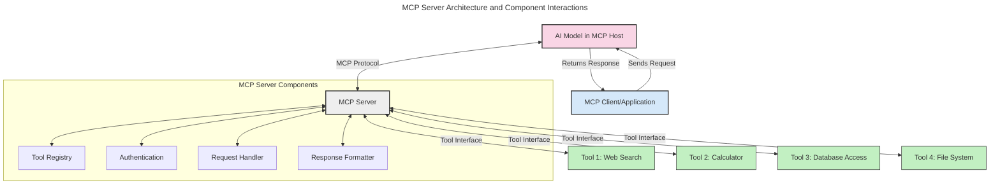
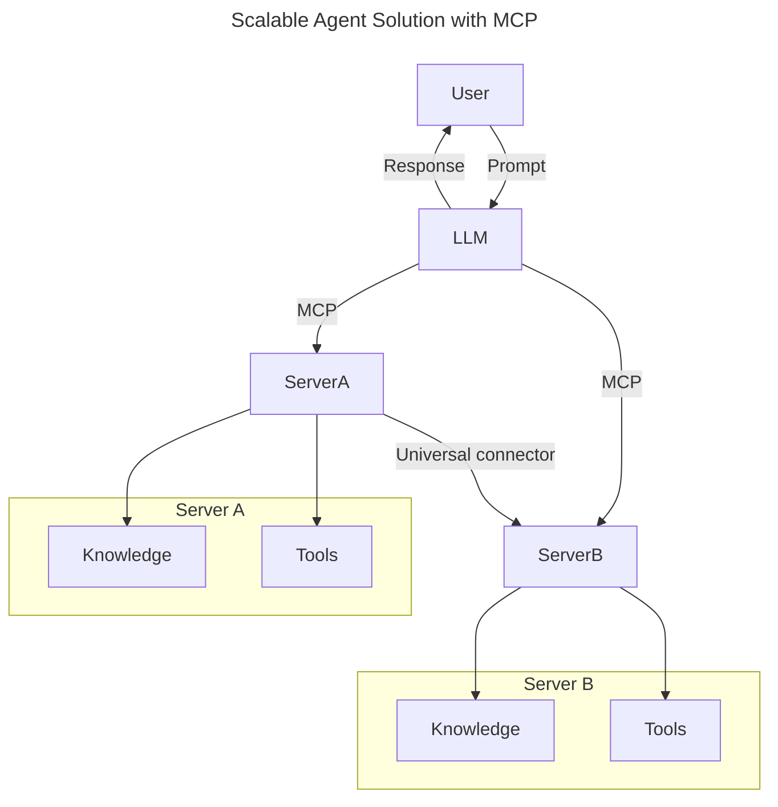
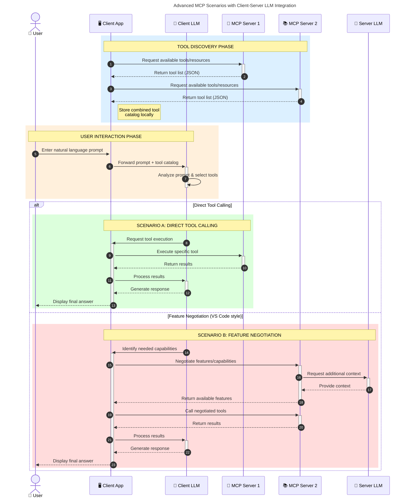

<!--
CO_OP_TRANSLATOR_METADATA:
{
  "original_hash": "105c2ddbb77bc38f7e9df009e1b06e45",
  "translation_date": "2025-07-13T15:30:21+00:00",
  "source_file": "00-Introduction/README.md",
  "language_code": "ne"
}
-->
# मोडेल कन्टेक्स्ट प्रोटोकल (MCP) परिचय: स्केलेबल AI अनुप्रयोगहरूका लागि किन महत्वपूर्ण छ

जेनेरेटिभ AI अनुप्रयोगहरू ठूलो प्रगति हुन् किनभने तिनीहरूले प्रायः प्रयोगकर्तालाई प्राकृतिक भाषाका प्रॉम्प्टहरू मार्फत एपसँग अन्तरक्रिया गर्न अनुमति दिन्छन्। तर, यस्ता एपहरूमा थप समय र स्रोतहरू लगानी गर्दा, तपाईंले सुनिश्चित गर्न चाहनुहुन्छ कि तपाईंले कार्यक्षमताहरू र स्रोतहरू सजिलैसँग एकीकृत गर्न सक्नुहुन्छ, जसले विस्तार गर्न सजिलो बनाउँछ, तपाईंको एपले एक भन्दा बढी मोडेलहरूलाई समर्थन गर्न सक्छ, र विभिन्न मोडेल जटिलताहरूलाई व्यवस्थापन गर्न सक्छ। संक्षेपमा, जेनेरेटिभ AI एपहरू सुरुमा बनाउनु सजिलो हुन्छ, तर जति तिनीहरू बढ्छन् र जटिल हुन्छन्, तपाईंले वास्तुकला परिभाषित गर्न थाल्नुपर्छ र सम्भवतः एक मानकमा निर्भर हुनुपर्छ जसले तपाईंका एपहरूलाई सुसंगत तरिकाले निर्माण गर्न सुनिश्चित गर्छ। यहीँ MCP ले व्यवस्था गर्न र मानक प्रदान गर्न मद्दत गर्छ।

---

## **🔍 मोडेल कन्टेक्स्ट प्रोटोकल (MCP) के हो?**

**मोडेल कन्टेक्स्ट प्रोटोकल (MCP)** एक **खुला, मानकीकृत इन्टरफेस** हो जसले ठूलो भाषा मोडेलहरू (LLMs) लाई बाह्य उपकरणहरू, API हरू, र डाटा स्रोतहरूसँग सहज रूपमा अन्तरक्रिया गर्न अनुमति दिन्छ। यसले AI मोडेलको कार्यक्षमता तिनीहरूको प्रशिक्षण डाटाभन्दा बाहिर विस्तार गर्न एक सुसंगत वास्तुकला प्रदान गर्छ, जसले स्मार्ट, स्केलेबल, र बढी प्रतिक्रियाशील AI प्रणालीहरू सक्षम बनाउँछ।

---

## **🎯 AI मा मानकीकरण किन आवश्यक छ**

जेनेरेटिभ AI अनुप्रयोगहरू जति जटिल बन्दैछन्, त्यति नै महत्त्वपूर्ण हुन्छ मानकहरू अपनाउनु जसले **स्केलेबिलिटी, विस्तारयोग्यता**, र **रखरखावयोग्यता** सुनिश्चित गर्छ। MCP ले यी आवश्यकताहरूलाई सम्बोधन गर्छ:

- मोडेल-उपकरण एकीकरणलाई एकीकृत गर्दै
- कमजोर, एकपटकका अनुकूल समाधानहरू घटाउँदै
- एउटै इकोसिस्टममा धेरै मोडेलहरूलाई सहअस्तित्व गर्न अनुमति दिँदै

---

## **📚 सिकाइका उद्देश्यहरू**

यस लेखको अन्त्यसम्म, तपाईं सक्षम हुनुहुनेछ:

- **मोडेल कन्टेक्स्ट प्रोटोकल (MCP)** र यसको प्रयोगका केसहरू परिभाषित गर्न
- MCP ले मोडेल-देखि-उपकरण सञ्चार कसरी मानकीकृत गर्छ बुझ्न
- MCP वास्तुकलाका मुख्य घटकहरू पहिचान गर्न
- उद्यम र विकास सन्दर्भमा MCP का वास्तविक विश्व प्रयोगहरू अन्वेषण गर्न

---

## **💡 मोडेल कन्टेक्स्ट प्रोटोकल (MCP) किन क्रान्तिकारी छ**

### **🔗 MCP ले AI अन्तरक्रियामा टुक्राव समाधान गर्छ**

MCP अघि, मोडेलहरूलाई उपकरणहरूसँग एकीकृत गर्न आवश्यक थियो:

- प्रत्येक उपकरण-मोडेल जोडीका लागि अनुकूलित कोड
- प्रत्येक विक्रेता लागि गैर-मानकीकृत API हरू
- अपडेटहरूका कारण बारम्बार अवरोधहरू
- धेरै उपकरणहरूसँग खराब स्केलेबिलिटी

### **✅ MCP मानकीकरणका फाइदाहरू**

| **फाइदा**               | **विवरण**                                                                    |
|-------------------------|------------------------------------------------------------------------------|
| अन्तरसञ्चालन क्षमता     | LLM हरू विभिन्न विक्रेताहरूका उपकरणहरूसँग सहज रूपमा काम गर्छन्               |
| सुसंगतता                | प्लेटफर्म र उपकरणहरूमा समान व्यवहार                                         |
| पुन: प्रयोगयोग्यता      | एक पटक बनाइएका उपकरणहरू परियोजना र प्रणालीहरूमा पुन: प्रयोग गर्न सकिन्छ       |
| विकास तीव्रता           | मानकीकृत, प्लग-एण्ड-प्ले इन्टरफेसहरू प्रयोग गरेर विकास समय घटाउँछ            |

---

## **🧱 उच्च-स्तरीय MCP वास्तुकला अवलोकन**

MCP ले **क्लाइन्ट-सर्भर मोडेल** अनुसरण गर्छ, जहाँ:

- **MCP होस्टहरू** AI मोडेलहरू चलाउँछन्
- **MCP क्लाइन्टहरू** अनुरोधहरू सुरु गर्छन्
- **MCP सर्भरहरू** कन्टेक्स्ट, उपकरणहरू, र क्षमता प्रदान गर्छन्

### **मुख्य घटकहरू:**

- **स्रोतहरू** – मोडेलहरूका लागि स्थिर वा गतिशील डाटा  
- **प्रॉम्प्टहरू** – मार्गनिर्देशित जेनेरेशनका लागि पूर्वनिर्धारित कार्यप्रवाहहरू  
- **उपकरणहरू** – खोज, गणना जस्ता कार्यान्वयनयोग्य फंक्शनहरू  
- **साम्पलिङ** – पुनरावृत्त अन्तरक्रियाहरू मार्फत एजेन्टिक व्यवहार

---

## MCP सर्भरहरू कसरी काम गर्छन्

MCP सर्भरहरू निम्न तरिकाले सञ्चालन हुन्छन्:

- **अनुरोध प्रवाह**:  
    1. MCP क्लाइन्टले MCP होस्टमा चलिरहेको AI मोडेललाई अनुरोध पठाउँछ।  
    2. AI मोडेलले बाह्य उपकरण वा डाटाको आवश्यकता पत्ता लगाउँछ।  
    3. मोडेलले मानकीकृत प्रोटोकल प्रयोग गरी MCP सर्भरसँग सञ्चार गर्छ।  

- **MCP सर्भर कार्यक्षमता**:  
    - उपकरण रजिष्ट्रि: उपलब्ध उपकरणहरू र तिनीहरूको क्षमताहरूको सूची राख्छ।  
    - प्रमाणीकरण: उपकरण पहुँचका लागि अनुमति जाँच गर्छ।  
    - अनुरोध ह्यान्डलर: मोडेलबाट आउने उपकरण अनुरोधहरू प्रक्रिया गर्छ।  
    - प्रतिक्रिया फर्म्याटर: उपकरण आउटपुटलाई मोडेलले बुझ्ने ढाँचामा संरचना गर्छ।  

- **उपकरण कार्यान्वयन**:  
    - सर्भरले अनुरोधहरू उपयुक्त बाह्य उपकरणहरूमा मार्गनिर्देशन गर्छ  
    - उपकरणहरूले आफ्नो विशेष कार्यहरू (खोज, गणना, डाटाबेस क्वेरी आदि) सञ्चालन गर्छन्  
    - परिणामहरू मोडेललाई सुसंगत ढाँचामा फिर्ता गरिन्छन्  

- **प्रतिक्रिया पूरा गर्नु**:  
    - AI मोडेलले उपकरण आउटपुटलाई आफ्नो प्रतिक्रियामा समावेश गर्छ  
    - अन्तिम प्रतिक्रिया क्लाइन्ट एप्लिकेसनमा पठाइन्छ  

## 👨‍💻 MCP सर्भर कसरी बनाउने (उदाहरणसहित)

MCP सर्भरहरूले LLM क्षमताहरू विस्तार गर्न डाटा र कार्यक्षमता प्रदान गर्छन्।

परीक्षण गर्न तयार हुनुहुन्छ? यहाँ विभिन्न भाषाहरूमा सरल MCP सर्भर बनाउनका उदाहरणहरू छन्:

- **Python उदाहरण**: https://github.com/modelcontextprotocol/python-sdk

- **TypeScript उदाहरण**: https://github.com/modelcontextprotocol/typescript-sdk

- **Java उदाहरण**: https://github.com/modelcontextprotocol/java-sdk

- **C#/.NET उदाहरण**: https://github.com/modelcontextprotocol/csharp-sdk

## 🌍 MCP का वास्तविक विश्व प्रयोगहरू

MCP ले AI क्षमताहरू विस्तार गरेर विभिन्न अनुप्रयोगहरू सक्षम बनाउँछ:

| **अनुप्रयोग**               | **विवरण**                                                                    |
|-----------------------------|------------------------------------------------------------------------------|
| उद्यम डाटा एकीकरण          | LLM हरूलाई डाटाबेस, CRM, वा आन्तरिक उपकरणहरूसँग जडान गर्ने                     |
| एजेन्टिक AI प्रणालीहरू      | उपकरण पहुँच र निर्णय-निर्माण कार्यप्रवाहहरूसहित स्वायत्त एजेन्टहरू सक्षम पार्ने |
| बहु-मोडल अनुप्रयोगहरू      | एकै AI एपमा पाठ, छवि, र अडियो उपकरणहरू संयोजन गर्ने                          |
| वास्तविक-समय डाटा एकीकरण  | AI अन्तरक्रियामा ताजा डाटा ल्याएर बढी सही र वर्तमान परिणामहरू प्रदान गर्ने    |

### 🧠 MCP = AI अन्तरक्रियाका लागि सार्वभौम मानक

मोडेल कन्टेक्स्ट प्रोटोकल (MCP) AI अन्तरक्रियाका लागि सार्वभौम मानकको रूपमा काम गर्छ, जस्तै USB-C ले उपकरणहरूको भौतिक जडानलाई मानकीकृत गर्‍यो। AI को दुनियाँमा, MCP ले एक सुसंगत इन्टरफेस प्रदान गर्छ, जसले मोडेलहरू (क्लाइन्टहरू) लाई बाह्य उपकरण र डाटा प्रदायकहरू (सर्भरहरू) सँग सहज रूपमा एकीकृत गर्न अनुमति दिन्छ। यसले प्रत्येक API वा डाटा स्रोतका लागि फरक-फरक, अनुकूलित प्रोटोकलहरूको आवश्यकता हटाउँछ।

MCP अन्तर्गत, MCP-संगत उपकरण (जसलाई MCP सर्भर भनिन्छ) एक एकीकृत मानक अनुसरण गर्छ। यी सर्भरहरूले आफूसँग उपलब्ध उपकरणहरू वा कार्यहरूको सूची दिन सक्छन् र AI एजेन्टले अनुरोध गर्दा ती कार्यहरू सञ्चालन गर्छन्। MCP समर्थित AI एजेन्ट प्लेटफर्महरूले सर्भरहरूबाट उपलब्ध उपकरणहरू पत्ता लगाउन र यस मानक प्रोटोकलमार्फत तिनीहरूलाई कल गर्न सक्षम हुन्छन्।

### 💡 ज्ञान पहुँचलाई सहज बनाउँछ

उपकरणहरू मात्र होइन, MCP ले ज्ञान पहुँचलाई पनि सहज बनाउँछ। यसले अनुप्रयोगहरूलाई ठूलो भाषा मोडेलहरूलाई विभिन्न डाटा स्रोतहरूसँग जोडेर सन्दर्भ प्रदान गर्न सक्षम बनाउँछ। उदाहरणका लागि, एउटा MCP सर्भर कम्पनीको कागजात भण्डार प्रतिनिधित्व गर्न सक्छ, जसले एजेन्टहरूलाई आवश्यक जानकारी मागमा प्राप्त गर्न अनुमति दिन्छ। अर्को सर्भरले इमेल पठाउने वा रेकर्ड अपडेट गर्ने जस्ता विशिष्ट कार्यहरू सञ्चालन गर्न सक्छ। एजेन्टको दृष्टिकोणबाट, यी सबै उपकरणहरू हुन्—केही उपकरणहरूले डाटा (ज्ञान सन्दर्भ) फिर्ता गर्छन् भने केहीले कार्यहरू सञ्चालन गर्छन्। MCP ले दुवैलाई प्रभावकारी रूपमा व्यवस्थापन गर्छ।

एजेन्टले MCP सर्भरसँग जडान गर्दा, सर्भरका उपलब्ध क्षमताहरू र पहुँचयोग्य डाटाहरू मानक ढाँचामा स्वचालित रूपमा सिक्छ। यस मानकीकरणले गतिशील उपकरण उपलब्धता सक्षम बनाउँछ। उदाहरणका लागि, एजेन्टको प्रणालीमा नयाँ MCP सर्भर थप्दा, त्यसका कार्यहरू तुरुन्तै प्रयोग गर्न मिल्ने हुन्छन्, एजेन्टका निर्देशनहरूमा थप अनुकूलन आवश्यक पर्दैन।

यो सरल एकीकरण मर्मेड डायग्राममा देखाइएको प्रवाहसँग मेल खान्छ, जहाँ सर्भरहरूले उपकरण र ज्ञान दुवै प्रदान गर्छन्, प्रणालीहरू बीच सहज सहकार्य सुनिश्चित गर्दै।

### 👉 उदाहरण: स्केलेबल एजेन्ट समाधान

### 🔄 क्लाइन्ट-साइड LLM एकीकरणसहित उन्नत MCP परिदृश्यहरू

मूल MCP वास्तुकलाभन्दा बाहिर, त्यहाँ उन्नत परिदृश्यहरू छन् जहाँ क्लाइन्ट र सर्भर दुवैमा LLM हुन्छन्, जसले थप परिष्कृत अन्तरक्रियाहरू सक्षम बनाउँछ:

## 🔐 MCP का व्यावहारिक फाइदाहरू

MCP प्रयोग गर्दा प्राप्त हुने व्यावहारिक फाइदाहरू:

- **ताजगी**: मोडेलहरूले आफ्नो प्रशिक्षण डाटाभन्दा बाहिरको अद्यावधिक जानकारी पहुँच गर्न सक्छन्  
- **क्षमता विस्तार**: मोडेलहरूले ती कार्यहरूका लागि विशेष उपकरणहरू प्रयोग गर्न सक्छन् जसका लागि तिनीहरू प्रशिक्षित थिएनन्  
- **भ्रम कम गर्नु**: बाह्य डाटा स्रोतहरूले तथ्यात्मक आधार प्रदान गर्छन्  
- **गोपनीयता**: संवेदनशील डाटा सुरक्षित वातावरणमा रहन सक्छ, प्रॉम्प्टमा समावेश नगरिकन  

## 📌 मुख्य बुँदाहरू

MCP प्रयोग गर्दा ध्यान दिनुपर्ने मुख्य बुँदाहरू:

- **MCP** ले AI मोडेलहरूलाई उपकरण र डाटासँग कसरी अन्तरक्रिया गर्ने मानकीकृत गर्छ  
- **विस्तारयोग्यता, सुसंगतता, र अन्तरसञ्चालन क्षमता** प्रवर्द्धन गर्छ  
- MCP ले **विकास समय घटाउने, विश्वसनीयता सुधार्ने, र मोडेल क्षमताहरू विस्तार गर्ने** मद्दत गर्छ  
- क्लाइन्ट-सर्भर वास्तुकलाले **लचिलो, विस्तारयोग्य AI अनुप्रयोगहरू** सक्षम बनाउँछ  

## 🧠 अभ्यास

तपाईंले बनाउन चाहनुभएको AI अनुप्रयोगबारे सोच्नुहोस्।

- कुन **बाह्य उपकरण वा डाटाले** यसको क्षमताहरू बढाउन सक्छ?  
- MCP ले एकीकरणलाई कसरी **सरल र भरपर्दो** बनाउन सक्छ?  

## थप स्रोतहरू

- [MCP GitHub Repository](https://github.com/modelcontextprotocol)

## के छ अर्को

अर्को: [अध्याय १: मुख्य अवधारणाहरू](../01-CoreConcepts/README.md)

**अस्वीकरण**:  
यो दस्तावेज AI अनुवाद सेवा [Co-op Translator](https://github.com/Azure/co-op-translator) प्रयोग गरी अनुवाद गरिएको हो। हामी शुद्धताका लागि प्रयासरत छौं, तर कृपया ध्यान दिनुहोस् कि स्वचालित अनुवादमा त्रुटि वा अशुद्धता हुन सक्छ। मूल दस्तावेज यसको मूल भाषामा नै अधिकारिक स्रोत मानिनुपर्छ। महत्वपूर्ण जानकारीका लागि व्यावसायिक मानव अनुवाद सिफारिस गरिन्छ। यस अनुवादको प्रयोगबाट उत्पन्न कुनै पनि गलतफहमी वा गलत व्याख्याका लागि हामी जिम्मेवार छैनौं।