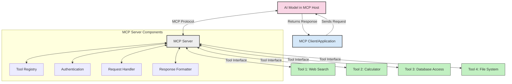
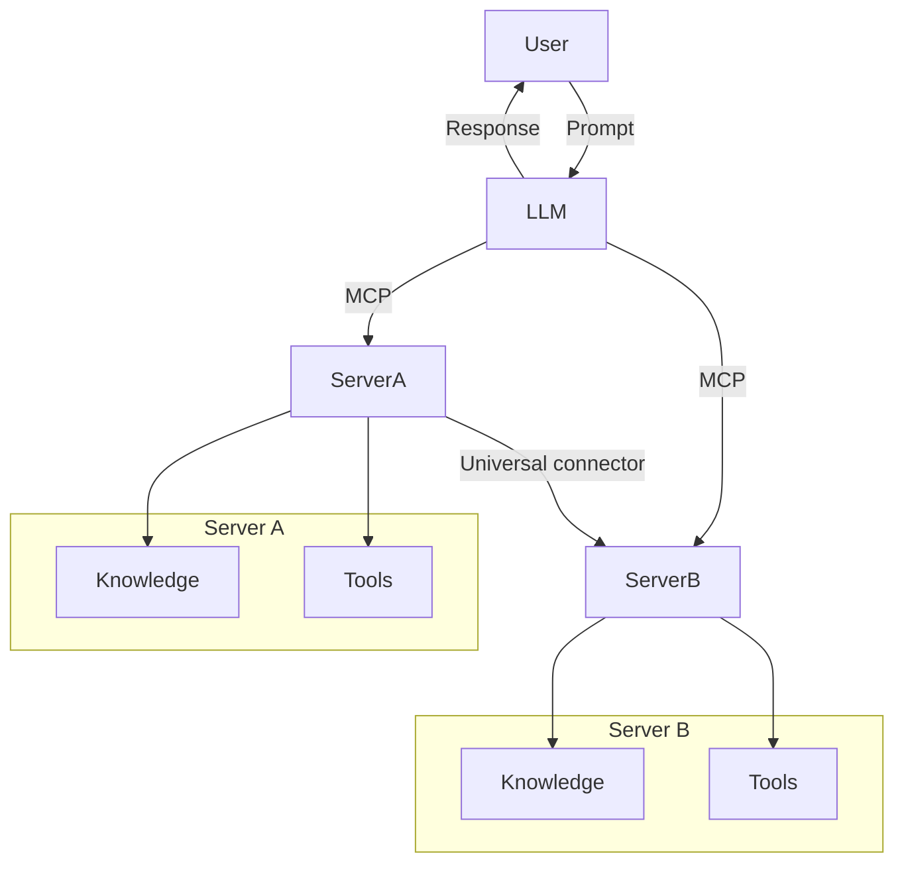

<!--
CO_OP_TRANSLATOR_METADATA:
{
  "original_hash": "cf84f987e1b771d2201408e110dfd2db",
  "translation_date": "2025-05-20T16:38:45+00:00",
  "source_file": "00-Introduction/README.md",
  "language_code": "ne"
}
-->
# Model Context Protocol (MCP) परिचय: किन यो स्केलेबल AI अनुप्रयोगहरूका लागि महत्त्वपूर्ण छ

जनरेटिभ AI अनुप्रयोगहरू ठूलो प्रगति हुन् किनभने तिनीहरूले प्रायः प्रयोगकर्तालाई प्राकृतिक भाषा प्रॉम्प्टमार्फत एपसँग अन्तरक्रिया गर्न दिन्छन्। यद्यपि, जति बढी समय र स्रोतहरू यस्ता एपहरूमा लगानी गरिन्छ, तपाईंले सुनिश्चित गर्न चाहनुहुन्छ कि तपाईंले सजिलैसँग कार्यक्षमताहरू र स्रोतहरू एकीकृत गर्न सक्नुहुन्छ जसले विस्तार गर्न सजिलो होस्, तपाईंको एपले एक भन्दा बढी मोडेलहरू प्रयोग गर्न सक्छ र तिनीहरूको जटिलतालाई सम्हाल्न सक्छ। संक्षेपमा, जनरेटिभ AI एपहरू सुरुमा बनाउनु सजिलो छ तर जति बढ्छ र जटिल हुन्छ, तपाईंले वास्तुकला परिभाषित गर्न थाल्नुपर्छ र सम्भवतः मानकमा भर पर्नुपर्ने हुन्छ ताकि तपाईंका एपहरू सुसंगत तरिकाले निर्माण गरिएका हुन्। यहीँ MCP आउँछ, सबै कुरा व्यवस्थित गर्न र मानक प्रदान गर्न।

---

## **🔍 Model Context Protocol (MCP) के हो?**

**Model Context Protocol (MCP)** एक **खुला, मानकीकृत इन्टरफेस** हो जसले ठूलो भाषा मोडेलहरू (LLMs) लाई बाह्य उपकरणहरू, APIहरू, र डाटा स्रोतहरूसँग सहजै अन्तरक्रिया गर्न अनुमति दिन्छ। यसले AI मोडेलको क्षमता तिनीहरूको प्रशिक्षण डाटाभन्दा बाहिर विस्तार गर्न एक समान वास्तुकला प्रदान गर्दछ, जसले स्मार्ट, स्केलेबल, र थप प्रतिक्रियाशील AI प्रणालीहरू सक्षम बनाउँछ।

---

## **🎯 AI मा मानकीकरण किन महत्त्वपूर्ण छ**

जसरी जनरेटिभ AI अनुप्रयोगहरू जटिल हुँदैछन्, त्यति नै आवश्यक छ कि तपाईले मानकहरू अपनाउनुहोस् जसले **स्केलेबिलिटी, विस्तारयोग्यता**, र **रखरखावयोग्यता** सुनिश्चित गर्दछ। MCP यी आवश्यकताहरूलाई सम्बोधन गर्छ:

- मोडेल-उपकरण एकीकरणलाई एकीकृत गर्दै
- कमजोर, एकपटकका अनुकूलन समाधानहरू घटाउँदै
- एउटै पारिस्थितिकी तन्त्रमा धेरै मोडेलहरू सहअस्तित्व गर्न अनुमति दिँदै

---

## **📚 सिकाइका उद्देश्यहरू**

यस लेखको अन्त्यसम्म, तपाईं सक्षम हुनुहुनेछ:

- **Model Context Protocol (MCP)** र यसको प्रयोगका केसहरू परिभाषित गर्न
- MCP ले मोडेल-देखि-उपकरण संचारलाई कसरी मानकीकृत गर्छ बुझ्न
- MCP वास्तुकलाका मुख्य घटकहरू पहिचान गर्न
- उद्यम र विकास सन्दर्भहरूमा MCP का वास्तविक-विश्व अनुप्रयोगहरू अन्वेषण गर्न

---

## **💡 Model Context Protocol (MCP) किन क्रान्तिकारी हो**

### **🔗 MCP ले AI अन्तरक्रियामा टुक्र्याइलाई समाधान गर्छ**

MCP अघि, मोडेलहरूलाई उपकरणहरूसँग एकीकृत गर्न आवश्यक थियो:

- प्रत्येक उपकरण-मोडेल जोडीका लागि अनुकूलन कोड
- प्रत्येक विक्रेता लागि गैर-मानक APIहरू
- अपडेटहरूले बारम्बार ब्रेक हुनु
- धेरै उपकरणहरूसँग खराब स्केलेबिलिटी

### **✅ MCP मानकीकरणका फाइदाहरू**

| **फाइदा**               | **विवरण**                                                                   |
|-------------------------|-----------------------------------------------------------------------------|
| अन्तरसञ्चालन क्षमता    | LLM हरू विभिन्न विक्रेताहरूका उपकरणहरूसँग सहजै काम गर्छन्                   |
| एकरूपता                | प्लेटफर्म र उपकरणहरूमा समान व्यवहार                                        |
| पुन: प्रयोगयोग्यता      | एक पटक बनेका उपकरणहरू परियोजनाहरू र प्रणालीहरूमा पुन: प्रयोग गर्न सकिन्छ     |
| विकास गति तीव्रता       | मानकीकृत, प्लग-एण्ड-प्ले इन्टरफेस प्रयोग गरेर विकास समय घटाउँछ              |

---

## **🧱 उच्च-स्तरीय MCP वास्तुकला अवलोकन**

MCP एक **क्लाइन्ट-सर्भर मोडेल** अनुसरण गर्छ, जहाँ:

- **MCP Hosts** AI मोडेलहरू चलाउँछन्
- **MCP Clients** अनुरोधहरू सुरु गर्छन्
- **MCP Servers** सन्दर्भ, उपकरणहरू, र क्षमता प्रदान गर्छन्

### **मुख्य घटकहरू:**

- **Resources** – मोडेलहरूको लागि स्थिर वा गतिशील डाटा  
- **Prompts** – मार्गदर्शन गरिएको उत्पादनका लागि पूर्वनिर्धारित कार्यप्रवाहहरू  
- **Tools** – खोज, गणना जस्ता कार्यान्वयनयोग्य कार्यहरू  
- **Sampling** – पुनरावृत्त अन्तरक्रियाहरू मार्फत एजेन्ट व्यवहार

---

## MCP Servers कसरी काम गर्छन्

MCP सर्भरहरू निम्न तरिकाले काम गर्छन्:

- **अनुरोध प्रवाह**:  
    1. MCP Client ले AI मोडेल चलाउने MCP Host मा अनुरोध पठाउँछ।  
    2. AI मोडेलले थाहा पाउँछ कि बाह्य उपकरण वा डाटाको आवश्यकता छ।  
    3. मोडेलले मानकीकृत प्रोटोकल प्रयोग गरी MCP Server सँग संवाद गर्छ।  

- **MCP Server कार्यक्षमता**:  
    - उपकरण रजिस्ट्री: उपलब्ध उपकरणहरू र तिनीहरूको क्षमता राख्छ।  
    - प्रमाणीकरण: उपकरण पहुँचका लागि अनुमति जाँच गर्छ।  
    - अनुरोध ह्यान्डलर: मोडेलबाट आउने उपकरण अनुरोधहरू प्रशोधन गर्छ।  
    - प्रतिक्रिया स्वरूपक: उपकरणको आउटपुट मोडेलले बुझ्ने ढाँचामा संरचित गर्छ।  

- **उपकरण कार्यान्वयन**:  
    - सर्भर अनुरोधहरू उपयुक्त बाह्य उपकरणहरूमा मार्गनिर्देशन गर्छ।  
    - उपकरणहरूले आफ्ना विशिष्ट कार्यहरू (खोज, गणना, डाटाबेस क्वेरीहरू आदि) सञ्चालन गर्छन्।  
    - परिणामहरू मोडेललाई एकरूप ढाँचामा फर्काइन्छ।  

- **प्रतिक्रिया पूर्णता**:  
    - AI मोडेलले उपकरण आउटपुटलाई आफ्नो प्रतिक्रियामा समावेश गर्छ।  
    - अन्तिम प्रतिक्रिया क्लाइन्ट एप्लिकेसनमा पठाइन्छ।  

## 👨‍💻 MCP Server कसरी बनाउने (उदाहरणहरू सहित)

MCP सर्भरहरूले तपाईंलाई LLM क्षमताहरू विस्तार गर्न डेटा र कार्यक्षमता प्रदान गरेर अनुमति दिन्छ।

परीक्षण गर्न तयार? यहाँ विभिन्न भाषाहरूमा सरल MCP सर्भर बनाउनका उदाहरणहरू छन्:

- **Python Example**: https://github.com/modelcontextprotocol/python-sdk

- **TypeScript Example**: https://github.com/modelcontextprotocol/typescript-sdk

- **Java Example**: https://github.com/modelcontextprotocol/java-sdk

- **C#/.NET Example**: https://github.com/modelcontextprotocol/csharp-sdk

## 🌍 MCP का वास्तविक-विश्व प्रयोगहरू

MCP ले AI क्षमताहरू विस्तार गरेर विभिन्न अनुप्रयोगहरू सक्षम बनाउँछ:

| **अनुप्रयोग**               | **विवरण**                                                               |
|-----------------------------|-------------------------------------------------------------------------|
| उद्यम डेटा एकीकरण          | LLM हरूलाई डेटाबेस, CRM, वा आन्तरिक उपकरणहरूसँग जडान गर्नु              |
| एजेन्टिक AI प्रणालीहरू      | उपकरण पहुँच र निर्णय-निर्माण कार्यप्रवाहहरूसहित स्वायत्त एजेन्ट सक्षम बनाउनु |
| बहु-मोडल अनुप्रयोगहरू       | एकै एकीकृत AI एपमा पाठ, छवि, र अडियो उपकरणहरू संयोजन गर्नु            |
| वास्तविक-समय डाटा एकीकरण   | AI अन्तरक्रियामा ताजा डाटा ल्याएर बढी सटीक र वर्तमान आउटपुट सुनिश्चित गर्नु |

### 🧠 MCP = AI अन्तरक्रियाका लागि सार्वभौमिक मानक

Model Context Protocol (MCP) AI अन्तरक्रियाका लागि सार्वभौमिक मानकको रूपमा कार्य गर्दछ, जसरी USB-C ले उपकरणहरूको भौतिक जडानहरू मानकीकृत गर्‍यो। AI संसारमा, MCP ले एक समान इन्टरफेस प्रदान गर्दछ, जसले मोडेलहरू (क्लाइन्टहरू) लाई बाह्य उपकरण र डाटा प्रदायकहरू (सर्भरहरू) सँग सहजै एकीकृत हुन दिन्छ। यसले प्रत्येक API वा डाटा स्रोतका लागि विभिन्न, अनुकूलन प्रोटोकलहरूको आवश्यकता हटाउँछ।

MCP अन्तर्गत, MCP-अनुकूल उपकरण (जसलाई MCP सर्भर भनिन्छ) एक एकीकृत मानक पछ्याउँछ। यी सर्भरहरूले आफूसँग भएका उपकरण वा क्रियाहरू सूचीबद्ध गर्न सक्छन् र AI एजेन्टले अनुरोध गर्दा ती क्रियाहरू सञ्चालन गर्छन्। MCP समर्थन गर्ने AI एजेन्ट प्लेटफर्महरूले सर्भरहरूबाट उपलब्ध उपकरणहरू पत्ता लगाउन र यस मानक प्रोटोकलमार्फत तिनीहरूलाई कल गर्न सक्षम हुन्छन्।

### 💡 ज्ञान पहुँच सहज बनाउँछ

उपकरणहरू मात्र नभई, MCP ज्ञान पहुँचलाई पनि सहज बनाउँछ। यसले अनुप्रयोगहरूलाई ठूलो भाषा मोडेलहरूलाई (LLMs) विभिन्न डाटा स्रोतहरूसँग जोडेर सन्दर्भ प्रदान गर्न सक्षम बनाउँछ। उदाहरणका लागि, एउटा MCP सर्भर कम्पनीको कागजात भण्डार प्रतिनिधित्व गर्न सक्छ, जसले एजेन्टहरूलाई आवश्यक जानकारी मागमा ल्याउन अनुमति दिन्छ। अर्को सर्भरले इमेल पठाउने वा रेकर्ड अपडेट गर्ने जस्ता विशिष्ट कार्यहरू सम्हाल्न सक्छ। एजेन्टको दृष्टिकोणबाट, यी सबै उपकरणहरू हुन् — केही उपकरणहरूले डाटा (ज्ञान सन्दर्भ) फर्काउँछन् भने केहीले कार्यहरू सम्पन्न गर्छन्। MCP दुबैलाई प्रभावकारी रूपमा व्यवस्थापन गर्छ।

एजेन्टले MCP सर्भरसँग जडान गर्दा स्वचालित रूपमा सर्भरको उपलब्ध क्षमता र पहुँचयोग्य डाटालाई मानक ढाँचाबाट सिक्छ। यस मानकीकरणले गतिशील उपकरण उपलब्धता सक्षम बनाउँछ। उदाहरणका लागि, एजेन्टको प्रणालीमा नयाँ MCP सर्भर थप्दा त्यसका कार्यहरू तुरुन्त प्रयोग गर्न सकिन्छ, एजेन्टका निर्देशनहरूमा थप अनुकूलन आवश्यक पर्दैन।

यो सरल एकीकरण मेरमेड डायग्राममा देखाइएको प्रवाहसँग मेल खान्छ, जहाँ सर्भरहरूले उपकरण र ज्ञान दुवै प्रदान गर्छन्, प्रणालीहरू बीच सहज सहकार्य सुनिश्चित गर्दै।

### 👉 उदाहरण: स्केलेबल एजेन्ट समाधान

## 🔐 MCP का व्यावहारिक फाइदाहरू

MCP प्रयोग गर्दा यी व्यावहारिक फाइदाहरू छन्:

- **ताजा जानकारी**: मोडेलहरूले आफ्ना प्रशिक्षण डाटाभन्दा बाहिर अद्यावधिक जानकारी पहुँच गर्न सक्छन्
- **क्षमता विस्तार**: मोडेलहरूले उनीहरूलाई तालिम नदिइएको कार्यहरूका लागि विशेष उपकरणहरू प्रयोग गर्न सक्छन्
- **गलत सूचना कम**: बाह्य डाटा स्रोतहरूले तथ्यात्मक आधार प्रदान गर्छन्
- **गोपनीयता**: संवेदनशील डाटा सुरक्षित वातावरणमा रहन सक्छ, प्रॉम्प्टहरूमा समावेश नगरिकन

## 📌 मुख्य बुँदाहरू

MCP प्रयोग गर्दा ध्यान दिनुपर्ने मुख्य बुँदाहरू:

- **MCP** ले AI मोडेलहरूको उपकरण र डाटासँग अन्तरक्रिया कसरी गर्ने मानकीकृत गर्छ
- **विस्तारयोग्यता, एकरूपता, र अन्तरसञ्चालनता** प्रवर्द्धन गर्छ
- MCP ले **विकास समय घटाउन, विश्वसनीयता सुधार्न, र मोडेल क्षमताहरू विस्तार गर्न** मद्दत गर्छ
- क्लाइन्ट-सर्भर वास्तुकलाले **लचिलो, विस्तारयोग्य AI अनुप्रयोगहरू सक्षम बनाउँछ**

## 🧠 अभ्यास

तपाईंले बनाउन चाहनुभएको AI अनुप्रयोगबारे सोच्नुहोस्।

- कुन **बाह्य उपकरण वा डाटा** ले यसको क्षमता बढाउन सक्छ?
- MCP ले एकीकरणलाई कसरी **सरल र भरपर्दो** बनाउन सक्छ?

## थप स्रोतहरू

- [MCP GitHub Repository](https://github.com/modelcontextprotocol)

## के हुन्छ अर्को

अर्को: [Chapter 1: Core Concepts](/01-CoreConcepts/README.md)

**अस्वीकरण**:  
यो दस्तावेज AI अनुवाद सेवा [Co-op Translator](https://github.com/Azure/co-op-translator) प्रयोग गरी अनुवाद गरिएको हो। हामी शुद्धताको प्रयास गर्छौं, तर कृपया ध्यान दिनुहोस् कि स्वचालित अनुवादमा त्रुटि वा अशुद्धता हुनसक्छ। मूल दस्तावेज यसको स्वदेशी भाषामा आधिकारिक स्रोत मानिनु पर्छ। महत्वपूर्ण जानकारीको लागि व्यावसायिक मानव अनुवाद सिफारिस गरिन्छ। यस अनुवादको प्रयोगबाट उत्पन्न हुने कुनै पनि गलतफहमी वा गलत व्याख्याको लागि हामी जिम्मेवार छैनौं।