<!--
CO_OP_TRANSLATOR_METADATA:
{
  "original_hash": "25a94c681cf43612ff394d8cf78a74de",
  "translation_date": "2025-05-27T16:00:55+00:00",
  "source_file": "00-Introduction/README.md",
  "language_code": "ne"
}
-->
# Model Context Protocol (MCP) परिचय: स्केलेबल AI एप्लिकेशनहरूका लागि यसको महत्त्व

जनरेटिभ AI एप्लिकेशनहरू ठूलो प्रगति हुन् किनभने तिनीहरूले प्रायः प्रयोगकर्तालाई प्राकृतिक भाषा प्रॉम्प्टहरू मार्फत एपसँग अन्तरक्रिया गर्न अनुमति दिन्छन्। तर, जब यस्ता एपहरूमा थप समय र स्रोतहरू लगानी गरिन्छ, तब तपाईंले सुनिश्चित गर्न चाहनुहुन्छ कि तपाईंले सजिलैसँग कार्यक्षमताहरू र स्रोतहरू एकीकृत गर्न सक्नुहुन्छ जसले विस्तार गर्न सजिलो होस्, तपाईंको एपले एक भन्दा बढी मोडेलहरूलाई समर्थन गर्न सकोस्, र विभिन्न मोडेल जटिलताहरूलाई व्यवस्थापन गर्न सकोस्। संक्षेपमा, जन AI एपहरू सुरुमा बनाउन सजिलो हुन्छ, तर जब तिनीहरू बढ्छन् र जटिल हुन्छन्, तब तपाईंले वास्तुकला परिभाषित गर्न थाल्नुपर्छ र सम्भवतया एक मापदण्डमा भर पर्नुपर्ने हुन्छ जसले सुनिश्चित गर्छ कि तपाईंका एपहरू एकसमान तरिकाले निर्माण हुन्छन्। यही ठाउँमा MCP आउँछ, जसले कुराहरू व्यवस्थित गर्छ र मापदण्ड प्रदान गर्छ।

---

## **🔍 Model Context Protocol (MCP) के हो?**

**Model Context Protocol (MCP)** एक **खुला, मानकीकृत इन्टरफेस** हो जसले ठूला भाषा मोडेलहरू (LLMs) लाई बाह्य उपकरणहरू, API हरू, र डेटा स्रोतहरूसँग सहजै अन्तरक्रिया गर्न सक्षम बनाउँछ। यसले AI मोडेलको कार्यक्षमता तिनीहरूको प्रशिक्षण डाटाभन्दा बाहिर विस्तार गर्न स्थिर वास्तुकला प्रदान गर्छ, जसले स्मार्ट, स्केलेबल, र बढी प्रतिक्रियाशील AI प्रणालीहरू बनाउन सहयोग गर्छ।

---

## **🎯 AI मा मानकीकरण किन आवश्यक छ**

जब जनरेटिभ AI एप्लिकेशनहरू थप जटिल हुन्छन्, तब त्यस्ता मापदण्डहरू अपनाउनु आवश्यक हुन्छ जसले **स्केलेबिलिटी, विस्तारयोग्यता**, र **रखरखाव** सुनिश्चित गर्छ। MCP ले यी आवश्यकताहरू पूरा गर्छ:

- मोडेल-उपकरण एकीकरणहरूलाई एकीकृत गर्दै
- कमजोर, एकपटक मात्र चल्ने अनुकूल समाधानहरू घटाउँदै
- एउटै पारिस्थितिकी तन्त्रमा बहु मोडेलहरूलाई सहअस्तित्व गर्न अनुमति दिँदै

---

## **📚 सिकाइ लक्ष्यहरू**

यस लेखको अन्त्यसम्म तपाईं सक्षम हुनुहुनेछ:

- **Model Context Protocol (MCP)** र यसको प्रयोगका केसहरू परिभाषित गर्न
- MCP कसरी मोडेल-देखि-उपकरण सञ्चारलाई मानकीकृत गर्छ बुझ्न
- MCP वास्तुकलाका मुख्य कम्पोनेन्टहरू पहिचान गर्न
- उद्यम र विकास सन्दर्भमा MCP का वास्तविक प्रयोगहरू अन्वेषण गर्न

---

## **💡 Model Context Protocol (MCP) किन क्रान्तिकारी छ**

### **🔗 MCP ले AI अन्तरक्रियामा टुक्रावलाई समाधान गर्छ**

MCP अघि, मोडेलहरूलाई उपकरणहरूसँग एकीकृत गर्न आवश्यक थियो:

- प्रत्येक उपकरण-मोडेल जोडीका लागि कस्टम कोड
- प्रत्येक विक्रेता का लागि गैर-मानकीकृत API हरू
- अपडेटहरूका कारण बारम्बार ब्रेकहरू
- धेरै उपकरणहरू हुँदा खराब स्केलेबिलिटी

### **✅ MCP मानकीकरणका फाइदाहरू**

| **फाइदा**               | **विवरण**                                                                   |
|-------------------------|-----------------------------------------------------------------------------|
| अन्तरसञ्चालनीयता       | LLM हरू विभिन्न विक्रेताहरूका उपकरणहरूसँग सहजै काम गर्छन्                 |
| स्थिरता                 | प्लेटफर्म र उपकरणहरूमा एकरूप व्यवहार                                        |
| पुन: प्रयोगयोग्यता      | एक पटक बनाइएका उपकरणहरू परियोजना र प्रणालीहरूमा पुन: प्रयोग गर्न सकिन्छ      |
| विकास तीव्रता           | मानकीकृत, प्लग-एण्ड-प्ले इन्टरफेसहरू प्रयोग गरेर विकास समय घटाउँछ          |

---

## **🧱 उच्च-स्तरीय MCP वास्तुकला अवलोकन**

MCP ले **क्लाइन्ट-सर्भर मोडेल** अनुसरण गर्छ, जहाँ:

- **MCP Hosts** AI मोडेलहरू चलाउँछन्
- **MCP Clients** अनुरोधहरू सुरु गर्छन्
- **MCP Servers** सन्दर्भ, उपकरणहरू, र क्षमताहरू प्रदान गर्छन्

### **मुख्य कम्पोनेन्टहरू:**

- **स्रोतहरू** – मोडेलहरूको लागि स्थिर वा गतिशील डाटा  
- **प्रॉम्प्टहरू** – मार्गदर्शन गरिएको सिर्जनाका लागि पूर्वनिर्धारित कार्यप्रवाहहरू  
- **उपकरणहरू** – खोज, गणना जस्ता कार्यहरू गर्ने कार्यान्वयनयोग्य फंक्शनहरू  
- **साम्प्लिंग** – पुनरावृत्त अन्तरक्रियाहरू मार्फत एजेन्ट व्यवहार

---

## MCP सर्भरहरू कसरी काम गर्छन्

MCP सर्भरहरू यसरी काम गर्छन्:

- **अनुरोध प्रवाह**:  
    1. MCP Client ले MCP Host मा चलिरहेको AI मोडेललाई अनुरोध पठाउँछ।  
    2. AI मोडेलले बाह्य उपकरण वा डाटाको आवश्यकता भएमा चिन्ह लगाउँछ।  
    3. मोडेलले मानकीकृत प्रोटोकल प्रयोग गरेर MCP Server सँग संवाद गर्छ।  

- **MCP Server कार्यक्षमता**:  
    - उपकरण रजिष्ट्रि: उपलब्ध उपकरणहरू र तिनका क्षमताहरूको सूची राख्छ।  
    - प्रमाणीकरण: उपकरण पहुँचका लागि अनुमति जाँच गर्छ।  
    - अनुरोध ह्यान्डलर: मोडेलबाट आउने उपकरण अनुरोधहरू प्रक्रिया गर्छ।  
    - प्रतिक्रिया फर्म्याटर: उपकरण आउटपुटलाई मोडेलले बुझ्ने स्वरूपमा तयार पार्छ।  

- **उपकरण कार्यान्वयन**:  
    - सर्भर अनुरोधहरू उपयुक्त बाह्य उपकरणहरूमा मार्गनिर्देशन गर्छ।  
    - उपकरणहरूले आफ्नो विशेष कार्यहरू (खोज, गणना, डाटाबेस क्वेरी आदि) सञ्चालन गर्छन्।  
    - परिणामहरू एकसमान स्वरूपमा मोडेललाई फर्काइन्छ।  

- **प्रतिक्रिया पूरा गर्ने**:  
    - AI मोडेलले उपकरण आउटपुटलाई आफ्नो प्रतिक्रियामा समावेश गर्छ।  
    - अन्तिम प्रतिक्रिया क्लाइन्ट एप्लिकेशनमा पठाइन्छ।  

## 👨‍💻 MCP सर्भर कसरी बनाउने (उदाहरणसहित)

MCP सर्भरहरूले LLM क्षमताहरूलाई डाटा र कार्यक्षमता प्रदान गरेर विस्तार गर्न अनुमति दिन्छ।

परीक्षण गर्न तयार हुनुहुन्छ? विभिन्न भाषाहरूमा साधारण MCP सर्भर बनाउनका उदाहरणहरू:

- **Python उदाहरण**: https://github.com/modelcontextprotocol/python-sdk

- **TypeScript उदाहरण**: https://github.com/modelcontextprotocol/typescript-sdk

- **Java उदाहरण**: https://github.com/modelcontextprotocol/java-sdk

- **C#/.NET उदाहरण**: https://github.com/modelcontextprotocol/csharp-sdk

## 🌍 MCP का वास्तविक प्रयोग केसहरू

MCP ले AI क्षमताहरू विस्तार गरेर विभिन्न प्रकारका अनुप्रयोगहरू सक्षम बनाउँछ:

| **अनुप्रयोग**              | **विवरण**                                                                 |
|----------------------------|---------------------------------------------------------------------------|
| उद्यम डाटा एकीकरण         | LLM हरूलाई डाटाबेस, CRM, वा आन्तरिक उपकरणहरूसँग जडान गर्ने                   |
| एजेन्टिक AI प्रणालीहरू    | उपकरण पहुँच र निर्णय-निर्माण कार्यप्रवाहसहित स्वतन्त्र एजेन्टहरू सक्षम बनाउने |
| बहु-मोडल अनुप्रयोगहरू    | एउटै एकीकृत AI एपमा टेक्स्ट, छवि, र अडियो उपकरणहरू संयोजन गर्ने             |
| वास्तविक-समय डाटा एकीकरण | AI अन्तरक्रियामा जीवित डाटा ल्याएर बढी सही र वर्तमान आउटपुटहरू प्रदान गर्ने   |

### 🧠 MCP = AI अन्तरक्रियाका लागि सार्वभौम मापदण्ड

Model Context Protocol (MCP) AI अन्तरक्रियाका लागि सार्वभौम मापदण्डको रूपमा काम गर्छ, जस्तै USB-C ले उपकरणहरूको भौतिक जडानलाई मानकीकृत गर्‍यो। AI को संसारमा, MCP ले एकसमान इन्टरफेस प्रदान गर्छ, जसले मोडेलहरू (क्लाइन्टहरू) लाई बाह्य उपकरणहरू र डाटा प्रदायकहरू (सर्भरहरू) सँग सहजै एकीकृत हुन दिन्छ। यसले प्रत्येक API वा डाटा स्रोतका लागि फरक-फरक कस्टम प्रोटोकलहरूको आवश्यकता हटाउँछ।

MCP अन्तर्गत, MCP-संगत उपकरण (जसलाई MCP सर्भर भनिन्छ) एक एकीकृत मापदण्ड पालना गर्छ। यी सर्भरहरूले आफूसँग भएका उपकरण वा क्रियाहरू सूचीबद्ध गर्न सक्छन् र AI एजेन्टले अनुरोध गर्दा ती क्रियाहरू कार्यान्वयन गर्छन्। MCP समर्थित AI एजेन्ट प्लेटफर्महरूले सर्भरहरूबाट उपलब्ध उपकरणहरू पत्ता लगाउन र यो मानकीकृत प्रोटोकल मार्फत तिनीहरूलाई कल गर्न सक्षम हुन्छन्।

### 💡 ज्ञान पहुँच सजिलो बनाउँछ

उपकरणहरू प्रदान गर्नुका साथै, MCP ले ज्ञान पहुँचलाई पनि सजिलो बनाउँछ। यसले एप्लिकेशनहरूलाई ठूला भाषा मोडेलहरूलाई (LLMs) विभिन्न डेटा स्रोतहरूसँग जोडेर सन्दर्भ प्रदान गर्न सक्षम बनाउँछ। उदाहरणका लागि, एउटा MCP सर्भर कम्पनीको दस्तावेज भण्डार प्रतिनिधित्व गर्न सक्छ, जसले एजेन्टहरूलाई आवश्यक जानकारी माग गर्दा फिर्ता ल्याउन अनुमति दिन्छ। अर्को सर्भरले इमेल पठाउने वा रेकर्ड अपडेट गर्ने जस्ता विशिष्ट कार्यहरू सम्हाल्न सक्छ। एजेन्टको दृष्टिले यी सबै केवल प्रयोग गर्न सकिने उपकरणहरू हुन् — केही उपकरणले डाटा (ज्ञान सन्दर्भ) फर्काउँछन् भने केहीले कार्यहरू गर्छन्। MCP ले दुवैलाई कुशलतापूर्वक व्यवस्थापन गर्छ।

एजेन्टले MCP सर्भरमा जडान गर्दा स्वचालित रूपमा सर्भरका उपलब्ध क्षमताहरू र पहुँचयोग्य डाटालाई मानकीकृत स्वरूपमा सिक्छ। यस मानकीकरणले गतिशील उपकरण उपलब्धता सक्षम पार्छ। उदाहरणका लागि, एजेन्टको प्रणालीमा नयाँ MCP सर्भर थप्दा त्यसका कार्यहरू तुरुन्तै प्रयोग गर्न सकिन्छ, एजेन्टका निर्देशनहरूमा थप अनुकूलन आवश्यक नपर्ने।

यो सहज एकीकरण मर्मेड डायग्राममा देखाइएको प्रवाहसँग मेल खान्छ, जहाँ सर्भरहरूले उपकरण र ज्ञान दुवै प्रदान गर्छन्, प्रणालीहरू बीच निर्बाध सहकार्य सुनिश्चित गर्दै।

### 👉 उदाहरण: स्केलेबल एजेन्ट समाधान

### 🔄 क्लाइन्ट-साइड LLM एकीकरणसहित उन्नत MCP परिदृश्यहरू

मूल MCP वास्तुकलाभन्दा बाहिर, त्यहाँ उन्नत परिदृश्यहरू छन् जहाँ क्लाइन्ट र सर्भर दुवैमा LLM हुन्छन्, जसले थप परिष्कृत अन्तरक्रियाहरू सक्षम पार्छ:

```mermaid
sequenceDiagram
    autonumber
    actor User as 👤 User
    participant ClientApp as 🖥️ Client App
    participant ClientLLM as 🧠 Client LLM
    participant Server1 as 🔧 MCP Server 1
    participant Server2 as 📚 MCP Server 2
    participant ServerLLM as 🤖 Server LLM
    
    %% Discovery Phase
    rect rgb(220, 240, 255)
        Note over ClientApp, Server2: TOOL DISCOVERY PHASE
        ClientApp->>+Server1: Request available tools/resources
        Server1-->>-ClientApp: Return tool list (JSON)
        ClientApp->>+Server2: Request available tools/resources
        Server2-->>-ClientApp: Return tool list (JSON)
        Note right of ClientApp: Store combined tool<br/>catalog locally
    end
    
    %% User Interaction
    rect rgb(255, 240, 220)
        Note over User, ClientLLM: USER INTERACTION PHASE
        User->>+ClientApp: Enter natural language prompt
        ClientApp->>+ClientLLM: Forward prompt + tool catalog
        ClientLLM->>-ClientLLM: Analyze prompt & select tools
    end
    
    %% Scenario A: Direct Tool Calling
    alt Direct Tool Calling
        rect rgb(220, 255, 220)
            Note over ClientApp, Server1: SCENARIO A: DIRECT TOOL CALLING
            ClientLLM->>+ClientApp: Request tool execution
            ClientApp->>+Server1: Execute specific tool
            Server1-->>-ClientApp: Return results
            ClientApp->>+ClientLLM: Process results
            ClientLLM-->>-ClientApp: Generate response
            ClientApp-->>-User: Display final answer
        end
    
    %% Scenario B: Feature Negotiation (VS Code style)
    else Feature Negotiation (VS Code style)
        rect rgb(255, 220, 220)
            Note over ClientApp, ServerLLM: SCENARIO B: FEATURE NEGOTIATION
            ClientLLM->>+ClientApp: Identify needed capabilities
            ClientApp->>+Server2: Negotiate features/capabilities
            Server2->>+ServerLLM: Request additional context
            ServerLLM-->>-Server2: Provide context
            Server2-->>-ClientApp: Return available features
            ClientApp->>+Server2: Call negotiated tools
            Server2-->>-ClientApp: Return results
            ClientApp->>+ClientLLM: Process results
            ClientLLM-->>-ClientApp: Generate response
            ClientApp-->>-User: Display final answer
        end
    end
```

## 🔐 MCP का व्यावहारिक फाइदाहरू

MCP प्रयोग गर्दा हुने व्यावहारिक फाइदाहरू:

- **ताजगी**: मोडेलहरूले आफ्नो प्रशिक्षण डाटाभन्दा बाहिर ताजा जानकारी पहुँच गर्न सक्छन्  
- **क्षमता विस्तार**: मोडेलहरूले ती कार्यहरूका लागि विशेषज्ञ उपकरणहरू प्रयोग गर्न सक्छन् जुन तिनीहरूले प्रशिक्षणमा पाएका थिएनन्  
- **हलुसिनेसन कम**: बाह्य डाटा स्रोतहरूले तथ्यात्मक आधार प्रदान गर्छन्  
- **गोपनीयता**: संवेदनशील डाटा सुरक्षित वातावरणमा रहन्छ, प्रॉम्प्टहरूमा समावेश नहुने

## 📌 मुख्य बुँदाहरू

MCP प्रयोग गर्दा ध्यान दिनुपर्ने मुख्य कुरा:

- **MCP** ले AI मोडेलहरूलाई उपकरण र डाटासँग अन्तरक्रिया गर्ने तरिका मानकीकृत गर्छ  
- **विस्तारयोग्यता, स्थिरता, र अन्तरसञ्चालनीयता** प्रवर्द्धन गर्छ  
- MCP ले विकास समय घटाउन, विश्वसनीयता सुधार गर्न, र मोडेल क्षमताहरू विस्तार गर्न मद्दत गर्छ  
- क्लाइन्ट-सर्भर वास्तुकलाले लचिलो र विस्तारयोग्य AI एप्लिकेशनहरू सक्षम बनाउँछ

## 🧠 अभ्यास

तपाईंले बनाउन चाहनुभएको AI एप्लिकेशनबारे सोच्नुहोस्।

- कुन **बाह्य उपकरण वा डाटाले** यसको क्षमताहरू बढाउन सक्छ?  
- MCP ले एकीकरणलाई कसरी **सरल र भरपर्दो** बनाउन सक्छ?

## थप स्रोतहरू

- [MCP GitHub Repository](https://github.com/modelcontextprotocol)

## अर्को के छ

अर्को: [Chapter 1: Core Concepts](/01-CoreConcepts/README.md)

**अस्वीकरण**:  
यो दस्तावेज AI अनुवाद सेवा [Co-op Translator](https://github.com/Azure/co-op-translator) प्रयोग गरी अनुवाद गरिएको हो। हामी शुद्धताका लागि प्रयास गर्छौं, तर कृपया ध्यान दिनुहोस् कि स्वचालित अनुवादमा त्रुटिहरू वा असत्यताहरू हुनसक्छन्। मूल दस्तावेज यसको मूल भाषामा आधिकारिक स्रोत मानिनुपर्छ। महत्वपूर्ण जानकारीका लागि व्यावसायिक मानव अनुवाद सिफारिस गरिन्छ। यस अनुवादको प्रयोगबाट उत्पन्न कुनै पनि गलतफहमी वा गलत व्याख्याका लागि हामी जिम्मेवार छैनौं।