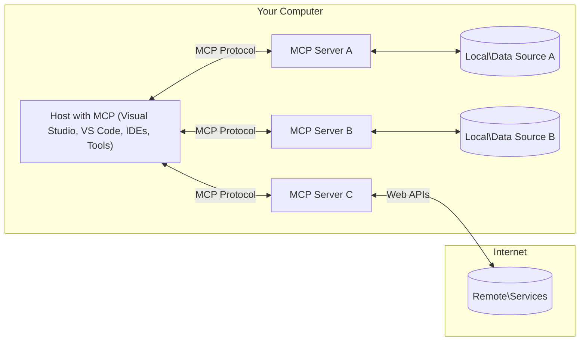

<!--
CO_OP_TRANSLATOR_METADATA:
{
  "original_hash": "0a6a7bcb289c024a91289e0444cb370b",
  "translation_date": "2025-08-18T15:57:40+00:00",
  "source_file": "01-CoreConcepts/README.md",
  "language_code": "ne"
}
-->
# MCP कोर अवधारणाहरू: एआई एकीकरणका लागि मोडेल कन्टेक्स्ट प्रोटोकलको मास्टरी

[](https://youtu.be/earDzWGtE84)

_(माथिको चित्रमा क्लिक गरेर यस पाठको भिडियो हेर्नुहोस्)_

[Model Context Protocol (MCP)](https://gi- **स्पष्ट प्रयोगकर्ता सहमति**: सबै डेटा पहुँच र कार्यहरू कार्यान्वयन अघि स्पष्ट प्रयोगकर्ता अनुमोदन आवश्यक छ। प्रयोगकर्ताहरूले कुन डेटा पहुँच गरिनेछ र कुन कार्यहरू गरिनेछन् भन्ने कुरा स्पष्ट रूपमा बुझ्नुपर्छ, अनुमति र अधिकारहरूमा विस्तृत नियन्त्रणको साथ।

- **डेटा गोपनीयता संरक्षण**: प्रयोगकर्ताको डेटा केवल स्पष्ट सहमतिसँग मात्र देखाउन सकिन्छ र सम्पूर्ण अन्तरक्रिया चक्रमा बलियो पहुँच नियन्त्रणद्वारा सुरक्षित गर्नुपर्छ। कार्यान्वयनहरूले अनधिकृत डेटा प्रसारण रोक्नुपर्छ र कडा गोपनीयता सीमाहरू कायम राख्नुपर्छ।

- **टूल कार्यान्वयन सुरक्षा**: प्रत्येक टूलको प्रयोग स्पष्ट प्रयोगकर्ता सहमति आवश्यक छ, टूलको कार्यक्षमता, प्यारामिटरहरू, र सम्भावित प्रभावको स्पष्ट बुझाइको साथ। अनपेक्षित, असुरक्षित, वा दुर्भावनापूर्ण टूल कार्यान्वयन रोक्न बलियो सुरक्षा सीमाहरू आवश्यक छ।

- **ट्रान्सपोर्ट लेयर सुरक्षा**: सबै सञ्चार च्यानलहरूले उपयुक्त इन्क्रिप्शन र प्रमाणीकरण संयन्त्रहरू प्रयोग गर्नुपर्छ। रिमोट कनेक्शनहरूले सुरक्षित ट्रान्सपोर्ट प्रोटोकलहरू र उचित प्रमाणपत्र व्यवस्थापन कार्यान्वयन गर्नुपर्छ।

#### कार्यान्वयन दिशानिर्देशहरू:

- **अनुमति व्यवस्थापन**: प्रयोगकर्ताहरूलाई कुन सर्भरहरू, टूलहरू, र स्रोतहरू पहुँचयोग्य छन् भन्ने नियन्त्रण गर्न अनुमति दिने विस्तृत अनुमति प्रणाली कार्यान्वयन गर्नुहोस्।
- **प्रमाणीकरण र अधिकार**: सुरक्षित प्रमाणीकरण विधिहरू (OAuth, API कुञ्जीहरू) उचित टोकन व्यवस्थापन र समाप्तिको साथ प्रयोग गर्नुहोस्।  
- **इनपुट मान्यता**: परिभाषित स्किमाहरू अनुसार सबै प्यारामिटरहरू र डेटा इनपुटहरू मान्यता दिनुहोस् ताकि इन्जेक्शन आक्रमणहरू रोक्न सकियोस्।
- **अडिट लगिङ**: सुरक्षा निगरानी र अनुपालनका लागि सबै कार्यहरूको व्यापक लगहरू कायम राख्नुहोस्।

## अवलोकन

यस पाठले मोडेल कन्टेक्स्ट प्रोटोकल (MCP) पारिस्थितिकी तन्त्र बनाउने मौलिक वास्तुकला र घटकहरूको अन्वेषण गर्दछ। तपाईं MCP अन्तरक्रियाहरूलाई शक्ति दिने क्लाइन्ट-सर्भर वास्तुकला, प्रमुख घटकहरू, र सञ्चार संयन्त्रहरूको बारेमा सिक्नुहुनेछ।

## प्रमुख सिकाइ उद्देश्यहरू

यस पाठको अन्त्यसम्ममा, तपाईं:

- MCP क्लाइन्ट-सर्भर वास्तुकलाको बुझाइ प्राप्त गर्नुहुनेछ।
- होस्टहरू, क्लाइन्टहरू, र सर्भरहरूको भूमिका र जिम्मेवारीहरू पहिचान गर्नुहुनेछ।
- MCP लाई लचिलो एकीकरण तह बनाउने कोर सुविधाहरूको विश्लेषण गर्नुहुनेछ।
- MCP पारिस्थितिकी तन्त्रभित्र जानकारी प्रवाह कसरी हुन्छ भन्ने कुरा सिक्नुहुनेछ।
- .NET, Java, Python, र JavaScript मा कोड उदाहरणहरू मार्फत व्यावहारिक जानकारी प्राप्त गर्नुहुनेछ।

## MCP वास्तुकला: गहिरो दृष्टिकोण

MCP पारिस्थितिकी तन्त्र क्लाइन्ट-सर्भर मोडेलमा निर्माण गरिएको छ। यो मोड्युलर संरचनाले एआई अनुप्रयोगहरूलाई उपकरणहरू, डेटाबेसहरू, API हरू, र सन्दर्भ स्रोतहरूसँग कुशलतापूर्वक अन्तरक्रिया गर्न अनुमति दिन्छ। यस वास्तुकलालाई यसको कोर घटकहरूमा विभाजन गरौं।

MCP को केन्द्रमा क्लाइन्ट-सर्भर वास्तुकला छ जहाँ होस्ट अनुप्रयोगले धेरै सर्भरहरूसँग जडान गर्न सक्छ:



- **MCP होस्टहरू**: VSCode, Claude Desktop, IDEs, वा MCP मार्फत डेटा पहुँच गर्न चाहने एआई उपकरणहरू जस्ता कार्यक्रमहरू।
- **MCP क्लाइन्टहरू**: सर्भरहरूसँग 1:1 जडान कायम राख्ने प्रोटोकल क्लाइन्टहरू।
- **MCP सर्भरहरू**: प्रत्येकले मानकीकृत मोडेल कन्टेक्स्ट प्रोटोकल मार्फत विशिष्ट क्षमताहरू उजागर गर्ने हल्का कार्यक्रमहरू।
- **स्थानीय डेटा स्रोतहरू**: MCP सर्भरहरूले सुरक्षित रूपमा पहुँच गर्न सक्ने तपाईंको कम्प्युटरका फाइलहरू, डेटाबेसहरू, र सेवाहरू।
- **रिमोट सेवाहरू**: API हरू मार्फत MCP सर्भरहरूले जडान गर्न सक्ने इन्टरनेटमा उपलब्ध बाह्य प्रणालीहरू।

MCP प्रोटोकल एक विकसित मानक हो जसले मिति-आधारित संस्करणिङ (YYYY-MM-DD ढाँचा) प्रयोग गर्दछ। हालको प्रोटोकल संस्करण **2025-06-18** हो। तपाईं [प्रोटोकल विशिष्टता](https://modelcontextprotocol.io/specification/2025-06-18/) मा पछिल्लो अपडेटहरू हेर्न सक्नुहुन्छ।

### 1. होस्टहरू

मोडेल कन्टेक्स्ट प्रोटोकल (MCP) मा, **होस्टहरू** एआई अनुप्रयोगहरू हुन् जसले प्रयोगकर्ताहरूलाई प्रोटोकलसँग अन्तरक्रिया गर्न प्राथमिक इन्टरफेसको रूपमा सेवा दिन्छ। होस्टहरूले धेरै MCP सर्भरहरूसँग जडानहरू समन्वय र व्यवस्थापन गर्छन् प्रत्येक सर्भर जडानको लागि समर्पित MCP क्लाइन्टहरू सिर्जना गरेर। होस्टहरूको उदाहरणहरूमा समावेश छन्:

- **एआई अनुप्रयोगहरू**: Claude Desktop, Visual Studio Code, Claude Code।
- **विकास वातावरणहरू**: MCP एकीकरणको साथ IDE हरू र कोड सम्पादकहरू।  
- **अनुकूलित अनुप्रयोगहरू**: उद्देश्य-निर्मित एआई एजेन्टहरू र उपकरणहरू।

**होस्टहरू** अनुप्रयोगहरू हुन् जसले एआई मोडेल अन्तरक्रियाहरू समन्वय गर्छन्। तिनीहरूले:

- **एआई मोडेलहरू समन्वय गर्नुहोस्**: प्रतिक्रियाहरू उत्पन्न गर्न वा एआई वर्कफ्लोहरू समन्वय गर्न LLM हरूसँग अन्तरक्रिया गर्नुहोस्।
- **क्लाइन्ट जडानहरू व्यवस्थापन गर्नुहोस्**: प्रत्येक MCP सर्भर जडानको लागि एक MCP क्लाइन्ट सिर्जना र कायम राख्नुहोस्।
- **प्रयोगकर्ता इन्टरफेस नियन्त्रण गर्नुहोस्**: वार्तालाप प्रवाह, प्रयोगकर्ता अन्तरक्रियाहरू, र प्रतिक्रिया प्रस्तुति ह्यान्डल गर्नुहोस्।  
- **सुरक्षा लागू गर्नुहोस्**: अनुमति, सुरक्षा सीमाहरू, र प्रमाणीकरण नियन्त्रण गर्नुहोस्।
- **प्रयोगकर्ता सहमति ह्यान्डल गर्नुहोस्**: डेटा साझेदारी र उपकरण कार्यान्वयनको लागि प्रयोगकर्ता अनुमोदन व्यवस्थापन गर्नुहोस्।

### 2. क्लाइन्टहरू

**क्लाइन्टहरू** आवश्यक घटकहरू हुन् जसले होस्टहरू र MCP सर्भरहरू बीच समर्पित एक-देखि-एक जडानहरू कायम राख्छन्। प्रत्येक MCP क्लाइन्ट होस्टद्वारा एक विशिष्ट MCP सर्भरसँग जडान गर्न सुरु गरिन्छ, व्यवस्थित र सुरक्षित सञ्चार च्यानलहरू सुनिश्चित गर्दै। धेरै क्लाइन्टहरूले होस्टहरूलाई एकै समयमा धेरै सर्भरहरूसँग जडान गर्न सक्षम बनाउँछन्।

**क्लाइन्टहरू** होस्ट अनुप्रयोग भित्र कनेक्टर घटकहरू हुन्। तिनीहरूले:

- **प्रोटोकल सञ्चार**: सर्भरहरूलाई JSON-RPC 2.0 अनुरोधहरू प्रेषित गर्नुहोस्।
- **क्षमता वार्ता**: सुरुवातको क्रममा सर्भरहरूसँग समर्थित सुविधाहरू र प्रोटोकल संस्करणहरू वार्ता गर्नुहोस्।
- **टूल कार्यान्वयन**: मोडेलहरूबाट टूल कार्यान्वयन अनुरोधहरू व्यवस्थापन गर्नुहोस् र प्रतिक्रियाहरू प्रक्रिया गर्नुहोस्।
- **रियल-टाइम अपडेटहरू**: सर्भरहरूबाट सूचनाहरू र रियल-टाइम अपडेटहरू ह्यान्डल गर्नुहोस्।
- **प्रतिक्रिया प्रशोधन**: प्रयोगकर्ताहरूलाई प्रदर्शनका लागि सर्भर प्रतिक्रियाहरू प्रक्रिया र ढाँचा बनाउनुहोस्।

### 3. सर्भरहरू

**सर्भरहरू** कार्यक्रमहरू हुन् जसले MCP क्लाइन्टहरूलाई सन्दर्भ, उपकरणहरू, र क्षमताहरू प्रदान गर्छन्। तिनीहरूले स्थानीय रूपमा (होस्टको समान मेसिनमा) वा टाढा (बाह्य प्लेटफर्महरूमा) कार्यान्वयन गर्न सक्छन्, र क्लाइन्ट अनुरोधहरू ह्यान्डल गर्न र संरचित प्रतिक्रियाहरू प्रदान गर्न जिम्मेवार छन्। सर्भरहरूले मानकीकृत मोडेल कन्टेक्स्ट प्रोटोकल मार्फत विशिष्ट कार्यक्षमता उजागर गर्छन्।

**सर्भरहरू** सेवाहरू हुन् जसले सन्दर्भ र क्षमताहरू प्रदान गर्छन्। तिनीहरूले:

- **फिचर दर्ता**: उपलब्ध प्रिमिटिभहरू (स्रोतहरू, प्रम्प्टहरू, उपकरणहरू) क्लाइन्टहरूमा दर्ता र उजागर गर्नुहोस्।
- **अनुरोध प्रशोधन**: क्लाइन्टहरूबाट टूल कलहरू, स्रोत अनुरोधहरू, र प्रम्प्ट अनुरोधहरू प्राप्त गर्नुहोस् र कार्यान्वयन गर्नुहोस्।
- **सन्दर्भ प्रावधान**: मोडेल प्रतिक्रियाहरू सुधार गर्न सन्दर्भ जानकारी र डेटा प्रदान गर्नुहोस्।
- **राज्य व्यवस्थापन**: सत्र अवस्था कायम राख्नुहोस् र आवश्यक परेमा राज्यपूर्ण अन्तरक्रियाहरू ह्यान्डल गर्नुहोस्।
- **रियल-टाइम सूचनाहरू**: जडान गरिएका क्लाइन्टहरूमा क्षमता परिवर्तनहरू र अपडेटहरूको बारेमा सूचनाहरू पठाउनुहोस्।

सर्भरहरू जो कोहीले विकास गर्न सक्छन् ताकि मोडेल क्षमताहरूलाई विशेष कार्यक्षमताको साथ विस्तार गर्न सकियोस्, र तिनीहरूले स्थानीय र टाढाको कार्यान्वयन परिदृश्यहरू समर्थन गर्छन्।

### 4. सर्भर प्रिमिटिभहरू

मोडेल कन्टेक्स्ट प्रोटोकल (MCP) मा सर्भरहरूले तीन कोर **प्रिमिटिभहरू** प्रदान गर्छन् जसले क्लाइन्टहरू, होस्टहरू, र भाषा मोडेलहरू बीचको समृद्ध अन्तरक्रियाहरूको लागि मौलिक निर्माण ब्लकहरू परिभाषित गर्छन्। यी प्रिमिटिभहरूले प्रोटोकल मार्फत उपलब्ध सन्दर्भ जानकारी र कार्यहरूको प्रकार निर्दिष्ट गर्छन्।

MCP सर्भरहरूले निम्न तीन कोर प्रिमिटिभहरूको कुनै पनि संयोजन उजागर गर्न सक्छन्:

#### स्रोतहरू

**स्रोतहरू** डेटा स्रोतहरू हुन् जसले एआई अनुप्रयोगहरूलाई सन्दर्भ जानकारी प्रदान गर्छन्। तिनीहरूले स्थिर वा गतिशील सामग्रीलाई प्रतिनिधित्व गर्छन् जसले मोडेलको बुझाइ र निर्णय-निर्माणलाई सुधार गर्न सक्छ:

- **सन्दर्भ डेटा**: एआई मोडेल उपभोगका लागि संरचित जानकारी र सन्दर्भ।
- **ज्ञान आधारहरू**: दस्तावेज भण्डारहरू, लेखहरू, म्यानुअलहरू, र अनुसन्धान पत्रहरू।
- **स्थानीय डेटा स्रोतहरू**: फाइलहरू, डेटाबेसहरू, र स्थानीय प्रणाली जानकारी।  
- **बाह्य डेटा**: API प्रतिक्रियाहरू, वेब सेवाहरू, र टाढाको प्रणाली डेटा।
- **गतिशील सामग्री**: बाह्य अवस्थाहरूको आधारमा अपडेट हुने वास्तविक समय डेटा।

स्रोतहरू URI हरूद्वारा पहिचान गरिन्छ र `resources/list` मार्फत खोजी र `resources/read` विधिहरू मार्फत पुनःप्राप्ति समर्थन गर्दछ:

```text
file://documents/project-spec.md
database://production/users/schema
api://weather/current
```

#### प्रम्प्टहरू

**प्रम्प्टहरू** पुन: प्रयोग गर्न मिल्ने टेम्प्लेटहरू हुन् जसले भाषा मोडेलहरूसँग अन्तरक्रियाहरू संरचना गर्न मद्दत गर्छन्। तिनीहरूले मानकीकृत अन्तरक्रिया ढाँचाहरू र टेम्प्लेट गरिएको वर्कफ्लोहरू प्रदान गर्छन्:

- **टेम्प्लेट-आधारित अन्तरक्रियाहरू**: पूर्व-संरचित सन्देशहरू र वार्तालाप सुरूवातकर्ताहरू।
- **वर्कफ्लो टेम्प्लेटहरू**: सामान्य कार्यहरू र अन्तरक्रियाहरूका लागि मानकीकृत अनुक्रमहरू।
- **थोरै-शट उदाहरणहरू**: मोडेल निर्देशनका लागि उदाहरण-आधारित टेम्प्लेटहरू।
- **सिस्टम प्रम्प्टहरू**: मोडेल व्यवहार र सन्दर्भ परिभाषित गर्ने आधारभूत प्रम्प्टहरू।
- **गतिशील टेम्प्लेटहरू**: विशिष्ट सन्दर्भहरूमा अनुकूलन हुने प्यारामिटरयुक्त प्रम्प्टहरू।

प्रम्प्टहरूले भेरिएबल प्रतिस्थापन समर्थन गर्छन् र `prompts/list` मार्फत खोजी र `prompts/get` मार्फत पुनःप्राप्ति गर्न सकिन्छ:

```markdown
Generate a {{task_type}} for {{product}} targeting {{audience}} with the following requirements: {{requirements}}
```

#### उपकरणहरू

**उपकरणहरू** कार्यान्वयन योग्य कार्यहरू हुन् जसलाई एआई मोडेलहरूले विशिष्ट कार्यहरू गर्न आह्वान गर्न सक्छन्। तिनीहरूले MCP पारिस्थितिकी तन्त्रका "क्रियाहरू" प्रतिनिधित्व गर्छन्, मोडेलहरूलाई बाह्य प्रणालीहरूसँग अन्तरक्रिया गर्न सक्षम बनाउँछन्:

- **कार्यान्वयन योग्य कार्यहरू**: विशिष्ट प्यारामिटरहरूसँग मोडेलहरूले आह्वान गर्न सक्ने छुट्टै कार्यहरू।
- **बाह्य प्रणाली एकीकरण**: API कलहरू, डेटाबेस क्वेरीहरू, फाइल कार्यहरू, गणनाहरू।
- **अद्वितीय पहिचान**: प्रत्येक उपकरणको विशिष्ट नाम, विवरण, र प्यारामिटर स्किमा हुन्छ।
- **संरचित I/O**: उपकरणहरूले मान्यता प्राप्त प्यारामिटरहरू स्वीकार गर्छन् र संरचित, टाइप गरिएको प्रतिक्रियाहरू फर्काउँछन्।
- **कार्य क्षमताहरू**: मोडेलहरूलाई वास्तविक-विश्व कार्यहरू प्रदर्शन गर्न र प्रत्यक्ष डेटा पुनःप्राप्ति गर्न सक्षम बनाउनुहोस्।

उपकरणहरू प्यारामिटर मान्यताका लागि JSON स्किमा संग परिभाषित गरिन्छ र `tools/list` मार्फत खोजी र `tools/call` मार्फत कार्यान्वयन गरिन्छ:

```typescript
server.tool(
  "search_products", 
  {
    query: z.string().describe("Search query for products"),
    category: z.string().optional().describe("Product category filter"),
    max_results: z.number().default(10).describe("Maximum results to return")
  }, 
  async (params) => {
    // Execute search and return structured results
    return await productService.search(params);
  }
);
```

## क्लाइन्ट प्रिमिटिभहरू

मोडेल कन्टेक्स्ट प्रोटोकल (MCP) मा, **क्लाइन्टहरू** प्रिमिटिभहरू उजागर गर्न सक्छन् जसले सर्भरहरूलाई होस्ट अनुप्रयोगबाट अतिरिक्त क्षमताहरू अनुरोध गर्न सक्षम बनाउँछ। यी क्लाइन्ट-साइड प्रिमिटिभहरूले समृद्ध, अधिक अन्तरक्रियात्मक सर्भर कार्यान्वयनहरूलाई समर्थन गर्छन् जसले एआई मोडेल क्षमताहरू र प्रयोगकर्ता अन्तरक्रियाहरू पहुँच गर्न सक्छ।

### स्याम्पलिङ

**स्याम्पलिङ** सर्भरहरूलाई क्लाइन्टको एआई अनुप्रयोगबाट भाषा मोडेल पूर्णता अनुरोध गर्न अनुमति दिन्छ। यस प्रिमिटिभले सर्भरहरूलाई आफ्नै मोडेल निर्भरताहरू समावेश नगरी LLM क्षमताहरू पहुँच गर्न सक्षम बनाउँछ:

- **मोडेल-स्वतन्त्र पहुँच**: सर्भरहरूले LLM SDK हरू समावेश नगरी पूर्णता अनुरोध गर्न सक्छन्।
- **सर्भर-आरम्भित एआई**: सर्भरहरूले क्लाइन्टको एआई मोडेल प्रयोग गरेर स्वतन्त्र रूपमा सामग्री उत्पन्न गर्न सक्षम बनाउँछ।
- **पुनरावर्ती LLM अन्तरक्रियाहरू**: जटिल परिदृश्यहरूलाई समर्थन गर्दछ जहाँ सर्भरहरूलाई प्रशोधनका लागि एआई सहयोग आवश्यक छ।
- **गतिशील सामग्री उत्पादन**: होस्टको मोडेल प्रयोग गरेर सन्दर्भ प्रतिक्रियाहरू सिर्जना गर्न सर्भरहरूलाई अनुमति दिन्छ।

स्याम्पलिङ `sampling/complete` विधि मार्फत सुरु गरिन्छ, जहाँ सर्भरहरूले क्लाइन्टहरूलाई पूर्णता अनुरोधहरू पठाउँछन्।

### जानकारी संकलन

**जानकारी संकलन** सर्भरहरूलाई क्लाइन्ट इन्टरफेस मार्फत प्रयोगकर्ताहरूबाट अतिरिक्त जानकारी वा पुष्टि अनुरोध गर्न सक्षम बनाउँछ:

- **प्रयोगकर्ता इनपुट अनुरोधहरू**: उपकरण कार्यान्वयनका लागि आवश्यक जानकारी अनुरोध गर्न सर्भरहरू सक्षम बनाउँछ।
- **पुष्टि संवादहरू**: संवेदनशील वा प्रभावकारी कार्यहरूको लागि प्रयोगकर्ता अनुमोदन अनुरोध गर्नुहोस्।
- **अन्तरक्रियात्मक वर्कफ्लोहरू**: सर्भरहरूलाई चरण-दर-चरण प्रयोगकर्ता अन्तरक्रियाहरू सिर्जना गर्न सक्षम बनाउनुहोस्।
- **गतिशील प्यारामिटर सङ्कलन**: उपकरण कार्यान्वयनको क्रममा हराएको वा वैकल्पिक प्यारामिटरहरू सङ्कलन गर्नुहोस्।

जानकारी संकलन अनुरोधहरू `elicitation/request` विधि प्रयोग गरेर क्लाइन्टको इन्टरफेस मार्फत प्रयोगकर्ता इनपुट सङ्कलन गर्न गरिन्छ।

### लगिङ

**लगिङ** सर्भरहरूलाई डिबगिङ, निगरानी, र सञ्चालन दृश्यताका लागि क्लाइन्टहरूमा संरचित लग सन्देशहरू पठाउन अनुमति दिन्छ:

- **डिबगिङ समर्थन**: सर्भरहरूलाई समस्या समाधानका लागि विस्तृत कार्यान्वयन लगहरू प्रदान गर्न सक्षम बनाउनुहोस्।
- **सञ्चालन निगरानी**: क्लाइन्टहरूमा स्थिति अपडेटहरू र प्रदर्शन मेट्रिक्स पठाउनुहोस्।
- **त्रुटि रिपोर्टिङ**: विस्तृत त्रुटि सन्दर्भ र निदान जानकारी प्रदान गर्नुहोस्।
- **अडिट ट्रेलहरू**: सर्भर कार्यहरू र निर्णयहरूको व्यापक लगहरू सिर्जना गर्नुहोस्।

लगिङ सन्देशहरू सर्भर कार्य
- **लाइफसाइकल व्यवस्थापन**: क्लाइन्ट र सर्भरबीच जडान सुरु गर्ने, क्षमता समन्वय गर्ने, र सत्र समाप्त गर्ने प्रक्रियाहरू व्यवस्थापन गर्छ  
- **सर्भर प्रिमिटिभ्स**: सर्भरहरूले उपकरण, स्रोतहरू, र प्रम्प्टहरू मार्फत मुख्य कार्यक्षमता प्रदान गर्न सक्षम बनाउँछ  
- **क्लाइन्ट प्रिमिटिभ्स**: सर्भरहरूले LLM बाट स्याम्पलिङ अनुरोध गर्न, प्रयोगकर्ताको इनपुट प्राप्त गर्न, र लग सन्देशहरू पठाउन सक्षम बनाउँछ  
- **रियल-टाइम सूचना**: पोलिङ बिना गतिशील अपडेटहरूको लागि असिन्क्रोनस सूचना समर्थन गर्दछ  

#### मुख्य विशेषताहरू:

- **प्रोटोकल संस्करण समन्वय**: मिति-आधारित संस्करण (YYYY-MM-DD) प्रयोग गरेर अनुकूलता सुनिश्चित गर्दछ  
- **क्षमता पत्ता लगाउने**: क्लाइन्ट र सर्भरले सुरुवातको क्रममा समर्थित सुविधाहरूको जानकारी आदानप्रदान गर्छन्  
- **स्टेटफुल सत्रहरू**: धेरै अन्तरक्रियाहरूमा सन्दर्भ निरन्तरताका लागि जडानको अवस्था कायम राख्छ  

### ट्रान्सपोर्ट लेयर

**ट्रान्सपोर्ट लेयर**ले MCP सहभागीहरूबीच सञ्चार च्यानलहरू, सन्देश फ्रेमिङ, र प्रमाणीकरण व्यवस्थापन गर्दछ:

#### समर्थित ट्रान्सपोर्ट संयन्त्रहरू:

1. **STDIO ट्रान्सपोर्ट**:
   - प्रत्यक्ष प्रक्रिया सञ्चारका लागि मानक इनपुट/आउटपुट स्ट्रिमहरू प्रयोग गर्दछ  
   - एउटै मेसिनमा स्थानीय प्रक्रियाहरूका लागि उपयुक्त, कुनै नेटवर्क ओभरहेड बिना  
   - प्रायः स्थानीय MCP सर्भर कार्यान्वयनहरूको लागि प्रयोग गरिन्छ  

2. **स्ट्रीमेबल HTTP ट्रान्सपोर्ट**:
   - क्लाइन्ट-देखि-सर्भर सन्देशहरूको लागि HTTP POST प्रयोग गर्दछ  
   - सर्भर-देखि-क्लाइन्ट स्ट्रिमिङको लागि वैकल्पिक Server-Sent Events (SSE)  
   - नेटवर्कहरूमा टाढाको सर्भरसँग सञ्चार सक्षम बनाउँछ  
   - मानक HTTP प्रमाणीकरण (बेयरर टोकन, API कुञ्जीहरू, अनुकूल हेडरहरू) समर्थन गर्दछ  
   - सुरक्षित टोकन-आधारित प्रमाणीकरणका लागि MCP ले OAuth सिफारिस गर्दछ  

#### ट्रान्सपोर्ट परतको अमूर्तता:

ट्रान्सपोर्ट लेयरले डाटा लेयरबाट सञ्चार विवरणहरू अमूर्त बनाउँछ, सबै ट्रान्सपोर्ट संयन्त्रहरूमा एउटै JSON-RPC 2.0 सन्देश ढाँचा सक्षम बनाउँछ। यस अमूर्तताले अनुप्रयोगहरूलाई स्थानीय र टाढाको सर्भरहरू बीच सहज रूपमा स्विच गर्न अनुमति दिन्छ।  

### सुरक्षा विचारहरू

MCP कार्यान्वयनहरूले सबै प्रोटोकल अपरेसनहरूमा सुरक्षित, भरपर्दो, र सुरक्षित अन्तरक्रियाहरू सुनिश्चित गर्न धेरै महत्त्वपूर्ण सुरक्षा सिद्धान्तहरू पालना गर्नुपर्छ:

- **प्रयोगकर्ताको सहमति र नियन्त्रण**: कुनै पनि डाटा पहुँच गर्नु अघि वा अपरेसनहरू प्रदर्शन गर्नु अघि प्रयोगकर्ताले स्पष्ट सहमति दिनुपर्छ। उनीहरूले साझा गरिने डाटा र स्वीकृत गरिएका कार्यहरूको स्पष्ट नियन्त्रण गर्नुपर्छ, गतिविधिहरू समीक्षा र अनुमोदन गर्न सहज प्रयोगकर्ता इन्टरफेसद्वारा समर्थित।  

- **डाटा गोपनीयता**: प्रयोगकर्ताको डाटा स्पष्ट सहमति बिना मात्र खुलासा गरिनुपर्छ र उपयुक्त पहुँच नियन्त्रणद्वारा सुरक्षित गरिनुपर्छ। MCP कार्यान्वयनहरूले अनधिकृत डाटा प्रसारणको विरुद्ध सुरक्षा गर्नुपर्छ र सबै अन्तरक्रियाहरूमा गोपनीयता कायम गर्नुपर्छ।  

- **उपकरण सुरक्षा**: कुनै पनि उपकरण प्रयोग गर्नु अघि स्पष्ट प्रयोगकर्ता सहमति आवश्यक छ। प्रयोगकर्ताहरूले प्रत्येक उपकरणको कार्यक्षमताको स्पष्ट समझ राख्नुपर्छ, र अनपेक्षित वा असुरक्षित उपकरण कार्यान्वयन रोक्न बलियो सुरक्षा सीमाहरू लागू गर्नुपर्छ।  

यी सुरक्षा सिद्धान्तहरूको पालना गरेर, MCP ले प्रयोगकर्ताको विश्वास, गोपनीयता, र सुरक्षा सुनिश्चित गर्दछ, जबकि शक्तिशाली AI एकीकरणहरू सक्षम बनाउँछ।  

## कोड उदाहरणहरू: मुख्य कम्पोनेन्टहरू

तल विभिन्न लोकप्रिय प्रोग्रामिङ भाषाहरूमा कोड उदाहरणहरू छन्, जसले मुख्य MCP सर्भर कम्पोनेन्टहरू र उपकरणहरू कार्यान्वयन गर्ने तरिका देखाउँछ।  

### .NET उदाहरण: उपकरणहरूसहित साधारण MCP सर्भर सिर्जना गर्नुहोस्

तलको .NET कोड उदाहरणले उपकरणहरू परिभाषित र दर्ता गर्ने, अनुरोधहरू ह्यान्डल गर्ने, र Model Context Protocol प्रयोग गरेर सर्भर जडान गर्ने तरिका देखाउँछ।  

```csharp
using System;
using System.Threading.Tasks;
using ModelContextProtocol.Server;
using ModelContextProtocol.Server.Transport;
using ModelContextProtocol.Server.Tools;

public class WeatherServer
{
    public static async Task Main(string[] args)
    {
        // Create an MCP server
        var server = new McpServer(
            name: "Weather MCP Server",
            version: "1.0.0"
        );
        
        // Register our custom weather tool
        server.AddTool<string, WeatherData>("weatherTool", 
            description: "Gets current weather for a location",
            execute: async (location) => {
                // Call weather API (simplified)
                var weatherData = await GetWeatherDataAsync(location);
                return weatherData;
            });
        
        // Connect the server using stdio transport
        var transport = new StdioServerTransport();
        await server.ConnectAsync(transport);
        
        Console.WriteLine("Weather MCP Server started");
        
        // Keep the server running until process is terminated
        await Task.Delay(-1);
    }
    
    private static async Task<WeatherData> GetWeatherDataAsync(string location)
    {
        // This would normally call a weather API
        // Simplified for demonstration
        await Task.Delay(100); // Simulate API call
        return new WeatherData { 
            Temperature = 72.5,
            Conditions = "Sunny",
            Location = location
        };
    }
}

public class WeatherData
{
    public double Temperature { get; set; }
    public string Conditions { get; set; }
    public string Location { get; set; }
}
```

### Java उदाहरण: MCP सर्भर कम्पोनेन्टहरू

यो उदाहरणले माथिको .NET उदाहरणमा जस्तै MCP सर्भर र उपकरण दर्ता प्रदर्शन गर्दछ, तर Java मा कार्यान्वयन गरिएको छ।  

```java
import io.modelcontextprotocol.server.McpServer;
import io.modelcontextprotocol.server.McpToolDefinition;
import io.modelcontextprotocol.server.transport.StdioServerTransport;
import io.modelcontextprotocol.server.tool.ToolExecutionContext;
import io.modelcontextprotocol.server.tool.ToolResponse;

public class WeatherMcpServer {
    public static void main(String[] args) throws Exception {
        // Create an MCP server
        McpServer server = McpServer.builder()
            .name("Weather MCP Server")
            .version("1.0.0")
            .build();
            
        // Register a weather tool
        server.registerTool(McpToolDefinition.builder("weatherTool")
            .description("Gets current weather for a location")
            .parameter("location", String.class)
            .execute((ToolExecutionContext ctx) -> {
                String location = ctx.getParameter("location", String.class);
                
                // Get weather data (simplified)
                WeatherData data = getWeatherData(location);
                
                // Return formatted response
                return ToolResponse.content(
                    String.format("Temperature: %.1f°F, Conditions: %s, Location: %s", 
                    data.getTemperature(), 
                    data.getConditions(), 
                    data.getLocation())
                );
            })
            .build());
        
        // Connect the server using stdio transport
        try (StdioServerTransport transport = new StdioServerTransport()) {
            server.connect(transport);
            System.out.println("Weather MCP Server started");
            // Keep server running until process is terminated
            Thread.currentThread().join();
        }
    }
    
    private static WeatherData getWeatherData(String location) {
        // Implementation would call a weather API
        // Simplified for example purposes
        return new WeatherData(72.5, "Sunny", location);
    }
}

class WeatherData {
    private double temperature;
    private String conditions;
    private String location;
    
    public WeatherData(double temperature, String conditions, String location) {
        this.temperature = temperature;
        this.conditions = conditions;
        this.location = location;
    }
    
    public double getTemperature() {
        return temperature;
    }
    
    public String getConditions() {
        return conditions;
    }
    
    public String getLocation() {
        return location;
    }
}
```

### Python उदाहरण: MCP सर्भर निर्माण

यस उदाहरणमा हामी Python मा MCP सर्भर निर्माण गर्ने तरिका देखाउँछौं। तपाईंलाई उपकरणहरू सिर्जना गर्ने दुई फरक तरिका पनि देखाइन्छ।  

```python
#!/usr/bin/env python3
import asyncio
from mcp.server.fastmcp import FastMCP
from mcp.server.transports.stdio import serve_stdio

# Create a FastMCP server
mcp = FastMCP(
    name="Weather MCP Server",
    version="1.0.0"
)

@mcp.tool()
def get_weather(location: str) -> dict:
    """Gets current weather for a location."""
    # This would normally call a weather API
    # Simplified for demonstration
    return {
        "temperature": 72.5,
        "conditions": "Sunny",
        "location": location
    }

# Alternative approach using a class
class WeatherTools:
    @mcp.tool()
    def forecast(self, location: str, days: int = 1) -> dict:
        """Gets weather forecast for a location for the specified number of days."""
        # This would normally call a weather API forecast endpoint
        # Simplified for demonstration
        return {
            "location": location,
            "forecast": [
                {"day": i+1, "temperature": 70 + i, "conditions": "Partly Cloudy"}
                for i in range(days)
            ]
        }

# Instantiate the class to register its tools
weather_tools = WeatherTools()

# Start the server using stdio transport
if __name__ == "__main__":
    asyncio.run(serve_stdio(mcp))
```

### JavaScript उदाहरण: MCP सर्भर सिर्जना गर्नुहोस्

यो उदाहरणले JavaScript मा MCP सर्भर सिर्जना गर्ने र दुईवटा मौसमसम्बन्धी उपकरणहरू दर्ता गर्ने तरिका देखाउँछ।  

```javascript
// Using the official Model Context Protocol SDK
import { McpServer } from "@modelcontextprotocol/sdk/server/mcp.js";
import { StdioServerTransport } from "@modelcontextprotocol/sdk/server/stdio.js";
import { z } from "zod"; // For parameter validation

// Create an MCP server
const server = new McpServer({
  name: "Weather MCP Server",
  version: "1.0.0"
});

// Define a weather tool
server.tool(
  "weatherTool",
  {
    location: z.string().describe("The location to get weather for")
  },
  async ({ location }) => {
    // This would normally call a weather API
    // Simplified for demonstration
    const weatherData = await getWeatherData(location);
    
    return {
      content: [
        { 
          type: "text", 
          text: `Temperature: ${weatherData.temperature}°F, Conditions: ${weatherData.conditions}, Location: ${weatherData.location}` 
        }
      ]
    };
  }
);

// Define a forecast tool
server.tool(
  "forecastTool",
  {
    location: z.string(),
    days: z.number().default(3).describe("Number of days for forecast")
  },
  async ({ location, days }) => {
    // This would normally call a weather API
    // Simplified for demonstration
    const forecast = await getForecastData(location, days);
    
    return {
      content: [
        { 
          type: "text", 
          text: `${days}-day forecast for ${location}: ${JSON.stringify(forecast)}` 
        }
      ]
    };
  }
);

// Helper functions
async function getWeatherData(location) {
  // Simulate API call
  return {
    temperature: 72.5,
    conditions: "Sunny",
    location: location
  };
}

async function getForecastData(location, days) {
  // Simulate API call
  return Array.from({ length: days }, (_, i) => ({
    day: i + 1,
    temperature: 70 + Math.floor(Math.random() * 10),
    conditions: i % 2 === 0 ? "Sunny" : "Partly Cloudy"
  }));
}

// Connect the server using stdio transport
const transport = new StdioServerTransport();
server.connect(transport).catch(console.error);

console.log("Weather MCP Server started");
```

यो JavaScript उदाहरणले सर्भरसँग जडान गर्ने, प्रम्प्ट पठाउने, र गरिएको कुनै पनि उपकरण कलहरू सहित प्रतिक्रिया प्रक्रिया गर्ने MCP क्लाइन्ट सिर्जना गर्ने तरिका प्रदर्शन गर्दछ।  

## सुरक्षा र अनुमति

MCP ले प्रोटोकलभरि सुरक्षा र अनुमति व्यवस्थापन गर्नका लागि धेरै बिल्ट-इन अवधारणाहरू र संयन्त्रहरू समावेश गर्दछ:

1. **उपकरण अनुमति नियन्त्रण**:  
   क्लाइन्टहरूले सत्रको क्रममा मोडेललाई कुन उपकरणहरू प्रयोग गर्न अनुमति छ भनेर निर्दिष्ट गर्न सक्छन्। यसले स्पष्ट रूपमा स्वीकृत उपकरणहरू मात्र पहुँचयोग्य हुने सुनिश्चित गर्दछ, अनपेक्षित वा असुरक्षित अपरेसनहरूको जोखिम घटाउँछ। अनुमति प्रयोगकर्ताको प्राथमिकता, संस्थागत नीतिहरू, वा अन्तरक्रियाको सन्दर्भको आधारमा गतिशील रूपमा कन्फिगर गर्न सकिन्छ।  

2. **प्रमाणीकरण**:  
   सर्भरहरूले उपकरणहरू, स्रोतहरू, वा संवेदनशील अपरेसनहरूमा पहुँच प्रदान गर्नु अघि प्रमाणीकरण आवश्यक हुन सक्छ। यसमा API कुञ्जीहरू, OAuth टोकनहरू, वा अन्य प्रमाणीकरण योजनाहरू समावेश हुन सक्छ। उचित प्रमाणीकरणले मात्र विश्वासपात्र क्लाइन्ट र प्रयोगकर्ताहरूले सर्भर-साइड क्षमताहरू प्रयोग गर्न सक्छन् भन्ने सुनिश्चित गर्दछ।  

3. **मान्यता**:  
   सबै उपकरण कार्यान्वयनहरूको लागि प्यारामिटर मान्यता लागू गरिन्छ। प्रत्येक उपकरणले यसको प्यारामिटरहरूको अपेक्षित प्रकार, ढाँचा, र बाधाहरू परिभाषित गर्दछ, र सर्भरले आउने अनुरोधहरूलाई तदनुसार मान्यता दिन्छ। यसले खराब संरचित वा दुर्भावनापूर्ण इनपुट उपकरण कार्यान्वयनमा पुग्नबाट रोक्छ र अपरेसनहरूको अखण्डता कायम राख्न मद्दत गर्दछ।  

4. **दर सीमितता**:  
   दुरुपयोग रोक्न र सर्भर स्रोतहरूको निष्पक्ष प्रयोग सुनिश्चित गर्न, MCP सर्भरहरूले उपकरण कलहरू र स्रोत पहुँचको लागि दर सीमितता कार्यान्वयन गर्न सक्छन्। दर सीमाहरू प्रति प्रयोगकर्ता, प्रति सत्र, वा विश्वव्यापी रूपमा लागू गर्न सकिन्छ, र सेवा अस्वीकार आक्रमणहरू वा अत्यधिक स्रोत खपतको विरुद्ध सुरक्षा गर्न मद्दत गर्दछ।  

यी संयन्त्रहरूको संयोजन गरेर, MCP ले भाषा मोडेलहरूलाई बाह्य उपकरणहरू र डाटा स्रोतहरूसँग एकीकृत गर्न सुरक्षित आधार प्रदान गर्दछ, जबकि प्रयोगकर्ता र विकासकर्ताहरूलाई पहुँच र प्रयोगमा सूक्ष्म नियन्त्रण दिन्छ।  

## प्रोटोकल सन्देशहरू र सञ्चार प्रवाह

MCP सञ्चारले होस्ट, क्लाइन्ट, र सर्भरहरू बीच स्पष्ट र भरपर्दो अन्तरक्रियाहरूलाई सहज बनाउन संरचित **JSON-RPC 2.0** सन्देशहरू प्रयोग गर्दछ। प्रोटोकलले विभिन्न प्रकारका अपरेसनहरूको लागि विशिष्ट सन्देश ढाँचाहरू परिभाषित गर्दछ:  

### मुख्य सन्देश प्रकारहरू:

#### **सुरुवात सन्देशहरू**
- **`initialize` अनुरोध**: जडान स्थापना गर्दछ र प्रोटोकल संस्करण र क्षमताहरू समन्वय गर्दछ  
- **`initialize` प्रतिक्रिया**: समर्थित सुविधाहरू र सर्भर जानकारी पुष्टि गर्दछ  
- **`notifications/initialized`**: सुरुवात पूरा भएको र सत्र तयार भएको संकेत गर्दछ  

#### **पत्ता लगाउने सन्देशहरू**
- **`tools/list` अनुरोध**: सर्भरबाट उपलब्ध उपकरणहरू पत्ता लगाउँछ  
- **`resources/list` अनुरोध**: उपलब्ध स्रोतहरू (डाटा स्रोतहरू) सूचीबद्ध गर्दछ  
- **`prompts/list` अनुरोध**: उपलब्ध प्रम्प्ट टेम्प्लेटहरू पुनःप्राप्त गर्दछ  

#### **कार्यान्वयन सन्देशहरू**  
- **`tools/call` अनुरोध**: प्रदान गरिएका प्यारामिटरहरूसँग विशिष्ट उपकरण कार्यान्वयन गर्दछ  
- **`resources/read` अनुरोध**: विशिष्ट स्रोतबाट सामग्री पुनःप्राप्त गर्दछ  
- **`prompts/get` अनुरोध**: वैकल्पिक प्यारामिटरहरूसहित प्रम्प्ट टेम्प्लेट पुनःप्राप्त गर्दछ  

#### **क्लाइन्ट-साइड सन्देशहरू**
- **`sampling/complete` अनुरोध**: सर्भरले क्लाइन्टबाट LLM कम्प्लिसन अनुरोध गर्दछ  
- **`elicitation/request`**: सर्भरले क्लाइन्ट इन्टरफेस मार्फत प्रयोगकर्ताको इनपुट अनुरोध गर्दछ  
- **लग सन्देशहरू**: सर्भरले क्लाइन्टलाई संरचित लग सन्देशहरू पठाउँछ  

#### **सूचना सन्देशहरू**
- **`notifications/tools/list_changed`**: सर्भरले उपकरण परिवर्तनहरूको बारेमा क्लाइन्टलाई सूचित गर्दछ  
- **`notifications/resources/list_changed`**: सर्भरले स्रोत परिवर्तनहरूको बारेमा क्लाइन्टलाई सूचित गर्दछ  
- **`notifications/prompts/list_changed`**: सर्भरले प्रम्प्ट परिवर्तनहरूको बारेमा क्लाइन्टलाई सूचित गर्दछ  

### सन्देश संरचना:

सबै MCP सन्देशहरूले JSON-RPC 2.0 ढाँचा पालना गर्छन्:  
- **अनुरोध सन्देशहरू**: `id`, `method`, र वैकल्पिक `params` समावेश गर्दछ  
- **प्रतिक्रिया सन्देशहरू**: `id` र `result` वा `error` समावेश गर्दछ  
- **सूचना सन्देशहरू**: `method` र वैकल्पिक `params` समावेश गर्दछ (कुनै `id` वा प्रतिक्रिया अपेक्षित छैन)  

यो संरचित सञ्चारले भरपर्दो, ट्रेसयोग्य, र विस्तारयोग्य अन्तरक्रियाहरू सुनिश्चित गर्दछ, जसले वास्तविक-समय अपडेट, उपकरण चेनिङ, र बलियो त्रुटि ह्यान्डलिङ जस्ता उन्नत परिदृश्यहरूलाई समर्थन गर्दछ।  

## मुख्य बुँदाहरू

- **आर्किटेक्चर**: MCP ले क्लाइन्ट-सर्भर आर्किटेक्चर प्रयोग गर्दछ, जहाँ होस्टहरूले सर्भरहरूसँग धेरै क्लाइन्ट जडानहरू व्यवस्थापन गर्छन्  
- **सहभागीहरू**: इकोसिस्टममा होस्ट (AI अनुप्रयोगहरू), क्लाइन्ट (प्रोटोकल कनेक्टरहरू), र सर्भर (क्षमता प्रदायकहरू) समावेश छन्  
- **ट्रान्सपोर्ट संयन्त्रहरू**: सञ्चार STDIO (स्थानीय) र Streamable HTTP वैकल्पिक SSE (दूरस्थ) समर्थन गर्दछ  
- **मुख्य प्रिमिटिभ्स**: सर्भरहरूले उपकरणहरू (कार्यान्वयन योग्य कार्यहरू), स्रोतहरू (डाटा स्रोतहरू), र प्रम्प्टहरू (टेम्प्लेटहरू) उजागर गर्छन्  
- **क्लाइन्ट प्रिमिटिभ्स**: सर्भरहरूले क्लाइन्टबाट स्याम्पलिङ (LLM कम्प्लिसन), इलीसिटेसन (प्रयोगकर्ताको इनपुट), र लगिङ अनुरोध गर्न सक्छन्  
- **प्रोटोकल आधार**: JSON-RPC 2.0 मा निर्मित, मिति-आधारित संस्करण (हाल: 2025-06-18) सहित  
- **वास्तविक-समय क्षमता**: गतिशील अपडेट र वास्तविक-समय समन्वयको लागि सूचना समर्थन गर्दछ  
- **सुरक्षा पहिलो**: स्पष्ट प्रयोगकर्ता सहमति, डाटा गोपनीयता सुरक्षा, र सुरक्षित ट्रान्सपोर्ट मुख्य आवश्यकताहरू हुन्  

## अभ्यास

तपाईंको क्षेत्रमा उपयोगी हुने साधारण MCP उपकरण डिजाइन गर्नुहोस्। परिभाषित गर्नुहोस्:  
1. उपकरणको नाम के हुनेछ  
2. यसले कुन प्यारामिटरहरू स्वीकार गर्नेछ  
3. यसले के आउटपुट दिनेछ  
4. मोडेलले यो उपकरण प्रयोग गरेर प्रयोगकर्ताको समस्या कसरी समाधान गर्न सक्छ  

---

## अब के गर्ने

अर्को: [अध्याय २: सुरक्षा](../02-Security/README.md)  

**अस्वीकरण**:  
यो दस्तावेज़ AI अनुवाद सेवा [Co-op Translator](https://github.com/Azure/co-op-translator) प्रयोग गरेर अनुवाद गरिएको छ। हामी यथार्थताको लागि प्रयास गर्छौं, तर कृपया ध्यान दिनुहोस् कि स्वचालित अनुवादहरूमा त्रुटिहरू वा अशुद्धताहरू हुन सक्छ। यसको मूल भाषा मा रहेको मूल दस्तावेज़लाई आधिकारिक स्रोत मानिनुपर्छ। महत्वपूर्ण जानकारीको लागि, व्यावसायिक मानव अनुवाद सिफारिस गरिन्छ। यस अनुवादको प्रयोगबाट उत्पन्न हुने कुनै पनि गलतफहमी वा गलत व्याख्याको लागि हामी जिम्मेवार हुने छैनौं।