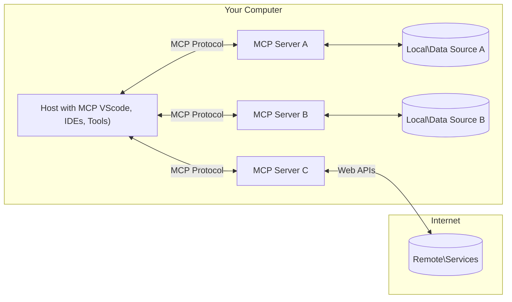

<!--
CO_OP_TRANSLATOR_METADATA:
{
  "original_hash": "355b12a5970c5c9e6db0bee970c751ba",
  "translation_date": "2025-07-04T16:41:52+00:00",
  "source_file": "01-CoreConcepts/README.md",
  "language_code": "ne"
}
-->
# 📖 MCP कोर अवधारणाहरू: AI एकीकरणका लागि मोडेल कन्टेक्स्ट प्रोटोकलमा दक्षता हासिल गर्नुहोस्

[Model Context Protocol (MCP)](https://github.com/modelcontextprotocol) एक शक्तिशाली, मानकीकृत फ्रेमवर्क हो जसले ठूलो भाषा मोडेलहरू (LLMs) र बाह्य उपकरणहरू, अनुप्रयोगहरू, र डाटा स्रोतहरू बीचको सञ्चारलाई अनुकूलित गर्छ। यो SEO-अनुकूलित मार्गदर्शनले तपाईंलाई MCP का कोर अवधारणाहरू मार्फत लैजानेछ, जसले तपाईंलाई यसको क्लाइन्ट-सर्भर आर्किटेक्चर, आवश्यक कम्पोनेन्टहरू, सञ्चार प्रक्रिया, र कार्यान्वयनका उत्तम अभ्यासहरू बुझ्न मद्दत गर्नेछ।

## अवलोकन

यस पाठले Model Context Protocol (MCP) इकोसिस्टमको आधारभूत आर्किटेक्चर र कम्पोनेन्टहरू अन्वेषण गर्छ। तपाईंले क्लाइन्ट-सर्भर आर्किटेक्चर, मुख्य कम्पोनेन्टहरू, र सञ्चार मेकानिजमहरूबारे सिक्नुहुनेछ जसले MCP अन्तरक्रियाहरूलाई सशक्त बनाउँछ।

## 👩‍🎓 मुख्य सिकाइ उद्देश्यहरू

यस पाठको अन्त्यसम्म, तपाईंले:

- MCP क्लाइन्ट-सर्भर आर्किटेक्चर बुझ्नुहुनेछ।
- Hosts, Clients, र Servers का भूमिका र जिम्मेवारीहरू पहिचान गर्नुहुनेछ।
- MCP लाई लचिलो एकीकरण तह बनाउने मुख्य विशेषताहरू विश्लेषण गर्नुहुनेछ।
- MCP इकोसिस्टम भित्र सूचना कसरी प्रवाह हुन्छ भन्ने सिक्नुहुनेछ।
- .NET, Java, Python, र JavaScript मा कोड उदाहरणहरू मार्फत व्यावहारिक ज्ञान प्राप्त गर्नुहुनेछ।

## 🔎 MCP आर्किटेक्चर: गहिरो दृष्टि

MCP इकोसिस्टम क्लाइन्ट-सर्भर मोडेलमा आधारित छ। यो मोड्युलर संरचनाले AI अनुप्रयोगहरूलाई उपकरणहरू, डाटाबेसहरू, API हरू, र सन्दर्भ स्रोतहरूसँग प्रभावकारी रूपमा अन्तरक्रिया गर्न अनुमति दिन्छ। अब यस आर्किटेक्चरलाई यसको मुख्य कम्पोनेन्टहरूमा विभाजन गरौं।

MCP मूल रूपमा क्लाइन्ट-सर्भर आर्किटेक्चर अनुसरण गर्छ जहाँ होस्ट अनुप्रयोगले धेरै सर्भरहरूसँग जडान गर्न सक्छ:



- **MCP Hosts**: VSCode, Claude Desktop, IDE हरू, वा MCP मार्फत डाटा पहुँच गर्न चाहने AI उपकरणहरू जस्ता प्रोग्रामहरू
- **MCP Clients**: सर्भरहरूसँग 1:1 जडान कायम राख्ने प्रोटोकल क्लाइन्टहरू
- **MCP Servers**: प्रत्येकले मानकीकृत Model Context Protocol मार्फत विशिष्ट क्षमता प्रदान गर्ने हल्का प्रोग्रामहरू
- **स्थानीय डाटा स्रोतहरू**: तपाईंको कम्प्युटरका फाइलहरू, डाटाबेसहरू, र सेवाहरू जसमा MCP सर्भरहरूले सुरक्षित रूपमा पहुँच गर्न सक्छन्
- **दूरस्थ सेवाहरू**: इन्टरनेटमा उपलब्ध बाह्य प्रणालीहरू जसमा MCP सर्भरहरूले API मार्फत जडान गर्न सक्छन्।

MCP प्रोटोकल एक विकासशील मानक हो, तपाईं [प्रोटोकल स्पेसिफिकेसन](https://modelcontextprotocol.io/specification/2025-06-18/) मा पछिल्ला अपडेटहरू हेर्न सक्नुहुन्छ।

### १. Hosts

Model Context Protocol (MCP) मा, Hosts प्रयोगकर्ताहरूले प्रोटोकलसँग अन्तरक्रिया गर्ने मुख्य इन्टरफेसको रूपमा महत्त्वपूर्ण भूमिका खेल्छन्। Hosts ती अनुप्रयोगहरू वा वातावरणहरू हुन् जसले MCP सर्भरहरूसँग जडान सुरु गरेर डाटा, उपकरणहरू, र प्रॉम्प्टहरू पहुँच गर्छन्। Hosts का उदाहरणहरूमा Visual Studio Code जस्ता एकीकृत विकास वातावरणहरू (IDEs), Claude Desktop जस्ता AI उपकरणहरू, वा विशिष्ट कार्यहरूको लागि बनाइएका कस्टम एजेन्टहरू समावेश छन्।

**Hosts** LLM अनुप्रयोगहरू हुन् जसले जडान सुरु गर्छन्। तिनीहरूले:

- AI मोडेलहरूसँग अन्तरक्रिया गरेर प्रतिक्रिया उत्पन्न गर्छन्।
- MCP सर्भरहरूसँग जडान सुरु गर्छन्।
- संवाद प्रवाह र प्रयोगकर्ता इन्टरफेस व्यवस्थापन गर्छन्।
- अनुमति र सुरक्षा सीमाहरू नियन्त्रण गर्छन्।
- डाटा साझेदारी र उपकरण सञ्चालनका लागि प्रयोगकर्ताको सहमति व्यवस्थापन गर्छन्।

### २. Clients

Clients Hosts र MCP सर्भरहरू बीचको अन्तरक्रिया सहज बनाउने आवश्यक कम्पोनेन्टहरू हुन्। Clients मध्यस्थको रूपमा काम गर्छन्, Hosts लाई MCP सर्भरहरूले प्रदान गर्ने कार्यक्षमताहरू पहुँच र उपयोग गर्न सक्षम बनाउँछन्। तिनीहरूले MCP आर्किटेक्चर भित्र सहज सञ्चार र प्रभावकारी डाटा विनिमय सुनिश्चित गर्न महत्त्वपूर्ण भूमिका खेल्छन्।

**Clients** होस्ट अनुप्रयोग भित्रका कनेक्टर्स हुन्। तिनीहरूले:

- सर्भरहरूलाई प्रॉम्प्ट/निर्देशनसहित अनुरोधहरू पठाउँछन्।
- सर्भरहरूसँग क्षमता वार्ता गर्छन्।
- मोडेलहरूबाट उपकरण सञ्चालन अनुरोधहरू व्यवस्थापन गर्छन्।
- प्रयोगकर्तालाई प्रतिक्रिया प्रक्रिया गरी प्रदर्शन गर्छन्।

### ३. Servers

Servers MCP क्लाइन्टहरूबाट अनुरोधहरू ह्यान्डल गर्ने र उपयुक्त प्रतिक्रिया प्रदान गर्ने जिम्मेवार हुन्छन्। तिनीहरूले डाटा पुनःप्राप्ति, उपकरण सञ्चालन, र प्रॉम्प्ट उत्पादन जस्ता विभिन्न अपरेसनहरू व्यवस्थापन गर्छन्। Servers ले क्लाइन्ट र Hosts बीचको सञ्चार प्रभावकारी र भरपर्दो बनाउन सुनिश्चित गर्छन्, अन्तरक्रिया प्रक्रियाको अखण्डता कायम राख्छन्।

**Servers** सन्दर्भ र क्षमताहरू प्रदान गर्ने सेवाहरू हुन्। तिनीहरूले:

- उपलब्ध सुविधाहरू (स्रोतहरू, प्रॉम्प्टहरू, उपकरणहरू) दर्ता गर्छन्
- क्लाइन्टबाट उपकरण कलहरू प्राप्त गरी कार्यान्वयन गर्छन्
- मोडेल प्रतिक्रियाहरूलाई सुधार गर्न सन्दर्भ जानकारी प्रदान गर्छन्
- आउटपुटहरू क्लाइन्टलाई फिर्ता गर्छन्
- आवश्यक परे अन्तरक्रियाहरूमा अवस्था कायम राख्छन्

Servers लाई कुनै पनि व्यक्तिले मोडेल क्षमताहरूलाई विशेष कार्यक्षमतासँग विस्तार गर्न विकास गर्न सक्छ।

### ४. Server सुविधाहरू

Model Context Protocol (MCP) का Servers ले क्लाइन्टहरू, Hosts, र भाषा मोडेलहरू बीच समृद्ध अन्तरक्रियाहरू सक्षम पार्ने आधारभूत निर्माण ब्लकहरू प्रदान गर्छन्। यी सुविधाहरूले संरचित सन्दर्भ, उपकरणहरू, र प्रॉम्प्टहरू प्रदान गरेर MCP को क्षमताहरू बढाउँछन्।

MCP सर्भरहरूले निम्न सुविधाहरू मध्ये कुनै पनि प्रस्ताव गर्न सक्छन्:

#### 📑 स्रोतहरू

Model Context Protocol (MCP) मा स्रोतहरूले विभिन्न प्रकारका सन्दर्भ र डाटा समेट्छन् जुन प्रयोगकर्ताहरू वा AI मोडेलहरूले उपयोग गर्न सक्छन्। यीमा समावेश छन्:

- **सन्दर्भ डाटा**: निर्णय लिन र कार्य सम्पन्न गर्न प्रयोगकर्ताहरू वा AI मोडेलहरूले उपयोग गर्न सक्ने जानकारी र सन्दर्भ।
- **ज्ञान आधार र दस्तावेज भण्डारहरू**: संरचित र असंरचित डाटाको संग्रह, जस्तै लेखहरू, म्यानुअलहरू, र अनुसन्धान कागजातहरू, जसले मूल्यवान जानकारी र अन्तर्दृष्टि प्रदान गर्छ।
- **स्थानीय फाइलहरू र डाटाबेसहरू**: उपकरणहरूमा वा डाटाबेसहरूमा स्थानीय रूपमा संग्रहित डाटा, जसलाई प्रशोधन र विश्लेषणका लागि पहुँच गर्न सकिन्छ।
- **API हरू र वेब सेवाहरू**: अतिरिक्त डाटा र कार्यक्षमताहरू प्रदान गर्ने बाह्य इन्टरफेस र सेवाहरू, जसले विभिन्न अनलाइन स्रोतहरू र उपकरणहरूसँग एकीकरण सक्षम बनाउँछ।

स्रोतको उदाहरणको रूपमा डाटाबेस स्कीमा वा फाइल हुन सक्छ जुन यसरी पहुँच गर्न सकिन्छ:

```text
file://log.txt
database://schema
```

### 🤖 प्रॉम्प्टहरू

Model Context Protocol (MCP) मा प्रॉम्प्टहरूले विभिन्न पूर्व-परिभाषित टेम्प्लेटहरू र अन्तरक्रिया ढाँचाहरू समावेश गर्छन् जसले प्रयोगकर्ता कार्यप्रवाहहरूलाई सरल बनाउँछन् र सञ्चारलाई सुधार गर्छन्। यीमा समावेश छन्:

- **टेम्प्लेट गरिएको सन्देशहरू र कार्यप्रवाहहरू**: पूर्व-संरचित सन्देशहरू र प्रक्रियाहरू जसले प्रयोगकर्ताहरूलाई विशिष्ट कार्यहरू र अन्तरक्रियाहरूमा मार्गदर्शन गर्छ।
- **पूर्व-परिभाषित अन्तरक्रिया ढाँचाहरू**: मानकीकृत कार्य र प्रतिक्रिया अनुक्रमहरू जसले निरन्तर र प्रभावकारी सञ्चारलाई सहज बनाउँछ।
- **विशेषीकृत संवाद टेम्प्लेटहरू**: विशिष्ट प्रकारका संवादहरूको लागि अनुकूलनयोग्य टेम्प्लेटहरू, जसले सान्दर्भिक र सन्दर्भअनुकूल अन्तरक्रियाहरू सुनिश्चित गर्छ।

प्रॉम्प्ट टेम्प्लेट यसरी देखिन सक्छ:

```markdown
Generate a product slogan based on the following {{product}} with the following {{keywords}}
```

#### ⛏️ उपकरणहरू

Model Context Protocol (MCP) मा उपकरणहरू ती कार्यहरू हुन् जुन AI मोडेलले विशिष्ट कार्यहरू गर्न कार्यान्वयन गर्न सक्छ। यी उपकरणहरूले AI मोडेलको क्षमताहरूलाई संरचित र भरपर्दो अपरेसनहरू प्रदान गरेर बढाउँछन्। मुख्य पक्षहरूमा समावेश छन्:

- **AI मोडेलले कार्यान्वयन गर्न सक्ने कार्यहरू**: उपकरणहरू कार्यान्वयनयोग्य कार्यहरू हुन् जुन AI मोडेलले विभिन्न कार्यहरू गर्न बोलाउन सक्छ।
- **विशिष्ट नाम र विवरण**: प्रत्येक उपकरणको फरक नाम र यसको उद्देश्य र कार्यक्षमता व्याख्या गर्ने विस्तृत विवरण हुन्छ।
- **प्यारामिटरहरू र आउटपुटहरू**: उपकरणहरूले विशिष्ट प्यारामिटरहरू स्वीकार्छन् र संरचित आउटपुटहरू फिर्ता गर्छन्, जसले निरन्तर र पूर्वानुमेय परिणाम सुनिश्चित गर्छ।
- **अलग कार्यहरू**: उपकरणहरूले वेब खोज, गणना, र डाटाबेस क्वेरीज जस्ता पृथक कार्यहरू प्रदर्शन गर्छन्।

उपकरणको उदाहरण यसरी देखिन सक्छ:

```typescript
server.tool(
  "GetProducts",
  {
    pageSize: z.string().optional(),
    pageCount: z.string().optional()
  }, () => {
    // return results from API
  }
)
```

## क्लाइन्ट सुविधाहरू

Model Context Protocol (MCP) मा, क्लाइन्टहरूले सर्भरहरूलाई विभिन्न मुख्य सुविधाहरू प्रदान गर्छन् जसले प्रोटोकल भित्रको समग्र कार्यक्षमता र अन्तरक्रियालाई सुधार गर्छ। ती मध्ये एक उल्लेखनीय सुविधा Sampling हो।

### 👉 Sampling

- **सर्भर-प्रेरित एजेन्टिक व्यवहारहरू**: क्लाइन्टहरूले सर्भरहरूलाई स्वतन्त्र रूपमा विशिष्ट क्रियाकलापहरू वा व्यवहारहरू सुरु गर्न सक्षम बनाउँछन्, जसले प्रणालीको गतिशील क्षमताहरू बढाउँछ।
- **पुनरावृत्त LLM अन्तरक्रियाहरू**: यस सुविधाले ठूलो भाषा मोडेलहरूसँग पुनरावृत्त अन्तरक्रियाहरूलाई अनुमति दिन्छ, जसले जटिल र पुनरावृत्त कार्य प्रशोधन सक्षम बनाउँछ।
- **थप मोडेल पूर्णताहरूको अनुरोध**: सर्भरहरूले मोडेलबाट थप पूर्णताहरू अनुरोध गर्न सक्छन्, जसले प्रतिक्रियाहरूलाई व्यापक र सान्दर्भिक बनाउँछ।

## MCP मा सूचना प्रवाह

Model Context Protocol (MCP) ले Hosts, Clients, Servers, र मोडेलहरू बीच सूचना प्रवाहको संरचित प्रक्रिया परिभाषित गर्छ। यस प्रवाहलाई बुझ्दा प्रयोगकर्ताका अनुरोधहरू कसरी प्रशोधन हुन्छन् र बाह्य उपकरणहरू र डाटा स्रोतहरू मोडेल प्रतिक्रियामा कसरी एकीकृत हुन्छन् भन्ने स्पष्ट हुन्छ।

- **Host ले जडान सुरु गर्छ**  
  होस्ट अनुप्रयोग (जस्तै IDE वा च्याट इन्टरफेस) ले सामान्यतया STDIO, WebSocket, वा अन्य समर्थित ट्रान्सपोर्टमार्फत MCP सर्भरसँग जडान स्थापना गर्छ।

- **क्षमता वार्ता**  
  क्लाइन्ट (होस्टमा एम्बेड गरिएको) र सर्भरले आफ्नो समर्थित सुविधाहरू, उपकरणहरू, स्रोतहरू, र प्रोटोकल संस्करणहरूको बारेमा जानकारी साटासाट गर्छन्। यसले दुवै पक्षलाई सत्रका लागि उपलब्ध क्षमताहरू बुझ्न सुनिश्चित गर्छ।

- **प्रयोगकर्ता अनुरोध**  
  प्रयोगकर्ताले होस्टसँग अन्तरक्रिया गर्छ (जस्तै प्रॉम्प्ट वा कमाण्ड प्रविष्टि)। होस्टले यो इनपुट सङ्कलन गरी प्रशोधनका लागि क्लाइन्टलाई पठाउँछ।

- **स्रोत वा उपकरण प्रयोग**  
  - क्लाइन्टले मोडेलको बुझाइ समृद्ध बनाउन सर्भरबाट थप सन्दर्भ वा स्रोतहरू (जस्तै फाइलहरू, डाटाबेस प्रविष्टिहरू, वा ज्ञान आधारका लेखहरू) अनुरोध गर्न सक्छ।
  - यदि मोडेलले उपकरण आवश्यक ठान्छ (जस्तै डाटा ल्याउन, गणना गर्न, वा API कल गर्न), क्लाइन्टले उपकरण नाम र प्यारामिटरहरू निर्दिष्ट गर्दै उपकरण कल अनुरोध सर्भरलाई पठाउँछ।

- **सर्भर कार्यान्वयन**  
  सर्भरले स्रोत वा उपकरण अनुरोध प्राप्त गरी आवश्यक अपरेसनहरू (जस्तै कार्य चलाउने, डाटाबेस क्वेरी गर्ने, वा फाइल पुनःप्राप्त गर्ने) कार्यान्वयन गर्छ र परिणामहरू संरचित ढाँचामा क्लाइन्टलाई फिर्ता गर्छ।

- **प्रतिक्रिया उत्पादन**  
  क्लाइन्टले सर्भरका प्रतिक्रियाहरू (स्रोत डाटा, उपकरण आउटपुटहरू आदि) मोडेल अन्तरक्रियामा समाहित गर्छ। मोडेलले यस जानकारीलाई प्रयोग गरी व्यापक र सान्दर्भिक प्रतिक्रिया उत्पन्न गर्छ।

- **परिणाम प्रस्तुति**  
  होस्टले क्लाइन्टबाट अन्तिम आउटपुट प्राप्त गरी प्रयोगकर्तालाई प्रस्तुत गर्छ, प्रायः मोडेलले उत्पन्न गरेको पाठ र उपकरण सञ्चालन वा स्रोत खोजका परिणामहरू सहित।

यस प्रवाहले MCP लाई उन्नत, अन्तरक्रियात्मक, र सन्दर्भ-सचेत AI अनुप्रयोगहरूलाई मोडेलहरूलाई बाह्य उपकरणहरू र डाटा स्रोतहरूसँग सहज रूपमा जडान गरेर समर्थन गर्न सक्षम बनाउँछ।

## प्रोटोकल विवरणहरू

MCP (Model Context Protocol) [JSON-RPC 2.0](https://www.jsonrpc.org/) माथि निर्माण गरिएको छ, जसले Hosts, Clients, र Servers बीच सञ्चारका लागि मानकीकृत, भाषा-स्वतन्त्र सन्देश ढाँचा प्रदान गर्छ। यस आधारले विभिन्न प्लेटफर्म र प्रोग्रामिङ भाषाहरूमा भरपर्दो, संरचित, र विस्तारयोग्य अन्तरक्रियाहरू सक्षम बनाउँछ।

### मुख्य प्रोटोकल सुविधाहरू

MCP ले JSON-RPC 2.0 लाई उपकरण कल, स्रोत पहुँच, र प्रॉम्प्ट व्यवस्थापनका लागि थप कन्वेन्सनहरूसँग विस्तार गर्छ। यसले धेरै ट्रान्सपोर्ट तहहरू (STDIO, WebSocket, SSE) समर्थन गर्छ र कम्पोनेन्टहरू बीच सुरक्षित, विस्तारयोग्य, र भाषा-स्वतन्त्र सञ्चार सक्षम बनाउँछ।

#### 🧢 आधारभूत प्रोटोकल

- **JSON-RPC सन्देश ढाँचा**: सबै अनुरोध र प्रतिक्रियाहरू JSON-RPC 2.0 विनिर्देशन प्रयोग गर्छन्, जसले विधि कलहरू, प्यारामिटरहरू, परिणामहरू, र त्रुटि ह्यान्डलिङका लागि सुसंगत संरचना सुनिश्चित गर्छ।
- **राज्यपूर्ण जडानहरू**: MCP सत्रहरूले धेरै अनुरोधहरूमा अवस्था कायम राख्छन्, निरन्तर संवाद, सन्दर्भ संचय, र स्रोत व्यवस्थापन समर्थन गर्छन्।
- **क्षमता वार्ता**: जडान सेटअपको क्रममा, क्लाइन्ट र सर्भरले समर्थित सुविधाहरू, प्रोटोकल संस्करणहरू, उपलब्ध उपकरणहरू, र स्रोतहरूको बारेमा जानकारी साटासाट गर्छन्। यसले दुवै पक्षलाई एकअर्काका क्षमताहरू बुझ्न र अनुकूलन गर्न सक्षम बनाउँछ।

#### ➕ थप उपयोगिताहरू

तल केही थप उपयोगिताहरू र प्रोटोकल विस्तारहरू छन् जसले विकासकर्ताको अनुभव सुधार्न र उन्नत परिदृश्यहरू सक्षम बनाउन MCP प्रदान गर्छ:

- **कन्फिगरेसन विकल्पहरू**: MCP ले सत्र प्यारामिटरहरू जस्तै उपकरण अनुमति, स्रोत पहुँच, र मोडेल सेटिङहरू गतिशील रूपमा कन्फिगर गर्न अनुमति दिन्छ, प्रत्येक अन्तरक्रियाका लागि अनुकूलित।
- **प्रगति ट्र्याकिङ**: लामो समयसम्म चल्ने अपरेसनहरूले प्रगति अपडेटहरू रिपोर्ट गर्न सक्छन्, जसले जटिल कार्यहरूका क्रममा प्रतिक्रियाशील प्रयोगकर्ता इन्टरफेस र राम्रो प्रयोगकर्ता अनुभव सक्षम बनाउँछ।
- **अनुरोध रद्दीकरण**: क्लाइन्टहरूले चलिरहेको अनुरोधहरू रद्द गर्न सक्छन्, जसले प्रयोगकर्ताहरूलाई अब आवश्यक नभएका वा धेरै समय लिइरहेका अपरेसनहरू रोक्न अनुमति दिन्छ।
- **त्रुटि रिपोर्टिङ**: मानकीकृत त्रुटि सन्देशहरू र कोडहरूले समस्याहरू पहिचान गर्न, असफलताहरूलाई सहज रूपमा व्यवस्थापन गर्न, र प्रयोगकर्ता तथा विकासकर्तालाई कार्यान्वयनयोग्य प्रतिक्रिया प्रदान गर्न मद्दत गर्छ।
- **लगिङ**: क्लाइन्ट र सर्भर दुवैले प्रोटोकल अन्तरक्रियाहरूको अडिटिङ, डिबगिङ, र अनुगमनका लागि संरचित लगहरू निकाल्न सक्छन्।

यी प्रोटोकल सुविधाहरूको उपयोग गरेर, MCP ले भाषा मोडेलहरू र बाह्य उपकरण वा डाटा स्रोतहरू बीच बलियो, सुरक्षित, र लचिलो सञ्चार सुनिश्चित गर्छ।

### 🔐 सुरक्षा विचारहरू

MCP कार्यान्वयनहरूले सुरक्षित र भरपर्दो अन्तरक्रियाहरू सुनिश्चित गर्न केही मुख्य सुरक्षा सिद्धान्तहरू पालना गर्नुपर्छ:

- **प्रयोगकर्ता सहमति र नियन्त्रण**: कुनै पनि डाटा पहुँच वा अपरेसनहरू गर्नु अघि प्रयोगकर्ताले स्पष्ट सहमति दिनुपर्छ। तिनीहरूले कुन डाटा साझा गर्ने र कुन क्रियाकलापहरू अनुमोदित गर्ने स्पष्ट नियन्त्रण पाउनुपर्छ, समीक्षा र स्वीकृतिका लागि सहज प्रयोगकर्ता इन्टरफेस
MCP मा प्रोटोकलभरि सुरक्षा र प्राधिकरण व्यवस्थापनका लागि धेरै निर्मित अवधारणाहरू र संयन्त्रहरू समावेश छन्:

1. **टूल अनुमति नियन्त्रण**:  
  क्लाइन्टहरूले सत्रको क्रममा मोडेलले कुन टूलहरू प्रयोग गर्न पाउने हो भनेर निर्दिष्ट गर्न सक्छन्। यसले केवल स्पष्ट रूपमा अनुमति प्राप्त टूलहरू पहुँचयोग्य हुने सुनिश्चित गर्छ, जसले अनपेक्षित वा असुरक्षित कार्यहरू हुने जोखिम कम गर्छ। अनुमति प्रयोगकर्ता प्राथमिकता, संगठनात्मक नीतिहरू, वा अन्तरक्रियाको सन्दर्भ अनुसार गतिशील रूपमा कन्फिगर गर्न सकिन्छ।

2. **प्रमाणीकरण**:  
  सर्भरहरूले टूलहरू, स्रोतहरू, वा संवेदनशील कार्यहरूमा पहुँच दिनुअघि प्रमाणीकरण आवश्यक पर्न सक्छ। यसमा API कुञ्जीहरू, OAuth टोकनहरू, वा अन्य प्रमाणीकरण योजनाहरू समावेश हुन सक्छन्। उचित प्रमाणीकरणले मात्र विश्वासयोग्य क्लाइन्ट र प्रयोगकर्ताहरूले सर्भर-साइड क्षमताहरू प्रयोग गर्न सकून् भनी सुनिश्चित गर्छ।

3. **मान्यकरण**:  
  सबै टूल कलहरूका लागि प्यारामिटर मान्यकरण लागू गरिन्छ। प्रत्येक टूलले आफ्ना प्यारामिटरहरूको अपेक्षित प्रकार, ढाँचा, र सीमाहरू परिभाषित गर्छ, र सर्भरले अनुरोधहरूलाई तदनुसार मान्य गर्छ। यसले बिग्रिएको वा दुर्भावनापूर्ण इनपुटले टूल कार्यान्वयनसम्म पुग्न नदिन्छ र अपरेसनहरूको अखण्डता कायम राख्न मद्दत गर्छ।

4. **दर सीमितीकरण**:  
  दुरुपयोग रोक्न र सर्भर स्रोतहरूको न्यायोचित प्रयोग सुनिश्चित गर्न, MCP सर्भरहरूले टूल कल र स्रोत पहुँचका लागि दर सीमितीकरण लागू गर्न सक्छन्। दर सीमाहरू प्रयोगकर्ता, सत्र, वा विश्वव्यापी रूपमा लागू गर्न सकिन्छ, र यसले डिनायल-ऑफ-सर्भिस आक्रमण वा अत्यधिक स्रोत उपभोगबाट सुरक्षा गर्छ।

यी संयन्त्रहरूलाई संयोजन गरेर, MCP ले भाषा मोडेलहरूलाई बाह्य टूलहरू र डाटा स्रोतहरूसँग सुरक्षित रूपमा एकीकृत गर्ने आधार प्रदान गर्छ, साथै प्रयोगकर्ता र विकासकर्ताहरूलाई पहुँच र प्रयोगमा सूक्ष्म नियन्त्रण दिन्छ।

## प्रोटोकल सन्देशहरू

MCP सञ्चारले क्लाइन्ट, सर्भर, र मोडेलहरूबीच स्पष्ट र भरपर्दो अन्तरक्रियाका लागि संरचित JSON सन्देशहरू प्रयोग गर्छ। मुख्य सन्देश प्रकारहरू समावेश छन्:

- **क्लाइन्ट अनुरोध**  
  क्लाइन्टबाट सर्भरमा पठाइने, यस सन्देशमा सामान्यतया समावेश हुन्छ:
  - प्रयोगकर्ताको प्रॉम्प्ट वा आदेश
  - सन्दर्भका लागि संवाद इतिहास
  - टूल कन्फिगरेसन र अनुमति
  - कुनै अतिरिक्त मेटाडाटा वा सत्र जानकारी

- **मोडेल प्रतिक्रिया**  
  मोडेलबाट (क्लाइन्टमार्फत) फर्काइने, यस सन्देशमा हुन्छ:
  - प्रॉम्प्ट र सन्दर्भमा आधारित उत्पन्न गरिएको पाठ वा पूर्णता
  - यदि मोडेलले टूल कल गर्नुपर्ने ठानेमा वैकल्पिक टूल कल निर्देशनहरू
  - आवश्यक परे स्रोतहरू वा थप सन्दर्भका सन्दर्भहरू

- **टूल अनुरोध**  
  टूल कार्यान्वयन गर्न क्लाइन्टबाट सर्भरमा पठाइने। यस सन्देशमा हुन्छ:
  - कल गर्नुपर्ने टूलको नाम
  - टूलले आवश्यक पर्ने प्यारामिटरहरू (टूलको स्किमासँग मिलेर मान्य गरिएको)
  - अनुरोध ट्र्याक गर्न सन्दर्भ जानकारी वा पहिचानकर्ता

- **टूल प्रतिक्रिया**  
  टूल कार्यान्वयन पछि सर्भरबाट फर्काइने। यस सन्देशले प्रदान गर्छ:
  - टूल कार्यान्वयनको परिणाम (संरचित डाटा वा सामग्री)
  - टूल कल असफल भएमा कुनै त्रुटि वा स्थिति जानकारी
  - वैकल्पिक रूपमा, कार्यान्वयनसँग सम्बन्धित थप मेटाडाटा वा लगहरू

यी संरचित सन्देशहरूले MCP कार्यप्रवाहको प्रत्येक चरण स्पष्ट, ट्रेसयोग्य, र विस्तारयोग्य बनाउँछन्, जसले बहु-पटक संवाद, टूल चेनिङ, र बलियो त्रुटि व्यवस्थापन जस्ता उन्नत परिदृश्यहरूलाई समर्थन गर्छ।

## मुख्य बुँदाहरू

- MCP ले मोडेलहरूलाई बाह्य क्षमतासँग जोड्न क्लाइन्ट-सर्भर वास्तुकला प्रयोग गर्छ
- पारिस्थितिकी तन्त्रमा क्लाइन्टहरू, होस्टहरू, सर्भरहरू, टूलहरू, र डाटा स्रोतहरू समावेश छन्
- सञ्चार STDIO, SSE, वा WebSockets मार्फत हुन सक्छ
- टूलहरू मोडेलहरूलाई उपलब्ध गराइने कार्यक्षमताका आधारभूत एकाइहरू हुन्
- संरचित सञ्चार प्रोटोकलहरूले निरन्तर अन्तरक्रियाहरू सुनिश्चित गर्छन्

## अभ्यास

आफ्नो क्षेत्रमा उपयोगी हुने सरल MCP टूल डिजाइन गर्नुहोस्। परिभाषित गर्नुहोस्:
1. टूलको नाम के हुनेछ
2. यसले कुन प्यारामिटरहरू स्वीकार गर्नेछ
3. के आउटपुट फर्काउनेछ
4. मोडेलले कसरी यो टूल प्रयोग गरेर प्रयोगकर्ताका समस्याहरू समाधान गर्न सक्छ

---

## के छ अर्को

अर्को: [Chapter 2: Security](../02-Security/README.md)

**अस्वीकरण**:  
यो दस्तावेज AI अनुवाद सेवा [Co-op Translator](https://github.com/Azure/co-op-translator) प्रयोग गरी अनुवाद गरिएको हो। हामी शुद्धताका लागि प्रयासरत छौं, तर कृपया ध्यान दिनुहोस् कि स्वचालित अनुवादमा त्रुटि वा अशुद्धता हुन सक्छ। मूल दस्तावेज यसको मूल भाषामा नै अधिकारिक स्रोत मानिनु पर्छ। महत्वपूर्ण जानकारीका लागि व्यावसायिक मानव अनुवाद सिफारिस गरिन्छ। यस अनुवादको प्रयोगबाट उत्पन्न कुनै पनि गलतफहमी वा गलत व्याख्याका लागि हामी जिम्मेवार छैनौं।