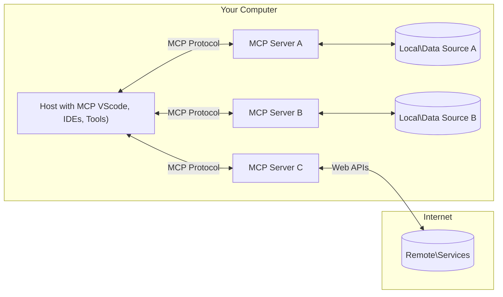

<!--
CO_OP_TRANSLATOR_METADATA:
{
  "original_hash": "b3b4a6ad10c3c0edbf7fa7cfa0ec496b",
  "translation_date": "2025-07-02T07:07:46+00:00",
  "source_file": "01-CoreConcepts/README.md",
  "language_code": "ne"
}
-->
# 📖 MCP कोर अवधारणाहरू: AI एकीकरणका लागि मोडेल कन्टेक्स्ट प्रोटोकलमा दक्षता हासिल गर्ने

[Model Context Protocol (MCP)](https://github.com/modelcontextprotocol) एउटा शक्तिशाली, मानकीकृत फ्रेमवर्क हो जसले ठूला भाषा मोडेलहरू (LLMs) र बाह्य उपकरणहरू, अनुप्रयोगहरू, र डाटा स्रोतहरू बीचको सञ्चारलाई अधिकतम बनाउँछ। यो SEO-अनुकूलित मार्गदर्शनले तपाईलाई MCP का कोर अवधारणाहरूमा लैजानेछ, जसले यसको क्लाइन्ट-सर्भर आर्किटेक्चर, आवश्यक कम्पोनेन्टहरू, सञ्चार प्रक्रियाहरू, र कार्यान्वयनका उत्कृष्ट अभ्यासहरू बुझ्न मद्दत गर्नेछ।

## अवलोकन

यो पाठले Model Context Protocol (MCP) पारिस्थितिकी तन्त्रको आधारभूत संरचना र कम्पोनेन्टहरू अन्वेषण गर्दछ। तपाईले क्लाइन्ट-सर्भर आर्किटेक्चर, मुख्य कम्पोनेन्टहरू, र सञ्चार यन्त्रहरू बारे जान्नुहुनेछ जुन MCP अन्तरक्रियाहरूलाई सशक्त बनाउँछन्।

## 👩‍🎓 मुख्य सिकाइ लक्ष्यहरू

यस पाठको अन्त्यसम्म, तपाईले:

- MCP क्लाइन्ट-सर्भर आर्किटेक्चर बुझ्नुहुनेछ।
- Hosts, Clients, र Servers का भूमिका र जिम्मेवारीहरू पहिचान गर्नुहुनेछ।
- MCP लाई लचिलो एकीकरण तह बनाउने मुख्य विशेषताहरू विश्लेषण गर्नुहुनेछ।
- MCP पारिस्थितिकी तन्त्र भित्र सूचना कसरी प्रवाह हुन्छ बुझ्नुहुनेछ।
- .NET, Java, Python, र JavaScript मा कोड उदाहरणहरू मार्फत व्यावहारिक दृष्टिकोण प्राप्त गर्नुहुनेछ।

## 🔎 MCP आर्किटेक्चर: गहिरो दृष्टि

MCP पारिस्थितिकी तन्त्र क्लाइन्ट-सर्भर मोडलमा आधारित छ। यो मोडुलर संरचनाले AI अनुप्रयोगहरूलाई उपकरणहरू, डेटाबेसहरू, API हरू, र सन्दर्भ स्रोतहरूसँग प्रभावकारी रूपमा अन्तरक्रिया गर्न अनुमति दिन्छ। अब यस आर्किटेक्चरलाई यसको मुख्य कम्पोनेन्टहरूमा विभाजन गरौं।

MCP को मूलमा, यो क्लाइन्ट-सर्भर आर्किटेक्चर पालना गर्दछ जहाँ एक होस्ट अनुप्रयोगले धेरै सर्भरहरूसँग जडान गर्न सक्छ:



- **MCP Hosts**: VSCode, Claude Desktop, IDEs, वा MCP मार्फत डाटा पहुँच गर्न चाहने AI उपकरणहरू जस्ता कार्यक्रमहरू
- **MCP Clients**: सर्भरहरूसँग 1:1 जडान कायम राख्ने प्रोटोकल क्लाइन्टहरू
- **MCP Servers**: हल्का कार्यक्रमहरू जसले प्रत्येकले मानकीकृत Model Context Protocol मार्फत विशेष क्षमता प्रदान गर्छन्
- **स्थानीय डाटा स्रोतहरू**: तपाईको कम्प्युटरका फाइलहरू, डेटाबेसहरू, र सेवाहरू जुन MCP सर्भरहरूले सुरक्षित रूपमा पहुँच गर्न सक्छन्
- **दूरस्थ सेवा**: इन्टरनेटमार्फत उपलब्ध बाह्य प्रणालीहरू जुन MCP सर्भरहरूले API हरू मार्फत जडान गर्न सक्छन्।

MCP प्रोटोकल एक विकासशील मानक हो, तपाईले [प्रोटोकल विशिष्टता](https://modelcontextprotocol.io/specification/2025-06-18/) मा नवीनतम अपडेटहरू हेर्न सक्नुहुन्छ।

### 1. Hosts

Model Context Protocol (MCP) मा, Hosts प्रयोगकर्ताहरूले प्रोटोकलसँग अन्तरक्रिया गर्ने प्राथमिक इन्टरफेसको रूपमा महत्त्वपूर्ण भूमिका खेल्छन्। Hosts ती अनुप्रयोगहरू वा वातावरणहरू हुन् जसले MCP सर्भरहरूसँग जडान सुरु गरेर डाटा, उपकरणहरू, र प्रॉम्प्टहरू पहुँच गर्छन्। Hosts का उदाहरणहरूमा Visual Studio Code जस्ता एकीकृत विकास वातावरणहरू (IDEs), Claude Desktop जस्ता AI उपकरणहरू, वा विशेष कार्यका लागि बनाइएका कस्टम एजेन्टहरू समावेश छन्।

**Hosts** LLM अनुप्रयोगहरू हुन् जसले जडान सुरु गर्छन्। तिनीहरूले:

- AI मोडेलहरूसँग अन्तरक्रिया गरेर प्रतिक्रिया उत्पादन गर्छन्।
- MCP सर्भरहरूसँग जडान सुरु गर्छन्।
- संवाद प्रवाह र प्रयोगकर्ता इन्टरफेस व्यवस्थापन गर्छन्।
- अनुमति र सुरक्षा सीमाहरू नियन्त्रण गर्छन्।
- डाटा साझेदारी र उपकरण सञ्चालनका लागि प्रयोगकर्ताको सहमति व्यवस्थापन गर्छन्।

### 2. Clients

Clients Hosts र MCP सर्भरहरू बीचको अन्तरक्रियालाई सहज बनाउने आवश्यक कम्पोनेन्टहरू हुन्। Clients मध्यस्थको रूपमा काम गर्छन्, Hosts लाई MCP सर्भरहरूले प्रदान गर्ने कार्यक्षमताहरू पहुँच र उपयोग गर्न सक्षम बनाउँछन्। तिनीहरूले MCP आर्किटेक्चर भित्र सहज सञ्चार र प्रभावकारी डाटा विनिमय सुनिश्चित गर्न महत्त्वपूर्ण भूमिका खेल्छन्।

**Clients** होस्ट अनुप्रयोग भित्रका कनेक्टर्स हुन्। तिनीहरूले:

- सर्भरहरूलाई प्रॉम्प्ट/निर्देशनसहित अनुरोध पठाउँछन्।
- सर्भरहरूसँग क्षमता वार्ता गर्छन्।
- मोडेलबाट उपकरण सञ्चालन अनुरोधहरू व्यवस्थापन गर्छन्।
- प्रयोगकर्तालाई प्रतिक्रिया प्रक्रिया र प्रदर्शन गर्छन्।

### 3. Servers

Servers MCP क्लाइन्टहरूबाट अनुरोधहरू ह्यान्डल गर्ने र उपयुक्त प्रतिक्रिया प्रदान गर्ने जिम्मेवार हुन्छन्। तिनीहरूले डाटा पुनःप्राप्ति, उपकरण सञ्चालन, र प्रॉम्प्ट निर्माण जस्ता विभिन्न अपरेसनहरू व्यवस्थापन गर्छन्। Servers ले Clients र Hosts बीचको सञ्चार प्रभावकारी र भरपर्दो बनाउन सुनिश्चित गर्छन्, अन्तरक्रिया प्रक्रियाको अखण्डता कायम राख्दै।

**Servers** सन्दर्भ र क्षमता प्रदान गर्ने सेवाहरू हुन्। तिनीहरूले:

- उपलब्ध सुविधाहरू (स्रोतहरू, प्रॉम्प्टहरू, उपकरणहरू) दर्ता गर्छन्।
- क्लाइन्टबाट उपकरण कलहरू प्राप्त र कार्यान्वयन गर्छन्।
- मोडेल प्रतिक्रियाहरूलाई सुधार गर्न सन्दर्भ जानकारी प्रदान गर्छन्।
- परिणामहरू क्लाइन्टलाई फिर्ता पठाउँछन्।
- आवश्यक पर्दा अन्तरक्रियाहरूमा अवस्था कायम राख्छन्।

विशेष कार्यक्षमतासहित मोडेल क्षमता विस्तार गर्न सर्भरहरूलाई कोही पनि विकास गर्न सक्छ।

### 4. Server Features

Model Context Protocol (MCP) मा Servers ले Clients, Hosts, र भाषा मोडेलहरू बीच धनी अन्तरक्रिया सक्षम गर्ने आधारभूत ब्लकहरू प्रदान गर्छन्। यी सुविधाहरूले संरचित सन्दर्भ, उपकरणहरू, र प्रॉम्प्टहरू प्रदान गरेर MCP को क्षमता बढाउँछन्।

MCP सर्भरहरूले तलका कुनै पनि सुविधाहरू प्रस्ताव गर्न सक्छन्:

#### 📑 स्रोतहरू (Resources)

Model Context Protocol (MCP) मा स्रोतहरूले विभिन्न प्रकारका सन्दर्भ र डाटा समावेश गर्छन् जुन प्रयोगकर्ता वा AI मोडेलहरूले उपयोग गर्न सक्छन्। यीमा समावेश छन्:

- **सन्दर्भ डाटा**: निर्णय लिन र कार्य सम्पन्न गर्न प्रयोगकर्ताहरू वा AI मोडेलहरूले उपयोग गर्न सक्ने जानकारी र सन्दर्भ।
- **ज्ञान आधारहरू र दस्तावेज संग्रहहरू**: संरचित र असंरचित डाटाको संग्रहहरू, जस्तै लेखहरू, म्यानुअलहरू, र अनुसन्धान कागजातहरू, जसले मूल्यवान जानकारी र सूचनाहरू प्रदान गर्छन्।
- **स्थानीय फाइलहरू र डेटाबेसहरू**: उपकरणहरूमा वा डेटाबेसहरूमा स्थानीय रूपमा संग्रहित डाटा, जसलाई प्रशोधन र विश्लेषणका लागि पहुँच गर्न सकिन्छ।
- **API हरू र वेब सेवा**: अतिरिक्त डाटा र कार्यक्षमताहरू प्रस्ताव गर्ने बाह्य इन्टरफेस र सेवाहरू, जसले विभिन्न अनलाइन स्रोतहरू र उपकरणहरूसँग एकीकरण सक्षम पार्छ।

स्रोतको उदाहरणको रूपमा डेटाबेस स्कीमा वा फाइल हुन सक्छ जुन यसरी पहुँच गर्न सकिन्छ:

```text
file://log.txt
database://schema
```

### 🤖 प्रॉम्प्टहरू (Prompts)

Model Context Protocol (MCP) मा प्रॉम्प्टहरूले विभिन्न पूर्वनिर्धारित टेम्प्लेटहरू र अन्तरक्रिया ढाँचाहरू समावेश गर्छन् जसले प्रयोगकर्ता कार्यप्रवाहलाई सहज बनाउँछन् र सञ्चार सुधार गर्छन्। यीमा समावेश छन्:

- **टेम्प्लेट गरिएको सन्देशहरू र कार्यप्रवाहहरू**: पूर्व संरचित सन्देशहरू र प्रक्रियाहरू जसले प्रयोगकर्ताहरूलाई विशेष कार्यहरू र अन्तरक्रियाहरूमा मार्गदर्शन गर्छ।
- **पूर्वनिर्धारित अन्तरक्रिया ढाँचाहरू**: क्रियाकलाप र प्रतिक्रियाहरूको मानकीकृत अनुक्रम जसले निरन्तर र प्रभावकारी सञ्चार सुनिश्चित गर्छ।
- **विशेषीकृत संवाद टेम्प्लेटहरू**: विशेष प्रकारका संवादहरूका लागि अनुकूलन योग्य टेम्प्लेटहरू, सान्दर्भिक र सन्दर्भअनुकूल अन्तरक्रियाहरू सुनिश्चित गर्दै।

प्रॉम्प्ट टेम्प्लेट यसरी देखिन सक्छ:

```markdown
Generate a product slogan based on the following {{product}} with the following {{keywords}}
```

#### ⛏️ उपकरणहरू (Tools)

Model Context Protocol (MCP) मा उपकरणहरू ती कार्यहरू हुन् जुन AI मोडेलले विशिष्ट कार्यहरू सम्पन्न गर्न कार्यान्वयन गर्न सक्छ। यी उपकरणहरूले AI मोडेलको क्षमता बढाउन संरचित र भरपर्दो अपरेसनहरू प्रदान गर्छन्। मुख्य पक्षहरू समावेश छन्:

- **AI मोडेलले कार्यान्वयन गर्ने कार्यहरू**: उपकरणहरू कार्यान्वयन योग्य फङ्सनहरू हुन् जुन AI मोडेलले विभिन्न कार्यहरू गर्न बोलाउन सक्छ।
- **विशिष्ट नाम र विवरण**: प्रत्येक उपकरणसँग फरक नाम र यसको उद्देश्य र कार्यक्षमता व्याख्या गर्ने विस्तृत विवरण हुन्छ।
- **प्यारामिटरहरू र आउटपुटहरू**: उपकरणहरूले निश्चित प्यारामिटरहरू स्वीकार्छन् र संरचित आउटपुटहरू फर्काउँछन्, जसले निरन्तर र पूर्वानुमान योग्य नतिजा सुनिश्चित गर्छ।
- **विभाजित कार्यहरू**: उपकरणहरूले वेब खोज, गणना, र डेटाबेस क्वेरीज जस्ता अलग-अलग कार्यहरू सम्पन्न गर्छन्।

उपकरणको उदाहरण यसरी देखिन सक्छ:

```typescript
server.tool(
  "GetProducts",
  {
    pageSize: z.string().optional(),
    pageCount: z.string().optional()
  }, () => {
    // return results from API
  }
)
```

## Client Features

Model Context Protocol (MCP) मा, क्लाइन्टहरूले सर्भरहरूलाई विभिन्न प्रमुख सुविधाहरू प्रदान गर्छन् जसले प्रोटोकल भित्रको समग्र कार्यक्षमता र अन्तरक्रिया बढाउँछन्। एक उल्लेखनीय सुविधा Sampling हो।

### 👉 Sampling

- **सर्भर-प्रेरित एजेन्टिक व्यवहारहरू**: क्लाइन्टहरूले सर्भरहरूलाई स्वतन्त्र रूपमा विशिष्ट क्रियाकलाप वा व्यवहारहरू सुरु गर्न सक्षम बनाउँछन्, जसले प्रणालीका गतिशील क्षमताहरू बढाउँछ।
- **पुनरावृत्त LLM अन्तरक्रियाहरू**: यस सुविधाले ठूलो भाषा मोडेलहरूसँग पुनरावृत्त अन्तरक्रियाहरूको अनुमति दिन्छ, जसले जटिल र पुनरावृत्त कार्यहरूलाई सम्भव बनाउँछ।
- **थप मोडेल पूर्ति अनुरोध**: सर्भरहरूले मोडेलबाट थप पूर्तिहरू अनुरोध गर्न सक्छन्, जसले प्रतिक्रियाहरूलाई व्यापक र सन्दर्भअनुकूल बनाउँछ।

## MCP मा सूचना प्रवाह

Model Context Protocol (MCP) ले Hosts, Clients, Servers, र मोडेलहरू बीच सूचना प्रवाहलाई संरचित तरिकाले परिभाषित गर्छ। यस प्रवाहलाई बुझ्दा प्रयोगकर्ता अनुरोधहरू कसरी प्रक्रिया हुन्छन् र बाह्य उपकरणहरू र डाटाहरू मोडेल प्रतिक्रियामा कसरी एकीकृत हुन्छन् स्पष्ट हुन्छ।

- **Host ले जडान सुरु गर्छ**  
  होस्ट अनुप्रयोग (जस्तै IDE वा च्याट इन्टरफेस) ले प्रायः STDIO, WebSocket, वा अन्य समर्थित ट्रान्सपोर्ट मार्फत MCP सर्भरमा जडान स्थापना गर्छ।

- **क्षमता वार्ता**  
  क्लाइन्ट (होस्ट भित्र समाहित) र सर्भरले आफ्ना समर्थित सुविधाहरू, उपकरणहरू, स्रोतहरू, र प्रोटोकल संस्करणहरूको बारेमा जानकारी आदानप्रदान गर्छन्। यसले दुबै पक्षलाई सेसनका लागि उपलब्ध क्षमताहरू बुझ्न सुनिश्चित गर्छ।

- **प्रयोगकर्ता अनुरोध**  
  प्रयोगकर्ताले होस्टसँग अन्तरक्रिया गर्छ (जस्तै प्रॉम्प्ट वा कमाण्ड प्रविष्टि)। होस्टले यो इनपुट सङ्कलन गरी क्लाइन्टलाई प्रक्रिया गर्न पठाउँछ।

- **स्रोत वा उपकरण प्रयोग**  
  - क्लाइन्टले मोडेलको बुझाइ समृद्ध बनाउन सर्भरबाट थप सन्दर्भ वा स्रोतहरू (जस्तै फाइलहरू, डेटाबेस प्रविष्टिहरू, वा ज्ञान आधार लेखहरू) अनुरोध गर्न सक्छ।
  - यदि मोडेलले उपकरण आवश्यक ठान्छ (जस्तै डाटा ल्याउन, गणना गर्न, वा API कल गर्न), क्लाइन्टले उपकरण नाम र प्यारामिटरहरू निर्दिष्ट गर्दै सर्भरलाई उपकरण कल अनुरोध पठाउँछ।

- **सर्भर कार्यान्वयन**  
  सर्भरले स्रोत वा उपकरण अनुरोध प्राप्त गरी आवश्यक अपरेसनहरू (जस्तै फङ्सन चलाउनु, डेटाबेस सोधपुछ, वा फाइल पुनःप्राप्ति) सम्पन्न गरी नतिजाहरू संरचित रूपमा क्लाइन्टलाई फिर्ता पठाउँछ।

- **प्रतिक्रिया निर्माण**  
  क्लाइन्टले सर्भरका प्रतिक्रिया (स्रोत डाटा, उपकरण आउटपुटहरू आदि) मोडेल अन्तरक्रियामा समाहित गर्छ। मोडेलले यस जानकारी प्रयोग गरी व्यापक र सन्दर्भअनुकूल प्रतिक्रिया तयार गर्छ।

- **परिणाम प्रस्तुति**  
  होस्टले अन्तिम आउटपुट क्लाइन्टबाट प्राप्त गरी प्रयोगकर्तालाई देखाउँछ, प्रायः मोडेलले सिर्जना गरेको पाठ र उपकरण सञ्चालन वा स्रोत खोजबाट प्राप्त परिणामहरू दुवै समावेश गरेर।

यो प्रवाहले MCP लाई उन्नत, अन्तरक्रियात्मक, र सन्दर्भ-सचेत AI अनुप्रयोगहरूलाई मोडेलहरूलाई बाह्य उपकरणहरू र डाटा स्रोतहरूसँग सहज रूपमा जडान गरेर समर्थन गर्न सक्षम बनाउँछ।

## प्रोटोकल विवरण

MCP (Model Context Protocol) [JSON-RPC 2.0](https://www.jsonrpc.org/) माथि निर्माण गरिएको छ, जसले Hosts, Clients, र Servers बीच सञ्चारका लागि मानकीकृत, भाषा-निरपेक्ष सन्देश ढाँचा प्रदान गर्छ। यस आधारले विविध प्लेटफर्म र प्रोग्रामिङ भाषाहरूमा भरपर्दो, संरचित, र विस्तारयोग्य अन्तरक्रियाहरू सक्षम बनाउँछ।

### मुख्य प्रोटोकल सुविधाहरू

MCP ले JSON-RPC 2.0 लाई उपकरण कल, स्रोत पहुँच, र प्रॉम्प्ट व्यवस्थापनका लागि थप परम्पराहरूले विस्तार गर्छ। यसले विभिन्न ट्रान्सपोर्ट तहहरू (STDIO, WebSocket, SSE) समर्थन गर्छ र कम्पोनेन्टहरू बीच सुरक्षित, विस्तारयोग्य, र भाषा-निरपेक्ष सञ्चार सक्षम बनाउँछ।

#### 🧢 आधारभूत प्रोटोकल

- **JSON-RPC सन्देश ढाँचा**: सबै अनुरोध र प्रतिक्रियाहरू JSON-RPC 2.0 विशिष्टता प्रयोग गर्छन्, जसले विधि कलहरू, प्यारामिटरहरू, नतिजा, र त्रुटि व्यवस्थापनका लागि एकरूप संरचना सुनिश्चित गर्छ।
- **राज्यपूर्ण जडानहरू**: MCP सेसनहरूले धेरै अनुरोधहरूमा राज्य कायम राख्छन्, निरन्तर संवाद, सन्दर्भ संचय, र स्रोत व्यवस्थापनलाई समर्थन गर्दै।
- **क्षमता वार्ता**: जडान सेटअपको क्रममा, क्लाइन्ट र सर्भरले समर्थित सुविधाहरू, प्रोटोकल संस्करणहरू, उपलब्ध उपकरणहरू, र स्रोतहरूको बारेमा जानकारी आदानप्रदान गर्छन्। यसले दुबै पक्षलाई एकअर्काका क्षमताहरू बुझ्न र अनुकूलन गर्न सक्षम बनाउँछ।

#### ➕ अतिरिक्त युटिलिटीहरू

तल MCP ले विकासकर्ता अनुभव सुधार्न र उन्नत परिदृश्यहरू सक्षम गर्न प्रदान गर्ने केही अतिरिक्त युटिलिटीहरू र प्रोटोकल विस्तारहरू छन्:

- **कन्फिगरेसन विकल्पहरू**: MCP ले सेसन प्यारामिटरहरू, जस्तै उपकरण अनुमति, स्रोत पहुँच, र मोडेल सेटिङहरू, प्रत्येक अन्तरक्रियाको लागि गतिशील रूपमा कन्फिगर गर्न अनुमति दिन्छ।
- **प्रगति ट्र्याकिङ**: लामो समयसम्म चल्ने अपरेसनहरूले प्रगति अपडेटहरू रिपोर्ट गर्न सक्छन्, जसले जटिल कार्यहरूका बेला उत्तरदायी प्रयोगकर्ता इन्टरफेस र राम्रो प्रयोगकर्ता अनुभव सुनिश्चित गर्छ।
- **अनुरोध रद्दीकरण**: क्लाइन्टहरूले इन-फ्लाइट अनुरोधहरू रद्द गर्न सक्छन्, जसले प्रयोगकर्ताहरूलाई आवश्यक नभएको वा धेरै लामो समय लागिरहेको अपरेसनहरू रोक्न अनुमति दिन्छ।
- **त्रुटि रिपोर्टिङ**: मानकीकृत त्रुटि सन्देशहरू र कोडहरूले समस्या पहिचान, असफलताहरूलाई सहजै व्यवस्थापन, र प्रयोगकर्ता तथा विकासकर्तालाई क्रियाशील प्रतिक्रिया प्रदान गर्न मद्दत गर्छ।
- **लगिङ**: क्लाइन्ट र सर्भर दुवैले प्रोटोकल अन्तरक्रियाहरूको अडिट, डिबगिङ, र अनुगमनका लागि संरचित लगहरू उत्पादन गर्न सक्छन्।

यी प्रोटोकल सुविधाहरूको प्रयोग गरेर, MCP ले भाषा मोडेलहरू र बाह्य उपकरण वा डाटा स्रोतहरू बीच मजबुत, सुरक्षित, र लचिलो सञ्चार सुनिश्चित गर्छ।

### 🔐 सुरक्षा सम्बन्धी विचारहरू

MCP कार्यान्वयनहरूले सुरक्षित र भरपर्दो अन्तरक्रियाहरू सुनिश्चित गर्न तलका मुख्य सुरक्षा सिद्धान्तहरू पालना गर्नुपर्छ:

- **प्रयोगकर्ता सहमति र नियन्त्रण**: कुनै पनि डाटा पहुँच वा अपरेसनहरू गर्नुअघि प्रयोगकर्ताबाट स्पष्ट सहमति लिनुपर्छ। उनीहरूले कुन डाटा साझेदारी गर्ने र कुन क्रियाकलापहरू स्वीकृत गर्ने स्पष्ट नियन्त्रण पाउनुपर्छ, साथै समीक्षा र अनुमोदनका लागि सहज प्रयोगकर्ता इन्टरफेस उपलब्ध हुनुपर्छ।

- **डाटा गोपनीयता**: प्रयोगकर्ताको डाटा स्पष्ट सहमति बिना खुलासा हुनु हुँदैन र उपयुक्त पहुँच नियन्त्रणद्वारा सुरक्षित रहन

**अस्वीकरण**:  
यो दस्तावेज़ AI अनुवाद सेवा [Co-op Translator](https://github.com/Azure/co-op-translator) प्रयोग गरी अनुवाद गरिएको हो। हामी शुद्धताको लागि प्रयास गर्छौं, तर कृपया ध्यान दिनुहोस् कि स्वचालित अनुवादमा त्रुटि वा असत्यता हुन सक्ने सम्भावना हुन्छ। मूल दस्तावेज़ यसको मूल भाषामा नै अधिकारिक स्रोत मानिनु पर्छ। महत्वपूर्ण जानकारीका लागि व्यावसायिक मानव अनुवाद सिफारिस गरिन्छ। यस अनुवादको प्रयोगबाट उत्पन्न हुने कुनै पनि गलतफहमी वा गलत व्याख्याका लागि हामी जिम्मेवार छैनौं।