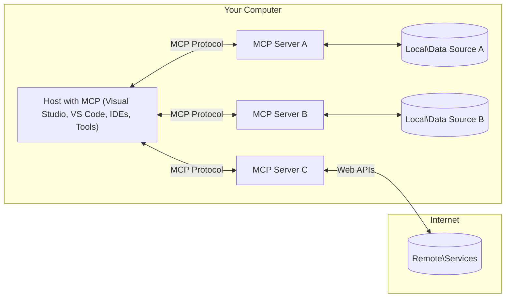

<!--
CO_OP_TRANSLATOR_METADATA:
{
  "original_hash": "88b863a69b4f18b15e82da358ffd3489",
  "translation_date": "2025-08-21T12:55:29+00:00",
  "source_file": "01-CoreConcepts/README.md",
  "language_code": "ne"
}
-->
# एमसीपी कोर अवधारणाहरू: एआई एकीकरणका लागि मोडल कन्टेक्स्ट प्रोटोकललाई मास्टर गर्ने

[](https://youtu.be/earDzWGtE84)

_(यो पाठको भिडियो हेर्न माथिको तस्बिरमा क्लिक गर्नुहोस्)_

[मोडल कन्टेक्स्ट प्रोटोकल (एमसीपी)](https://github.com/modelcontextprotocol) एक शक्तिशाली, मानकीकृत फ्रेमवर्क हो जसले ठूला भाषा मोडेलहरू (LLMs) र बाह्य उपकरणहरू, अनुप्रयोगहरू, र डाटा स्रोतहरू बीचको सञ्चारलाई अनुकूल बनाउँछ। 
यो मार्गदर्शनले तपाईंलाई एमसीपीका कोर अवधारणाहरूमा लैजानेछ। तपाईं यसको क्लाइन्ट-सर्भर आर्किटेक्चर, आवश्यक कम्पोनेन्टहरू, सञ्चार यान्त्रिकी, र कार्यान्वयनका उत्कृष्ट अभ्यासहरूबारे जान्नुहुनेछ।

- **स्पष्ट प्रयोगकर्ता सहमति**: सबै डाटा पहुँच र अपरेसनहरू कार्यान्वयन गर्नु अघि स्पष्ट प्रयोगकर्ता अनुमोदन आवश्यक छ। प्रयोगकर्ताहरूले कुन डाटामा पहुँच गरिनेछ र के कार्यहरू गरिनेछन् भन्ने स्पष्ट रूपमा बुझ्नुपर्छ, अनुमति र प्राधिकरणहरूमा विस्तृत नियन्त्रणसहित।

- **डाटा गोपनीयता सुरक्षा**: प्रयोगकर्ताको डाटा केवल स्पष्ट सहमतिसँग मात्र खुलासा गरिन्छ र सम्पूर्ण अन्तरक्रिया चक्रमा बलियो पहुँच नियन्त्रणद्वारा सुरक्षित गरिनुपर्छ। कार्यान्वयनहरूले अनधिकृत डाटा प्रसारण रोक्नुपर्छ र कडा गोपनीयता सीमाहरू कायम राख्नुपर्छ।

- **उपकरण कार्यान्वयन सुरक्षा**: प्रत्येक उपकरणको आह्वानले उपकरणको कार्यक्षमता, प्यारामिटरहरू, र सम्भावित प्रभावको स्पष्ट बुझाइसँग स्पष्ट प्रयोगकर्ता सहमति आवश्यक छ। अनपेक्षित, असुरक्षित, वा दुर्भावनापूर्ण उपकरण कार्यान्वयन रोक्न बलियो सुरक्षा सीमाहरू हुनुपर्छ।

- **ट्रान्सपोर्ट लेयर सुरक्षा**: सबै सञ्चार च्यानलहरूले उपयुक्त इन्क्रिप्शन र प्रमाणीकरण संयन्त्रहरू प्रयोग गर्नुपर्छ। टाढाको जडानहरूले सुरक्षित ट्रान्सपोर्ट प्रोटोकलहरू र उचित प्रमाणपत्र व्यवस्थापन कार्यान्वयन गर्नुपर्छ।

#### कार्यान्वयन दिशानिर्देशहरू:

- **अनुमति व्यवस्थापन**: प्रयोगकर्ताहरूलाई कुन सर्भरहरू, उपकरणहरू, र स्रोतहरू पहुँचयोग्य छन् भनेर नियन्त्रण गर्न अनुमति दिने विस्तृत अनुमति प्रणालीहरू कार्यान्वयन गर्नुहोस्।
- **प्रमाणीकरण र प्राधिकरण**: सुरक्षित प्रमाणीकरण विधिहरू (OAuth, API कुञ्जीहरू) उचित टोकन व्यवस्थापन र म्याद समाप्तिको साथ प्रयोग गर्नुहोस्।
- **इनपुट मान्यता**: इन्जेक्सन आक्रमणहरू रोक्न परिभाषित स्किमाहरू अनुसार सबै प्यारामिटरहरू र डाटा इनपुटहरू मान्यता गर्नुहोस्।
- **अडिट लगिङ**: सुरक्षा अनुगमन र अनुपालनका लागि सबै अपरेसनहरूको व्यापक लगहरू राख्नुहोस्।

## अवलोकन

यो पाठले मोडल कन्टेक्स्ट प्रोटोकल (एमसीपी) इकोसिस्टम बनाउने मौलिक आर्किटेक्चर र कम्पोनेन्टहरूको अन्वेषण गर्दछ। तपाईं एमसीपी अन्तरक्रियाहरूलाई शक्ति दिने क्लाइन्ट-सर्भर आर्किटेक्चर, प्रमुख कम्पोनेन्टहरू, र सञ्चार यान्त्रिकीबारे जान्नुहुनेछ।

## प्रमुख सिकाइ उद्देश्यहरू

यो पाठको अन्त्यसम्म, तपाईं:

- एमसीपी क्लाइन्ट-सर्भर आर्किटेक्चर बुझ्नुहुनेछ।
- होस्टहरू, क्लाइन्टहरू, र सर्भरहरूको भूमिका र जिम्मेवारीहरू पहिचान गर्नुहुनेछ।
- एमसीपीलाई लचिलो एकीकरण तह बनाउने कोर सुविधाहरूको विश्लेषण गर्नुहुनेछ।
- एमसीपी इकोसिस्टमभित्र जानकारी कसरी प्रवाह हुन्छ भन्ने कुरा सिक्नुहुनेछ।
- .NET, Java, Python, र JavaScript मा कोड उदाहरणहरू मार्फत व्यावहारिक अन्तर्दृष्टि प्राप्त गर्नुहुनेछ।

## एमसीपी आर्किटेक्चर: गहिरो दृष्टि

एमसीपी इकोसिस्टम क्लाइन्ट-सर्भर मोडेलमा आधारित छ। यो मोड्युलर संरचनाले एआई अनुप्रयोगहरूलाई उपकरणहरू, डाटाबेसहरू, एपीआईहरू, र सन्दर्भ स्रोतहरूसँग कुशलतापूर्वक अन्तरक्रिया गर्न अनुमति दिन्छ। आउनुहोस्, यो आर्किटेक्चरलाई यसको कोर कम्पोनेन्टहरूमा विभाजन गरौं।

यसको केन्द्रमा, एमसीपीले क्लाइन्ट-सर्भर आर्किटेक्चर अनुसरण गर्दछ जहाँ होस्ट अनुप्रयोगले धेरै सर्भरहरूसँग जडान गर्न सक्छ:



- **एमसीपी होस्टहरू**: VSCode, Claude Desktop, IDEs, वा एमसीपी मार्फत डाटामा पहुँच गर्न चाहने एआई उपकरणहरू जस्ता कार्यक्रमहरू।
- **एमसीपी क्लाइन्टहरू**: सर्भरहरूसँग १:१ जडान कायम राख्ने प्रोटोकल क्लाइन्टहरू।
- **एमसीपी सर्भरहरू**: प्रत्येकले मानकीकृत मोडल कन्टेक्स्ट प्रोटोकल मार्फत विशिष्ट क्षमताहरू उजागर गर्ने हल्का कार्यक्रमहरू।
- **स्थानीय डाटा स्रोतहरू**: एमसीपी सर्भरहरूले सुरक्षित रूपमा पहुँच गर्न सक्ने तपाईंको कम्प्युटरका फाइलहरू, डाटाबेसहरू, र सेवाहरू।
- **दूरस्थ सेवाहरू**: एपीआईहरू मार्फत एमसीपी सर्भरहरूले जडान गर्न सक्ने इन्टरनेटमा उपलब्ध बाह्य प्रणालीहरू।

एमसीपी प्रोटोकल एक विकसित मानक हो जसले मिति-आधारित संस्करणिङ (YYYY-MM-DD ढाँचा) प्रयोग गर्दछ। हालको प्रोटोकल संस्करण **2025-06-18** हो। [प्रोटोकल विशिष्टता](https://modelcontextprotocol.io/specification/2025-06-18/) मा पछिल्ला अद्यावधिकहरू हेर्न सक्नुहुन्छ।

### १. होस्टहरू

मोडल कन्टेक्स्ट प्रोटोकल (एमसीपी) मा, **होस्टहरू** एआई अनुप्रयोगहरू हुन् जसले प्रयोगकर्ताहरूलाई प्रोटोकलसँग अन्तरक्रिया गर्नको लागि प्राथमिक इन्टरफेसको रूपमा सेवा दिन्छ। होस्टहरूले धेरै एमसीपी सर्भरहरूसँग जडानहरू समन्वय र व्यवस्थापन गर्छन्, प्रत्येक सर्भर जडानको लागि समर्पित एमसीपी क्लाइन्टहरू सिर्जना गरेर। होस्टहरूको उदाहरणहरूमा समावेश छन्:

- **एआई अनुप्रयोगहरू**: Claude Desktop, Visual Studio Code, Claude Code
- **विकास वातावरणहरू**: एमसीपी एकीकरण भएका आईडीईहरू र कोड सम्पादकहरू  
- **अनुकूलित अनुप्रयोगहरू**: उद्देश्य-निर्मित एआई एजेन्टहरू र उपकरणहरू

**होस्टहरू** एआई मोडेल अन्तरक्रियाहरूलाई समन्वय गर्ने अनुप्रयोगहरू हुन्। तिनीहरूले:

- **एआई मोडेलहरू समन्वय गर्नुहोस्**: प्रतिक्रियाहरू उत्पन्न गर्न वा एआई वर्कफ्लोहरू समन्वय गर्न LLMs कार्यान्वयन गर्नुहोस्।
- **क्लाइन्ट जडानहरू व्यवस्थापन गर्नुहोस्**: प्रत्येक एमसीपी सर्भर जडानको लागि एक एमसीपी क्लाइन्ट सिर्जना र कायम राख्नुहोस्।
- **प्रयोगकर्ता इन्टरफेस नियन्त्रण गर्नुहोस्**: कुराकानी प्रवाह, प्रयोगकर्ता अन्तरक्रिया, र प्रतिक्रिया प्रस्तुति ह्यान्डल गर्नुहोस्।  
- **सुरक्षा लागू गर्नुहोस्**: अनुमति, सुरक्षा सीमाहरू, र प्रमाणीकरण नियन्त्रण गर्नुहोस्।
- **प्रयोगकर्ता सहमति ह्यान्डल गर्नुहोस्**: डाटा साझेदारी र उपकरण कार्यान्वयनको लागि प्रयोगकर्ता अनुमोदन व्यवस्थापन गर्नुहोस्।

### २. क्लाइन्टहरू

**क्लाइन्टहरू** अनिवार्य कम्पोनेन्टहरू हुन् जसले होस्टहरू र एमसीपी सर्भरहरू बीच समर्पित एक-देखि-एक जडानहरू कायम राख्छन्। प्रत्येक एमसीपी क्लाइन्ट होस्टद्वारा विशिष्ट एमसीपी सर्भरसँग जडान गर्न सुरु गरिन्छ, व्यवस्थित र सुरक्षित सञ्चार च्यानलहरू सुनिश्चित गर्दै। धेरै क्लाइन्टहरूले होस्टहरूलाई एकै समयमा धेरै सर्भरहरूसँग जडान गर्न सक्षम बनाउँछन्।

**क्लाइन्टहरू** होस्ट अनुप्रयोगभित्रका कनेक्टर कम्पोनेन्टहरू हुन्। तिनीहरूले:

- **प्रोटोकल सञ्चार**: सर्भरहरूलाई JSON-RPC 2.0 अनुरोधहरू पठाउनुहोस्।
- **क्षमता वार्ता**: सुरुवातको क्रममा सर्भरहरूसँग समर्थित सुविधाहरू र प्रोटोकल संस्करणहरू वार्ता गर्नुहोस्।
- **उपकरण कार्यान्वयन**: मोडेलहरूबाट उपकरण कार्यान्वयन अनुरोधहरू व्यवस्थापन गर्नुहोस्।
- **रियल-टाइम अपडेटहरू**: सर्भरहरूबाट सूचनाहरू र वास्तविक-समय अपडेटहरू ह्यान्डल गर्नुहोस्।
- **प्रतिक्रिया प्रशोधन**: प्रयोगकर्ताहरूलाई प्रदर्शनका लागि सर्भर प्रतिक्रियाहरू प्रशोधन र ढाँचा बनाउनुहोस्।

### ३. सर्भरहरू

**सर्भरहरू** कार्यक्रमहरू हुन् जसले एमसीपी क्लाइन्टहरूलाई सन्दर्भ, उपकरणहरू, र क्षमताहरू प्रदान गर्छन्। तिनीहरू स्थानीय रूपमा (होस्टसँग एउटै मेसिनमा) वा टाढा (बाह्य प्लेटफर्महरूमा) कार्यान्वयन गर्न सक्छन्, र क्लाइन्ट अनुरोधहरू ह्यान्डल गर्न र संरचित प्रतिक्रियाहरू प्रदान गर्न जिम्मेवार छन्। सर्भरहरूले मानकीकृत मोडल कन्टेक्स्ट प्रोटोकल मार्फत विशिष्ट कार्यक्षमता उजागर गर्छन्।

**सर्भरहरू** सन्दर्भ र क्षमताहरू प्रदान गर्ने सेवाहरू हुन्। तिनीहरूले:

- **फिचर दर्ता**: उपलब्ध प्रिमिटिभहरू (स्रोतहरू, प्रम्प्टहरू, उपकरणहरू) क्लाइन्टहरूसँग दर्ता र उजागर गर्नुहोस्।
- **अनुरोध प्रशोधन**: क्लाइन्टहरूबाट उपकरण कलहरू, स्रोत अनुरोधहरू, र प्रम्प्ट अनुरोधहरू प्राप्त गर्नुहोस्।
- **सन्दर्भ प्रावधान**: मोडेल प्रतिक्रियाहरू सुधार गर्न सन्दर्भ जानकारी र डाटा प्रदान गर्नुहोस्।
- **राज्य व्यवस्थापन**: सत्र राज्य कायम राख्नुहोस् र आवश्यक पर्दा राज्यपूर्ण अन्तरक्रियाहरू ह्यान्डल गर्नुहोस्।
- **रियल-टाइम सूचनाहरू**: क्षमतामा परिवर्तन र अपडेटहरूको बारेमा जडित क्लाइन्टहरूलाई सूचनाहरू पठाउनुहोस्।

सर्भरहरू कसैद्वारा पनि विकसित गर्न सकिन्छ, मोडेल क्षमताहरूलाई विशेष कार्यक्षमतासहित विस्तार गर्न, र तिनीहरूले स्थानीय र टाढाको कार्यान्वयन परिदृश्यहरू समर्थन गर्छन्।
- **JSON-RPC 2.0 प्रोटोकल**: सबै सञ्चारले विधि कल, प्रतिक्रिया, र सूचनाहरूको लागि मानकीकृत JSON-RPC 2.0 सन्देश ढाँचा प्रयोग गर्दछ  
- **लाइफसाइकल व्यवस्थापन**: क्लाइन्ट र सर्भरहरू बीच जडान सुरु गर्ने, क्षमता वार्ता गर्ने, र सत्र समाप्त गर्ने प्रक्रियाहरू सम्हाल्छ  
- **सर्भर प्रिमिटिभहरू**: सर्भरहरूले उपकरणहरू, स्रोतहरू, र प्रम्प्टहरू मार्फत मुख्य कार्यक्षमता प्रदान गर्न सक्षम बनाउँछ  
- **क्लाइन्ट प्रिमिटिभहरू**: सर्भरहरूले LLM बाट नमूना अनुरोध गर्न, प्रयोगकर्ताको इनपुट माग्न, र लग सन्देशहरू पठाउन सक्षम बनाउँछ  
- **रियल-टाइम सूचनाहरू**: पोलिङ बिना गतिशील अपडेटहरूको लागि असिन्क्रोनस सूचनाहरूलाई समर्थन गर्दछ  

#### मुख्य विशेषताहरू:

- **प्रोटोकल संस्करण वार्ता**: अनुकूलता सुनिश्चित गर्न मिति-आधारित संस्करणिङ (YYYY-MM-DD) प्रयोग गर्दछ  
- **क्षमता पत्ता लगाउने**: सुरुवातको समयमा क्लाइन्ट र सर्भरहरूले समर्थित सुविधाहरूको जानकारी आदानप्रदान गर्छन्  
- **स्टेटफुल सत्रहरू**: सन्दर्भ निरन्तरताका लागि धेरै अन्तरक्रियाहरूमा जडानको अवस्था कायम राख्छ  

### ट्रान्सपोर्ट लेयर

**ट्रान्सपोर्ट लेयर**ले MCP सहभागीहरू बीच सञ्चार च्यानलहरू, सन्देश फ्रेमिङ, र प्रमाणीकरण व्यवस्थापन गर्दछ:

#### समर्थित ट्रान्सपोर्ट संयन्त्रहरू:

1. **STDIO ट्रान्सपोर्ट**:
   - प्रत्यक्ष प्रक्रिया सञ्चारको लागि मानक इनपुट/आउटपुट स्ट्रिमहरू प्रयोग गर्दछ  
   - एउटै मेसिनमा स्थानीय प्रक्रियाहरूको लागि उपयुक्त, कुनै नेटवर्क ओभरहेड बिना  
   - प्रायः स्थानीय MCP सर्भर कार्यान्वयनहरूको लागि प्रयोग गरिन्छ  

2. **स्ट्रीमेबल HTTP ट्रान्सपोर्ट**:
   - क्लाइन्ट-देखि-सर्भर सन्देशहरूको लागि HTTP POST प्रयोग गर्दछ  
   - सर्भर-देखि-क्लाइन्ट स्ट्रिमिङको लागि वैकल्पिक सर्भर-सेन्ट इभेन्ट्स (SSE)  
   - नेटवर्कहरूमा टाढाको सर्भर सञ्चार सक्षम बनाउँछ  
   - मानक HTTP प्रमाणीकरण (बेयरर टोकन, API कुञ्जीहरू, अनुकूल हेडरहरू) समर्थन गर्दछ  
   - सुरक्षित टोकन-आधारित प्रमाणीकरणको लागि MCP ले OAuth सिफारिस गर्दछ  

#### ट्रान्सपोर्ट अमूर्तता:

ट्रान्सपोर्ट लेयरले डेटा लेयरबाट सञ्चार विवरणहरू अमूर्त बनाउँछ, सबै ट्रान्सपोर्ट संयन्त्रहरूमा समान JSON-RPC 2.0 सन्देश ढाँचा सक्षम बनाउँछ। यस अमूर्तताले अनुप्रयोगहरूलाई स्थानीय र टाढाको सर्भरहरू बीच सहज रूपमा स्विच गर्न अनुमति दिन्छ।  

### सुरक्षा विचारहरू

MCP कार्यान्वयनहरूले सबै प्रोटोकल अपरेसनहरूमा सुरक्षित, भरपर्दो, र सुरक्षित अन्तरक्रियाहरू सुनिश्चित गर्न धेरै महत्त्वपूर्ण सुरक्षा सिद्धान्तहरू पालना गर्नुपर्छ:

- **प्रयोगकर्ता सहमति र नियन्त्रण**: कुनै पनि डेटा पहुँच गर्नु अघि वा अपरेसनहरू प्रदर्शन गर्नु अघि प्रयोगकर्ताहरूले स्पष्ट सहमति प्रदान गर्नुपर्छ। उनीहरूले साझा गरिने डेटा र स्वीकृत गरिएका कार्यहरूमा स्पष्ट नियन्त्रण गर्नुपर्छ, गतिविधिहरू समीक्षा र स्वीकृत गर्न सहज प्रयोगकर्ता इन्टरफेसद्वारा समर्थित।  

- **डेटा गोपनीयता**: प्रयोगकर्ताको डेटा स्पष्ट सहमति बिना मात्र उजागर गर्नुपर्छ र उपयुक्त पहुँच नियन्त्रणद्वारा सुरक्षित गर्नुपर्छ। MCP कार्यान्वयनहरूले अनधिकृत डेटा प्रसारणको विरुद्ध सुरक्षा गर्नुपर्छ र सबै अन्तरक्रियाहरूमा गोपनीयता कायम गर्नुपर्छ।  

- **उपकरण सुरक्षा**: कुनै पनि उपकरण प्रयोग गर्नु अघि स्पष्ट प्रयोगकर्ता सहमति आवश्यक छ। प्रयोगकर्ताहरूले प्रत्येक उपकरणको कार्यक्षमताको स्पष्ट बुझाइ राख्नुपर्छ, र अनपेक्षित वा असुरक्षित उपकरण कार्यान्वयन रोक्न बलियो सुरक्षा सीमाहरू लागू गर्नुपर्छ।  

यी सुरक्षा सिद्धान्तहरू पालना गरेर, MCP ले सबै प्रोटोकल अन्तरक्रियाहरूमा प्रयोगकर्ता विश्वास, गोपनीयता, र सुरक्षालाई कायम राख्छ, जबकि शक्तिशाली AI एकीकरणहरू सक्षम गर्दछ।  

## कोड उदाहरणहरू: मुख्य घटकहरू

तल लोकप्रिय प्रोग्रामिङ भाषाहरूमा कोड उदाहरणहरू छन् जसले मुख्य MCP सर्भर घटकहरू र उपकरणहरू कार्यान्वयन गर्ने तरिका देखाउँछ।  

### .NET उदाहरण: उपकरणहरूसँग साधारण MCP सर्भर सिर्जना गर्नुहोस्

यहाँ उपकरणहरू परिभाषित र दर्ता गर्ने, अनुरोधहरू सम्हाल्ने, र मोडेल कन्टेक्स्ट प्रोटोकल प्रयोग गरेर सर्भर जडान गर्ने तरिका प्रदर्शन गर्ने व्यावहारिक .NET कोड उदाहरण छ।  

```csharp
using System;
using System.Threading.Tasks;
using ModelContextProtocol.Server;
using ModelContextProtocol.Server.Transport;
using ModelContextProtocol.Server.Tools;

public class WeatherServer
{
    public static async Task Main(string[] args)
    {
        // Create an MCP server
        var server = new McpServer(
            name: "Weather MCP Server",
            version: "1.0.0"
        );
        
        // Register our custom weather tool
        server.AddTool<string, WeatherData>("weatherTool", 
            description: "Gets current weather for a location",
            execute: async (location) => {
                // Call weather API (simplified)
                var weatherData = await GetWeatherDataAsync(location);
                return weatherData;
            });
        
        // Connect the server using stdio transport
        var transport = new StdioServerTransport();
        await server.ConnectAsync(transport);
        
        Console.WriteLine("Weather MCP Server started");
        
        // Keep the server running until process is terminated
        await Task.Delay(-1);
    }
    
    private static async Task<WeatherData> GetWeatherDataAsync(string location)
    {
        // This would normally call a weather API
        // Simplified for demonstration
        await Task.Delay(100); // Simulate API call
        return new WeatherData { 
            Temperature = 72.5,
            Conditions = "Sunny",
            Location = location
        };
    }
}

public class WeatherData
{
    public double Temperature { get; set; }
    public string Conditions { get; set; }
    public string Location { get; set; }
}
```  

### जाभा उदाहरण: MCP सर्भर घटकहरू

यो उदाहरणले माथिको .NET उदाहरण जस्तै MCP सर्भर र उपकरण दर्ता प्रदर्शन गर्दछ, तर जाभामा कार्यान्वयन गरिएको छ।  

```java
import io.modelcontextprotocol.server.McpServer;
import io.modelcontextprotocol.server.McpToolDefinition;
import io.modelcontextprotocol.server.transport.StdioServerTransport;
import io.modelcontextprotocol.server.tool.ToolExecutionContext;
import io.modelcontextprotocol.server.tool.ToolResponse;

public class WeatherMcpServer {
    public static void main(String[] args) throws Exception {
        // Create an MCP server
        McpServer server = McpServer.builder()
            .name("Weather MCP Server")
            .version("1.0.0")
            .build();
            
        // Register a weather tool
        server.registerTool(McpToolDefinition.builder("weatherTool")
            .description("Gets current weather for a location")
            .parameter("location", String.class)
            .execute((ToolExecutionContext ctx) -> {
                String location = ctx.getParameter("location", String.class);
                
                // Get weather data (simplified)
                WeatherData data = getWeatherData(location);
                
                // Return formatted response
                return ToolResponse.content(
                    String.format("Temperature: %.1f°F, Conditions: %s, Location: %s", 
                    data.getTemperature(), 
                    data.getConditions(), 
                    data.getLocation())
                );
            })
            .build());
        
        // Connect the server using stdio transport
        try (StdioServerTransport transport = new StdioServerTransport()) {
            server.connect(transport);
            System.out.println("Weather MCP Server started");
            // Keep server running until process is terminated
            Thread.currentThread().join();
        }
    }
    
    private static WeatherData getWeatherData(String location) {
        // Implementation would call a weather API
        // Simplified for example purposes
        return new WeatherData(72.5, "Sunny", location);
    }
}

class WeatherData {
    private double temperature;
    private String conditions;
    private String location;
    
    public WeatherData(double temperature, String conditions, String location) {
        this.temperature = temperature;
        this.conditions = conditions;
        this.location = location;
    }
    
    public double getTemperature() {
        return temperature;
    }
    
    public String getConditions() {
        return conditions;
    }
    
    public String getLocation() {
        return location;
    }
}
```  

### पाइथन उदाहरण: MCP सर्भर निर्माण

यस उदाहरणमा हामी पाइथनमा MCP सर्भर कसरी निर्माण गर्ने देखाउँछौं। तपाईंलाई उपकरणहरू सिर्जना गर्ने दुई फरक तरिका पनि देखाइन्छ।  

```python
#!/usr/bin/env python3
import asyncio
from mcp.server.fastmcp import FastMCP
from mcp.server.transports.stdio import serve_stdio

# Create a FastMCP server
mcp = FastMCP(
    name="Weather MCP Server",
    version="1.0.0"
)

@mcp.tool()
def get_weather(location: str) -> dict:
    """Gets current weather for a location."""
    # This would normally call a weather API
    # Simplified for demonstration
    return {
        "temperature": 72.5,
        "conditions": "Sunny",
        "location": location
    }

# Alternative approach using a class
class WeatherTools:
    @mcp.tool()
    def forecast(self, location: str, days: int = 1) -> dict:
        """Gets weather forecast for a location for the specified number of days."""
        # This would normally call a weather API forecast endpoint
        # Simplified for demonstration
        return {
            "location": location,
            "forecast": [
                {"day": i+1, "temperature": 70 + i, "conditions": "Partly Cloudy"}
                for i in range(days)
            ]
        }

# Instantiate the class to register its tools
weather_tools = WeatherTools()

# Start the server using stdio transport
if __name__ == "__main__":
    asyncio.run(serve_stdio(mcp))
```  

### जाभास्क्रिप्ट उदाहरण: MCP सर्भर सिर्जना गर्नुहोस्

यो उदाहरणले जाभास्क्रिप्टमा MCP सर्भर सिर्जना गर्ने र दुईवटा मौसमसम्बन्धी उपकरणहरू दर्ता गर्ने तरिका देखाउँछ।  

```javascript
// Using the official Model Context Protocol SDK
import { McpServer } from "@modelcontextprotocol/sdk/server/mcp.js";
import { StdioServerTransport } from "@modelcontextprotocol/sdk/server/stdio.js";
import { z } from "zod"; // For parameter validation

// Create an MCP server
const server = new McpServer({
  name: "Weather MCP Server",
  version: "1.0.0"
});

// Define a weather tool
server.tool(
  "weatherTool",
  {
    location: z.string().describe("The location to get weather for")
  },
  async ({ location }) => {
    // This would normally call a weather API
    // Simplified for demonstration
    const weatherData = await getWeatherData(location);
    
    return {
      content: [
        { 
          type: "text", 
          text: `Temperature: ${weatherData.temperature}°F, Conditions: ${weatherData.conditions}, Location: ${weatherData.location}` 
        }
      ]
    };
  }
);

// Define a forecast tool
server.tool(
  "forecastTool",
  {
    location: z.string(),
    days: z.number().default(3).describe("Number of days for forecast")
  },
  async ({ location, days }) => {
    // This would normally call a weather API
    // Simplified for demonstration
    const forecast = await getForecastData(location, days);
    
    return {
      content: [
        { 
          type: "text", 
          text: `${days}-day forecast for ${location}: ${JSON.stringify(forecast)}` 
        }
      ]
    };
  }
);

// Helper functions
async function getWeatherData(location) {
  // Simulate API call
  return {
    temperature: 72.5,
    conditions: "Sunny",
    location: location
  };
}

async function getForecastData(location, days) {
  // Simulate API call
  return Array.from({ length: days }, (_, i) => ({
    day: i + 1,
    temperature: 70 + Math.floor(Math.random() * 10),
    conditions: i % 2 === 0 ? "Sunny" : "Partly Cloudy"
  }));
}

// Connect the server using stdio transport
const transport = new StdioServerTransport();
server.connect(transport).catch(console.error);

console.log("Weather MCP Server started");
```  

यो जाभास्क्रिप्ट उदाहरणले सर्भरमा जडान गर्ने, प्रम्प्ट पठाउने, र गरिएको कुनै पनि उपकरण कलहरू सहित प्रतिक्रिया प्रक्रिया गर्ने MCP क्लाइन्ट सिर्जना गर्ने तरिका प्रदर्शन गर्दछ।  

## सुरक्षा र प्राधिकरण

MCP ले प्रोटोकलभरि सुरक्षा र प्राधिकरण व्यवस्थापन गर्न धेरै बिल्ट-इन अवधारणाहरू र संयन्त्रहरू समावेश गर्दछ:  

1. **उपकरण अनुमति नियन्त्रण**:  
   क्लाइन्टहरूले सत्रको समयमा मोडेलले कुन उपकरणहरू प्रयोग गर्न अनुमति छ भनेर निर्दिष्ट गर्न सक्छन्। यसले स्पष्ट रूपमा स्वीकृत उपकरणहरू मात्र पहुँचयोग्य छन् भन्ने सुनिश्चित गर्दछ, अनपेक्षित वा असुरक्षित अपरेसनहरूको जोखिम कम गर्दछ। अनुमति प्रयोगकर्ता प्राथमिकताहरू, संगठनात्मक नीतिहरू, वा अन्तरक्रियाको सन्दर्भको आधारमा गतिशील रूपमा कन्फिगर गर्न सकिन्छ।  

2. **प्रमाणीकरण**:  
   सर्भरहरूले उपकरणहरू, स्रोतहरू, वा संवेदनशील अपरेसनहरूमा पहुँच प्रदान गर्नु अघि प्रमाणीकरण आवश्यक हुन सक्छ। यसमा API कुञ्जीहरू, OAuth टोकनहरू, वा अन्य प्रमाणीकरण योजनाहरू समावेश हुन सक्छ। उचित प्रमाणीकरणले मात्र विश्वासयोग्य क्लाइन्ट र प्रयोगकर्ताहरूले सर्भर-साइड क्षमताहरू प्रयोग गर्न सक्छन् भन्ने सुनिश्चित गर्दछ।  

3. **मान्यकरण**:  
   सबै उपकरण कार्यान्वयनहरूको लागि प्यारामिटर मान्यकरण लागू गरिन्छ। प्रत्येक उपकरणले यसको प्यारामिटरहरूको लागि अपेक्षित प्रकार, ढाँचा, र बाधाहरू परिभाषित गर्दछ, र सर्भरले आउने अनुरोधहरूलाई तदनुसार मान्य गर्दछ। यसले उपकरण कार्यान्वयनमा खराब वा दुर्भावनापूर्ण इनपुट पुग्नबाट रोक्छ र अपरेसनहरूको अखण्डता कायम राख्न मद्दत गर्दछ।  

4. **रेट लिमिटिङ**:  
   दुरुपयोग रोक्न र सर्भर स्रोतहरूको निष्पक्ष प्रयोग सुनिश्चित गर्न, MCP सर्भरहरूले उपकरण कलहरू र स्रोत पहुँचको लागि रेट लिमिटिङ कार्यान्वयन गर्न सक्छन्। रेट लिमिटहरू प्रति प्रयोगकर्ता, प्रति सत्र, वा विश्वव्यापी रूपमा लागू गर्न सकिन्छ, र सेवा अस्वीकार आक्रमणहरू वा अत्यधिक स्रोत खपतको विरुद्ध सुरक्षा गर्न मद्दत गर्दछ।  

यी संयन्त्रहरूलाई संयोजन गरेर, MCP ले बाह्य उपकरणहरू र डेटा स्रोतहरूसँग भाषा मोडेलहरू एकीकृत गर्नको लागि सुरक्षित आधार प्रदान गर्दछ, जबकि पहुँच र प्रयोगमा प्रयोगकर्ता र विकासकर्ताहरूलाई सूक्ष्म नियन्त्रण दिन्छ।  

## प्रोटोकल सन्देशहरू र सञ्चार प्रवाह

MCP सञ्चारले होस्ट, क्लाइन्ट, र सर्भरहरू बीच स्पष्ट र भरपर्दो अन्तरक्रियाहरूलाई सहज बनाउन संरचित **JSON-RPC 2.0** सन्देशहरू प्रयोग गर्दछ। प्रोटोकलले विभिन्न प्रकारका अपरेसनहरूको लागि विशिष्ट सन्देश ढाँचाहरू परिभाषित गर्दछ:  

### मुख्य सन्देश प्रकारहरू:

#### **सुरुवात सन्देशहरू**
- **`initialize` अनुरोध**: जडान स्थापना गर्दछ र प्रोटोकल संस्करण र क्षमताहरू वार्ता गर्दछ  
- **`initialize` प्रतिक्रिया**: समर्थित सुविधाहरू र सर्भर जानकारी पुष्टि गर्दछ  
- **`notifications/initialized`**: सुरुवात पूरा भएको र सत्र तयार भएको संकेत गर्दछ  

#### **पत्ता लगाउने सन्देशहरू**
- **`tools/list` अनुरोध**: सर्भरबाट उपलब्ध उपकरणहरू पत्ता लगाउँछ  
- **`resources/list` अनुरोध**: उपलब्ध स्रोतहरू (डेटा स्रोतहरू) सूचीबद्ध गर्दछ  
- **`prompts/list` अनुरोध**: उपलब्ध प्रम्प्ट टेम्प्लेटहरू पुनःप्राप्त गर्दछ  

#### **कार्यान्वयन सन्देशहरू**  
- **`tools/call` अनुरोध**: प्रदान गरिएका प्यारामिटरहरूसँग विशिष्ट उपकरण कार्यान्वयन गर्दछ  
- **`resources/read` अनुरोध**: विशिष्ट स्रोतबाट सामग्री पुनःप्राप्त गर्दछ  
- **`prompts/get` अनुरोध**: वैकल्पिक प्यारामिटरहरूसँग प्रम्प्ट टेम्प्लेट पुनःप्राप्त गर्दछ  

#### **क्लाइन्ट-साइड सन्देशहरू**
- **`sampling/complete` अनुरोध**: सर्भरले क्लाइन्टबाट LLM कम्प्लिसन अनुरोध गर्दछ  
- **`elicitation/request`**: सर्भरले क्लाइन्ट इन्टरफेस मार्फत प्रयोगकर्ताको इनपुट अनुरोध गर्दछ  
- **लग सन्देशहरू**: सर्भरले क्लाइन्टलाई संरचित लग सन्देशहरू पठाउँछ  

#### **सूचना सन्देशहरू**
- **`notifications/tools/list_changed`**: सर्भरले उपकरण परिवर्तनहरूको बारेमा क्लाइन्टलाई सूचित गर्दछ  
- **`notifications/resources/list_changed`**: सर्भरले स्रोत परिवर्तनहरूको बारेमा क्लाइन्टलाई सूचित गर्दछ  
- **`notifications/prompts/list_changed`**: सर्भरले प्रम्प्ट परिवर्तनहरूको बारेमा क्लाइन्टलाई सूचित गर्दछ  

### सन्देश संरचना:

सबै MCP सन्देशहरूले JSON-RPC 2.0 ढाँचालाई पालना गर्छन्:  
- **अनुरोध सन्देशहरू**: `id`, `method`, र वैकल्पिक `params` समावेश गर्दछ  
- **प्रतिक्रिया सन्देशहरू**: `id` र `result` वा `error` समावेश गर्दछ  
- **सूचना सन्देशहरू**: `method` र वैकल्पिक `params` समावेश गर्दछ (कुनै `id` वा प्रतिक्रिया अपेक्षित छैन)  

यो संरचित सञ्चारले भरपर्दो, ट्रेसयोग्य, र विस्तारयोग्य अन्तरक्रियाहरू सुनिश्चित गर्दछ, वास्तविक-समय अपडेटहरू, उपकरण चेनिङ, र बलियो त्रुटि ह्यान्डलिङ जस्ता उन्नत परिदृश्यहरूलाई समर्थन गर्दछ।  

## मुख्य बुँदाहरू

- **आर्किटेक्चर**: MCP ले क्लाइन्ट-सर्भर आर्किटेक्चर प्रयोग गर्दछ जहाँ होस्टहरूले सर्भरहरूसँग धेरै क्लाइन्ट जडानहरू व्यवस्थापन गर्छन्  
- **सहभागीहरू**: पारिस्थितिकी तन्त्रमा होस्टहरू (AI अनुप्रयोगहरू), क्लाइन्टहरू (प्रोटोकल कनेक्टरहरू), र सर्भरहरू (क्षमता प्रदायकहरू) समावेश छन्  
- **ट्रान्सपोर्ट संयन्त्रहरू**: सञ्चार STDIO (स्थानीय) र स्ट्रीमेबल HTTP वैकल्पिक SSE (दूरस्थ) समर्थन गर्दछ  
- **मुख्य प्रिमिटिभहरू**: सर्भरहरूले उपकरणहरू (कार्यान्वयन योग्य कार्यहरू), स्रोतहरू (डेटा स्रोतहरू), र प्रम्प्टहरू (टेम्प्लेटहरू) उजागर गर्छन्  
- **क्लाइन्ट प्रिमिटिभहरू**: सर्भरहरूले क्लाइन्टहरूबाट नमूना (LLM कम्प्लिसन), माग (प्रयोगकर्ता इनपुट), र लगिङ अनुरोध गर्न सक्छन्  
- **प्रोटोकल आधार**: JSON-RPC 2.0 मा निर्मित मिति-आधारित संस्करणिङ (हाल: 2025-06-18)  
- **रियल-टाइम क्षमताहरू**: गतिशील अपडेटहरू र वास्तविक-समय समक्रमणको लागि सूचनाहरू समर्थन गर्दछ  
- **सुरक्षा पहिलो**: स्पष्ट प्रयोगकर्ता सहमति, डेटा गोपनीयता संरक्षण, र सुरक्षित ट्रान्सपोर्ट कोर आवश्यकताहरू हुन्  

## अभ्यास

तपाईंको क्षेत्रमा उपयोगी हुने साधारण MCP उपकरण डिजाइन गर्नुहोस्। परिभाषित गर्नुहोस्:  
1. उपकरणको नाम के हुनेछ  
2. यसले कुन प्यारामिटरहरू स्वीकार गर्नेछ  
3. यसले के आउटपुट फिर्ता गर्नेछ  
4. मोडेलले यो उपकरण प्रयोग गरेर प्रयोगकर्ताको समस्या कसरी समाधान गर्न सक्छ  

---

## अब के गर्ने

अर्को: [अध्याय २: सुरक्षा](../02-Security/README.md)  

**अस्वीकरण**:  
यो दस्तावेज़ AI अनुवाद सेवा [Co-op Translator](https://github.com/Azure/co-op-translator) प्रयोग गरी अनुवाद गरिएको हो। हामी यथासम्भव सटीकता सुनिश्चित गर्न प्रयास गर्छौं, तर कृपया ध्यान दिनुहोस् कि स्वचालित अनुवादहरूमा त्रुटिहरू वा अशुद्धताहरू हुन सक्छन्। यसको मूल भाषामा रहेको मूल दस्तावेज़लाई आधिकारिक स्रोत मानिनुपर्छ। महत्त्वपूर्ण जानकारीका लागि, व्यावसायिक मानव अनुवाद सिफारिस गरिन्छ। यस अनुवादको प्रयोगबाट उत्पन्न हुने कुनै पनि गलतफहमी वा गलत व्याख्याको लागि हामी जिम्मेवार हुने छैनौं।