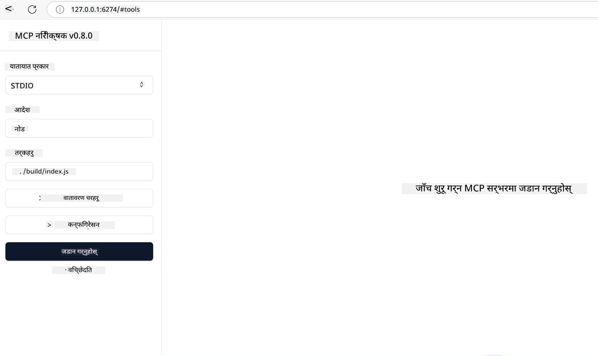
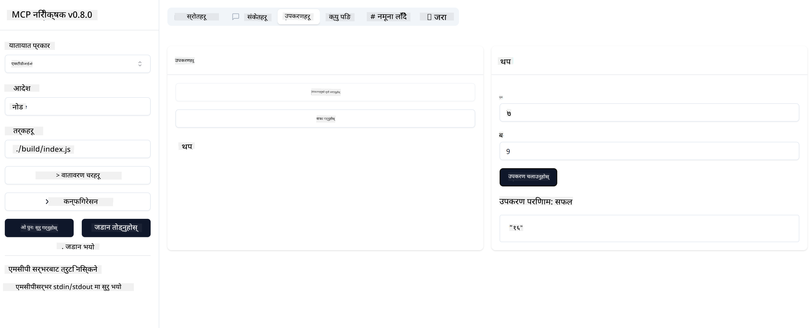

<!--
CO_OP_TRANSLATOR_METADATA:
{
  "original_hash": "5331ffd328a54b90f76706c52b673e27",
  "translation_date": "2025-05-17T08:29:46+00:00",
  "source_file": "03-GettingStarted/01-first-server/README.md",
  "language_code": "ne"
}
-->
# MCP सँग सुरु गर्दै

मोडेल कन्क्स्ट प्रोटोकल (MCP) सँगको तपाईंको पहिलो कदममा स्वागत छ! तपाईं MCP मा नयाँ हुनुहुन्छ वा आफ्नो बुझाइलाई गहिरो बनाउन चाहनुहुन्छ भने, यो मार्गदर्शनले तपाईंलाई आवश्यक सेटअप र विकास प्रक्रियामा हिँडाउँछ। तपाईंले कसरी MCP ले AI मोडेलहरू र अनुप्रयोगहरू बीच सहज एकीकरण सक्षम बनाउँछ भन्ने पत्ता लगाउनुहुनेछ, र कसरी चाँडै आफ्नो वातावरण MCP-संचालित समाधानहरू निर्माण र परीक्षणको लागि तयार गर्ने सिक्नुहुनेछ।

> TLDR; यदि तपाईं AI अनुप्रयोगहरू निर्माण गर्नुहुन्छ भने, तपाईंलाई थाहा छ कि तपाईं आफ्नो LLM (ठूलो भाषा मोडेल) मा उपकरणहरू र अन्य स्रोतहरू थप्न सक्नुहुन्छ, जसले LLM लाई अझ जानकार बनाउँछ। तर यदि तपाईंले ती उपकरणहरू र स्रोतहरूलाई सर्भरमा राख्नुहुन्छ भने, अनुप्रयोग र सर्भर क्षमताहरू कुनै पनि ग्राहकले LLM सँग वा बिना प्रयोग गर्न सक्दछन्।

## अवलोकन

यो पाठले MCP वातावरण सेटअप र तपाईंको पहिलो MCP अनुप्रयोगहरू निर्माणमा व्यावहारिक मार्गदर्शन प्रदान गर्दछ। तपाईंले आवश्यक उपकरण र फ्रेमवर्कहरू सेटअप गर्न, आधारभूत MCP सर्भरहरू निर्माण गर्न, होस्ट अनुप्रयोगहरू सिर्जना गर्न, र तपाईंको कार्यान्वयनहरूको परीक्षण गर्न सिक्नुहुनेछ।

मोडेल कन्क्स्ट प्रोटोकल (MCP) एक खुला प्रोटोकल हो जसले अनुप्रयोगहरू कसरी LLMs लाई सन्दर्भ प्रदान गर्दछ भन्ने मानकीकरण गर्दछ। USB-C पोर्ट जस्तै AI अनुप्रयोगहरूको लागि सोच्नुहोस् - यसले AI मोडेलहरूलाई विभिन्न डेटा स्रोतहरू र उपकरणहरूमा जडान गर्न मानकीकृत तरिका प्रदान गर्दछ।

## सिकाइ उद्देश्यहरू

यो पाठको अन्त्यसम्म, तपाईंले सक्षम हुनुहुनेछ:

- C#, Java, Python, TypeScript, र JavaScript मा MCP को लागि विकास वातावरण सेटअप गर्नुहोस्
- अनुकूलित सुविधाहरू (स्रोतहरू, प्रॉम्प्टहरू, र उपकरणहरू) सहित आधारभूत MCP सर्भरहरू निर्माण र परिनियोजन गर्नुहोस्
- MCP सर्भरहरूमा जडान गर्ने होस्ट अनुप्रयोगहरू सिर्जना गर्नुहोस्
- MCP कार्यान्वयनहरूको परीक्षण र डिबग गर्नुहोस्

## तपाईंको MCP वातावरण सेटअप गर्दै

MCP सँग काम गर्न सुरु गर्नु अघि, तपाईंको विकास वातावरण तयार पार्नु र आधारभूत वर्कफ्लो बुझ्न महत्त्वपूर्ण छ। यो खण्डले MCP सँग सहज सुरुवात सुनिश्चित गर्न प्रारम्भिक सेटअप चरणहरूमा तपाईंलाई मार्गदर्शन गर्नेछ।

### पूर्व आवश्यकताहरू

MCP विकासमा डुबुल्की मार्नु अघि, सुनिश्चित गर्नुहोस् कि तपाईंले:

- **विकास वातावरण**: तपाईंको रोजेको भाषा (C#, Java, Python, TypeScript, वा JavaScript) को लागि
- **IDE/संपादक**: Visual Studio, Visual Studio Code, IntelliJ, Eclipse, PyCharm, वा कुनै आधुनिक कोड संपादक
- **प्याकेज प्रबन्धकहरू**: NuGet, Maven/Gradle, pip, वा npm/yarn
- **API कुञ्जीहरू**: तपाईंको होस्ट अनुप्रयोगहरूमा प्रयोग गर्ने कुनै पनि AI सेवाहरूको लागि

## आधारभूत MCP सर्भर संरचना

एक MCP सर्भरमा सामान्यतया समावेश हुन्छ:

- **सर्भर कन्फिगरेसन**: पोर्ट सेटअप, प्रमाणीकरण, र अन्य सेटिङहरू
- **स्रोतहरू**: LLMs लाई उपलब्ध गराइएका डेटा र सन्दर्भ
- **उपकरणहरू**: मोडेलहरूले आह्वान गर्न सक्ने कार्यक्षमता
- **प्रॉम्प्टहरू**: पाठ उत्पन्न गर्न वा संरचना गर्नका लागि टेम्पलेटहरू

यहाँ TypeScript मा एक सरल उदाहरण छ:

```typescript
import { Server, Tool, Resource } from "@modelcontextprotocol/typescript-server-sdk";

// Create a new MCP server
const server = new Server({
  port: 3000,
  name: "Example MCP Server",
  version: "1.0.0"
});

// Register a tool
server.registerTool({
  name: "calculator",
  description: "Performs basic calculations",
  parameters: {
    expression: {
      type: "string",
      description: "The math expression to evaluate"
    }
  },
  handler: async (params) => {
    const result = eval(params.expression);
    return { result };
  }
});

// Start the server
server.start();
```

उपरोक्त कोडमा हामी:

- MCP TypeScript SDK बाट आवश्यक कक्षाहरू आयात गर्नुहोस्।
- नयाँ MCP सर्भर उदाहरण सिर्जना र कन्फिगर गर्नुहोस्।
- ह्यान्डलर कार्यक्षमतासँग एक कस्टम उपकरण (`calculator`) दर्ता गर्नुहोस्।
- इनकमिंग MCP अनुरोधहरूको लागि सुन्न सर्भर सुरु गर्नुहोस्।

## परीक्षण र डिबगिङ

तपाईंको MCP सर्भर परीक्षण गर्न सुरु गर्नु अघि, उपलब्ध उपकरणहरू र डिबगिङको लागि उत्तम अभ्यासहरू बुझ्न महत्त्वपूर्ण छ। प्रभावकारी परीक्षणले तपाईंको सर्भरले अपेक्षित रूपमा व्यवहार गर्छ भनेर सुनिश्चित गर्दछ र तपाईंलाई छिटो समस्याहरू पहिचान र समाधान गर्न मद्दत गर्दछ। निम्न खण्डले तपाईंको MCP कार्यान्वयनको लागि सिफारिस गरिएका दृष्टिकोणहरूलाई रूपरेखा दिन्छ।

MCP ले तपाईंलाई तपाईंको सर्भरहरू परीक्षण र डिबग गर्न मद्दत गर्न उपकरणहरू प्रदान गर्दछ:

- **इन्स्पेक्टर उपकरण**, यस ग्राफिकल इन्टरफेसले तपाईंलाई तपाईंको सर्भरसँग जडान गर्न र तपाईंको उपकरणहरू, प्रॉम्प्टहरू र स्रोतहरूको परीक्षण गर्न अनुमति दिन्छ।
- **curl**, तपाईंले कमाण्ड लाइन उपकरण जस्तै curl वा अन्य ग्राहकहरू प्रयोग गरेर पनि तपाईंको सर्भरसँग जडान गर्न सक्नुहुन्छ जसले HTTP आदेशहरू सिर्जना र चलाउन सक्छ।

### MCP इन्स्पेक्टर प्रयोग गर्दै

[MCP इन्स्पेक्टर](https://github.com/modelcontextprotocol/inspector) एक दृश्य परीक्षण उपकरण हो जसले तपाईंलाई मद्दत गर्छ:

1. **सर्भर क्षमताहरू पत्ता लगाउनुहोस्**: उपलब्ध स्रोतहरू, उपकरणहरू, र प्रॉम्प्टहरू स्वतः पत्ता लगाउनुहोस्
2. **उपकरण कार्यान्वयन परीक्षण गर्नुहोस्**: विभिन्न प्यारामिटरहरू प्रयास गर्नुहोस् र वास्तविक समयमा प्रतिक्रिया हेर्नुहोस्
3. **सर्भर मेटाडेटा हेर्नुहोस्**: सर्भर जानकारी, स्किमाहरू, र कन्फिगरेसनहरू जाँच गर्नुहोस्

```bash
# ex TypeScript, installing and running MCP Inspector
npx @modelcontextprotocol/inspector node build/index.js
```

जब तपाईं माथिका आदेशहरू चलाउनुहुन्छ, MCP इन्स्पेक्टरले तपाईंको ब्राउजरमा एक स्थानीय वेब इन्टरफेस सुरु गर्नेछ। तपाईंले तपाईंको दर्ता गरिएका MCP सर्भरहरू, तिनीहरूको उपलब्ध उपकरणहरू, स्रोतहरू, र प्रॉम्प्टहरू प्रदर्शन गर्ने ड्यासबोर्ड देख्न सक्नुहुन्छ। इन्टरफेसले तपाईंलाई अन्तरक्रियात्मक रूपमा उपकरण कार्यान्वयन परीक्षण गर्न, सर्भर मेटाडेटा जाँच गर्न, र वास्तविक-समय प्रतिक्रियाहरू हेर्न अनुमति दिन्छ, जसले तपाईंको MCP सर्भर कार्यान्वयनहरूको मान्यताको र डिबगिङलाई सजिलो बनाउँछ।

यो कस्तो देखिन सक्छ भन्ने स्क्रीनशट यहाँ छ:


## सामान्य सेटअप समस्याहरू र समाधानहरू

| समस्या | सम्भावित समाधान |
|-------|-------------------|
| जडान अस्वीकृत | जाँच गर्नुहोस् कि सर्भर चलिरहेको छ र पोर्ट सही छ |
| उपकरण कार्यान्वयन त्रुटिहरू | प्यारामिटर मान्यकरण र त्रुटि ह्यान्डलिङ समीक्षा गर्नुहोस् |
| प्रमाणीकरण विफलताहरू | API कुञ्जीहरू र अनुमतिहरू प्रमाणित गर्नुहोस् |
| स्किमा मान्यकरण त्रुटिहरू | प्यारामिटरहरू परिभाषित स्किमासँग मेल खाने सुनिश्चित गर्नुहोस् |
| सर्भर सुरु हुँदै छैन | पोर्ट द्वन्द्व वा हराइरहेका निर्भरताहरू जाँच गर्नुहोस् |
| CORS त्रुटिहरू | क्रस-उत्पत्ति अनुरोधहरूको लागि उपयुक्त CORS हेडरहरू कन्फिगर गर्नुहोस् |
| प्रमाणीकरण समस्याहरू | टोकन वैधता र अनुमतिहरू प्रमाणित गर्नुहोस् |

## स्थानीय विकास

स्थानीय विकास र परीक्षणको लागि, तपाईं आफ्नो मेसिनमा MCP सर्भरहरू सिधै चलाउन सक्नुहुन्छ:

1. **सर्भर प्रक्रिया सुरु गर्नुहोस्**: आफ्नो MCP सर्भर अनुप्रयोग चलाउनुहोस्
2. **नेटवर्किङ कन्फिगर गर्नुहोस्**: सर्भर अपेक्षित पोर्टमा पहुँचयोग्य छ भनेर सुनिश्चित गर्नुहोस्
3. **ग्राहकहरू जडान गर्नुहोस्**: `http://localhost:3000` जस्ता स्थानीय जडान URL हरू प्रयोग गर्नुहोस्

```bash
# Example: Running a TypeScript MCP server locally
npm run start
# Server running at http://localhost:3000
```

## तपाईंको पहिलो MCP सर्भर निर्माण गर्दै

हामीले [कोर अवधारणाहरू](/01-CoreConcepts/README.md) पहिलाको पाठमा कभर गरिसकेका छौं, अब त्यो ज्ञानलाई काममा लगाउने समय आएको छ।

### सर्भरले के गर्न सक्छ

हामी कोड लेख्न सुरु गर्नु अघि, सर्भरले के गर्न सक्छ भनेर आफूलाई सम्झाऔं:

उदाहरणका लागि, एक MCP सर्भरले:

- स्थानीय फाइलहरू र डाटाबेसहरूमा पहुँच गर्न
- टाढाको APIs सँग जडान गर्न
- गणनाहरू गर्न
- अन्य उपकरणहरू र सेवाहरूको साथ एकीकृत गर्न
- अन्तरक्रियाको लागि प्रयोगकर्ता इन्टरफेस प्रदान गर्न

उत्तम, अब हामीले यसका लागि के गर्न सक्छौं भन्ने थाहा पायौं, कोड लेख्न सुरु गरौं।

## व्यायाम: सर्भर सिर्जना गर्दै

सर्भर सिर्जना गर्न, तपाईंले यी चरणहरू पालना गर्न आवश्यक छ:

- MCP SDK स्थापना गर्नुहोस्।
- एक परियोजना सिर्जना गर्नुहोस् र परियोजना संरचना सेटअप गर्नुहोस्।
- सर्भर कोड लेख्नुहोस्।
- सर्भर परीक्षण गर्नुहोस्।

### -1- SDK स्थापना गर्नुहोस्

यो तपाईको रोजेको रनटाइम अनुसार अलिकति फरक हुन्छ, त्यसैले तलका रनटाइमहरू मध्ये एक छान्नुहोस्:

जेनेरेटिव AI पाठ, छविहरू, र कोड पनि उत्पन्न गर्न सक्छ।
तपाईं अक्टोबर २०२३ सम्मको डाटामा तालिम प्राप्त गर्नु भएको छ।

### -2- परियोजना सिर्जना गर्नुहोस्

अब तपाईंको SDK स्थापना भइसकेको छ, अब परियोजना सिर्जना गरौं:

### -3- परियोजना फाइलहरू सिर्जना गर्नुहोस्

### -4- सर्भर कोड सिर्जना गर्नुहोस्

### -5- उपकरण र स्रोत थप्दै

निम्न कोड थपेर उपकरण र स्रोत थप्नुहोस्:

### -6 अन्तिम कोड

सर्भर सुरु गर्नको लागि आवश्यक अन्तिम कोड थपौं:

### -7- सर्भर परीक्षण गर्नुहोस्

निम्न आदेशको साथ सर्भर सुरु गर्नुहोस्:

### -8- इन्स्पेक्टर प्रयोग गरेर चलाउनुहोस्

इन्स्पेक्टर एक उत्कृष्ट उपकरण हो जसले तपाईंको सर्भर सुरु गर्न सक्छ र तपाईंलाई यससँग अन्तरक्रिया गर्न अनुमति दिन्छ ताकि तपाईं यसले काम गर्छ भनेर परीक्षण गर्न सक्नुहुन्छ। सुरु गरौं:

> [!NOTE]
> यो "कमाण्ड" फिल्डमा फरक देखिन सक्छ किनकि यसमा तपाईंको विशिष्ट रनटाइमको साथ सर्भर चलाउने कमाण्ड समावेश छ।

तपाईंले निम्न प्रयोगकर्ता इन्टरफेस देख्नुपर्छ:



1. जडान बटन चयन गरेर सर्भरसँग जडान गर्नुहोस् 
   एक पटक तपाईंले सर्भरसँग जडान गर्नु भयो भने, तपाईंले अब निम्न देख्नुपर्छ:

   

1. "Tools" र "listTools" चयन गर्नुहोस्, तपाईंले "Add" देख्नुपर्छ, "Add" चयन गर्नुहोस् र प्यारामिटर मानहरू भर्नुहोस्।

   तपाईंले निम्न प्रतिक्रिया देख्नुपर्छ, अर्थात् "add" उपकरणको परिणाम:

   

बधाई छ, तपाईंले आफ्नो पहिलो सर्भर सिर्जना र चलाउन सफल हुनु भएको छ!

### आधिकारिक SDKs

MCP ले धेरै भाषाहरूको लागि आधिकारिक SDKs प्रदान गर्दछ:
- [C# SDK](https://github.com/modelcontextprotocol/csharp-sdk) - माइक्रोसफ्टसँगको सहकार्यमा मर्मत गरिएको
- [Java SDK](https://github.com/modelcontextprotocol/java-sdk) - Spring AI सँगको सहकार्यमा मर्मत गरिएको
- [TypeScript SDK](https://github.com/modelcontextprotocol/typescript-sdk) - आधिकारिक TypeScript कार्यान्वयन
- [Python SDK](https://github.com/modelcontextprotocol/python-sdk) - आधिकारिक Python कार्यान्वयन
- [Kotlin SDK](https://github.com/modelcontextprotocol/kotlin-sdk) - आधिकारिक Kotlin कार्यान्वयन
- [Swift SDK](https://github.com/modelcontextprotocol/swift-sdk) - Loopwork AI सँगको सहकार्यमा मर्मत गरिएको
- [Rust SDK](https://github.com/modelcontextprotocol/rust-sdk) - आधिकारिक Rust कार्यान्वयन

## मुख्य कुरा

- MCP विकास वातावरण सेटअप गर्नु भाषा-विशिष्ट SDKs संग सरल छ
- MCP सर्भरहरू निर्माण गर्न स्पष्ट स्किमासँग उपकरणहरू सिर्जना र दर्ता गर्न समावेश छ
- परीक्षण र डिबगिङ भरपर्दो MCP कार्यान्वयनहरूको लागि आवश्यक छ

## नमूनाहरू 

- [Java Calculator](../samples/java/calculator/README.md)
- [.Net Calculator](../../../../03-GettingStarted/samples/csharp)
- [JavaScript Calculator](../samples/javascript/README.md)
- [TypeScript Calculator](../samples/typescript/README.md)
- [Python Calculator](../../../../03-GettingStarted/samples/python)

## असाइनमेन्ट

तपाईंको रोजाइको उपकरणको साथ एक साधारण MCP सर्भर सिर्जना गर्नुहोस्:
1. तपाईंको मनपर्ने भाषामा उपकरण कार्यान्वयन गर्नुहोस् (.NET, Java, Python, वा JavaScript)।
2. इनपुट प्यारामिटरहरू र रिटर्न मानहरू परिभाषित गर्नुहोस्।
3. सर्भरले इच्छित रूपमा काम गर्छ भन्ने सुनिश्चित गर्न इन्स्पेक्टर उपकरण चलाउनुहोस्।
4. विभिन्न इनपुटहरूसँग कार्यान्वयन परीक्षण गर्नुहोस्।

## समाधान

[Solution](./solution/README.md)

## थप स्रोतहरू

- [MCP GitHub Repository](https://github.com/microsoft/mcp-for-beginners)

## अब के

अर्को: [MCP ग्राहकहरूसँग सुरु गर्दै](/03-GettingStarted/02-client/README.md)

**अस्वीकरण**:  
यो दस्तावेज AI अनुवाद सेवा [Co-op Translator](https://github.com/Azure/co-op-translator) प्रयोग गरेर अनुवाद गरिएको हो। हामी शुद्धताको लागि प्रयास गरिरहेका छौं, तर कृपया ध्यान दिनुहोस् कि स्वचालित अनुवादहरूमा त्रुटिहरू वा असत्यताहरू हुन सक्छ। यसको मूल भाषामा रहेको मूल दस्तावेजलाई आधिकारिक स्रोत मानिनुपर्छ। महत्वपूर्ण जानकारीको लागि, व्यावसायिक मानव अनुवाद सिफारिस गरिन्छ। यस अनुवादको प्रयोगबाट उत्पन्न हुने कुनै पनि गलतफहमी वा गलत व्याख्याको लागि हामी जिम्मेवार छैनौं।