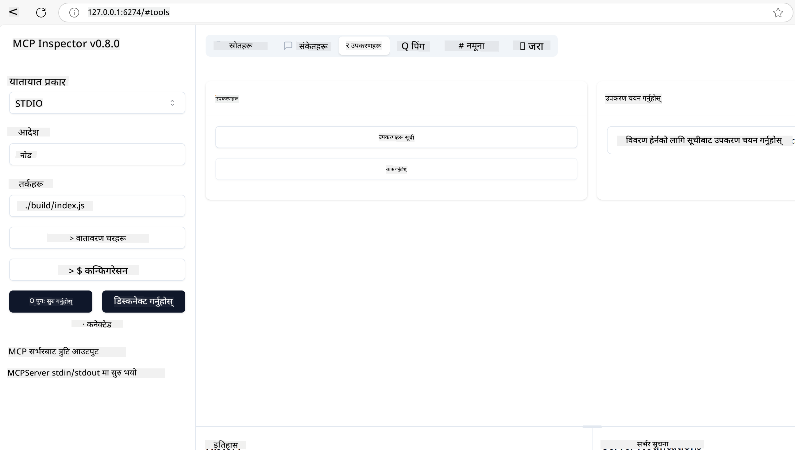
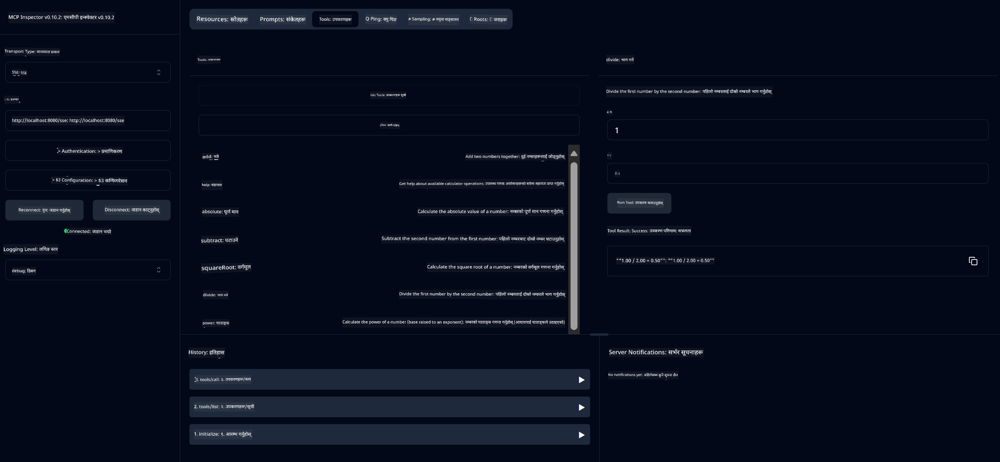
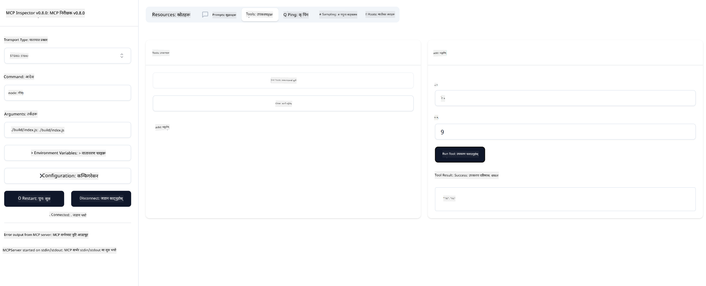

<!--
CO_OP_TRANSLATOR_METADATA:
{
  "original_hash": "ec11ee93f31fdadd94facd3e3d22f9e6",
  "translation_date": "2025-09-09T21:41:04+00:00",
  "source_file": "03-GettingStarted/01-first-server/README.md",
  "language_code": "ne"
}
-->
# MCP सुरु गर्न

Model Context Protocol (MCP) सँगको तपाईंको पहिलो कदममा स्वागत छ! चाहे तपाईं MCP मा नयाँ हुनुहुन्छ वा आफ्नो ज्ञानलाई गहिरो बनाउन चाहनुहुन्छ, यो मार्गदर्शकले तपाईंलाई आवश्यक सेटअप र विकास प्रक्रियामा लैजानेछ। तपाईंले MCP कसरी AI मोडेलहरू र एप्लिकेसनहरू बीच सहज एकीकरण सक्षम बनाउँछ भन्ने पत्ता लगाउनुहुनेछ, र MCP-संचालित समाधानहरू निर्माण र परीक्षण गर्न आफ्नो वातावरण छिटो तयार गर्ने तरिका सिक्नुहुनेछ।

> TLDR; यदि तपाईं AI एप्लिकेसनहरू निर्माण गर्नुहुन्छ भने, तपाईंले LLM (ठूलो भाषा मोडेल) लाई थप जानकार बनाउन उपकरणहरू र अन्य स्रोतहरू थप्न सक्नुहुन्छ। तर यदि तपाईंले ती उपकरणहरू र स्रोतहरू सर्भरमा राख्नुभयो भने, एप्लिकेसन र सर्भरको क्षमता कुनै पनि क्लाइन्टले LLM सहित/बिना प्रयोग गर्न सक्दछ।

## अवलोकन

यो पाठले MCP वातावरण सेटअप गर्ने र तपाईंको पहिलो MCP एप्लिकेसनहरू निर्माण गर्ने व्यावहारिक मार्गदर्शन प्रदान गर्दछ। तपाईंले आवश्यक उपकरणहरू र फ्रेमवर्कहरू सेटअप गर्ने, आधारभूत MCP सर्भरहरू निर्माण गर्ने, होस्ट एप्लिकेसनहरू सिर्जना गर्ने, र तपाईंको कार्यान्वयनहरू परीक्षण गर्ने तरिका सिक्नुहुनेछ।

Model Context Protocol (MCP) एक खुला प्रोटोकल हो जसले एप्लिकेसनहरूले LLM लाई सन्दर्भ प्रदान गर्ने तरिका मानकीकरण गर्दछ। MCP लाई AI एप्लिकेसनहरूको लागि USB-C पोर्ट जस्तै सोच्नुहोस् - यसले AI मोडेलहरूलाई विभिन्न डेटा स्रोतहरू र उपकरणहरूसँग जडान गर्न मानकीकृत तरिका प्रदान गर्दछ।

## सिक्ने उद्देश्यहरू

यो पाठको अन्त्यसम्ममा, तपाईं सक्षम हुनुहुनेछ:

- C#, Java, Python, TypeScript, र Rust मा MCP को लागि विकास वातावरण सेटअप गर्न
- स्रोतहरू, प्रम्प्टहरू, र उपकरणहरू सहित कस्टम सुविधाहरू भएको आधारभूत MCP सर्भरहरू निर्माण र तैनात गर्न
- MCP सर्भरहरूसँग जडान गर्ने होस्ट एप्लिकेसनहरू सिर्जना गर्न
- MCP कार्यान्वयनहरू परीक्षण र डिबग गर्न

## तपाईंको MCP वातावरण सेटअप गर्दै

MCP मा काम सुरु गर्नु अघि, तपाईंको विकास वातावरण तयार पार्नु र आधारभूत कार्यप्रवाह बुझ्नु महत्त्वपूर्ण छ। यो खण्डले MCP सँग सहज सुरुवात सुनिश्चित गर्न प्रारम्भिक सेटअप चरणहरूमा तपाईंलाई मार्गदर्शन गर्नेछ।

### पूर्वापेक्षाहरू

MCP विकासमा प्रवेश गर्नु अघि, सुनिश्चित गर्नुहोस् कि तपाईंसँग:

- **विकास वातावरण**: तपाईंले रोजेको भाषा (C#, Java, Python, TypeScript, वा Rust) को लागि
- **IDE/सम्पादक**: Visual Studio, Visual Studio Code, IntelliJ, Eclipse, PyCharm, वा कुनै पनि आधुनिक कोड सम्पादक
- **प्याकेज प्रबन्धकहरू**: NuGet, Maven/Gradle, pip, npm/yarn, वा Cargo
- **API कुञ्जीहरू**: तपाईंको होस्ट एप्लिकेसनहरूमा प्रयोग गर्न चाहनुभएको कुनै पनि AI सेवाहरूको लागि

## आधारभूत MCP सर्भर संरचना

MCP सर्भर सामान्यतया समावेश गर्दछ:

- **सर्भर कन्फिगरेसन**: पोर्ट, प्रमाणीकरण, र अन्य सेटिङहरू सेटअप गर्नुहोस्
- **स्रोतहरू**: LLM लाई उपलब्ध गराइएको डेटा र सन्दर्भ
- **उपकरणहरू**: मोडेलहरूले आह्वान गर्न सक्ने कार्यक्षमता
- **प्रम्प्टहरू**: पाठ उत्पन्न वा संरचना गर्नका लागि टेम्प्लेटहरू

TypeScript मा एक सरल उदाहरण यहाँ छ:

```typescript
import { McpServer, ResourceTemplate } from "@modelcontextprotocol/sdk/server/mcp.js";
import { StdioServerTransport } from "@modelcontextprotocol/sdk/server/stdio.js";
import { z } from "zod";

// Create an MCP server
const server = new McpServer({
  name: "Demo",
  version: "1.0.0"
});

// Add an addition tool
server.tool("add",
  { a: z.number(), b: z.number() },
  async ({ a, b }) => ({
    content: [{ type: "text", text: String(a + b) }]
  })
);

// Add a dynamic greeting resource
server.resource(
  "file",
  // The 'list' parameter controls how the resource lists available files. Setting it to undefined disables listing for this resource.
  new ResourceTemplate("file://{path}", { list: undefined }),
  async (uri, { path }) => ({
    contents: [{
      uri: uri.href,
      text: `File, ${path}!`
    }]
  })
);

// Add a file resource that reads the file contents
server.resource(
  "file",
  new ResourceTemplate("file://{path}", { list: undefined }),
  async (uri, { path }) => {
    let text;
    try {
      text = await fs.readFile(path, "utf8");
    } catch (err) {
      text = `Error reading file: ${err.message}`;
    }
    return {
      contents: [{
        uri: uri.href,
        text
      }]
    };
  }
);

server.prompt(
  "review-code",
  { code: z.string() },
  ({ code }) => ({
    messages: [{
      role: "user",
      content: {
        type: "text",
        text: `Please review this code:\n\n${code}`
      }
    }]
  })
);

// Start receiving messages on stdin and sending messages on stdout
const transport = new StdioServerTransport();
await server.connect(transport);
```

उपरोक्त कोडमा हामीले:

- MCP TypeScript SDK बाट आवश्यक कक्षाहरू आयात गरेका छौं।
- नयाँ MCP सर्भर उदाहरण सिर्जना र कन्फिगर गरेका छौं।
- कस्टम उपकरण (`calculator`) दर्ता गरेका छौं जसमा ह्यान्डलर फङ्क्सन छ।
- MCP अनुरोधहरूको लागि सर्भरलाई सुन्न सुरु गरेका छौं।

## परीक्षण र डिबग गर्दै

तपाईंको MCP सर्भर परीक्षण सुरु गर्नु अघि, उपलब्ध उपकरणहरू र डिबगका लागि उत्तम अभ्यासहरू बुझ्नु महत्त्वपूर्ण छ। प्रभावकारी परीक्षणले तपाईंको सर्भर अपेक्षित रूपमा व्यवहार गर्छ भन्ने सुनिश्चित गर्दछ र समस्याहरू छिटो पहिचान गर्न र समाधान गर्न मद्दत गर्दछ। निम्न खण्डले तपाईंको MCP कार्यान्वयनलाई मान्य गर्न सिफारिस गरिएका दृष्टिकोणहरू outlines गर्दछ।

MCP ले तपाईंलाई सर्भर परीक्षण र डिबग गर्न मद्दत गर्ने उपकरणहरू प्रदान गर्दछ:

- **Inspector tool**, यो ग्राफिकल इन्टरफेसले तपाईंलाई सर्भरसँग जडान गर्न र उपकरणहरू, प्रम्प्टहरू, र स्रोतहरू परीक्षण गर्न अनुमति दिन्छ।
- **curl**, तपाईं कमाण्ड लाइन उपकरण जस्तै curl वा HTTP कमाण्डहरू चलाउन सक्ने अन्य क्लाइन्टहरू प्रयोग गरेर पनि सर्भरसँग जडान गर्न सक्नुहुन्छ।

### MCP Inspector प्रयोग गर्दै

[MCP Inspector](https://github.com/modelcontextprotocol/inspector) एक दृश्य परीक्षण उपकरण हो जसले तपाईंलाई मद्दत गर्दछ:

1. **सर्भर क्षमताहरू पत्ता लगाउनुहोस्**: उपलब्ध स्रोतहरू, उपकरणहरू, र प्रम्प्टहरू स्वचालित रूपमा पत्ता लगाउनुहोस्
2. **उपकरण कार्यान्वयन परीक्षण गर्नुहोस्**: विभिन्न प्यारामिटरहरू प्रयास गर्नुहोस् र वास्तविक समयमा प्रतिक्रियाहरू हेर्नुहोस्
3. **सर्भर मेटाडाटा हेर्नुहोस्**: सर्भर जानकारी, स्कीमाहरू, र कन्फिगरेसनहरू जाँच गर्नुहोस्

```bash
# ex TypeScript, installing and running MCP Inspector
npx @modelcontextprotocol/inspector node build/index.js
```

जब तपाईं माथिका कमाण्डहरू चलाउनुहुन्छ, MCP Inspector ले तपाईंको ब्राउजरमा स्थानीय वेब इन्टरफेस सुरु गर्नेछ। तपाईंले आफ्नो दर्ता गरिएका MCP सर्भरहरू, तिनीहरूको उपलब्ध उपकरणहरू, स्रोतहरू, र प्रम्प्टहरू प्रदर्शन गर्ने ड्यासबोर्ड देख्न सक्नुहुन्छ। इन्टरफेसले तपाईंलाई अन्तरक्रियात्मक रूपमा उपकरण कार्यान्वयन परीक्षण गर्न, सर्भर मेटाडाटा निरीक्षण गर्न, र वास्तविक समय प्रतिक्रियाहरू हेर्न अनुमति दिन्छ, जसले तपाईंको MCP सर्भर कार्यान्वयनहरू मान्य र डिबग गर्न सजिलो बनाउँछ।

यो कस्तो देखिन सक्छ भन्ने स्क्रीनशट यहाँ छ:



## सामान्य सेटअप समस्याहरू र समाधानहरू

| समस्या | सम्भावित समाधान |
|-------|-------------------|
| जडान अस्वीकृत | सर्भर चलिरहेको छ र पोर्ट सही छ भनेर जाँच गर्नुहोस् |
| उपकरण कार्यान्वयन त्रुटिहरू | प्यारामिटर मान्यकरण र त्रुटि ह्यान्डलिंग समीक्षा गर्नुहोस् |
| प्रमाणीकरण असफलता | API कुञ्जीहरू र अनुमतिहरू प्रमाणित गर्नुहोस् |
| स्कीमा मान्यकरण त्रुटिहरू | प्यारामिटरहरू परिभाषित स्कीमासँग मेल खान सुनिश्चित गर्नुहोस् |
| सर्भर सुरु नभएको | पोर्ट द्वन्द्व वा हराइरहेको निर्भरता जाँच गर्नुहोस् |
| CORS त्रुटिहरू | क्रस-ओरिजिन अनुरोधहरूको लागि उचित CORS हेडरहरू कन्फिगर गर्नुहोस् |
| प्रमाणीकरण समस्याहरू | टोकनको वैधता र अनुमतिहरू प्रमाणित गर्नुहोस् |

## स्थानीय विकास

स्थानीय विकास र परीक्षणको लागि, तपाईं आफ्नो मेसिनमा MCP सर्भरहरू सिधै चलाउन सक्नुहुन्छ:

1. **सर्भर प्रक्रिया सुरु गर्नुहोस्**: आफ्नो MCP सर्भर एप्लिकेसन चलाउनुहोस्
2. **नेटवर्किङ कन्फिगर गर्नुहोस्**: सर्भर अपेक्षित पोर्टमा पहुँचयोग्य छ भनेर सुनिश्चित गर्नुहोस्
3. **क्लाइन्टहरू जडान गर्नुहोस्**: `http://localhost:3000` जस्ता स्थानीय जडान URL हरू प्रयोग गर्नुहोस्

```bash
# Example: Running a TypeScript MCP server locally
npm run start
# Server running at http://localhost:3000
```

## तपाईंको पहिलो MCP सर्भर निर्माण गर्दै

हामीले [मुख्य अवधारणाहरू](/01-CoreConcepts/README.md) अघिल्लो पाठमा समेटेका छौं, अब त्यो ज्ञानलाई काममा लगाउने समय हो।

### सर्भरले के गर्न सक्छ

कोड लेख्न सुरु गर्नु अघि, सर्भरले के गर्न सक्छ भन्ने कुरा सम्झौं:

MCP सर्भरले उदाहरणका लागि:

- स्थानीय फाइलहरू र डेटाबेसहरू पहुँच गर्न सक्छ
- टाढाको API हरूसँग जडान गर्न सक्छ
- गणनाहरू गर्न सक्छ
- अन्य उपकरणहरू र सेवाहरूको साथ एकीकृत गर्न सक्छ
- अन्तरक्रियाको लागि प्रयोगकर्ता इन्टरफेस प्रदान गर्न सक्छ

ठीक छ, अब हामीलाई थाहा छ कि यसले के गर्न सक्छ, कोडिङ सुरु गरौं।


**तपाईं अब सर्भरमा जडान हुनुभयो**
**जाभा सर्भर परीक्षण खण्ड अब पूरा भयो**

अर्को खण्ड सर्भरसँग अन्तरक्रिया गर्ने बारेमा छ।

तपाईंले निम्न प्रयोगकर्ता इन्टरफेस देख्नुपर्छ:


1. "Connect" बटन चयन गरेर सर्भरमा जडान गर्नुहोस्।  
   सर्भरमा जडान भएपछि, तपाईंले अब निम्न देख्नुपर्छ:

   

1. "Tools" र "listTools" चयन गर्नुहोस्। तपाईंले "Add" देख्नुपर्छ। "Add" चयन गर्नुहोस् र प्यारामिटर मानहरू भर्नुहोस्।

   तपाईंले निम्न प्रतिक्रिया देख्नुपर्छ, अर्थात् "add" टूलबाट प्राप्त परिणाम:

   

बधाई छ, तपाईंले आफ्नो पहिलो सर्भर सिर्जना र चलाउन सफल हुनुभयो!

#### Rust

MCP Inspector CLI प्रयोग गरेर Rust सर्भर चलाउन निम्न कमाण्ड प्रयोग गर्नुहोस्:

```sh
npx @modelcontextprotocol/inspector cargo run --cli --method tools/call --tool-name add --tool-arg a=1 b=2
```

### आधिकारिक SDKs

MCP विभिन्न भाषाहरूका लागि आधिकारिक SDKs प्रदान गर्दछ:

- [C# SDK](https://github.com/modelcontextprotocol/csharp-sdk) - माइक्रोसफ्टसँगको सहकार्यमा व्यवस्थापन गरिएको
- [Java SDK](https://github.com/modelcontextprotocol/java-sdk) - Spring AIसँगको सहकार्यमा व्यवस्थापन गरिएको
- [TypeScript SDK](https://github.com/modelcontextprotocol/typescript-sdk) - आधिकारिक TypeScript कार्यान्वयन
- [Python SDK](https://github.com/modelcontextprotocol/python-sdk) - आधिकारिक Python कार्यान्वयन
- [Kotlin SDK](https://github.com/modelcontextprotocol/kotlin-sdk) - आधिकारिक Kotlin कार्यान्वयन
- [Swift SDK](https://github.com/modelcontextprotocol/swift-sdk) - Loopwork AIसँगको सहकार्यमा व्यवस्थापन गरिएको
- [Rust SDK](https://github.com/modelcontextprotocol/rust-sdk) - आधिकारिक Rust कार्यान्वयन

## मुख्य बुँदाहरू

- MCP विकास वातावरण सेटअप भाषा-विशिष्ट SDKs प्रयोग गरेर सजिलो छ।
- MCP सर्भरहरू निर्माण गर्दा स्पष्ट स्किमासहित टूलहरू सिर्जना र दर्ता गर्नुपर्छ।
- परीक्षण र डिबगिङ विश्वसनीय MCP कार्यान्वयनहरूको लागि आवश्यक छ।

## नमूनाहरू

- [Java Calculator](../samples/java/calculator/README.md)
- [.Net Calculator](../../../../03-GettingStarted/samples/csharp)
- [JavaScript Calculator](../samples/javascript/README.md)
- [TypeScript Calculator](../samples/typescript/README.md)
- [Python Calculator](../../../../03-GettingStarted/samples/python)
- [Rust Calculator](../../../../03-GettingStarted/samples/rust)

## असाइनमेन्ट

आफ्नो रोजाइको टूलको साथमा एक साधारण MCP सर्भर सिर्जना गर्नुहोस्:

1. आफ्नो मनपर्ने भाषामा टूल कार्यान्वयन गर्नुहोस् (.NET, Java, Python, TypeScript, वा Rust)।  
2. इनपुट प्यारामिटरहरू र रिटर्न मानहरू परिभाषित गर्नुहोस्।  
3. सर्भरले अपेक्षित रूपमा काम गरिरहेको सुनिश्चित गर्न इन्स्पेक्टर टूल चलाउनुहोस्।  
4. विभिन्न इनपुटहरूसँग कार्यान्वयन परीक्षण गर्नुहोस्।

## समाधान

[Solution](./solution/README.md)

## थप स्रोतहरू

- [Azure मा Model Context Protocol प्रयोग गरेर एजेन्टहरू निर्माण गर्नुहोस्](https://learn.microsoft.com/azure/developer/ai/intro-agents-mcp)
- [Azure Container Apps (Node.js/TypeScript/JavaScript) प्रयोग गरेर Remote MCP](https://learn.microsoft.com/samples/azure-samples/mcp-container-ts/mcp-container-ts/)
- [.NET OpenAI MCP Agent](https://learn.microsoft.com/samples/azure-samples/openai-mcp-agent-dotnet/openai-mcp-agent-dotnet/)

## अब के गर्ने

अर्को: [MCP Clients को साथमा सुरु गर्नुहोस्](../02-client/README.md)

---

**अस्वीकरण**:  
यो दस्तावेज़ AI अनुवाद सेवा [Co-op Translator](https://github.com/Azure/co-op-translator) प्रयोग गरेर अनुवाद गरिएको छ। हामी शुद्धताको लागि प्रयास गर्छौं, तर कृपया ध्यान दिनुहोस् कि स्वचालित अनुवादमा त्रुटिहरू वा अशुद्धताहरू हुन सक्छ। यसको मूल भाषा मा रहेको मूल दस्तावेज़लाई आधिकारिक स्रोत मानिनुपर्छ। महत्वपूर्ण जानकारीको लागि, व्यावसायिक मानव अनुवाद सिफारिस गरिन्छ। यस अनुवादको प्रयोगबाट उत्पन्न हुने कुनै पनि गलतफहमी वा गलत व्याख्याको लागि हामी जिम्मेवार हुने छैनौं।