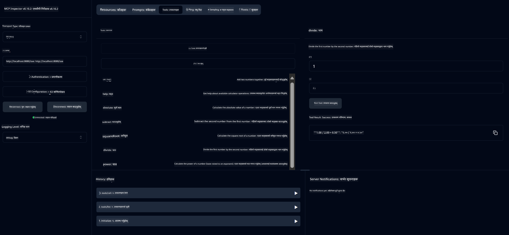

<!--
CO_OP_TRANSLATOR_METADATA:
{
  "original_hash": "ed9cab32cc67c12d8969b407aa47100a",
  "translation_date": "2025-06-11T09:31:10+00:00",
  "source_file": "03-GettingStarted/01-first-server/solution/java/README.md",
  "language_code": "ne"
}
-->
# Basic Calculator MCP सेवा

यो सेवा Model Context Protocol (MCP) मार्फत Spring Boot सँग WebFlux ट्रान्सपोर्ट प्रयोग गरेर आधारभूत क्याल्कुलेटर अपरेसनहरू प्रदान गर्दछ। यो MCP इम्प्लिमेन्टेसनहरू सिक्न चाहने सुरुवातीहरूका लागि सरल उदाहरणको रूपमा डिजाइन गरिएको हो।

थप जानकारीको लागि, [MCP Server Boot Starter](https://docs.spring.io/spring-ai/reference/api/mcp/mcp-server-boot-starter-docs.html) सन्दर्भ दस्तावेज हेर्नुहोस्।


## सेवाको प्रयोग

सेवाले MCP प्रोटोकलमार्फत तलका API endpoints प्रदान गर्दछ:

- `add(a, b)`: दुई संख्याहरू जोड्नुहोस्
- `subtract(a, b)`: दोस्रो संख्या पहिलोबाट घटाउनुहोस्
- `multiply(a, b)`: दुई संख्याहरू गुणा गर्नुहोस्
- `divide(a, b)`: पहिलो संख्या दोस्रोले भाग गर्नुहोस् (शून्य जाँचसहित)
- `power(base, exponent)`: कुनै संख्याको घात निकाल्नुहोस्
- `squareRoot(number)`: वर्गमूल निकाल्नुहोस् (ऋण संख्या जाँचसहित)
- `modulus(a, b)`: भाग गर्दा बाँकी रहेको भाग निकाल्नुहोस्
- `absolute(number)`: पूर्णांक मान निकाल्नुहोस्

## निर्भरता

परियोजनाले तलका मुख्य निर्भरता आवश्यक पर्छ:

```xml
<dependency>
    <groupId>org.springframework.ai</groupId>
    <artifactId>spring-ai-starter-mcp-server-webflux</artifactId>
</dependency>
```

## परियोजना बनाउने तरिका

Maven प्रयोग गरी परियोजना बनाउनुहोस्:
```bash
./mvnw clean install -DskipTests
```

## सर्भर चलाउने तरिका

### Java प्रयोग गरेर

```bash
java -jar target/calculator-server-0.0.1-SNAPSHOT.jar
```

### MCP Inspector प्रयोग गरेर

MCP Inspector MCP सेवाहरूसँग अन्तरक्रिया गर्न सहयोगी उपकरण हो। यस क्याल्कुलेटर सेवासँग यसलाई प्रयोग गर्न:

1. **MCP Inspector इन्स्टल गरी चलाउनुहोस्** नयाँ टर्मिनल विन्डोमा:
   ```bash
   npx @modelcontextprotocol/inspector
   ```

2. **वेब UI पहुँच गर्नुहोस्** एपले देखाएको URL मा क्लिक गरेर (सामान्यतया http://localhost:6274)

3. **कनेक्शन सेटअप गर्नुहोस्**:
   - ट्रान्सपोर्ट प्रकार "SSE" मा सेट गर्नुहोस्
   - आफ्नो चलिरहेको सर्भरको SSE endpoint URL राख्नुहोस्: `http://localhost:8080/sse`
   - "Connect" मा क्लिक गर्नुहोस्

4. **उपकरणहरू प्रयोग गर्नुहोस्**:
   - उपलब्ध क्याल्कुलेटर अपरेसनहरू हेर्न "List Tools" मा क्लिक गर्नुहोस्
   - उपकरण चयन गरी "Run Tool" मा क्लिक गरी अपरेसन चलाउनुहोस्



**अस्वीकरण**:  
यो दस्तावेज AI अनुवाद सेवा [Co-op Translator](https://github.com/Azure/co-op-translator) प्रयोग गरी अनुवाद गरिएको हो। हामी शुद्धताका लागि प्रयासरत छौं, तर कृपया ध्यान दिनुहोस् कि स्वचालित अनुवादमा त्रुटि वा गलतफहमी हुन सक्छ। मूल दस्तावेज यसको स्वदेशी भाषामा नै आधिकारिक स्रोत मानिनुपर्छ। महत्वपूर्ण जानकारीको लागि व्यावसायिक मानव अनुवाद सिफारिस गरिन्छ। यस अनुवादको प्रयोगबाट उत्पन्न कुनै पनि गलतफहमी वा गलत व्याख्याको लागि हामी जिम्मेवार छैनौं।