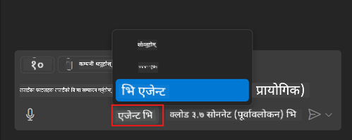
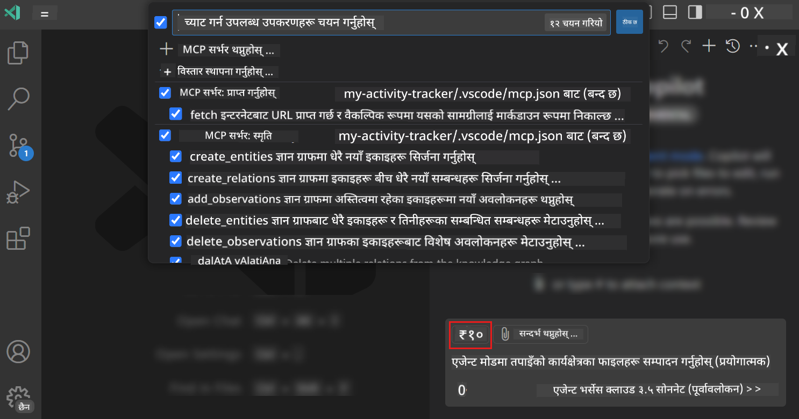
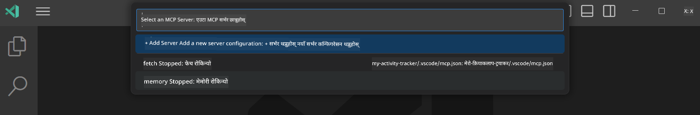
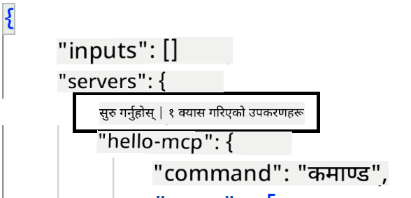
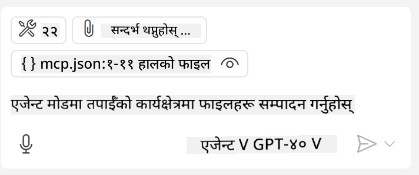
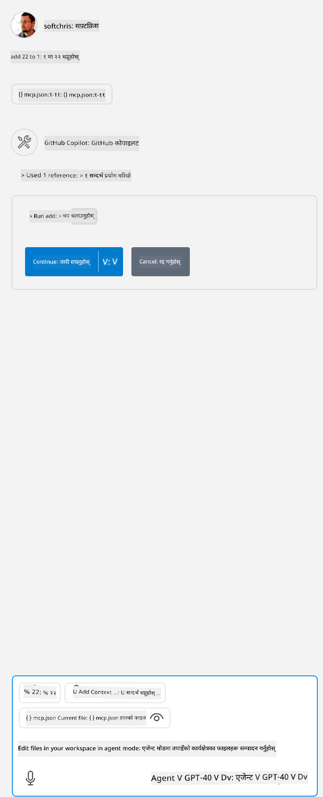

<!--
CO_OP_TRANSLATOR_METADATA:
{
  "original_hash": "d940b5e0af75e3a3a4d1c3179120d1d9",
  "translation_date": "2025-08-26T17:32:29+00:00",
  "source_file": "03-GettingStarted/04-vscode/README.md",
  "language_code": "ne"
}
-->
# GitHub Copilot Agent मोडबाट सर्भर प्रयोग गर्ने

Visual Studio Code र GitHub Copilot क्लाइन्टको रूपमा काम गर्न सक्छन् र MCP सर्भर प्रयोग गर्न सक्छन्। तपाईंले सोध्न सक्नुहुन्छ, किन हामीले यो गर्न चाहन्छौं? खैर, यसको मतलब MCP सर्भरमा भएका सबै सुविधाहरू अब तपाईंको IDE भित्रबाट प्रयोग गर्न सकिन्छ। कल्पना गर्नुहोस्, उदाहरणका लागि, तपाईंले GitHub को MCP सर्भर थप्नुभयो भने, यसले तपाईंलाई टर्मिनलमा विशेष आदेशहरू टाइप नगरी प्रॉम्प्टहरू मार्फत GitHub नियन्त्रण गर्न अनुमति दिनेछ। वा सामान्य रूपमा कुनै पनि कुरा जसले तपाईंको डेभलपर अनुभव सुधार गर्न सक्छ, सबै प्राकृतिक भाषाबाट नियन्त्रण गर्न सकिन्छ। अब तपाईंले यसको फाइदा देख्न थाल्नुभयो, हैन?

## अवलोकन

यो पाठले कसरी Visual Studio Code र GitHub Copilot को Agent मोडलाई MCP सर्भरको क्लाइन्टको रूपमा प्रयोग गर्ने भन्ने कुरा समेट्छ।

## सिकाइ उद्देश्यहरू

यो पाठको अन्त्यसम्ममा, तपाईंले गर्न सक्नुहुनेछ:

- Visual Studio Code मार्फत MCP सर्भर प्रयोग गर्नुहोस्।
- GitHub Copilot मार्फत उपकरणहरू जस्ता क्षमताहरू चलाउनुहोस्।
- Visual Studio Code लाई तपाईंको MCP सर्भर फेला पार्न र व्यवस्थापन गर्न कन्फिगर गर्नुहोस्।

## प्रयोग

तपाईं आफ्नो MCP सर्भरलाई दुई फरक तरिकाले नियन्त्रण गर्न सक्नुहुन्छ:

- प्रयोगकर्ता इन्टरफेस, यो कसरी गरिन्छ भन्ने कुरा यस अध्यायमा पछि देखाइनेछ।
- टर्मिनल, `code` executable प्रयोग गरेर टर्मिनलबाट चीजहरू नियन्त्रण गर्न सम्भव छ:

  आफ्नो प्रयोगकर्ता प्रोफाइलमा MCP सर्भर थप्न, `--add-mcp` कमाण्ड लाइन विकल्प प्रयोग गर्नुहोस्, र JSON सर्भर कन्फिगरेसन {\"name\":\"server-name\",\"command\":...} को रूपमा प्रदान गर्नुहोस्।

  ```
  code --add-mcp "{\"name\":\"my-server\",\"command\": \"uvx\",\"args\": [\"mcp-server-fetch\"]}"
  ```

### स्क्रिनसटहरू

  
  
  

अर्को खण्डहरूमा हामीले दृश्य इन्टरफेस कसरी प्रयोग गर्ने भन्ने कुरा थप छलफल गर्नेछौं।

## दृष्टिकोण

हामीले यो उच्च स्तरमा यसरी दृष्टिकोण गर्नुपर्छ:

- हाम्रो MCP सर्भर फेला पार्न फाइल कन्फिगर गर्नुहोस्।
- सर्भर सुरु/जोड्नुहोस् र यसको क्षमताहरू सूचीबद्ध गर्न लगाउनुहोस्।
- GitHub Copilot Chat इन्टरफेस मार्फत ती क्षमताहरू प्रयोग गर्नुहोस्।

ठीक छ, अब हामीले प्रवाह बुझ्यौं, Visual Studio Code मार्फत MCP सर्भर प्रयोग गर्ने अभ्यास गरौं।

## अभ्यास: सर्भर प्रयोग गर्नुहोस्

यस अभ्यासमा, हामी Visual Studio Code लाई तपाईंको MCP सर्भर फेला पार्न कन्फिगर गर्नेछौं ताकि यो GitHub Copilot Chat इन्टरफेसबाट प्रयोग गर्न सकियोस्।

### -0- प्रारम्भिक चरण, MCP सर्भर खोजी सक्षम गर्नुहोस्

तपाईंले MCP सर्भरहरूको खोजी सक्षम गर्न आवश्यक पर्न सक्छ।

1. Visual Studio Code मा `File -> Preferences -> Settings` मा जानुहोस्।  

1. "MCP" खोज्नुहोस् र `chat.mcp.discovery.enabled` लाई settings.json फाइलमा सक्षम गर्नुहोस्।

### -1- कन्फिग फाइल बनाउनुहोस्

तपाईंको प्रोजेक्टको रुटमा कन्फिग फाइल बनाएर सुरु गर्नुहोस्। तपाईंलाई *MCP.json* नामको फाइल चाहिन्छ र यसलाई .vscode नामको फोल्डरमा राख्नुपर्छ। यो यसरी देखिनुपर्छ:

```text
.vscode
|-- mcp.json
```

अब, सर्भर प्रविष्टि कसरी थप्ने भनेर हेरौं।

### -2- सर्भर कन्फिगर गर्नुहोस्

*MCP.json* मा निम्न सामग्री थप्नुहोस्:

```json
{
    "inputs": [],
    "servers": {
       "hello-mcp": {
           "command": "node",
           "args": [
               "build/index.js"
           ]
       }
    }
}
```

यहाँ Node.js मा लेखिएको सर्भर सुरु गर्ने एउटा साधारण उदाहरण छ। अन्य रनटाइमहरूको लागि, सर्भर सुरु गर्न उपयुक्त `command` र `args` निर्दिष्ट गर्नुहोस्।

### -3- सर्भर सुरु गर्नुहोस्

अब तपाईंले प्रविष्टि थप्नुभयो, सर्भर सुरु गरौं:

1. *MCP.json* मा तपाईंको प्रविष्टि फेला पार्नुहोस् र "play" आइकन सुनिश्चित गर्नुहोस्:

    

1. "play" आइकनमा क्लिक गर्नुहोस्। तपाईंले GitHub Copilot Chat मा उपकरणहरूको संख्या बढेको देख्नुहुनेछ। यदि तपाईंले उक्त उपकरण आइकनमा क्लिक गर्नुभयो भने, तपाईंले दर्ता गरिएका उपकरणहरूको सूची देख्नुहुनेछ। तपाईंले प्रत्येक उपकरणलाई GitHub Copilot ले सन्दर्भको रूपमा प्रयोग गर्ने हो वा होइन भनेर जाँच/अनजाँच गर्न सक्नुहुन्छ:

  

1. उपकरण चलाउन, तपाईंले उपकरणको विवरणसँग मेल खाने प्रॉम्प्ट टाइप गर्नुहोस्, उदाहरणका लागि यस्तो प्रॉम्प्ट: "add 22 to 1":

  

  तपाईंले 23 भन्ने प्रतिक्रिया देख्नुहुनेछ।

## असाइनमेन्ट

तपाईंको *MCP.json* फाइलमा सर्भर प्रविष्टि थप्ने प्रयास गर्नुहोस् र सर्भर सुरु/बन्द गर्न सुनिश्चित गर्नुहोस्। GitHub Copilot Chat इन्टरफेस मार्फत तपाईंको सर्भरका उपकरणहरूसँग संवाद गर्न सक्ने सुनिश्चित गर्नुहोस्।

## समाधान

[Solution](./solution/README.md)

## मुख्य बुँदाहरू

यस अध्यायबाट मुख्य बुँदाहरू निम्न छन्:

- Visual Studio Code एक उत्कृष्ट क्लाइन्ट हो जसले तपाईंलाई धेरै MCP सर्भरहरू र तिनका उपकरणहरू प्रयोग गर्न दिन्छ।
- GitHub Copilot Chat इन्टरफेस सर्भरहरूसँग अन्तरक्रिया गर्ने तरिका हो।
- तपाईंले API कुञ्जीहरू जस्ता इनपुटहरू प्रयोगकर्ताबाट सोध्न सक्नुहुन्छ, जसलाई *MCP.json* फाइलमा सर्भर प्रविष्टि कन्फिगर गर्दा MCP सर्भरमा पास गर्न सकिन्छ।

## नमूनाहरू

- [Java Calculator](../samples/java/calculator/README.md)  
- [.Net Calculator](../../../../03-GettingStarted/samples/csharp)  
- [JavaScript Calculator](../samples/javascript/README.md)  
- [TypeScript Calculator](../samples/typescript/README.md)  
- [Python Calculator](../../../../03-GettingStarted/samples/python)  

## थप स्रोतहरू

- [Visual Studio docs](https://code.visualstudio.com/docs/copilot/chat/mcp-servers)

## अब के गर्ने

- अगाडि: [Creating a stdio Server](../05-stdio-server/README.md)  

---

**अस्वीकरण**:  
यो दस्तावेज़ AI अनुवाद सेवा [Co-op Translator](https://github.com/Azure/co-op-translator) प्रयोग गरी अनुवाद गरिएको हो। हामी यथासम्भव सटीकता सुनिश्चित गर्न प्रयास गर्छौं, तर कृपया ध्यान दिनुहोस् कि स्वचालित अनुवादहरूमा त्रुटि वा अशुद्धि हुन सक्छ। यसको मूल भाषामा रहेको मूल दस्तावेज़लाई आधिकारिक स्रोत मानिनुपर्छ। महत्त्वपूर्ण जानकारीका लागि, व्यावसायिक मानव अनुवाद सिफारिस गरिन्छ। यस अनुवादको प्रयोगबाट उत्पन्न हुने कुनै पनि गलतफहमी वा गलत व्याख्याका लागि हामी जिम्मेवार हुने छैनौं।