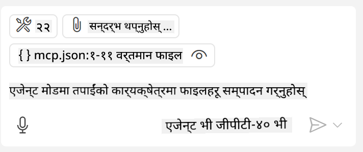

<!--
CO_OP_TRANSLATOR_METADATA:
{
  "original_hash": "c37fabfbc0dcbc9a4afb6d17e7d3be9f",
  "translation_date": "2025-05-17T11:05:04+00:00",
  "source_file": "03-GettingStarted/04-vscode/README.md",
  "language_code": "ne"
}
-->
GitHub Copilot Agent मोडबाट सर्भरको उपभोग गर्ने

Visual Studio Code र GitHub Copilot क्लाइन्टको रूपमा कार्य गर्न सक्छन् र MCP सर्भरको उपभोग गर्न सक्छन्। तपाईंले सोध्न सक्नुहुन्छ, हामीले किन यो गर्न चाहन्छौं? खैर, यसको अर्थ जे जति सुविधाहरू MCP सर्भरमा छन् ती अब तपाईंको IDE भित्रबाट प्रयोग गर्न सकिन्छ। कल्पना गर्नुहोस् कि तपाईंले GitHub को MCP सर्भर थप्नुभयो भने, यसले टर्मिनलमा विशेष आदेशहरू टाइप नगरी GitHub लाई प्रॉम्प्ट मार्फत नियन्त्रण गर्न अनुमति दिनेछ। वा कुनै पनि कुराको कल्पना गर्नुहोस् जसले तपाईंको डेभलपर अनुभवलाई प्राकृतिक भाषाबाट नियन्त्रण गरेर सुधार गर्न सक्छ। अब तपाईंले फाइदा देख्न थाल्नु भयो हैन?

## अवलोकन

यस पाठमा कसरी Visual Studio Code र GitHub Copilot को Agent मोडलाई तपाईंको MCP सर्भरको लागि क्लाइन्टको रूपमा प्रयोग गर्ने भन्ने कुरा समेटिएको छ।

## सिक्ने उद्देश्यहरू

यस पाठको अन्त्यसम्ममा, तपाईं सक्षम हुनुहुनेछ:

- Visual Studio Code मार्फत MCP सर्भरको उपभोग गर्न।
- GitHub Copilot मार्फत उपकरणहरू जस्ता क्षमताहरू चलाउन।
- Visual Studio Code लाई तपाईंको MCP सर्भर फेला पार्न र व्यवस्थापन गर्न कन्फिगर गर्न।

## प्रयोग

तपाईं आफ्नो MCP सर्भरलाई दुई फरक तरिकाले नियन्त्रण गर्न सक्नुहुन्छ:

- प्रयोगकर्ता इन्टरफेस, यो कसरी गरिन्छ भन्ने कुरा तपाईंले यस अध्यायमा पछि देख्नुहुनेछ।
- टर्मिनल, टर्मिनलबाट `code` कार्यान्वयन प्रयोग गरेर चीजहरू नियन्त्रण गर्न सम्भव छ:

  तपाईंको प्रयोगकर्ता प्रोफाइलमा MCP सर्भर थप्न, --add-mcp कमाण्ड लाइन विकल्प प्रयोग गर्नुहोस्, र JSON सर्भर कन्फिगरेसनलाई {\"name\":\"server-name\",\"command\":...} को रूपमा प्रदान गर्नुहोस्।

  ```
  code --add-mcp "{\"name\":\"my-server\",\"command\": \"uvx\",\"args\": [\"mcp-server-fetch\"]}"
  ```
तपाईंलाई अक्टोबर २०२३ सम्मको डाटामा तालिम दिइएको छ।

आउनुहोस्, अब हामीले भिजुअल इन्टरफेस कसरी प्रयोग गर्ने भन्ने कुरा अगाडि आउने खण्डहरूमा छलफल गरौं।

## दृष्टिकोण

हामीले यसलाई उच्च स्तरमा कसरी दृष्टिकोण गर्नुपर्ने हो:

- हाम्रो MCP सर्भर फेला पार्नको लागि एउटा फाइल कन्फिगर गर्नुहोस्।
- सर्भर सुरु गर्नुहोस्/जडान गर्नुहोस् ताकि यसले यसको क्षमताहरू सूचीबद्ध गर्न सक्छ।
- GitHub Copilot को च्याट इन्टरफेस मार्फत ती क्षमताहरू प्रयोग गर्नुहोस्।

राम्रो, अब हामीले प्रवाह बुझिसकेपछि, Visual Studio Code मार्फत MCP सर्भर प्रयोग गर्ने प्रयास गरौं।

## अभ्यास: सर्भरको उपभोग गर्ने

यस अभ्यासमा, हामी Visual Studio Code लाई तपाईंको MCP सर्भर फेला पार्न कन्फिगर गर्नेछौं ताकि यो GitHub Copilot को च्याट इन्टरफेसबाट प्रयोग गर्न सकिन्छ।

### -0- प्रारम्भिक चरण, MCP सर्भर खोजी सक्षम गर्नुहोस्

तपाईंले MCP सर्भरहरूको खोजी सक्षम गर्न आवश्यक हुन सक्छ।

1. `File -> Preferences -> Settings` in Visual Studio Code.

1. Search for "MCP" and enable `chat.mcp.discovery.enabled` मा जानुहोस् र settings.json फाइलमा खोजी सक्षम गर्नुहोस्।

### -1- कन्फिग फाइल बनाउनुहोस्

तपाईंको प्रोजेक्ट रुटमा कन्फिग फाइल बनाएर सुरु गर्नुहोस्, तपाईंलाई MCP.json नामको फाइल चाहिन्छ र यसलाई .vscode नामको फोल्डरमा राख्नुहोस्। यसले यसरी देखिनु पर्छ:

```text
.vscode
|-- mcp.json
```

अर्को, हामी कसरी सर्भर प्रविष्टि थप्न सक्छौं भन्ने कुरा हेरौं।

### -2- सर्भर कन्फिगर गर्नुहोस्

*mcp.json* मा निम्न सामग्री थप्नुहोस्:

```json
{
    "inputs": [],
    "servers": {
       "hello-mcp": {
           "command": "cmd",
           "args": [
               "/c", "node", "<absolute path>\\build\\index.js"
           ]
       }
    }
}
```

यहाँ Node.js मा लेखिएको सर्भर सुरु गर्ने सरल उदाहरण छ, अन्य रनटाइमहरूको लागि सर्भर सुरु गर्ने उचित कमाण्डलाई `command` and `args` प्रयोग गरेर देखाउनुहोस्।

### -3- सर्भर सुरु गर्नुहोस्

अब तपाईंले प्रविष्टि थप्नुभयो, सर्भर सुरु गरौं:

1. *mcp.json* मा तपाईंको प्रविष्टि खोज्नुहोस् र "play" आइकन फेला पार्न निश्चित गर्नुहोस्:

    

1. "play" आइकनमा क्लिक गर्नुहोस्, तपाईंले GitHub Copilot च्याटमा उपलब्ध उपकरणहरूको संख्या बढेको देख्नु पर्छ। यदि तपाईंले उक्त उपकरण आइकनमा क्लिक गर्नुभयो भने, तपाईंले दर्ता गरिएका उपकरणहरूको सूची देख्नुहुनेछ। तपाईंले GitHub Copilot लाई तिनीहरूलाई सन्दर्भको रूपमा प्रयोग गर्न चाहनुहुन्छ वा छैन भनेर प्रत्येक उपकरणलाई जाँच/अनचेक गर्न सक्नुहुन्छ: 

  

1. उपकरण चलाउन, तपाईंले आफ्नो उपकरणहरूको वर्णनसँग मेल खाने प्रॉम्प्ट टाइप गर्नुहोस्, उदाहरणका लागि यस्तो प्रॉम्प्ट "२२ मा १ थप्नुहोस्":

  

  तपाईंले २३ भन्ने प्रतिक्रिया देख्नु पर्छ।

## असाइनमेन्ट

तपाईंको *mcp.json* फाइलमा सर्भर प्रविष्टि थप्ने प्रयास गर्नुहोस् र तपाईं सर्भर सुरु/रोक्न सक्षम हुनुहुन्छ भनेर सुनिश्चित गर्नुहोस्। तपाईं GitHub Copilot को च्याट इन्टरफेस मार्फत तपाईंको सर्भरमा रहेका उपकरणहरूसँग पनि संवाद गर्न सक्षम हुनुहुन्छ भनेर सुनिश्चित गर्नुहोस्।

## समाधान

[समाधान](./solution/README.md)

## मुख्य कुरा

यस अध्यायको मुख्य कुरा निम्न छन्:

- Visual Studio Code एउटा उत्कृष्ट क्लाइन्ट हो जसले तपाईंलाई धेरै MCP सर्भरहरू र तिनीहरूको उपकरणहरूको उपभोग गर्न अनुमति दिन्छ।
- GitHub Copilot को च्याट इन्टरफेसले सर्भरहरूसँग कसरी अन्तरक्रिया गर्ने हो।
- तपाईं *mcp.json* फाइलमा सर्भर प्रविष्टि कन्फिगर गर्दा MCP सर्भरमा पास गर्न सकिने API कुञ्जीहरू जस्ता इनपुटहरूको लागि प्रयोगकर्तालाई प्रॉम्प्ट गर्न सक्नुहुन्छ।

## नमूनाहरू

- [Java क्यालकुलेटर](../samples/java/calculator/README.md)
- [.Net क्यालकुलेटर](../../../../03-GettingStarted/samples/csharp)
- [JavaScript क्यालकुलेटर](../samples/javascript/README.md)
- [TypeScript क्यालकुलेटर](../samples/typescript/README.md)
- [Python क्यालकुलेटर](../../../../03-GettingStarted/samples/python)

## अतिरिक्त स्रोतहरू

- [Visual Studio दस्तावेजहरू](https://code.visualstudio.com/docs/copilot/chat/mcp-servers)

## के आउँदैछ

- अर्को: [SSE सर्भर बनाउने](/03-GettingStarted/05-sse-server/README.md)

**अस्वीकरण**:  
यो दस्तावेज़ AI अनुवाद सेवा [Co-op Translator](https://github.com/Azure/co-op-translator) प्रयोग गरेर अनुवाद गरिएको हो। हामी शुद्धताको लागि प्रयास गर्छौं, तर कृपया ध्यान दिनुहोस् कि स्वचालित अनुवादमा त्रुटिहरू वा अशुद्धताहरू हुन सक्छ। यसको मूल भाषा मा रहेको दस्तावेज़लाई आधिकारिक स्रोत मान्नुपर्छ। महत्वपूर्ण जानकारीको लागि, पेशेवर मानव अनुवाद सिफारिस गरिन्छ। यस अनुवादको प्रयोगबाट उत्पन्न हुने कुनै पनि गलतफहमी वा गलत व्याख्याका लागि हामी जिम्मेवार हुनेछैनौं।