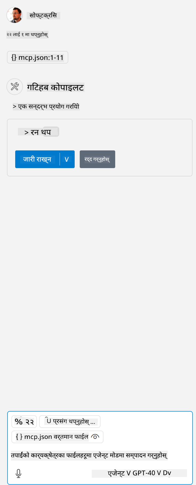

<!--
CO_OP_TRANSLATOR_METADATA:
{
  "original_hash": "96e08a8c1049dab757deb64cce4ea1e8",
  "translation_date": "2025-05-17T11:19:58+00:00",
  "source_file": "03-GettingStarted/04-vscode/solution/README.md",
  "language_code": "ne"
}
-->
# नमुना चलाउनुहोस्

यहाँ हामीले मान्य छ कि तपाईंसँग पहिले नै कार्यरत सर्भर कोड छ। कृपया पहिलेका अध्यायहरूबाट कुनै सर्भर खोज्नुहोस्।

## mcp.json सेट अप गर्नुहोस्

यहाँ तपाईँले सन्दर्भको लागि प्रयोग गर्ने फाइल हो, [mcp.json](../../../../../03-GettingStarted/04-vscode/solution/mcp.json)।

आवश्यकताअनुसार सर्भर प्रविष्टि परिवर्तन गर्नुहोस् ताकि तपाईँको सर्भरको पूर्ण पथलाई इंगित गर्न सकियोस्, जसमा चलाउन आवश्यक पूर्ण आदेश समावेश छ।

उल्लेखित उदाहरण फाइलमा सर्भर प्रविष्टि यसरी देखिन्छ:

```json
"hello-mcp": {
    "command": "cmd",
    "args": [
        "/c", "node", "<absolute path>\\build\\index.js"
    ]
}
```

यसले यसरी आदेश चलाउनलाई सँगठित गर्छ: `cmd /c node <absolute path>\\build\index.js`. 

- Change this server entry to fit where your server file is located or to what's needed to startup your server depending on your chosen runtime and server location.

## Consume the features in the server

- Click the `play` icon, once you've added *mcp.json* to *./vscode* folder, 

    Observe the tooling icon change to increase the number of available tools. Tooling icon is located right above the chat field in GitHub Copilot.

## Run a tool

- Type a prompt in your chat window that matches the description of your tool. For example to trigger the tool `add` जस्तै "add 3 to 20" भन्नुहोस्।

    तपाईंले च्याट पाठ बक्स माथि एउटा उपकरण प्रस्तुत गरिएको देख्नु पर्नेछ जसले तपाईंलाई उपकरण चलाउन चयन गर्न संकेत गर्नेछ, यो दृश्यमा जस्तै:

    

    उपकरण चयन गर्दा "23" भन्ने संख्यात्मक परिणाम देखाउनु पर्नेछ यदि तपाईंको संकेत हामीले पहिले उल्लेख गरेजस्तै थियो।

**अस्वीकरण**:  
यो दस्तावेज AI अनुवाद सेवा [Co-op Translator](https://github.com/Azure/co-op-translator) प्रयोग गरेर अनुवाद गरिएको छ। हामी शुद्धताको लागि प्रयास गर्छौं, तर कृपया जानकार रहनुहोस् कि स्वचालित अनुवादमा त्रुटिहरू वा अशुद्धताहरू हुन सक्छन्। यसको मौलिक भाषामा रहेको मूल दस्तावेजलाई आधिकारिक स्रोत मानिनु पर्छ। महत्त्वपूर्ण जानकारीको लागि, व्यावसायिक मानव अनुवाद सिफारिस गरिन्छ। यस अनुवादको प्रयोगबाट उत्पन्न कुनै पनि गलतफहमी वा गलत व्याख्याका लागि हामी जिम्मेवार छैनौं।