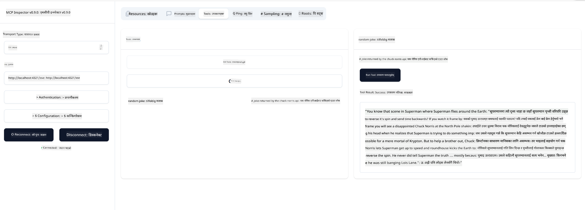

<!--
CO_OP_TRANSLATOR_METADATA:
{
  "original_hash": "3dd2f1e39277c31b0e57e29d165354d6",
  "translation_date": "2025-06-12T23:27:33+00:00",
  "source_file": "03-GettingStarted/05-sse-server/README.md",
  "language_code": "ne"
}
-->
अब हामीसँग SSE को बारेमा अलि बढी जानकारी छ, अब एक SSE सर्भर बनाऔं।

## अभ्यास: SSE सर्भर बनाउने

हाम्रो सर्भर बनाउनका लागि दुई कुरा ध्यानमा राख्नुपर्छ:

- कनेक्शन र म्यासेजहरूका लागि एन्डपोइन्टहरू खोल्न वेब सर्भर प्रयोग गर्नुपर्छ।
- stdio प्रयोग गर्दा जस्तै उपकरणहरू, स्रोतहरू र प्रॉम्प्टहरू प्रयोग गरेर सर्भर बनाउनुहोस्।

### -1- सर्भर इन्स्ट्यान्स बनाउने

सर्भर बनाउन हामी stdio सँग प्रयोग गरेका त्यहि प्रकारहरू प्रयोग गर्छौं। तर ट्रान्सपोर्टका लागि SSE छान्नु पर्छ।

अब आवश्यक रुटहरू थपौं।

### -2- रुटहरू थप्ने

अब कनेक्शन र आउने म्यासेजहरू ह्यान्डल गर्ने रुटहरू थपौं।

अब सर्भरका क्षमता थपौं।

### -3- सर्भर क्षमताहरू थप्ने

अब हामीले SSE सम्बन्धी सबै कुरा परिभाषित गरिसकेपछि, उपकरणहरू, प्रॉम्प्टहरू र स्रोतहरू जस्ता सर्भर क्षमताहरू थपौं।

तपाईंको पूर्ण कोड यसरी देखिनु पर्छ:

अद्भुत, हामीसँग SSE प्रयोग गरेर सर्भर छ, अब यसलाई परीक्षण गरौं।

## अभ्यास: Inspector सँग SSE सर्भर डिबग गर्ने

Inspector एउटा उत्कृष्ट उपकरण हो जुन हामीले अघिल्लो पाठ [Creating your first server](/03-GettingStarted/01-first-server/README.md) मा देखेका थियौं। अब हेर्नुहोस् कि हामी यहाँ पनि Inspector प्रयोग गर्न सक्छौं कि छैन:

### -1- Inspector चलाउने

Inspector चलाउन पहिले SSE सर्भर चलिरहेको हुनुपर्छ, त्यसैले अब सर्भर चलाऔं:

1. सर्भर चलाउनुहोस्

1. Inspector चलाउनुहोस्

    > [!NOTE]
    > यसलाई सर्भर चलिरहेको टर्मिनलभन्दा अलग टर्मिनल विन्डोमा चलाउनुहोस्। साथै, तलको कमाण्डलाई तपाईंको सर्भर चलिरहेको URL अनुसार समायोजन गर्नुपर्नेछ।

    ```sh
    npx @modelcontextprotocol/inspector --cli http://localhost:8000/sse --method tools/list
    ```

Inspector चलाउने तरिका सबै रनटाइममा उस्तै हुन्छ। यहाँ हामीले सर्भरको पथ र सर्भर सुरु गर्ने कमाण्ड नदिई, सर्भर चलिरहेको URL र `/sse` रुट दिएको छ।

### -2- उपकरण प्रयोग गर्ने प्रयास

ड्रपडाउन्डलिस्टबाट SSE छान्नुहोस् र तपाईंको सर्भर चलिरहेको URL जस्तै http:localhost:4321/sse भर्नुहोस्। अब "Connect" बटन थिच्नुहोस्। पहिले जस्तै, उपकरणहरू सूचीबद्ध गर्नुहोस्, एउटा उपकरण छान्नुहोस् र इनपुट मानहरू दिनुहोस्। तपाईंलाई तलको जस्तो परिणाम देखिनुपर्छ:



अद्भुत, तपाईं Inspector सँग काम गर्न सक्षम हुनुहुन्छ, अब Visual Studio Code सँग कसरी काम गर्ने हेरौं।

## असाइनमेन्ट

आफ्नो सर्भर थप क्षमताहरू सहित बनाउन प्रयास गर्नुहोस्। उदाहरणका लागि, [यो पृष्ठ](https://api.chucknorris.io/) हेर्नुहोस् र एउटा उपकरण थप्नुहोस् जुन API कल गर्छ, सर्भर कस्तो देखिनुपर्छ तपाईंले निर्णय गर्नुहोस्। रमाइलो गर्नुहोस् :)

## समाधान

[समाधान](./solution/README.md) यहाँ एक सम्भावित समाधान छ जुन काम गर्ने कोडसहित छ।

## मुख्य सिकाइहरू

यस अध्यायबाट मुख्य सिकाइहरू:

- SSE stdio पछि दोस्रो समर्थित ट्रान्सपोर्ट हो।
- SSE समर्थन गर्न, वेब फ्रेमवर्क प्रयोग गरेर आउने कनेक्शन र म्यासेजहरू व्यवस्थापन गर्नुपर्छ।
- Inspector र Visual Studio Code दुबै SSE सर्भर उपभोग गर्न प्रयोग गर्न सकिन्छ, stdio सर्भरहरू जस्तै। तर stdio र SSE बीच केही भिन्नता छ। SSE मा सर्भर अलगबाट सुरु गर्नुपर्छ र Inspector उपकरण चलाउनुपर्छ। Inspector मा URL निर्दिष्ट गर्नुपर्ने हुन्छ।

## नमूनाहरू

- [Java Calculator](../samples/java/calculator/README.md)
- [.Net Calculator](../../../../03-GettingStarted/samples/csharp)
- [JavaScript Calculator](../samples/javascript/README.md)
- [TypeScript Calculator](../samples/typescript/README.md)
- [Python Calculator](../../../../03-GettingStarted/samples/python)

## अतिरिक्त स्रोतहरू

- [SSE](https://developer.mozilla.org/en-US/docs/Web/API/Server-sent_events)

## अब के?

- अर्को: [HTTP Streaming with MCP (Streamable HTTP)](/03-GettingStarted/06-http-streaming/README.md)

**अस्वीकरण**:  
यो दस्तावेज़ AI अनुवाद सेवा [Co-op Translator](https://github.com/Azure/co-op-translator) को प्रयोग गरी अनुवाद गरिएको हो। हामी शुद्धताको प्रयास गर्छौं, तर कृपया जान्नुहोस् कि स्वचालित अनुवादमा त्रुटिहरू वा अशुद्धिहरू हुन सक्छन्। मूल दस्तावेज़ यसको मूल भाषामा नै आधिकारिक स्रोत मानिनु पर्छ। महत्वपूर्ण जानकारीको लागि, व्यावसायिक मानव अनुवाद सिफारिस गरिन्छ। यस अनुवादको प्रयोगबाट उत्पन्न कुनै पनि गलतफहमी वा गलत व्याख्याको लागि हामी जिम्मेवार छैनौं।