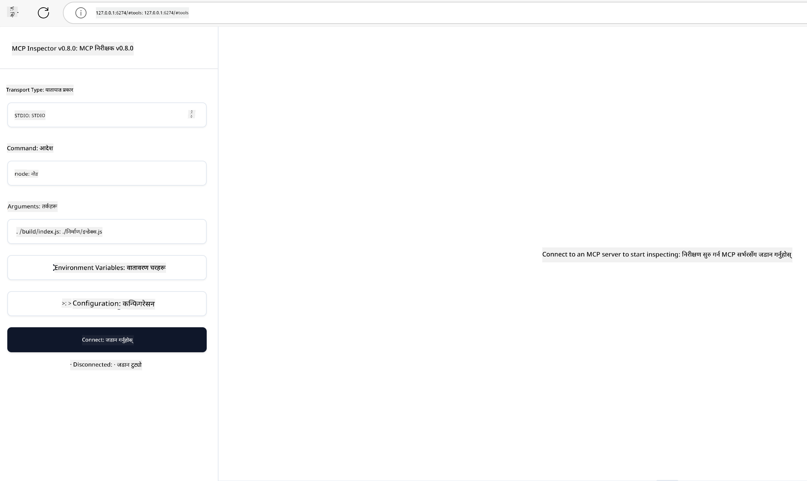

<!--
CO_OP_TRANSLATOR_METADATA:
{
  "original_hash": "4e34e34e84f013e73c7eaa6d09884756",
  "translation_date": "2025-07-13T21:59:15+00:00",
  "source_file": "03-GettingStarted/08-testing/README.md",
  "language_code": "ne"
}
-->
## परीक्षण र डिबगिङ

तपाईंले आफ्नो MCP सर्भर परीक्षण गर्न सुरु गर्नु अघि, उपलब्ध उपकरणहरू र डिबगिङका लागि उत्तम अभ्यासहरू बुझ्नु महत्वपूर्ण छ। प्रभावकारी परीक्षणले तपाईंको सर्भरले अपेक्षित रूपमा काम गर्छ भन्ने सुनिश्चित गर्छ र समस्याहरू छिटो पत्ता लगाउन र समाधान गर्न मद्दत गर्छ। तलको खण्डले तपाईंको MCP कार्यान्वयन प्रमाणित गर्न सिफारिस गरिएका तरिकाहरूलाई वर्णन गर्दछ।

## अवलोकन

यस पाठले सही परीक्षण विधि चयन गर्ने र सबैभन्दा प्रभावकारी परीक्षण उपकरणको बारेमा बताउँछ।

## सिकाइ उद्देश्यहरू

यस पाठको अन्त्यसम्म, तपाईं सक्षम हुनुहुनेछ:

- परीक्षणका विभिन्न तरिकाहरू वर्णन गर्न।
- विभिन्न उपकरणहरू प्रयोग गरेर आफ्नो कोड प्रभावकारी रूपमा परीक्षण गर्न।

## MCP सर्भरहरू परीक्षण गर्ने

MCP ले तपाईंलाई सर्भरहरू परीक्षण र डिबग गर्न मद्दत गर्ने उपकरणहरू प्रदान गर्छ:

- **MCP Inspector**: कमाण्ड लाइन उपकरण जुन CLI र भिजुअल दुवै रूपमा चलाउन सकिन्छ।
- **म्यानुअल परीक्षण**: curl जस्ता उपकरण प्रयोग गरेर वेब अनुरोधहरू चलाउन सकिन्छ, तर HTTP चलाउन सक्ने कुनै पनि उपकरण प्रयोग गर्न सकिन्छ।
- **युनिट परीक्षण**: तपाईंले आफ्नो मनपर्ने परीक्षण फ्रेमवर्क प्रयोग गरेर सर्भर र क्लाइन्ट दुबैका सुविधाहरू परीक्षण गर्न सक्नुहुन्छ।

### MCP Inspector प्रयोग गर्ने

हामीले यस उपकरणको प्रयोग अघिल्ला पाठहरूमा वर्णन गरिसकेका छौं, तर यहाँ यसको बारेमा संक्षिप्त रूपमा कुरा गरौं। यो Node.js मा बनेको उपकरण हो र तपाईंले `npx` executable कल गरेर यसलाई प्रयोग गर्न सक्नुहुन्छ, जसले उपकरणलाई अस्थायी रूपमा डाउनलोड र इन्स्टल गर्छ र तपाईंको अनुरोध चलाएपछि आफैं सफा गर्छ।

[MCP Inspector](https://github.com/modelcontextprotocol/inspector) तपाईंलाई मद्दत गर्छ:

- **सर्भर क्षमताहरू पत्ता लगाउने**: उपलब्ध स्रोतहरू, उपकरणहरू, र प्रॉम्प्टहरू स्वचालित रूपमा पत्ता लगाउने
- **उपकरण कार्यान्वयन परीक्षण गर्ने**: विभिन्न प्यारामिटरहरू प्रयास गर्ने र वास्तविक समयमा प्रतिक्रिया हेर्ने
- **सर्भर मेटाडाटा हेर्ने**: सर्भर जानकारी, स्किमाहरू, र कन्फिगरेसनहरू जाँच गर्ने

उपकरणको सामान्य चलाउने तरिका यसरी देखिन्छ:

```bash
npx @modelcontextprotocol/inspector node build/index.js
```

माथिको कमाण्डले MCP र यसको भिजुअल इन्टरफेस सुरु गर्छ र तपाईंको ब्राउजरमा स्थानीय वेब इन्टरफेस खोल्छ। तपाईंले आफ्नो दर्ता गरिएका MCP सर्भरहरू, तिनीहरूको उपलब्ध उपकरणहरू, स्रोतहरू, र प्रॉम्प्टहरू देख्न सक्नुहुन्छ। इन्टरफेसले तपाईंलाई अन्तरक्रियात्मक रूपमा उपकरण कार्यान्वयन परीक्षण गर्न, सर्भर मेटाडाटा निरीक्षण गर्न, र वास्तविक समय प्रतिक्रियाहरू हेर्न अनुमति दिन्छ, जसले तपाईंको MCP सर्भर कार्यान्वयनहरू प्रमाणित र डिबग गर्न सजिलो बनाउँछ।

यसरी देखिन सक्छ: 

तपाईं यस उपकरणलाई CLI मोडमा पनि चलाउन सक्नुहुन्छ, जसका लागि `--cli` एट्रिब्युट थप्नुहोस्। यहाँ "CLI" मोडमा उपकरण चलाउने उदाहरण छ जसले सर्भरमा रहेका सबै उपकरणहरू सूचीबद्ध गर्छ:

```sh
npx @modelcontextprotocol/inspector --cli node build/index.js --method tools/list
```

### म्यानुअल परीक्षण

सर्भर क्षमताहरू परीक्षण गर्न inspector उपकरण चलाउने बाहेक, अर्को समान तरिका HTTP चलाउन सक्ने क्लाइन्ट जस्तै curl प्रयोग गर्नु हो।

curl प्रयोग गरेर, तपाईं MCP सर्भरहरूलाई सिधै HTTP अनुरोधहरू मार्फत परीक्षण गर्न सक्नुहुन्छ:

```bash
# Example: Test server metadata
curl http://localhost:3000/v1/metadata

# Example: Execute a tool
curl -X POST http://localhost:3000/v1/tools/execute \
  -H "Content-Type: application/json" \
  -d '{"name": "calculator", "parameters": {"expression": "2+2"}}'
```

माथिको curl प्रयोगबाट देख्न सकिन्छ कि तपाईंले उपकरणको नाम र त्यसका प्यारामिटरहरू समावेश गर्ने पेलोड प्रयोग गरेर POST अनुरोध पठाउनुहुन्छ। तपाईंलाई सबैभन्दा उपयुक्त तरिका प्रयोग गर्नुहोस्। CLI उपकरणहरू सामान्यतया छिटो चलाउन मिल्छन् र स्क्रिप्टिङका लागि उपयुक्त हुन्छन्, जुन CI/CD वातावरणमा उपयोगी हुन सक्छ।

### युनिट परीक्षण

तपाईंका उपकरण र स्रोतहरूको युनिट परीक्षणहरू सिर्जना गर्नुहोस् ताकि तिनीहरू अपेक्षित रूपमा काम गर्छन् भन्ने सुनिश्चित होस्। यहाँ केही परीक्षण कोडको उदाहरण छ।

```python
import pytest

from mcp.server.fastmcp import FastMCP
from mcp.shared.memory import (
    create_connected_server_and_client_session as create_session,
)

# Mark the whole module for async tests
pytestmark = pytest.mark.anyio


async def test_list_tools_cursor_parameter():
    """Test that the cursor parameter is accepted for list_tools.

    Note: FastMCP doesn't currently implement pagination, so this test
    only verifies that the cursor parameter is accepted by the client.
    """

 server = FastMCP("test")

    # Create a couple of test tools
    @server.tool(name="test_tool_1")
    async def test_tool_1() -> str:
        """First test tool"""
        return "Result 1"

    @server.tool(name="test_tool_2")
    async def test_tool_2() -> str:
        """Second test tool"""
        return "Result 2"

    async with create_session(server._mcp_server) as client_session:
        # Test without cursor parameter (omitted)
        result1 = await client_session.list_tools()
        assert len(result1.tools) == 2

        # Test with cursor=None
        result2 = await client_session.list_tools(cursor=None)
        assert len(result2.tools) == 2

        # Test with cursor as string
        result3 = await client_session.list_tools(cursor="some_cursor_value")
        assert len(result3.tools) == 2

        # Test with empty string cursor
        result4 = await client_session.list_tools(cursor="")
        assert len(result4.tools) == 2
    
```

माथिको कोडले निम्न कामहरू गर्छ:

- pytest फ्रेमवर्क प्रयोग गर्छ जसले तपाईंलाई परीक्षणहरू फंक्शनको रूपमा सिर्जना गर्न र assert स्टेटमेन्टहरू प्रयोग गर्न अनुमति दिन्छ।
- दुई फरक उपकरणहरू सहित MCP सर्भर सिर्जना गर्छ।
- निश्चित सर्तहरू पूरा भए नभएको जाँच्न `assert` स्टेटमेन्ट प्रयोग गर्छ।

[पूर्ण फाइल यहाँ हेर्नुहोस्](https://github.com/modelcontextprotocol/python-sdk/blob/main/tests/client/test_list_methods_cursor.py)

माथिको फाइलको आधारमा, तपाईं आफ्नो सर्भर परीक्षण गर्न सक्नुहुन्छ र क्षमताहरू ठीकसँग सिर्जना भएका छन् कि छैनन् भनेर सुनिश्चित गर्न सक्नुहुन्छ।

सबै प्रमुख SDK हरूमा यस्तै परीक्षण खण्डहरू हुन्छन्, त्यसैले तपाईंले आफ्नो रोजेको रनटाइम अनुसार समायोजन गर्न सक्नुहुन्छ।

## नमूनाहरू

- [Java Calculator](../samples/java/calculator/README.md)
- [.Net Calculator](../../../../03-GettingStarted/samples/csharp)
- [JavaScript Calculator](../samples/javascript/README.md)
- [TypeScript Calculator](../samples/typescript/README.md)
- [Python Calculator](../../../../03-GettingStarted/samples/python)

## थप स्रोतहरू

- [Python SDK](https://github.com/modelcontextprotocol/python-sdk)

## के छ अर्को

- अर्को: [Deployment](../09-deployment/README.md)

**अस्वीकरण**:  
यो दस्तावेज AI अनुवाद सेवा [Co-op Translator](https://github.com/Azure/co-op-translator) प्रयोग गरी अनुवाद गरिएको हो। हामी शुद्धताका लागि प्रयासरत छौं, तर कृपया ध्यान दिनुहोस् कि स्वचालित अनुवादमा त्रुटि वा अशुद्धता हुन सक्छ। मूल दस्तावेज यसको मूल भाषामा नै अधिकारिक स्रोत मानिनु पर्छ। महत्वपूर्ण जानकारीका लागि व्यावसायिक मानव अनुवाद सिफारिस गरिन्छ। यस अनुवादको प्रयोगबाट उत्पन्न कुनै पनि गलतफहमी वा गलत व्याख्याका लागि हामी जिम्मेवार छैनौं।