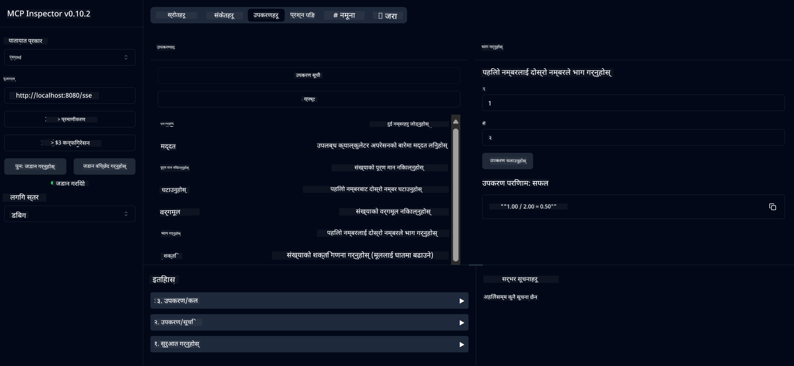

<!--
CO_OP_TRANSLATOR_METADATA:
{
  "original_hash": "13231e9951b68efd9df8c56bd5cdb27e",
  "translation_date": "2025-05-17T13:08:49+00:00",
  "source_file": "03-GettingStarted/samples/java/calculator/README.md",
  "language_code": "ne"
}
-->
# बेसिक क्यालकुलेटर MCP सेवा

यो सेवा मोडेल कन्टेक्स्ट प्रोटोकल (MCP) मार्फत स्प्रिङ बुटको वेबफ्लक्स ट्रान्सपोर्ट प्रयोग गरेर बेसिक क्यालकुलेटर अपरेसनहरू प्रदान गर्छ। यो MCP कार्यान्वयनहरूको बारेमा सिक्ने नयाँ व्यक्तिहरूको लागि सरल उदाहरणको रूपमा डिजाइन गरिएको छ।

थप जानकारीको लागि [MCP Server Boot Starter](https://docs.spring.io/spring-ai/reference/api/mcp/mcp-server-boot-starter-docs.html) सन्दर्भ दस्तावेज हेर्नुहोस्।

## अवलोकन

सेवाले निम्न कुराहरू प्रदर्शन गर्दछ:
- SSE (सर्भर-सेन्ट इभेन्ट्स) को समर्थन
- स्प्रिङ AI को `@Tool` एनोटेसन प्रयोग गरेर स्वत: उपकरण दर्ता
- बेसिक क्यालकुलेटर फङ्सनहरू:
  - जोड, घटाउ, गुणन, भाग
  - शक्ति गणना र वर्गमूल
  - मोडुलस (बाँकी) र पूर्ण मान
  - अपरेसन विवरणहरूको लागि सहयोग फङ्सन

## विशेषताहरू

यो क्यालकुलेटर सेवाले निम्न क्षमताहरू प्रदान गर्दछ:

1. **बेसिक अंकगणितीय अपरेसनहरू**:
   - दुई संख्याको जोड
   - एक संख्याबाट अर्को संख्या घटाउनु
   - दुई संख्याको गुणन
   - एक संख्यालाई अर्को संख्याबाट भाग गर्नु (शून्य भाग जाँच सहित)

2. **उन्नत अपरेसनहरू**:
   - शक्ति गणना (आधारलाई घातांकमा उठाउनु)
   - वर्गमूल गणना (नकारात्मक संख्या जाँच सहित)
   - मोडुलस (बाँकी) गणना
   - पूर्ण मान गणना

3. **सहयोग प्रणाली**:
   - उपलब्ध सबै अपरेसनहरू व्याख्या गर्ने बिल्ट-इन सहयोग फङ्सन

## सेवा प्रयोग गर्दै

सेवाले MCP प्रोटोकल मार्फत निम्न API अन्तर्क्रिया प्रदान गर्दछ:

- `add(a, b)`: दुई संख्यालाई सँगै जोड्नुहोस्
- `subtract(a, b)`: पहिलो संख्याबाट दोस्रो संख्या घटाउनुहोस्
- `multiply(a, b)`: दुई संख्याको गुणन गर्नुहोस्
- `divide(a, b)`: पहिलो संख्यालाई दोस्रो संख्याबाट भाग गर्नुहोस् (शून्य जाँच सहित)
- `power(base, exponent)`: संख्याको शक्ति गणना गर्नुहोस्
- `squareRoot(number)`: वर्गमूल गणना गर्नुहोस् (नकारात्मक संख्या जाँच सहित)
- `modulus(a, b)`: भाग गर्दा बाँकी गणना गर्नुहोस्
- `absolute(number)`: पूर्ण मान गणना गर्नुहोस्
- `help()`: उपलब्ध अपरेसनहरूको बारेमा जानकारी प्राप्त गर्नुहोस्

## परीक्षण क्लाइन्ट

`com.microsoft.mcp.sample.client` प्याकेजमा एक सरल परीक्षण क्लाइन्ट समावेश गरिएको छ। `SampleCalculatorClient` क्लासले क्यालकुलेटर सेवाको उपलब्ध अपरेसनहरू प्रदर्शन गर्दछ।

## LangChain4j क्लाइन्ट प्रयोग गर्दै

यो परियोजनामा `com.microsoft.mcp.sample.client.LangChain4jClient` मा एक LangChain4j उदाहरण क्लाइन्ट समावेश गरिएको छ जसले क्यालकुलेटर सेवालाई LangChain4j र GitHub मोडेलहरूसँग कसरी एकीकृत गर्ने प्रदर्शन गर्दछ:

### पूर्वापेक्षाहरू

1. **GitHub टोकन सेटअप**:

   GitHub को AI मोडेलहरू (जस्तै phi-4) प्रयोग गर्न, तपाईंलाई GitHub व्यक्तिगत पहुँच टोकन आवश्यक छ:

   a. आफ्नो GitHub खाता सेटिङमा जानुहोस्: https://github.com/settings/tokens
   
   b. "Generate new token" → "Generate new token (classic)" मा क्लिक गर्नुहोस्
   
   c. आफ्नो टोकनलाई वर्णनात्मक नाम दिनुहोस्
   
   d. निम्न स्कोपहरू चयन गर्नुहोस्:
      - `repo` (निजी रिपोजिटोरीहरूको पूर्ण नियन्त्रण)
      - `read:org` (संस्था र टोली सदस्यता पढ्नुहोस्, संस्था परियोजनाहरू पढ्नुहोस्)
      - `gist` (गिस्टहरू सिर्जना गर्नुहोस्)
      - `user:email` (प्रयोगकर्ता इमेल ठेगानाहरू पहुँच गर्नुहोस् (पढ्न मात्र))
   
   e. "Generate token" मा क्लिक गर्नुहोस् र आफ्नो नयाँ टोकन प्रतिलिपि गर्नुहोस्
   
   f. यसलाई वातावरण चरको रूपमा सेट गर्नुहोस्:
      
      Windows मा:
      ```
      set GITHUB_TOKEN=your-github-token
      ```
      
      macOS/Linux मा:
      ```bash
      export GITHUB_TOKEN=your-github-token
      ```

   g. स्थायी सेटअपको लागि, आफ्नो वातावरण चरहरू प्रणाली सेटिङहरू मार्फत थप्नुहोस्

2. आफ्नो परियोजनामा LangChain4j GitHub निर्भरता थप्नुहोस् (पहिले नै pom.xml मा समावेश गरिएको छ):
   ```xml
   <dependency>
       <groupId>dev.langchain4j</groupId>
       <artifactId>langchain4j-github</artifactId>
       <version>${langchain4j.version}</version>
   </dependency>
   ```

3. सुनिश्चित गर्नुहोस् कि क्यालकुलेटर सर्भर `localhost:8080` मा चलिरहेको छ

### LangChain4j क्लाइन्ट चलाउँदै

यो उदाहरणले प्रदर्शन गर्दछ:
- SSE ट्रान्सपोर्ट मार्फत क्यालकुलेटर MCP सर्भरमा जडान गर्नुहोस्
- क्यालकुलेटर अपरेसनहरू प्रयोग गर्ने च्याट बोट बनाउन LangChain4j प्रयोग गर्नुहोस्
- GitHub AI मोडेलहरूसँग एकीकृत गर्नुहोस् (अहिले phi-4 मोडेल प्रयोग गर्दै)

क्लाइन्टले कार्यक्षमता प्रदर्शन गर्न निम्न नमूना प्रश्नहरू पठाउँछ:
1. दुई संख्याको जोड गणना गर्दै
2. संख्याको वर्गमूल खोज्दै
3. उपलब्ध क्यालकुलेटर अपरेसनहरूको बारेमा सहयोग जानकारी प्राप्त गर्दै

उदाहरण चलाउनुहोस् र AI मोडेलले क्यालकुलेटर उपकरणहरू प्रयोग गरेर प्रश्नहरूको जवाफ कसरी दिन्छ हेर्न कन्सोल आउटपुट जाँच गर्नुहोस्।

### GitHub मोडेल कन्फिगरेसन

LangChain4j क्लाइन्ट GitHub को phi-4 मोडेल निम्न सेटिङहरूसँग प्रयोग गर्न कन्फिगर गरिएको छ:

```java
ChatLanguageModel model = GitHubChatModel.builder()
    .apiKey(System.getenv("GITHUB_TOKEN"))
    .timeout(Duration.ofSeconds(60))
    .modelName("phi-4")
    .logRequests(true)
    .logResponses(true)
    .build();
```

विभिन्न GitHub मोडेलहरू प्रयोग गर्न, `modelName` प्यारामिटरलाई अर्को समर्थित मोडेलमा परिवर्तन गर्नुहोस् (जस्तै, "claude-3-haiku-20240307", "llama-3-70b-8192", आदि)।

## निर्भरताहरू

परियोजनाले निम्न प्रमुख निर्भरताहरू आवश्यक छ:

```xml
<!-- For MCP Server -->
<dependency>
    <groupId>org.springframework.ai</groupId>
    <artifactId>spring-ai-starter-mcp-server-webflux</artifactId>
</dependency>

<!-- For LangChain4j integration -->
<dependency>
    <groupId>dev.langchain4j</groupId>
    <artifactId>langchain4j-mcp</artifactId>
    <version>${langchain4j.version}</version>
</dependency>

<!-- For GitHub models support -->
<dependency>
    <groupId>dev.langchain4j</groupId>
    <artifactId>langchain4j-github</artifactId>
    <version>${langchain4j.version}</version>
</dependency>
```

## परियोजना निर्माण गर्दै

Maven प्रयोग गरेर परियोजना निर्माण गर्नुहोस्:
```bash
./mvnw clean install -DskipTests
```

## सर्भर चलाउँदै

### Java प्रयोग गर्दै

```bash
java -jar target/calculator-server-0.0.1-SNAPSHOT.jar
```

### MCP Inspector प्रयोग गर्दै

MCP Inspector MCP सेवाहरूसँग अन्तरक्रिया गर्नको लागि एक उपयोगी उपकरण हो। यसलाई यो क्यालकुलेटर सेवासँग प्रयोग गर्न:

1. **MCP Inspector स्थापना र चलाउनुहोस्** नयाँ टर्मिनल विन्डोमा:
   ```bash
   npx @modelcontextprotocol/inspector
   ```

2. **वेब UI पहुँच गर्नुहोस्** एपले देखाएको URL मा क्लिक गरेर (सामान्यतया http://localhost:6274)

3. **जडान कन्फिगर गर्नुहोस्**:
   - ट्रान्सपोर्ट प्रकारलाई "SSE" मा सेट गर्नुहोस्
   - आफ्नो चलिरहेको सर्भरको SSE अन्तर्क्रिया URL सेट गर्नुहोस्: `http://localhost:8080/sse`
   - "Connect" मा क्लिक गर्नुहोस्

4. **उपकरणहरू प्रयोग गर्नुहोस्**:
   - उपलब्ध क्यालकुलेटर अपरेसनहरू हेर्न "List Tools" मा क्लिक गर्नुहोस्
   - उपकरण चयन गर्नुहोस् र अपरेसन कार्यान्वयन गर्न "Run Tool" मा क्लिक गर्नुहोस्



### Docker प्रयोग गर्दै

परियोजनाले कन्टेनराइज्ड डिप्लोयमेन्टको लागि Dockerfile समावेश गर्दछ:

1. **Docker छवि निर्माण गर्नुहोस्**:
   ```bash
   docker build -t calculator-mcp-service .
   ```

2. **Docker कन्टेनर चलाउनुहोस्**:
   ```bash
   docker run -p 8080:8080 calculator-mcp-service
   ```

यसले:
- Maven 3.9.9 र Eclipse Temurin 24 JDK सहित बहु-चरण Docker छवि निर्माण गर्नुहोस्
- एक अनुकूलित कन्टेनर छवि सिर्जना गर्नुहोस्
- सेवा पोर्ट 8080 मा एक्सपोज गर्नुहोस्
- कन्टेनर भित्र MCP क्यालकुलेटर सेवा सुरु गर्नुहोस्

कन्टेनर चलिरहेको भएपछि तपाईं `http://localhost:8080` मा सेवा पहुँच गर्न सक्नुहुन्छ।

## समस्या समाधान

### GitHub टोकनसँग सामान्य समस्या

1. **टोकन अनुमति समस्या**: यदि तपाईंलाई 403 Forbidden त्रुटि प्राप्त हुन्छ भने, आफ्नो टोकनसँग पूर्वापेक्षाहरूमा उल्लिखित सही अनुमति छ कि छैन जाँच गर्नुहोस्।

2. **टोकन फेला परेन**: यदि तपाईंलाई "No API key found" त्रुटि प्राप्त हुन्छ भने, GITHUB_TOKEN वातावरण चर ठीकसँग सेट गरिएको छ कि छैन सुनिश्चित गर्नुहोस्।

3. **रेट लिमिटिंग**: GitHub API मा रेट सीमाहरू छन्। यदि तपाईंलाई रेट लिमिट त्रुटि (स्टेटस कोड 429) प्राप्त हुन्छ भने, केही मिनेट पर्खेर पुन: प्रयास गर्नुहोस्।

4. **टोकन समाप्ति**: GitHub टोकनहरू समाप्त हुन सक्छन्। केही समयपछि प्रमाणीकरण त्रुटिहरू प्राप्त भएमा, नयाँ टोकन उत्पन्न गर्नुहोस् र आफ्नो वातावरण चर अपडेट गर्नुहोस्।

यदि तपाईंलाई थप सहायता आवश्यक छ भने, [LangChain4j दस्तावेज](https://github.com/langchain4j/langchain4j) वा [GitHub API दस्तावेज](https://docs.github.com/en/rest) हेर्नुहोस्।

**अस्वीकरण**:  
यो दस्तावेज़ AI अनुवाद सेवा [Co-op Translator](https://github.com/Azure/co-op-translator) प्रयोग गरेर अनुवाद गरिएको हो। हामी शुद्धताको लागि प्रयास गर्छौं, तर कृपया ध्यान दिनुहोस् कि स्वचालित अनुवादहरूमा त्रुटिहरू वा अशुद्धताहरू हुन सक्छन्। यसको मौलिक भाषामा रहेको मूल दस्तावेजलाई प्राधिकृत स्रोतको रूपमा मानिनुपर्छ। महत्वपूर्ण जानकारीको लागि, व्यावसायिक मानव अनुवाद सिफारिस गरिन्छ। यो अनुवादको प्रयोगबाट उत्पन्न कुनै पनि गलतफहमी वा गलत व्याख्याका लागि हामी जिम्मेवार हुनेछैनौं।